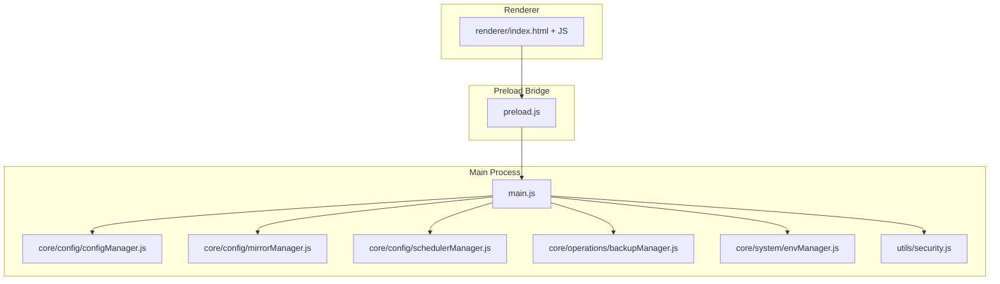
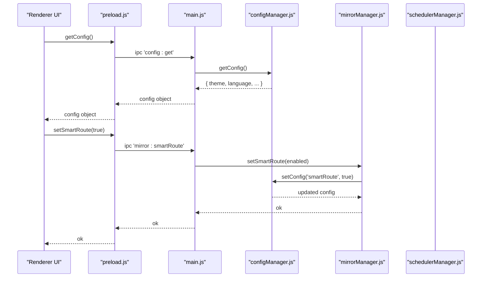
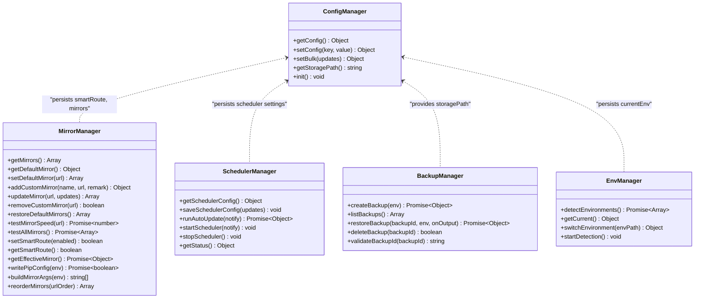
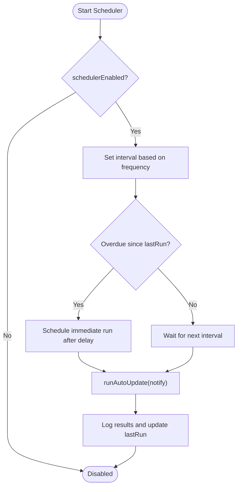
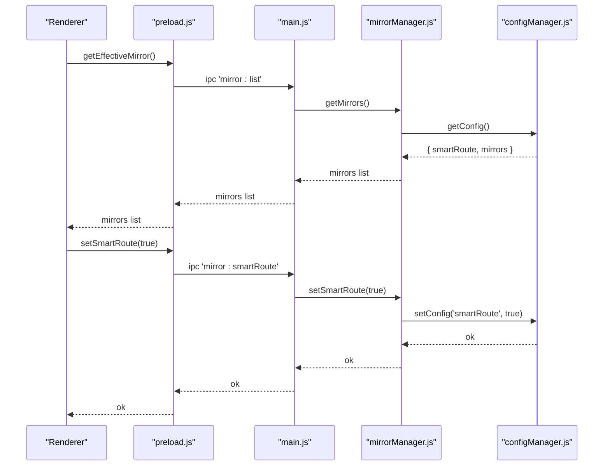
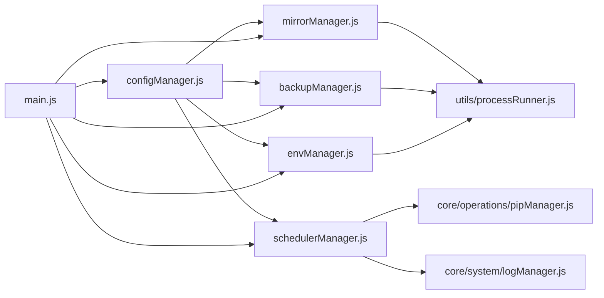

# Configuration & Settings

<cite>
**Referenced Files in This Document**
- [configManager.js](file://core/config/configManager.js)
- [mirrorManager.js](file://core/config/mirrorManager.js)
- [schedulerManager.js](file://core/config/schedulerManager.js)
- [backupManager.js](file://core/operations/backupManager.js)
- [envManager.js](file://core/system/envManager.js)
- [main.js](file://main.js)
- [preload.js](file://preload.js)
- [security.js](file://utils/security.js)
- [package.json](file://package.json)
</cite>

## Table of Contents
1. [Introduction](#introduction)
2. [Project Structure](#project-structure)
3. [Core Components](#core-components)
4. [Architecture Overview](#architecture-overview)
5. [Detailed Component Analysis](#detailed-component-analysis)
6. [Dependency Analysis](#dependency-analysis)
7. [Performance Considerations](#performance-considerations)
8. [Troubleshooting Guide](#troubleshooting-guide)
9. [Conclusion](#conclusion)
10. [Appendices](#appendices)

## Introduction
This document explains PyLibMaster’s configuration system, including all available settings, data types, defaults, validation rules, file structure, environment-specific overrides, runtime changes, and advanced options for parallel processing, retries, timeouts, and security policies. It also covers scheduler configuration for automated tasks, mirror source management, migration guidance, backup procedures, and troubleshooting common issues.

## Project Structure
PyLibMaster is an Electron application with a clear separation between the main process (Node.js), preload bridge, renderer UI, and core modules. Configuration-related logic resides primarily under core/config, with supporting operations in core/operations and core/system. The IPC layer in main.js and preload.js exposes configuration APIs to the renderer.

**Diagram sources**
- [main.js:1-120](file://main.js#L1-L120)
- [preload.js:1-120](file://preload.js#L1-L120)
- [configManager.js:1-120](file://core/config/configManager.js#L1-L120)
- [mirrorManager.js:1-120](file://core/config/mirrorManager.js#L1-L120)
- [schedulerManager.js:1-60](file://core/config/schedulerManager.js#L1-L60)
- [backupManager.js:1-60](file://core/operations/backupManager.js#L1-L60)
- [envManager.js:1-60](file://core/system/envManager.js#L1-L60)
- [security.js:1-43](file://utils/security.js#L1-L43)

**Section sources**
- [main.js:1-120](file://main.js#L1-L120)
- [preload.js:1-120](file://preload.js#L1-L120)

## Core Components
- Config Manager: Centralized persistence and validation for application settings.
- Mirror Manager: Manages PyPI mirror sources, speed testing, smart routing, and pip config integration.
- Scheduler Manager: Handles automated update scheduling with whitelist support and status persistence.
- Backup Manager: Creates and restores backups using pip freeze; integrates with storage path from config.
- Environment Manager: Detects Python environments and persists current selection via config.
- Security Utilities: Path safety checks used by IPC handlers.

Key responsibilities:
- Provide safe read/write accessors for configuration values.
- Validate and sanitize numeric ranges and types.
- Persist atomic writes to avoid corruption.
- Expose IPC endpoints for UI-driven configuration changes.

**Section sources**
- [configManager.js:1-194](file://core/config/configManager.js#L1-L194)
- [mirrorManager.js:1-376](file://core/config/mirrorManager.js#L1-L376)
- [schedulerManager.js:1-197](file://core/config/schedulerManager.js#L1-L197)
- [backupManager.js:1-196](file://core/operations/backupManager.js#L1-L196)
- [envManager.js:1-220](file://core/system/envManager.js#L1-L220)
- [security.js:1-43](file://utils/security.js#L1-L43)

## Architecture Overview
Configuration flows through a layered architecture:
- Renderer calls window.electronAPI methods exposed by preload.js.
- Preload forwards requests via IPC to main.js handlers.
- Main handlers delegate to core modules (configManager, mirrorManager, schedulerManager).
- ConfigManager reads/writes pylibmaster-config.json with atomic writes and validation.
- MirrorManager merges built-in mirrors with user-defined ones and can write pip configuration files.
- SchedulerManager uses config to schedule background updates and persist last run timestamps.

**Diagram sources**
- [preload.js:90-120](file://preload.js#L90-L120)
- [main.js:406-414](file://main.js#L406-L414)
- [main.js:388-391](file://main.js#L388-L391)
- [configManager.js:140-178](file://core/config/configManager.js#L140-L178)
- [mirrorManager.js:249-260](file://core/config/mirrorManager.js#L249-L260)

## Detailed Component Analysis

### Configuration Manager (configManager.js)
Responsibilities:
- Load/save application configuration to JSON file.
- Merge saved settings with defaults.
- Sanitize numeric values within defined ranges.
- Ensure storage directory exists and return storage path.
- Atomic save strategy to prevent corruption.

Default settings and types:
- theme: string (light/dark/system)
- language: string (zh/en)
- storagePath: string (directory for logs/backups)
- parallelThreads: number (1–16, default 4)
- retryCount: number (0–10, default 3)
- smartRoute: boolean (default false)
- currentEnv: object or null (persisted by envManager)
- windowBounds: object { width, height, x, y }

Validation rules:
- Numeric fields are clamped to min/max and rounded to integers.
- Non-number or non-finite values revert to fallback defaults.
- Storage path is created if missing.

File location:
- Windows: %APPDATA%/PyLibMaster/pylibmaster-config.json
- macOS: ~/Library/Application Support/PyLibMaster/pylibmaster-config.json
- Linux: ~/.config/PyLibMaster/pylibmaster-config.json

Runtime behavior:
- init() lazily loads config and ensures directories exist.
- saveConfig() writes to a temporary file then renames atomically.
- getStoragePath() creates the storage directory on demand.

IPC exposure:
- config:get, config:set, config:setBulk handled in main.js.

**Section sources**
- [configManager.js:21-44](file://core/config/configManager.js#L21-L44)
- [configManager.js:56-72](file://core/config/configManager.js#L56-L72)
- [configManager.js:80-117](file://core/config/configManager.js#L80-L117)
- [configManager.js:123-138](file://core/config/configManager.js#L123-L138)
- [configManager.js:144-178](file://core/config/configManager.js#L144-L178)
- [configManager.js:185-191](file://core/config/configManager.js#L185-L191)
- [main.js:406-414](file://main.js#L406-L414)

### Mirror Manager (mirrorManager.js)
Responsibilities:
- Manage built-in and custom PyPI mirrors.
- Validate URLs (http/https only, length limits).
- Maintain exactly one default mirror.
- Test mirror speeds asynchronously.
- Enable smart routing to pick fastest mirror.
- Write pip configuration files per platform.
- Build pip command-line arguments for mirror usage.

Built-in mirrors:
- PyPI official, Tsinghua, Aliyun, Tencent Cloud, Huawei Cloud, Douban.

Key functions:
- loadMirrors(): merge defaults with saved user mirrors, ensure single default.
- addCustomMirror(), updateMirror(), removeCustomMirror(), restoreDefaultMirrors().
- testMirrorSpeed(url), testAllMirrors().
- setSmartRoute(enabled), getSmartRoute().
- getEffectiveMirror(): returns best mirror when smartRoute enabled, else default.
- writePipConfig(env): writes index-url and timeout into pip.ini/pip.conf.
- buildMirrorArgs(env): returns --index-url unless using official PyPI.

Validation:
- URL must be http/https and <= 2048 chars.
- Duplicate URLs prevented during add/update.

Platform-specific pip config paths:
- Windows: %APPDATA%/pip/pip.ini
- macOS/Linux: ~/.config/pip/pip.conf

**Section sources**
- [mirrorManager.js:21-30](file://core/config/mirrorManager.js#L21-L30)
- [mirrorManager.js:43-51](file://core/config/mirrorManager.js#L43-L51)
- [mirrorManager.js:60-91](file://core/config/mirrorManager.js#L60-L91)
- [mirrorManager.js:97-107](file://core/config/mirrorManager.js#L97-L107)
- [mirrorManager.js:139-150](file://core/config/mirrorManager.js#L139-L150)
- [mirrorManager.js:158-179](file://core/config/mirrorManager.js#L158-L179)
- [mirrorManager.js:204-210](file://core/config/mirrorManager.js#L204-L210)
- [mirrorManager.js:219-233](file://core/config/mirrorManager.js#L219-L233)
- [mirrorManager.js:240-247](file://core/config/mirrorManager.js#L240-L247)
- [mirrorManager.js:249-260](file://core/config/mirrorManager.js#L249-L260)
- [mirrorManager.js:267-290](file://core/config/mirrorManager.js#L267-L290)
- [mirrorManager.js:299-322](file://core/config/mirrorManager.js#L299-L322)
- [mirrorManager.js:329-333](file://core/config/mirrorManager.js#L329-L333)
- [mirrorManager.js:340-357](file://core/config/mirrorManager.js#L340-L357)

### Scheduler Manager (schedulerManager.js)
Responsibilities:
- Schedule automatic package updates at daily or weekly intervals.
- Filter out whitelisted packages from auto-updates.
- Persist scheduler state (enabled, frequency, whitelist, lastRun).
- Execute updates in background with logging and optional notifications.

Configuration keys:
- schedulerEnabled: boolean
- schedulerFrequency: 'daily' | 'weekly'
- schedulerWhitelist: array of package names
- schedulerLastRun: ISO timestamp string

Behavior:
- startScheduler(notify): sets interval based on frequency; runs immediately if overdue.
- runAutoUpdate(notify): lists outdated packages, filters whitelist, performs batch update with parallel/retry flags, logs results, updates lastRun.
- getStatus(): returns active, running, and lastRun info.

Integration:
- Uses pipManager for listing outdated and updating packages.
- Logs via logManager.

**Section sources**
- [schedulerManager.js:29-37](file://core/config/schedulerManager.js#L29-L37)
- [schedulerManager.js:43-50](file://core/config/schedulerManager.js#L43-L50)
- [schedulerManager.js:57-59](file://core/config/schedulerManager.js#L57-L59)
- [schedulerManager.js:70-138](file://core/config/schedulerManager.js#L70-L138)
- [schedulerManager.js:145-163](file://core/config/schedulerManager.js#L145-L163)
- [schedulerManager.js:179-187](file://core/config/schedulerManager.js#L179-L187)
- [main.js:140-144](file://main.js#L140-L144)
- [main.js:525-546](file://main.js#L525-L546)

### Backup Manager (backupManager.js)
Responsibilities:
- Create backups using pip freeze into text files.
- List backups sorted by creation time.
- Restore environments by force-reinstalling versions from backup files.
- Delete backups safely with ID validation.

Storage:
- Backups stored under {storagePath}/backups/.
- File naming: backup_{envName}_{timestamp}.txt.

Security:
- Validates backup IDs against strict format and prevents path traversal.

Integration:
- Uses configManager.getStoragePath() for directory resolution.
- Uses processRunner.runPip() for pip commands.

**Section sources**
- [backupManager.js:29-34](file://core/operations/backupManager.js#L29-L34)
- [backupManager.js:46-51](file://core/operations/backupManager.js#L46-L51)
- [backupManager.js:62-78](file://core/operations/backupManager.js#L62-L78)
- [backupManager.js:89-113](file://core/operations/backupManager.js#L89-L113)
- [backupManager.js:122-142](file://core/operations/backupManager.js#L122-L142)
- [backupManager.js:156-170](file://core/operations/backupManager.js#L156-L170)
- [backupManager.js:179-193](file://core/operations/backupManager.js#L179-L193)

### Environment Manager (envManager.js)
Responsibilities:
- Detect installed Python environments across common locations and PATH.
- Retrieve Python and pip versions.
- Persist selected environment via configManager.
- Auto-select first valid environment if none selected.

Integration:
- Uses configManager to store currentEnv.
- Uses processRunner utilities for version detection.

**Section sources**
- [envManager.js:85-170](file://core/system/envManager.js#L85-L170)
- [envManager.js:178-209](file://core/system/envManager.js#L178-L209)
- [envManager.js:215-217](file://core/system/envManager.js#L215-L217)

### Security Utilities (security.js)
Responsibilities:
- Validate that a target path is within allowed directories to prevent path traversal attacks.

Usage:
- Used by main.js IPC handler for opening paths safely.

**Section sources**
- [security.js:28-40](file://utils/security.js#L28-L40)
- [main.js:449-466](file://main.js#L449-L466)

## Architecture Overview
The configuration system integrates multiple managers through IPC and shared persistence.

**Diagram sources**
- [configManager.js:144-178](file://core/config/configManager.js#L144-L178)
- [mirrorManager.js:97-107](file://core/config/mirrorManager.js#L97-L107)
- [schedulerManager.js:29-50](file://core/config/schedulerManager.js#L29-L50)
- [backupManager.js:29-34](file://core/operations/backupManager.js#L29-L34)
- [envManager.js:178-209](file://core/system/envManager.js#L178-L209)

## Detailed Component Analysis

### Configuration Settings Reference
Settings persisted in pylibmaster-config.json:
- theme: string (light/dark/system)
- language: string (zh/en)
- storagePath: string (absolute path to logs/backups directory)
- parallelThreads: number (1–16, default 4)
- retryCount: number (0–10, default 3)
- smartRoute: boolean (default false)
- currentEnv: object or null (name, path, version, pipVersion)
- windowBounds: object { width, height, x, y }
- mirrors: array of mirror objects (managed by mirrorManager)
- schedulerEnabled: boolean
- schedulerFrequency: 'daily' | 'weekly'
- schedulerWhitelist: array of strings
- schedulerLastRun: ISO timestamp string

Data types and defaults:
- Numeric fields validated and clamped to min/max; non-numbers reset to fallback.
- Boolean fields toggle features like smart routing and scheduler enablement.
- String fields include theme/language and storagePath; storagePath auto-created if missing.
- Objects like currentEnv and windowBounds are persisted and restored.

Validation rules:
- parallelThreads: integer within [1, 16].
- retryCount: integer within [0, 10].
- mirror URLs: http/https only, max length 2048.
- backup IDs: strict pattern and no path traversal.

Environment-specific overrides:
- Config directory resolved via Electron app.getPath('userData') when ready; otherwise falls back to APPDATA/HOME/current dir.
- Pip config written to platform-specific locations (%APPDATA%/pip/pip.ini on Windows, ~/.config/pip/pip.conf on macOS/Linux).

Runtime configuration changes:
- UI triggers IPC calls to setConfig/setBulk; configManager sanitizes and saves atomically.
- MirrorManager updates smartRoute and mirrors, saving to config.
- SchedulerManager persists scheduler settings and lastRun timestamps.

Advanced options:
- Parallel processing: parallelThreads controls concurrency for pip operations (used by pipManager via options).
- Retry mechanisms: retryCount influences retry attempts for failed operations.
- Timeout settings: mirror speed tests use 5-second timeout; pip operations have configurable timeouts via processRunner.
- Security policies: path safety checks restrict opened paths to allowed directories; backup ID validation prevents traversal.

Migration guide:
- If config file is corrupted, configManager rebuilds defaults and saves.
- To migrate old settings, ensure new keys exist in defaults; merged behavior preserves user values while applying new defaults.
- For mirror migrations, restoreDefaultMirrors clears custom mirrors and resets to built-ins.

Backup procedures:
- Use backupManager.createBackup(env) to snapshot current environment.
- Store backups under storagePath/backups; list and delete via provided APIs.
- Restore via backupManager.restoreBackup(backupId, env) which force-installs exact versions.

Troubleshooting common issues:
- Config not loading: check file permissions and JSON validity; configManager will rebuild defaults on parse errors.
- Mirror connectivity: use mirror:testAll to measure speeds; verify URLs and network access.
- Scheduler not running: ensure schedulerEnabled is true and frequency is valid; check lastRun and logs.
- Storage path issues: ensure storagePath exists and is writable; configManager creates it automatically.

**Section sources**
- [configManager.js:21-44](file://core/config/configManager.js#L21-L44)
- [configManager.js:80-117](file://core/config/configManager.js#L80-L117)
- [configManager.js:123-138](file://core/config/configManager.js#L123-L138)
- [mirrorManager.js:43-51](file://core/config/mirrorManager.js#L43-L51)
- [mirrorManager.js:299-322](file://core/config/mirrorManager.js#L299-L322)
- [schedulerManager.js:29-50](file://core/config/schedulerManager.js#L29-L50)
- [backupManager.js:62-78](file://core/operations/backupManager.js#L62-L78)
- [envManager.js:178-209](file://core/system/envManager.js#L178-L209)
- [main.js:406-414](file://main.js#L406-L414)

### Scheduler Configuration Flow

**Diagram sources**
- [schedulerManager.js:145-163](file://core/config/schedulerManager.js#L145-L163)
- [schedulerManager.js:70-138](file://core/config/schedulerManager.js#L70-L138)

### Mirror Source Management Flow

**Diagram sources**
- [mirrorManager.js:249-260](file://core/config/mirrorManager.js#L249-L260)
- [mirrorManager.js:60-91](file://core/config/mirrorManager.js#L60-L91)
- [main.js:388-391](file://main.js#L388-L391)
- [preload.js:75-86](file://preload.js#L75-L86)

## Dependency Analysis
Configuration dependencies:
- mirrorManager depends on configManager for persistence and on processRunner for pip interactions.
- schedulerManager depends on configManager for settings and on pipManager/logManager for execution and logging.
- backupManager depends on configManager for storagePath and on processRunner for pip commands.
- envManager depends on configManager to persist currentEnv.
- main.js orchestrates IPC handlers and initializes scheduler and updater.

**Diagram sources**
- [configManager.js:1-194](file://core/config/configManager.js#L1-L194)
- [mirrorManager.js:1-376](file://core/config/mirrorManager.js#L1-L376)
- [schedulerManager.js:1-197](file://core/config/schedulerManager.js#L1-L197)
- [backupManager.js:1-196](file://core/operations/backupManager.js#L1-L196)
- [envManager.js:1-220](file://core/system/envManager.js#L1-L220)
- [main.js:1-120](file://main.js#L1-L120)

**Section sources**
- [main.js:1-120](file://main.js#L1-L120)
- [configManager.js:1-194](file://core/config/configManager.js#L1-L194)
- [mirrorManager.js:1-376](file://core/config/mirrorManager.js#L1-L376)
- [schedulerManager.js:1-197](file://core/config/schedulerManager.js#L1-L197)
- [backupManager.js:1-196](file://core/operations/backupManager.js#L1-L196)
- [envManager.js:1-220](file://core/system/envManager.js#L1-L220)

## Performance Considerations
- Atomic config writes reduce risk of corruption during crashes.
- Parallel threads and retries improve pip operation throughput and resilience.
- Mirror speed testing uses concurrent requests to minimize latency.
- Scheduler intervals balance update frequency with resource usage.
- Storage path auto-creation avoids I/O errors on first use.

[No sources needed since this section provides general guidance]

## Troubleshooting Guide
Common issues and resolutions:
- Config file corruption: configManager rebuilds defaults and saves; verify JSON syntax if manual edits were made.
- Mirror connectivity failures: use mirror:testAll to identify slow/unreachable mirrors; adjust smartRoute or set explicit default.
- Scheduler not executing: ensure schedulerEnabled is true; check schedulerFrequency and lastRun; review logs for errors.
- Backup restore fails: validate backup ID format; confirm backup file exists; ensure pip is available in selected environment.
- Path access blocked: security.js restricts openPath to allowed directories; verify target path is within allowed dirs.

Operational tips:
- Use config:setBulk for efficient multi-setting updates.
- Monitor logs via logManager to diagnose failures.
- Periodically restore default mirrors if custom sources cause issues.

**Section sources**
- [configManager.js:112-117](file://core/config/configManager.js#L112-L117)
- [mirrorManager.js:219-233](file://core/config/mirrorManager.js#L219-L233)
- [schedulerManager.js:70-138](file://core/config/schedulerManager.js#L70-L138)
- [backupManager.js:62-78](file://core/operations/backupManager.js#L62-L78)
- [security.js:28-40](file://utils/security.js#L28-L40)

## Conclusion
PyLibMaster’s configuration system provides robust, validated, and persistent settings with strong security and performance considerations. The modular design enables easy extension and maintenance, while IPC exposure allows seamless UI integration. Users can configure themes, languages, storage paths, parallelism, retries, mirror sources, and automated scheduling with confidence.

[No sources needed since this section summarizes without analyzing specific files]

## Appendices

### Configuration Migration Guide
- Corrupted config: Automatically rebuilt to defaults; reapply necessary settings.
- New settings: Defaults applied; existing user values preserved via merge.
- Mirror migration: Use restoreDefaultMirrors to reset to built-ins; re-add custom mirrors as needed.
- Scheduler migration: Ensure schedulerEnabled and frequency are present; lastRun persists across restarts.

**Section sources**
- [configManager.js:112-117](file://core/config/configManager.js#L112-L117)
- [mirrorManager.js:204-210](file://core/config/mirrorManager.js#L204-L210)
- [schedulerManager.js:29-37](file://core/config/schedulerManager.js#L29-L37)

### Backup Procedures
- Create backup: backupManager.createBackup(env) generates a snapshot file.
- List backups: backupManager.listBackups returns metadata sorted by time.
- Restore backup: backupManager.restoreBackup(backupId, env) reinstalls exact versions.
- Delete backup: backupManager.deleteBackup(backupId) removes file safely.

**Section sources**
- [backupManager.js:89-113](file://core/operations/backupManager.js#L89-L113)
- [backupManager.js:122-142](file://core/operations/backupManager.js#L122-L142)
- [backupManager.js:156-170](file://core/operations/backupManager.js#L156-L170)
- [backupManager.js:179-193](file://core/operations/backupManager.js#L179-L193)

### Scheduler Configuration Reference
- Keys: schedulerEnabled, schedulerFrequency, schedulerWhitelist, schedulerLastRun.
- Frequencies: 'daily' (24h), 'weekly' (7 days).
- Whitelist: Package names excluded from auto-updates.
- Status: active (timer exists), running (execution in progress), lastRun (ISO timestamp).

**Section sources**
- [schedulerManager.js:29-37](file://core/config/schedulerManager.js#L29-L37)
- [schedulerManager.js:57-59](file://core/config/schedulerManager.js#L57-L59)
- [schedulerManager.js:179-187](file://core/config/schedulerManager.js#L179-L187)

### Mirror Sources Reference
- Built-in mirrors: Official PyPI, Tsinghua, Aliyun, Tencent Cloud, Huawei Cloud, Douban.
- Custom mirrors: Add/update/remove via mirrorManager APIs.
- Smart routing: Automatically selects fastest mirror based on speed tests.
- Pip config: Writes index-url and timeout to platform-specific locations.

**Section sources**
- [mirrorManager.js:21-30](file://core/config/mirrorManager.js#L21-L30)
- [mirrorManager.js:249-260](file://core/config/mirrorManager.js#L249-L260)
- [mirrorManager.js:299-322](file://core/config/mirrorManager.js#L299-L322)

### Environment Variables and Paths
- Config directory: Electron userData when ready; fallback to APPDATA/HOME/current dir.
- Pip config paths: Windows %APPDATA%/pip/pip.ini; macOS/Linux ~/.config/pip/pip.conf.
- Storage path: Defined in config; auto-created if missing.

**Section sources**
- [configManager.js:56-72](file://core/config/configManager.js#L56-L72)
- [mirrorManager.js:299-322](file://core/config/mirrorManager.js#L299-L322)
- [backupManager.js:29-34](file://core/operations/backupManager.js#L29-L34)

### IPC API Surface for Configuration
- config:get, config:set, config:setBulk
- mirror:list, mirror:test, mirror:testAll, mirror:setDefault, mirror:addCustom, mirror:update, mirror:removeCustom, mirror:restoreDefaults, mirror:smartRoute, mirror:getSmartRoute, mirror:writePipConfig, mirror:reorder
- scheduler:getStatus, scheduler:save, scheduler:runNow

**Section sources**
- [main.js:406-414](file://main.js#L406-L414)
- [main.js:372-395](file://main.js#L372-L395)
- [main.js:525-546](file://main.js#L525-L546)
- [preload.js:90-120](file://preload.js#L90-L120)
- [preload.js:75-86](file://preload.js#L75-L86)
- [preload.js:125-131](file://preload.js#L125-L131)