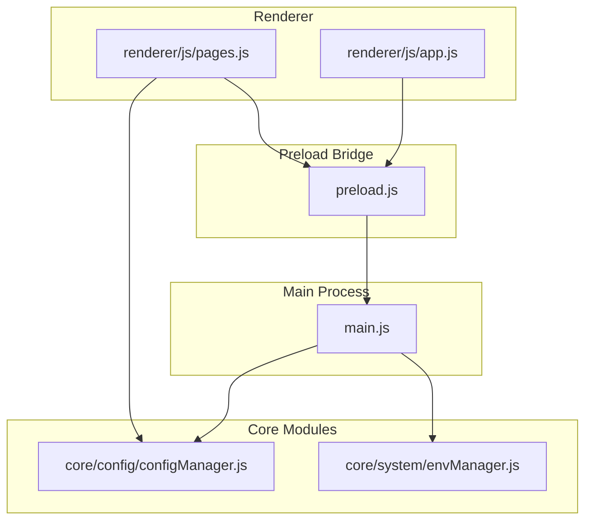
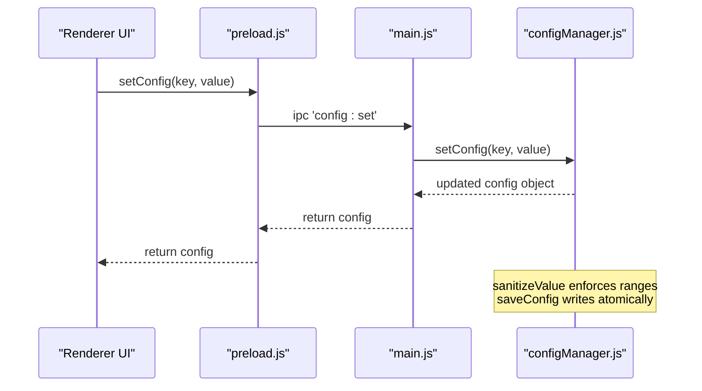
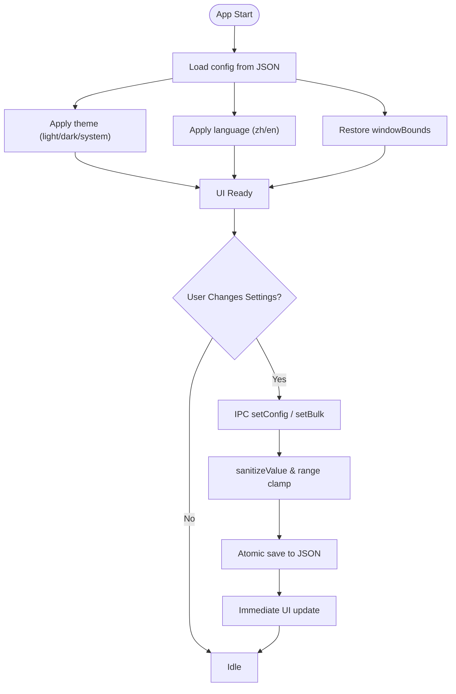
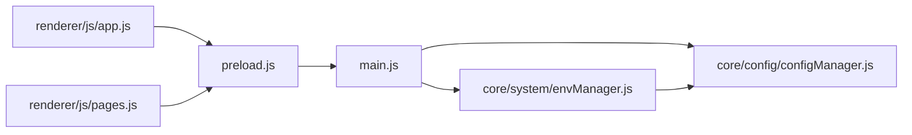

# General Settings

<cite>
**Referenced Files in This Document**
- [configManager.js](file://core/config/configManager.js)
- [main.js](file://main.js)
- [preload.js](file://preload.js)
- [app.js](file://renderer/js/app.js)
- [pages.js](file://renderer/js/pages.js)
- [envManager.js](file://core/system/envManager.js)
</cite>

## Table of Contents
1. [Introduction](#introduction)
2. [Project Structure](#project-structure)
3. [Core Components](#core-components)
4. [Architecture Overview](#architecture-overview)
5. [Detailed Component Analysis](#detailed-component-analysis)
6. [Dependency Analysis](#dependency-analysis)
7. [Performance Considerations](#performance-considerations)
8. [Troubleshooting Guide](#troubleshooting-guide)
9. [Conclusion](#conclusion)
10. [Appendices](#appendices)

## Introduction
This document explains PyLibMaster’s general application settings: how they are defined, validated, persisted, and applied across sessions. It covers theme (light/dark), language preferences (zh/en), storage path configuration, window bounds management, and current environment selection. It also describes the configuration file structure, default values, validation rules, persistence behavior, and common scenarios for manual editing and runtime changes via the UI.

## Project Structure
The settings system spans the main process, preload bridge, renderer UI, and core modules:
- Core configuration manager handles defaults, validation, and persistence to a JSON file.
- Main process restores window bounds on startup and persists them on resize/move.
- Preload exposes IPC methods for reading/writing configuration from the renderer.
- Renderer UI binds user interactions to configuration updates and applies theme/language immediately.
- Environment manager reads/writes the selected Python environment into configuration.

**Diagram sources**
- [configManager.js:1-194](file://core/config/configManager.js#L1-L194)
- [main.js:43-123](file://main.js#L43-L123)
- [preload.js:94-98](file://preload.js#L94-L98)
- [app.js:36-62](file://renderer/js/app.js#L36-L62)
- [pages.js:378-422](file://renderer/js/pages.js#L378-L422)
- [envManager.js:150-169](file://core/system/envManager.js#L150-L169)

**Section sources**
- [configManager.js:1-194](file://core/config/configManager.js#L1-L194)
- [main.js:43-123](file://main.js#L43-L123)
- [preload.js:94-98](file://preload.js#L94-L98)
- [app.js:36-62](file://renderer/js/app.js#L36-L62)
- [pages.js:378-422](file://renderer/js/pages.js#L378-L422)
- [envManager.js:150-169](file://core/system/envManager.js#L150-L169)

## Core Components
- Configuration Manager: Defines defaults, validates ranges, loads/saves JSON config, and provides getters/setters.
- Main Process Window Management: Restores and persists windowBounds; integrates with configManager.
- Preload IPC Bridge: Exposes getConfig, setConfig, setBulk to renderer.
- Renderer UI: Binds theme/language/storagePath/thread/retry toggles to config updates and applies UI state.
- Environment Manager: Reads/writes currentEnv and auto-selects first available environment if none is set.

Key responsibilities:
- Theme: light/dark/system; immediate UI update; system sync when enabled.
- Language: zh/en; applied at startup and on change.
- Storage Path: configurable directory used by logs/backups/snapshots; created if missing.
- Window Bounds: width/height/x/y saved on move/resize; restored on next launch.
- Current Environment: persisted and restored across sessions.

**Section sources**
- [configManager.js:21-117](file://core/config/configManager.js#L21-L117)
- [main.js:43-123](file://main.js#L43-L123)
- [preload.js:94-98](file://preload.js#L94-L98)
- [app.js:36-62](file://renderer/js/app.js#L36-L62)
- [pages.js:378-422](file://renderer/js/pages.js#L378-L422)
- [envManager.js:150-169](file://core/system/envManager.js#L150-L169)

## Architecture Overview
Settings flow through IPC between renderer and main process, then to configManager for persistence.

**Diagram sources**
- [preload.js:94-98](file://preload.js#L94-L98)
- [main.js:406-413](file://main.js#L406-L413)
- [configManager.js:157-178](file://core/config/configManager.js#L157-L178)

## Detailed Component Analysis

### Configuration File Structure and Defaults
- Location: Electron userData directory per OS (Windows/macOS/Linux).
- Filename: pylibmaster-config.json.
- Default values include theme, language, storagePath, parallelThreads, retryCount, smartRoute, currentEnv, windowBounds.
- On first run or corrupted file, defaults are created and saved.

Persistence behavior:
- Atomic write via temporary file + rename to avoid corruption.
- On read failure, defaults are rebuilt and saved.

Validation:
- Numeric fields are clamped to allowed ranges with fallback defaults.
- Unknown keys are preserved during merge.

Common fields:
- theme: string (light/dark/system)
- language: string (zh/en)
- storagePath: string (directory path)
- parallelThreads: number (range-limited)
- retryCount: number (range-limited)
- smartRoute: boolean
- currentEnv: object or null
- windowBounds: object { width, height, x?, y? }

**Section sources**
- [configManager.js:21-117](file://core/config/configManager.js#L21-L117)
- [configManager.js:123-138](file://core/config/configManager.js#L123-L138)
- [configManager.js:185-191](file://core/config/configManager.js#L185-L191)

### Theme Settings (light/dark/system)
- UI: Selecting a theme option triggers setConfig('theme', ...).
- Immediate effect: body class toggled based on effective theme.
- System sync: When theme is 'system', main process listens to nativeTheme updates and sends 'theme:changed' event to renderer.

Runtime flow:
- Renderer sets theme via IPC.
- Main process may push theme updates when system theme changes.

**Section sources**
- [app.js:36-50](file://renderer/js/app.js#L36-L50)
- [main.js:201-208](file://main.js#L201-L208)
- [preload.js:114-118](file://preload.js#L114-L118)

### Language Preferences (zh/en)
- UI: Selecting language updates document lang attribute and re-renders all i18n elements.
- Persistence: setConfig('language', ...) saves preference.
- Startup: loadConfig applies saved language before rendering.

**Section sources**
- [app.js:52-62](file://renderer/js/app.js#L52-L62)
- [pages.js:393-422](file://renderer/js/pages.js#L393-L422)

### Storage Path Configuration
- Purpose: Directory used for logs, backups, snapshots.
- UI: Browse button selects directory; path displayed in settings.
- Behavior: If directory does not exist, it is created automatically when accessed.

Manual editing:
- Edit storagePath in config JSON to desired absolute path.

**Section sources**
- [pages.js:378-387](file://renderer/js/pages.js#L378-L387)
- [configManager.js:185-191](file://core/config/configManager.js#L185-L191)

### Window Bounds Management
- Restore: On startup, main process reads windowBounds from config and applies width/height/x/y.
- Persist: On resize/move, position and size are debounced and saved to config.
- Maximized windows are not saved to avoid overriding normal dimensions.

**Section sources**
- [main.js:43-123](file://main.js#L43-L123)

### Current Environment Selection
- Detection: envManager scans common paths and PATH entries, gathers Python/pip versions.
- Selection: If no currentEnv is set, first detected environment is chosen and saved.
- Switching: User selects an environment; envManager switches and persists currentEnv.

**Section sources**
- [envManager.js:85-169](file://core/system/envManager.js#L85-L169)
- [envManager.js:196-209](file://core/system/envManager.js#L196-L209)

### Validation Rules and Range Limits
- Numeric fields (parallelThreads, retryCount) are sanitized to safe ranges with fallback defaults.
- Non-number or non-finite values revert to defaults.
- Other fields are stored as-is; unknown keys are preserved.

**Section sources**
- [configManager.js:25-44](file://core/config/configManager.js#L25-L44)
- [configManager.js:157-178](file://core/config/configManager.js#L157-L178)

### Persistence Across Sessions
- Config file location: userData directory per OS.
- Save strategy: atomic write using temp file + rename.
- Error handling: on save failure, attempts logging via logManager; falls back to stderr.
- Load strategy: merges saved config with defaults; rebuilds defaults on parse error.

**Section sources**
- [configManager.js:56-117](file://core/config/configManager.js#L56-L117)
- [configManager.js:123-138](file://core/config/configManager.js#L123-L138)

## Architecture Overview
The following diagram shows how settings are loaded, applied, and persisted across the app lifecycle.

**Diagram sources**
- [configManager.js:80-117](file://core/config/configManager.js#L80-L117)
- [configManager.js:157-178](file://core/config/configManager.js#L157-L178)
- [main.js:43-123](file://main.js#L43-L123)
- [app.js:36-62](file://renderer/js/app.js#L36-L62)

## Dependency Analysis
- Renderer depends on preload IPC to call configManager via main process handlers.
- Main process depends on configManager for persistence and envManager for environment selection.
- envManager depends on configManager to persist currentEnv.

**Diagram sources**
- [preload.js:94-98](file://preload.js#L94-L98)
- [main.js:406-413](file://main.js#L406-L413)
- [envManager.js:150-169](file://core/system/envManager.js#L150-L169)

**Section sources**
- [preload.js:94-98](file://preload.js#L94-L98)
- [main.js:406-413](file://main.js#L406-L413)
- [envManager.js:150-169](file://core/system/envManager.js#L150-L169)

## Performance Considerations
- Debounced window bounds saving reduces frequent disk writes during drag/resize.
- Atomic config writes prevent partial corruption.
- Background environment detection avoids blocking UI startup.
- Cached installed packages list improves initial responsiveness.

[No sources needed since this section provides general guidance]

## Troubleshooting Guide
- Corrupted config file: The manager rebuilds defaults and saves a fresh file. Check the config JSON for syntax errors if issues persist.
- Storage path invalid: Ensure the path exists or is writable; the manager will attempt to create it when accessed.
- Theme not applying: Verify theme setting and system theme sync; check that renderer receives 'theme:changed' events when using 'system'.
- Language not switching: Confirm language key is set and applyLanguage is called after change.
- Window bounds not restoring: Ensure window is not maximized when saving; verify windowBounds object contains width/height.

**Section sources**
- [configManager.js:112-117](file://core/config/configManager.js#L112-L117)
- [configManager.js:185-191](file://core/config/configManager.js#L185-L191)
- [main.js:201-208](file://main.js#L201-L208)
- [pages.js:393-422](file://renderer/js/pages.js#L393-L422)

## Conclusion
PyLibMaster’s general settings are robustly managed through a centralized configuration manager with clear defaults, validation, and atomic persistence. The UI provides intuitive controls for theme, language, storage path, threads, retries, and more, while the main process ensures window bounds and environment selections are consistently restored across sessions. Manual edits to the JSON config are supported and merged safely with defaults.

[No sources needed since this section summarizes without analyzing specific files]

## Appendices

### Common Configuration Scenarios
- Set dark theme and English language:
  - Use UI theme/language selectors; both trigger setConfig calls and immediate UI updates.
- Change storage path:
  - Click browse in settings to select a directory; path is saved and created if missing.
- Adjust performance:
  - Modify parallelThreads and retryCount via settings; values are clamped to valid ranges.
- Manage window size:
  - Resize/move the window; bounds are debounced and saved automatically.
- Switch Python environment:
  - Select an environment in the UI; envManager persists currentEnv.

### Manual Configuration File Editing
- Locate config file in userData directory (per OS).
- Edit fields like theme, language, storagePath, parallelThreads, retryCount, smartRoute, currentEnv, windowBounds.
- Ensure JSON syntax is valid; on next start, defaults are merged with your values.

### Runtime Setting Changes Through the UI
- Theme/Language: Click options in settings; immediate effect and persistence.
- Storage Path: Use browse dialog; path saved instantly.
- Threads/Retries: Change inputs; values validated and saved.
- Auto-check updates/notifications/tray minimize: Toggle switches; saved to config.

**Section sources**
- [configManager.js:80-117](file://core/config/configManager.js#L80-L117)
- [app.js:36-62](file://renderer/js/app.js#L36-L62)
- [pages.js:378-422](file://renderer/js/pages.js#L378-L422)
- [envManager.js:150-169](file://core/system/envManager.js#L150-L169)