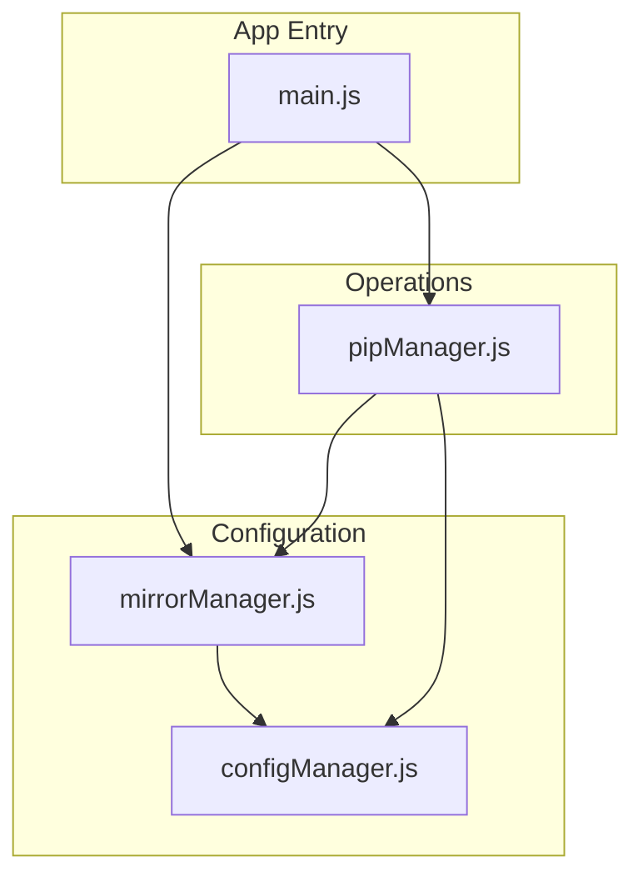
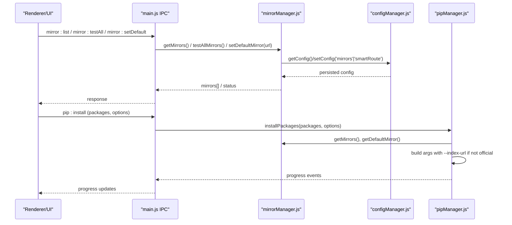
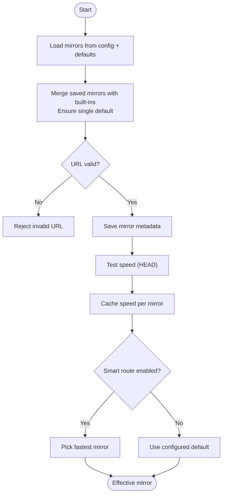
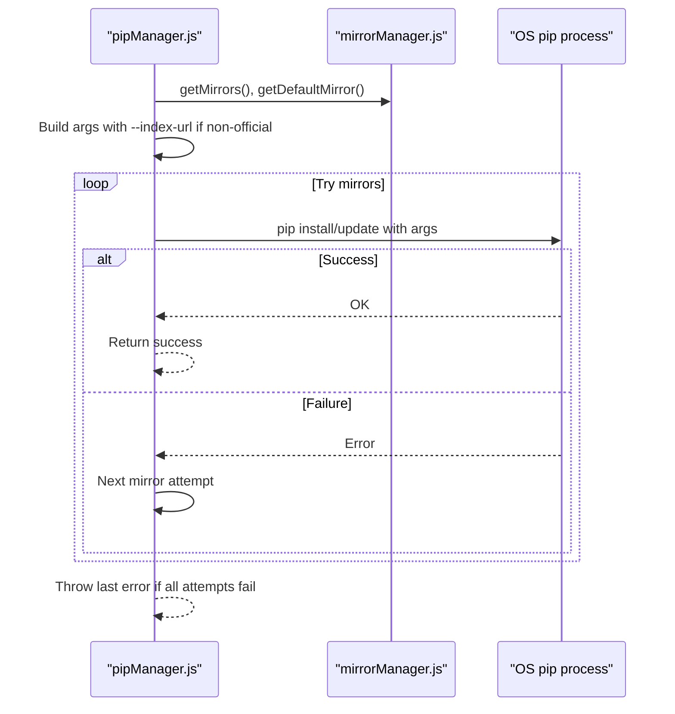
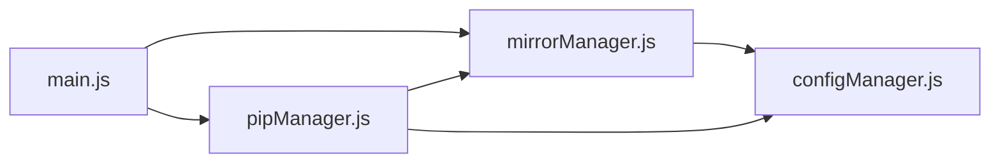

# Mirror Source Configuration

<cite>
**Referenced Files in This Document**
- [mirrorManager.js](file://core/config/mirrorManager.js)
- [configManager.js](file://core/config/configManager.js)
- [pipManager.js](file://core/operations/pipManager.js)
- [main.js](file://main.js)
- [package.json](file://package.json)
</cite>

## Table of Contents
1. [Introduction](#introduction)
2. [Project Structure](#project-structure)
3. [Core Components](#core-components)
4. [Architecture Overview](#architecture-overview)
5. [Detailed Component Analysis](#detailed-component-analysis)
6. [Dependency Analysis](#dependency-analysis)
7. [Performance Considerations](#performance-considerations)
8. [Troubleshooting Guide](#troubleshooting-guide)
9. [Conclusion](#conclusion)

## Introduction
This document explains PyLibMaster’s mirror source configuration system. It covers built-in mirrors, adding and managing custom mirrors, speed testing and optimization, fallback mechanisms during package operations, and how the effective mirror is selected (including smart routing). It also documents URL formats, how pip configuration is written, timeout behavior, and provides troubleshooting guidance for connection issues and performance tuning.

## Project Structure
The mirror system spans three core modules:
- Mirror management and persistence
- Application configuration storage
- Package operations that consume mirror settings

**Diagram sources**
- [main.js:370-395](file://main.js#L370-L395)
- [mirrorManager.js:1-30](file://core/config/mirrorManager.js#L1-L30)
- [configManager.js:1-30](file://core/config/configManager.js#L1-L30)
- [pipManager.js:608-633](file://core/operations/pipManager.js#L608-L633)

**Section sources**
- [main.js:370-395](file://main.js#L370-L395)
- [mirrorManager.js:1-30](file://core/config/mirrorManager.js#L1-L30)
- [configManager.js:1-30](file://core/config/configManager.js#L1-L30)
- [pipManager.js:608-633](file://core/operations/pipManager.js#L608-L633)

## Core Components
- Built-in mirrors: A curated list of well-known public mirrors is provided by default.
- Custom mirrors: Users can add, update, remove, and reorder mirrors; only http/https URLs are allowed.
- Speed testing: HEAD requests to a known package path measure latency; results are cached per mirror.
- Smart routing: Optional automatic selection of the fastest mirror based on measured speeds.
- Fallback mechanism: Install/update operations try multiple mirrors in order until one succeeds.
- Pip integration: The effective mirror is written into pip’s global config or passed via command-line arguments.

Key responsibilities:
- mirrorManager.js: CRUD for mirrors, speed tests, smart routing, pip config writing, argument building.
- configManager.js: Persistent application settings including smartRoute flag and stored mirror list.
- pipManager.js: Uses mirror lists and defaults when executing install/update commands with retries across mirrors.

**Section sources**
- [mirrorManager.js:21-29](file://core/config/mirrorManager.js#L21-L29)
- [mirrorManager.js:43-51](file://core/config/mirrorManager.js#L43-L51)
- [mirrorManager.js:60-91](file://core/config/mirrorManager.js#L60-L91)
- [mirrorManager.js:219-247](file://core/config/mirrorManager.js#L219-L247)
- [mirrorManager.js:267-290](file://core/config/mirrorManager.js#L267-L290)
- [mirrorManager.js:299-333](file://core/config/mirrorManager.js#L299-L333)
- [configManager.js:80-117](file://core/config/configManager.js#L80-L117)
- [pipManager.js:608-633](file://core/operations/pipManager.js#L608-L633)
- [pipManager.js:892-922](file://core/operations/pipManager.js#L892-L922)

## Architecture Overview
The mirror system integrates with both configuration and package operations. IPC handlers expose mirror management features to the UI.

**Diagram sources**
- [main.js:370-395](file://main.js#L370-L395)
- [mirrorManager.js:60-91](file://core/config/mirrorManager.js#L60-L91)
- [configManager.js:144-178](file://core/config/configManager.js#L144-L178)
- [pipManager.js:513-596](file://core/operations/pipManager.js#L513-L596)

## Detailed Component Analysis

### Mirror Manager (mirrorManager.js)
- Built-in mirrors: Defined centrally and merged with user-saved mirrors.
- URL validation: Only http/https accepted; length limits enforced.
- Persistence: Mirrors saved with name, url, remark, isDefault, speed.
- Speed measurement: HEAD request to a known package path with a fixed timeout; failures marked with high latency.
- Smart routing: Optional feature to pick the fastest mirror based on measured speeds.
- Effective mirror: Returns either the fastest mirror (if enabled) or the configured default.
- Pip integration:
  - Writes global pip config file with index-url and timeout.
  - Builds CLI arguments for pip commands when needed.

**Diagram sources**
- [mirrorManager.js:60-91](file://core/config/mirrorManager.js#L60-L91)
- [mirrorManager.js:219-247](file://core/config/mirrorManager.js#L219-L247)
- [mirrorManager.js:267-290](file://core/config/mirrorManager.js#L267-L290)

**Section sources**
- [mirrorManager.js:21-29](file://core/config/mirrorManager.js#L21-L29)
- [mirrorManager.js:43-51](file://core/config/mirrorManager.js#L43-L51)
- [mirrorManager.js:60-91](file://core/config/mirrorManager.js#L60-L91)
- [mirrorManager.js:97-107](file://core/config/mirrorManager.js#L97-L107)
- [mirrorManager.js:139-150](file://core/config/mirrorManager.js#L139-L150)
- [mirrorManager.js:158-179](file://core/config/mirrorManager.js#L158-L179)
- [mirrorManager.js:187-197](file://core/config/mirrorManager.js#L187-L197)
- [mirrorManager.js:219-247](file://core/config/mirrorManager.js#L219-L247)
- [mirrorManager.js:267-290](file://core/config/mirrorManager.js#L267-L290)
- [mirrorManager.js:299-333](file://core/config/mirrorManager.js#L299-L333)

### Configuration Manager (configManager.js)
- Stores app-wide settings including smartRoute and mirrors list.
- Provides safe read/write with sanitization and atomic writes.
- Determines platform-specific paths for Electron userData directory.

**Section sources**
- [configManager.js:80-117](file://core/config/configManager.js#L80-L117)
- [configManager.js:123-138](file://core/config/configManager.js#L123-L138)
- [configManager.js:144-178](file://core/config/configManager.js#L144-L178)

### Package Operations Integration (pipManager.js)
- Uses mirrorManager to obtain mirror lists and defaults.
- For each operation (install/update), tries multiple mirrors in order:
  - Default mirror first, then others.
  - Adds --index-url when not using the official source.
  - Retries up to a bounded number of attempts based on configured retry count and available mirrors.
- Ensures robustness by failing over to alternative mirrors before throwing an error.

**Diagram sources**
- [pipManager.js:608-633](file://core/operations/pipManager.js#L608-L633)
- [pipManager.js:892-922](file://core/operations/pipManager.js#L892-L922)

**Section sources**
- [pipManager.js:513-596](file://core/operations/pipManager.js#L513-L596)
- [pipManager.js:608-633](file://core/operations/pipManager.js#L608-L633)
- [pipManager.js:892-922](file://core/operations/pipManager.js#L892-L922)

### IPC Exposure (main.js)
- Exposes mirror-related operations to the UI via IPC handlers:
  - List mirrors, test speed(s), set default, add/update/remove custom mirrors, restore defaults, toggle smart route, write pip config, reorder mirrors.

**Section sources**
- [main.js:370-395](file://main.js#L370-L395)

## Dependency Analysis
- mirrorManager depends on configManager for persistent storage.
- pipManager depends on mirrorManager for mirror selection and argument construction.
- main.js wires UI actions to these modules through IPC handlers.

**Diagram sources**
- [main.js:370-395](file://main.js#L370-L395)
- [mirrorManager.js:1-30](file://core/config/mirrorManager.js#L1-L30)
- [pipManager.js:20-30](file://core/operations/pipManager.js#L20-L30)

**Section sources**
- [main.js:370-395](file://main.js#L370-L395)
- [mirrorManager.js:1-30](file://core/config/mirrorManager.js#L1-L30)
- [pipManager.js:20-30](file://core/operations/pipManager.js#L20-L30)

## Performance Considerations
- Speed testing uses HEAD requests with a fixed timeout; failures return a high latency value to deprioritize slow/unavailable mirrors.
- Smart routing measures and caches per-mirror speeds; enabling it can improve download times but adds initial latency due to probing.
- Parallelism in package operations is controlled by configuration; ensure concurrency aligns with network capacity.
- Reordering mirrors allows prioritizing faster or more reliable sources.

[No sources needed since this section provides general guidance]

## Troubleshooting Guide

Common issues and resolutions:
- Connection timeouts or slow downloads
  - Run mirror speed tests and enable smart routing to automatically select the fastest mirror.
  - Reorder mirrors to prioritize reliable ones.
  - Verify network connectivity and firewall/proxy settings.
- Invalid mirror URL errors
  - Ensure URLs use http or https and end with a trailing slash where required.
  - Remove or correct malformed entries.
- Pip configuration conflicts
  - If pip fails due to conflicting global settings, use the “write pip config” action to synchronize the effective mirror into pip’s configuration file.
- Authentication for private repositories
  - The current implementation does not include built-in authentication fields for mirrors. For private repositories, configure authentication at the pip level (e.g., environment variables or pip’s credential helpers) outside this module.
- Proxy configuration
  - Not handled within this module. Configure proxies globally in your environment or pip configuration.
- Network timeouts
  - Speed tests use a fixed timeout; pip operations use longer timeouts. Adjust network conditions or choose closer mirrors if timeouts persist.

**Section sources**
- [mirrorManager.js:43-51](file://core/config/mirrorManager.js#L43-L51)
- [mirrorManager.js:219-247](file://core/config/mirrorManager.js#L219-L247)
- [mirrorManager.js:299-333](file://core/config/mirrorManager.js#L299-L333)
- [pipManager.js:608-633](file://core/operations/pipManager.js#L608-L633)

## Conclusion
PyLibMaster’s mirror system provides a robust, configurable approach to selecting and using PyPI mirrors. It supports built-in and custom mirrors, speed-based optimization, and resilient fallback during package operations. While authentication and proxy settings are not managed here, integrating them at the pip/environment level complements the existing functionality. Use speed tests, smart routing, and mirror ordering to optimize performance and reliability.

[No sources needed since this section summarizes without analyzing specific files]