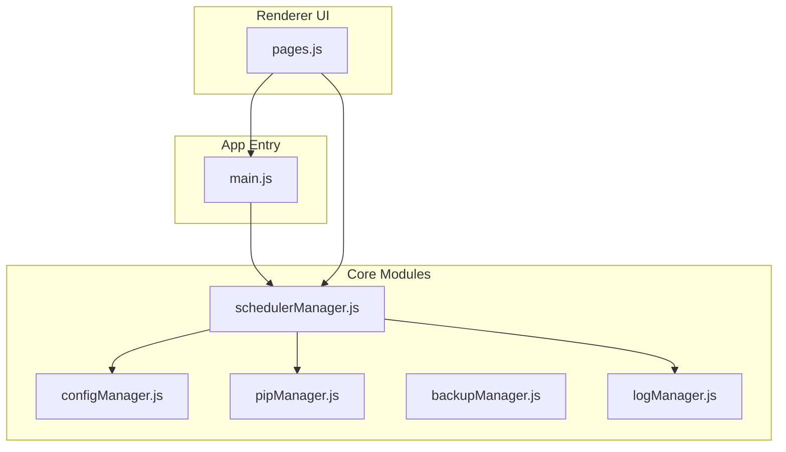
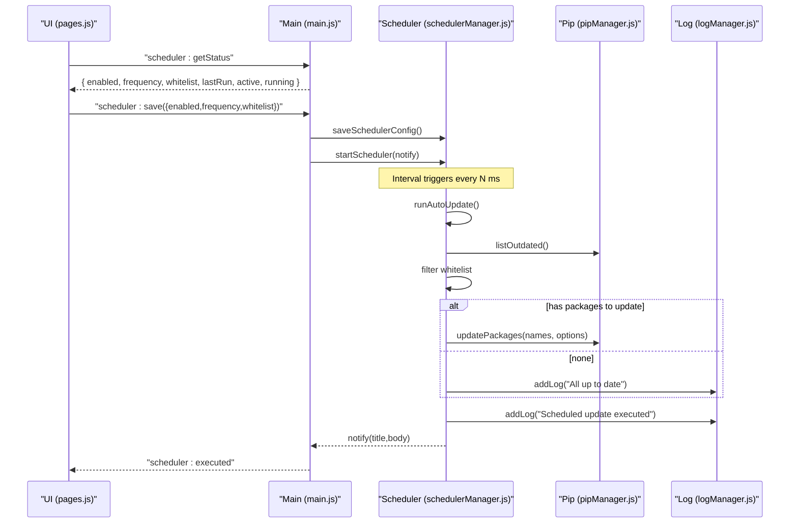
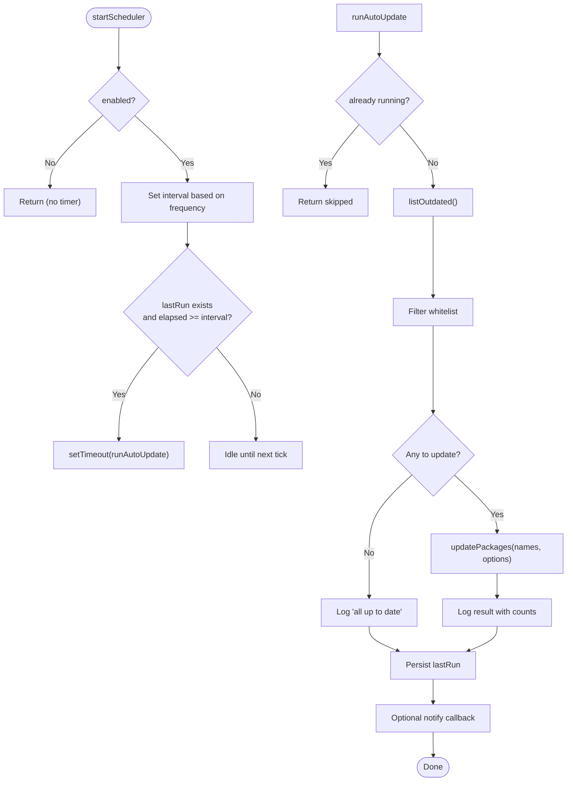
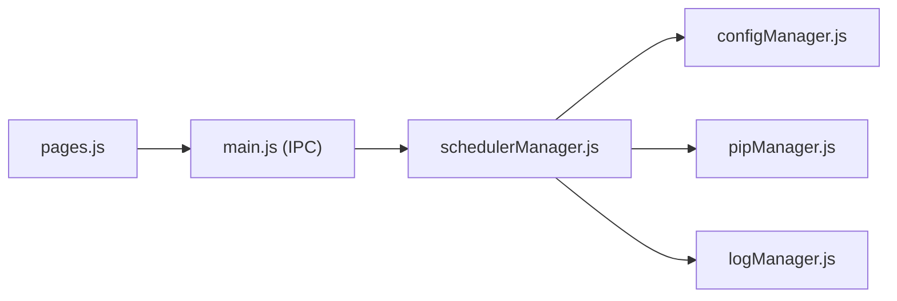

# Scheduler Configuration

<cite>
**Referenced Files in This Document**
- [schedulerManager.js](file://core/config/schedulerManager.js)
- [configManager.js](file://core/config/configManager.js)
- [pipManager.js](file://core/operations/pipManager.js)
- [backupManager.js](file://core/operations/backupManager.js)
- [logManager.js](file://core/system/logManager.js)
- [main.js](file://main.js)
- [pages.js](file://renderer/js/pages.js)
</cite>

## Table of Contents
1. [Introduction](#introduction)
2. [Project Structure](#project-structure)
3. [Core Components](#core-components)
4. [Architecture Overview](#architecture-overview)
5. [Detailed Component Analysis](#detailed-component-analysis)
6. [Dependency Analysis](#dependency-analysis)
7. [Performance Considerations](#performance-considerations)
8. [Troubleshooting Guide](#troubleshooting-guide)
9. [Conclusion](#conclusion)
10. [Appendices](#appendices)

## Introduction
This document explains PyLibMaster’s scheduler configuration system for automated task scheduling. It covers how periodic updates are scheduled, how to configure backup schedules, update checks, cleanup tasks, and custom scheduled operations. It also includes guidance on monitoring scheduled tasks and debugging scheduler issues. The current implementation provides a simple interval-based scheduler (daily or weekly) with a package whitelist and persistent configuration.

## Project Structure
The scheduler is implemented as a dedicated module that integrates with the application’s configuration, logging, and pip management subsystems. The UI exposes controls to enable/disable the scheduler, set frequency, manage a whitelist of packages to skip, and trigger immediate runs.

**Diagram sources**
- [schedulerManager.js:1-197](file://core/config/schedulerManager.js#L1-L197)
- [configManager.js:1-194](file://core/config/configManager.js#L1-L194)
- [pipManager.js:1-200](file://core/operations/pipManager.js#L1-L200)
- [backupManager.js:1-196](file://core/operations/backupManager.js#L1-L196)
- [logManager.js:1-176](file://core/system/logManager.js#L1-L176)
- [main.js:130-150](file://main.js#L130-L150)
- [pages.js:716-801](file://renderer/js/pages.js#L716-L801)

**Section sources**
- [schedulerManager.js:1-197](file://core/config/schedulerManager.js#L1-L197)
- [main.js:130-150](file://main.js#L130-L150)
- [pages.js:716-801](file://renderer/js/pages.js#L716-L801)

## Core Components
- Scheduler Manager: Manages enabling/disabling, frequency selection (daily/weekly), whitelist filtering, last run tracking, and execution of automatic updates.
- Config Manager: Persists scheduler settings and other app configuration values safely.
- Pip Manager: Provides outdated package listing and batched updates used by the scheduler.
- Backup Manager: Offers backup creation and restore capabilities; can be integrated into scheduled workflows.
- Log Manager: Records scheduler actions and outcomes for auditing and troubleshooting.
- Main Process: Initializes and starts the scheduler at app startup and wires IPC handlers for UI control.
- Renderer UI: Exposes toggles, frequency selector, whitelist management, and “run now” button.

**Section sources**
- [schedulerManager.js:25-50](file://core/config/schedulerManager.js#L25-L50)
- [configManager.js:80-117](file://core/config/configManager.js#L80-L117)
- [pipManager.js:1-200](file://core/operations/pipManager.js#L1-L200)
- [backupManager.js:1-196](file://core/operations/backupManager.js#L1-L196)
- [logManager.js:115-134](file://core/system/logManager.js#L115-L134)
- [main.js:130-150](file://main.js#L130-L150)
- [pages.js:716-801](file://renderer/js/pages.js#L716-L801)

## Architecture Overview
The scheduler uses an interval timer to periodically check for outdated packages and perform batched updates while respecting a whitelist. Execution results are logged and persisted. The main process initializes the scheduler at startup and exposes IPC endpoints for the UI to control it.

**Diagram sources**
- [schedulerManager.js:60-138](file://core/config/schedulerManager.js#L60-L138)
- [main.js:525-546](file://main.js#L525-L546)
- [pipManager.js:1-200](file://core/operations/pipManager.js#L1-L200)
- [logManager.js:115-134](file://core/system/logManager.js#L115-L134)

## Detailed Component Analysis

### Scheduler Manager
Responsibilities:
- Read/write scheduler configuration (enabled, frequency, whitelist, lastRun).
- Compute intervals for daily/weekly modes.
- Execute auto-update workflow: list outdated, filter whitelist, batch update, log results, persist lastRun.
- Start/stop timers and expose status.

Key behaviors:
- Prevents concurrent executions via an in-memory flag.
- Logs success/failure and counts updated/failed/whitelisted.
- Persists lastRun timestamp after each execution attempt.
- On startup, if the last run was more than one interval ago, schedules a delayed run.

**Diagram sources**
- [schedulerManager.js:140-163](file://core/config/schedulerManager.js#L140-L163)
- [schedulerManager.js:60-138](file://core/config/schedulerManager.js#L60-L138)

**Section sources**
- [schedulerManager.js:25-50](file://core/config/schedulerManager.js#L25-L50)
- [schedulerManager.js:57-59](file://core/config/schedulerManager.js#L57-L59)
- [schedulerManager.js:60-138](file://core/config/schedulerManager.js#L60-L138)
- [schedulerManager.js:140-173](file://core/config/schedulerManager.js#L140-L173)
- [schedulerManager.js:179-187](file://core/config/schedulerManager.js#L179-L187)

### Configuration Management
- Scheduler settings are stored under keys such as schedulerEnabled, schedulerFrequency, schedulerWhitelist, schedulerLastRun.
- Bulk writes are supported to minimize disk I/O.
- Values are sanitized where applicable.

Common configuration keys:
- schedulerEnabled: boolean
- schedulerFrequency: string ("daily" | "weekly")
- schedulerWhitelist: array of strings (package names)
- schedulerLastRun: ISO timestamp string

**Section sources**
- [schedulerManager.js:25-50](file://core/config/schedulerManager.js#L25-L50)
- [configManager.js:140-178](file://core/config/configManager.js#L140-L178)

### Pip Integration and Update Workflow
- Outdated packages are discovered via pipManager.listOutdated().
- Whitelist filtering is performed case-insensitively.
- Batch updates use pipManager.updatePackages with parallelism and retry options.
- Results include updated and failed lists; counts are logged.

Operational notes:
- Operation IDs are generated for tracking and cancellation.
- Progress events are emitted during pip operations.

**Section sources**
- [schedulerManager.js:70-138](file://core/config/schedulerManager.js#L70-L138)
- [pipManager.js:1-200](file://core/operations/pipManager.js#L1-L200)

### Backup Manager (for Scheduled Backups)
- Creates environment snapshots using pip freeze output.
- Supports listing, restoring, and deleting backups.
- Can be integrated into scheduled tasks to back up environments before updates.

Typical usage pattern:
- Before scheduled updates, create a backup snapshot.
- After successful updates, keep the backup for rollback if needed.

**Section sources**
- [backupManager.js:1-196](file://core/operations/backupManager.js#L1-L196)

### Logging and Monitoring
- All scheduler actions are recorded with timestamps, action labels, status, and details.
- Logs support filtering by type and keyword search.
- Use logs to monitor scheduler health and diagnose failures.

Recommended log types:
- type: "update" for scheduled update runs
- action: descriptive text like "Scheduled update executed"
- status: "ok" or "failed"

**Section sources**
- [logManager.js:115-134](file://core/system/logManager.js#L115-L134)
- [schedulerManager.js:86-138](file://core/config/schedulerManager.js#L86-L138)

### UI Controls and IPC
- UI exposes toggle for enabling/disabling scheduler, frequency selector, whitelist manager, and “run now”.
- IPC handlers allow saving config, starting/stopping scheduler, and triggering immediate runs.
- Notifications are sent when scheduler executes.

Key IPC endpoints:
- scheduler:getStatus
- scheduler:save
- scheduler:runNow

**Section sources**
- [main.js:525-546](file://main.js#L525-L546)
- [pages.js:716-801](file://renderer/js/pages.js#L716-L801)

## Dependency Analysis
The scheduler depends on configuration persistence, pip operations, and logging. The main process wires IPC handlers and starts the scheduler at application boot.

**Diagram sources**
- [main.js:525-546](file://main.js#L525-L546)
- [schedulerManager.js:1-197](file://core/config/schedulerManager.js#L1-L197)
- [configManager.js:1-194](file://core/config/configManager.js#L1-L194)
- [pipManager.js:1-200](file://core/operations/pipManager.js#L1-L200)
- [logManager.js:1-176](file://core/system/logManager.js#L1-L176)

**Section sources**
- [main.js:525-546](file://main.js#L525-L546)
- [schedulerManager.js:1-197](file://core/config/schedulerManager.js#L1-L197)

## Performance Considerations
- Interval-based scheduling is simple but not cron-like; consider external schedulers for complex patterns.
- Batch updates with parallelism reduce total time; tune parallel threads via configuration if exposed.
- Whitelist filtering avoids unnecessary work for critical packages.
- Logging is debounced to reduce disk writes; flush on shutdown to avoid data loss.

[No sources needed since this section provides general guidance]

## Troubleshooting Guide
Common issues and resolutions:
- Scheduler not running: Ensure schedulerEnabled is true and the app started the scheduler. Check getStatus for active and running flags.
- No updates detected: Verify pip connectivity and that listOutdated returns non-empty results.
- Whitelist skipping too many packages: Review schedulerWhitelist entries; ensure they match package names exactly (case-insensitive).
- Failed updates: Inspect logs for error messages; consider retrying or updating specific packages manually.
- Stale lastRun timestamp: If lastRun is far behind, the scheduler may schedule a delayed run; verify system clock and intervals.

Useful diagnostics:
- Call scheduler:getStatus to inspect enabled, frequency, whitelist, lastRun, active, and running.
- Trigger scheduler:runNow to execute immediately and observe logs.
- Filter logs by type "update" and search keywords like "auto" or "scheduled".

**Section sources**
- [schedulerManager.js:179-187](file://core/config/schedulerManager.js#L179-L187)
- [logManager.js:146-162](file://core/system/logManager.js#L146-L162)
- [main.js:525-546](file://main.js#L525-L546)

## Conclusion
PyLibMaster’s scheduler provides a straightforward mechanism for periodic package updates with configurable frequency and whitelist filtering. It integrates tightly with pip operations, persists state, and records detailed logs. For advanced scheduling needs beyond daily/weekly intervals, consider extending the scheduler or integrating an external cron-like engine.

[No sources needed since this section summarizes without analyzing specific files]

## Appendices

### How to Configure Backup Schedules
- Create a backup before scheduled updates using backupManager.createBackup.
- Store the backup ID and use it to restore if needed.
- Integrate backup steps into your custom scheduler logic.

**Section sources**
- [backupManager.js:89-113](file://core/operations/backupManager.js#L89-L113)
- [backupManager.js:156-170](file://core/operations/backupManager.js#L156-L170)

### How to Configure Update Checks
- Enable autoCheckUpdates to check outdated packages at startup.
- The main process sends a notification if updates are available.

**Section sources**
- [main.js:217-231](file://main.js#L217-L231)

### Cleanup Tasks
- Implement cleanup routines (e.g., removing old backups or logs) within your custom scheduler logic.
- Use logManager.addLog to record cleanup actions.

**Section sources**
- [logManager.js:115-134](file://core/system/logManager.js#L115-L134)

### Custom Scheduled Operations
- Extend schedulerManager to support additional tasks beyond package updates.
- Persist task-specific configuration via configManager.setBulk.
- Emit progress and logs for visibility.

**Section sources**
- [configManager.js:171-178](file://core/config/configManager.js#L171-L178)
- [logManager.js:115-134](file://core/system/logManager.js#L115-L134)

### Common Scheduling Patterns
- Daily maintenance: Run nightly updates and backups.
- Weekly audit: Perform dependency conflict checks and security audits.
- On-demand: Use scheduler:runNow to trigger immediate runs from the UI.

[No sources needed since this section provides general guidance]

### Monitoring Scheduled Tasks
- Use scheduler:getStatus to monitor active and running states.
- Inspect logs filtered by type "update" for recent activity.
- Observe UI notifications when scheduler executes.

**Section sources**
- [schedulerManager.js:179-187](file://core/config/schedulerManager.js#L179-L187)
- [logManager.js:146-162](file://core/system/logManager.js#L146-L162)
- [main.js:525-546](file://main.js#L525-L546)

### Debugging Scheduler Issues
- Validate configuration keys and values.
- Check system time and timezone consistency.
- Test pip connectivity and permissions.
- Review logs for errors and warnings.

**Section sources**
- [schedulerManager.js:25-50](file://core/config/schedulerManager.js#L25-L50)
- [logManager.js:115-134](file://core/system/logManager.js#L115-L134)