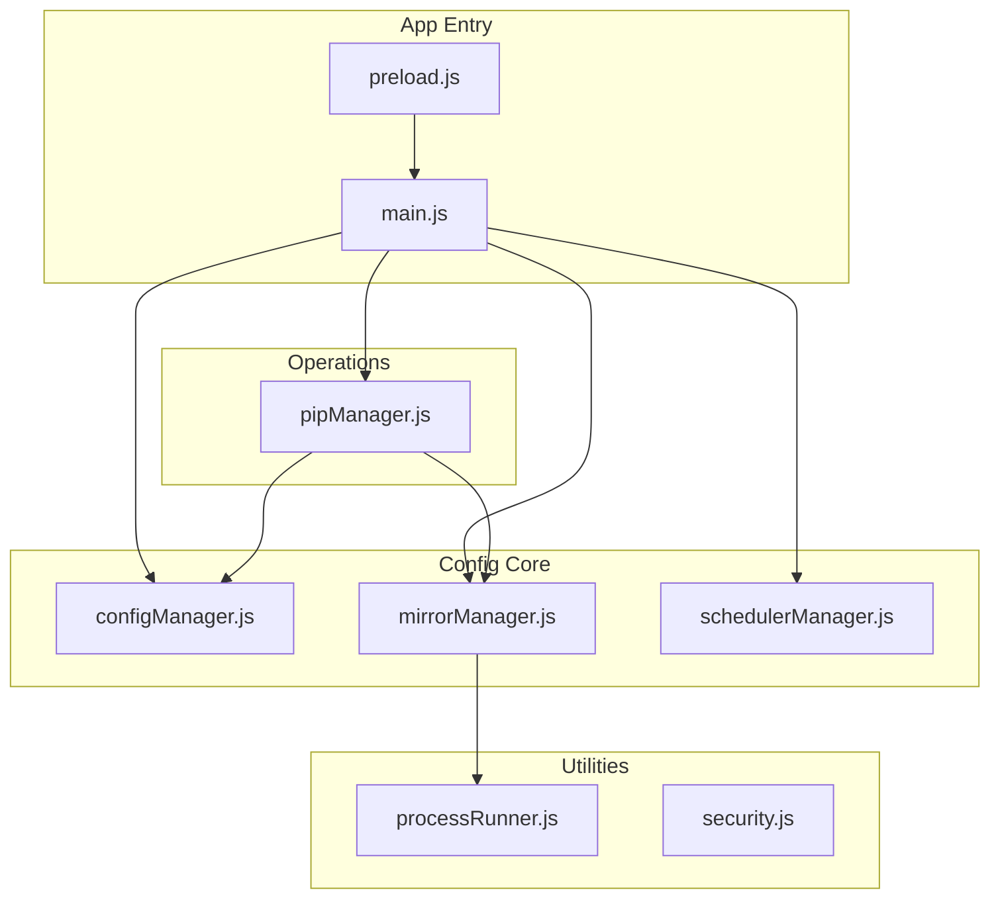
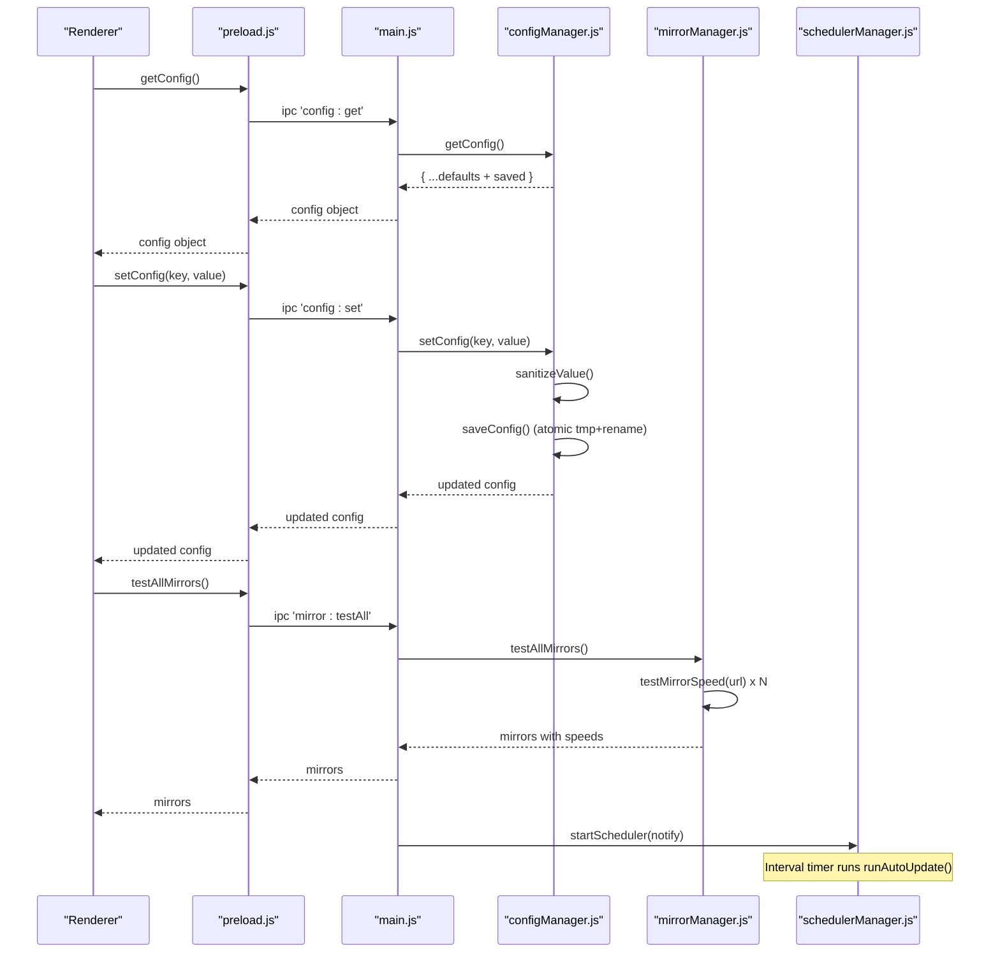
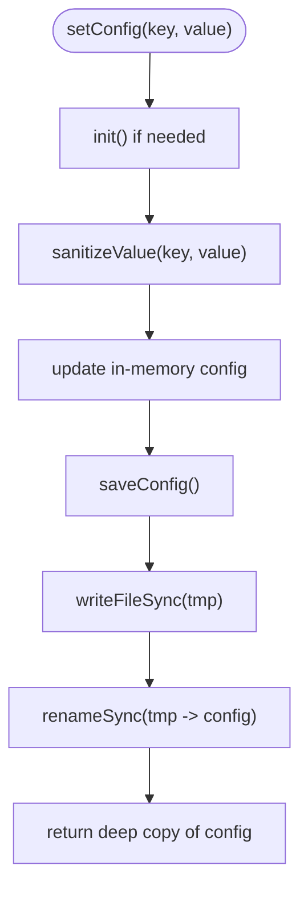
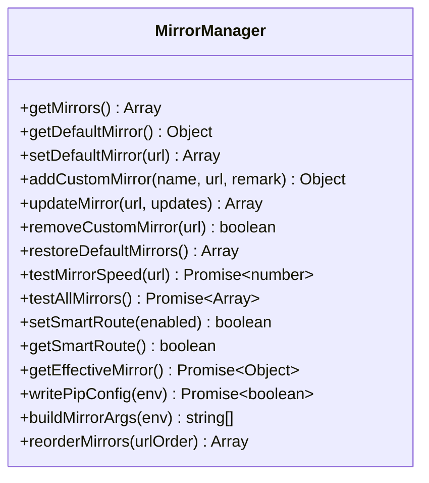
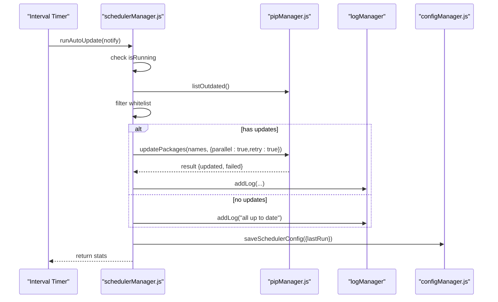
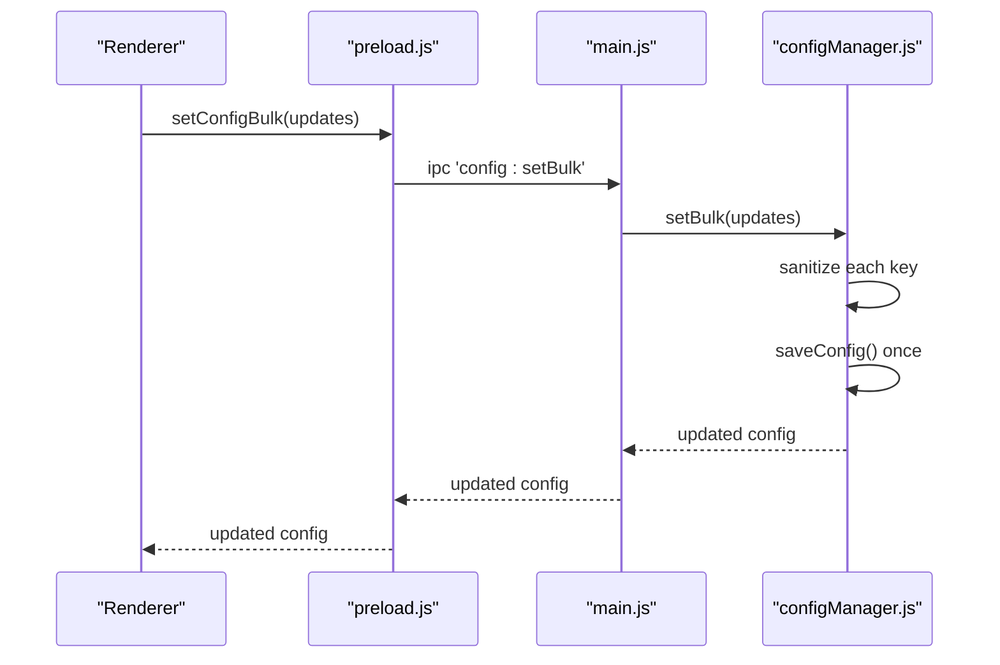
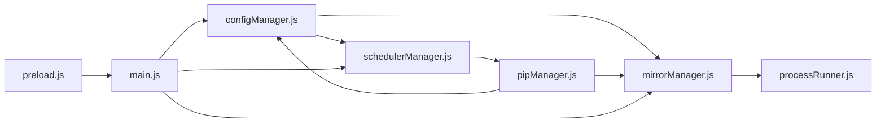

# Configuration System

<cite>
**Referenced Files in This Document**
- [configManager.js](file://core/config/configManager.js)
- [mirrorManager.js](file://core/config/mirrorManager.js)
- [schedulerManager.js](file://core/config/schedulerManager.js)
- [main.js](file://main.js)
- [preload.js](file://preload.js)
- [processRunner.js](file://utils/processRunner.js)
- [security.js](file://utils/security.js)
- [pipManager.js](file://core/operations/pipManager.js)
</cite>

## Table of Contents
1. [Introduction](#introduction)
2. [Project Structure](#project-structure)
3. [Core Components](#core-components)
4. [Architecture Overview](#architecture-overview)
5. [Detailed Component Analysis](#detailed-component-analysis)
6. [Dependency Analysis](#dependency-analysis)
7. [Performance Considerations](#performance-considerations)
8. [Troubleshooting Guide](#troubleshooting-guide)
9. [Conclusion](#conclusion)
10. [Appendices](#appendices)

## Introduction
This document explains PyLibMaster’s configuration management system with a focus on:
- Atomic file operations that prevent configuration corruption
- Value validation and range checking for numeric settings
- Default configuration management and environment-specific behavior
- The scheduler system for automated tasks
- Mirror source configuration, speed testing, and optimization
- Configuration schema, validation rules, and migration strategies
- Examples of common scenarios, advanced parallel processing settings, retry policies, and security configurations
- How configuration changes are persisted and synchronized across the application

## Project Structure
The configuration subsystem is implemented under core/config with supporting utilities and integration points in main.js and preload.js. Key files:
- configManager.js: Centralized configuration persistence, defaults, validation, and atomic writes
- mirrorManager.js: PyPI mirror list management, speed testing, smart routing, pip config writing
- schedulerManager.js: Automated update scheduling with whitelist support and status persistence
- main.js: IPC handlers bridging UI to core modules; initializes scheduler and theme sync
- preload.js: Secure bridge exposing configuration and mirror APIs to the renderer
- processRunner.js: Subprocess execution used by mirror speed tests and pip operations
- security.js: Path safety checks used by other modules (e.g., opening paths)
- pipManager.js: Uses configuration for storage path and interacts with mirrors and retries

**Diagram sources**
- [configManager.js:1-194](file://core/config/configManager.js#L1-L194)
- [mirrorManager.js:1-376](file://core/config/mirrorManager.js#L1-L376)
- [schedulerManager.js:1-197](file://core/config/schedulerManager.js#L1-L197)
- [main.js:1-640](file://main.js#L1-L640)
- [preload.js:1-221](file://preload.js#L1-L221)
- [processRunner.js:1-366](file://utils/processRunner.js#L1-L366)
- [security.js:1-43](file://utils/security.js#L1-L43)
- [pipManager.js:1-200](file://core/operations/pipManager.js#L1-L200)

**Section sources**
- [configManager.js:1-194](file://core/config/configManager.js#L1-L194)
- [mirrorManager.js:1-376](file://core/config/mirrorManager.js#L1-L376)
- [schedulerManager.js:1-197](file://core/config/schedulerManager.js#L1-L197)
- [main.js:1-640](file://main.js#L1-L640)
- [preload.js:1-221](file://preload.js#L1-L221)

## Core Components
- Config Manager: Provides getConfig, setConfig, setBulk, getStoragePath, init. Implements default merging, value sanitization, and atomic save.
- Mirror Manager: Manages built-in and custom mirrors, validates URLs, measures speed, supports smart routing, and writes pip configuration files.
- Scheduler Manager: Persists and runs scheduled updates based on frequency (daily/weekly), filters whitelisted packages, logs results, and notifies UI.

Key responsibilities:
- Atomic persistence via temporary file + rename
- Numeric range enforcement with fallbacks
- Environment-aware storage path resolution
- Cross-process IPC exposure for safe UI access

**Section sources**
- [configManager.js:21-44](file://core/config/configManager.js#L21-L44)
- [configManager.js:80-117](file://core/config/configManager.js#L80-L117)
- [configManager.js:123-138](file://core/config/configManager.js#L123-L138)
- [mirrorManager.js:21-29](file://core/config/mirrorManager.js#L21-L29)
- [mirrorManager.js:43-51](file://core/config/mirrorManager.js#L43-L51)
- [mirrorManager.js:219-247](file://core/config/mirrorManager.js#L219-L247)
- [schedulerManager.js:29-50](file://core/config/schedulerManager.js#L29-L50)
- [schedulerManager.js:70-138](file://core/config/schedulerManager.js#L70-L138)

## Architecture Overview
Configuration flows from the renderer through preload.js IPC to main.js handlers, which delegate to core modules. Changes are validated and persisted atomically. Mirror selection can be automatic or user-defined. Scheduled tasks run independently and log outcomes.

**Diagram sources**
- [preload.js:94-98](file://preload.js#L94-L98)
- [main.js:408-413](file://main.js#L408-L413)
- [configManager.js:144-178](file://core/config/configManager.js#L144-L178)
- [mirrorManager.js:240-247](file://core/config/mirrorManager.js#L240-L247)
- [main.js:140-144](file://main.js#L140-L144)

## Detailed Component Analysis

### Config Manager: Defaults, Validation, Atomic Writes
- Default values include theme, language, storagePath, parallelThreads, retryCount, smartRoute, currentEnv, windowBounds.
- Numeric fields have min/max ranges and fallbacks; invalid types revert to defaults.
- Initialization merges saved config with defaults and rebuilds on parse errors.
- Atomic save uses writeFileSync to .tmp then renameSync to avoid partial writes.
- Storage path creation is ensured automatically.

**Diagram sources**
- [configManager.js:157-178](file://core/config/configManager.js#L157-L178)
- [configManager.js:123-138](file://core/config/configManager.js#L123-L138)

**Section sources**
- [configManager.js:21-44](file://core/config/configManager.js#L21-L44)
- [configManager.js:80-117](file://core/config/configManager.js#L80-L117)
- [configManager.js:123-138](file://core/config/configManager.js#L123-L138)
- [configManager.js:144-178](file://core/config/configManager.js#L144-L178)

### Mirror Manager: Sources, Speed Testing, Smart Routing
- Built-in mirrors include official and several Chinese mirrors.
- URL validation enforces http/https and length limits.
- Merging logic preserves user edits while ensuring exactly one default mirror.
- Speed testing uses HEAD requests with timeouts; failures map to high latency.
- Smart route selects fastest mirror when enabled; otherwise uses user default.
- Writes global pip configuration file per platform.

**Diagram sources**
- [mirrorManager.js:109-112](file://core/config/mirrorManager.js#L109-L112)
- [mirrorManager.js:115-130](file://core/config/mirrorManager.js#L115-L130)
- [mirrorManager.js:139-150](file://core/config/mirrorManager.js#L139-L150)
- [mirrorManager.js:158-179](file://core/config/mirrorManager.js#L158-L179)
- [mirrorManager.js:219-247](file://core/config/mirrorManager.js#L219-L247)
- [mirrorManager.js:267-290](file://core/config/mirrorManager.js#L267-L290)
- [mirrorManager.js:299-322](file://core/config/mirrorManager.js#L299-L322)
- [mirrorManager.js:329-333](file://core/config/mirrorManager.js#L329-L333)
- [mirrorManager.js:340-357](file://core/config/mirrorManager.js#L340-L357)

**Section sources**
- [mirrorManager.js:21-29](file://core/config/mirrorManager.js#L21-L29)
- [mirrorManager.js:43-51](file://core/config/mirrorManager.js#L43-L51)
- [mirrorManager.js:60-91](file://core/config/mirrorManager.js#L60-L91)
- [mirrorManager.js:219-247](file://core/config/mirrorManager.js#L219-L247)
- [mirrorManager.js:267-290](file://core/config/mirrorManager.js#L267-L290)
- [mirrorManager.js:299-322](file://core/config/mirrorManager.js#L299-L322)

### Scheduler Manager: Automated Tasks and Whitelist Filtering
- Reads schedulerEnabled, schedulerFrequency, schedulerWhitelist, schedulerLastRun from config.
- Supports daily and weekly intervals; calculates milliseconds accordingly.
- Executes background updates: lists outdated packages, filters whitelist, performs batch update with parallel/retry options, logs results, and persists lastRun timestamp.
- Prevents concurrent executions with an in-memory guard.

**Diagram sources**
- [schedulerManager.js:70-138](file://core/config/schedulerManager.js#L70-L138)
- [schedulerManager.js:145-163](file://core/config/schedulerManager.js#L145-L163)

**Section sources**
- [schedulerManager.js:29-50](file://core/config/schedulerManager.js#L29-L50)
- [schedulerManager.js:70-138](file://core/config/schedulerManager.js#L70-L138)
- [schedulerManager.js:145-163](file://core/config/schedulerManager.js#L145-L163)

### IPC Integration and Synchronization
- main.js exposes IPC handlers for config, mirrors, scheduler, and more.
- preload.js bridges these to the renderer via contextBridge, ensuring secure access without direct Node API exposure.
- Theme synchronization and scheduler notifications are sent back to the renderer via events.

**Diagram sources**
- [preload.js:96-98](file://preload.js#L96-L98)
- [main.js:408-413](file://main.js#L408-L413)
- [configManager.js:171-178](file://core/config/configManager.js#L171-L178)

**Section sources**
- [main.js:408-413](file://main.js#L408-L413)
- [preload.js:94-98](file://preload.js#L94-L98)

## Dependency Analysis
- configManager.js is foundational; mirrorManager.js and schedulerManager.js depend on it for reading/writing configuration.
- mirrorManager.js uses processRunner.js for HTTP speed tests and integrates with pip configuration files.
- schedulerManager.js depends on pipManager.js for outdated listing and package updates.
- main.js orchestrates IPC and lifecycle, initializing scheduler and theme sync.
- pipManager.js reads storage path from configManager and uses mirrorManager for index-url parameters.

**Diagram sources**
- [configManager.js:1-194](file://core/config/configManager.js#L1-L194)
- [mirrorManager.js:1-376](file://core/config/mirrorManager.js#L1-L376)
- [schedulerManager.js:1-197](file://core/config/schedulerManager.js#L1-L197)
- [processRunner.js:1-366](file://utils/processRunner.js#L1-L366)
- [pipManager.js:1-200](file://core/operations/pipManager.js#L1-L200)
- [main.js:1-640](file://main.js#L1-L640)
- [preload.js:1-221](file://preload.js#L1-L221)

**Section sources**
- [configManager.js:1-194](file://core/config/configManager.js#L1-L194)
- [mirrorManager.js:1-376](file://core/config/mirrorManager.js#L1-L376)
- [schedulerManager.js:1-197](file://core/config/schedulerManager.js#L1-L197)
- [processRunner.js:1-366](file://utils/processRunner.js#L1-L366)
- [pipManager.js:1-200](file://core/operations/pipManager.js#L1-L200)
- [main.js:1-640](file://main.js#L1-L640)
- [preload.js:1-221](file://preload.js#L1-L221)

## Performance Considerations
- Atomic writes minimize disk contention and reduce risk of corruption during crashes.
- Bulk configuration updates trigger a single disk write, reducing I/O overhead.
- Mirror speed tests use parallel requests with timeouts to balance accuracy and responsiveness.
- Scheduler intervals are configurable; long-running operations should avoid blocking UI threads.
- Cache usage in pipManager reduces repeated scans; ensure TTL aligns with expected change frequency.

[No sources needed since this section provides general guidance]

## Troubleshooting Guide
Common issues and resolutions:
- Configuration file corruption: The manager rebuilds defaults and saves on parse errors. Verify the JSON structure and permissions.
- Invalid numeric values: Values outside defined ranges are clamped to nearest valid integer; type mismatches fall back to defaults.
- Mirror speed tests failing: Network restrictions or firewall may cause timeouts; consider adding local mirrors or adjusting network settings.
- Scheduler not running: Ensure schedulerEnabled is true and frequency is valid; check logs for errors during update execution.
- Pip configuration write failure: Check OS-specific directories and permissions; verify the effective mirror URL is correct.

**Section sources**
- [configManager.js:112-117](file://core/config/configManager.js#L112-L117)
- [configManager.js:123-138](file://core/config/configManager.js#L123-L138)
- [mirrorManager.js:219-247](file://core/config/mirrorManager.js#L219-L247)
- [schedulerManager.js:70-138](file://core/config/schedulerManager.js#L70-L138)
- [mirrorManager.js:299-322](file://core/config/mirrorManager.js#L299-L322)

## Conclusion
PyLibMaster’s configuration system emphasizes reliability and performance:
- Atomic file operations protect against corruption
- Strict validation ensures safe and sane defaults
- Mirror management offers flexible and fast package retrieval
- Scheduler automates maintenance tasks with robust logging
- IPC integration enables secure and responsive UI interactions

[No sources needed since this section summarizes without analyzing specific files]

## Appendices

### Configuration Schema and Validation Rules
- Keys and types:
  - theme: string (light/dark/system)
  - language: string (zh/en)
  - storagePath: string (directory path)
  - parallelThreads: number (min 1, max 16, fallback 4)
  - retryCount: number (min 0, max 10, fallback 3)
  - smartRoute: boolean
  - currentEnv: string|null
  - windowBounds: object { width, height, x, y }
  - mirrors: array of objects { name, url, remark, isDefault, speed }
  - schedulerEnabled: boolean
  - schedulerFrequency: string ('daily'|'weekly')
  - schedulerWhitelist: array of strings
  - schedulerLastRun: string|null (ISO timestamp)
- Validation:
  - Numeric fields are sanitized to integers within bounds; invalid types reset to defaults
  - Mirror URLs must be http/https and within length limits
  - Exactly one default mirror is enforced after merge

**Section sources**
- [configManager.js:21-44](file://core/config/configManager.js#L21-L44)
- [configManager.js:80-117](file://core/config/configManager.js#L80-L117)
- [mirrorManager.js:43-51](file://core/config/mirrorManager.js#L43-L51)
- [mirrorManager.js:60-91](file://core/config/mirrorManager.js#L60-L91)

### Migration Strategies
- On initialization, saved config is merged with defaults; unknown keys are preserved but not validated.
- If parsing fails, defaults are restored and saved immediately.
- For future schema changes, introduce versioned migrations in configManager.init to transform legacy structures into new schemas.

**Section sources**
- [configManager.js:80-117](file://core/config/configManager.js#L80-L117)

### Common Configuration Scenarios
- Set parallel threads and retry count for faster installs:
  - Use setBulk to update parallelThreads and retryCount together
- Enable smart routing for fastest mirror selection:
  - Toggle smartRoute via setConfig('smartRoute', true)
- Add a custom mirror:
  - Use addCustomMirror(name, url, remark)
- Restore default mirrors:
  - Call restoreDefaultMirrors()
- Configure scheduler for weekly updates with whitelist:
  - Save schedulerEnabled=true, schedulerFrequency='weekly', schedulerWhitelist=['numpy','pandas']

**Section sources**
- [configManager.js:171-178](file://core/config/configManager.js#L171-L178)
- [mirrorManager.js:139-150](file://core/config/mirrorManager.js#L139-L150)
- [mirrorManager.js:204-210](file://core/config/mirrorManager.js#L204-L210)
- [schedulerManager.js:43-50](file://core/config/schedulerManager.js#L43-L50)

### Advanced Settings: Parallel Processing, Retry Policies, Security
- Parallel processing:
  - parallelThreads controls concurrency for pip operations; ensure system resources allow higher values
- Retry policies:
  - retryCount influences automatic retries for failed operations; combined with parallel mode for resilience
- Security:
  - Mirror URL validation prevents unsafe protocols
  - Path safety checks restrict file operations to allowed directories
  - IPC exposure is limited to explicitly defined methods in preload.js

**Section sources**
- [configManager.js:21-44](file://core/config/configManager.js#L21-L44)
- [mirrorManager.js:43-51](file://core/config/mirrorManager.js#L43-L51)
- [security.js:28-40](file://utils/security.js#L28-L40)
- [preload.js:20-221](file://preload.js#L20-L221)

### Persistence and Synchronization Across the Application
- All configuration changes go through configManager.setConfig/setBulk, which validate and persist atomically.
- IPC handlers in main.js expose these functions to the renderer via preload.js.
- Mirror and scheduler modules read/write configuration consistently, ensuring unified state.
- Theme and scheduler notifications propagate to the renderer via IPC events.

**Section sources**
- [configManager.js:144-178](file://core/config/configManager.js#L144-L178)
- [main.js:408-413](file://main.js#L408-L413)
- [preload.js:94-98](file://preload.js#L94-L98)
- [mirrorManager.js:97-107](file://core/config/mirrorManager.js#L97-L107)
- [schedulerManager.js:43-50](file://core/config/schedulerManager.js#L43-L50)