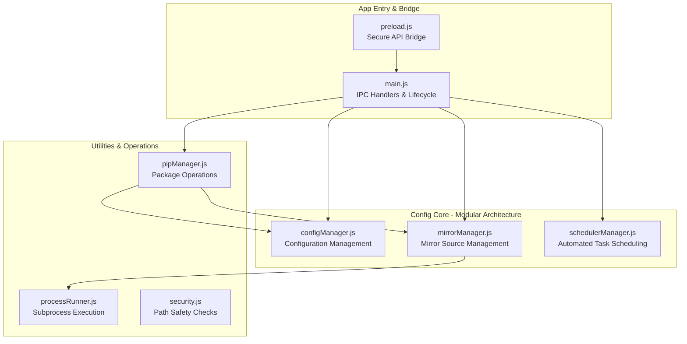
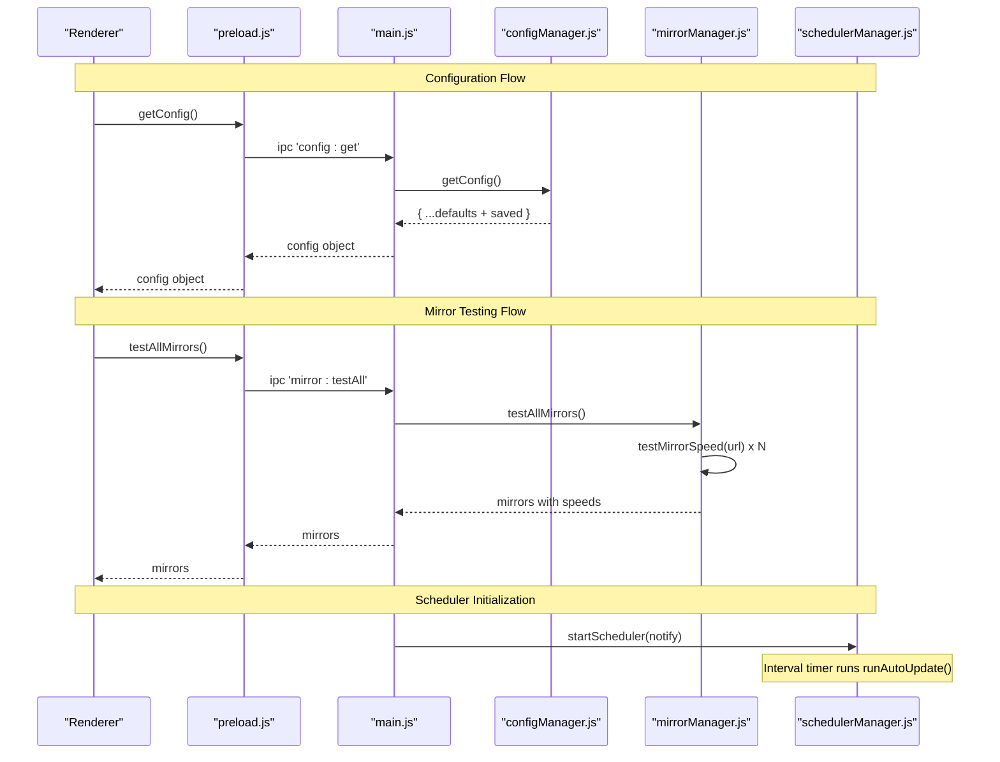
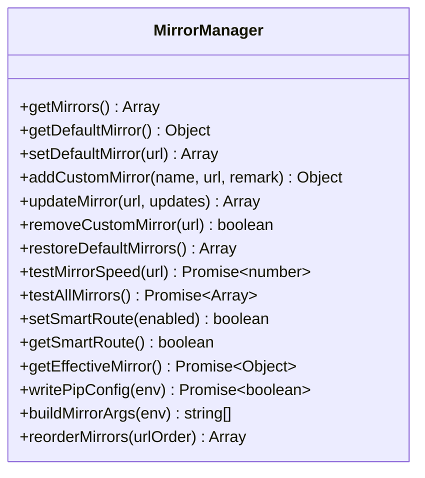
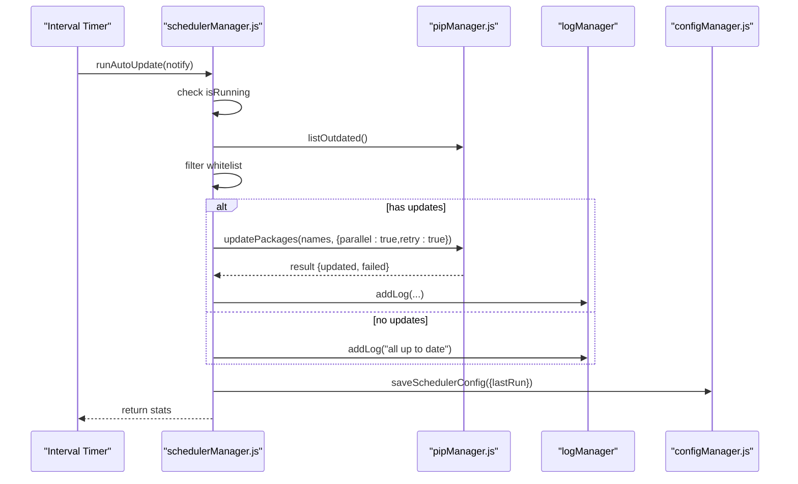
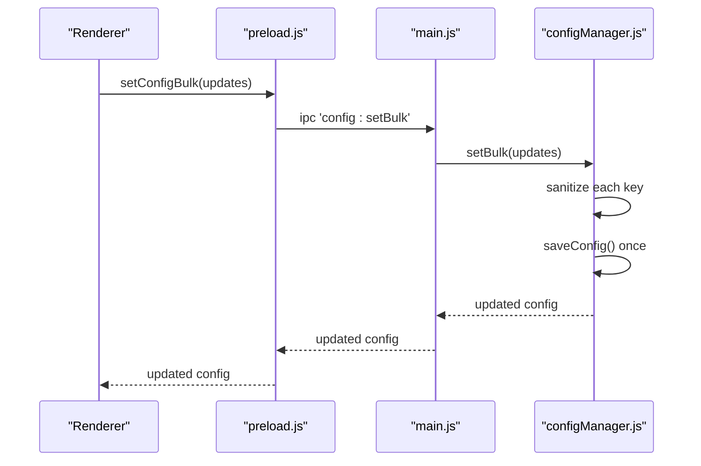
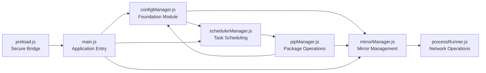

# Configuration System

<cite>
**Referenced Files in This Document**
- [configManager.js](file://core/config/configManager.js)
- [mirrorManager.js](file://core/config/mirrorManager.js)
- [schedulerManager.js](file://core/config/schedulerManager.js)
- [main.js](file://main.js)
- [preload.js](file://preload.js)
- [processRunner.js](file://utils/processRunner.js)
- [security.js](file://utils/security.js)
- [pipManager.js](file://core/operations/pipManager.js)
</cite>

## Update Summary
**Changes Made**
- Updated project structure section to reflect the new modular architecture under `core/config/`
- Enhanced component descriptions to highlight the separation of concerns between config, mirror, and scheduler management
- Added detailed coverage of the new scheduler manager functionality for automated tasks
- Expanded mirror manager capabilities including speed testing and smart routing
- Updated IPC integration examples to show the new modular API structure
- Enhanced troubleshooting guide with new error scenarios specific to the modular architecture

## Table of Contents
1. [Introduction](#introduction)
2. [Project Structure](#project-structure)
3. [Core Components](#core-components)
4. [Architecture Overview](#architecture-overview)
5. [Detailed Component Analysis](#detailed-component-analysis)
6. [Dependency Analysis](#dependency-analysis)
7. [Performance Considerations](#performance-considerations)
8. [Troubleshooting Guide](#troubleshooting-guide)
9. [Conclusion](#conclusion)
10. [Appendices](#appendices)

## Introduction
This document explains PyLibMaster's configuration management system with a focus on:
- Atomic file operations that prevent configuration corruption
- Value validation and range checking for numeric settings
- Default configuration management and environment-specific behavior
- The scheduler system for automated tasks with whitelist support
- Mirror source configuration, speed testing, and optimization
- Configuration schema, validation rules, and migration strategies
- Examples of common scenarios, advanced parallel processing settings, retry policies, and security configurations
- How configuration changes are persisted and synchronized across the application through the new modular architecture

## Project Structure
The configuration subsystem has been restructured into a modular architecture under `core/config/` with three specialized managers:

**New Modular Structure:**
- `configManager.js`: Centralized configuration persistence, defaults, validation, and atomic writes
- `mirrorManager.js`: PyPI mirror list management, speed testing, smart routing, pip config writing
- `schedulerManager.js`: Automated update scheduling with whitelist support and status persistence

**Supporting Integration Points:**
- `main.js`: IPC handlers bridging UI to core modules; initializes scheduler and theme sync
- `preload.js`: Secure bridge exposing configuration and mirror APIs to the renderer
- `processRunner.js`: Subprocess execution used by mirror speed tests and pip operations
- `security.js`: Path safety checks used by other modules (e.g., opening paths)
- `pipManager.js`: Uses configuration for storage path and interacts with mirrors and retries



**Diagram sources**
- [configManager.js:1-194](file://core/config/configManager.js#L1-L194)
- [mirrorManager.js:1-376](file://core/config/mirrorManager.js#L1-L376)
- [schedulerManager.js:1-197](file://core/config/schedulerManager.js#L1-L197)
- [main.js:1-640](file://main.js#L1-L640)
- [preload.js:1-221](file://preload.js#L1-L221)
- [processRunner.js:1-366](file://utils/processRunner.js#L1-L366)
- [security.js:1-43](file://utils/security.js#L1-L43)
- [pipManager.js:1-200](file://core/operations/pipManager.js#L1-L200)

**Section sources**
- [configManager.js:1-194](file://core/config/configManager.js#L1-L194)
- [mirrorManager.js:1-376](file://core/config/mirrorManager.js#L1-L376)
- [schedulerManager.js:1-197](file://core/config/schedulerManager.js#L1-L197)
- [main.js:1-640](file://main.js#L1-L640)
- [preload.js:1-221](file://preload.js#L1-L221)

## Core Components
The modular architecture separates configuration concerns into three specialized managers:

### Config Manager
- Provides getConfig, setConfig, setBulk, getStoragePath, init functions
- Implements default merging, value sanitization, and atomic save operations
- Handles environment-aware storage path resolution
- Ensures data integrity through atomic file operations

### Mirror Manager  
- Manages built-in and custom PyPI mirrors with validation
- Implements speed testing using HEAD requests with timeouts
- Supports smart routing for automatic fastest mirror selection
- Writes platform-specific pip configuration files
- Maintains mirror priority ordering and user preferences

### Scheduler Manager
- Persists and runs scheduled updates based on frequency (daily/weekly)
- Filters packages using configurable whitelist
- Executes background updates with parallel/retry options
- Logs results and provides UI notifications
- Prevents concurrent executions with in-memory guards

Key responsibilities across all components:
- Atomic persistence via temporary file + rename
- Numeric range enforcement with fallbacks
- Environment-aware storage path resolution
- Cross-process IPC exposure for safe UI access

**Section sources**
- [configManager.js:21-44](file://core/config/configManager.js#L21-L44)
- [configManager.js:80-117](file://core/config/configManager.js#L80-L117)
- [configManager.js:123-138](file://core/config/configManager.js#L123-138)
- [mirrorManager.js:21-29](file://core/config/mirrorManager.js#L21-L29)
- [mirrorManager.js:43-51](file://core/config/mirrorManager.js#L43-51)
- [mirrorManager.js:219-247](file://core/config/mirrorManager.js#L219-247)
- [schedulerManager.js:29-50](file://core/config/schedulerManager.js#L29-50)
- [schedulerManager.js:70-138](file://core/config/schedulerManager.js#L70-138)

## Architecture Overview
The new modular architecture flows from the renderer through preload.js IPC to main.js handlers, which delegate to specialized core modules. Changes are validated and persisted atomically, with each module handling its specific domain.



**Diagram sources**
- [preload.js:94-98](file://preload.js#L94-L98)
- [main.js:408-413](file://main.js#L408-L413)
- [configManager.js:144-178](file://core/config/configManager.js#L144-L178)
- [mirrorManager.js:240-247](file://core/config/mirrorManager.js#L240-247)
- [main.js:140-144](file://main.js#L140-L144)

## Detailed Component Analysis

### Config Manager: Defaults, Validation, Atomic Writes
The config manager serves as the foundation for all configuration operations:

- **Default Values**: Includes theme, language, storagePath, parallelThreads, retryCount, smartRoute, currentEnv, windowBounds
- **Numeric Validation**: Fields have min/max ranges and fallbacks; invalid types revert to defaults
- **Initialization**: Merges saved config with defaults and rebuilds on parse errors
- **Atomic Persistence**: Uses writeFileSync to .tmp then renameSync to avoid partial writes
- **Storage Management**: Automatically creates storage directories as needed


**Diagram sources**
- [configManager.js:157-178](file://core/config/configManager.js#L157-178)
- [configManager.js:123-138](file://core/config/configManager.js#L123-138)

**Section sources**
- [configManager.js:21-44](file://core/config/configManager.js#L21-44)
- [configManager.js:80-117](file://core/config/configManager.js#L80-117)
- [configManager.js:123-138](file://core/config/configManager.js#L123-138)
- [configManager.js:144-178](file://core/config/configManager.js#L144-178)

### Mirror Manager: Sources, Speed Testing, Smart Routing
The mirror manager handles all PyPI mirror-related functionality:

- **Built-in Mirrors**: Official PyPI, Tsinghua, Aliyun, Tencent Cloud, Huawei Cloud, Douban
- **URL Validation**: Enforces http/https protocols and length limits
- **Smart Routing**: Automatic selection of fastest mirror when enabled
- **Speed Testing**: Uses HEAD requests with 5-second timeouts
- **Pip Integration**: Writes platform-specific configuration files
- **User Customization**: Preserves user edits while maintaining exactly one default mirror



**Diagram sources**
- [mirrorManager.js:109-112](file://core/config/mirrorManager.js#L109-112)
- [mirrorManager.js:115-130](file://core/config/mirrorManager.js#L115-130)
- [mirrorManager.js:139-150](file://core/config/mirrorManager.js#L139-150)
- [mirrorManager.js:158-179](file://core/config/mirrorManager.js#L158-179)
- [mirrorManager.js:219-247](file://core/config/mirrorManager.js#L219-247)
- [mirrorManager.js:267-290](file://core/config/mirrorManager.js#L267-290)
- [mirrorManager.js:299-322](file://core/config/mirrorManager.js#L299-322)
- [mirrorManager.js:329-333](file://core/config/mirrorManager.js#L329-333)
- [mirrorManager.js:340-357](file://core/config/mirrorManager.js#L340-357)

**Section sources**
- [mirrorManager.js:21-29](file://core/config/mirrorManager.js#L21-29)
- [mirrorManager.js:43-51](file://core/config/mirrorManager.js#L43-51)
- [mirrorManager.js:60-91](file://core/config/mirrorManager.js#L60-91)
- [mirrorManager.js:219-247](file://core/config/mirrorManager.js#L219-247)
- [mirrorManager.js:267-290](file://core/config/mirrorManager.js#L267-290)
- [mirrorManager.js:299-322](file://core/config/mirrorManager.js#L299-322)

### Scheduler Manager: Automated Tasks and Whitelist Filtering
The scheduler manager provides automated package maintenance:

- **Configuration**: Reads schedulerEnabled, schedulerFrequency, schedulerWhitelist, schedulerLastRun from config
- **Flexible Scheduling**: Supports daily and weekly intervals with millisecond precision
- **Background Execution**: Runs updates without blocking UI threads
- **Whitelist Support**: Filters out specified packages from automatic updates
- **Concurrent Protection**: Prevents overlapping executions with in-memory guards
- **Result Logging**: Comprehensive logging of update operations and outcomes



**Diagram sources**
- [schedulerManager.js:70-138](file://core/config/schedulerManager.js#L70-138)
- [schedulerManager.js:145-163](file://core/config/schedulerManager.js#L145-163)

**Section sources**
- [schedulerManager.js:29-50](file://core/config/schedulerManager.js#L29-50)
- [schedulerManager.js:70-138](file://core/config/schedulerManager.js#L70-138)
- [schedulerManager.js:145-163](file://core/config/schedulerManager.js#L145-163)

### IPC Integration and Synchronization
The modular architecture maintains secure IPC communication:

- **main.js**: Exposes IPC handlers for config, mirrors, scheduler, and other modules
- **preload.js**: Bridges these to the renderer via contextBridge with explicit method whitelisting
- **Event System**: Theme synchronization and scheduler notifications propagate back to renderer
- **Security**: Limited exposure ensures renderer cannot directly access Node.js APIs



**Diagram sources**
- [preload.js:96-98](file://preload.js#L96-98)
- [main.js:408-413](file://main.js#L408-L413)
- [configManager.js:171-178](file://core/config/configManager.js#L171-178)

**Section sources**
- [main.js:408-413](file://main.js#L408-L413)
- [preload.js:94-98](file://preload.js#L94-98)

## Dependency Analysis
The modular architecture creates clear dependency relationships:

- **configManager.js**: Foundational module with no dependencies on other config modules
- **mirrorManager.js**: Depends on configManager.js for reading/writing configuration
- **schedulerManager.js**: Depends on configManager.js and integrates with pipManager.js
- **main.js**: Orchestrates all modules and manages lifecycle
- **preload.js**: Provides secure bridge between renderer and main process



**Diagram sources**
- [configManager.js:1-194](file://core/config/configManager.js#L1-194)
- [mirrorManager.js:1-376](file://core/config/mirrorManager.js#L1-376)
- [schedulerManager.js:1-197](file://core/config/schedulerManager.js#L1-197)
- [processRunner.js:1-366](file://utils/processRunner.js#L1-366)
- [pipManager.js:1-200](file://core/operations/pipManager.js#L1-200)
- [main.js:1-640](file://main.js#L1-640)
- [preload.js:1-221](file://preload.js#L1-221)

**Section sources**
- [configManager.js:1-194](file://core/config/configManager.js#L1-194)
- [mirrorManager.js:1-376](file://core/config/mirrorManager.js#L1-376)
- [schedulerManager.js:1-197](file://core/config/schedulerManager.js#L1-197)
- [processRunner.js:1-366](file://utils/processRunner.js#L1-366)
- [pipManager.js:1-200](file://core/operations/pipManager.js#L1-200)
- [main.js:1-640](file://main.js#L1-640)
- [preload.js:1-221](file://preload.js#L1-221)

## Performance Considerations
The modular architecture enhances performance through specialization:

- **Atomic Writes**: All modules use atomic file operations to minimize disk contention and corruption risk
- **Bulk Operations**: Config manager supports batch updates to reduce I/O overhead
- **Parallel Processing**: Mirror speed tests use concurrent requests with timeouts
- **Caching**: Modules implement appropriate caching strategies (mirrors, pip readiness)
- **Memory Management**: Scheduler prevents concurrent executions and cleans up timers properly
- **Lazy Loading**: Modules initialize only when needed, reducing startup time

## Troubleshooting Guide
Common issues and resolutions in the modular architecture:

### Configuration Issues
- **File Corruption**: Config manager automatically rebuilds defaults and saves on parse errors
- **Invalid Values**: Numeric fields are clamped to valid ranges; type mismatches use defaults
- **Path Issues**: Storage path creation is automatic; verify permissions if manual paths fail

### Mirror Management Issues
- **Speed Test Failures**: Network restrictions or firewall may cause timeouts; consider local mirrors
- **Configuration Write Failures**: Check OS-specific directories and permissions
- **Invalid URLs**: Mirror URLs must be http/https and within length limits

### Scheduler Issues
- **Not Running**: Ensure schedulerEnabled is true and frequency is valid
- **Concurrent Execution**: In-memory guard prevents overlapping updates
- **Permission Errors**: Verify write permissions for log and config directories

**Section sources**
- [configManager.js:112-117](file://core/config/configManager.js#L112-117)
- [configManager.js:123-138](file://core/config/configManager.js#L123-138)
- [mirrorManager.js:219-247](file://core/config/mirrorManager.js#L219-247)
- [schedulerManager.js:70-138](file://core/config/schedulerManager.js#L70-138)
- [mirrorManager.js:299-322](file://core/config/mirrorManager.js#L299-322)

## Conclusion
PyLibMaster's restructured configuration system emphasizes reliability, performance, and maintainability:

- **Modular Design**: Clear separation of concerns between configuration, mirror management, and task scheduling
- **Atomic Operations**: All file operations use atomic writes to prevent corruption
- **Validation**: Strict input validation ensures safe and sane defaults
- **Flexibility**: Mirror management offers flexible and fast package retrieval options
- **Automation**: Scheduler automates maintenance tasks with robust logging and notification
- **Security**: IPC integration enables secure and responsive UI interactions

## Appendices

### Configuration Schema and Validation Rules
The unified configuration schema spans all modules:

**Core Configuration Keys:**
- `theme`: string (light/dark/system)
- `language`: string (zh/en)
- `storagePath`: string (directory path)
- `parallelThreads`: number (min 1, max 16, fallback 4)
- `retryCount`: number (min 0, max 10, fallback 3)
- `smartRoute`: boolean
- `currentEnv`: string|null
- `windowBounds`: object { width, height, x, y }

**Mirror Configuration:**
- `mirrors`: array of objects { name, url, remark, isDefault, speed }

**Scheduler Configuration:**
- `schedulerEnabled`: boolean
- `schedulerFrequency`: string ('daily'|'weekly')
- `schedulerWhitelist`: array of strings
- `schedulerLastRun`: string|null (ISO timestamp)

**Validation Rules:**
- Numeric fields sanitized to integers within bounds; invalid types reset to defaults
- Mirror URLs must be http/https and within length limits
- Exactly one default mirror enforced after merge

**Section sources**
- [configManager.js:21-44](file://core/config/configManager.js#L21-44)
- [configManager.js:80-117](file://core/config/configManager.js#L80-117)
- [mirrorManager.js:43-51](file://core/config/mirrorManager.js#L43-51)
- [mirrorManager.js:60-91](file://core/config/mirrorManager.js#L60-91)

### Migration Strategies
The modular architecture supports seamless migrations:

- **Backward Compatibility**: Saved config merges with defaults; unknown keys preserved but not validated
- **Error Recovery**: Parsing failures trigger immediate default restoration and saving
- **Schema Evolution**: Future changes should introduce versioned migrations in configManager.init
- **Module Independence**: Each module can evolve independently without breaking others

**Section sources**
- [configManager.js:80-117](file://core/config/configManager.js#L80-117)

### Common Configuration Scenarios
Practical usage patterns for the modular system:

**Parallel Processing Setup:**
```javascript
// Set parallel threads and retry count together
electronAPI.setConfigBulk({
  parallelThreads: 8,
  retryCount: 5
});
```

**Smart Route Configuration:**
```javascript
// Enable automatic fastest mirror selection
electronAPI.setSmartRoute(true);
```

**Custom Mirror Management:**
```javascript
// Add custom mirror
electronAPI.addCustomMirror('My Mirror', 'https://custom.pypi.org/simple/', 'Internal mirror');

// Restore defaults
electronAPI.restoreDefaultMirrors();
```

**Scheduler Configuration:**
```javascript
// Configure weekly updates with whitelist
electronAPI.saveSchedulerConfig({
  enabled: true,
  frequency: 'weekly',
  whitelist: ['numpy', 'pandas']
});
```

**Section sources**
- [configManager.js:171-178](file://core/config/configManager.js#L171-178)
- [mirrorManager.js:139-150](file://core/config/mirrorManager.js#L139-150)
- [mirrorManager.js:204-210](file://core/config/mirrorManager.js#L204-210)
- [schedulerManager.js:43-50](file://core/config/schedulerManager.js#L43-50)

### Advanced Settings: Parallel Processing, Retry Policies, Security
Advanced configuration options for optimal performance and security:

**Parallel Processing:**
- `parallelThreads`: Controls concurrency for pip operations; balance with system resources
- Optimal values depend on CPU cores and available memory

**Retry Policies:**
- `retryCount`: Influences automatic retries for failed operations
- Combined with parallel mode for resilient batch operations

**Security Measures:**
- Mirror URL validation prevents unsafe protocols
- Path safety checks restrict file operations to allowed directories
- IPC exposure limited to explicitly defined methods in preload.js
- Context isolation prevents direct Node.js API access from renderer

**Section sources**
- [configManager.js:21-44](file://core/config/configManager.js#L21-44)
- [mirrorManager.js:43-51](file://core/config/mirrorManager.js#L43-51)
- [security.js:28-40](file://utils/security.js#L28-40)
- [preload.js:20-221](file://preload.js#L20-221)

### Persistence and Synchronization Across the Application
The modular architecture ensures consistent state management:

**Atomic Persistence:**
- All configuration changes go through configManager.setConfig/setBulk
- Validates and persists atomically to prevent corruption
- Single disk write for bulk operations reduces I/O overhead

**IPC Communication:**
- main.js exposes functions to renderer via preload.js
- Secure bridge ensures proper access control
- Event-driven updates keep UI synchronized

**Cross-Module Consistency:**
- Mirror and scheduler modules read/write configuration consistently
- Shared configManager instance ensures unified state
- Theme and scheduler notifications propagate via IPC events

**Section sources**
- [configManager.js:144-178](file://core/config/configManager.js#L144-178)
- [main.js:408-413](file://main.js#L408-L413)
- [preload.js:94-98](file://preload.js#L94-98)
- [mirrorManager.js:97-107](file://core/config/mirrorManager.js#L97-107)
- [schedulerManager.js:43-50](file://core/config/schedulerManager.js#L43-50)