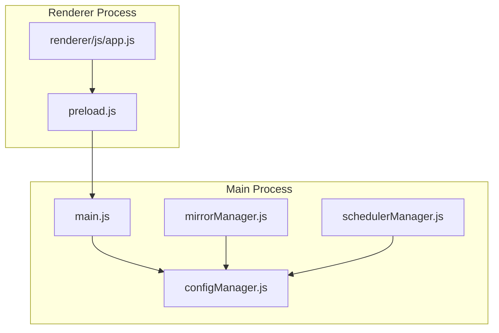
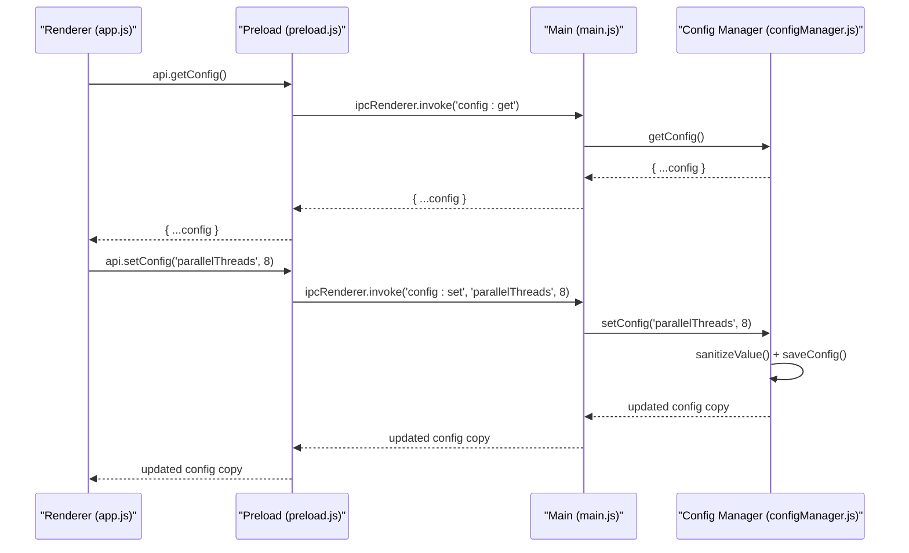
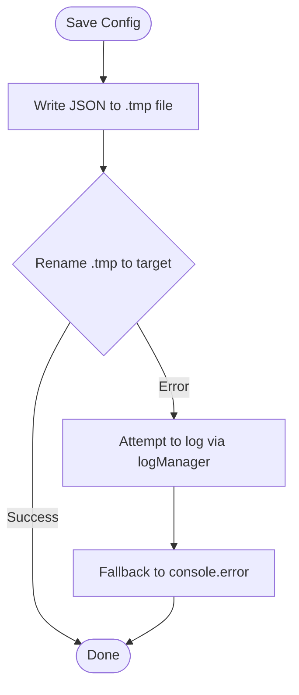
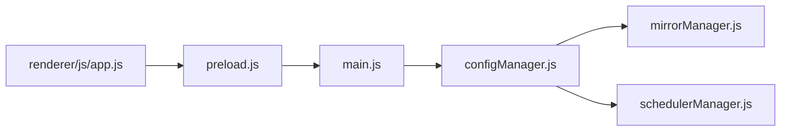

# Core Configuration Manager

<cite>
**Referenced Files in This Document**
- [configManager.js](file://core/config/configManager.js)
- [main.js](file://main.js)
- [preload.js](file://preload.js)
- [mirrorManager.js](file://core/config/mirrorManager.js)
- [schedulerManager.js](file://core/config/schedulerManager.js)
- [app.js](file://renderer/js/app.js)
</cite>

## Table of Contents
1. [Introduction](#introduction)
2. [Project Structure](#project-structure)
3. [Core Components](#core-components)
4. [Architecture Overview](#architecture-overview)
5. [Detailed Component Analysis](#detailed-component-analysis)
6. [Dependency Analysis](#dependency-analysis)
7. [Performance Considerations](#performance-considerations)
8. [Troubleshooting Guide](#troubleshooting-guide)
9. [Conclusion](#conclusion)
10. [Appendices](#appendices)

## Introduction
This document explains the core configuration manager module that persists and manages application settings for the Electron-based application. It focuses on:
- Atomic file operations to prevent configuration corruption via temporary file writing and renaming
- Value validation and range checking with automatic correction
- Default configuration management and fallback mechanisms across operating systems
- The complete configuration schema including theme, language, storage paths, parallel threads, retry counts, smart routing, environment selection, and window bounds
- Initialization and loading from the Electron userData directory
- Error handling for corrupted configurations
- Practical examples of API usage patterns for get/set, bulk updates, and storage path management

## Project Structure
The configuration system is centered around a single manager module that provides a stable API surface used by other modules (mirrors, scheduler, environment, UI). The main process wires IPC handlers to expose these APIs to the renderer through a preload bridge.

**Diagram sources**
- [main.js](file://main.js)
- [configManager.js](file://core/config/configManager.js)
- [mirrorManager.js](file://core/config/mirrorManager.js)
- [schedulerManager.js](file://core/config/schedulerManager.js)
- [preload.js](file://preload.js)
- [app.js](file://renderer/js/app.js)

**Section sources**
- [configManager.js](file://core/config/configManager.js)
- [main.js](file://main.js)
- [preload.js](file://preload.js)
- [mirrorManager.js](file://core/config/mirrorManager.js)
- [schedulerManager.js](file://core/config/schedulerManager.js)
- [app.js](file://renderer/js/app.js)

## Core Components
- configManager.js: Central persistence layer for application configuration with atomic writes, value sanitization, defaults, and storage path management.
- main.js: Exposes IPC handlers for configuration read/write and integrates window bounds persistence.
- preload.js: Bridges renderer calls to main process IPC endpoints for configuration operations.
- mirrorManager.js: Uses configManager to persist mirror lists and smart routing preferences.
- schedulerManager.js: Persists scheduler state and runs periodic tasks using config values.
- app.js (renderer): Demonstrates typical user-driven configuration changes (theme, language, threads, retries).

Key responsibilities:
- Provide getConfig(), setConfig(key, value), setBulk(updates), and getStoragePath()
- Ensure safe initialization and recovery from corrupted files
- Maintain default values and enforce numeric ranges
- Persist window bounds and other runtime state

**Section sources**
- [configManager.js](file://core/config/configManager.js)
- [main.js](file://main.js)
- [preload.js](file://preload.js)
- [mirrorManager.js](file://core/config/mirrorManager.js)
- [schedulerManager.js](file://core/config/schedulerManager.js)
- [app.js](file://renderer/js/app.js)

## Architecture Overview
The configuration flow spans the renderer, preload bridge, main process IPC, and the config manager.

**Diagram sources**
- [main.js](file://main.js)
- [preload.js](file://preload.js)
- [configManager.js](file://core/config/configManager.js)

## Detailed Component Analysis

### Configuration Schema
The configuration object includes:
- theme: string — UI theme preference ('light' | 'dark' | 'system')
- language: string — UI language ('zh' | 'en')
- storagePath: string — Path for logs and backups; auto-created if missing
- parallelThreads: number — Parallel installation threads (validated range)
- retryCount: number — Smart retry count (validated range)
- smartRoute: boolean — Enable automatic fastest mirror selection
- currentEnv: string|null — Selected Python environment path
- windowBounds: object — Window position and size { x, y, width, height }
- mirrors: array — Mirror source list persisted by mirrorManager
- schedulerEnabled: boolean — Enable scheduled updates
- schedulerFrequency: string — 'daily' or 'weekly'
- schedulerWhitelist: array — Packages excluded from auto-update
- schedulerLastRun: string|null — ISO timestamp of last run
- autoCheckUpdates: boolean — Whether to check for updates at startup
- minimizeToTray: boolean — Minimize to tray instead of closing

Defaults are applied when keys are missing or invalid, ensuring robust behavior.

**Section sources**
- [configManager.js](file://core/config/configManager.js)
- [mirrorManager.js](file://core/config/mirrorManager.js)
- [schedulerManager.js](file://core/config/schedulerManager.js)

### Atomic File Operations and Corruption Prevention
- Writes use a two-step atomic pattern: write to a temporary file then rename to the target path. This prevents partial writes from corrupting the configuration file during crashes or interruptions.
- On errors during save, the module attempts to log via logManager if available; otherwise it falls back to stderr to avoid silent failures.
- On load, JSON parsing is wrapped in try/catch; if the file is corrupted, defaults are re-applied and saved immediately.

**Diagram sources**
- [configManager.js](file://core/config/configManager.js)

**Section sources**
- [configManager.js](file://core/config/configManager.js)

### Value Validation and Range Checking
- Numeric fields are validated and clamped to allowed ranges with rounding. Invalid types fall back to predefined defaults.
- Ranges enforced:
  - parallelThreads: min=1, max=16, fallback=default threads
  - retryCount: min=0, max=10, fallback=default retry

This ensures that even malformed or out-of-range inputs cannot destabilize the application.

**Section sources**
- [configManager.js](file://core/config/configManager.js)

### Default Configuration Management
- Defaults include theme, language, storagePath (under install directory's log folder), parallelThreads, retryCount, smartRoute, currentEnv, and windowBounds.
- If no saved configuration exists, defaults are created and persisted immediately.
- When reading an existing file, defaults are merged with saved values so new keys are safely introduced without breaking old configs.

**Section sources**
- [configManager.js](file://core/config/configManager.js)

### Initialization and Loading from Electron userData
- On init, the module determines the configuration directory:
  - Preferred: Electron app.getPath('userData') when app is ready
  - Fallbacks: process.env.APPDATA (Windows), process.env.HOME (Unix-like), or current directory
- The configuration file name is fixed as pylibmaster-config.json within the resolved directory.
- The directory is created if missing.

**Section sources**
- [configManager.js](file://core/config/configManager.js)

### Error Handling for Corrupted Configurations
- If reading or parsing the configuration fails, the module resets to defaults and saves them immediately, ensuring subsequent loads succeed.
- Save failures are logged or printed to stderr depending on whether logging subsystem is available.

**Section sources**
- [configManager.js](file://core/config/configManager.js)

### Storage Path Management
- getStoragePath returns the configured storagePath and ensures the directory exists (creating it recursively if needed).
- This is used by components that need a reliable location for logs and backups.

**Section sources**
- [configManager.js](file://core/config/configManager.js)

### Integration with Other Modules
- mirrorManager reads/writes mirror lists and smartRoute flag via configManager.
- schedulerManager reads/writes scheduler-related keys and uses setBulk for efficient updates.
- main.js persists window bounds based on user interactions.

**Section sources**
- [mirrorManager.js](file://core/config/mirrorManager.js)
- [schedulerManager.js](file://core/config/schedulerManager.js)
- [main.js](file://main.js)

### Renderer Usage Patterns
- Theme and language changes are triggered by UI events and persisted via setConfig.
- Threads and retry counts are updated from settings controls.
- These flows demonstrate common get/set patterns and immediate persistence.

**Section sources**
- [app.js](file://renderer/js/app.js)

## Dependency Analysis
The configuration manager is a foundational dependency for multiple subsystems.

- Direct dependencies:
  - mirrorManager depends on configManager for persistent storage of mirror lists and smartRoute
  - schedulerManager depends on configManager for scheduler state
  - main.js exposes IPC handlers that call configManager
  - preload.js bridges renderer calls to main IPC handlers
  - renderer app.js invokes the exposed API for user-driven configuration changes

Potential circular dependencies: None observed between configManager and its consumers; consumers depend on configManager only.

**Diagram sources**
- [configManager.js](file://core/config/configManager.js)
- [mirrorManager.js](file://core/config/mirrorManager.js)
- [schedulerManager.js](file://core/config/schedulerManager.js)
- [main.js](file://main.js)
- [preload.js](file://preload.js)
- [app.js](file://renderer/js/app.js)

**Section sources**
- [configManager.js](file://core/config/configManager.js)
- [mirrorManager.js](file://core/config/mirrorManager.js)
- [schedulerManager.js](file://core/config/schedulerManager.js)
- [main.js](file://main.js)
- [preload.js](file://preload.js)
- [app.js](file://renderer/js/app.js)

## Performance Considerations
- Atomic writes ensure durability but incur disk I/O on every change. Bulk updates via setBulk reduce repeated writes when modifying multiple keys.
- getConfig returns a deep copy to prevent accidental mutation of internal state; callers should be mindful of performance when copying large objects frequently.
- Window bounds saving uses debouncing to avoid excessive writes during drag/resize operations.

[No sources needed since this section provides general guidance]

## Troubleshooting Guide
Common issues and resolutions:
- Configuration file corrupted:
  - Symptom: Application fails to load settings or throws parse errors.
  - Resolution: The manager automatically rebuilds defaults and saves them. Verify the file content after restart.
- Save failures:
  - Symptom: Errors during save not visible in logs.
  - Resolution: Check stderr output; the manager falls back to console.error when logging is unavailable.
- Storage path missing:
  - Symptom: Logs/backups fail due to missing directories.
  - Resolution: Use getStoragePath to ensure the directory exists; it creates it recursively if necessary.
- Out-of-range values:
  - Symptom: Unexpected thread/retry behavior.
  - Resolution: Values are clamped to valid ranges; verify input before setting.

**Section sources**
- [configManager.js](file://core/config/configManager.js)

## Conclusion
The configuration manager provides a robust, safe, and user-friendly interface for managing application settings. Its atomic writes, strict validation, sensible defaults, and cross-platform path resolution make it resilient to corruption and misuse. Consumers like mirror and scheduler managers rely on it for consistent state persistence, while the renderer interacts through a secure IPC bridge.

[No sources needed since this section summarizes without analyzing specific files]

## Appendices

### API Usage Examples
- Get full configuration:
  - Call getConfig to retrieve a snapshot of all settings.
- Set a single key:
  - Call setConfig with a key and value; the value is sanitized and persisted immediately.
- Bulk update:
  - Call setBulk with an object of key-value pairs; all values are sanitized and written once.
- Storage path:
  - Call getStoragePath to obtain a guaranteed-existing directory for logs and backups.

These patterns are demonstrated in the renderer when changing theme, language, threads, and retries, and in the main process when persisting window bounds.

**Section sources**
- [configManager.js](file://core/config/configManager.js)
- [main.js](file://main.js)
- [app.js](file://renderer/js/app.js)