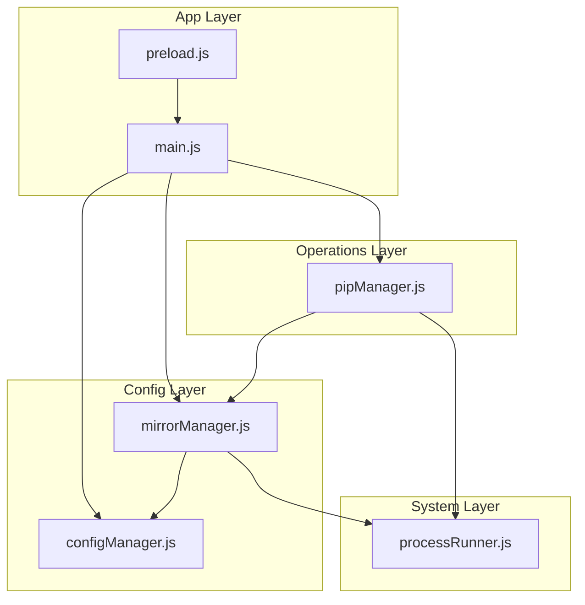
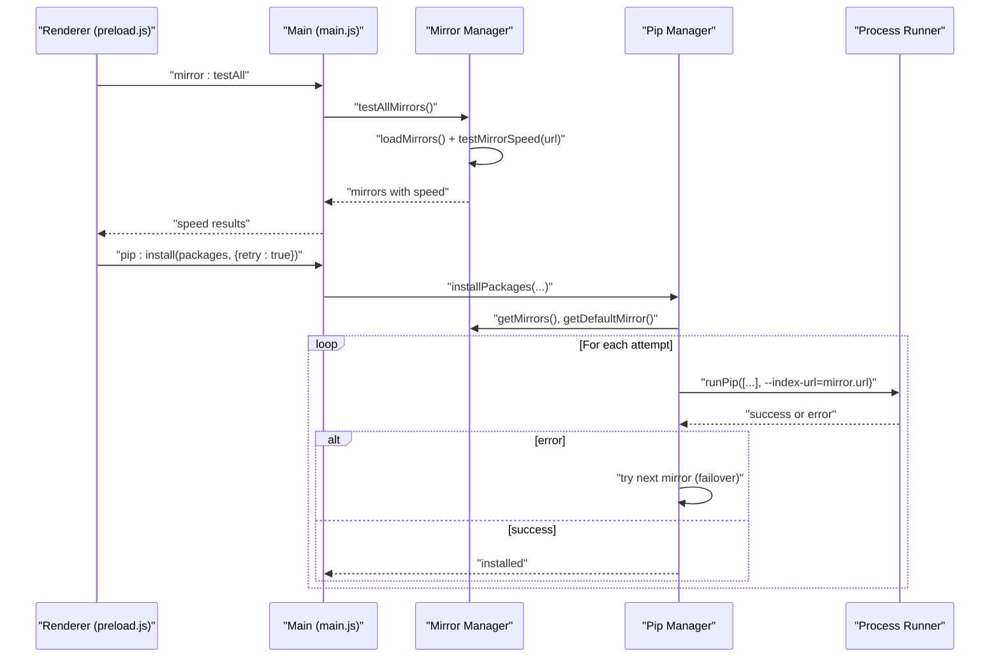
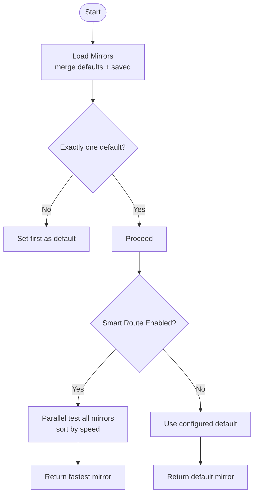
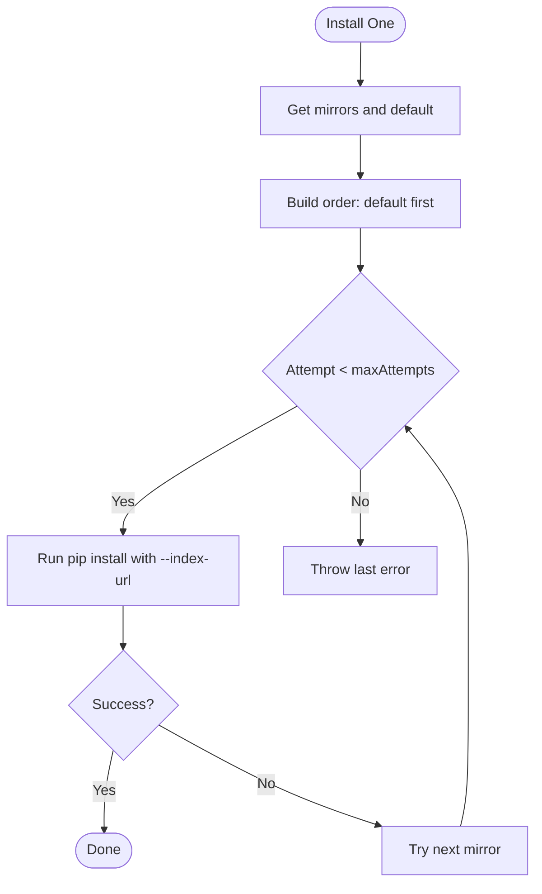
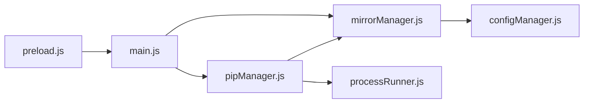

# Mirror Source Manager

<cite>
**Referenced Files in This Document**
- [mirrorManager.js](file://core/config/mirrorManager.js)
- [configManager.js](file://core/config/configManager.js)
- [pipManager.js](file://core/operations/pipManager.js)
- [processRunner.js](file://utils/processRunner.js)
- [main.js](file://main.js)
- [preload.js](file://preload.js)
</cite>

## Table of Contents
1. [Introduction](#introduction)
2. [Project Structure](#project-structure)
3. [Core Components](#core-components)
4. [Architecture Overview](#architecture-overview)
5. [Detailed Component Analysis](#detailed-component-analysis)
6. [Dependency Analysis](#dependency-analysis)
7. [Performance Considerations](#performance-considerations)
8. [Troubleshooting Guide](#troubleshooting-guide)
9. [Conclusion](#conclusion)

## Introduction
This document explains PyLibMaster’s mirror source management system for Python package downloads. It covers built-in mirrors, custom mirror addition, speed testing, intelligent route selection, automatic failover, and performance optimization. It also documents the configuration schema (URL patterns, authentication, timeouts, retries), bandwidth measurement approach, and practical examples for enterprise environments and proxy usage. Finally, it outlines health monitoring, automatic discovery considerations, and user-defined templates that integrate with mirror behavior.

## Project Structure
The mirror system is implemented primarily in a dedicated module and integrates with the pip operations layer, process runner, and application IPC handlers:
- Mirror configuration and selection logic live in the mirror manager.
- Pip operations use mirrors during install/update flows with automatic failover.
- Process runner provides network primitives and timeout/cancellation utilities.
- Main process exposes IPC endpoints to control mirrors from the UI.

**Diagram sources**
- [mirrorManager.js:1-376](file://core/config/mirrorManager.js#L1-L376)
- [configManager.js:1-194](file://core/config/configManager.js#L1-L194)
- [pipManager.js:1-800](file://core/operations/pipManager.js#L1-L800)
- [processRunner.js:1-366](file://utils/processRunner.js#L1-L366)
- [main.js:370-396](file://main.js#L370-L396)
- [preload.js:73-86](file://preload.js#L73-L86)

**Section sources**
- [mirrorManager.js:1-376](file://core/config/mirrorManager.js#L1-L376)
- [configManager.js:1-194](file://core/config/configManager.js#L1-L194)
- [pipManager.js:1-800](file://core/operations/pipManager.js#L1-L800)
- [processRunner.js:1-366](file://utils/processRunner.js#L1-L366)
- [main.js:370-396](file://main.js#L370-L396)
- [preload.js:73-86](file://preload.js#L73-L86)

## Core Components
- Mirror Manager: Manages built-in and custom mirrors, persistence, validation, speed tests, smart routing, pip config writing, and ordering.
- Config Manager: Persists application settings including smartRoute flag and retryCount; sanitizes numeric ranges.
- Pip Manager: Uses mirrors for installation and update operations, implementing multi-mirror failover and optional retry policies.
- Process Runner: Provides robust subprocess execution, timeouts, cancellation, and download helpers used by other modules.

Key responsibilities:
- Built-in mirrors are preconfigured and can be augmented with custom entries.
- Speed testing measures response latency via lightweight HEAD requests.
- Smart routing selects the fastest mirror when enabled.
- Failover tries multiple mirrors sequentially on failure.
- Pip configuration is written to platform-specific locations for global usage.

**Section sources**
- [mirrorManager.js:21-30](file://core/config/mirrorManager.js#L21-L30)
- [mirrorManager.js:60-91](file://core/config/mirrorManager.js#L60-L91)
- [mirrorManager.js:219-247](file://core/config/mirrorManager.js#L219-L247)
- [mirrorManager.js:267-290](file://core/config/mirrorManager.js#L267-L290)
- [mirrorManager.js:299-322](file://core/config/mirrorManager.js#L299-L322)
- [configManager.js:25-29](file://core/config/configManager.js#L25-L29)
- [configManager.js:90-99](file://core/config/configManager.js#L90-L99)
- [pipManager.js:608-633](file://core/operations/pipManager.js#L608-L633)
- [processRunner.js:85-161](file://utils/processRunner.js#L85-L161)

## Architecture Overview
The mirror system follows a layered architecture:
- UI triggers IPC calls exposed by main.js.
- main.js delegates to mirrorManager or pipManager based on operation type.
- mirrorManager handles mirror CRUD, speed tests, and pip config writes.
- pipManager orchestrates installs/updates using mirrors with failover.
- processRunner executes pip commands and manages timeouts/cancellations.

**Diagram sources**
- [main.js:370-396](file://main.js#L370-L396)
- [preload.js:73-86](file://preload.js#L73-L86)
- [mirrorManager.js:240-247](file://core/config/mirrorManager.js#L240-L247)
- [pipManager.js:608-633](file://core/operations/pipManager.js#L608-L633)
- [processRunner.js:340-342](file://utils/processRunner.js#L340-L342)

## Detailed Component Analysis

### Mirror Manager
Responsibilities:
- Validate URLs and enforce http/https only.
- Merge built-in and saved mirrors; ensure exactly one default.
- Persist mirror metadata (name, url, remark, isDefault, speed).
- Provide single and batch speed tests using HEAD requests with timeouts.
- Implement smart routing to pick the fastest mirror.
- Write pip configuration files for global index-url and timeout.
- Build command-line arguments for pip operations.

Key behaviors:
- URL validation rejects non-http(s) and overly long strings.
- loadMirrors merges defaults with saved state and enforces a single default.
- testMirrorSpeed uses AbortController and a 5-second timeout per request.
- testAllMirrors runs parallel speed tests and persists results.
- getEffectiveMirror returns best mirror if smartRoute is enabled, otherwise default.
- writePipConfig writes index-url and timeout into pip.ini/pip.conf.

**Diagram sources**
- [mirrorManager.js:60-91](file://core/config/mirrorManager.js#L60-L91)
- [mirrorManager.js:219-247](file://core/config/mirrorManager.js#L219-L247)
- [mirrorManager.js:267-290](file://core/config/mirrorManager.js#L267-L290)

**Section sources**
- [mirrorManager.js:43-51](file://core/config/mirrorManager.js#L43-L51)
- [mirrorManager.js:60-91](file://core/config/mirrorManager.js#L60-L91)
- [mirrorManager.js:219-247](file://core/config/mirrorManager.js#L219-L247)
- [mirrorManager.js:267-290](file://core/config/mirrorManager.js#L267-L290)
- [mirrorManager.js:299-322](file://core/config/mirrorManager.js#L299-L322)
- [mirrorManager.js:329-333](file://core/config/mirrorManager.js#L329-L333)

### Pip Manager Integration with Mirrors
Responsibilities:
- Construct package specs safely.
- Install packages with multi-mirror failover and optional retry policy.
- Integrate with backup/rollback mechanisms.

Failover algorithm:
- Order mirrors starting with default, then others.
- Attempt installation across up to maxAttempts mirrors.
- On failure, log warning and try next mirror until success or exhaustion.

**Diagram sources**
- [pipManager.js:608-633](file://core/operations/pipManager.js#L608-L633)

**Section sources**
- [pipManager.js:608-633](file://core/operations/pipManager.js#L608-L633)

### Configuration Management
Responsibilities:
- Persist app settings including smartRoute and retryCount.
- Sanitize numeric values within defined ranges.
- Provide safe storage path resolution.

Relevant fields:
- smartRoute: boolean enabling intelligent mirror selection.
- retryCount: number controlling maximum mirror attempts per operation.

**Section sources**
- [configManager.js:25-29](file://core/config/configManager.js#L25-L29)
- [configManager.js:90-99](file://core/config/configManager.js#L90-L99)
- [configManager.js:157-178](file://core/config/configManager.js#L157-L178)

### Process Runner
Responsibilities:
- Execute commands with UTF-8 encoding, ANSI stripping, and real-time output.
- Manage timeouts and graceful termination (SIGTERM then SIGKILL).
- Track active processes and support cancellation by operationId.

Relevance to mirrors:
- Ensures pip commands respect timeouts and can be canceled mid-operation.
- Provides reliable subprocess lifecycle management.

**Section sources**
- [processRunner.js:85-161](file://utils/processRunner.js#L85-L161)
- [processRunner.js:168-206](file://utils/processRunner.js#L168-L206)
- [processRunner.js:340-342](file://utils/processRunner.js#L340-L342)

### IPC Exposure
Responsibilities:
- Expose mirror-related operations to the renderer via IPC.
- Bridge UI actions to core modules.

Exposed endpoints include listing mirrors, testing speeds, setting defaults, adding/updating/removing mirrors, toggling smartRoute, writing pip config, and reordering mirrors.

**Section sources**
- [main.js:370-396](file://main.js#L370-L396)
- [preload.js:73-86](file://preload.js#L73-L86)

## Dependency Analysis
Mirror system dependencies:
- mirrorManager depends on configManager for persistence and on processRunner indirectly through fetch-based speed tests.
- pipManager depends on mirrorManager for mirror lists and default selection.
- main.js wires IPC handlers to mirrorManager and pipManager.
- preload.js exposes mirror APIs to the renderer.

**Diagram sources**
- [preload.js:73-86](file://preload.js#L73-L86)
- [main.js:370-396](file://main.js#L370-L396)
- [mirrorManager.js:1-376](file://core/config/mirrorManager.js#L1-L376)
- [pipManager.js:1-800](file://core/operations/pipManager.js#L1-L800)
- [configManager.js:1-194](file://core/config/configManager.js#L1-L194)
- [processRunner.js:1-366](file://utils/processRunner.js#L1-L366)

**Section sources**
- [main.js:370-396](file://main.js#L370-L396)
- [preload.js:73-86](file://preload.js#L73-L86)
- [mirrorManager.js:1-376](file://core/config/mirrorManager.js#L1-L376)
- [pipManager.js:1-800](file://core/operations/pipManager.js#L1-L800)
- [configManager.js:1-194](file://core/config/configManager.js#L1-L194)
- [processRunner.js:1-366](file://utils/processRunner.js#L1-L366)

## Performance Considerations
- Parallel speed testing: testAllMirrors performs concurrent HEAD requests to minimize latency measurement overhead.
- Caching: loadMirrors caches the merged list in memory to avoid repeated disk reads.
- Timeout handling: processRunner enforces command-level timeouts and structured termination to prevent hanging operations.
- Minimal payload: speed tests use HEAD requests to reduce bandwidth consumption.
- Efficient pip args: buildMirrorArgs avoids unnecessary flags for official PyPI.

[No sources needed since this section provides general guidance]

## Troubleshooting Guide
Common issues and resolutions:
- Invalid mirror URL: Ensure http/https protocol and reasonable length; add trailing slash if required by server.
- Slow or failing mirrors: Run testAllMirrors to identify slow endpoints; reorder mirrors to prioritize faster ones.
- Pip config write failures: Check permissions for pip.ini/pip.conf location; verify directory existence.
- Network connectivity problems: Verify outbound access, firewall rules, and DNS resolution; consider corporate proxies at OS level.
- Timeouts during operations: Increase processRunner timeouts where necessary; ensure adequate network bandwidth.

Operational tips:
- Use smartRoute to automatically select the fastest mirror.
- Enable retryCount to allow multiple mirror attempts per operation.
- Monitor logs for failed mirror attempts and rollback events.

**Section sources**
- [mirrorManager.js:43-51](file://core/config/mirrorManager.js#L43-L51)
- [mirrorManager.js:219-247](file://core/config/mirrorManager.js#L219-L247)
- [mirrorManager.js:299-322](file://core/config/mirrorManager.js#L299-L322)
- [processRunner.js:85-161](file://utils/processRunner.js#L85-L161)

## Conclusion
PyLibMaster’s mirror source management system provides robust, configurable, and high-performance mirror handling for Python package downloads. It supports built-in and custom mirrors, validates inputs, measures speed, and intelligently selects the best endpoint. Automatic failover and configurable retry policies enhance reliability, while pip configuration integration ensures consistent behavior across tools. With clear IPC exposure and strong process management, the system offers a solid foundation for both personal and enterprise environments.

[No sources needed since this section summarizes without analyzing specific files]

## Appendices

### Mirror Configuration Schema
- name: string — human-readable label for the mirror.
- url: string — must start with http:// or https://; recommended to end with /simple/.
- remark: string — optional notes about the mirror.
- isDefault: boolean — indicates the active mirror when smartRoute is disabled.
- builtin: boolean — true for predefined mirrors; false for user-added mirrors.
- speed: number — measured latency in milliseconds; updated by speed tests.

Notes:
- Only one mirror should be marked as default; the system enforces this rule.
- Custom mirrors are persisted alongside built-in mirrors after merging.

**Section sources**
- [mirrorManager.js:21-29](file://core/config/mirrorManager.js#L21-L29)
- [mirrorManager.js:60-91](file://core/config/mirrorManager.js#L60-L91)
- [mirrorManager.js:97-107](file://core/config/mirrorManager.js#L97-L107)

### Speed Testing Implementation
- Method: HEAD request to a known package path under the mirror’s simple API.
- Timeout: 5 seconds per request using AbortController.
- Result: Response time in milliseconds; failures return a high value marker.
- Batch: All mirrors tested concurrently; results saved back to mirror objects.

Bandwidth measurement:
- Not directly measured; latency is used as a proxy for speed.
- For bandwidth estimation, consider measuring transfer size/time for a small file if needed.

**Section sources**
- [mirrorManager.js:219-247](file://core/config/mirrorManager.js#L219-L247)

### Intelligent Route Selection
- When smartRoute is enabled, getEffectiveMirror computes speeds (using cached or fresh tests) and returns the fastest mirror.
- Otherwise, getDefaultMirror returns the configured default.

**Section sources**
- [mirrorManager.js:267-290](file://core/config/mirrorManager.js#L267-L290)

### Automatic Failover Mechanism
- During install/update, pipManager iterates over mirrors ordered by default-first strategy.
- Each attempt passes --index-url to pip; on failure, the next mirror is tried up to maxAttempts.
- Logs warnings per failure and throws the last error if all attempts fail.

**Section sources**
- [pipManager.js:608-633](file://core/operations/pipManager.js#L608-L633)

### Enterprise Mirror Configuration Examples
- Add a private internal mirror:
  - Use addCustomMirror with a descriptive name, valid https URL ending with /simple/, and an optional remark.
- Configure smartRoute:
  - Enable smartRoute to let the system choose the fastest available mirror dynamically.
- Set retryCount:
  - Adjust retryCount to increase the number of mirror attempts per operation.

Note: Authentication and proxy settings are not handled by the mirror module itself; configure them at the OS or pip level as appropriate for your environment.

**Section sources**
- [mirrorManager.js:139-150](file://core/config/mirrorManager.js#L139-L150)
- [configManager.js:90-99](file://core/config/configManager.js#L90-L99)

### Proxy Settings Guidance
- The mirror module does not implement proxy configuration.
- For corporate networks, set HTTP(S) proxy at the OS level or via pip configuration outside this module.
- Ensure outbound connectivity to mirror URLs is allowed by firewalls and proxies.

[No sources needed since this section provides general guidance]

### Health Monitoring and Automatic Discovery
- Health monitoring:
  - Use testAllMirrors periodically to refresh speed metrics and detect degraded mirrors.
  - Review logs for failed mirror attempts and adjust priorities accordingly.
- Automatic discovery:
  - Not implemented in the current codebase; mirrors must be added manually or via automation scripts.

**Section sources**
- [mirrorManager.js:240-247](file://core/config/mirrorManager.js#L240-L247)

### User-Defined Templates
- While not part of the mirror module, templates define sets of packages for quick environment setup.
- They integrate with pipManager and can leverage mirror failover and retry policies during installation.

**Section sources**
- [templateManager.js:118-154](file://core/operations/templateManager.js#L118-L154)