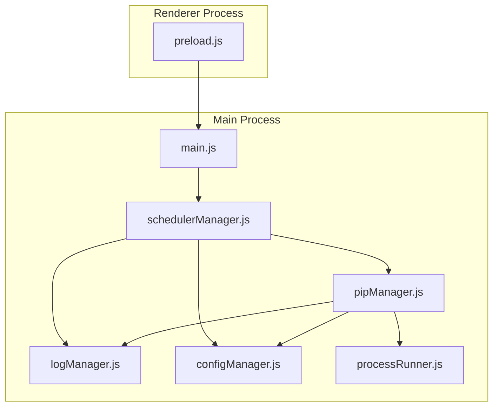
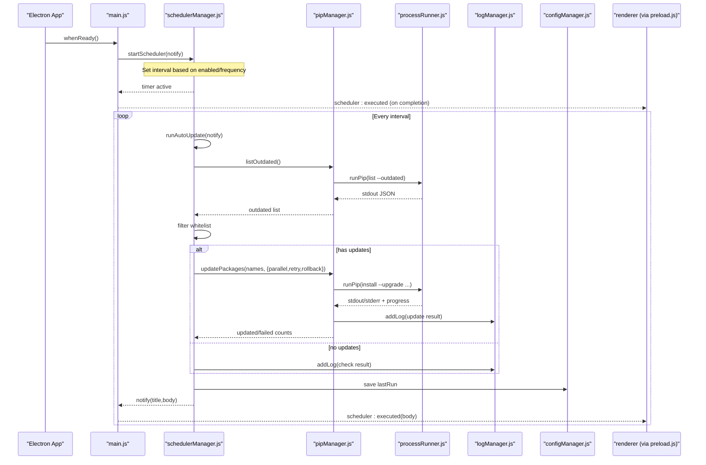
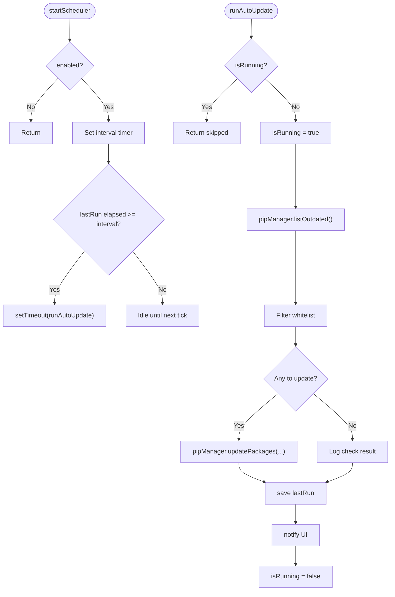
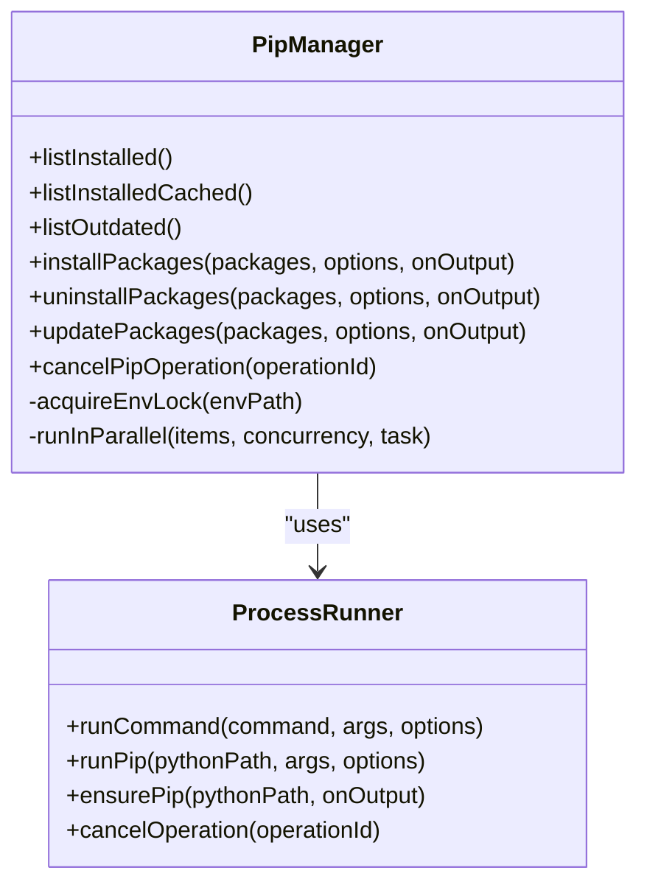
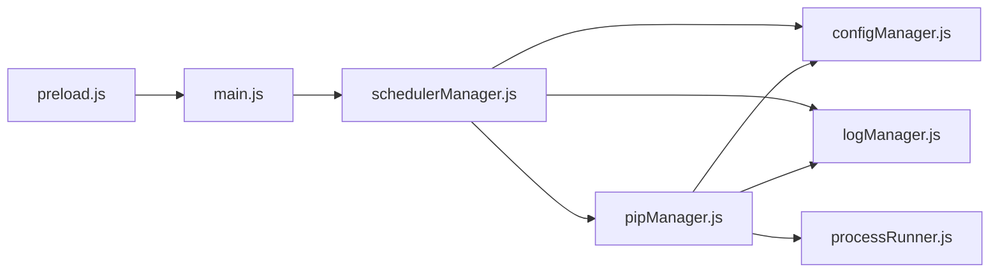

# Task Scheduler Manager

<cite>
**Referenced Files in This Document**
- [main.js](file://main.js)
- [preload.js](file://preload.js)
- [schedulerManager.js](file://core/config/schedulerManager.js)
- [pipManager.js](file://core/operations/pipManager.js)
- [logManager.js](file://core/system/logManager.js)
- [configManager.js](file://core/config/configManager.js)
- [processRunner.js](file://utils/processRunner.js)
</cite>

## Table of Contents
1. [Introduction](#introduction)
2. [Project Structure](#project-structure)
3. [Core Components](#core-components)
4. [Architecture Overview](#architecture-overview)
5. [Detailed Component Analysis](#detailed-component-analysis)
6. [Dependency Analysis](#dependency-analysis)
7. [Performance Considerations](#performance-considerations)
8. [Troubleshooting Guide](#troubleshooting-guide)
9. [Conclusion](#conclusion)
10. [Appendices](#appendices)

## Introduction
This document explains the task scheduler manager system in PyLibMaster, focusing on how automated tasks are scheduled, executed, and managed. It covers:
- Scheduling API for recurring tasks (daily/weekly), one-time execution, and integration with the application lifecycle
- Task lifecycle from creation to execution monitoring, error handling, and cleanup
- Priority management, resource allocation, and conflict resolution mechanisms
- Examples of common scheduling scenarios such as automatic package updates, backup creation, mirror testing, and maintenance tasks
- The task queue system, execution context isolation, and IPC integration between renderer and main processes

The current implementation provides a robust scheduler for periodic package updates, leveraging pip operations, logging, configuration persistence, and process control.

## Project Structure
The scheduler is implemented primarily in core/config/schedulerManager.js and integrated into the Electron main process via main.js. Supporting modules include pipManager.js for package operations, logManager.js for audit trails, configManager.js for settings persistence, and processRunner.js for subprocess orchestration. The preload layer exposes safe APIs to the renderer process.

**Diagram sources**
- [main.js](file://main.js)
- [schedulerManager.js](file://core/config/schedulerManager.js)
- [pipManager.js](file://core/operations/pipManager.js)
- [logManager.js](file://core/system/logManager.js)
- [configManager.js](file://core/config/configManager.js)
- [processRunner.js](file://utils/processRunner.js)
- [preload.js](file://preload.js)

**Section sources**
- [main.js](file://main.js)
- [schedulerManager.js](file://core/config/schedulerManager.js)
- [pipManager.js](file://core/operations/pipManager.js)
- [logManager.js](file://core/system/logManager.js)
- [configManager.js](file://core/config/configManager.js)
- [processRunner.js](file://utils/processRunner.js)
- [preload.js](file://preload.js)

## Core Components
- Scheduler Manager: Manages recurring schedules (daily/weekly), last run tracking, whitelist filtering, and background execution of update tasks.
- Pip Manager: Executes package operations (list outdated, install, uninstall, update), supports parallelism, retries, rollback, progress events, and cancellation.
- Log Manager: Persists operation logs with capacity limits, search/filtering, and flush-on-exit guarantees.
- Config Manager: Stores scheduler settings (enabled, frequency, whitelist, lastRun), validates numeric ranges, and persists atomically.
- Process Runner: Spawns Python/pip processes, handles timeouts, ANSI stripping, real-time output, and cancellation by operationId.
- Main Process: Initializes scheduler at app startup, wires IPC handlers, and bridges scheduler notifications to the renderer.
- Preload Layer: Exposes scheduler-related APIs to the renderer safely via IPC.

Key responsibilities and interactions:
- Scheduler reads configuration, sets intervals, and triggers runAutoUpdate periodically or immediately.
- runAutoUpdate calls pipManager.listOutdated, filters whitelisted packages, then invokes pipManager.updatePackages with parallel/retry options.
- All operations emit structured logs and persist lastRun timestamps.
- Progress and completion events flow through IPC to the UI.

**Section sources**
- [schedulerManager.js](file://core/config/schedulerManager.js)
- [pipManager.js](file://core/operations/pipManager.js)
- [logManager.js](file://core/system/logManager.js)
- [configManager.js](file://core/config/configManager.js)
- [processRunner.js](file://utils/processRunner.js)
- [main.js](file://main.js)
- [preload.js](file://preload.js)

## Architecture Overview
The scheduler integrates with the Electron main process lifecycle and uses IPC to communicate with the renderer. It relies on pipManager for package operations and processRunner for subprocess control. Logging and configuration are centralized for reliability.

**Diagram sources**
- [main.js](file://main.js)
- [schedulerManager.js](file://core/config/schedulerManager.js)
- [pipManager.js](file://core/operations/pipManager.js)
- [processRunner.js](file://utils/processRunner.js)
- [logManager.js](file://core/system/logManager.js)
- [configManager.js](file://core/config/configManager.js)
- [preload.js](file://preload.js)

## Detailed Component Analysis

### Scheduler Manager
Responsibilities:
- Read/write scheduler configuration (enabled, frequency, whitelist, lastRun)
- Start/stop timers based on frequency (daily/weekly)
- Execute background updates with whitelist filtering and logging
- Provide status and immediate run capability

Key behaviors:
- getInterval returns milliseconds for daily or weekly
- runAutoUpdate ensures single execution guard, lists outdated packages, filters whitelist, performs batch update with parallel/retry/rollback, logs results, saves lastRun, and notifies UI
- startScheduler clears existing timers, sets new interval, and optionally runs once if overdue since lastRun
- stopScheduler clears timers
- getStatus returns active/running flags and lastRun timestamp

Error handling:
- Exceptions during runAutoUpdate are caught, logged, and lastRun saved; finally block resets running flag

IPC integration:
- main.js registers handlers for scheduler:getStatus, scheduler:save, scheduler:runNow
- Notifications are sent to renderer via 'scheduler:executed'

**Diagram sources**
- [schedulerManager.js](file://core/config/schedulerManager.js)

**Section sources**
- [schedulerManager.js](file://core/config/schedulerManager.js)
- [main.js](file://main.js)

### Pip Manager Integration
Responsibilities relevant to scheduling:
- listOutdated: Returns outdated packages with current/latest versions
- updatePackages: Batch update with parallel execution, retry across mirrors, optional rollback, progress emission, and operationId-based cancellation

Concurrency and safety:
- Environment-level locks ensure serial execution per Python environment
- Parallel workers limited by config.parallelThreads
- Retry logic tries multiple mirrors and detects “Requirement already satisfied” to avoid false positives

Progress and cancellation:
- Emits structured progress events for UI updates
- Supports cancelPipOperation by operationId

**Diagram sources**
- [pipManager.js](file://core/operations/pipManager.js)
- [processRunner.js](file://utils/processRunner.js)

**Section sources**
- [pipManager.js](file://core/operations/pipManager.js)
- [processRunner.js](file://utils/processRunner.js)

### Logging and Configuration
Logging:
- Adds structured entries with time, action, status, type, detail
- Enforces max log count and field length truncation
- Debounced writes with flush on shutdown to prevent data loss

Configuration:
- Stores scheduler settings and other app preferences
- Validates numeric ranges and applies fallbacks
- Atomic file writes to avoid corruption

**Section sources**
- [logManager.js](file://core/system/logManager.js)
- [configManager.js](file://core/config/configManager.js)

### IPC and Renderer Integration
Preload exposes scheduler APIs:
- getSchedulerStatus
- saveSchedulerConfig
- runSchedulerNow
- onSchedulerExecuted callback

Main process handlers:
- scheduler:getStatus returns current state
- scheduler:save persists config and restarts scheduler
- scheduler:runNow executes an immediate update and returns result

Notifications:
- On completion, main sends 'scheduler:executed' to renderer with summary message

**Section sources**
- [preload.js](file://preload.js)
- [main.js](file://main.js)

## Dependency Analysis
High-level dependencies:
- schedulerManager depends on configManager, logManager, and pipManager
- pipManager depends on processRunner, configManager, logManager, mirrorManager, backupManager, envManager
- main orchestrates lifecycle and IPC, wiring scheduler notifications to renderer
- processRunner manages child processes and pip availability

Potential circular dependencies:
- None detected among core modules; dependencies are layered (scheduler -> pip -> processRunner)

External integrations:
- Python/pip commands via processRunner
- Filesystem for logs and config
- Electron IPC for UI communication

**Diagram sources**
- [schedulerManager.js](file://core/config/schedulerManager.js)
- [pipManager.js](file://core/operations/pipManager.js)
- [processRunner.js](file://utils/processRunner.js)
- [logManager.js](file://core/system/logManager.js)
- [configManager.js](file://core/config/configManager.js)
- [main.js](file://main.js)
- [preload.js](file://preload.js)

**Section sources**
- [schedulerManager.js](file://core/config/schedulerManager.js)
- [pipManager.js](file://core/operations/pipManager.js)
- [processRunner.js](file://utils/processRunner.js)
- [logManager.js](file://core/system/logManager.js)
- [configManager.js](file://core/config/configManager.js)
- [main.js](file://main.js)
- [preload.js](file://preload.js)

## Performance Considerations
- Parallel updates: Controlled by config.parallelThreads; default threads limit prevents overload
- Retry strategy: Multi-mirror retries reduce network failures impact
- Caching: Installed package cache reduces repeated scans; site-packages path cache avoids repeated lookups
- Debounced logging: Minimizes disk I/O bursts
- Environment locks: Prevent concurrent pip operations within the same environment, avoiding conflicts

Recommendations:
- Tune parallelThreads based on CPU cores and I/O characteristics
- Use whitelist to limit scope of auto-updates
- Monitor log size and rotate if necessary beyond MAX_LOGS

[No sources needed since this section provides general guidance]

## Troubleshooting Guide
Common issues and resolutions:
- Scheduler not running:
  - Verify scheduler.enabled and frequency in config
  - Ensure startScheduler was called during app initialization
- Auto-update skipped:
  - Check whitelist filtering; ensure packages are not whitelisted
  - Confirm outdated list is non-empty
- Update failures:
  - Inspect logs for specific errors (mirror connectivity, version constraints)
  - Use healthCheck and checkConflicts to diagnose environment issues
- Process hangs or timeouts:
  - Increase timeout values for long-running operations
  - Cancel operation using operationId if supported
- Logs missing or truncated:
  - Ensure flushLogs is called on shutdown
  - Check storage path permissions

Relevant IPC endpoints:
- scheduler:getStatus, scheduler:save, scheduler:runNow
- pip:healthCheck, pip:checkConflicts
- log:get, log:clear, log:add

**Section sources**
- [schedulerManager.js](file://core/config/schedulerManager.js)
- [pipManager.js](file://core/operations/pipManager.js)
- [logManager.js](file://core/system/logManager.js)
- [main.js](file://main.js)

## Conclusion
PyLibMaster’s task scheduler manager provides a reliable mechanism for automating package updates and related maintenance tasks. It integrates tightly with pip operations, maintains robust logging and configuration persistence, and communicates effectively with the UI through IPC. With configurable frequencies, whitelist filtering, parallel execution, retries, and rollback support, it offers a solid foundation for automated maintenance workflows.

[No sources needed since this section summarizes without analyzing specific files]

## Appendices

### Scheduling API Summary
- Recurring tasks:
  - Configure enabled and frequency (daily/weekly)
  - startScheduler sets up timers and optional immediate run if overdue
- One-time execution:
  - scheduler:runNow triggers an immediate update cycle
- Cron-like expressions:
  - Not currently supported; only fixed intervals (daily/weekly) are available

### Common Scenarios
- Automatic package updates:
  - Enabled scheduler runs listOutdated, filters whitelist, and updates packages in parallel with retries
- Backup creation:
  - Triggered before risky operations (install/uninstall/update) when rollback is enabled
- Mirror testing:
  - Use mirror:testAll to evaluate speeds; configure smartRoute to select fastest mirror
- Maintenance tasks:
  - Health checks and dependency conflict detection can be scheduled manually or extended to recurring jobs

### Execution Context Isolation
- Each pip operation runs in a separate child process via processRunner
- Environment-level locks serialize operations per Python environment
- Progress and output are streamed back to the caller via callbacks and IPC events

### Integration with Application Lifecycle
- Scheduler starts during app.whenReady
- On before-quit, all active processes are canceled and logs flushed
- UI receives scheduler:executed notifications upon completion

**Section sources**
- [schedulerManager.js](file://core/config/schedulerManager.js)
- [pipManager.js](file://core/operations/pipManager.js)
- [processRunner.js](file://utils/processRunner.js)
- [logManager.js](file://core/system/logManager.js)
- [main.js](file://main.js)
- [preload.js](file://preload.js)