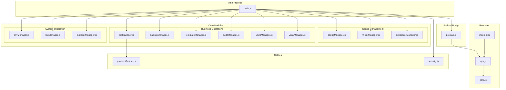
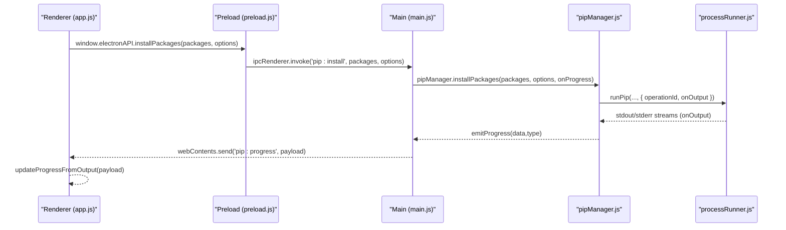
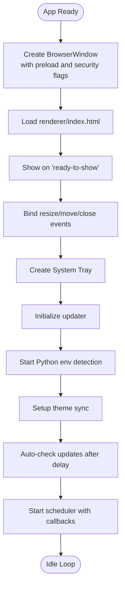
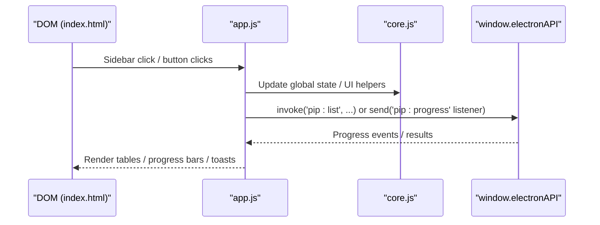
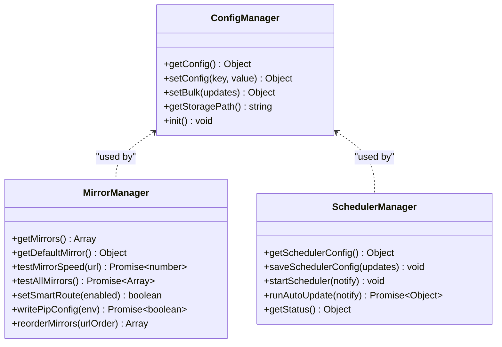
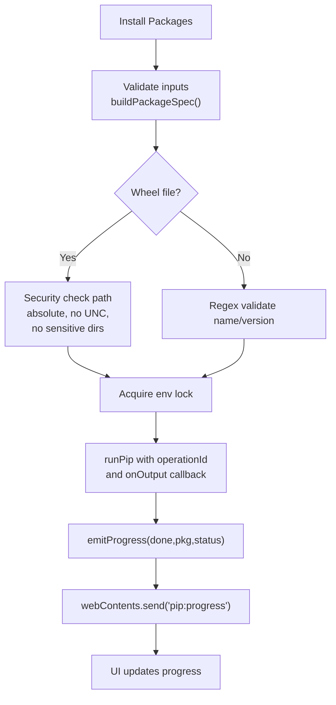
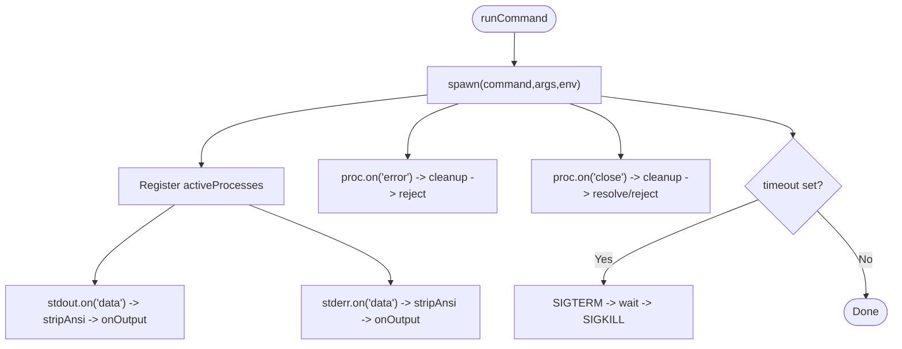
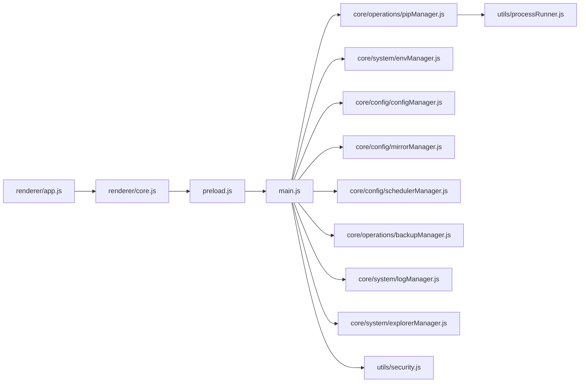

# Core Architecture

<cite>
**Referenced Files in This Document**
- [main.js](file://main.js)
- [preload.js](file://preload.js)
- [package.json](file://package.json)
- [index.html](file://renderer/index.html)
- [app.js](file://renderer/js/app.js)
- [core.js](file://renderer/js/core.js)
- [pipManager.js](file://core/operations/pipManager.js)
- [processRunner.js](file://utils/processRunner.js)
- [security.js](file://utils/security.js)
- [envManager.js](file://core/system/envManager.js)
- [configManager.js](file://core/config/configManager.js)
- [mirrorManager.js](file://core/config/mirrorManager.js)
- [logManager.js](file://core/system/logManager.js)
- [backupManager.js](file://core/operations/backupManager.js)
- [schedulerManager.js](file://core/config/schedulerManager.js)
- [explorerManager.js](file://core/system/explorerManager.js)
</cite>

## Update Summary
**Changes Made**
- Updated project structure section to reflect new modular organization with core/config/, core/operations/, and core/system/ directories
- Enhanced architecture diagrams to show the new three-tier module organization
- Updated component analysis to document the separation of concerns across configuration, operations, and system modules
- Added detailed documentation for new manager modules (mirrorManager, schedulerManager, explorerManager, backupManager)
- Revised dependency analysis to reflect the improved maintainability and scalability of the modular architecture

## Table of Contents
1. [Introduction](#introduction)
2. [Project Structure](#project-structure)
3. [Core Components](#core-components)
4. [Architecture Overview](#architecture-overview)
5. [Detailed Component Analysis](#detailed-component-analysis)
6. [Dependency Analysis](#dependency-analysis)
7. [Performance Considerations](#performance-considerations)
8. [Troubleshooting Guide](#troubleshooting-guide)
9. [Conclusion](#conclusion)

## Introduction
This document describes PyLibMaster's Electron-based architecture with a focus on the separation between main and renderer processes, IPC communication patterns, security isolation via contextBridge, module organization, event-driven interactions, preload bridge implementation, window lifecycle management, system integration, and cross-cutting concerns such as logging, error handling, and resource management. It includes diagrams that map to actual source files and explain data flow, message passing protocols, and state synchronization mechanisms.

The application has undergone a major architectural refactoring from a monolithic structure to a modular organization with clear separation of concerns across configuration management, business operations, and system integrations.

## Project Structure
PyLibMaster follows a clear separation of responsibilities with a modular architecture:
- Main process (Node.js): application entry, window lifecycle, IPC handlers, system integrations, and orchestration of core modules.
- Preload script: secure bridge exposing a curated API surface to the renderer via contextBridge.
- Renderer (HTML + JS): UI pages, user interactions, and IPC calls through the exposed API.
- Core modules organized into three distinct categories:
  - **Configuration Management** (`core/config/`): configManager.js, mirrorManager.js, schedulerManager.js
  - **Business Operations** (`core/operations/`): pipManager.js, backupManager.js, templateManager.js, auditManager.js, undoManager.js, venvManager.js
  - **System Integration** (`core/system/`): envManager.js, logManager.js, explorerManager.js
- Utilities: process runner for child processes and security helpers.

**Diagram sources**
- [main.js](file://main.js)
- [preload.js](file://preload.js)
- [index.html](file://renderer/index.html)
- [app.js](file://renderer/js/app.js)
- [core.js](file://renderer/js/core.js)
- [configManager.js](file://core/config/configManager.js)
- [mirrorManager.js](file://core/config/mirrorManager.js)
- [schedulerManager.js](file://core/config/schedulerManager.js)
- [pipManager.js](file://core/operations/pipManager.js)
- [backupManager.js](file://core/operations/backupManager.js)
- [envManager.js](file://core/system/envManager.js)
- [logManager.js](file://core/system/logManager.js)
- [explorerManager.js](file://core/system/explorerManager.js)
- [processRunner.js](file://utils/processRunner.js)
- [security.js](file://utils/security.js)

**Section sources**
- [package.json:1-79](file://package.json#L1-L79)

## Core Components
- Main process (main.js): Creates BrowserWindow with strict security settings (contextIsolation true, nodeIntegration false), registers all IPC handlers, manages tray, theme sync, auto-update checks, scheduler events, and coordinates core modules.
- Preload bridge (preload.js): Exposes a typed API surface via contextBridge to the renderer; uses ipcRenderer.invoke for request/response and ipcRenderer.on for streaming events.
- Renderer (index.html, app.js, core.js): Renders UI, binds events, initializes data asynchronously in phases, subscribes to progress and updater events, and calls window.electronAPI methods.
- Core modules organized by responsibility:
  - **Configuration Management**: Persistent JSON configuration with validation, PyPI mirror management with smart routing, and scheduled automatic updates.
  - **Business Operations**: Robust package operations with caching, rollback, cancellation, environment management, backups, templates, auditing, and undo functionality.
  - **System Integration**: Python environment detection, operation logging, and Windows Explorer integration.
- Utilities:
  - processRunner.js: Child process execution, timeout/cancellation, ensurePip fallback, ANSI stripping, active process tracking.
  - security.js: Path allowlist validation to prevent path traversal attacks.

**Section sources**
- [main.js:1-640](file://main.js#L1-L640)
- [preload.js:1-221](file://preload.js#L1-L221)
- [index.html:1-800](file://renderer/index.html#L1-L800)
- [app.js:1-210](file://renderer/js/app.js#L1-L210)
- [core.js:1-93](file://renderer/js/core.js#L1-L93)
- [pipManager.js:1-800](file://core/operations/pipManager.js#L1-L800)
- [envManager.js:1-220](file://core/system/envManager.js#L1-L220)
- [configManager.js:1-194](file://core/config/configManager.js#L1-L194)
- [mirrorManager.js:1-376](file://core/config/mirrorManager.js#L1-L376)
- [schedulerManager.js:1-197](file://core/config/schedulerManager.js#L1-L197)
- [backupManager.js:1-196](file://core/operations/backupManager.js#L1-L196)
- [logManager.js:1-176](file://core/system/logManager.js#L1-L176)
- [explorerManager.js:1-120](file://core/system/explorerManager.js#L1-L120)
- [processRunner.js:1-366](file://utils/processRunner.js#L1-L366)
- [security.js:1-43](file://utils/security.js#L1-L43)

## Architecture Overview
The application enforces strict security by isolating the renderer from Node APIs and routing all privileged operations through the preload bridge and main process IPC handlers. The main process owns system resources and orchestrates long-running tasks while the renderer focuses on UI and user interactions. The modular architecture provides clear separation between configuration management, business operations, and system integrations.

**Diagram sources**
- [app.js:1-210](file://renderer/js/app.js#L1-L210)
- [preload.js:1-221](file://preload.js#L1-L221)
- [main.js:1-640](file://main.js#L1-L640)
- [pipManager.js:1-800](file://core/operations/pipManager.js#L1-L800)
- [processRunner.js:1-366](file://utils/processRunner.js#L1-L366)

## Detailed Component Analysis

### Main Process Lifecycle and Window Management
- Window creation with security best practices: contextIsolation enabled, nodeIntegration disabled, preload script loaded.
- Window bounds persistence with debounced save; minimize-to-tray behavior; external link interception.
- Application lifecycle hooks: whenReady, activate, window-all-closed, before-quit; graceful shutdown cancels active processes and flushes logs.
- Tray menu and theme synchronization with nativeTheme updates.

**Diagram sources**
- [main.js:1-640](file://main.js#L1-L640)

**Section sources**
- [main.js:1-640](file://main.js#L1-L640)

### IPC Communication Patterns and Security Isolation
- Request/Response: All renderer calls use ipcRenderer.invoke through a curated API surface in preload.js.
- Streaming Events: Long-running operations push progress via webContents.send('pip:progress') and other domain-specific events.
- Security: contextBridge exposes only necessary methods; renderer cannot access Node APIs directly; path opening is restricted via allowlist.

```mermaid
classDiagram
class PreloadAPI {
+windowMinimize()
+windowMaximize()
+windowClose()
+detectEnvironments()
+getCurrentEnv()
+switchEnvironment(envPath)
+createVenv(options)
+listVenvs()
+deleteVenv(name)
+getVenvInfo(name)
+listInstalled()
+listInstalledCached()
+listOutdated()
+searchPackage(keyword)
+showPackageInfo(pkgName)
+getDependencyTree(pkgName)
+exportRequirements(options)
+importRequirements(filePath, options)
+compareEnvironments(envA, envB)
+installPackages(packages, options)
+installFromFile(filePath, options)
+uninstallPackages(packages, options)
+updatePackages(packages, options)
+cancelPipOperation(operationId)
+repairPip(options)
+createBackup()
+listBackups()
+restoreBackup(backupId)
+deleteBackup(backupId)
+getMirrors()
+testMirrorSpeed(url)
+testAllMirrors()
+setDefaultMirror(url)
+addCustomMirror(name, url, remark)
+updateMirror(url, updates)
+removeCustomMirror(url)
+restoreDefaultMirrors()
+setSmartRoute(enabled)
+getSmartRoute()
+writePipMirrorConfig()
+reorderMirrors(urlOrder)
+getLogs(filter)
+clearLogs()
+addLog(entry)
+getConfig()
+setConfig(key, value)
+setConfigBulk(updates)
+getAppVersion()
+browseDirectory()
+browseFile(filters)
+openPath(filePath)
+sendNotification(title, body)
+exportLogs(format)
+getSystemTheme()
+onThemeChanged(callback)
+onUpdatesAvailable(callback)
+getSchedulerStatus()
+saveSchedulerConfig(config)
+runSchedulerNow()
+onSchedulerExecuted(callback)
+getTemplates()
+addCustomTemplate(tpl)
+removeCustomTemplate(id)
+createFromTemplate(options)
+createSnapshot(envPath, label)
+listSnapshots()
+getSnapshotDetail(id)
+restoreSnapshot(snapshotId, envPath)
+deleteSnapshot(id)
+runAudit()
+getCachedAudit()
+getDiskUsage()
+downloadPackages(packages, destDir, options)
+diffRequirements(sourceA, sourceB)
+getPackageReleases(pkgName)
+getDependencyGraph()
+checkConflicts()
+healthCheck()
+canUndo()
+performUndo()
+clearUndo()
+getExplorerStatus()
+enableExplorerMenu()
+disableExplorerMenu()
+onProgress(callback)
+removeProgressListener(callback)
+checkForUpdates()
+installUpdate()
+onUpdaterChecking(callback)
+onUpdaterAvailable(callback)
+onUpdaterNotAvailable(callback)
+onUpdaterProgress(callback)
+onUpdaterDownloaded(callback)
+onUpdaterError(callback)
}
```

**Diagram sources**
- [preload.js:1-221](file://preload.js#L1-L221)

**Section sources**
- [preload.js:1-221](file://preload.js#L1-L221)
- [main.js:1-640](file://main.js#L1-L640)
- [security.js:1-43](file://utils/security.js#L1-L43)

### Renderer Event-Driven Architecture
- Initialization phases: load config, apply language, render status bar, then parallelize environment/mirror/cache loading; background refresh full installed list; lazy load outdated list; low-priority logs and version info.
- Global state shared across renderer modules via core.js; UI bindings in app.js subscribe to progress and updater events.
- Keyboard shortcuts and page navigation are handled centrally.

**Diagram sources**
- [index.html:1-800](file://renderer/index.html#L1-L800)
- [app.js:1-210](file://renderer/js/app.js#L1-L210)
- [core.js:1-93](file://renderer/js/core.js#L1-L93)

**Section sources**
- [app.js:1-210](file://renderer/js/app.js#L1-L210)
- [core.js:1-93](file://renderer/js/core.js#L1-L93)
- [index.html:1-800](file://renderer/index.html#L1-L800)

### Configuration Management Module
- **configManager.js**: Provides validated, atomic writes and default values; stores app settings and storage paths with range validation for numeric configurations.
- **mirrorManager.js**: Manages PyPI mirror sources with built-in mirrors, custom mirror support, speed testing, smart routing, and pip configuration file generation.
- **schedulerManager.js**: Implements scheduled automatic updates with daily/weekly frequencies, whitelist filtering, and background execution.

**Diagram sources**
- [configManager.js:1-194](file://core/config/configManager.js#L1-L194)
- [mirrorManager.js:1-376](file://core/config/mirrorManager.js#L1-L376)
- [schedulerManager.js:1-197](file://core/config/schedulerManager.js#L1-L197)

**Section sources**
- [configManager.js:1-194](file://core/config/configManager.js#L1-L194)
- [mirrorManager.js:1-376](file://core/config/mirrorManager.js#L1-L376)
- [schedulerManager.js:1-197](file://core/config/schedulerManager.js#L1-L197)

### Business Operations Module
- **pipManager.js**: Orchestrates package queries, install/uninstall/update, caching, rollback, cancellation, and dependency analysis with environment-level locks.
- **backupManager.js**: Creates and restores environment backups using pip freeze, with secure backup ID validation and automatic cleanup.
- **System Integration**: Environment detection, operation logging, and Windows Explorer context menu integration.

**Diagram sources**
- [pipManager.js:1-800](file://core/operations/pipManager.js#L1-L800)
- [processRunner.js:1-366](file://utils/processRunner.js#L1-L366)

**Section sources**
- [pipManager.js:1-800](file://core/operations/pipManager.js#L1-L800)
- [backupManager.js:1-196](file://core/operations/backupManager.js#L1-L196)

### Process Runner and Resource Management
- Spawns child processes with UTF-8 encoding, strips ANSI codes, tracks active processes, supports timeouts and SIGTERM/SIGKILL cascades.
- Provides ensurePip fallback chain (cache → direct check → ensurepip → get-pip.py download).
- Supports canceling individual processes or all processes tied to an operationId.

**Diagram sources**
- [processRunner.js:1-366](file://utils/processRunner.js#L1-L366)

**Section sources**
- [processRunner.js:1-366](file://utils/processRunner.js#L1-L366)

### System Integration and Security
- Path opening restricted to allowed directories using security.isAllowedOpenPath.
- External links intercepted and opened via shell.openExternal with protocol checks.
- Notifications sent via native Notification API if supported.
- Windows Explorer context menu integration for seamless file operations.

**Section sources**
- [main.js:1-640](file://main.js#L1-L640)
- [security.js:1-43](file://utils/security.js#L1-L43)
- [explorerManager.js:1-120](file://core/system/explorerManager.js#L1-L120)

## Dependency Analysis
The following diagram shows key dependencies among modules and how they interact during typical operations, reflecting the new modular architecture.

**Diagram sources**
- [app.js:1-210](file://renderer/js/app.js#L1-L210)
- [core.js:1-93](file://renderer/js/core.js#L1-L93)
- [preload.js:1-221](file://preload.js#L1-L221)
- [main.js:1-640](file://main.js#L1-L640)
- [pipManager.js:1-800](file://core/operations/pipManager.js#L1-L800)
- [envManager.js:1-220](file://core/system/envManager.js#L1-L220)
- [configManager.js:1-194](file://core/config/configManager.js#L1-L194)
- [mirrorManager.js:1-376](file://core/config/mirrorManager.js#L1-L376)
- [schedulerManager.js:1-197](file://core/config/schedulerManager.js#L1-L197)
- [backupManager.js:1-196](file://core/operations/backupManager.js#L1-L196)
- [logManager.js:1-176](file://core/system/logManager.js#L1-L176)
- [explorerManager.js:1-120](file://core/system/explorerManager.js#L1-L120)
- [processRunner.js:1-366](file://utils/processRunner.js#L1-L366)
- [security.js:1-43](file://utils/security.js#L1-L43)

**Section sources**
- [main.js:1-640](file://main.js#L1-L640)
- [preload.js:1-221](file://preload.js#L1-L221)
- [app.js:1-210](file://renderer/js/app.js#L1-L210)
- [core.js:1-93](file://renderer/js/core.js#L1-L93)
- [pipManager.js:1-800](file://core/operations/pipManager.js#L1-L800)
- [processRunner.js:1-366](file://utils/processRunner.js#L1-L366)
- [configManager.js:1-194](file://core/config/configManager.js#L1-L194)
- [envManager.js:1-220](file://core/system/envManager.js#L1-L220)
- [security.js:1-43](file://utils/security.js#L1-L43)

## Performance Considerations
- Renderer startup is optimized with phased initialization: immediate cache display followed by background refresh of real-time data.
- pipManager caches installed packages with TTL to reduce repeated scans.
- processRunner uses ANSI stripping and efficient stream handling; timeouts prevent hanging processes.
- Debounced window bounds saving avoids excessive disk writes.
- Parallelization options for pip operations improve throughput where safe.
- Modular architecture enables better memory management and faster module loading.

## Troubleshooting Guide
- If pip is missing, ensurePip attempts multiple strategies; failures will be logged and surfaced to the UI.
- Cancel operations via operationId; verify activeProcesses tracking in processRunner.
- For path-related errors, confirm allowed directories and input sanitization in security.js.
- Logs can be exported and cleared via IPC handlers; ensure logManager is flushed on quit.
- Check mirror configuration and smart routing settings for network-related issues.
- Verify scheduler configuration for automated update problems.

**Section sources**
- [processRunner.js:1-366](file://utils/processRunner.js#L1-L366)
- [security.js:1-43](file://utils/security.js#L1-L43)
- [main.js:1-640](file://main.js#L1-L640)
- [mirrorManager.js:1-376](file://core/config/mirrorManager.js#L1-L376)
- [schedulerManager.js:1-197](file://core/config/schedulerManager.js#L1-L197)

## Conclusion
PyLibMaster's architecture cleanly separates concerns across main, preload, and renderer layers, enforcing security through context isolation and a minimal IPC surface. The modular organization with distinct configuration, operations, and system integration modules provides improved maintainability and scalability. The event-driven design enables responsive UIs while managing long-running system operations safely. Robust utilities for process control, configuration, and security underpin reliable behavior across platforms.