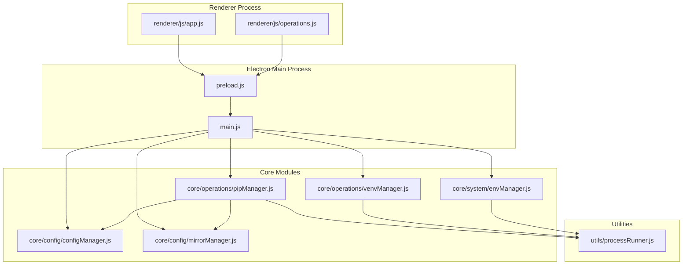
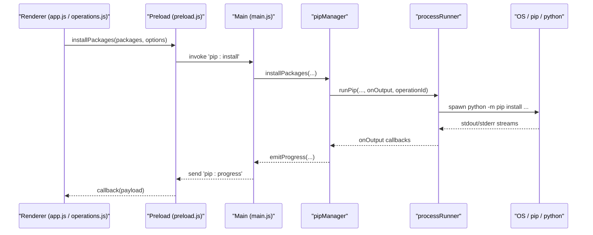
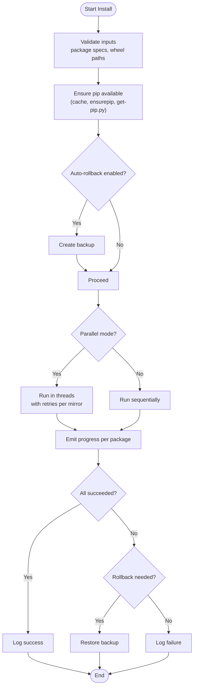
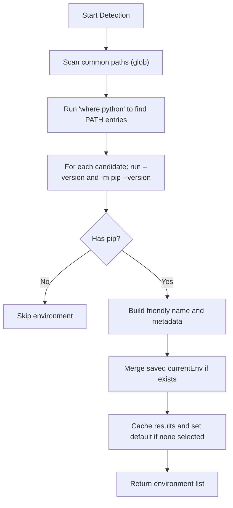
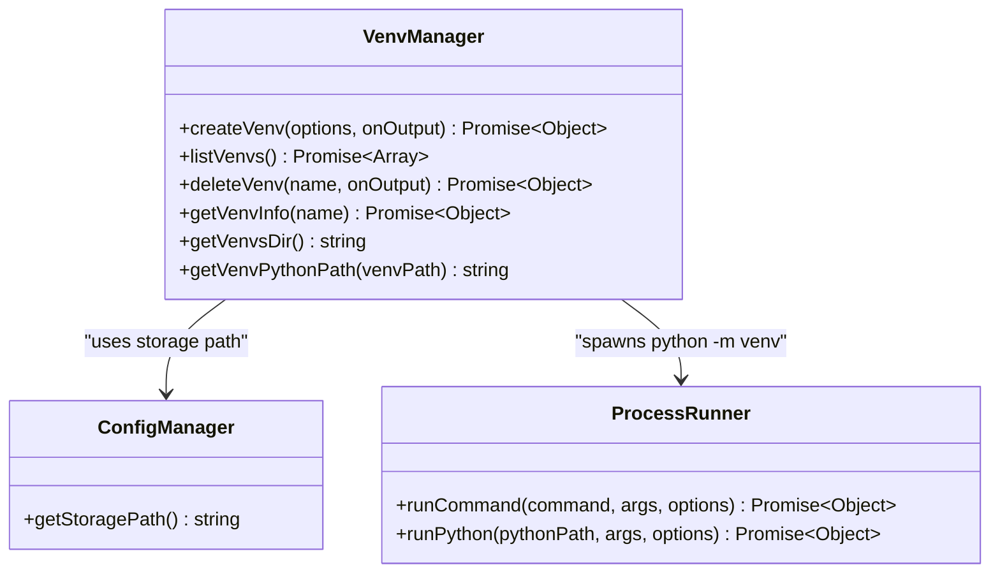
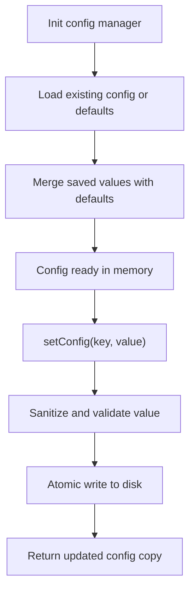
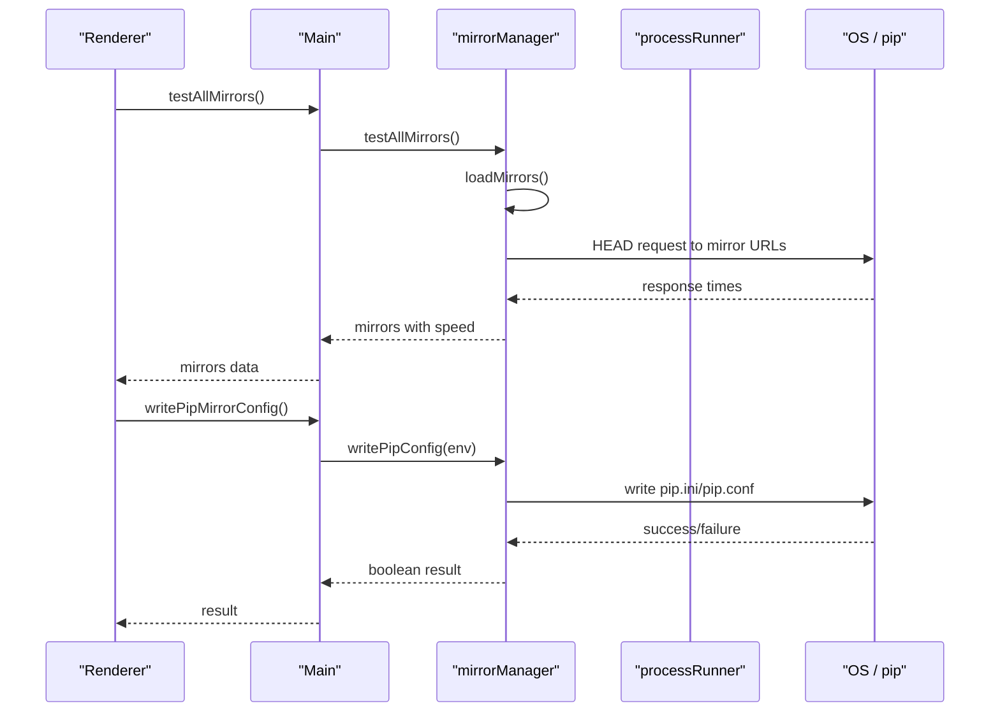
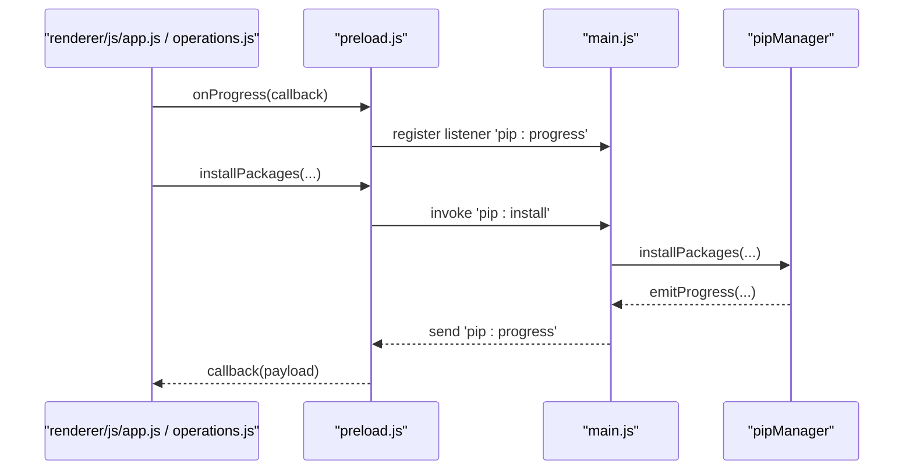
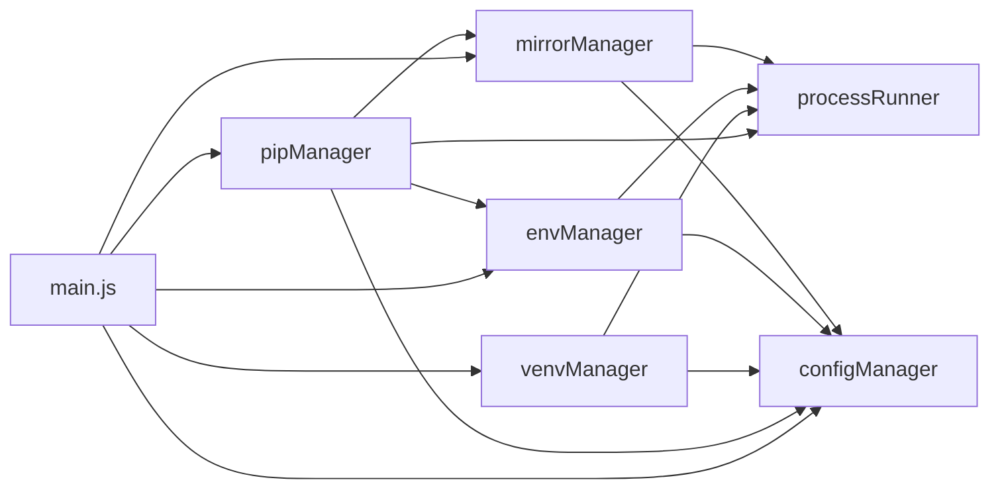

# Core Features

<cite>
**Referenced Files in This Document**
- [main.js](file://main.js)
- [preload.js](file://preload.js)
- [package.json](file://package.json)
- [renderer/js/app.js](file://renderer/js/app.js)
- [core/operations/pipManager.js](file://core/operations/pipManager.js)
- [core/system/envManager.js](file://core/system/envManager.js)
- [core/operations/venvManager.js](file://core/operations/venvManager.js)
- [core/config/configManager.js](file://core/config/configManager.js)
- [core/config/mirrorManager.js](file://core/config/mirrorManager.js)
- [utils/processRunner.js](file://utils/processRunner.js)
- [renderer/js/operations.js](file://renderer/js/operations.js)
</cite>

## Table of Contents
1. [Introduction](#introduction)
2. [Project Structure](#project-structure)
3. [Core Components](#core-components)
4. [Architecture Overview](#architecture-overview)
5. [Detailed Component Analysis](#detailed-component-analysis)
6. [Dependency Analysis](#dependency-analysis)
7. [Performance Considerations](#performance-considerations)
8. [Troubleshooting Guide](#troubleshooting-guide)
9. [Conclusion](#conclusion)
10. [Appendices](#appendices)

## Introduction
This document explains PyLibMaster’s core features: package management (install, uninstall, update), Python environment detection and switching, virtual environment creation and management, and configuration management. It also describes how these components integrate within an Electron-based architecture (main process and renderer process communication) to deliver a seamless package management experience. Practical workflows and integration patterns are included to help you use the tool effectively.

## Project Structure
PyLibMaster is an Electron application with a clear separation between the main process (Node.js), a preload bridge for secure IPC, and the renderer UI (HTML/CSS/JS). The core business logic resides under core/, utilities under utils/, and the UI under renderer/.

**Diagram sources**
- [main.js](file://main.js)
- [preload.js](file://preload.js)
- [renderer/js/app.js](file://renderer/js/app.js)
- [renderer/js/operations.js](file://renderer/js/operations.js)
- [core/operations/pipManager.js](file://core/operations/pipManager.js)
- [core/system/envManager.js](file://core/system/envManager.js)
- [core/operations/venvManager.js](file://core/operations/venvManager.js)
- [core/config/configManager.js](file://core/config/configManager.js)
- [core/config/mirrorManager.js](file://core/config/mirrorManager.js)
- [utils/processRunner.js](file://utils/processRunner.js)

**Section sources**
- [package.json](file://package.json)

## Core Components
- Package Manager (pipManager): Handles install, uninstall, update, search, export/import, dependency analysis, disk usage, offline downloads, and rollback strategies. Integrates with mirror management and process runner for robust pip operations.
- Environment Manager (envManager): Detects available Python environments, reads versions, switches current environment, and persists selection.
- Virtual Environment Manager (venvManager): Creates, lists, deletes, and inspects venvs; supports options like including pip and inheriting system packages.
- Configuration Manager (configManager): Persists app settings, validates ranges, manages storage paths, and provides safe read/write APIs.
- Mirror Manager (mirrorManager): Manages built-in and custom PyPI mirrors, tests speed, enables smart routing, writes pip config, and builds CLI args.
- Process Runner (processRunner): Spawns child processes, handles timeouts, cancellation, ANSI cleanup, ensures pip availability, and tracks active operations.

**Section sources**
- [core/operations/pipManager.js](file://core/operations/pipManager.js)
- [core/system/envManager.js](file://core/system/envManager.js)
- [core/operations/venvManager.js](file://core/operations/venvManager.js)
- [core/config/configManager.js](file://core/config/configManager.js)
- [core/config/mirrorManager.js](file://core/config/mirrorManager.js)
- [utils/processRunner.js](file://utils/processRunner.js)

## Architecture Overview
The Electron architecture uses a secure IPC pattern:
- Renderer calls window.electronAPI methods exposed by preload.js.
- Preload forwards requests via ipcRenderer.invoke to main.js handlers.
- Main dispatches to core modules (pipManager, envManager, venvManager, configManager, mirrorManager).
- Core modules execute pip/Python commands through processRunner, which manages subprocess lifecycle, timeouts, and cancellation.
- Real-time progress events flow back from main to renderer via ipcRenderer.on('pip:progress').

**Diagram sources**
- [renderer/js/app.js](file://renderer/js/app.js)
- [renderer/js/operations.js](file://renderer/js/operations.js)
- [preload.js](file://preload.js)
- [main.js](file://main.js)
- [core/operations/pipManager.js](file://core/operations/pipManager.js)
- [utils/processRunner.js](file://utils/processRunner.js)

## Detailed Component Analysis

### Package Management (Install, Uninstall, Update)
Key capabilities:
- Install: batch, parallel, version control (latest/specific/range), wheel file support, requirements.txt import, intelligent retry across mirrors, automatic backup and rollback on failure, progress streaming.
- Uninstall: batch uninstall with optional backup and rollback, safety checks, logging.
- Update: batch updates with parallel execution, retry, rollback, progress streaming.
- Query: installed list (real-time and cached), outdated list, search via pip index, show info, dependency tree, export/import requirements, compare environments, disk usage, offline download, releases history, full dependency graph.
- Safety: strict input validation for package names and wheel paths, environment-level locks to prevent concurrent conflicts, operation IDs for cancellation.

**Diagram sources**
- [core/operations/pipManager.js](file://core/operations/pipManager.js)
- [utils/processRunner.js](file://utils/processRunner.js)

Practical workflow examples:
- Install multiple packages with specific versions and parallel execution:
  - Use the install page input or paste pip install command; select version mode and enable parallel/retry/rollback; click start.
- Install from requirements.txt or .whl:
  - Drag-and-drop or browse to select file; the system detects type and installs accordingly.
- Uninstall with backup and rollback:
  - Select packages, enable backup and rollback if desired; confirm and proceed.
- Update selected or all outdated packages:
  - Check updates, select packages, choose options (parallel, retry, rollback), then update.

**Section sources**
- [core/operations/pipManager.js](file://core/operations/pipManager.js)
- [renderer/js/operations.js](file://renderer/js/operations.js)

### Python Environment Detection and Switching
Capabilities:
- Auto-detect Python installations across common paths and PATH entries.
- Retrieve Python and pip versions for each environment.
- Persist and switch current environment; auto-select first valid environment if none set.
- Background detection at startup to avoid blocking UI.

**Diagram sources**
- [core/system/envManager.js](file://core/system/envManager.js)

Integration points:
- pipManager and venvManager rely on envManager.getCurrent() to target the correct Python executable.
- MirrorManager writes pip config based on the selected environment when requested.

**Section sources**
- [core/system/envManager.js](file://core/system/envManager.js)

### Virtual Environment Creation and Management
Capabilities:
- Create venvs with options: include pip, inherit system site-packages, specify base Python.
- List venvs with details: Python version, pip version, package count.
- Delete venvs safely with path traversal protection.
- Inspect venv info including base Python path from pyvenv.cfg.

**Diagram sources**
- [core/operations/venvManager.js](file://core/operations/venvManager.js)
- [core/config/configManager.js](file://core/config/configManager.js)
- [utils/processRunner.js](file://utils/processRunner.js)

Practical workflow examples:
- Create a new isolated environment with pip and no system packages inheritance.
- List all venvs to inspect versions and package counts.
- Delete an unused venv after confirming it is not the current environment.

**Section sources**
- [core/operations/venvManager.js](file://core/operations/venvManager.js)

### Configuration Management
Capabilities:
- Persistent JSON configuration stored in Electron userData directory.
- Safe read/write with atomic save (write temp then rename).
- Value sanitization and range limits for numeric settings (e.g., parallelThreads, retryCount).
- Storage path management for logs and backups.

**Diagram sources**
- [core/config/configManager.js](file://core/config/configManager.js)

Integration points:
- All core modules read/write configuration via configManager to maintain consistent state.
- UI settings (theme, language, parallel threads, retry count) are persisted here.

**Section sources**
- [core/config/configManager.js](file://core/config/configManager.js)

### Mirror Management and Pip Integration
Capabilities:
- Manage built-in and custom PyPI mirrors with validation and persistence.
- Test mirror speeds and enable smart routing to pick the fastest mirror.
- Write global pip configuration (pip.ini/pip.conf) for persistent mirror settings.
- Build pip CLI arguments to apply mirror source per operation.

**Diagram sources**
- [core/config/mirrorManager.js](file://core/config/mirrorManager.js)
- [utils/processRunner.js](file://utils/processRunner.js)

Relationship to pip operations:
- pipManager uses mirrorManager to determine mirror order and retry strategy.
- processRunner executes pip commands with appropriate --index-url flags when non-default mirrors are used.

**Section sources**
- [core/config/mirrorManager.js](file://core/config/mirrorManager.js)
- [core/operations/pipManager.js](file://core/operations/pipManager.js)

### Electron IPC and UI Flow
- Preload exposes a curated API surface to the renderer, ensuring security via context isolation and disabled Node integration.
- Main registers IPC handlers for all operations (window control, env, venv, pip, backup, mirror, log, config, updater, scheduler, audit, explorer).
- Renderer binds UI events to operations module functions, which call api methods and handle progress events.

**Diagram sources**
- [renderer/js/app.js](file://renderer/js/app.js)
- [renderer/js/operations.js](file://renderer/js/operations.js)
- [preload.js](file://preload.js)
- [main.js](file://main.js)
- [core/operations/pipManager.js](file://core/operations/pipManager.js)

**Section sources**
- [preload.js](file://preload.js)
- [main.js](file://main.js)
- [renderer/js/app.js](file://renderer/js/app.js)
- [renderer/js/operations.js](file://renderer/js/operations.js)

## Dependency Analysis
High-level dependencies:
- main.js orchestrates IPC handlers and initializes core modules.
- pipManager depends on envManager, mirrorManager, configManager, backupManager, logManager, and processRunner.
- venvManager depends on configManager and processRunner.
- envManager depends on processRunner and configManager.
- mirrorManager depends on configManager and processRunner.
- processRunner is a foundational utility used by all operational modules.

**Diagram sources**
- [main.js](file://main.js)
- [core/operations/pipManager.js](file://core/operations/pipManager.js)
- [core/system/envManager.js](file://core/system/envManager.js)
- [core/operations/venvManager.js](file://core/operations/venvManager.js)
- [core/config/configManager.js](file://core/config/configManager.js)
- [core/config/mirrorManager.js](file://core/config/mirrorManager.js)
- [utils/processRunner.js](file://utils/processRunner.js)

**Section sources**
- [main.js](file://main.js)

## Performance Considerations
- Caching: Installed package list caching (5 minutes), site-packages path caching (30 seconds), pip readiness cache (5 minutes).
- Parallelism: Configurable thread count for install/update operations; balanced against system resources.
- I/O optimization: Atomic config saves, fast folder size estimation with depth limits, and symlink avoidance.
- Network resilience: Multi-mirror retry and smart routing reduce failures and improve throughput.
- UI responsiveness: Lazy loading of outdated list and background refreshes keep the interface snappy.

[No sources needed since this section provides general guidance]

## Troubleshooting Guide
Common issues and resolutions:
- pip not found:
  - The system attempts ensurepip and falls back to downloading get-pip.py. If both fail, install pip manually for the selected Python environment.
- Installation fails due to network errors:
  - Enable retry and smart route; test mirrors to identify the fastest one; consider using a local mirror or proxy.
- Permission errors during uninstall/install:
  - Ensure the selected Python environment has write permissions to its site-packages directory.
- Virtual environment creation fails:
  - Verify base Python path exists and is valid; check that venv module is available; ensure sufficient disk space.
- Configuration corruption:
  - The config manager rebuilds defaults if the file is invalid; verify storage path accessibility.

Operational tips:
- Use rollback and backup options for destructive operations (uninstall, update).
- Monitor logs and export them for diagnostics.
- Cancel long-running operations via operation ID; ensure processRunner tracks active processes.

**Section sources**
- [utils/processRunner.js](file://utils/processRunner.js)
- [core/operations/pipManager.js](file://core/operations/pipManager.js)
- [core/operations/venvManager.js](file://core/operations/venvManager.js)
- [core/config/configManager.js](file://core/config/configManager.js)

## Conclusion
PyLibMaster integrates package management, environment detection and switching, virtual environment management, and configuration management into a cohesive Electron application. The main process securely bridges renderer requests to core modules, which orchestrate pip operations through a robust process runner. With features like multi-mirror retry, smart routing, parallel execution, and rollback strategies, it delivers a reliable and user-friendly package management experience.

[No sources needed since this section summarizes without analyzing specific files]

## Appendices

### Practical Workflows and Integration Patterns
- Typical install workflow:
  - Enter package names or paste pip install command; select version mode; enable parallel/retry/rollback; start installation; monitor progress; review logs.
- Requirements import workflow:
  - Drag-and-drop requirements.txt; the system parses and installs dependencies with retry and rollback options.
- Environment switching workflow:
  - Detect environments; select desired Python executable; persist selection; subsequent operations target the chosen environment.
- Virtual environment workflow:
  - Create a new venv with specified options; list and inspect venvs; delete unused environments; manage packages within isolated contexts.
- Mirror management workflow:
  - Add custom mirrors; test speeds; enable smart routing; write pip config for persistent settings; verify pip operations use the selected mirror.

[No sources needed since this section provides general guidance]