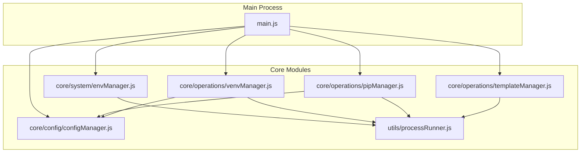
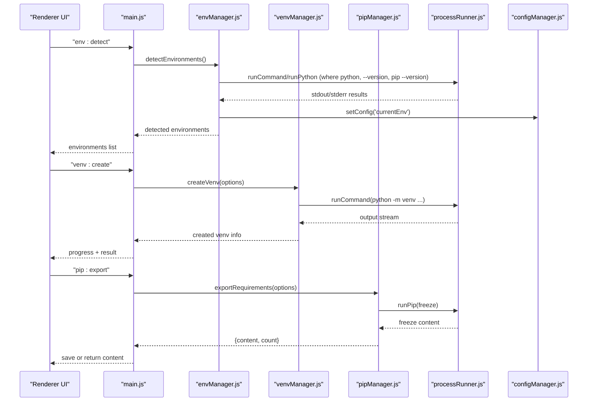
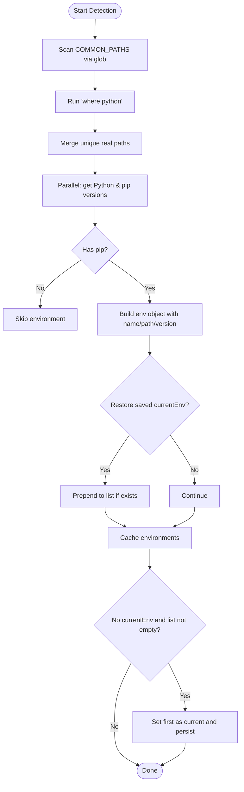
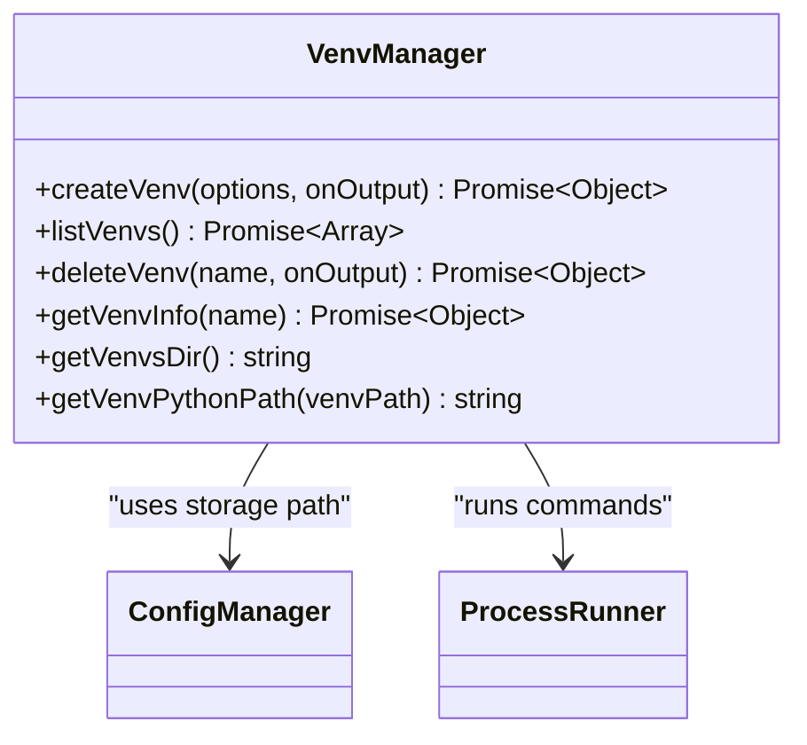
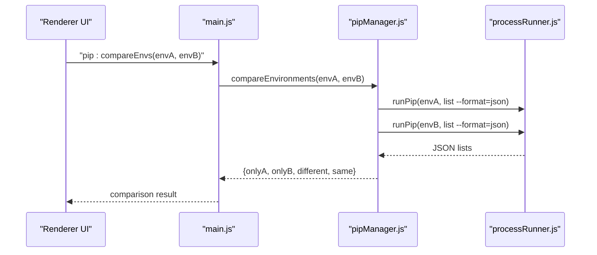
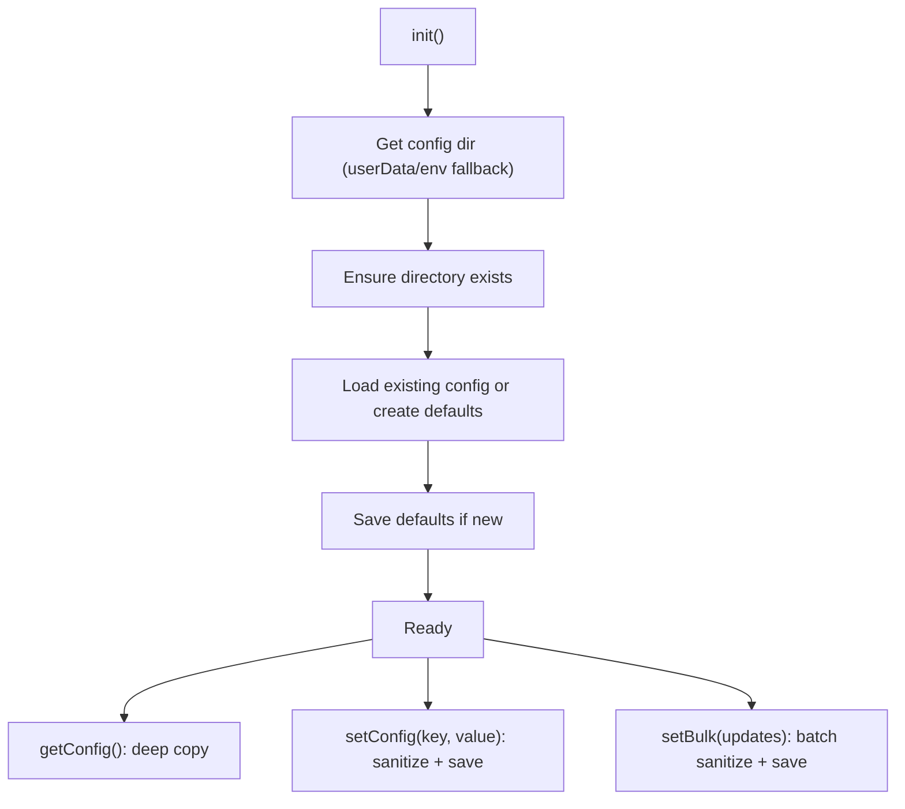
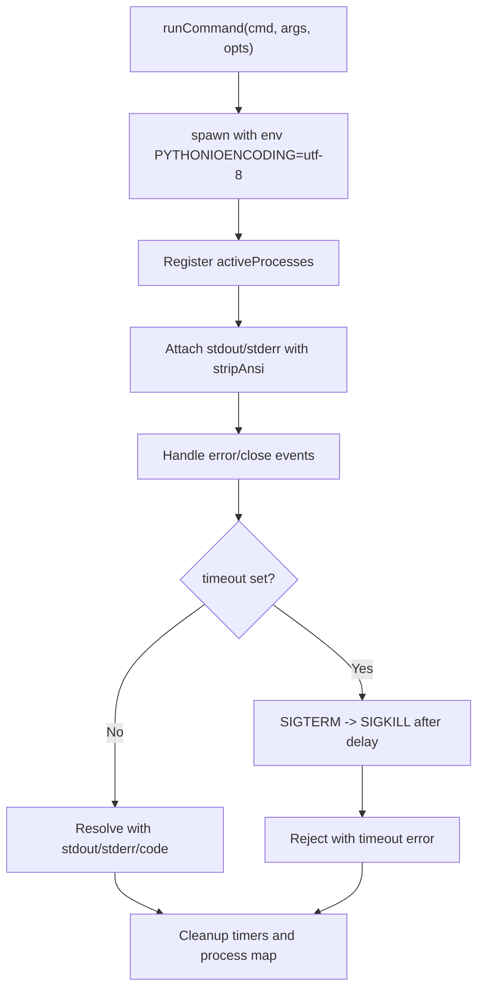
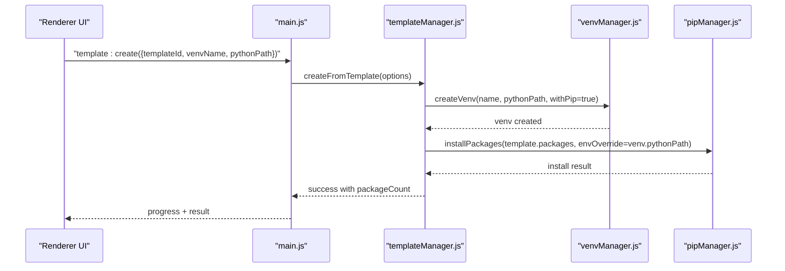
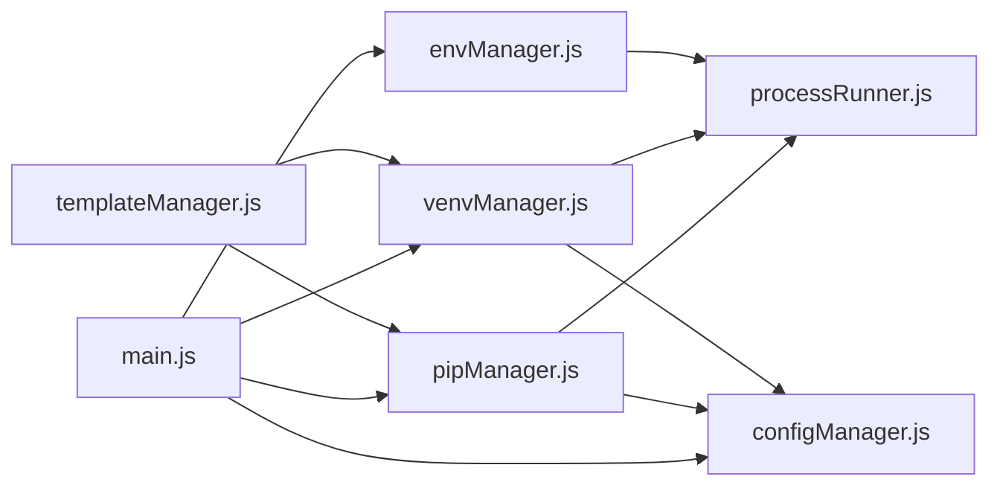

# Environment Management

<cite>
**Referenced Files in This Document**
- [main.js](file://main.js)
- [envManager.js](file://core/system/envManager.js)
- [venvManager.js](file://core/operations/venvManager.js)
- [pipManager.js](file://core/operations/pipManager.js)
- [configManager.js](file://core/config/configManager.js)
- [processRunner.js](file://utils/processRunner.js)
- [templateManager.js](file://core/operations/templateManager.js)
</cite>

## Table of Contents
1. [Introduction](#introduction)
2. [Project Structure](#project-structure)
3. [Core Components](#core-components)
4. [Architecture Overview](#architecture-overview)
5. [Detailed Component Analysis](#detailed-component-analysis)
6. [Dependency Analysis](#dependency-analysis)
7. [Performance Considerations](#performance-considerations)
8. [Troubleshooting Guide](#troubleshooting-guide)
9. [Conclusion](#conclusion)
10. [Appendices](#appendices)

## Introduction
This document explains how PyLibMaster discovers Python installations across platforms, detects Anaconda/Miniconda and virtual environments, switches between them, persists configuration, and performs runtime environment changes. It also covers creating virtual environments via the GUI, template-based setup, custom options, multi-environment workflows, environment comparison tools, and export/import of requirements.txt files. Finally, it details environment-specific settings and their integration with package operations.

## Project Structure
PyLibMaster is an Electron application. The main process orchestrates IPC handlers that delegate to core modules for environment detection, virtual environment management, pip operations, and configuration persistence.

**Diagram sources**
- [main.js:17-31](file://main.js#L17-L31)
- [envManager.js:18-24](file://core/system/envManager.js#L18-L24)
- [venvManager.js:16-21](file://core/operations/venvManager.js#L16-L21)
- [pipManager.js:20-28](file://core/operations/pipManager.js#L20-L28)
- [configManager.js:17-20](file://core/config/configManager.js#L17-L20)
- [templateManager.js:15-20](file://core/operations/templateManager.js#L15-L20)
- [processRunner.js:13-19](file://utils/processRunner.js#L13-L19)

**Section sources**
- [main.js:17-31](file://main.js#L17-L31)

## Core Components
- Environment Detection and Switching: envManager.js
- Virtual Environment Management: venvManager.js
- Package Operations and Requirements Tools: pipManager.js
- Configuration Persistence: configManager.js
- Subprocess Execution and Pip Bootstrapping: processRunner.js
- Template-Based Setup and Snapshots: templateManager.js

Key responsibilities:
- Discover all usable Python interpreters (system, user, Windows Store, Conda/Miniconda).
- Maintain a current environment selection persisted in configuration.
- Create, list, delete, and inspect virtual environments.
- Export/import requirements.txt and compare environments.
- Provide safe subprocess execution with timeouts, cancellation, and automatic pip installation.

**Section sources**
- [envManager.js:18-24](file://core/system/envManager.js#L18-L24)
- [venvManager.js:16-21](file://core/operations/venvManager.js#L16-L21)
- [pipManager.js:20-28](file://core/operations/pipManager.js#L20-L28)
- [configManager.js:17-20](file://core/config/configManager.js#L17-L20)
- [processRunner.js:13-19](file://utils/processRunner.js#L13-L19)
- [templateManager.js:15-20](file://core/operations/templateManager.js#L15-L20)

## Architecture Overview
The main process registers IPC handlers for environment and package operations. On startup, it triggers background environment detection. UI actions invoke IPC handlers which call into core modules. All file system and subprocess interactions are centralized through processRunner.js, while configuration is managed by configManager.js.

**Diagram sources**
- [main.js:256-261](file://main.js#L256-L261)
- [main.js:266-280](file://main.js#L266-L280)
- [main.js:297-305](file://main.js#L297-L305)
- [envManager.js:85-170](file://core/system/envManager.js#L85-L170)
- [venvManager.js:73-130](file://core/operations/venvManager.js#L73-L130)
- [pipManager.js:1104-1118](file://core/operations/pipManager.js#L1104-L1118)
- [processRunner.js:85-161](file://utils/processRunner.js#L85-L161)
- [configManager.js:157-162](file://core/config/configManager.js#L157-L162)

## Detailed Component Analysis

### Python Environment Discovery and Switching (envManager.js)
- Platform coverage:
  - Windows paths scanned via glob patterns include system-level Python, user-local installs, Windows Store Python, and Conda/Miniconda locations.
  - PATH discovery uses `where python` to find additional interpreters.
- Version and pip detection:
  - Runs `python --version` and `python -m pip --version` per candidate interpreter.
  - Filters out environments without pip.
- Naming and caching:
  - Derives friendly names from directory structure; normalizes to “Python X.Y” when appropriate.
  - Caches discovered environments and restores previously selected environment if still valid.
- Switching and persistence:
  - switchEnvironment updates in-memory state and persists currentEnv to config.
  - startDetection runs asynchronously on app startup.

**Diagram sources**
- [envManager.js:31-41](file://core/system/envManager.js#L31-L41)
- [envManager.js:85-170](file://core/system/envManager.js#L85-L170)
- [envManager.js:178-209](file://core/system/envManager.js#L178-L209)

**Section sources**
- [envManager.js:31-41](file://core/system/envManager.js#L31-L41)
- [envManager.js:85-170](file://core/system/envManager.js#L85-L170)
- [envManager.js:178-209](file://core/system/envManager.js#L178-L209)

### Virtual Environment Management (venvManager.js)
- Creation:
  - Validates name and base Python path.
  - Supports options: include pip, inherit system site-packages.
  - Executes `python -m venv`, cleans up on failure, logs outcomes.
- Listing:
  - Scans configured storage directory for valid venvs (checks python executable and pyvenv.cfg).
  - Collects version, pip version, and package count.
- Deletion:
  - Enforces name validation and path traversal protection.
  - Recursively removes directory and logs operation.
- Info retrieval:
  - Reads pyvenv.cfg to determine base Python path.

**Diagram sources**
- [venvManager.js:73-130](file://core/operations/venvManager.js#L73-L130)
- [venvManager.js:136-186](file://core/operations/venvManager.js#L136-L186)
- [venvManager.js:195-224](file://core/operations/venvManager.js#L195-L224)
- [venvManager.js:231-268](file://core/operations/venvManager.js#L231-L268)

**Section sources**
- [venvManager.js:73-130](file://core/operations/venvManager.js#L73-L130)
- [venvManager.js:136-186](file://core/operations/venvManager.js#L136-L186)
- [venvManager.js:195-224](file://core/operations/venvManager.js#L195-L224)
- [venvManager.js:231-268](file://core/operations/venvManager.js#L231-L268)

### Package Operations and Requirements Tools (pipManager.js)
- Requirements export:
  - Uses `pip freeze` to generate a pinned list; can save to file or return content.
- Requirements import:
  - Installs from a requirements.txt using `pip install -r`; supports retry toggles and progress callbacks.
- Environment comparison:
  - Compares two environments’ installed packages and versions; returns only-in-A, only-in-B, different versions, and same counts.
- Requirements diff:
  - Compares two sources (environment or file), categorizing differences and upgrades/downgrades.
- Additional capabilities:
  - Disk usage analysis, offline downloads, dependency graph, conflict checks, health checks.

**Diagram sources**
- [main.js:305](file://main.js#L305)
- [pipManager.js:1161-1200](file://core/operations/pipManager.js#L1161-L1200)
- [processRunner.js:340-353](file://utils/processRunner.js#L340-L353)

**Section sources**
- [pipManager.js:1104-1118](file://core/operations/pipManager.js#L1104-L1118)
- [pipManager.js:1127-1153](file://core/operations/pipManager.js#L1127-L1153)
- [pipManager.js:1161-1200](file://core/operations/pipManager.js#L1161-L1200)
- [pipManager.js:1291-1338](file://core/operations/pipManager.js#L1291-L1338)

### Configuration Persistence (configManager.js)
- Storage location:
  - Uses Electron’s userData directory; falls back to environment variables or current directory when unavailable.
- Defaults and sanitization:
  - Provides default values for theme, language, storage path, parallel threads, retry count, smart route, window bounds, and currentEnv.
  - Sanitizes numeric ranges to prevent invalid configurations.
- Atomic writes:
  - Writes to a temporary file then renames to avoid corruption.
- Current environment:
  - Stores and restores currentEnv across sessions.

**Diagram sources**
- [configManager.js:56-61](file://core/config/configManager.js#L56-L61)
- [configManager.js:80-117](file://core/config/configManager.js#L80-L117)
- [configManager.js:123-138](file://core/config/configManager.js#L123-L138)
- [configManager.js:144-178](file://core/config/configManager.js#L144-L178)

**Section sources**
- [configManager.js:56-61](file://core/config/configManager.js#L56-L61)
- [configManager.js:80-117](file://core/config/configManager.js#L80-L117)
- [configManager.js:123-138](file://core/config/configManager.js#L123-L138)
- [configManager.js:144-178](file://core/config/configManager.js#L144-L178)

### Subprocess Execution and Pip Bootstrapping (processRunner.js)
- Command execution:
  - Spawns child processes with UTF-8 encoding, ANSI stripping, timeout handling, and optional shell mode.
  - Tracks active processes for cancellation by processId or operationId.
- Pip availability:
  - Checks cached status, verifies via `pip --version`, attempts ensurepip, then downloads get-pip.py as fallback.
- Convenience wrappers:
  - runPip and runPython simplify invocation.

**Diagram sources**
- [processRunner.js:85-161](file://utils/processRunner.js#L85-L161)
- [processRunner.js:233-278](file://utils/processRunner.js#L233-L278)
- [processRunner.js:340-353](file://utils/processRunner.js#L340-L353)

**Section sources**
- [processRunner.js:85-161](file://utils/processRunner.js#L85-L161)
- [processRunner.js:233-278](file://utils/processRunner.js#L233-L278)
- [processRunner.js:340-353](file://utils/processRunner.js#L340-L353)

### Template-Based Setup and Snapshots (templateManager.js)
- Templates:
  - Built-in templates for common stacks (Web, Data, ML, Crawling, Automation).
  - Custom templates supported and persisted in configuration.
- From template creation:
  - Creates a venv using venvManager, then installs all template packages via pipManager with progress callbacks.
- Snapshots:
  - Captures pip freeze output into JSON snapshots stored under storage/snapshots.
  - Restores by writing a temporary requirements file and installing via pip.

**Diagram sources**
- [main.js:557-561](file://main.js#L557-L561)
- [templateManager.js:118-154](file://core/operations/templateManager.js#L118-L154)
- [venvManager.js:73-130](file://core/operations/venvManager.js#L73-L130)
- [pipManager.js:1127-1153](file://core/operations/pipManager.js#L1127-L1153)

**Section sources**
- [templateManager.js:23-66](file://core/operations/templateManager.js#L23-L66)
- [templateManager.js:118-154](file://core/operations/templateManager.js#L118-L154)
- [templateManager.js:175-209](file://core/operations/templateManager.js#L175-L209)
- [templateManager.js:257-292](file://core/operations/templateManager.js#L257-L292)

## Dependency Analysis
- main.js wires IPC handlers to core modules:
  - env:detect, env:getCurrent, env:switch → envManager
  - venv:create, venv:list, venv:delete, venv:info → venvManager
  - pip:export, pip:import, pip:compareEnvs, pip:diffRequirements → pipManager
  - config:get/set → configManager
- Core modules depend on:
  - processRunner for subprocess execution and pip bootstrapping
  - configManager for storage paths and persistent settings
- Circular dependencies avoided by dynamic requires where necessary (e.g., templateManager requiring venvManager and pipManager at runtime).

**Diagram sources**
- [main.js:256-305](file://main.js#L256-L305)
- [pipManager.js:20-28](file://core/operations/pipManager.js#L20-L28)
- [venvManager.js:16-21](file://core/operations/venvManager.js#L16-L21)
- [envManager.js:18-24](file://core/system/envManager.js#L18-L24)
- [templateManager.js:118-154](file://core/operations/templateManager.js#L118-L154)

**Section sources**
- [main.js:256-305](file://main.js#L256-L305)

## Performance Considerations
- Parallel environment detection:
  - Versions and pip checks are executed in parallel to speed up discovery.
- Caching:
  - pip readiness cached per interpreter with TTL to avoid repeated checks.
  - Installed package cache with 5-minute TTL reduces frequent scans.
  - site-packages path cached with short TTL.
- Efficient listing and comparisons:
  - Uses JSON outputs from pip for fast parsing.
  - Diff and compare functions operate on maps for O(n) complexity.
- I/O safety:
  - Atomic config writes reduce risk of corruption.
  - Path validations prevent expensive or unsafe operations.

[No sources needed since this section provides general guidance]

## Troubleshooting Guide
- No Python found:
  - Ensure PATH includes Python or install to one of the scanned locations.
  - Verify pip is present; processRunner will attempt ensurepip or download get-pip.py.
- Environment switching fails:
  - Confirm the interpreter path exists and has pip; switchEnvironment throws if not found.
- Virtual environment creation errors:
  - Validate name format and length; check base Python path; review logs for command failures.
- Import/export issues:
  - For import, ensure requirements.txt is readable and well-formed; for export, confirm write permissions.
- Comparison/diff results unexpected:
  - Compare exact environment paths; verify both interpreters have pip and network access.
- Health check and conflicts:
  - Use healthCheck and checkConflicts to diagnose broken metadata or version mismatches.

**Section sources**
- [processRunner.js:233-278](file://utils/processRunner.js#L233-L278)
- [envManager.js:196-209](file://core/system/envManager.js#L196-L209)
- [venvManager.js:73-130](file://core/operations/venvManager.js#L73-L130)
- [pipManager.js:1127-1153](file://core/operations/pipManager.js#L1127-L1153)
- [pipManager.js:1460-1503](file://core/operations/pipManager.js#L1460-L1503)

## Conclusion
PyLibMaster provides robust cross-platform Python environment discovery, safe switching with persistent configuration, comprehensive virtual environment management, and powerful package operations including export/import and comparison. Its architecture cleanly separates concerns across IPC, core modules, and shared utilities, ensuring reliability, performance, and extensibility.

[No sources needed since this section summarizes without analyzing specific files]

## Appendices

### Multi-Environment Workflows
- Typical workflow:
  - Detect environments → select current → create venv → install packages from template or requirements → export snapshot → compare with another environment.
- Example steps:
  - Call env:detect to populate available interpreters.
  - Use env:switch to set the active environment.
  - Invoke venv:create with desired options.
  - Use template:create or pip:import to install packages.
  - Export with pip:export or capture snapshot via template:createSnapshot.
  - Compare with pip:compareEnvs or diff with pip:diffRequirements.

[No sources needed since this section provides general guidance]

### Environment-Specific Settings Integration
- Mirror source configuration:
  - pip operations append mirror arguments built from global mirror settings.
- Retry and parallelism:
  - pip operations respect retry and parallel flags passed through options.
- Undo and rollback:
  - Some operations support undo/rollback mechanisms integrated with progress callbacks.

**Section sources**
- [pipManager.js:1242-1281](file://core/operations/pipManager.js#L1242-L1281)