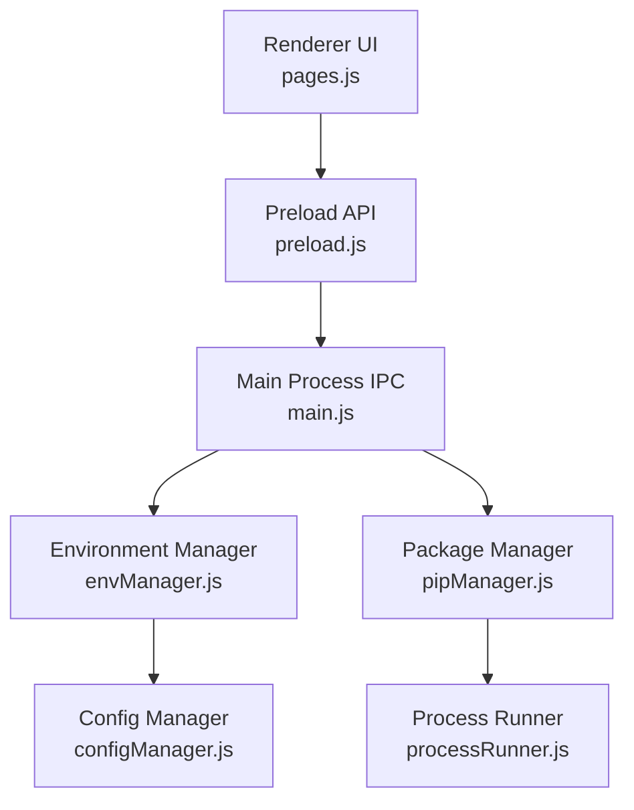
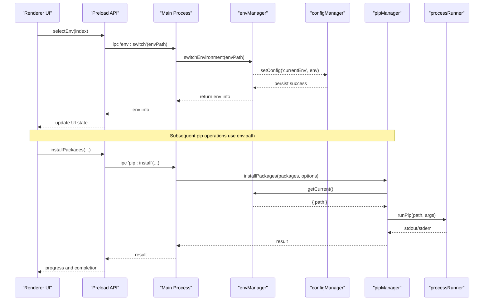
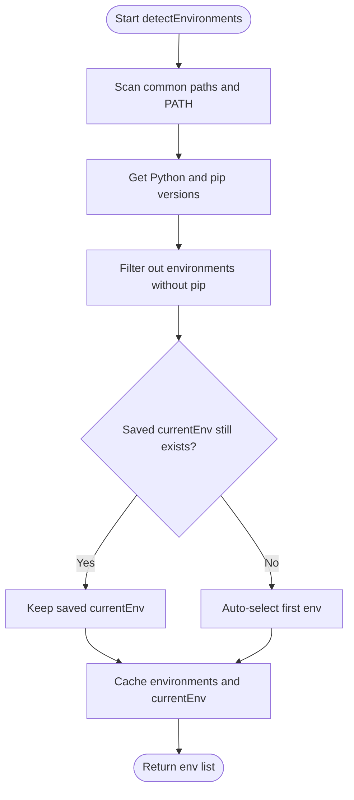
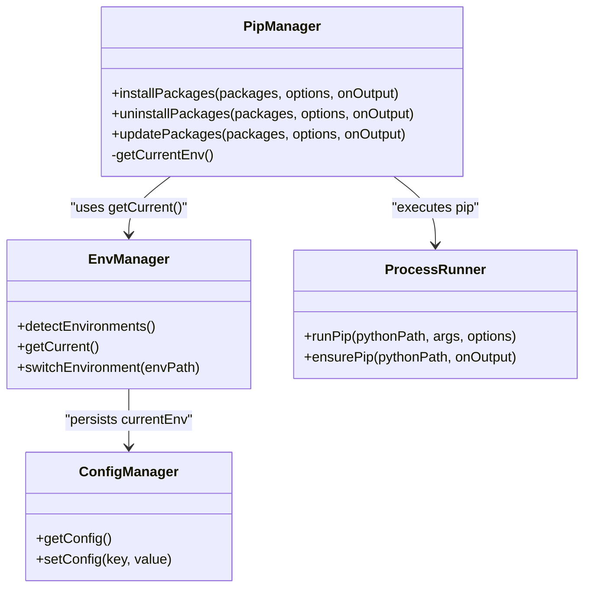
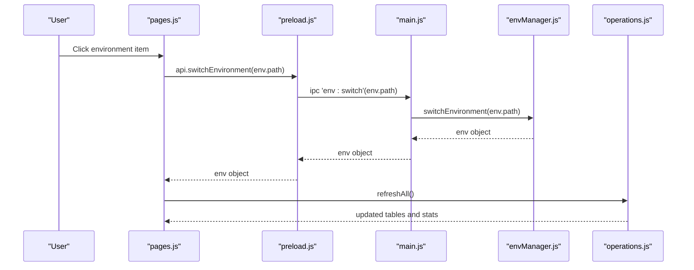
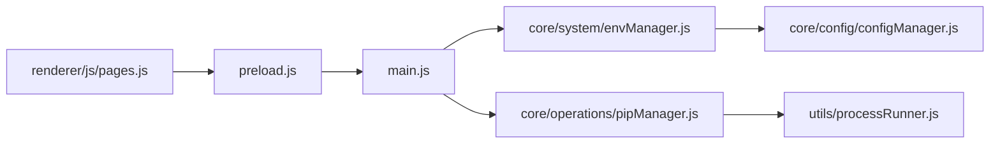

# Environment Switching

<cite>
**Referenced Files in This Document**
- [envManager.js](file://core/system/envManager.js)
- [pipManager.js](file://core/operations/pipManager.js)
- [configManager.js](file://core/config/configManager.js)
- [processRunner.js](file://utils/processRunner.js)
- [main.js](file://main.js)
- [preload.js](file://preload.js)
- [pages.js](file://renderer/js/pages.js)
- [operations.js](file://renderer/js/operations.js)
- [app.js](file://renderer/js/app.js)
</cite>

## Table of Contents
1. [Introduction](#introduction)
2. [Project Structure](#project-structure)
3. [Core Components](#core-components)
4. [Architecture Overview](#architecture-overview)
5. [Detailed Component Analysis](#detailed-component-analysis)
6. [Dependency Analysis](#dependency-analysis)
7. [Performance Considerations](#performance-considerations)
8. [Troubleshooting Guide](#troubleshooting-guide)
9. [Conclusion](#conclusion)
10. [Appendices](#appendices)

## Introduction
This document explains the Python environment switching mechanism implemented in the application. It covers how users switch between detected Python environments via the GUI, how runtime environment changes are applied to subsequent pip operations, and how configuration is persisted across sessions. It also documents environment validation, error handling for invalid paths, automatic fallback behavior, and best practices for multi-environment workflows.

## Project Structure
The environment switching feature spans multiple layers:
- Renderer (UI): pages.js handles user interactions for selecting environments and virtual environments; app.js orchestrates startup and data refresh flows.
- Preload bridge: preload.js exposes safe IPC methods to the renderer.
- Main process: main.js registers IPC handlers that delegate to core modules.
- Core modules: envManager.js manages detection and selection; configManager.js persists currentEnv; pipManager.js uses the selected environment for all pip operations; processRunner.js executes Python/pip commands safely.

**Diagram sources**
- [pages.js](file://renderer/js/pages.js)
- [preload.js](file://preload.js)
- [main.js](file://main.js)
- [envManager.js](file://core/system/envManager.js)
- [pipManager.js](file://core/operations/pipManager.js)
- [configManager.js](file://core/config/configManager.js)
- [processRunner.js](file://utils/processRunner.js)

**Section sources**
- [main.js](file://main.js)
- [preload.js](file://preload.js)
- [pages.js](file://renderer/js/pages.js)
- [envManager.js](file://core/system/envManager.js)
- [pipManager.js](file://core/operations/pipManager.js)
- [configManager.js](file://core/config/configManager.js)
- [processRunner.js](file://utils/processRunner.js)

## Core Components
- Environment Manager (envManager.js): Detects installed Python environments, maintains the currently selected environment in memory and configuration, and provides switching APIs.
- Config Manager (configManager.js): Persists application settings including currentEnv with atomic writes and default fallbacks.
- Package Manager (pipManager.js): Uses the selected environment for all pip operations, ensuring every command targets the correct Python executable.
- Process Runner (processRunner.js): Executes Python and pip commands with robust timeout, cancellation, and auto-installation of pip when missing.
- IPC Layer (main.js + preload.js): Bridges UI actions to core modules securely.

**Section sources**
- [envManager.js](file://core/system/envManager.js)
- [configManager.js](file://core/config/configManager.js)
- [pipManager.js](file://core/operations/pipManager.js)
- [processRunner.js](file://utils/processRunner.js)
- [main.js](file://main.js)
- [preload.js](file://preload.js)

## Architecture Overview
The environment switching flow integrates UI, IPC, environment management, and package operations:

**Diagram sources**
- [pages.js](file://renderer/js/pages.js)
- [preload.js](file://preload.js)
- [main.js](file://main.js)
- [envManager.js](file://core/system/envManager.js)
- [pipManager.js](file://core/operations/pipManager.js)
- [processRunner.js](file://utils/processRunner.js)

## Detailed Component Analysis

### Environment Detection and Selection
- Detection scans common installation patterns and PATH entries, collects Python and pip versions, filters out environments without pip, and restores a previously saved currentEnv if still valid. If no currentEnv exists, it selects the first available environment and persists it.
- Switching validates the target path, updates the in-memory currentEnv, and immediately persists the change. Invalid paths throw an error.

**Diagram sources**
- [envManager.js](file://core/system/envManager.js)

**Section sources**
- [envManager.js](file://core/system/envManager.js)

### Configuration Persistence
- The current environment is stored under the key currentEnv in the application configuration file. Writes use atomic temp-file rename to avoid corruption. Defaults include a null currentEnv which is resolved on first detection.

**Section sources**
- [configManager.js](file://core/config/configManager.js)

### Integration with Package Operations
- All pip operations obtain the current environment via envManager.getCurrent(). They then call processRunner.runPip with the environment’s python path, ensuring every pip command targets the selected environment.
- pip availability is ensured automatically using ensurePip, which tries built-in ensurepip or downloads get-pip.py as needed.

**Diagram sources**
- [pipManager.js](file://core/operations/pipManager.js)
- [envManager.js](file://core/system/envManager.js)
- [processRunner.js](file://utils/processRunner.js)
- [configManager.js](file://core/config/configManager.js)

**Section sources**
- [pipManager.js](file://core/operations/pipManager.js)
- [processRunner.js](file://utils/processRunner.js)

### GUI Interaction Flow
- Users select an environment from the UI. The renderer calls the preload API to switch the environment, then refreshes lists and status. Virtual environments can be created and switched similarly.

**Diagram sources**
- [pages.js](file://renderer/js/pages.js)
- [preload.js](file://preload.js)
- [main.js](file://main.js)
- [envManager.js](file://core/system/envManager.js)
- [operations.js](file://renderer/js/operations.js)

**Section sources**
- [pages.js](file://renderer/js/pages.js)
- [operations.js](file://renderer/js/operations.js)
- [app.js](file://renderer/js/app.js)

### Virtual Environments Management
- Virtual environments are created under a dedicated storage directory, validated for existence and structure, and can be used to switch the active environment by pointing to their python executable.

**Section sources**
- [pages.js](file://renderer/js/pages.js)

## Dependency Analysis
- Renderer depends on preload for IPC exposure.
- Main process delegates to envManager and pipManager through IPC handlers.
- pipManager depends on envManager for the current environment and on processRunner for execution.
- envManager depends on configManager for persistence.

**Diagram sources**
- [pages.js](file://renderer/js/pages.js)
- [preload.js](file://preload.js)
- [main.js](file://main.js)
- [envManager.js](file://core/system/envManager.js)
- [pipManager.js](file://core/operations/pipManager.js)
- [processRunner.js](file://utils/processRunner.js)
- [configManager.js](file://core/config/configManager.js)

**Section sources**
- [main.js](file://main.js)
- [preload.js](file://preload.js)
- [envManager.js](file://core/system/envManager.js)
- [pipManager.js](file://core/operations/pipManager.js)
- [processRunner.js](file://utils/processRunner.js)
- [configManager.js](file://core/config/configManager.js)

## Performance Considerations
- Environment detection runs asynchronously at startup to avoid blocking UI rendering.
- pip readiness is cached per python path to reduce repeated checks.
- site-packages metadata scanning is optimized with caching and fast heuristics.
- Bulk operations support parallelism where appropriate, while maintaining per-environment locks to prevent concurrent conflicts.

[No sources needed since this section provides general guidance]

## Troubleshooting Guide
- Invalid environment path: switchEnvironment throws an error if the path does not exist. Ensure the selected python executable is present.
- Missing pip: ensurePip attempts automatic installation via ensurepip or get-pip.py. If both fail, the operation will report that pip could not be installed and suggests manual installation.
- No environment selected: pip operations require a current environment; detection sets a default if none exists.
- Path traversal protection: venv creation/deletion validates paths to prevent unsafe directory access.

**Section sources**
- [envManager.js](file://core/system/envManager.js)
- [processRunner.js](file://utils/processRunner.js)
- [pipManager.js](file://core/operations/pipManager.js)

## Conclusion
The environment switching mechanism provides a robust, user-friendly way to manage multiple Python environments. It ensures that all pip operations consistently target the selected environment, persists user choices, and includes safeguards against invalid inputs and missing dependencies. By following the documented flows and best practices, users can confidently switch environments and maintain reliable package operations across sessions.

[No sources needed since this section summarizes without analyzing specific files]

## Appendices

### Programmatic Environment Switching Examples
- Switch environment via IPC:
  - Call the exposed method to switch to a given python path, then refresh UI and data.
- Read current environment:
  - Retrieve the current environment object to display or log its details.
- Persist configuration:
  - Use the config manager to read or write settings such as currentEnv.

**Section sources**
- [preload.js](file://preload.js)
- [pages.js](file://renderer/js/pages.js)
- [configManager.js](file://core/config/configManager.js)

### Best Practices for Multi-Environment Workflows
- Always verify the selected environment before running package operations.
- Prefer creating isolated virtual environments for projects to avoid global pollution.
- Use backup and rollback features when performing risky operations like uninstall or update.
- Leverage mirror testing and smart routing to improve download reliability.
- Keep pip up to date; rely on ensurePip to handle missing installations gracefully.

[No sources needed since this section provides general guidance]