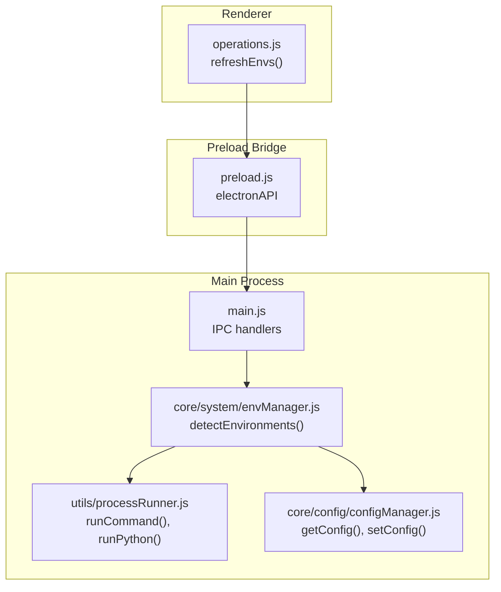
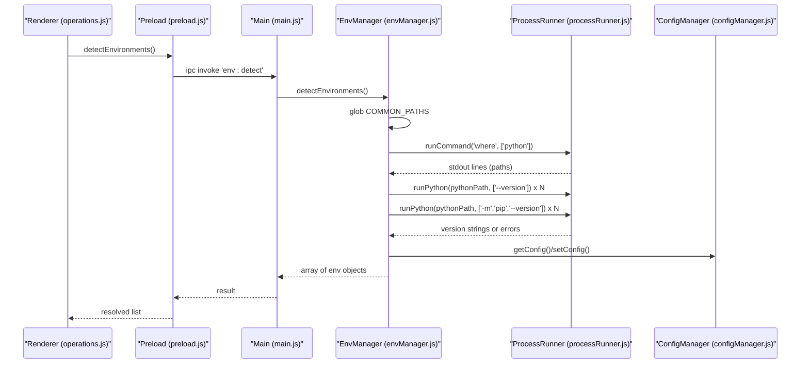
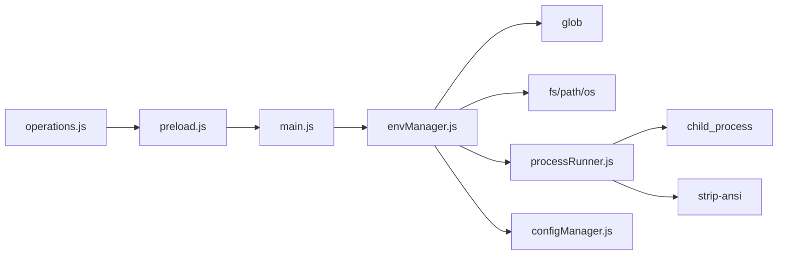

# Python Environment Detection

<cite>
**Referenced Files in This Document**
- [envManager.js](file://core/system/envManager.js)
- [processRunner.js](file://utils/processRunner.js)
- [configManager.js](file://core/config/configManager.js)
- [main.js](file://main.js)
- [preload.js](file://preload.js)
- [operations.js](file://renderer/js/operations.js)
- [package.json](file://package.json)
</cite>

## Table of Contents
1. [Introduction](#introduction)
2. [Project Structure](#project-structure)
3. [Core Components](#core-components)
4. [Architecture Overview](#architecture-overview)
5. [Detailed Component Analysis](#detailed-component-analysis)
6. [Dependency Analysis](#dependency-analysis)
7. [Performance Considerations](#performance-considerations)
8. [Troubleshooting Guide](#troubleshooting-guide)
9. [Conclusion](#conclusion)

## Introduction
This document explains how PyLibMaster automatically discovers and manages Python environments across Windows, macOS, and Linux. It focuses on the environment detection logic that uses glob patterns and system commands to locate Python installations, including system-level Python, user-level installs, Anaconda/Miniconda environments, and Windows Store Python. It also documents version detection for both Python and pip, error handling strategies, and performance optimizations through parallel processing. Examples of detected environment objects and platform-specific behaviors are included, along with troubleshooting guidance for common issues.

## Project Structure
The environment detection functionality is implemented primarily in the core system module and supported by utilities for process execution and configuration persistence. The Electron main process exposes IPC handlers that the renderer calls via a preload bridge.

**Diagram sources**
- [operations.js:421-431](file://renderer/js/operations.js#L421-L431)
- [preload.js:20-31](file://preload.js#L20-L31)
- [main.js:257-261](file://main.js#L257-L261)
- [envManager.js:85-170](file://core/system/envManager.js#L85-L170)
- [processRunner.js:85-161](file://utils/processRunner.js#L85-L161)
- [configManager.js:144-178](file://core/config/configManager.js#L144-L178)

**Section sources**
- [envManager.js:1-220](file://core/system/envManager.js#L1-L220)
- [processRunner.js:1-366](file://utils/processRunner.js#L1-L366)
- [configManager.js:1-194](file://core/config/configManager.js#L1-L194)
- [main.js:254-262](file://main.js#L254-L262)
- [preload.js:20-31](file://preload.js#L20-L31)
- [operations.js:421-431](file://renderer/js/operations.js#L421-L431)

## Core Components
- Environment Manager (envManager.js): Orchestrates discovery of Python environments using glob patterns and PATH resolution, collects Python and pip versions, filters invalid environments, persists current selection, and caches results.
- Process Runner (processRunner.js): Provides robust subprocess execution with timeouts, ANSI stripping, UTF-8 encoding, and helpers to run Python and pip commands.
- Config Manager (configManager.js): Persists application settings including the currently selected Python environment and provides safe defaults and validation.
- Main Process (main.js): Exposes IPC handlers for environment detection, retrieval, and switching.
- Preload Bridge (preload.js): Exposes safe APIs to the renderer for invoking environment operations.
- Renderer Operations (operations.js): Calls the environment APIs to refresh UI state and manage user interactions.

Key responsibilities:
- Discover Python executables via glob patterns and system commands.
- Validate each candidate by running Python and pip commands.
- Filter out environments without pip.
- Normalize names and versions for display.
- Persist and restore the current environment.
- Optimize performance with parallel version checks.

**Section sources**
- [envManager.js:30-41](file://core/system/envManager.js#L30-L41)
- [envManager.js:48-71](file://core/system/envManager.js#L48-L71)
- [envManager.js:85-170](file://core/system/envManager.js#L85-L170)
- [processRunner.js:85-161](file://utils/processRunner.js#L85-L161)
- [configManager.js:90-117](file://core/config/configManager.js#L90-L117)
- [main.js:257-261](file://main.js#L257-L261)
- [preload.js:29-31](file://preload.js#L29-L31)
- [operations.js:421-431](file://renderer/js/operations.js#L421-L431)

## Architecture Overview
The detection flow starts from the renderer, which invokes an API exposed by the preload script. The main process handles the IPC call and delegates to the environment manager. The manager scans known paths using glob patterns, queries PATH via system commands, and then runs Python and pip commands in parallel to gather version information. Results are filtered, normalized, cached, and persisted.

**Diagram sources**
- [operations.js:421-431](file://renderer/js/operations.js#L421-L431)
- [preload.js:29-31](file://preload.js#L29-L31)
- [main.js:257-261](file://main.js#L257-L261)
- [envManager.js:85-170](file://core/system/envManager.js#L85-L170)
- [processRunner.js:85-161](file://utils/processRunner.js#L85-L161)
- [configManager.js:144-178](file://core/config/configManager.js#L144-L178)

## Detailed Component Analysis

### Environment Manager (envManager.js)
Responsibilities:
- Define common installation path patterns for Windows and cross-platform support.
- Scan filesystem using glob patterns to find Python executables.
- Query PATH using system commands to discover additional Python locations.
- Run Python and pip commands concurrently to collect version info.
- Filter environments lacking pip.
- Generate friendly names and normalize versions.
- Restore previously selected environment if still valid.
- Cache results and auto-select first environment when none is set.

Detection pipeline:
1. Glob scan of predefined patterns covering system-level Python, user-level installs, Windows Store Python, and Conda/Miniconda environments.
2. PATH discovery via system command to capture any Python not covered by globs.
3. Parallel version checks for Python and pip per discovered executable.
4. Filtering and normalization into a structured list.
5. Configuration integration to persist and restore current environment.

Error handling:
- Glob failures are ignored to avoid blocking detection.
- System command failures are caught and skipped.
- Version parsing returns fallback values when output is unexpected.
- Environments without pip are excluded from results.

Performance optimization:
- Uses Promise.all to execute Python and pip version checks in parallel across all candidates.
- Maintains an in-memory cache of detected environments to avoid repeated scans.

Example detected environment object:
- name: Friendly display name derived from directory or version.
- path: Absolute path to the Python executable.
- version: Detected Python version string.
- pipVersion: Detected pip version string or null if unavailable.

Platform-specific behavior:
- Windows-centric glob patterns include .exe paths for system, user, Windows Store, and Conda distributions.
- PATH-based discovery works across platforms where applicable.
- Cross-platform compatibility relies on OS-provided commands and Node.js fs/os/path modules.

**Section sources**
- [envManager.js:30-41](file://core/system/envManager.js#L30-L41)
- [envManager.js:48-71](file://core/system/envManager.js#L48-L71)
- [envManager.js:85-170](file://core/system/envManager.js#L85-L170)
- [envManager.js:178-209](file://core/system/envManager.js#L178-L209)
- [envManager.js:215-219](file://core/system/envManager.js#L215-L219)

### Process Runner (processRunner.js)
Responsibilities:
- Execute system commands with timeout, real-time output, ANSI stripping, and UTF-8 encoding.
- Provide convenience wrappers for running Python and pip commands.
- Manage active processes and support cancellation by operationId.
- Ensure pip availability with automatic installation attempts.

Key features relevant to environment detection:
- runCommand supports shell mode for PATH resolution and custom options like ignoreExitCode.
- runPython executes arbitrary Python scripts or flags against a specified interpreter.
- Timeout and graceful termination prevent hangs during version checks.

Error handling:
- Non-zero exit codes produce structured errors with stdout/stderr captured.
- Timeouts trigger SIGTERM followed by SIGKILL after a delay.

**Section sources**
- [processRunner.js:85-161](file://utils/processRunner.js#L85-L161)
- [processRunner.js:340-353](file://utils/processRunner.js#L340-L353)

### Config Manager (configManager.js)
Responsibilities:
- Persist application configuration including currentEnv.
- Provide safe defaults and value sanitization.
- Atomic file writes to avoid corruption.

Relevance to environment detection:
- Stores and restores the selected Python environment across app sessions.
- Ensures default storage paths and directories exist.

**Section sources**
- [configManager.js:90-117](file://core/config/configManager.js#L90-L117)
- [configManager.js:144-178](file://core/config/configManager.js#L144-L178)

### Main Process (main.js)
Responsibilities:
- Register IPC handlers for environment operations.
- Initialize background tasks such as environment detection at startup.

Relevance to environment detection:
- Exposes 'env:detect', 'env:getCurrent', and 'env:switch' handlers.
- Invokes envManager.startDetection() asynchronously on app ready.

**Section sources**
- [main.js:133-140](file://main.js#L133-L140)
- [main.js:257-261](file://main.js#L257-L261)

### Preload Bridge (preload.js)
Responsibilities:
- Expose safe APIs to the renderer for environment detection and switching.

Relevance to environment detection:
- Maps renderer calls to IPC handlers for environment operations.

**Section sources**
- [preload.js:29-31](file://preload.js#L29-L31)

### Renderer Operations (operations.js)
Responsibilities:
- Refresh environment lists and synchronize UI state.
- Call environment APIs to update current environment index and render options.

Relevance to environment detection:
- refreshEnvs triggers detectEnvironments and getCurrentEnv to populate dropdowns and compare options.

**Section sources**
- [operations.js:421-431](file://renderer/js/operations.js#L421-L431)

## Dependency Analysis
The environment detection module depends on:
- glob library for pattern matching across filesystem paths.
- Node.js fs, path, os modules for filesystem and OS abstractions.
- processRunner for executing system commands and Python/pip commands.
- configManager for reading/writing persistent configuration.

External dependencies:
- package.json declares glob and strip-ansi; electron and related tooling provide runtime context.

**Diagram sources**
- [envManager.js:18-23](file://core/system/envManager.js#L18-L23)
- [processRunner.js:13-18](file://utils/processRunner.js#L13-L18)
- [package.json:20-24](file://package.json#L20-L24)
- [main.js:17-26](file://main.js#L17-L26)
- [preload.js:14-31](file://preload.js#L14-L31)
- [operations.js:12-13](file://renderer/js/operations.js#L12-L13)

**Section sources**
- [package.json:20-24](file://package.json#L20-L24)
- [envManager.js:18-23](file://core/system/envManager.js#L18-L23)
- [processRunner.js:13-18](file://utils/processRunner.js#L13-L18)

## Performance Considerations
- Parallel version checks: Python and pip version commands are executed concurrently using Promise.all, significantly reducing total detection time when multiple environments are present.
- In-memory caching: Detected environments are cached in memory to avoid repeated scanning within the same session.
- Asynchronous startup: Background detection is initiated without blocking UI rendering, improving perceived performance.
- Timeout controls: Subprocesses have timeouts to prevent hanging operations from stalling detection.

Optimization opportunities:
- Limit concurrent subprocesses based on CPU cores to avoid resource contention on systems with many environments.
- Add incremental detection to re-scan only changed directories or PATH entries.
- Cache pip readiness per Python path with TTL to reduce repeated checks.

[No sources needed since this section provides general guidance]

## Troubleshooting Guide
Common issues and resolutions:
- No environments detected:
  - Verify that Python installations include pip; environments without pip are intentionally filtered out.
  - Ensure PATH includes Python executables; PATH-based discovery may be required if glob patterns do not match your setup.
  - Check permissions for accessing user directories and conda paths.
- Slow detection:
  - Reduce the number of glob patterns or limit PATH scanning scope.
  - Increase timeout thresholds cautiously; excessive timeouts can slow down detection.
- Incorrect version parsing:
  - Confirm Python outputs expected version format; non-standard builds may require regex adjustments.
- Windows Store Python:
  - Some Store Python shims may not expose full pip capabilities; ensure the underlying interpreter has pip installed.
- Conda/Miniconda environments:
  - Verify activation paths and environment names; some installations use different directory structures.

Diagnostic steps:
- Inspect logs for subprocess errors and timeouts.
- Manually run Python --version and python -m pip --version to validate outputs.
- Use system commands like where python (Windows) or which python (Unix-like) to verify PATH resolution.

**Section sources**
- [envManager.js:85-170](file://core/system/envManager.js#L85-L170)
- [processRunner.js:85-161](file://utils/processRunner.js#L85-L161)

## Conclusion
PyLibMaster’s Python environment detection leverages glob patterns and system commands to comprehensively discover Python installations across platforms. It robustly validates each candidate by checking Python and pip versions, filters out unusable environments, and optimizes performance through parallel processing and caching. The architecture cleanly separates concerns between process execution, configuration management, and UI interaction, ensuring reliable and efficient environment discovery and management.

[No sources needed since this section summarizes without analyzing specific files]