# Virtual Environment Management

<cite>
**Referenced Files in This Document**
- [venvManager.js](file://core/operations/venvManager.js)
- [templateManager.js](file://core/operations/templateManager.js)
- [envManager.js](file://core/system/envManager.js)
- [pipManager.js](file://core/operations/pipManager.js)
- [backupManager.js](file://core/operations/backupManager.js)
- [processRunner.js](file://utils/processRunner.js)
- [index.html](file://renderer/index.html)
- [pages.js](file://renderer/js/pages.js)
- [operations.js](file://renderer/js/operations.js)
- [app.js](file://renderer/js/app.js)
</cite>

## Update Summary
**Changes Made**
- Added comprehensive virtual environment lifecycle management with creation, listing, deletion, and detailed information retrieval
- Enhanced template-based environment setup with built-in templates for common development stacks
- Integrated full GUI interface for virtual environment management including creation forms and environment lists
- Added snapshot and backup capabilities for environment versioning and rollback
- Implemented environment comparison tools for dependency analysis across multiple environments

## Table of Contents
1. Introduction
2. Project Structure
3. Core Components
4. Architecture Overview
5. Detailed Component Analysis
6. Dependency Analysis
7. Performance Considerations
8. Troubleshooting Guide
9. Conclusion
10. Appendices

## Introduction
This document explains how to create and manage Python virtual environments through PyLibMaster's GUI. It covers the venv creation workflow, template-based setup options, custom configuration parameters, integration with existing Python environments, dependency isolation, environment comparison tools, export/import functionality, requirements.txt generation, and backup capabilities. Practical examples include creating development vs production environments, managing multiple project environments, and sharing configurations across team members.

## Project Structure
PyLibMaster organizes virtual environment management across backend modules (Node.js) and a web-based GUI:
- Backend operations: venv creation, listing, deletion, info retrieval; templates and snapshots; pip operations; backups; process execution utilities.
- System-level environment detection and switching.
- GUI pages for environment selection, venv creation, templates, export/import, and comparison.

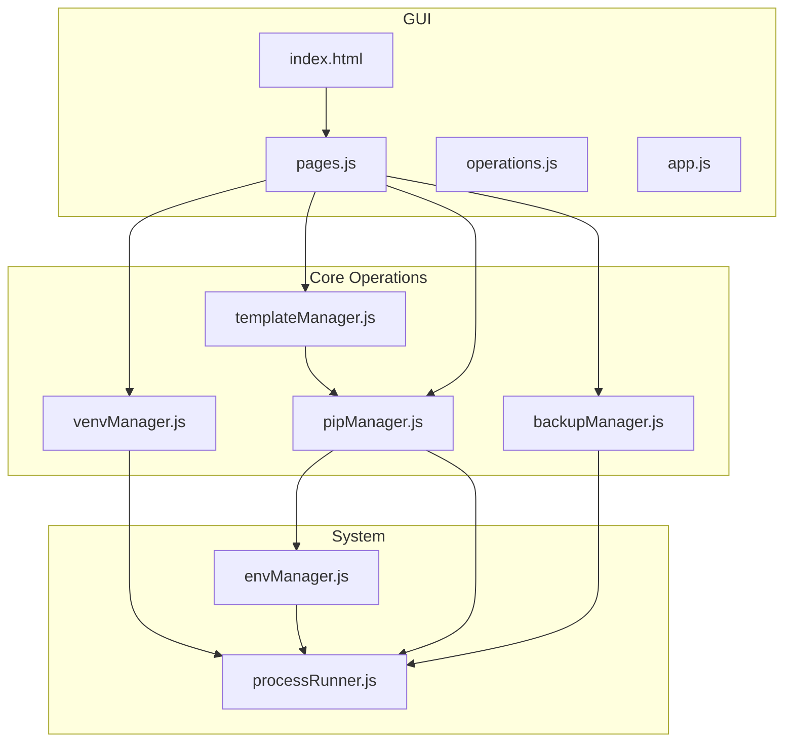

**Diagram sources**
- [index.html](file://renderer/index.html)
- [pages.js](file://renderer/js/pages.js)
- [operations.js](file://renderer/js/operations.js)
- [app.js](file://renderer/js/app.js)
- [venvManager.js](file://core/operations/venvManager.js)
- [templateManager.js](file://core/operations/templateManager.js)
- [pipManager.js](file://core/operations/pipManager.js)
- [backupManager.js](file://core/operations/backupManager.js)
- [envManager.js](file://core/system/envManager.js)
- [processRunner.js](file://utils/processRunner.js)

**Section sources**
- [index.html](file://renderer/index.html)
- [pages.js](file://renderer/js/pages.js)
- [venvManager.js](file://core/operations/venvManager.js)
- [templateManager.js](file://core/operations/templateManager.js)
- [envManager.js](file://core/system/envManager.js)
- [pipManager.js](file://core/operations/pipManager.js)
- [backupManager.js](file://core/operations/backupManager.js)
- [processRunner.js](file://utils/processRunner.js)

## Core Components
- **Virtual Environment Manager**: Creates, lists, deletes, and inspects venvs; validates names and paths; cleans up on failure.
- **Template Manager**: Provides preset templates (Web, Data, ML, etc.), creates venvs from templates, installs packages, and manages snapshots for time-travel rollback.
- **Environment Manager**: Detects installed Python environments (system, Conda, Windows Store), resolves versions, persists current selection.
- **Pip Manager**: Executes install/uninstall/update with parallelism, retries, mirror routing, automatic rollback via backups, and safe spec building.
- **Backup Manager**: Creates freeze-based backups and restores them using force-reinstall without dependencies.
- **Process Runner**: Spawns subprocesses, handles timeouts, cancellation, ANSI cleanup, and ensures pip availability.

**Section sources**
- [venvManager.js](file://core/operations/venvManager.js)
- [templateManager.js](file://core/operations/templateManager.js)
- [envManager.js](file://core/system/envManager.js)
- [pipManager.js](file://core/operations/pipManager.js)
- [backupManager.js](file://core/operations/backupManager.js)
- [processRunner.js](file://utils/processRunner.js)

## Architecture Overview
The GUI triggers actions that call backend managers. Managers orchestrate Python and pip commands via the process runner, while env manager provides target environments and venv manager handles venv lifecycle. Templates bridge venv creation and package installation. Backups provide safety nets for risky operations. Snapshots enable environment versioning.

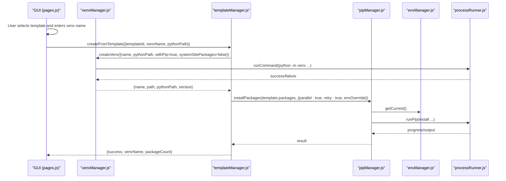

**Diagram sources**
- [pages.js](file://renderer/js/pages.js)
- [templateManager.js](file://core/operations/templateManager.js)
- [venvManager.js](file://core/operations/venvManager.js)
- [pipManager.js](file://core/operations/pipManager.js)
- [envManager.js](file://core/system/envManager.js)
- [processRunner.js](file://utils/processRunner.js)

## Detailed Component Analysis

### Virtual Environment Creation and Lifecycle
- **Create venv**: Validates name and base Python, constructs arguments (with/without pip, inherit system site-packages), executes python -m venv, captures version, logs outcome, and cleans up on failure.
- **List venvs**: Scans storage directory, verifies validity (python executable and pyvenv.cfg), collects Python/pip versions and package counts.
- **Delete venv**: Enforces path safety checks within storage root, removes directory recursively, logs action.
- **Get venv info**: Returns Python/pip versions and base Python path from pyvenv.cfg.

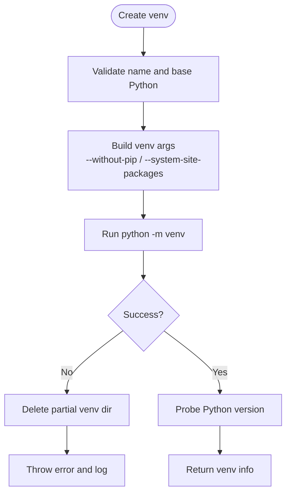

**Diagram sources**
- [venvManager.js](file://core/operations/venvManager.js)
- [processRunner.js](file://utils/processRunner.js)

**Section sources**
- [venvManager.js](file://core/operations/venvManager.js)

### Template-Based Setup Options
- **Built-in templates** cover common stacks (Flask, Django, data analysis, machine learning, crawler, automation).
- **From template flow**: create venv, locate it, then install all packages defined by the template using pip manager with parallelism and retries.
- **Custom templates** can be added and persisted via config.

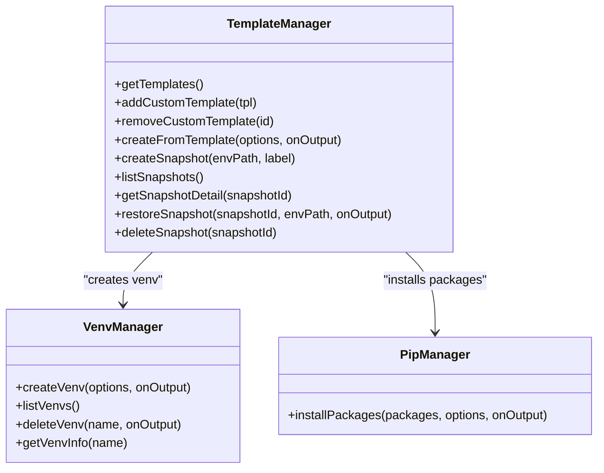

**Diagram sources**
- [templateManager.js](file://core/operations/templateManager.js)
- [venvManager.js](file://core/operations/venvManager.js)
- [pipManager.js](file://core/operations/pipManager.js)

**Section sources**
- [templateManager.js](file://core/operations/templateManager.js)

### Integration with Existing Python Environments
- **Auto-detects** Python installations across common paths and PATH entries, including Conda variants.
- **Resolves** Python and pip versions, filters out environments without pip, and persists selected environment.
- **GUI allows** switching active environment and repairing pip if needed.

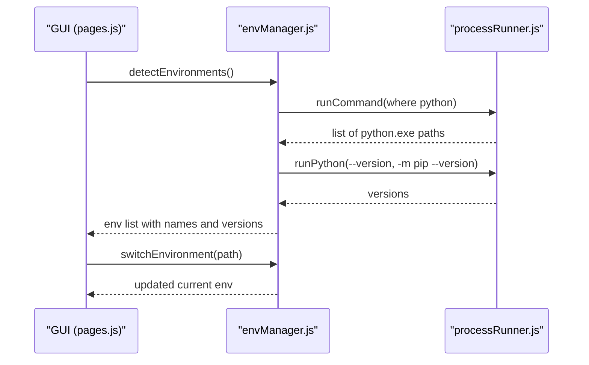

**Diagram sources**
- [envManager.js](file://core/system/envManager.js)
- [processRunner.js](file://utils/processRunner.js)
- [pages.js](file://renderer/js/pages.js)

**Section sources**
- [envManager.js](file://core/system/envManager.js)
- [pages.js](file://renderer/js/pages.js)

### Dependency Isolation and Package Management
- **venv isolates** dependencies per environment; GUI supports selecting base Python and inheriting system site-packages when desired.
- **Pip manager** enforces safe package specs, parallel installs, multi-mirror retries, and automatic rollback via backups.
- **Uninstall supports** optional backup and rollback; update supports parallel updates and rollback.

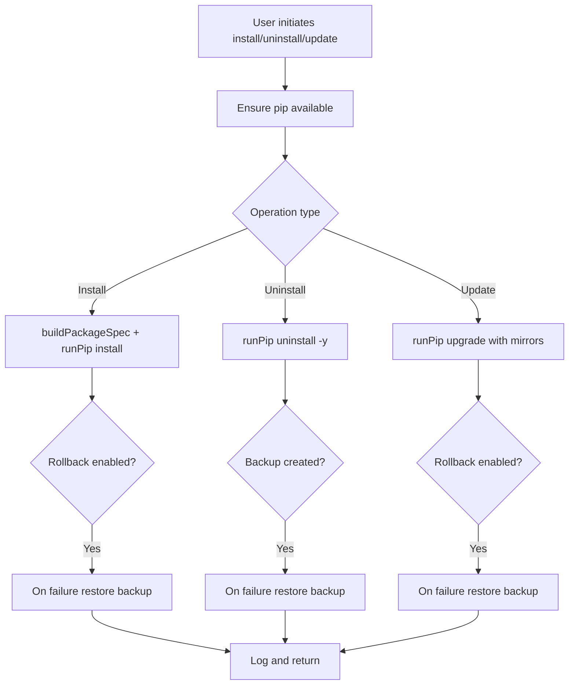

**Diagram sources**
- [pipManager.js](file://core/operations/pipManager.js)
- [backupManager.js](file://core/operations/backupManager.js)
- [processRunner.js](file://utils/processRunner.js)

**Section sources**
- [pipManager.js](file://core/operations/pipManager.js)
- [backupManager.js](file://core/operations/backupManager.js)

### Environment Comparison Tools
- **GUI provides** two dropdowns populated with detected environments.
- **Compares** installed packages between two environments, showing only-in-A, only-in-B, and differing versions.

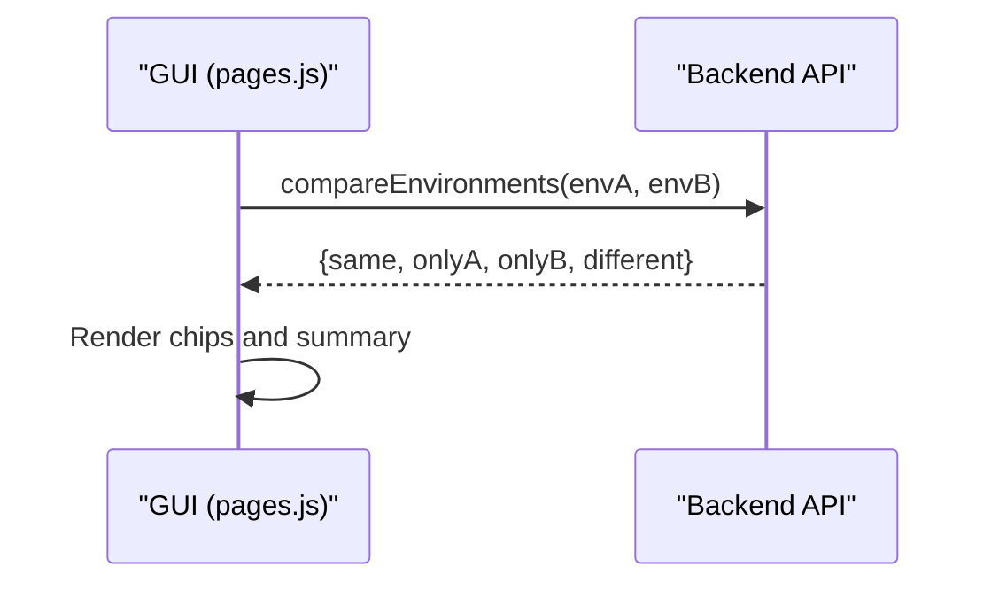

**Diagram sources**
- [pages.js](file://renderer/js/pages.js)

**Section sources**
- [pages.js](file://renderer/js/pages.js)

### Export/Import and Requirements.txt Generation
- **Export**: Select destination directory, generate requirements.txt for the current environment.
- **Import**: Browse to a requirements.txt file and install packages into the current environment.

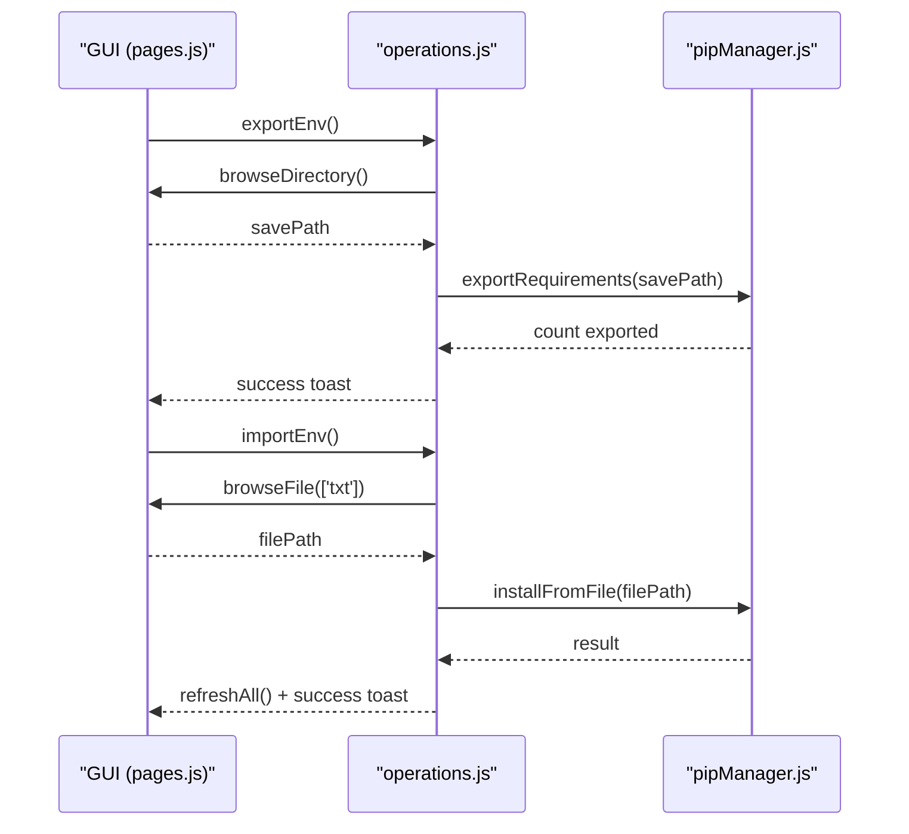

**Diagram sources**
- [pages.js](file://renderer/js/pages.js)
- [operations.js](file://renderer/js/operations.js)
- [pipManager.js](file://core/operations/pipManager.js)

**Section sources**
- [pages.js](file://renderer/js/pages.js)
- [operations.js](file://renderer/js/operations.js)
- [pipManager.js](file://core/operations/pipManager.js)

### Snapshot and Backup Capabilities
- **Snapshots**: Capture full environment state (pip freeze) with labels and timestamps; restore by writing temporary requirements and installing quietly.
- **Backups**: Freeze-based backups used for rollback during risky operations; support listing and deletion.

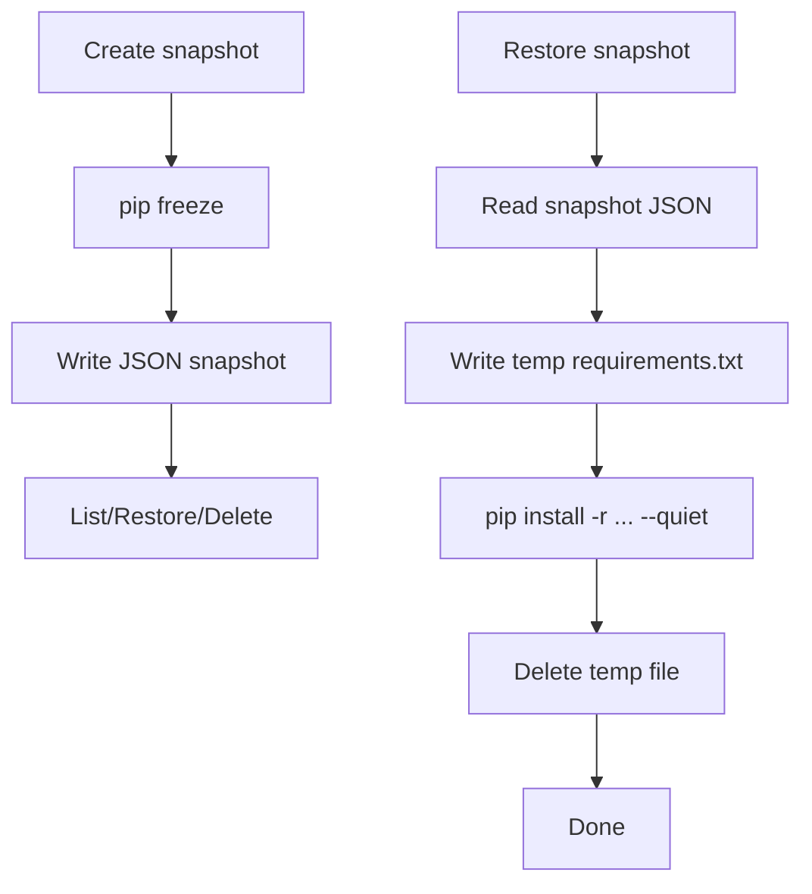

**Diagram sources**
- [templateManager.js](file://core/operations/templateManager.js)
- [backupManager.js](file://core/operations/backupManager.js)
- [processRunner.js](file://utils/processRunner.js)

**Section sources**
- [templateManager.js](file://core/operations/templateManager.js)
- [backupManager.js](file://core/operations/backupManager.js)

### GUI Workflows for Virtual Environments
- **Environment page**: Create venv form (name, base Python, include pip, inherit system site-packages), list and use/delete venvs, export/import, compare.
- **Templates page**: Choose preset or custom template, enter venv name and base Python, create and install, manage snapshots.
- **Operations page**: Global refresh integrates env and venv lists, renders options for comparisons and base Python selectors.

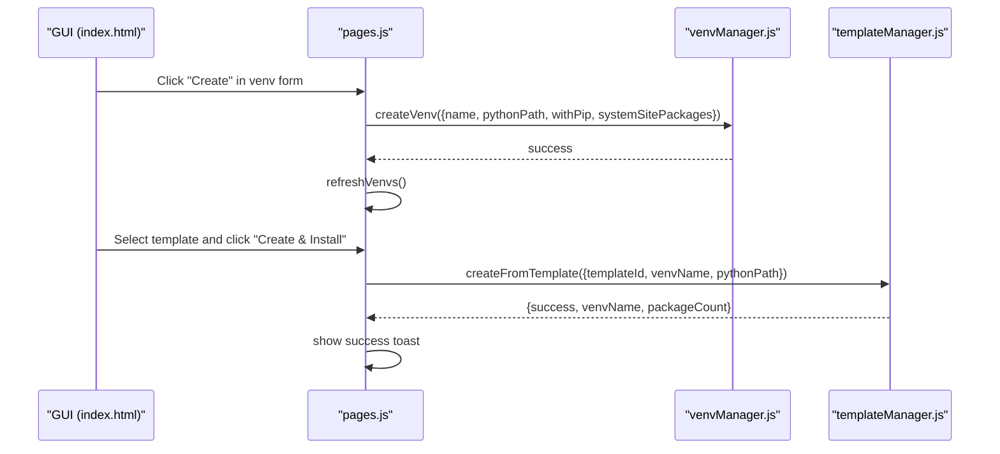

**Diagram sources**
- [index.html](file://renderer/index.html)
- [pages.js](file://renderer/js/pages.js)
- [venvManager.js](file://core/operations/venvManager.js)
- [templateManager.js](file://core/operations/templateManager.js)

**Section sources**
- [index.html](file://renderer/index.html)
- [pages.js](file://renderer/js/pages.js)

## Dependency Analysis
- **GUI depends** on pages.js for interactions, which calls backend managers.
- **venvManager depends** on processRunner for command execution and configManager for storage paths.
- **templateManager composes** venvManager and pipManager to provision environments and install packages.
- **pipManager relies** on envManager for current environment context and backupManager for rollback.
- **All managers use** processRunner for robust subprocess handling, timeout/cancellation, and pip auto-installation.

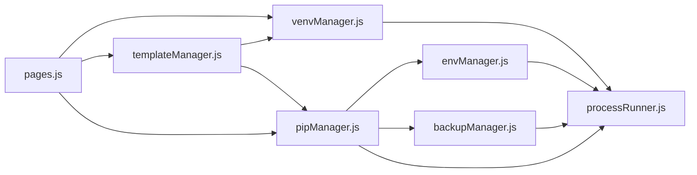

**Diagram sources**
- [pages.js](file://renderer/js/pages.js)
- [venvManager.js](file://core/operations/venvManager.js)
- [templateManager.js](file://core/operations/templateManager.js)
- [pipManager.js](file://core/operations/pipManager.js)
- [envManager.js](file://core/system/envManager.js)
- [backupManager.js](file://core/operations/backupManager.js)
- [processRunner.js](file://utils/processRunner.js)

**Section sources**
- [pages.js](file://renderer/js/pages.js)
- [venvManager.js](file://core/operations/venvManager.js)
- [templateManager.js](file://core/operations/templateManager.js)
- [pipManager.js](file://core/operations/pipManager.js)
- [envManager.js](file://core/system/envManager.js)
- [backupManager.js](file://core/operations/backupManager.js)
- [processRunner.js](file://utils/processRunner.js)

## Performance Considerations
- **Parallel installs** and updates reduce total time; tune thread count based on CPU and network conditions.
- **Mirror routing** and retries improve reliability under unstable networks.
- **Site-packages caching** avoids repeated scans; consider clearing cache after major changes.
- **Snapshot and backup operations** are I/O bound; prefer off-peak times for large environments.
- **Use "inherit system site-packages"** sparingly to avoid bloated venvs and conflicts.

## Troubleshooting Guide
- **Invalid venv name**: Ensure alphanumeric start and allowed characters; length limit enforced.
- **Base Python not found**: Verify path exists and is executable; select from detected environments.
- **pip missing**: Use "Repair pip" to reinitialize via ensurepip or get-pip.py fallback.
- **Path traversal protection**: Deletion and backup ID validation prevent unsafe paths.
- **Timeout errors**: Increase operation timeouts or check network/mirror settings.
- **Rollback triggered**: If an operation fails with rollback enabled, restore previous state automatically; review logs for details.

**Section sources**
- [venvManager.js](file://core/operations/venvManager.js)
- [backupManager.js](file://core/operations/backupManager.js)
- [processRunner.js](file://utils/processRunner.js)
- [pages.js](file://renderer/js/pages.js)

## Conclusion
PyLibMaster's GUI streamlines virtual environment management with robust creation workflows, template-driven provisioning, and powerful tooling for dependency isolation, comparison, export/import, and backup/snapshot. By leveraging parallelism, mirror routing, and automatic rollback, users can confidently manage multiple environments for development and production scenarios while sharing configurations across teams.

## Appendices

### Practical Examples

#### Creating a Development Environment
- Open Environment page, enter a unique venv name, choose a recent Python version, keep pip included, do not inherit system site-packages, and click Create.
- Switch to the new venv and install project dependencies via Install page or import a requirements.txt.

#### Creating a Production Environment
- Use a stable Python version, optionally inherit system site-packages if shared libraries are required, and pin versions in requirements.txt before importing.
- Enable rollback for risky operations and create a snapshot after successful setup.

#### Managing Multiple Project Environments
- Maintain separate venvs per project; use Templates page to bootstrap common stacks quickly.
- Compare environments to audit differences and align dependencies across dev/stage/prod.

#### Sharing Environment Configurations
- Export requirements.txt from a reference environment and share with teammates.
- Team members import the file into their local environments; verify with compare tool.

#### Using Template-Based Setup
- Navigate to Templates page and select appropriate template (Web, Data, ML, etc.).
- Enter venv name and base Python, then click "Create & Install" for automated setup.
- Templates automatically create venv and install all required packages.

#### Working with Snapshots and Backups
- Create snapshots before major changes to enable rollback.
- Use snapshot restore to revert to previous environment states.
- Leverage automatic backups during risky operations for safety.

[No sources needed since this section provides general guidance]