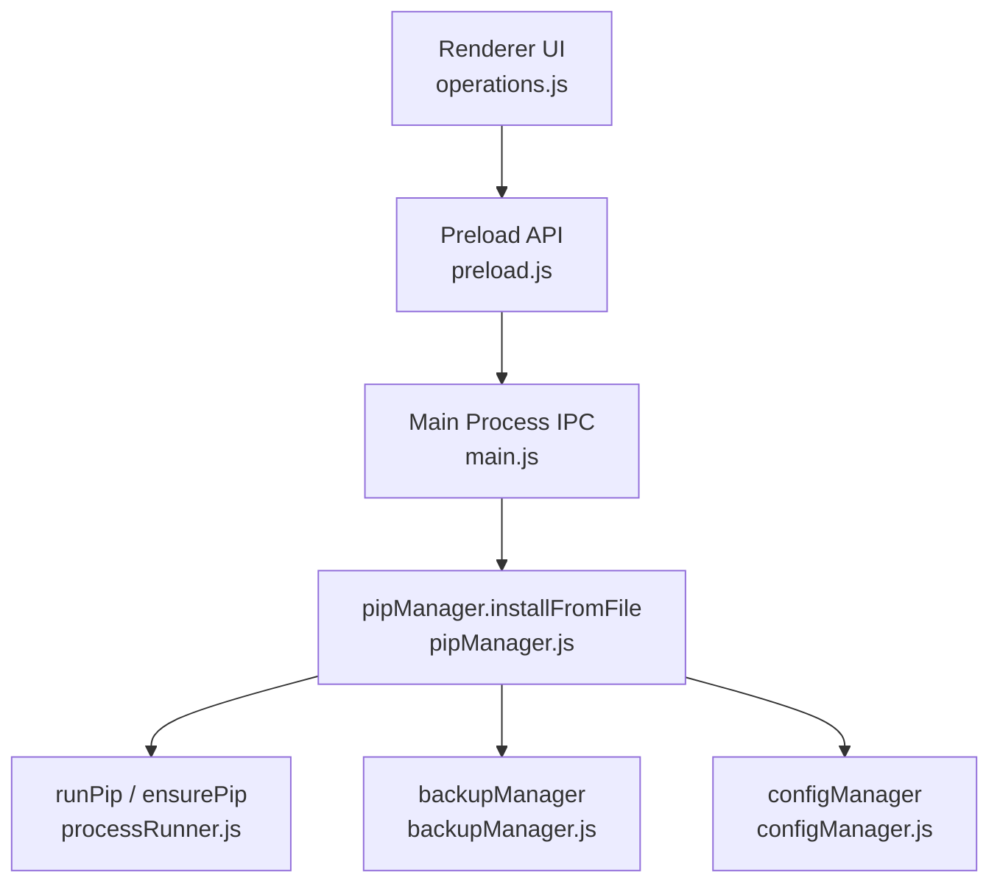
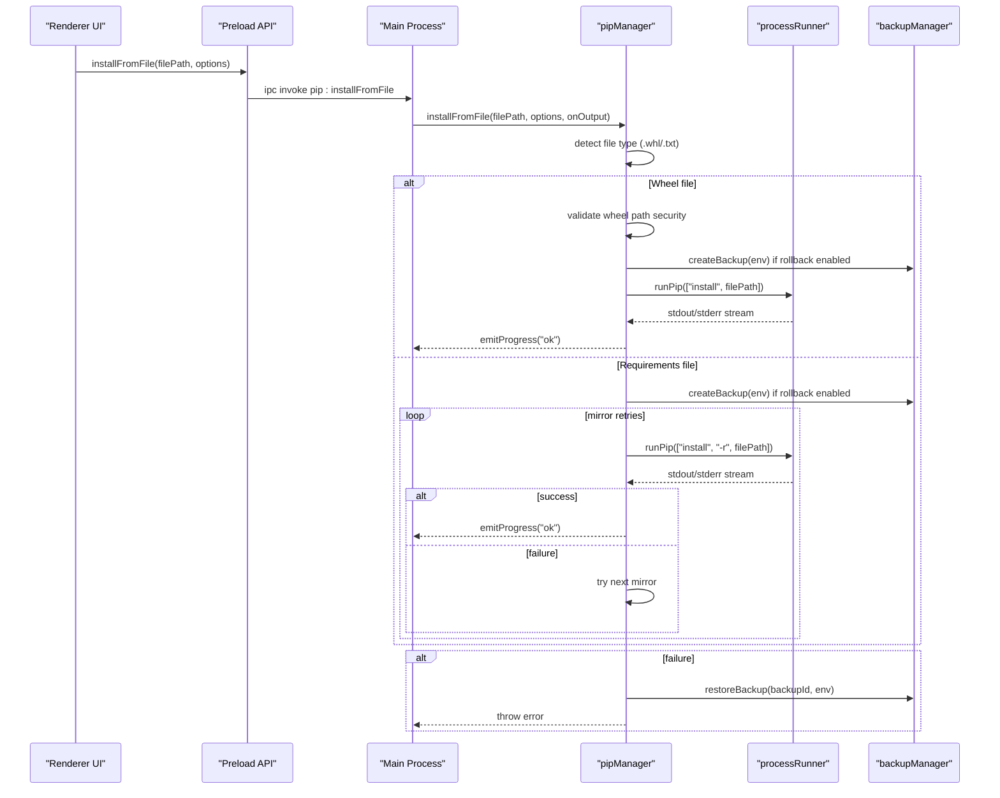
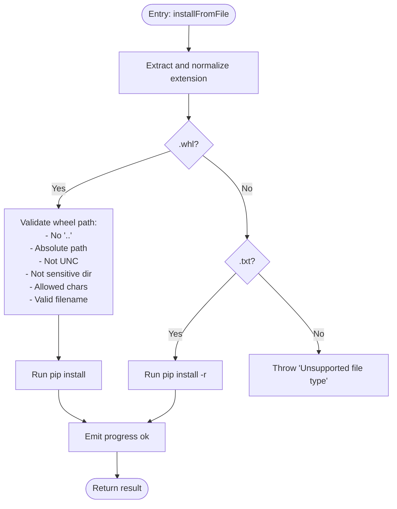
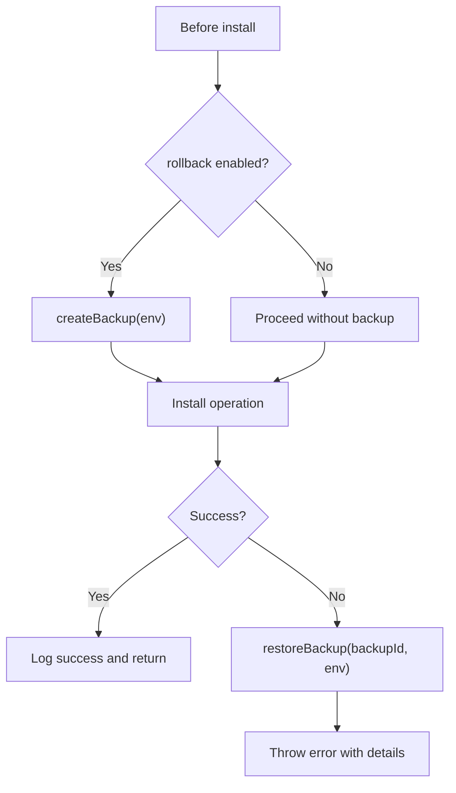
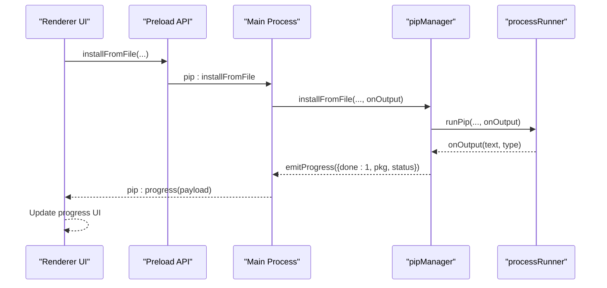
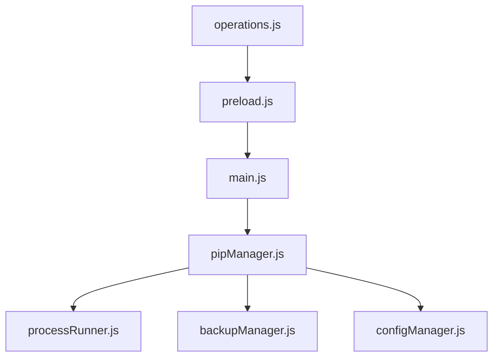

# File-Based Operations

<cite>
**Referenced Files in This Document**
- [pipManager.js](file://core/operations/pipManager.js)
- [processRunner.js](file://utils/processRunner.js)
- [backupManager.js](file://core/operations/backupManager.js)
- [configManager.js](file://core/config/configManager.js)
- [main.js](file://main.js)
- [preload.js](file://preload.js)
- [operations.js](file://renderer/js/operations.js)
</cite>

## Table of Contents
1. [Introduction](#introduction)
2. [Project Structure](#project-structure)
3. [Core Components](#core-components)
4. [Architecture Overview](#architecture-overview)
5. [Detailed Component Analysis](#detailed-component-analysis)
6. [Dependency Analysis](#dependency-analysis)
7. [Performance Considerations](#performance-considerations)
8. [Troubleshooting Guide](#troubleshooting-guide)
9. [Conclusion](#conclusion)

## Introduction
This document explains PyLibMaster’s file-based package operations, focusing on the installFromFile function that supports both .whl wheel files and .txt requirements files. It covers how file types are detected, security validation for wheel paths, installation flows per file type, backup and rollback mechanisms, progress tracking for large installations, and error handling for corrupted or invalid files. Practical examples and troubleshooting guidance are included to help users install from local wheels and batch-install from requirements.txt safely and reliably.

## Project Structure
The file-based installation flow spans the renderer UI, IPC bridge, main process handlers, and core pip management modules:
- Renderer UI triggers file selection/drag-and-drop and calls installFromFile via the exposed API.
- The preload script exposes installFromFile to the renderer through Electron’s contextBridge.
- The main process routes the call to pipManager.installFromFile with a progress callback.
- pipManager handles file type detection, security checks, backups, pip execution, and rollback.
- processRunner executes pip commands with timeouts, cancellation, and real-time output streaming.
- backupManager creates and restores environment snapshots for safe rollback.
- configManager provides configuration values such as retry counts and parallel threads.

**Diagram sources**
- [operations.js:253-293](file://renderer/js/operations.js#L253-L293)
- [preload.js:59-63](file://preload.js#L59-L63)
- [main.js:317-322](file://main.js#L317-L322)
- [pipManager.js:645-730](file://core/operations/pipManager.js#L645-L730)
- [processRunner.js:340-342](file://utils/processRunner.js#L340-L342)
- [backupManager.js:89-113](file://core/operations/backupManager.js#L89-L113)
- [configManager.js:144-147](file://core/config/configManager.js#L144-L147)

**Section sources**
- [operations.js:253-293](file://renderer/js/operations.js#L253-L293)
- [preload.js:59-63](file://preload.js#L59-L63)
- [main.js:317-322](file://main.js#L317-L322)
- [pipManager.js:645-730](file://core/operations/pipManager.js#L645-L730)
- [processRunner.js:340-342](file://utils/processRunner.js#L340-L342)
- [backupManager.js:89-113](file://core/operations/backupManager.js#L89-L113)
- [configManager.js:144-147](file://core/config/configManager.js#L144-L147)

## Core Components
- installFromFile (pipManager): Entry point for file-based installs; detects .whl vs .txt; applies security checks; manages backups; runs pip; emits progress; supports rollback.
- runPip (processRunner): Executes python -m pip with timeout, cancellation, ANSI stripping, and real-time output streaming.
- backupManager: Creates pip freeze snapshots and restores environments using force-reinstall and no-deps.
- configManager: Provides retryCount and parallelThreads used by install flows.
- IPC layer (main.js + preload.js): Bridges renderer calls to pipManager.installFromFile and forwards progress events.

Key responsibilities:
- File type detection: extension-based branching for .whl and .txt.
- Security validation: strict checks for wheel paths (absolute, no traversal, no UNC, no sensitive directories, allowed characters, valid filename).
- Installation processes: direct wheel install vs requirements batch install with mirror retries.
- Backup and rollback: optional snapshot creation before install; automatic restore on failure when enabled.
- Progress tracking: structured progress events emitted per operation.
- Error handling: detailed errors for missing files, unsupported types, invalid paths, and pip failures.

**Section sources**
- [pipManager.js:645-730](file://core/operations/pipManager.js#L645-L730)
- [processRunner.js:340-342](file://utils/processRunner.js#L340-L342)
- [backupManager.js:89-113](file://core/operations/backupManager.js#L89-L113)
- [configManager.js:144-147](file://core/config/configManager.js#L144-L147)
- [main.js:317-322](file://main.js#L317-L322)
- [preload.js:59-63](file://preload.js#L59-L63)

## Architecture Overview
The end-to-end flow for file-based installation:

**Diagram sources**
- [operations.js:253-293](file://renderer/js/operations.js#L253-L293)
- [preload.js:59-63](file://preload.js#L59-L63)
- [main.js:317-322](file://main.js#L317-L322)
- [pipManager.js:645-730](file://core/operations/pipManager.js#L645-L730)
- [processRunner.js:340-342](file://utils/processRunner.js#L340-L342)
- [backupManager.js:89-113](file://core/operations/backupManager.js#L89-L113)

## Detailed Component Analysis

### installFromFile: File Type Detection and Security Validation
- File type detection:
  - Extension is extracted and normalized to lowercase.
  - Branches into .whl or .txt; throws an error for unsupported types.
- Wheel path security validation:
  - Rejects relative paths and path traversal components.
  - Disallows UNC paths and sensitive system directories.
  - Blocks illegal characters to prevent command injection.
  - Requires absolute paths and validates wheel filename format.
- Requirements processing:
  - Uses pip install -r with mirror retry logic based on configured mirrors and retry count.

**Diagram sources**
- [pipManager.js:645-730](file://core/operations/pipManager.js#L645-L730)

**Section sources**
- [pipManager.js:645-730](file://core/operations/pipManager.js#L645-L730)

### Backup and Rollback Mechanisms
- Before installing from a file, if rollback is enabled, a backup snapshot is created using pip freeze and stored under the storage directory.
- On any failure during installation, the system restores the environment using the backup with force-reinstall and no-deps to revert changes precisely.
- Backup IDs are validated to prevent path traversal and ensure safe filenames.

**Diagram sources**
- [pipManager.js:645-730](file://core/operations/pipManager.js#L645-L730)
- [backupManager.js:89-113](file://core/operations/backupManager.js#L89-L113)
- [backupManager.js:156-170](file://core/operations/backupManager.js#L156-L170)

**Section sources**
- [pipManager.js:645-730](file://core/operations/pipManager.js#L645-L730)
- [backupManager.js:89-113](file://core/operations/backupManager.js#L89-L113)
- [backupManager.js:156-170](file://core/operations/backupManager.js#L156-L170)

### Progress Tracking for Large File Installations
- Real-time progress events are emitted via a structured message containing done count and status.
- The renderer listens to pip:progress events and updates UI counters accordingly.
- For wheel installs, one progress event is emitted upon completion; for requirements, progress reflects overall operation success.

**Diagram sources**
- [pipManager.js:645-730](file://core/operations/pipManager.js#L645-L730)
- [processRunner.js:116-127](file://utils/processRunner.js#L116-L127)
- [main.js:317-322](file://main.js#L317-L322)
- [preload.js:179-183](file://preload.js#L179-L183)

**Section sources**
- [pipManager.js:645-730](file://core/operations/pipManager.js#L645-L730)
- [processRunner.js:116-127](file://utils/processRunner.js#L116-L127)
- [main.js:317-322](file://main.js#L317-L322)
- [preload.js:179-183](file://preload.js#L179-L183)

### Error Handling for Corrupted or Invalid Files
- Missing file: Throws “File not found”.
- Unsupported type: Throws “Unsupported file type. Use .txt or .whl”.
- Invalid wheel path: Throws descriptive errors for traversal, UNC, sensitive directories, illegal characters, or invalid filename.
- pip failures: Errors include stdout/stderr content; mirror retries may be attempted for requirements installs.
- Rollback on failure: If enabled, environment is restored to pre-install state and error is rethrown.

Common error scenarios:
- Corrupted wheel file: pip will fail; rollback restores environment.
- Malformed requirements.txt: pip will fail; rollback restores environment.
- Path traversal attempt: rejected early with explicit error.

**Section sources**
- [pipManager.js:645-730](file://core/operations/pipManager.js#L645-L730)
- [processRunner.js:136-148](file://utils/processRunner.js#L136-L148)
- [backupManager.js:156-170](file://core/operations/backupManager.js#L156-L170)

### Practical Examples

- Installing from a local wheel file:
  - Ensure the wheel path is absolute and accessible.
  - Enable rollback to automatically restore on failure.
  - Observe progress events and logs for success/failure.

- Batch installation from requirements.txt:
  - Provide a valid requirements.txt path.
  - Configure retry to leverage multiple mirrors.
  - Monitor progress and handle errors; rollback restores environment if needed.

- Handling file path validation:
  - Avoid relative paths and “..” components.
  - Do not use UNC paths or sensitive directories.
  - Ensure wheel filenames match expected patterns.

- Troubleshooting common issues:
  - “File not found”: Verify the path exists and is readable.
  - “Unsupported file type”: Confirm extension is .whl or .txt.
  - “Invalid wheel path”: Fix path traversal, UNC usage, or character restrictions.
  - pip failures: Check stderr output; adjust mirrors or network settings.

[No sources needed since this section provides general guidance]

## Dependency Analysis
The file-based installation depends on several modules:

**Diagram sources**
- [operations.js:253-293](file://renderer/js/operations.js#L253-L293)
- [preload.js:59-63](file://preload.js#L59-L63)
- [main.js:317-322](file://main.js#L317-L322)
- [pipManager.js:645-730](file://core/operations/pipManager.js#L645-L730)
- [processRunner.js:340-342](file://utils/processRunner.js#L340-L342)
- [backupManager.js:89-113](file://core/operations/backupManager.js#L89-L113)
- [configManager.js:144-147](file://core/config/configManager.js#L144-L147)

**Section sources**
- [operations.js:253-293](file://renderer/js/operations.js#L253-L293)
- [preload.js:59-63](file://preload.js#L59-L63)
- [main.js:317-322](file://main.js#L317-L322)
- [pipManager.js:645-730](file://core/operations/pipManager.js#L645-L730)
- [processRunner.js:340-342](file://utils/processRunner.js#L340-L342)
- [backupManager.js:89-113](file://core/operations/backupManager.js#L89-L113)
- [configManager.js:144-147](file://core/config/configManager.js#L144-L147)

## Performance Considerations
- Parallelism: Configuration controls parallelThreads for other operations; file-based installs execute sequentially per operation but benefit from efficient pip execution.
- Timeouts: Long-running pip operations have generous timeouts to accommodate large wheels and many dependencies.
- Output streaming: Real-time stdout/stderr streaming avoids buffering delays and improves responsiveness.
- Mirror retries: For requirements installs, multiple mirrors reduce download failures and improve throughput.

[No sources needed since this section provides general guidance]

## Troubleshooting Guide
- Verify file existence and permissions before installation.
- Confirm correct file extensions (.whl or .txt).
- Use absolute paths for wheel files and avoid restricted directories.
- Inspect stderr output for pip errors; adjust mirrors or network settings as needed.
- Enable rollback to automatically recover from failed installations.
- Review logs for detailed error messages and operation history.

**Section sources**
- [pipManager.js:645-730](file://core/operations/pipManager.js#L645-L730)
- [processRunner.js:136-148](file://utils/processRunner.js#L136-L148)
- [backupManager.js:156-170](file://core/operations/backupManager.js#L156-L170)

## Conclusion
PyLibMaster’s file-based operations provide a robust, secure, and user-friendly mechanism for installing packages from local wheel files and requirements.txt. With comprehensive security validation, reliable backup and rollback, real-time progress tracking, and thorough error handling, users can confidently manage Python environments across diverse scenarios.

[No sources needed since this section summarizes without analyzing specific files]