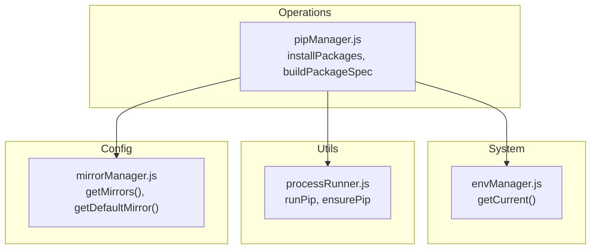
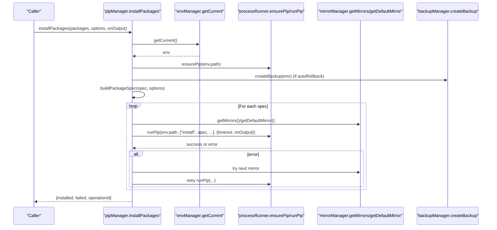
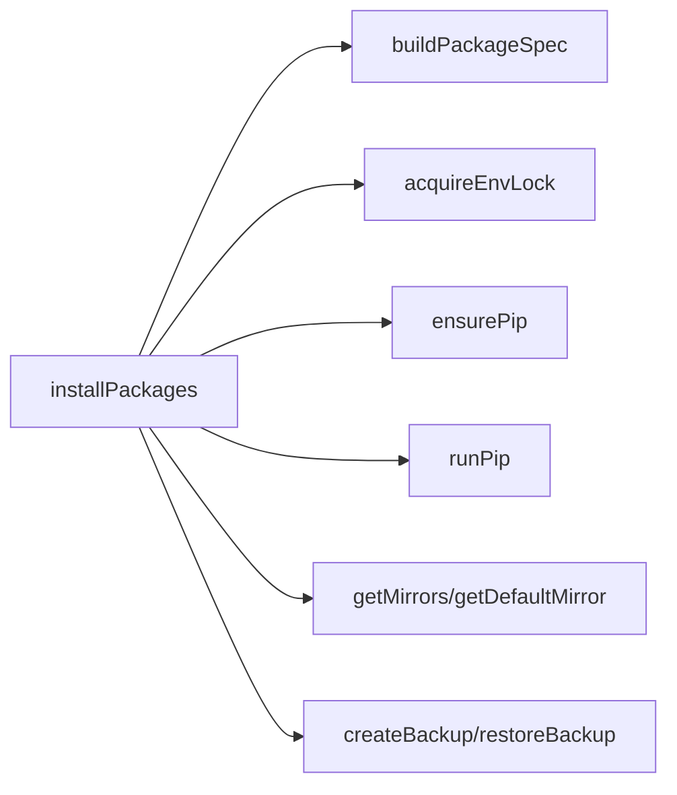

# Basic Package Installation

<cite>
**Referenced Files in This Document**
- [pipManager.js](file://core/operations/pipManager.js)
- [processRunner.js](file://utils/processRunner.js)
- [envManager.js](file://core/system/envManager.js)
- [mirrorManager.js](file://core/config/mirrorManager.js)
</cite>

## Table of Contents
1. [Introduction](#introduction)
2. [Project Structure](#project-structure)
3. [Core Components](#core-components)
4. [Architecture Overview](#architecture-overview)
5. [Detailed Component Analysis](#detailed-component-analysis)
6. [Dependency Analysis](#dependency-analysis)
7. [Performance Considerations](#performance-considerations)
8. [Troubleshooting Guide](#troubleshooting-guide)
9. [Conclusion](#conclusion)

## Introduction
This document explains the basic package installation functionality in PyLibMaster, focusing on:
- The installPackages function for single and batch installations
- Version specification handling (latest, exact versions with == syntax, and version ranges)
- The buildPackageSpec function that validates package names and constructs pip install commands
- The environment locking mechanism preventing concurrent operations on the same Python environment
- Practical examples for installing packages by name, specifying exact versions, and using version ranges
- Error handling for invalid package names, network failures, and permission issues

## Project Structure
The package installation feature is implemented primarily in the pip manager module, which orchestrates environment selection, command execution, mirror fallbacks, and safety checks. Supporting modules provide process execution, environment detection, and mirror configuration.

**Diagram sources**
- [pipManager.js:513-596](file://core/operations/pipManager.js#L513-L596)
- [envManager.js:178-184](file://core/system/envManager.js#L178-L184)
- [processRunner.js:340-342](file://utils/processRunner.js#L340-L342)
- [mirrorManager.js:115-118](file://core/config/mirrorManager.js#L115-L118)

**Section sources**
- [pipManager.js:1-120](file://core/operations/pipManager.js#L1-L120)
- [processRunner.js:1-60](file://utils/processRunner.js#L1-L60)
- [envManager.js:1-40](file://core/system/envManager.js#L1-L40)
- [mirrorManager.js:1-40](file://core/config/mirrorManager.js#L1-L40)

## Core Components
- installPackages: Orchestrates single or batch package installation with optional parallelism, retries across mirrors, automatic rollback, and progress reporting.
- buildPackageSpec: Validates and normalizes package specifications, supporting latest, exact versions (==), and version ranges; also supports wheel file paths with strict security checks.
- Environment locking: Ensures only one operation runs per Python environment at a time to avoid conflicts.
- Process runner: Executes pip commands with timeouts, cancellation support, and output streaming.
- Mirror manager: Provides default and additional mirrors for resilient downloads.

**Section sources**
- [pipManager.js:513-596](file://core/operations/pipManager.js#L513-L596)
- [pipManager.js:154-235](file://core/operations/pipManager.js#L154-L235)
- [pipManager.js:72-85](file://core/operations/pipManager.js#L72-L85)
- [processRunner.js:340-342](file://utils/processRunner.js#L340-L342)
- [mirrorManager.js:115-118](file://core/config/mirrorManager.js#L115-L118)

## Architecture Overview
At a high level, installPackages coordinates environment validation, pip readiness, backup creation (optional), spec construction, and pip execution with mirror fallbacks. It enforces concurrency control via an environment lock and reports progress through callbacks.

**Diagram sources**
- [pipManager.js:513-596](file://core/operations/pipManager.js#L513-L596)
- [pipManager.js:608-633](file://core/operations/pipManager.js#L608-L633)
- [processRunner.js:340-342](file://utils/processRunner.js#L340-L342)
- [mirrorManager.js:115-118](file://core/config/mirrorManager.js#L115-L118)

## Detailed Component Analysis

### installPackages: Single and Batch Installation
- Accepts a list of package specs and options such as versionMode, parallel execution, retry behavior, and rollback.
- Acquires an environment lock to prevent concurrent operations on the same Python environment.
- Ensures pip is available before proceeding.
- Optionally creates a backup for automatic rollback on failure.
- Builds pip install specs via buildPackageSpec.
- Executes installation either sequentially or in parallel based on configuration.
- Reports progress via onOutput and returns results including installed and failed entries.

Key behaviors:
- Parallel mode uses a configurable thread count capped by the number of specs.
- Retry logic tries multiple mirrors even without explicit smart retry enabled.
- Automatic rollback restores from backup if enabled and an error occurs.

**Section sources**
- [pipManager.js:513-596](file://core/operations/pipManager.js#L513-L596)
- [pipManager.js:72-85](file://core/operations/pipManager.js#L72-L85)
- [processRunner.js:340-342](file://utils/processRunner.js#L340-L342)
- [mirrorManager.js:115-118](file://core/config/mirrorManager.js#L115-L118)

### buildPackageSpec: Validation and Command Construction
- Validates input type and length constraints.
- Supports prebuilt specs containing version operators; validates them against allowed patterns.
- Handles wheel file paths with strict security checks:
  - Rejects path traversal sequences
  - Disallows UNC paths
  - Requires absolute paths
  - Blocks sensitive directories and illegal characters
  - Validates wheel filename format
- For package names:
  - Enforces naming rules via regex
  - Supports specific versions (==) and ranges (>=, <, etc.)
- Returns a normalized spec suitable for pip install.

Error conditions:
- Invalid package name or too long
- Invalid version specifier or range
- Invalid wheel path (path traversal, UNC, non-absolute, sensitive directory, illegal characters, bad filename)

**Section sources**
- [pipManager.js:154-235](file://core/operations/pipManager.js#L154-L235)

### Environment Locking Mechanism
- Uses an in-memory map keyed by environment path to track active locks.
- acquireEnvLock waits for any existing lock to resolve, then sets a new promise-based lock.
- releaseLock removes the entry and resolves the promise, allowing subsequent operations.
- All installation/update/uninstall operations wrap their critical sections with this lock to ensure serial execution per environment.

Benefits:
- Prevents race conditions when multiple operations target the same Python environment
- Guarantees consistent state during pip operations

**Section sources**
- [pipManager.js:72-85](file://core/operations/pipManager.js#L72-L85)

### Pip Execution and Mirror Fallback
- runPip executes python -m pip with provided arguments.
- ensurePip verifies pip availability and installs it automatically if missing, using ensurepip or downloading get-pip.py.
- installOne attempts installation across multiple mirrors, logging warnings and continuing until success or exhaustion.
- Timeouts and cancellation are supported via processRunner utilities.

**Section sources**
- [processRunner.js:340-342](file://utils/processRunner.js#L340-L342)
- [processRunner.js:233-278](file://utils/processRunner.js#L233-L278)
- [pipManager.js:608-633](file://core/operations/pipManager.js#L608-L633)

### Practical Examples
- Install by name (latest):
  - Call installPackages with ["requests"], options.versionMode = "latest"
- Specify exact version:
  - Call installPackages with ["flask"], options.versionMode = "specific", options.version = "2.3.1"
  - Equivalent spec: flask==2.3.1
- Use version ranges:
  - Call installPackages with ["numpy"], options.versionMode = "range", options.version = ">=1.21,<2.0"
  - Equivalent spec: numpy>=1.21,<2.0
- Install from requirements.txt:
  - Call installFromFile with a .txt file path; internally uses pip install -r
- Install from wheel:
  - Call installFromFile with a .whl file path; internally uses pip install <wheel_path>

Note: These examples describe usage patterns and expected inputs; actual code invocation should follow the documented parameters and options.

[No sources needed since this section provides general guidance]

## Dependency Analysis
The core dependencies for package installation are:
- envManager.getCurrent(): Provides the selected Python environment
- processRunner.runPip/ensurePip: Executes pip commands and ensures pip availability
- mirrorManager.getMirrors/getDefaultMirror(): Supplies mirror URLs for resilient downloads
- backupManager (via pipManager): Creates/restores backups for rollback

**Diagram sources**
- [pipManager.js:513-596](file://core/operations/pipManager.js#L513-L596)
- [pipManager.js:608-633](file://core/operations/pipManager.js#L608-L633)
- [processRunner.js:340-342](file://utils/processRunner.js#L340-L342)
- [mirrorManager.js:115-118](file://core/config/mirrorManager.js#L115-L118)

**Section sources**
- [pipManager.js:513-596](file://core/operations/pipManager.js#L513-L596)
- [processRunner.js:340-342](file://utils/processRunner.js#L340-L342)
- [mirrorManager.js:115-118](file://core/config/mirrorManager.js#L115-L118)

## Performance Considerations
- Parallel installation reduces total time for large batches; concurrency is limited by config.parallelThreads.
- Mirror fallback improves reliability but adds latency; use fewer mirrors if speed is critical.
- Ensure pip is cached to avoid repeated checks; ensurePip caches readiness status.
- Avoid excessive rollback operations; they involve backup creation and restoration overhead.

[No sources needed since this section provides general guidance]

## Troubleshooting Guide
Common errors and resolutions:
- Invalid package name:
  - Cause: Name does not match allowed pattern or exceeds maximum length
  - Resolution: Correct the package name to include only allowed characters and ensure it starts with a letter or digit
- Invalid version specifier:
  - Cause: Version string contains disallowed characters or exceeds maximum length
  - Resolution: Use valid operators (==, >=, <, etc.) and proper version formats
- Network failures:
  - Cause: Mirrors unreachable or timeout
  - Resolution: Try alternative mirrors; ensure internet connectivity; increase timeout if necessary
- Permission issues:
  - Cause: Insufficient privileges to write to site-packages
  - Resolution: Run with appropriate permissions or use a user-scoped environment
- Wheel path errors:
  - Cause: Path traversal, UNC paths, non-absolute paths, sensitive directories, or illegal characters
  - Resolution: Provide a safe absolute path to a local .whl file with a valid filename

Operational tips:
- Enable rollback to automatically restore environment state on failure
- Monitor onOutput logs for detailed progress and error messages
- Verify pip availability using ensurePip diagnostics

**Section sources**
- [pipManager.js:154-235](file://core/operations/pipManager.js#L154-L235)
- [pipManager.js:608-633](file://core/operations/pipManager.js#L608-L633)
- [processRunner.js:233-278](file://utils/processRunner.js#L233-L278)

## Conclusion
PyLibMaster’s package installation system provides robust, secure, and resilient mechanisms for installing packages in Python environments. The installPackages function supports both single and batch operations with flexible version specifications, while buildPackageSpec ensures safe and correct pip command construction. The environment locking mechanism prevents concurrent conflicts, and mirror fallback enhances reliability. With comprehensive error handling and rollback capabilities, users can confidently manage package installations across diverse scenarios.

[No sources needed since this section summarizes without analyzing specific files]