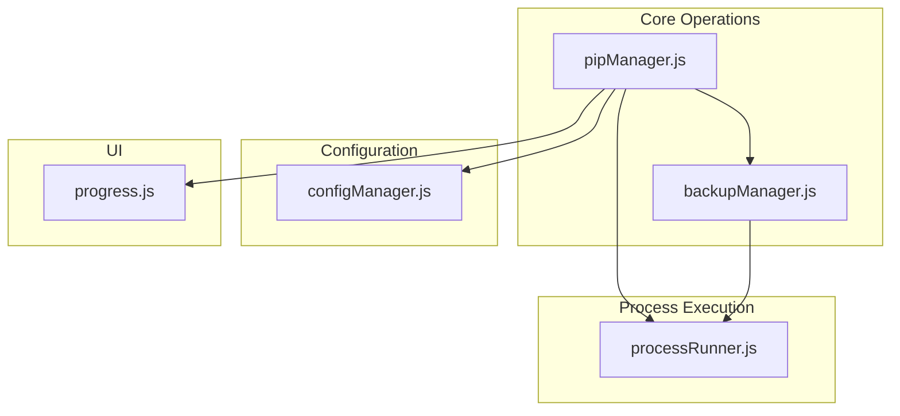
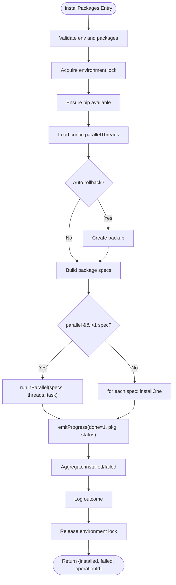
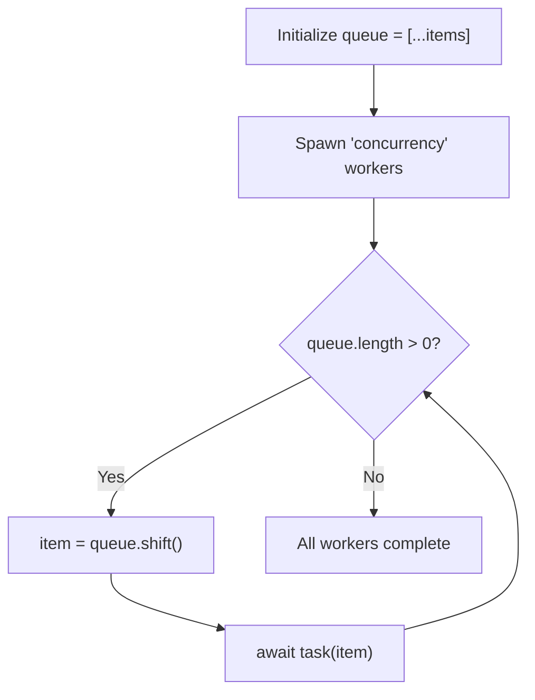
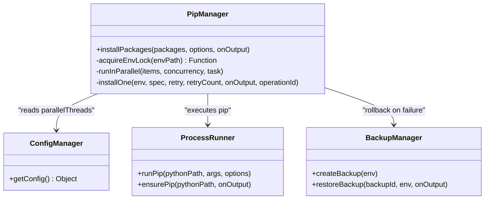
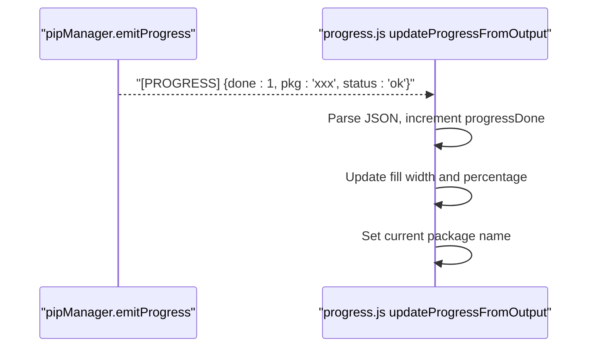
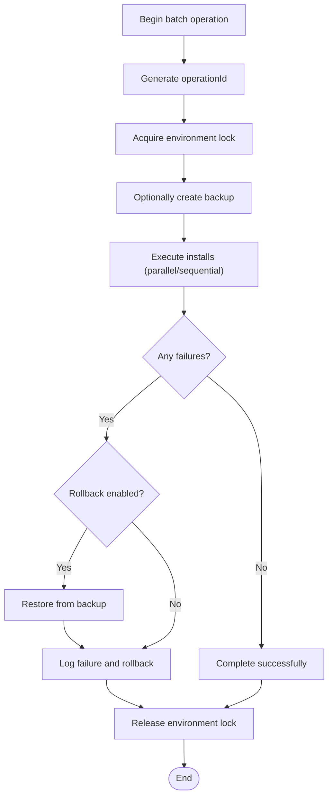
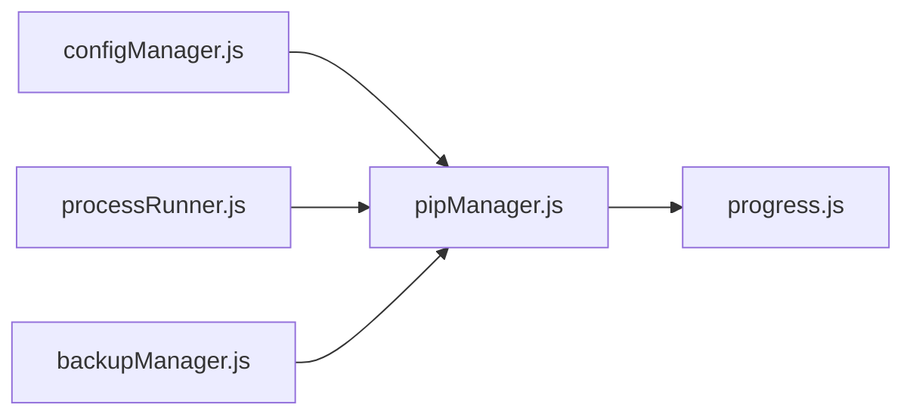

# Batch and Parallel Installation

<cite>
**Referenced Files in This Document**
- [pipManager.js](file://core/operations/pipManager.js)
- [configManager.js](file://core/config/configManager.js)
- [processRunner.js](file://utils/processRunner.js)
- [backupManager.js](file://core/operations/backupManager.js)
- [progress.js](file://renderer/js/progress.js)
</cite>

## Table of Contents
1. [Introduction](#introduction)
2. [Project Structure](#project-structure)
3. [Core Components](#core-components)
4. [Architecture Overview](#architecture-overview)
5. [Detailed Component Analysis](#detailed-component-analysis)
6. [Dependency Analysis](#dependency-analysis)
7. [Performance Considerations](#performance-considerations)
8. [Troubleshooting Guide](#troubleshooting-guide)
9. [Conclusion](#conclusion)

## Introduction
This document explains the batch and parallel package installation features implemented in the project. It focuses on how installPackages handles multiple packages concurrently, how runInParallel controls thread concurrency, how progress is tracked via structured events, and how operation context (including rollback and environment locks) ensures reliability during batch operations. It also provides practical guidance for optimizing performance with large package sets and monitoring progress through structured events.

## Project Structure
The batch and parallel installation logic spans several modules:
- Core orchestration and concurrency are implemented in pipManager.js.
- Configuration for parallel threads and retry counts is managed by configManager.js.
- Process execution, timeouts, cancellation, and pip availability are handled by processRunner.js.
- Backup and rollback capabilities are provided by backupManager.js.
- UI progress rendering and structured event parsing live in renderer/js/progress.js.



**Diagram sources**
- [pipManager.js:513-596](file://core/operations/pipManager.js#L513-L596)
- [configManager.js:90-99](file://core/config/configManager.js#L90-L99)
- [processRunner.js:340-342](file://utils/processRunner.js#L340-L342)
- [backupManager.js:89-113](file://core/operations/backupManager.js#L89-L113)
- [progress.js:101-119](file://renderer/js/progress.js#L101-L119)

**Section sources**
- [pipManager.js:513-596](file://core/operations/pipManager.js#L513-L596)
- [configManager.js:90-99](file://core/config/configManager.js#L90-L99)
- [processRunner.js:340-342](file://utils/processRunner.js#L340-L342)
- [backupManager.js:89-113](file://core/operations/backupManager.js#L89-L113)
- [progress.js:101-119](file://renderer/js/progress.js#L101-L119)

## Core Components
- installPackages: Orchestrates batch installation with optional parallelism, mirror retries, automatic rollback, and structured progress events.
- runInParallel: A lightweight worker pool that limits concurrent tasks to a configured number of threads.
- acquireEnvLock: Ensures only one operation runs per Python environment at a time to avoid conflicts.
- emitProgress: Emits structured progress events consumed by the UI for reliable counting and status updates.
- installOne: Executes a single package installation with multi-mirror fallback and configurable retries.
- ensurePip/runPip: Guarantees pip availability and executes pip commands with timeout and cancellation support.
- backupManager: Creates and restores backups for safe rollback when failures occur.

Key behaviors:
- Concurrency is controlled by config.parallelThreads; if not set, a default value is used.
- Progress events use a standardized format for accurate done/total tracking.
- Environment-level locking prevents race conditions across operations targeting the same environment.
- Automatic rollback restores the environment state upon failure when enabled.

**Section sources**
- [pipManager.js:513-596](file://core/operations/pipManager.js#L513-L596)
- [pipManager.js:930-942](file://core/operations/pipManager.js#L930-L942)
- [pipManager.js:72-85](file://core/operations/pipManager.js#L72-L85)
- [pipManager.js:61-63](file://core/operations/pipManager.js#L61-L63)
- [pipManager.js:608-633](file://core/operations/pipManager.js#L608-L633)
- [processRunner.js:233-278](file://utils/processRunner.js#L233-L278)
- [processRunner.js:340-342](file://utils/processRunner.js#L340-L342)
- [backupManager.js:89-113](file://core/operations/backupManager.js#L89-L113)

## Architecture Overview
The batch installation flow integrates configuration, concurrency control, process execution, and progress reporting.

```mermaid
sequenceDiagram
participant Caller as "Caller"
participant PM as "pipManager.installPackages"
participant CM as "configManager.getConfig"
participant BM as "backupManager.createBackup"
participant RP as "runInParallel"
participant IO as "installOne"
participant PR as "processRunner.runPip"
participant UI as "progress.js updateProgressFromOutput"
Caller->>PM : installPackages(packages, options, onOutput)
PM->>CM : getConfig()
alt autoRollback enabled
PM->>BM : createBackup(env)
BM-->>PM : {id, path}
end
opt parallel mode
PM->>RP : runInParallel(specs, threads, task)
loop up to threads
RP->>IO : task(spec)
IO->>PR : runPip(args, {onOutput, operationId})
PR-->>IO : success or error
IO-->>PM : result
PM->>UI : emitProgress(done=1, pkg, status)
end
else sequential mode
PM->>IO : installOne(spec)
IO->>PR : runPip(...)
PR-->>IO : success or error
IO-->>PM : result
PM->>UI : emitProgress(...)
end
PM-->>Caller : {installed, failed, operationId}
```

**Diagram sources**
- [pipManager.js:513-596](file://core/operations/pipManager.js#L513-L596)
- [pipManager.js:930-942](file://core/operations/pipManager.js#L930-L942)
- [pipManager.js:608-633](file://core/operations/pipManager.js#L608-L633)
- [processRunner.js:340-342](file://utils/processRunner.js#L340-L342)
- [progress.js:101-119](file://renderer/js/progress.js#L101-L119)

## Detailed Component Analysis

### installPackages: Batch Orchestration and Parallel Control
- Validates environment and input, generates an operationId, and acquires an environment lock to serialize operations per environment.
- Optionally creates a backup before starting to enable rollback on failure.
- Builds package specs using buildPackageSpec for versioning modes.
- If parallel mode is enabled and there are multiple specs, it computes threads as min(config.parallelThreads, specs.length) and delegates to runInParallel.
- For each spec, installOne is invoked; on success, the package name is recorded and a structured progress event is emitted; on failure, details are captured and, if rollback is enabled, the environment is restored from the backup.
- Logs outcomes and returns aggregated results including installed, failed, and operationId.



**Diagram sources**
- [pipManager.js:513-596](file://core/operations/pipManager.js#L513-L596)
- [pipManager.js:930-942](file://core/operations/pipManager.js#L930-L942)
- [pipManager.js:608-633](file://core/operations/pipManager.js#L608-L633)

**Section sources**
- [pipManager.js:513-596](file://core/operations/pipManager.js#L513-L596)

### runInParallel: Worker Pool and Concurrency Management
- Initializes a queue from items and spawns a fixed number of workers equal to concurrency.
- Each worker repeatedly pulls items from the queue until empty, awaiting the asynchronous task for each item.
- All workers run concurrently via Promise.all, ensuring no more than concurrency tasks execute simultaneously.
- This design avoids overloading the system while maximizing throughput within the configured limit.



**Diagram sources**
- [pipManager.js:930-942](file://core/operations/pipManager.js#L930-L942)

**Section sources**
- [pipManager.js:930-942](file://core/operations/pipManager.js#L930-L942)

### Thread Management Strategy: Limits and Safety
- Threads are derived from config.parallelThreads, capped by the number of specs to prevent unnecessary workers.
- Environment-level mutex (acquireEnvLock) ensures only one operation per environment runs at a time, preventing file system and pip metadata conflicts.
- The worker pool approach balances throughput with resource safety, avoiding excessive CPU or I/O contention.



**Diagram sources**
- [pipManager.js:513-596](file://core/operations/pipManager.js#L513-L596)
- [pipManager.js:930-942](file://core/operations/pipManager.js#L930-L942)
- [configManager.js:90-99](file://core/config/configManager.js#L90-L99)
- [processRunner.js:233-278](file://utils/processRunner.js#L233-L278)
- [backupManager.js:89-113](file://core/operations/backupManager.js#L89-L113)

**Section sources**
- [pipManager.js:72-85](file://core/operations/pipManager.js#L72-L85)
- [configManager.js:90-99](file://core/config/configManager.js#L90-L99)

### Progress Tracking: Structured Events and UI Integration
- emitProgress sends a structured message prefixed with a marker containing JSON payload with done, pkg, and status fields.
- The UI parses these messages to increment counters, update percentages, and display the current package name.
- Fallback parsing extracts package names from pip output lines for operations without structured events.



**Diagram sources**
- [pipManager.js:61-63](file://core/operations/pipManager.js#L61-L63)
- [progress.js:101-119](file://renderer/js/progress.js#L101-L119)

**Section sources**
- [pipManager.js:61-63](file://core/operations/pipManager.js#L61-L63)
- [progress.js:101-119](file://renderer/js/progress.js#L101-L119)

### Operation Context Management: Status Tracking and Rollback
- Each batch operation receives an operationId used to correlate subprocesses and enable cancellation across all related processes.
- Environment locks ensure exclusive access per environment, preventing concurrent modifications.
- On failure, if rollback is enabled, the backup created prior to installation is restored to revert changes.
- Logging captures detailed outcomes, including which packages failed and whether rollback occurred.



**Diagram sources**
- [pipManager.js:513-596](file://core/operations/pipManager.js#L513-L596)
- [backupManager.js:156-170](file://core/operations/backupManager.js#L156-L170)

**Section sources**
- [pipManager.js:513-596](file://core/operations/pipManager.js#L513-L596)
- [backupManager.js:156-170](file://core/operations/backupManager.js#L156-L170)

### Example Workflows
- Batch install with parallel threads:
  - Call installPackages with a list of package specs, options.parallel=true, and onOutput handler.
  - Threads are computed from config.parallelThreads and limited by the number of specs.
  - Each package installation emits structured progress events; failures are isolated and logged.
- Batch install from requirements.txt:
  - Use installFromFile with a .txt file; supports retry and rollback similar to batch install.
- Batch uninstall:
  - Uses uninstallPackages with optional backup and rollback; progress inferred from pip output.

[No sources needed since this section summarizes workflows conceptually]

## Dependency Analysis
- pipManager depends on configManager for parallelThreads and retryCount.
- pipManager uses processRunner for pip execution, timeouts, and cancellation.
- pipManager integrates backupManager for rollback scenarios.
- UI progress.js consumes structured events emitted by pipManager.



**Diagram sources**
- [pipManager.js:513-596](file://core/operations/pipManager.js#L513-L596)
- [configManager.js:90-99](file://core/config/configManager.js#L90-L99)
- [processRunner.js:340-342](file://utils/processRunner.js#L340-L342)
- [backupManager.js:89-113](file://core/operations/backupManager.js#L89-L113)
- [progress.js:101-119](file://renderer/js/progress.js#L101-L119)

**Section sources**
- [pipManager.js:513-596](file://core/operations/pipManager.js#L513-L596)
- [configManager.js:90-99](file://core/config/configManager.js#L90-L99)
- [processRunner.js:340-342](file://utils/processRunner.js#L340-L342)
- [backupManager.js:89-113](file://core/operations/backupManager.js#L89-L113)
- [progress.js:101-119](file://renderer/js/progress.js#L101-L119)

## Performance Considerations
- Tune config.parallelThreads to balance throughput and system load; defaults provide a reasonable baseline.
- Prefer parallel mode for large package sets; sequential mode may be safer for constrained environments.
- Multi-mirror fallback reduces network bottlenecks and improves resilience.
- Avoid excessive concurrency that could saturate disk I/O or cause pip metadata conflicts; environment locks mitigate the latter.
- Use structured progress events to monitor real-time completion and identify slow or failing packages quickly.

[No sources needed since this section provides general guidance]

## Troubleshooting Guide
- No Python environment selected: Ensure a valid environment is set before invoking installPackages.
- pip not available: ensurePip will attempt automatic installation; verify network access and permissions.
- Timeouts: Increase timeout values in runPip calls if installations are expected to take longer.
- Cancellation: Use cancelOperation with the operationId to terminate all related subprocesses.
- Rollback issues: Confirm backup files exist and are readable; validate backup IDs to avoid path traversal errors.
- Progress not updating: Verify structured events are being emitted and parsed; check for malformed messages.

**Section sources**
- [processRunner.js:233-278](file://utils/processRunner.js#L233-L278)
- [processRunner.js:181-191](file://utils/processRunner.js#L181-L191)
- [backupManager.js:62-78](file://core/operations/backupManager.js#L62-L78)
- [progress.js:101-119](file://renderer/js/progress.js#L101-L119)

## Conclusion
The batch and parallel installation system combines robust concurrency control, resilient process execution, and reliable progress tracking. By leveraging config.parallelThreads, environment locks, multi-mirror retries, and automatic rollback, it delivers efficient and safe package management for large sets. Structured progress events enable precise UI updates and operational visibility, while clear troubleshooting paths help maintain stability under diverse conditions.