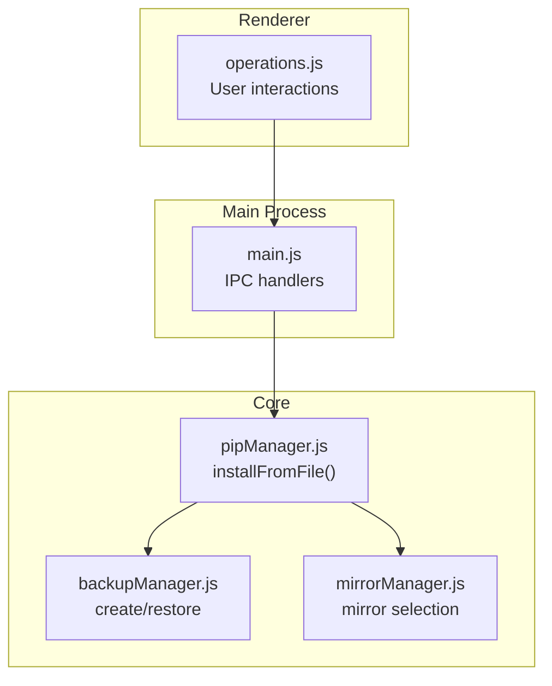
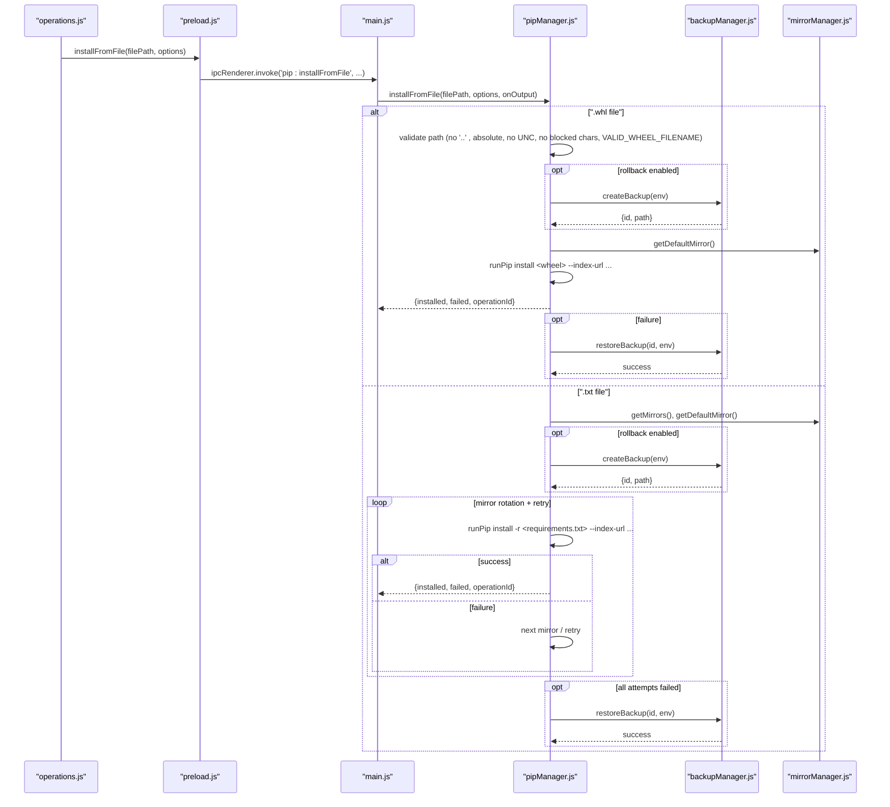
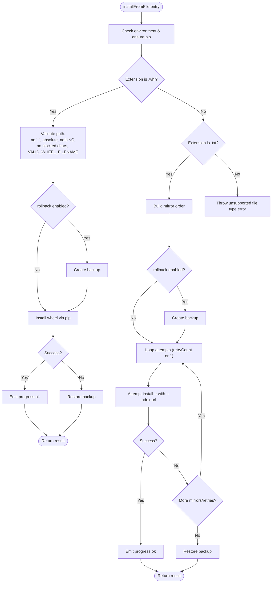
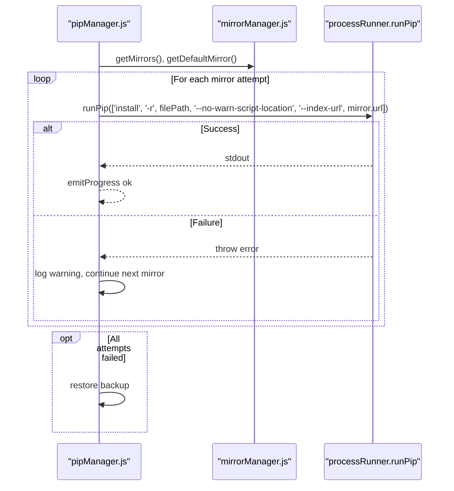
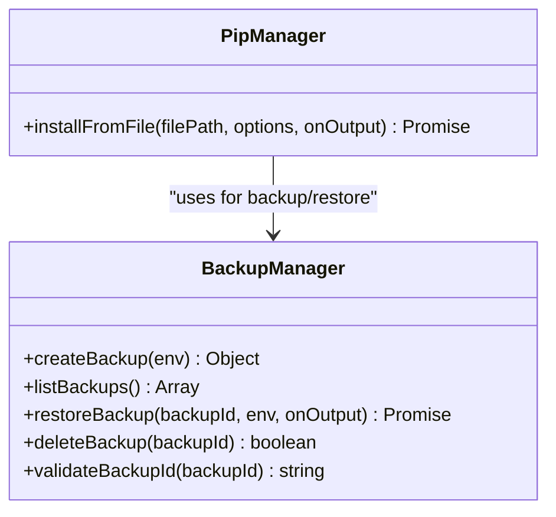
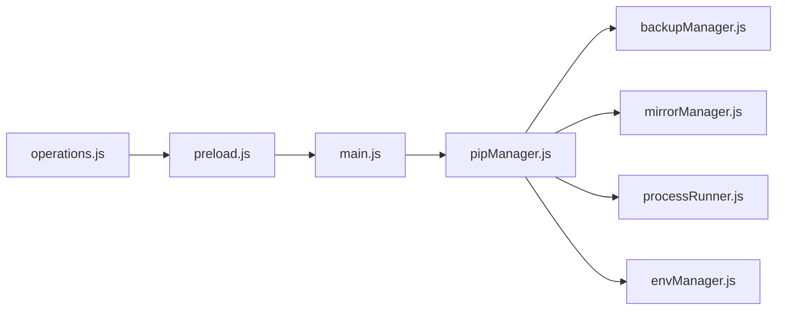

# File-Based Installation (.whl and requirements.txt)

<cite>
**Referenced Files in This Document**
- [pipManager.js](file://core/operations/pipManager.js)
- [backupManager.js](file://core/operations/backupManager.js)
- [mirrorManager.js](file://core/config/mirrorManager.js)
- [main.js](file://main.js)
- [preload.js](file://preload.js)
- [operations.js](file://renderer/js/operations.js)
</cite>

## Table of Contents
1. [Introduction](#introduction)
2. [Project Structure](#project-structure)
3. [Core Components](#core-components)
4. [Architecture Overview](#architecture-overview)
5. [Detailed Component Analysis](#detailed-component-analysis)
6. [Dependency Analysis](#dependency-analysis)
7. [Performance Considerations](#performance-considerations)
8. [Troubleshooting Guide](#troubleshooting-guide)
9. [Conclusion](#conclusion)

## Introduction
This document explains the file-based package installation feature that supports installing from local .whl wheel files and batch installation from requirements.txt files. It focuses on the installFromFile function, its security validations for wheel paths, mirror source rotation and retry mechanisms for requirements.txt processing, dependency resolution behavior, and automatic backup and rollback to protect against installation failures.

## Project Structure
The file-based installation spans multiple layers:
- Renderer UI triggers installation via IPC calls
- Main process exposes IPC handlers
- Core pip manager implements installFromFile with security checks and orchestration
- Backup manager provides create/restore capabilities
- Mirror manager manages PyPI mirrors and selection logic

**Diagram sources**
- [operations.js:270-293](file://renderer/js/operations.js#L270-L293)
- [main.js:317-322](file://main.js#L317-L322)
- [pipManager.js:645-730](file://core/operations/pipManager.js#L645-L730)
- [backupManager.js:89-113](file://core/operations/backupManager.js#L89-L113)
- [mirrorManager.js:109-118](file://core/config/mirrorManager.js#L109-L118)

**Section sources**
- [operations.js:270-293](file://renderer/js/operations.js#L270-L293)
- [main.js:317-322](file://main.js#L317-L322)
- [pipManager.js:645-730](file://core/operations/pipManager.js#L645-L730)

## Core Components
- installFromFile (pipManager.js): Entry point for file-based installation supporting .whl and .txt. Implements environment locking, optional backup creation, mirror configuration, and progress emission.
- buildPackageSpec (pipManager.js): Validates and builds safe package specs; enforces path traversal prevention, UNC blocking, and filename validation for .whl files.
- backupManager (backupManager.js): Creates backups using pip freeze and restores environments with force-reinstall and no-deps.
- mirrorManager (mirrorManager.js): Provides default and additional mirrors, enabling rotation and retry strategies during installation.

Key responsibilities:
- Security: Path traversal prevention, UNC path blocking, filename validation, sensitive directory checks, blocked characters.
- Reliability: Environment-level locks, retries across mirrors, automatic rollback on failure.
- Observability: Structured progress events and logging.

**Section sources**
- [pipManager.js:134-235](file://core/operations/pipManager.js#L134-L235)
- [pipManager.js:645-730](file://core/operations/pipManager.js#L645-L730)
- [backupManager.js:89-113](file://core/operations/backupManager.js#L89-L113)
- [mirrorManager.js:109-118](file://core/config/mirrorManager.js#L109-L118)

## Architecture Overview
The installFromFile flow integrates renderer UI, IPC, core logic, backup, and mirror management.

**Diagram sources**
- [operations.js:270-293](file://renderer/js/operations.js#L270-L293)
- [preload.js:60](file://preload.js#L60)
- [main.js:317-322](file://main.js#L317-L322)
- [pipManager.js:645-730](file://core/operations/pipManager.js#L645-L730)
- [backupManager.js:89-113](file://core/operations/backupManager.js#L89-L113)
- [mirrorManager.js:109-118](file://core/config/mirrorManager.js#L109-L118)

## Detailed Component Analysis

### installFromFile Function
- Accepts filePath and options (retry, rollback, operationId).
- Ensures a Python environment is selected and pip is ready.
- Branches by file extension:
  - .whl: validates path, creates backup if rollback enabled, installs via pip with index-url, emits progress, logs result, rolls back on failure.
  - .txt: reads requirements.txt via pip install -r, rotates through mirrors based on config retryCount, emits progress, logs result, rolls back on failure.
- Uses environment-level lock to prevent concurrent operations on the same environment.

Security validations for .whl:
- Rejects inputs containing '..' to prevent path traversal.
- Normalizes path and rejects UNC paths (starting with \\ or //).
- Requires absolute paths.
- Blocks sensitive directories (/windows/, /dev/, /proc/, /sys/).
- Rejects blocked characters (e.g., shell metacharacters).
- Validates filename against VALID_WHEEL_FILENAME regex.

Batch processing for requirements.txt:
- Builds mirror order starting with default mirror followed by others.
- Iterates up to min(retryCount, mirrorCount) attempts.
- Each attempt sets --index-url to the current mirror unless it is the official PyPI URL.
- Emits structured progress events and logs outcomes.

Backup and rollback:
- If rollback is not explicitly disabled, a backup is created before installation.
- On failure, the system restores the environment using the backup ID.

**Diagram sources**
- [pipManager.js:645-730](file://core/operations/pipManager.js#L645-L730)

**Section sources**
- [pipManager.js:645-730](file://core/operations/pipManager.js#L645-L730)

### Security Validation for .whl Files
- Path traversal prevention: Rejects any input containing '..'.
- UNC path blocking: Rejects normalized paths starting with '\\\\' or '//'.
- Absolute path requirement: Must be an absolute path after normalization.
- Sensitive directory protection: Blocks paths including '/windows/', '/dev/', '/proc/', '/sys/'.
- Blocked characters: Rejects shell injection characters like ;, &, |, `, $, <, >, ", ', newline, carriage return, null.
- Filename validation: Uses VALID_WHEEL_FILENAME regex to ensure proper naming pattern.

These checks are enforced within the package spec builder used when handling .whl inputs.

**Section sources**
- [pipManager.js:134-206](file://core/operations/pipManager.js#L134-L206)

### Batch Processing Logic for requirements.txt
- Mirror rotation: Uses default mirror first, then other configured mirrors.
- Retry mechanism: Number of attempts is determined by config retryCount or defaults to at least 2 attempts.
- Progress and logging: Emits structured progress events and logs each attempt outcome.
- Dependency resolution: Delegates to pip’s resolver when running install -r, which resolves dependencies according to version specifications present in the file.

**Diagram sources**
- [pipManager.js:683-727](file://core/operations/pipManager.js#L683-L727)
- [mirrorManager.js:109-118](file://core/config/mirrorManager.js#L109-L118)

**Section sources**
- [pipManager.js:683-727](file://core/operations/pipManager.js#L683-L727)

### Backup and Rollback Mechanisms
- Backup creation: Captures current environment state via pip freeze and writes to a timestamped file under storage/backups/.
- Backup ID validation: Enforces format and prevents path traversal attacks.
- Restore process: Reinstalls packages from the backup using pip install -r with --force-reinstall and --no-deps to avoid reinstalling dependencies unnecessarily.
- Automatic rollback: When rollback is enabled, installFromFile creates a backup before attempting installation and restores it upon failure.

**Diagram sources**
- [backupManager.js:89-113](file://core/operations/backupManager.js#L89-L113)
- [backupManager.js:156-170](file://core/operations/backupManager.js#L156-L170)
- [pipManager.js:645-730](file://core/operations/pipManager.js#L645-L730)

**Section sources**
- [backupManager.js:89-113](file://core/operations/backupManager.js#L89-L113)
- [backupManager.js:156-170](file://core/operations/backupManager.js#L156-L170)
- [pipManager.js:645-730](file://core/operations/pipManager.js#L645-L730)

### Usage Examples and Behavior

- Installing from a local wheel file:
  - Provide an absolute path to a valid .whl file.
  - The system validates the path and filename, creates a backup if rollback is enabled, and installs via pip with the configured mirror.
  - Progress events indicate success or failure; rollback occurs automatically on failure.

- Bulk installation from requirements.txt:
  - Provide a path to a requirements.txt file containing package names and optional version specifications (e.g., numpy==1.26.0, flask>=2.0,<3.0).
  - The system rotates through mirrors and retries up to the configured count.
  - Dependency resolution is handled by pip’s resolver; ensure compatible versions are specified.

- Handling dependency resolution:
  - For .whl files, pip installs the provided wheel and resolves dependencies as needed.
  - For requirements.txt, pip processes entries sequentially and resolves dependencies per specification. Conflicts should be resolved by adjusting version constraints in the file.

**Section sources**
- [pipManager.js:645-730](file://core/operations/pipManager.js#L645-L730)
- [pipManager.js:1098-1118](file://core/operations/pipManager.js#L1098-L1118)

## Dependency Analysis
- pipManager depends on:
  - backupManager for creating and restoring backups.
  - mirrorManager for selecting and rotating mirrors.
  - processRunner for executing pip commands and ensuring pip availability.
  - envManager for retrieving the current Python environment.
- main.js exposes IPC handlers that forward requests to pipManager.installFromFile.
- preload.js bridges renderer API calls to IPC channels.
- operations.js orchestrates user interactions and invokes the API with appropriate options (retry, rollback, operationId).

**Diagram sources**
- [operations.js:270-293](file://renderer/js/operations.js#L270-L293)
- [preload.js:60](file://preload.js#L60)
- [main.js:317-322](file://main.js#L317-L322)
- [pipManager.js:645-730](file://core/operations/pipManager.js#L645-L730)

**Section sources**
- [operations.js:270-293](file://renderer/js/operations.js#L270-L293)
- [preload.js:60](file://preload.js#L60)
- [main.js:317-322](file://main.js#L317-L322)
- [pipManager.js:645-730](file://core/operations/pipManager.js#L645-L730)

## Performance Considerations
- Environment locking ensures serial execution per environment, avoiding race conditions but potentially increasing wait times under heavy concurrency.
- Mirror rotation adds resilience but may increase total time if multiple mirrors fail; configure retryCount appropriately.
- Backup creation involves running pip freeze; this is lightweight but still incurs I/O overhead.
- Progress events are emitted per operation to keep UI responsive and informative.

[No sources needed since this section provides general guidance]

## Troubleshooting Guide
Common issues and resolutions:
- Invalid wheel path errors:
  - Ensure the path is absolute and does not contain '..'.
  - Avoid UNC paths and sensitive directories.
  - Confirm the filename matches the expected pattern.
- Unsupported file type:
  - Only .whl and .txt extensions are supported.
- Installation failures:
  - Check mirror connectivity and adjust retryCount.
  - Review pip output for dependency conflicts; adjust version specifications in requirements.txt.
- Rollback behavior:
  - If rollback is enabled, failures will automatically restore the previous environment state. Verify backup files exist in the storage/backups directory.

**Section sources**
- [pipManager.js:134-206](file://core/operations/pipManager.js#L134-L206)
- [pipManager.js:645-730](file://core/operations/pipManager.js#L645-L730)
- [backupManager.js:89-113](file://core/operations/backupManager.js#L89-L113)

## Conclusion
The file-based installation feature provides secure and resilient mechanisms for installing packages from local .whl files and bulk installations from requirements.txt. It enforces strict security validations, leverages mirror rotation and retries, and includes automatic backup and rollback to safeguard against failures. By understanding these components and their interactions, users can confidently manage Python package installations with robust safety and reliability.

[No sources needed since this section summarizes without analyzing specific files]