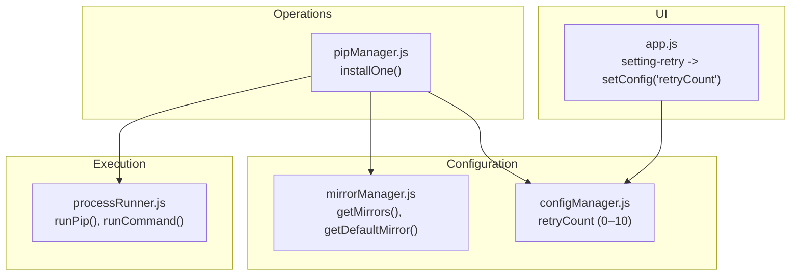
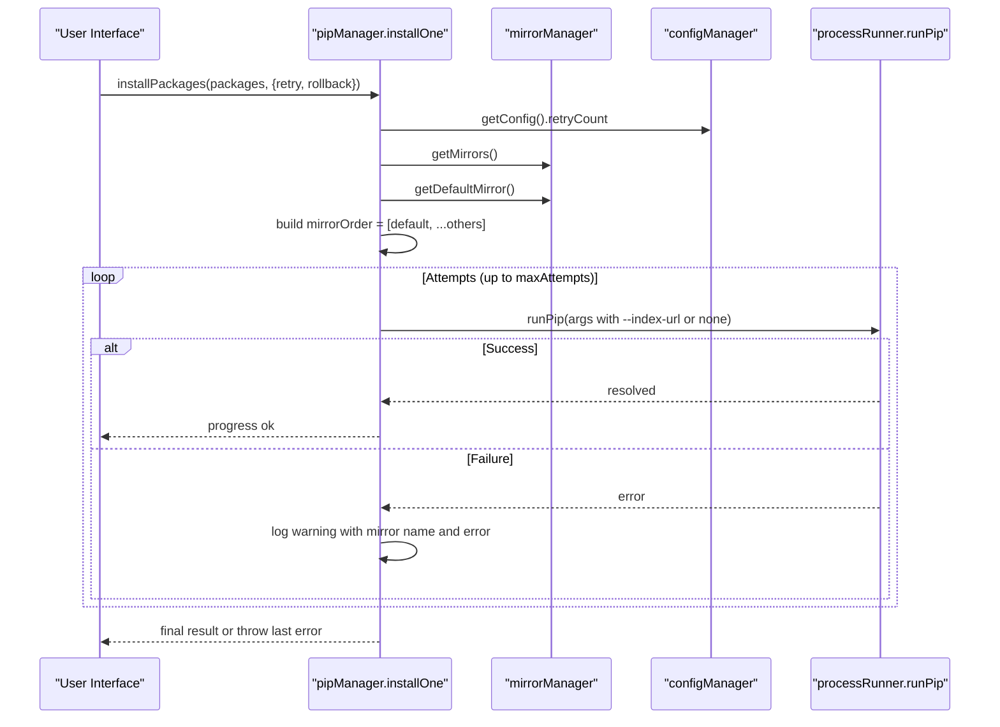
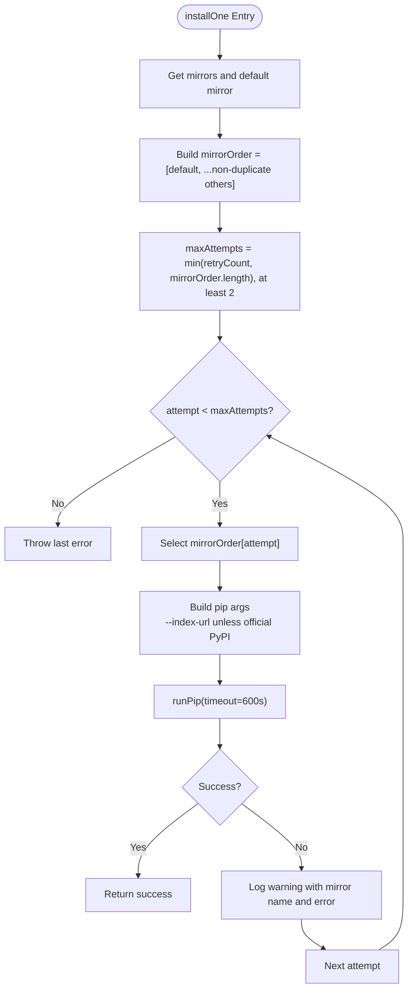
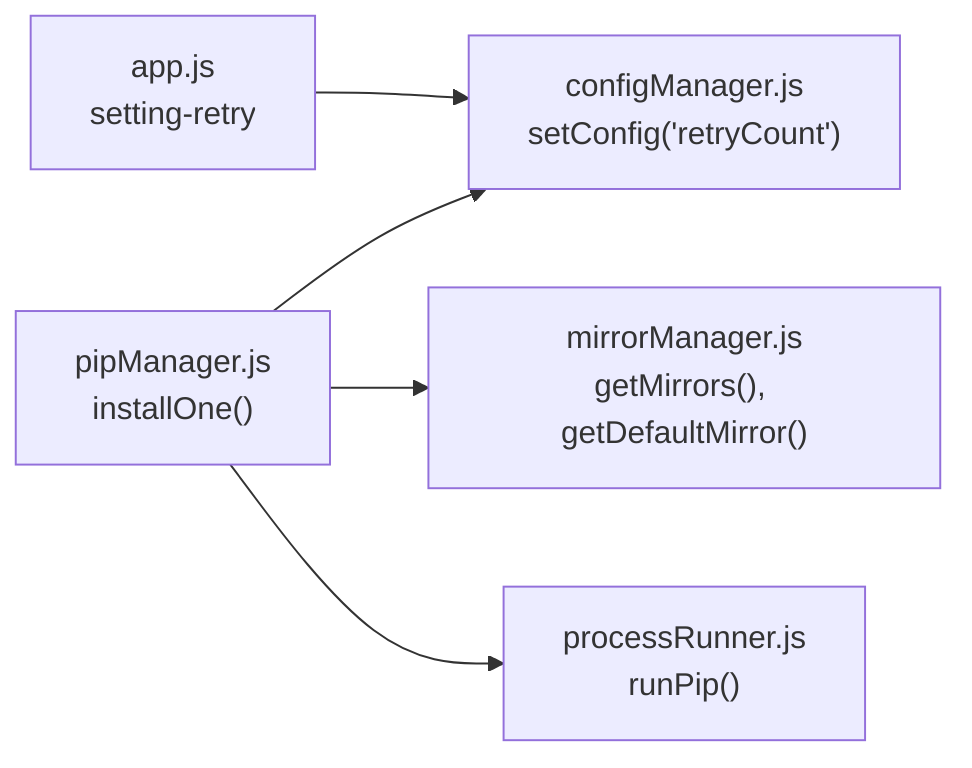

# Mirror Source Rotation and Retry System

<cite>
**Referenced Files in This Document**
- [pipManager.js](file://core/operations/pipManager.js)
- [mirrorManager.js](file://core/config/mirrorManager.js)
- [configManager.js](file://core/config/configManager.js)
- [processRunner.js](file://utils/processRunner.js)
- [app.js](file://renderer/js/app.js)
</cite>

## Table of Contents
1. [Introduction](#introduction)
2. [Project Structure](#project-structure)
3. [Core Components](#core-components)
4. [Architecture Overview](#architecture-overview)
5. [Detailed Component Analysis](#detailed-component-analysis)
6. [Dependency Analysis](#dependency-analysis)
7. [Performance Considerations](#performance-considerations)
8. [Troubleshooting Guide](#troubleshooting-guide)
9. [Conclusion](#conclusion)

## Introduction
This document explains the intelligent mirror source rotation and retry system used during package installation. It focuses on how the installOne function automatically switches mirrors when downloads fail, starting with the default mirror and rotating through configured mirrors. It also details the mirrorOrder array construction that prioritizes the default mirror while avoiding duplicates, the retry logic using configurable retry counts and timeouts, error handling to diagnose failures, and practical configuration examples for users.

## Project Structure
The mirror rotation and retry behavior spans several modules:
- pipManager.js implements the installOne function and orchestrates retries across mirrors.
- mirrorManager.js manages built-in and custom mirrors, defaults, and helper utilities.
- configManager.js provides the retryCount configuration with validation and defaults.
- processRunner.js executes pip commands with robust timeout and cancellation support.
- app.js binds UI controls to update retryCount settings.

**Diagram sources**
- [pipManager.js:608-633](file://core/operations/pipManager.js#L608-L633)
- [mirrorManager.js:110-118](file://core/config/mirrorManager.js#L110-L118)
- [configManager.js:22-29](file://core/config/configManager.js#L22-L29)
- [processRunner.js:340-342](file://utils/processRunner.js#L340-L342)
- [app.js:78](file://renderer/js/app.js#L78)

**Section sources**
- [pipManager.js:608-633](file://core/operations/pipManager.js#L608-L633)
- [mirrorManager.js:110-118](file://core/config/mirrorManager.js#L110-L118)
- [configManager.js:22-29](file://core/config/configManager.js#L22-L29)
- [processRunner.js:340-342](file://utils/processRunner.js#L340-L342)
- [app.js:78](file://renderer/js/app.js#L78)

## Core Components
- installOne(env, spec, retry, retryCount, onOutput, operationId): Implements per-package installation with automatic mirror rotation and retry.
- mirrorManager.getMirrors(): Returns all available mirrors (built-in + custom).
- mirrorManager.getDefaultMirror(): Returns the currently selected default mirror.
- configManager.getConfig().retryCount: Provides the maximum number of retry attempts (bounded 0–10).
- processRunner.runPip(): Executes pip with a long timeout and structured output streaming.

Key behaviors:
- mirrorOrder is constructed by placing the default mirror first and appending other mirrors without duplicating the default URL.
- The loop attempts up to maxAttempts mirrors; each attempt uses the corresponding mirror’s index-url unless it is the official PyPI mirror.
- Errors are captured and logged per mirror; the last error is thrown if all attempts fail.

**Section sources**
- [pipManager.js:608-633](file://core/operations/pipManager.js#L608-L633)
- [mirrorManager.js:110-118](file://core/config/mirrorManager.js#L110-L118)
- [configManager.js:22-29](file://core/config/configManager.js#L22-L29)
- [processRunner.js:340-342](file://utils/processRunner.js#L340-L342)

## Architecture Overview
The installation flow integrates configuration, mirror selection, and execution:

**Diagram sources**
- [pipManager.js:513-596](file://core/operations/pipManager.js#L513-L596)
- [pipManager.js:608-633](file://core/operations/pipManager.js#L608-L633)
- [mirrorManager.js:110-118](file://core/config/mirrorManager.js#L110-L118)
- [configManager.js:22-29](file://core/config/configManager.js#L22-L29)
- [processRunner.js:340-342](file://utils/processRunner.js#L340-L342)

## Detailed Component Analysis

### installOne Function: Automatic Mirror Rotation and Retry
- Mirror order construction:
  - Starts with the default mirror.
  - Appends remaining mirrors excluding any duplicate URL equal to the default mirror’s URL.
- Attempt strategy:
  - Computes maxAttempts as the minimum of retryCount and the number of available mirrors, with a floor of 2 attempts.
  - Iteratively tries each mirror in order, passing --index-url only when not using the official PyPI mirror.
- Output and logging:
  - Emits informational messages indicating which mirror is being used and the attempt number.
  - On failure, logs a warning including the mirror name and error message.
- Error handling:
  - Captures the last error encountered.
  - Throws the last error after exhausting all attempts.

**Diagram sources**
- [pipManager.js:608-633](file://core/operations/pipManager.js#L608-L633)

**Section sources**
- [pipManager.js:608-633](file://core/operations/pipManager.js#L608-L633)

### mirrorOrder Array Construction
- Prioritization:
  - The default mirror is always first.
- Deduplication:
  - Filters out any mirror whose URL equals the default mirror’s URL to avoid duplicates.
- Result:
  - A stable ordered list ensuring the most reliable or preferred mirror is tried first.

Practical implications:
- If the default mirror is unavailable or slow, subsequent mirrors are attempted automatically.
- Users can reorder mirrors via mirrorManager.reorderMirrors to influence priority beyond the default-first rule.

**Section sources**
- [pipManager.js:611](file://core/operations/pipManager.js#L611)
- [mirrorManager.js:110-118](file://core/config/mirrorManager.js#L110-L118)

### Retry Logic and Configuration
- Configurable retry count:
  - retryCount is read from configManager.getConfig().retryCount.
  - Valid range: 0–10; invalid values are sanitized to nearest valid value.
- Attempt cap:
  - maxAttempts ensures at least two attempts even if retryCount is low, bounded by the number of available mirrors.
- Behavior:
  - Each failed attempt triggers a warning with the mirror name and error message.
  - After exhausting attempts, the last error is thrown.

Examples of configuration:
- Set retryCount to 3 to allow up to three mirror attempts per package.
- Set retryCount to 0 to disable extra retries (still enforces a minimum of 2 attempts due to maxAttempts logic).

**Section sources**
- [pipManager.js:549-562](file://core/operations/pipManager.js#L549-L562)
- [pipManager.js:608-633](file://core/operations/pipManager.js#L608-L633)
- [configManager.js:22-29](file://core/config/configManager.js#L22-L29)

### Timeout Settings and Network Execution
- Per-install timeout:
  - runPip is called with a timeout of 600 seconds (10 minutes) for install operations.
- Process-level timeout handling:
  - processRunner.runCommand enforces timeouts with SIGTERM followed by SIGKILL after a delay.
- pip global timeout:
  - When writing pip configuration, a global timeout of 60 seconds is set in the pip config file.

Recommendations:
- For very large packages or slow networks, ensure the 600-second timeout is sufficient.
- Adjust network conditions or choose faster mirrors if frequent timeouts occur.

**Section sources**
- [pipManager.js:625](file://core/operations/pipManager.js#L625)
- [processRunner.js:150-159](file://utils/processRunner.js#L150-L159)
- [mirrorManager.js:313](file://core/config/mirrorManager.js#L313)

### Error Handling and Diagnostics
- Logging:
  - Each failed mirror attempt emits a warning including the mirror name and error message.
- Final error:
  - If all attempts fail, the last error is thrown, preserving context for diagnosis.
- User feedback:
  - Progress events indicate success or failure per package.
- Diagnostic tips:
  - Check warnings to identify which mirrors failed and why.
  - Use mirror speed tests to select faster mirrors.
  - Validate network connectivity and proxy settings.

**Section sources**
- [pipManager.js:624-632](file://core/operations/pipManager.js#L624-L632)
- [pipManager.js:61-63](file://core/operations/pipManager.js#L61-L63)

### Example Mirror Configuration
- Built-in mirrors include official PyPI and major providers.
- Custom mirrors can be added and validated for http/https URLs.
- Default mirror can be changed programmatically or via UI.

Steps:
- Add a custom mirror with a valid URL.
- Set it as default if desired.
- Reorder mirrors to prioritize specific ones.

**Section sources**
- [mirrorManager.js:22-29](file://core/config/mirrorManager.js#L22-L29)
- [mirrorManager.js:139-150](file://core/config/mirrorManager.js#L139-L150)
- [mirrorManager.js:125-130](file://core/config/mirrorManager.js#L125-L130)

### Understanding Retry Behavior
- Minimum attempts:
  - At least two attempts are made regardless of retryCount.
- Upper bound:
  - Attempts cannot exceed the number of available mirrors.
- Order:
  - Default mirror first, then others in current order.
- Outcome:
  - First successful attempt completes installation.
  - All failures result in a thrown error with the last error’s message.

**Section sources**
- [pipManager.js:615-632](file://core/operations/pipManager.js#L615-L632)

## Dependency Analysis
The retry and rotation logic depends on:
- mirrorManager for mirror lists and default selection.
- configManager for retryCount bounds and defaults.
- processRunner for executing pip with timeouts and structured output.
- UI layer for updating retryCount via settings.

**Diagram sources**
- [app.js:78](file://renderer/js/app.js#L78)
- [configManager.js:157-162](file://core/config/configManager.js#L157-L162)
- [pipManager.js:608-633](file://core/operations/pipManager.js#L608-L633)
- [mirrorManager.js:110-118](file://core/config/mirrorManager.js#L110-L118)
- [processRunner.js:340-342](file://utils/processRunner.js#L340-L342)

**Section sources**
- [app.js:78](file://renderer/js/app.js#L78)
- [configManager.js:157-162](file://core/config/configManager.js#L157-L162)
- [pipManager.js:608-633](file://core/operations/pipManager.js#L608-L633)
- [mirrorManager.js:110-118](file://core/config/mirrorManager.js#L110-L118)
- [processRunner.js:340-342](file://utils/processRunner.js#L340-L342)

## Performance Considerations
- Timeouts:
  - Install operations use a 600-second timeout to accommodate large downloads.
  - Global pip config sets a 60-second timeout for general operations.
- Parallelism:
  - Parallel installation threads are controlled by parallelThreads; ensure adequate resources.
- Mirror selection:
  - Prefer faster mirrors to reduce overall installation time.
  - Avoid excessive retry counts to prevent prolonged failures.

[No sources needed since this section provides general guidance]

## Troubleshooting Guide
Common issues and resolutions:
- Slow downloads:
  - Test mirror speeds and switch to faster mirrors.
  - Ensure network connectivity and correct proxy settings.
- Frequent timeouts:
  - Verify that the 600-second timeout is appropriate for your environment.
  - Consider reducing package size or splitting installations.
- Mirror failures:
  - Review warnings indicating which mirrors failed and why.
  - Validate mirror URLs and availability.
- Retry behavior:
  - Adjust retryCount to balance resilience and performance.
  - Remember that at least two attempts are always made.

Diagnostic steps:
- Check progress logs for per-mirror warnings and errors.
- Use mirror speed tests to identify optimal mirrors.
- Inspect pip configuration for global timeout and index-url settings.

**Section sources**
- [pipManager.js:624-632](file://core/operations/pipManager.js#L624-L632)
- [mirrorManager.js:219-247](file://core/config/mirrorManager.js#L219-L247)
- [mirrorManager.js:313](file://core/config/mirrorManager.js#L313)

## Conclusion
The intelligent mirror rotation and retry system enhances reliability and performance during package installation. By prioritizing the default mirror, avoiding duplicates, and rotating through configured mirrors with configurable retry counts and robust timeouts, the system adapts to network variability and improves success rates. Proper configuration and troubleshooting help users achieve faster and more dependable installations.

[No sources needed since this section summarizes without analyzing specific files]