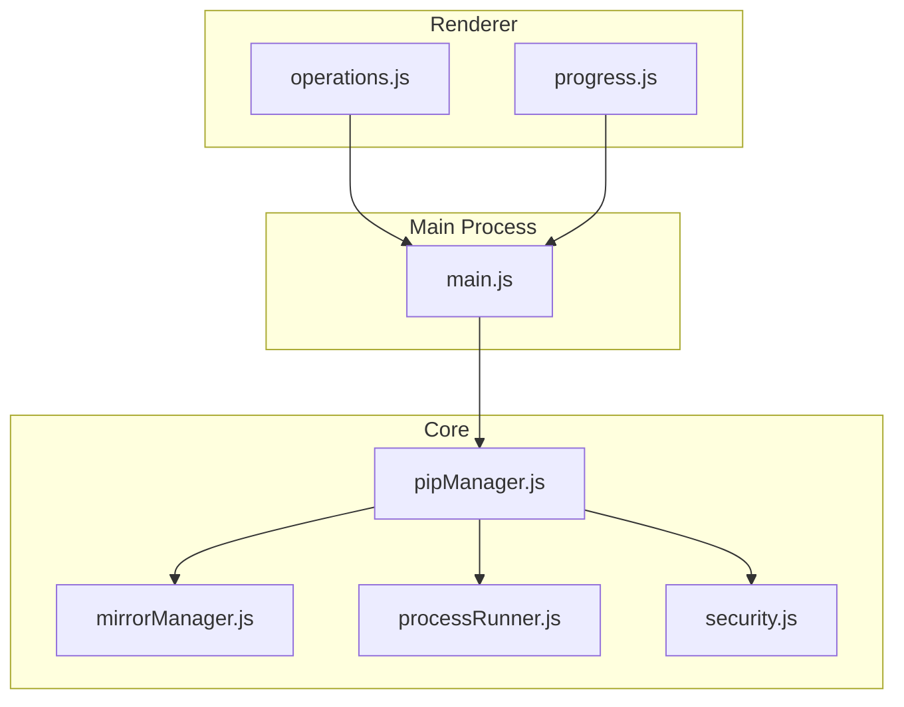
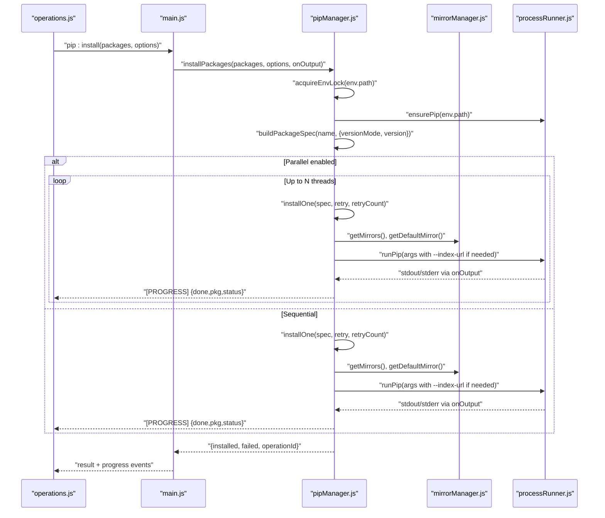
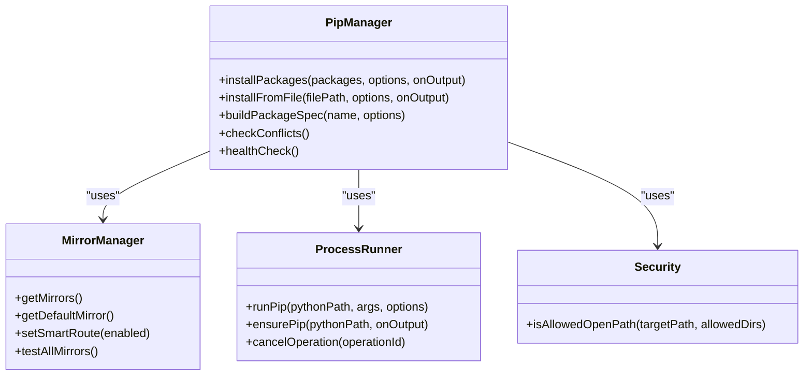
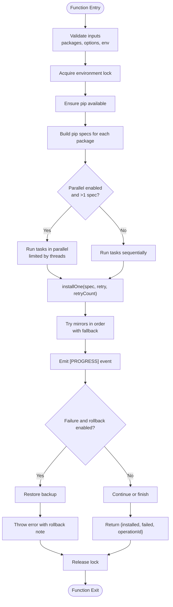
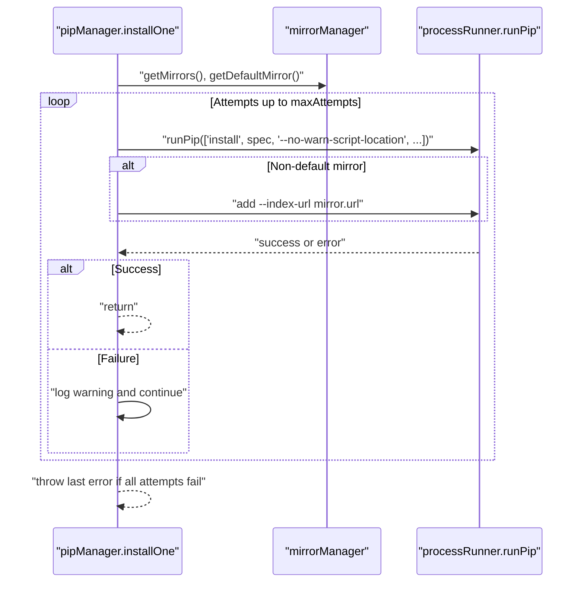
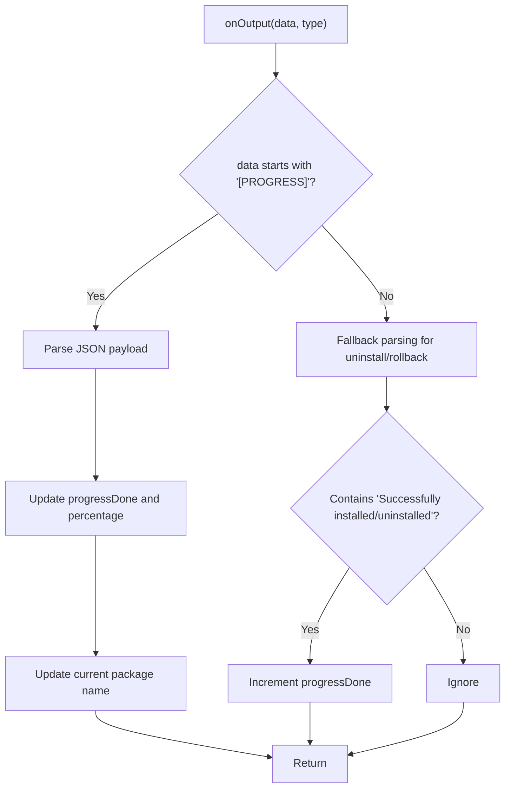
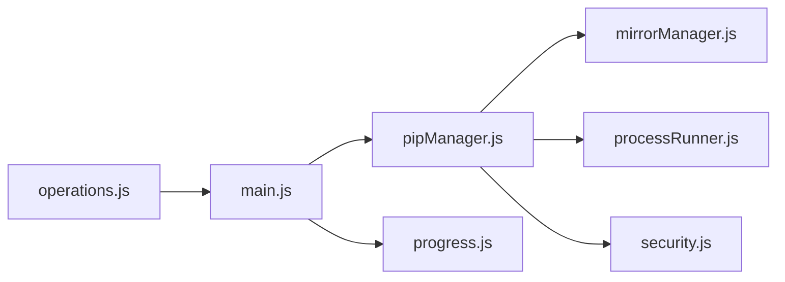

# Package Installation

<cite>
**Referenced Files in This Document**
- [pipManager.js](file://core/operations/pipManager.js)
- [mirrorManager.js](file://core/config/mirrorManager.js)
- [processRunner.js](file://utils/processRunner.js)
- [security.js](file://utils/security.js)
- [operations.js](file://renderer/js/operations.js)
- [progress.js](file://renderer/js/progress.js)
- [main.js](file://main.js)
</cite>

## Table of Contents
1. [Introduction](#introduction)
2. [Project Structure](#project-structure)
3. [Core Components](#core-components)
4. [Architecture Overview](#architecture-overview)
5. [Detailed Component Analysis](#detailed-component-analysis)
6. [Dependency Analysis](#dependency-analysis)
7. [Performance Considerations](#performance-considerations)
8. [Troubleshooting Guide](#troubleshooting-guide)
9. [Conclusion](#conclusion)
10. [Appendices](#appendices)

## Introduction
This document explains PyLibMaster’s package installation functionality with a focus on the installPackages function and related workflows. It covers single and batch installation, parallel processing, version specification handling (latest, specific versions, version ranges), wheel file installation, mirror source rotation with automatic retry, structured progress events, environment-level locking to prevent concurrent conflicts, and the security validation system for package names and wheel files. Practical examples are provided for common workflows such as installing from requirements.txt, specifying exact versions, handling dependency conflicts, and monitoring real-time progress.

## Project Structure
The package installation feature spans several modules:
- Core operations: pipManager.js orchestrates installation, uninstallation, updates, and utilities.
- Mirror management: mirrorManager.js manages PyPI mirrors, speed testing, and selection.
- Process execution: processRunner.js handles subprocess lifecycle, timeouts, cancellation, and pip auto-installation.
- Security utilities: security.js provides path safety checks.
- Renderer UI: operations.js and progress.js manage user interactions and progress display.
- IPC bridge: main.js wires renderer calls to core functions and forwards progress events.

**Diagram sources**
- [operations.js](file://renderer/js/operations.js)
- [progress.js](file://renderer/js/progress.js)
- [main.js](file://main.js)
- [pipManager.js](file://core/operations/pipManager.js)
- [mirrorManager.js](file://core/config/mirrorManager.js)
- [processRunner.js](file://utils/processRunner.js)
- [security.js](file://utils/security.js)

**Section sources**
- [pipManager.js](file://core/operations/pipManager.js)
- [mirrorManager.js](file://core/config/mirrorManager.js)
- [processRunner.js](file://utils/processRunner.js)
- [security.js](file://utils/security.js)
- [operations.js](file://renderer/js/operations.js)
- [progress.js](file://renderer/js/progress.js)
- [main.js](file://main.js)

## Core Components
- installPackages: Central entry point for installing packages with options for version mode, parallelism, retry, rollback, and operation tracking.
- buildPackageSpec: Validates and constructs pip spec strings for latest, specific versions, ranges, or wheel paths.
- installFromFile: Handles .whl and .txt installations with mirror rotation and rollback support.
- Mirror rotation: Automatic fallback across configured mirrors with configurable attempts.
- Environment lock: Ensures only one operation per Python environment at a time.
- Progress events: Structured [PROGRESS] messages update frontend counters reliably.
- Security validation: Strict regex and path checks prevent command injection and path traversal.

**Section sources**
- [pipManager.js](file://core/operations/pipManager.js)
- [mirrorManager.js](file://core/config/mirrorManager.js)
- [processRunner.js](file://utils/processRunner.js)
- [security.js](file://utils/security.js)
- [operations.js](file://renderer/js/operations.js)
- [progress.js](file://renderer/js/progress.js)
- [main.js](file://main.js)

## Architecture Overview
The installation flow integrates UI, IPC, core logic, mirror management, and subprocess execution.

**Diagram sources**
- [operations.js](file://renderer/js/operations.js)
- [main.js](file://main.js)
- [pipManager.js](file://core/operations/pipManager.js)
- [mirrorManager.js](file://core/config/mirrorManager.js)
- [processRunner.js](file://utils/processRunner.js)

## Detailed Component Analysis

### installPackages Function
- Inputs: packages array, options object (versionMode, version, parallel, retry, rollback, operationId), optional onOutput callback.
- Behavior:
  - Acquires an environment-level lock to serialize operations per Python environment.
  - Ensures pip is available; installs automatically if missing.
  - Builds pip specs using buildPackageSpec for each package.
  - If parallel is true and more than one spec, distributes work across threads limited by config.parallelThreads.
  - For each spec, runs installOne which rotates through mirrors and retries up to configured attempts.
  - Emits structured progress events after each package completes.
  - Supports automatic backup and rollback on failure when enabled.
  - Returns installed list, failed list, and operationId.

Key implementation references:
- Lock acquisition and release: [pipManager.js](file://core/operations/pipManager.js)
- Spec building and validation: [pipManager.js](file://core/operations/pipManager.js)
- Parallel execution: [pipManager.js](file://core/operations/pipManager.js)
- Mirror rotation and retry: [pipManager.js](file://core/operations/pipManager.js), [mirrorManager.js](file://core/config/mirrorManager.js)
- Progress emission: [pipManager.js](file://core/operations/pipManager.js)
- Backup and rollback: [pipManager.js](file://core/operations/pipManager.js)

**Section sources**
- [pipManager.js](file://core/operations/pipManager.js)
- [mirrorManager.js](file://core/config/mirrorManager.js)
- [processRunner.js](file://utils/processRunner.js)

### Version Specification Handling
- Latest: name alone (e.g., "flask")
- Specific version: name==version (e.g., "flask==2.3.0")
- Version range: name>=1.0,<2.0
- Wheel file: absolute path to .whl with strict validation

Validation rules:
- Package name must match allowed characters and length limits.
- Version specifier must match allowed characters and length limits.
- Wheel path must be absolute, not contain "..", not UNC, not sensitive directories, no blocked characters, and filename must match wheel pattern.

References:
- Regex patterns and validation logic: [pipManager.js](file://core/operations/pipManager.js)

**Section sources**
- [pipManager.js](file://core/operations/pipManager.js)

### Wheel File Installation
- Supported via installFromFile for .whl files.
- Enforces absolute paths, blocks traversal and UNC, validates filename pattern.
- Uses default mirror configuration unless explicitly overridden.
- Supports rollback on failure.

References:
- Wheel path validation and installation: [pipManager.js](file://core/operations/pipManager.js)

**Section sources**
- [pipManager.js](file://core/operations/pipManager.js)

### Mirror Source Rotation and Retry
- Default mirror order includes the configured default followed by other mirrors.
- Each install attempt tries multiple mirrors; failures trigger fallback to next mirror.
- Smart route can pick fastest mirror based on HEAD requests to numpy page.
- Configurable retry count controls maximum attempts.

References:
- Mirror list and selection: [mirrorManager.js](file://core/config/mirrorManager.js)
- InstallOne mirror rotation: [pipManager.js](file://core/operations/pipManager.js)

**Section sources**
- [mirrorManager.js](file://core/config/mirrorManager.js)
- [pipManager.js](file://core/operations/pipManager.js)

### Progress Tracking Through Structured Events
- Backend emits [PROGRESS] JSON payloads with done, pkg, status fields.
- Frontend parses these to increment counters and update percentage.
- Fallback parsing detects current package name from pip output lines.

References:
- Emission in backend: [pipManager.js](file://core/operations/pipManager.js)
- Parsing and UI updates: [progress.js](file://renderer/js/progress.js)

**Section sources**
- [pipManager.js](file://core/operations/pipManager.js)
- [progress.js](file://renderer/js/progress.js)

### Environment-Level Operation Locking
- A per-environment Promise-based lock ensures serial execution within the same Python environment.
- Prevents concurrent pip operations that could corrupt state.

References:
- Lock acquisition and release: [pipManager.js](file://core/operations/pipManager.js)

**Section sources**
- [pipManager.js](file://core/operations/pipManager.js)

### Security Validation System
- Package name validation prevents command injection via strict regex.
- Wheel path validation prevents path traversal and access to sensitive directories.
- Path allowance utility supports safe file opening within permitted directories.

References:
- Name/spec validation: [pipManager.js](file://core/operations/pipManager.js)
- Path allowance helper: [security.js](file://utils/security.js)

**Section sources**
- [pipManager.js](file://core/operations/pipManager.js)
- [security.js](file://utils/security.js)

### Subprocess Execution and Cancellation
- All pip commands run via processRunner with UTF-8 encoding, ANSI stripping, timeouts, and cancellation.
- Active processes tracked by operationId; cancelOperation terminates all associated processes.

References:
- Subprocess lifecycle and cancellation: [processRunner.js](file://utils/processRunner.js)
- IPC wiring for cancellation: [main.js](file://main.js)

**Section sources**
- [processRunner.js](file://utils/processRunner.js)
- [main.js](file://main.js)

### Requirements.txt Installation
- installFromFile supports .txt files; uses pip install -r with mirror rotation and retry.
- Supports rollback on failure.

References:
- Requirements handling: [pipManager.js](file://core/operations/pipManager.js)

**Section sources**
- [pipManager.js](file://core/operations/pipManager.js)

### Dependency Conflicts Handling
- checkConflicts uses pip check to detect broken requirements and reports detailed conflict messages.
- HealthCheck aggregates issues including corrupted metadata and site-packages accessibility.

References:
- Conflict detection: [pipManager.js](file://core/operations/pipManager.js)

**Section sources**
- [pipManager.js](file://core/operations/pipManager.js)

## Architecture Overview
The following diagram maps the high-level components involved in package installation:

**Diagram sources**
- [pipManager.js](file://core/operations/pipManager.js)
- [mirrorManager.js](file://core/config/mirrorManager.js)
- [processRunner.js](file://utils/processRunner.js)
- [security.js](file://utils/security.js)

## Detailed Component Analysis

### installPackages Flowchart

**Diagram sources**
- [pipManager.js](file://core/operations/pipManager.js)

**Section sources**
- [pipManager.js](file://core/operations/pipManager.js)

### Mirror Selection Sequence

**Diagram sources**
- [pipManager.js](file://core/operations/pipManager.js)
- [mirrorManager.js](file://core/config/mirrorManager.js)
- [processRunner.js](file://utils/processRunner.js)

**Section sources**
- [pipManager.js](file://core/operations/pipManager.js)
- [mirrorManager.js](file://core/config/mirrorManager.js)

### Progress Event Processing

**Diagram sources**
- [progress.js](file://renderer/js/progress.js)
- [pipManager.js](file://core/operations/pipManager.js)

**Section sources**
- [progress.js](file://renderer/js/progress.js)
- [pipManager.js](file://core/operations/pipManager.js)

## Dependency Analysis
- pipManager depends on mirrorManager for mirror configuration and selection, processRunner for subprocess execution and pip availability, and security utilities for path validation.
- main.js exposes IPC handlers that forward calls to pipManager and relay progress events to the renderer.
- operations.js triggers install/update/uninstall flows and manages UI state and progress cards.

**Diagram sources**
- [operations.js](file://renderer/js/operations.js)
- [main.js](file://main.js)
- [pipManager.js](file://core/operations/pipManager.js)
- [mirrorManager.js](file://core/config/mirrorManager.js)
- [processRunner.js](file://utils/processRunner.js)
- [security.js](file://utils/security.js)
- [progress.js](file://renderer/js/progress.js)

**Section sources**
- [operations.js](file://renderer/js/operations.js)
- [main.js](file://main.js)
- [pipManager.js](file://core/operations/pipManager.js)
- [mirrorManager.js](file://core/config/mirrorManager.js)
- [processRunner.js](file://utils/processRunner.js)
- [security.js](file://utils/security.js)
- [progress.js](file://renderer/js/progress.js)

## Performance Considerations
- Parallel installation reduces total time for large batches; concurrency limited by config.parallelThreads.
- Mirror rotation adds resilience but may increase latency; smart routing selects fastest mirror when enabled.
- Site-packages caching avoids repeated filesystem scans for size/time estimation.
- Timeout handling prevents hanging processes; graceful cancellation via operationId.

[No sources needed since this section provides general guidance]

## Troubleshooting Guide
- No Python environment selected: ensure a valid environment is active before running install operations.
- pip not available: ensurePip will attempt to install via ensurepip or get-pip.py; verify network connectivity and permissions.
- Mirror failures: check mirror URLs and enable smart routing; test mirrors individually.
- Dependency conflicts: use checkConflicts to identify broken requirements and resolve them before reinstalling.
- Rollback triggered: inspect logs for rollback details; restore from backup if necessary.
- Cancel operations: use cancelCurrentOperation to terminate ongoing tasks; confirm via logs.

**Section sources**
- [pipManager.js](file://core/operations/pipManager.js)
- [processRunner.js](file://utils/processRunner.js)
- [mirrorManager.js](file://core/config/mirrorManager.js)

## Conclusion
PyLibMaster’s package installation system provides robust, secure, and user-friendly capabilities for managing Python packages. The installPackages function supports flexible version specifications, parallel execution, mirror rotation with retries, structured progress tracking, and environment-level locking. Comprehensive security validations protect against command injection and path traversal. Users can confidently perform common workflows like installing from requirements.txt, pinning exact versions, handling dependency conflicts, and monitoring progress in real-time.

[No sources needed since this section summarizes without analyzing specific files]

## Appendices

### Practical Examples
- Install from requirements.txt:
  - Use installFromFile with a .txt file path; enable retry and rollback as needed.
  - Monitor progress via [PROGRESS] events and UI updates.
- Specify exact versions:
  - Pass versionMode='specific' and version='x.y.z' to installPackages.
  - buildPackageSpec constructs name==version safely.
- Handle dependency conflicts:
  - Run checkConflicts to identify issues; resolve by adjusting versions or removing conflicting packages.
- Monitor installation progress:
  - Subscribe to pip:progress events; parse [PROGRESS] payloads to update counters and percentages.

**Section sources**
- [pipManager.js](file://core/operations/pipManager.js)
- [operations.js](file://renderer/js/operations.js)
- [progress.js](file://renderer/js/progress.js)
- [main.js](file://main.js)