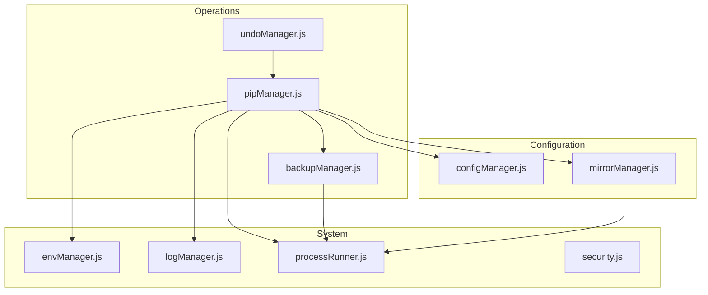
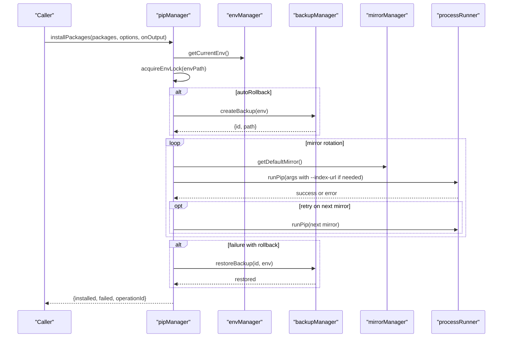
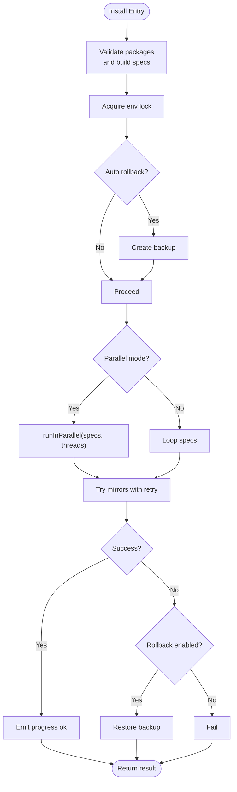
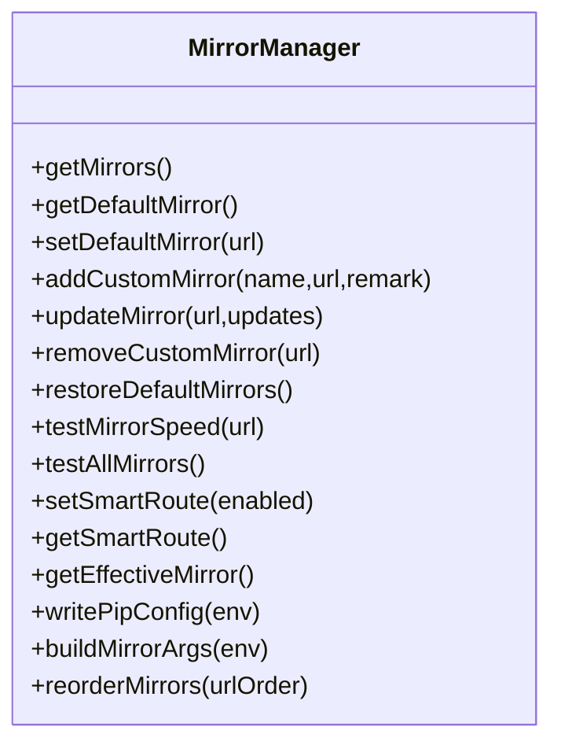
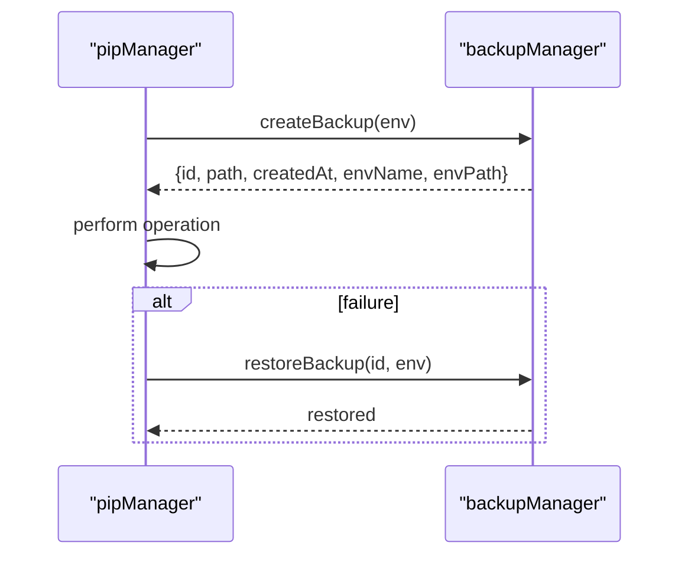
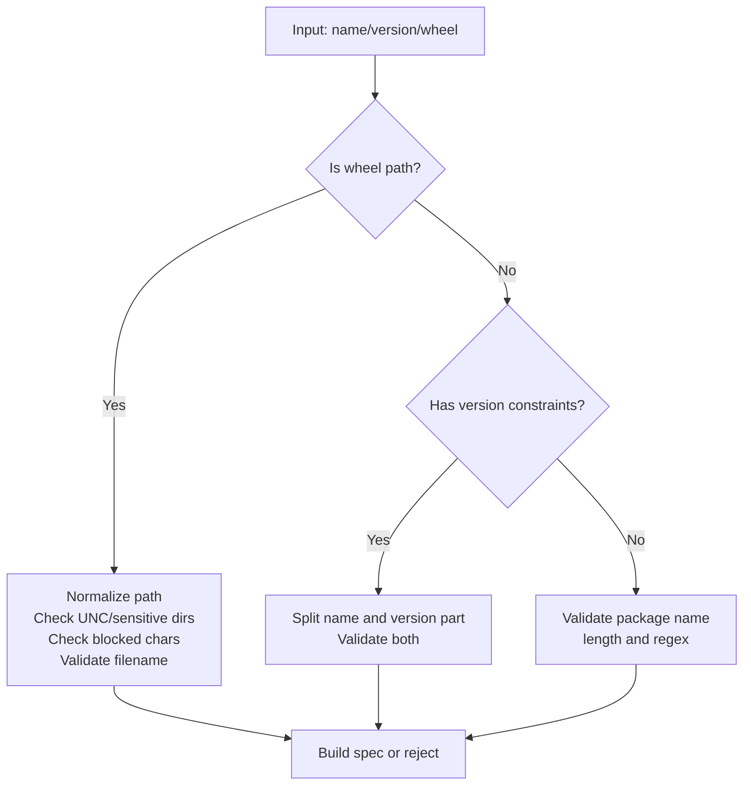
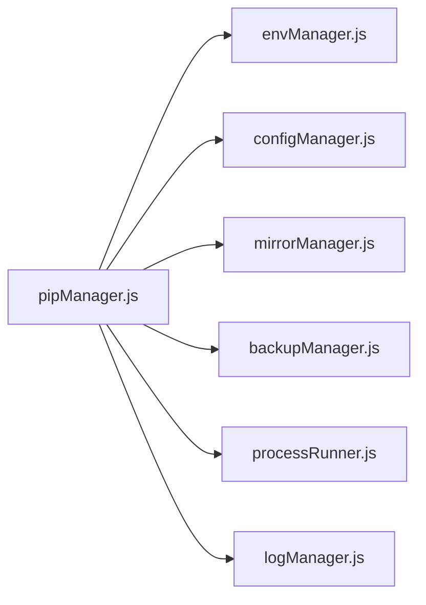

# Package Management

<cite>
**Referenced Files in This Document**
- [pipManager.js](file://core/operations/pipManager.js)
- [mirrorManager.js](file://core/config/mirrorManager.js)
- [backupManager.js](file://core/operations/backupManager.js)
- [processRunner.js](file://utils/processRunner.js)
- [security.js](file://utils/security.js)
- [logManager.js](file://core/system/logManager.js)
- [envManager.js](file://core/system/envManager.js)
- [configManager.js](file://core/config/configManager.js)
- [undoManager.js](file://core/operations/undoManager.js)
</cite>

## Table of Contents
1. [Introduction](#introduction)
2. [Project Structure](#project-structure)
3. [Core Components](#core-components)
4. [Architecture Overview](#architecture-overview)
5. [Detailed Component Analysis](#detailed-component-analysis)
6. [Dependency Analysis](#dependency-analysis)
7. [Performance Considerations](#performance-considerations)
8. [Troubleshooting Guide](#troubleshooting-guide)
9. [Conclusion](#conclusion)
10. [Appendices](#appendices)

## Introduction
This document explains PyLibMaster’s package management system, focusing on the pip wrapper and its capabilities for installation, uninstallation, updates, parallel execution, mirror rotation, automatic rollback, progress tracking, security validation, version specification handling, error recovery, and integration with backup systems. It also provides practical workflows such as installing from requirements.txt, managing wheel files, and resolving dependency conflicts.

## Project Structure
The package management subsystem is implemented across several modules:
- Core operations: pipManager (pip wrapper), backupManager (backups), undoManager (undo stack)
- Configuration and mirrors: configManager, mirrorManager
- System utilities: envManager (Python environment selection), logManager (logging), processRunner (subprocess orchestration), security (path safety)

**Diagram sources**
- [pipManager.js:1-120](file://core/operations/pipManager.js#L1-L120)
- [backupManager.js:1-60](file://core/operations/backupManager.js#L1-L60)
- [undoManager.js:1-40](file://core/operations/undoManager.js#L1-L40)
- [configManager.js:1-60](file://core/config/configManager.js#L1-L60)
- [mirrorManager.js:1-60](file://core/config/mirrorManager.js#L1-L60)
- [envManager.js:1-60](file://core/system/envManager.js#L1-L60)
- [logManager.js:1-60](file://core/system/logManager.js#L1-L60)
- [processRunner.js:1-60](file://utils/processRunner.js#L1-L60)
- [security.js:1-43](file://utils/security.js#L1-L43)

**Section sources**
- [pipManager.js:1-120](file://core/operations/pipManager.js#L1-L120)
- [configManager.js:1-120](file://core/config/configManager.js#L1-L120)
- [mirrorManager.js:1-120](file://core/config/mirrorManager.js#L1-L120)
- [envManager.js:1-120](file://core/system/envManager.js#L1-L120)
- [logManager.js:1-120](file://core/system/logManager.js#L1-L120)
- [processRunner.js:1-120](file://utils/processRunner.js#L1-L120)
- [security.js:1-43](file://utils/security.js#L1-L43)
- [backupManager.js:1-120](file://core/operations/backupManager.js#L1-L120)
- [undoManager.js:1-80](file://core/operations/undoManager.js#L1-L80)

## Core Components
- pipManager: Central pip wrapper providing install/uninstall/update, file-based installs (.whl, .txt), search, listing, dependency analysis, disk usage, offline download, conflict detection, health checks, and operation cancellation.
- mirrorManager: Manages PyPI mirror lists, default selection, speed testing, smart routing, and pip configuration writing.
- backupManager: Creates and restores backups using pip freeze; validates backup IDs to prevent path traversal.
- processRunner: Subprocess runner with timeout, cancellation by operationId, ANSI stripping, and ensurePip logic.
- envManager: Detects Python environments, selects current environment, and persists selection.
- logManager: Persistent JSON logging with capacity limits, debounced writes, and query support.
- security: Path allowance helper to restrict access to allowed directories.
- undoManager: Maintains an undo stack for install/uninstall/update reversals.

Key responsibilities and interactions are detailed in subsequent sections.

**Section sources**
- [pipManager.js:1-120](file://core/operations/pipManager.js#L1-L120)
- [mirrorManager.js:1-120](file://core/config/mirrorManager.js#L1-L120)
- [backupManager.js:1-120](file://core/operations/backupManager.js#L1-L120)
- [processRunner.js:1-120](file://utils/processRunner.js#L1-L120)
- [envManager.js:1-120](file://core/system/envManager.js#L1-L120)
- [logManager.js:1-120](file://core/system/logManager.js#L1-L120)
- [security.js:1-43](file://utils/security.js#L1-L43)
- [undoManager.js:1-80](file://core/operations/undoManager.js#L1-L80)

## Architecture Overview
At runtime, pipManager orchestrates operations by:
- Validating inputs (package names, versions, wheel paths)
- Acquiring environment locks to serialize operations per Python environment
- Creating optional backups before risky operations
- Executing pip commands via processRunner with timeouts and cancellation
- Rotating through configured mirrors and retrying on failure
- Emitting structured progress events and logging outcomes
- Rolling back automatically when failures occur and rollback is enabled

**Diagram sources**
- [pipManager.js:513-596](file://core/operations/pipManager.js#L513-L596)
- [pipManager.js:608-633](file://core/operations/pipManager.js#L608-L633)
- [backupManager.js:89-113](file://core/operations/backupManager.js#L89-L113)
- [mirrorManager.js:114-130](file://core/config/mirrorManager.js#L114-L130)
- [processRunner.js:340-342](file://utils/processRunner.js#L340-L342)

**Section sources**
- [pipManager.js:513-596](file://core/operations/pipManager.js#L513-L596)
- [pipManager.js:608-633](file://core/operations/pipManager.js#L608-L633)
- [backupManager.js:89-113](file://core/operations/backupManager.js#L89-L113)
- [mirrorManager.js:114-130](file://core/config/mirrorManager.js#L114-L130)
- [processRunner.js:340-342](file://utils/processRunner.js#L340-L342)

## Detailed Component Analysis

### pipManager: Installation, Uninstallation, Updates, File-Based Ops
- Installation
  - Single and batch installation with optional parallelism and intelligent retries across mirrors.
  - Version modes: latest (default), specific (==version), range (>=x,<y).
  - Automatic rollback on failure when enabled; creates a backup prior to changes.
  - Progress events emitted for each package status.
- Uninstallation
  - Batch uninstall with safety checks on package names.
  - Optional backup creation and automatic rollback on failure.
- Updates
  - Parallel update with mirror rotation and retry.
  - Detects “Requirement already satisfied” to avoid false positives.
- File-based operations
  - Install from .whl directly with strict path validation.
  - Install from requirements.txt with mirror rotation and retry.
- Cancellation
  - Cancel ongoing pip operations by operationId.
- Diagnostics
  - List installed/outdated packages, search available versions, show package info, dependency tree, disk usage, offline download, diff requirements, full dependency graph, conflict check, health check.

**Diagram sources**
- [pipManager.js:513-596](file://core/operations/pipManager.js#L513-L596)
- [pipManager.js:608-633](file://core/operations/pipManager.js#L608-L633)
- [pipManager.js:930-942](file://core/operations/pipManager.js#L930-L942)

**Section sources**
- [pipManager.js:513-596](file://core/operations/pipManager.js#L513-L596)
- [pipManager.js:608-633](file://core/operations/pipManager.js#L608-L633)
- [pipManager.js:645-730](file://core/operations/pipManager.js#L645-L730)
- [pipManager.js:745-789](file://core/operations/pipManager.js#L745-L789)
- [pipManager.js:805-885](file://core/operations/pipManager.js#L805-L885)
- [pipManager.js:930-942](file://core/operations/pipManager.js#L930-L942)

### Mirror Source Rotation and Smart Routing
- Maintains built-in and custom mirrors; ensures exactly one default.
- Supports speed testing and sorting; can pick best mirror dynamically when smart routing is enabled.
- Writes global pip configuration to use selected mirror.
- Pip commands receive --index-url when non-default mirror is used.

**Diagram sources**
- [mirrorManager.js:1-120](file://core/config/mirrorManager.js#L1-L120)
- [mirrorManager.js:219-290](file://core/config/mirrorManager.js#L219-L290)
- [mirrorManager.js:299-333](file://core/config/mirrorManager.js#L299-L333)

**Section sources**
- [mirrorManager.js:1-120](file://core/config/mirrorManager.js#L1-L120)
- [mirrorManager.js:219-290](file://core/config/mirrorManager.js#L219-L290)
- [mirrorManager.js:299-333](file://core/config/mirrorManager.js#L299-L333)

### Backup System Integration and Automatic Rollback
- Backups are created via pip freeze and stored under storage/backups.
- Backup ID validation prevents path traversal attacks.
- Restore uses pip install -r with force-reinstall and no-deps to revert state.
- pipManager triggers backup creation before risky operations and restores on failure when rollback is enabled.

**Diagram sources**
- [backupManager.js:89-113](file://core/operations/backupManager.js#L89-L113)
- [backupManager.js:156-170](file://core/operations/backupManager.js#L156-L170)
- [pipManager.js:513-596](file://core/operations/pipManager.js#L513-L596)

**Section sources**
- [backupManager.js:89-113](file://core/operations/backupManager.js#L89-L113)
- [backupManager.js:156-170](file://core/operations/backupManager.js#L156-L170)
- [pipManager.js:513-596](file://core/operations/pipManager.js#L513-L596)

### Security Validation System
- Package name validation enforces safe characters and length limits.
- Version spec validation ensures only allowed operators and formats.
- Wheel path validation blocks path traversal, UNC paths, sensitive directories, illegal characters, and enforces absolute paths and valid filenames.
- Backup ID validation prevents directory traversal and enforces naming format.
- Generic path allowance utility restricts access to allowed directories.

**Diagram sources**
- [pipManager.js:154-235](file://core/operations/pipManager.js#L154-L235)
- [backupManager.js:62-78](file://core/operations/backupManager.js#L62-L78)
- [security.js:28-40](file://utils/security.js#L28-L40)

**Section sources**
- [pipManager.js:154-235](file://core/operations/pipManager.js#L154-L235)
- [backupManager.js:62-78](file://core/operations/backupManager.js#L62-L78)
- [security.js:28-40](file://utils/security.js#L28-L40)

### Version Specification Handling
- Latest: pass package name without constraints.
- Specific: enforce ==version with validated version string.
- Range: accept ranges like >=1.0,<2.0 after validation.
- Prebuilt specs (e.g., from undoManager) are validated and passed through.

**Section sources**
- [pipManager.js:154-235](file://core/operations/pipManager.js#L154-L235)

### Error Recovery Patterns
- Retry across multiple mirrors for install/update.
- Automatic rollback using backups when enabled.
- Operation cancellation by operationId via processRunner.
- Health checks and conflict detection to identify issues early.

**Section sources**
- [pipManager.js:608-633](file://core/operations/pipManager.js#L608-L633)
- [pipManager.js:805-885](file://core/operations/pipManager.js#L805-L885)
- [processRunner.js:181-191](file://utils/processRunner.js#L181-L191)
- [pipManager.js:1460-1503](file://core/operations/pipManager.js#L1460-L1503)

### Progress Tracking and Logging
- Structured progress events emitted per package with done count and status.
- All operations logged with action, status, type, and detail; logs are persisted with capacity limits and debounced writes.

**Section sources**
- [pipManager.js:61-63](file://core/operations/pipManager.js#L61-L63)
- [logManager.js:115-134](file://core/system/logManager.js#L115-L134)

### Practical Workflows

#### Installing from requirements.txt
- Use importRequirements(filePath, options, onOutput) to install all packages listed in a requirements file.
- Supports disabling retries via options.
- Logs success/failure and returns output summary.

**Section sources**
- [pipManager.js:1127-1153](file://core/operations/pipManager.js#L1127-L1153)

#### Managing wheel files
- Use installFromFile(filePath, options, onOutput) with a .whl path.
- Strict validation ensures safe absolute paths and valid filenames.
- Auto rollback on failure when enabled.

**Section sources**
- [pipManager.js:645-730](file://core/operations/pipManager.js#L645-L730)

#### Handling dependency conflicts
- Use checkConflicts() to detect broken requirements and parse messages into structured conflicts.
- Use healthCheck() for comprehensive diagnostics including metadata integrity and site-packages accessibility.

**Section sources**
- [pipManager.js:1460-1503](file://core/operations/pipManager.js#L1460-L1503)
- [pipManager.js:1510-1584](file://core/operations/pipManager.js#L1510-L1584)

### Undo Manager Integration
- Records operations (install/uninstall/update) with package details and metadata.
- Performs inverse actions: uninstall for install undo, reinstall with old versions for uninstall/update undo.
- Limits stack size and re-pushes operation on undo failure.

**Section sources**
- [undoManager.js:22-106](file://core/operations/undoManager.js#L22-L106)

## Dependency Analysis
pipManager depends on:
- envManager for current environment selection
- configManager for settings (parallelThreads, retryCount, storagePath)
- mirrorManager for mirror list and effective mirror selection
- backupManager for creating/restoring backups
- processRunner for subprocess execution, timeouts, and cancellation
- logManager for persistent logging

**Diagram sources**
- [pipManager.js:1-40](file://core/operations/pipManager.js#L1-L40)
- [envManager.js:1-40](file://core/system/envManager.js#L1-L40)
- [configManager.js:1-40](file://core/config/configManager.js#L1-L40)
- [mirrorManager.js:1-40](file://core/config/mirrorManager.js#L1-L40)
- [backupManager.js:1-40](file://core/operations/backupManager.js#L1-L40)
- [processRunner.js:1-40](file://utils/processRunner.js#L1-L40)
- [logManager.js:1-40](file://core/system/logManager.js#L1-L40)

**Section sources**
- [pipManager.js:1-40](file://core/operations/pipManager.js#L1-L40)
- [envManager.js:1-40](file://core/system/envManager.js#L1-L40)
- [configManager.js:1-40](file://core/config/configManager.js#L1-L40)
- [mirrorManager.js:1-40](file://core/config/mirrorManager.js#L1-L40)
- [backupManager.js:1-40](file://core/operations/backupManager.js#L1-L40)
- [processRunner.js:1-40](file://utils/processRunner.js#L1-L40)
- [logManager.js:1-40](file://core/system/logManager.js#L1-L40)

## Performance Considerations
- Parallel installation/update controlled by parallelThreads; concurrency limited to number of items.
- Site-packages path caching reduces repeated discovery overhead.
- Folder size calculation caches results to avoid redundant scans.
- Log writes are debounced to reduce I/O contention.
- Ensure pip readiness cached to avoid repeated checks.

[No sources needed since this section provides general guidance]

## Troubleshooting Guide
- pip not available: ensurePip attempts ensurepip then get-pip.py; repairPip offers explicit repair flow.
- Timeout or hang: processRunner enforces timeouts and supports SIGTERM/SIGKILL; cancelOperation cancels by operationId.
- Mirror connectivity: testAllMirrors and pickBestMirror help diagnose slow/unreachable mirrors.
- Conflicts: checkConflicts parses pip check output; healthCheck aggregates issues and scores environment health.
- Backup issues: validateBackupId guards against invalid IDs; verify backup files exist before restore.

**Section sources**
- [processRunner.js:233-278](file://utils/processRunner.js#L233-L278)
- [pipManager.js:968-1014](file://core/operations/pipManager.js#L968-L1014)
- [mirrorManager.js:240-276](file://core/config/mirrorManager.js#L240-L276)
- [pipManager.js:1460-1503](file://core/operations/pipManager.js#L1460-L1503)
- [backupManager.js:62-78](file://core/operations/backupManager.js#L62-L78)

## Conclusion
PyLibMaster’s package management system provides robust, secure, and resilient pip operations with advanced features like parallel processing, mirror rotation, automatic rollback, progress tracking, and comprehensive diagnostics. Its modular architecture integrates environment management, configuration, logging, and subprocess orchestration to deliver a reliable user experience for common workflows such as requirements installation, wheel management, and dependency conflict resolution.

[No sources needed since this section summarizes without analyzing specific files]

## Appendices

### API Summary Highlights
- installPackages(packages, options, onOutput): batch install with parallel/retry/rollback
- installFromFile(filePath, options, onOutput): install .whl or .txt
- uninstallPackages(packages, options, onOutput): batch uninstall with safety and rollback
- updatePackages(packages, options, onOutput): batch update with mirror rotation and retry
- exportRequirements(options): export current environment to requirements content
- importRequirements(filePath, options, onOutput): install from requirements file
- checkConflicts(): detect dependency conflicts
- healthCheck(): comprehensive environment health report
- downloadPackages(packages, destDir, options, onOutput): offline download
- getFullDependencyGraph(): nodes and edges for dependency visualization

**Section sources**
- [pipManager.js:513-596](file://core/operations/pipManager.js#L513-L596)
- [pipManager.js:645-730](file://core/operations/pipManager.js#L645-L730)
- [pipManager.js:745-789](file://core/operations/pipManager.js#L745-L789)
- [pipManager.js:805-885](file://core/operations/pipManager.js#L805-L885)
- [pipManager.js:1104-1118](file://core/operations/pipManager.js#L1104-L1118)
- [pipManager.js:1127-1153](file://core/operations/pipManager.js#L1127-L1153)
- [pipManager.js:1460-1503](file://core/operations/pipManager.js#L1460-L1503)
- [pipManager.js:1510-1584](file://core/operations/pipManager.js#L1510-L1584)
- [pipManager.js:1242-1281](file://core/operations/pipManager.js#L1242-L1281)
- [pipManager.js:1409-1453](file://core/operations/pipManager.js#L1409-L1453)