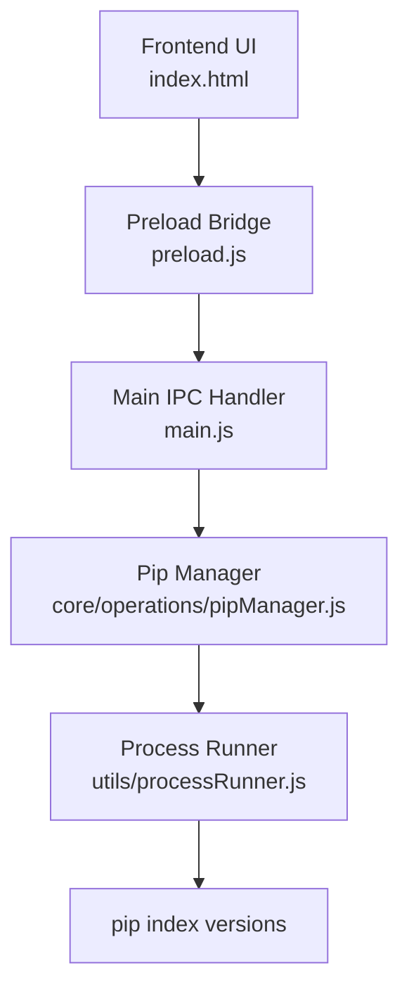
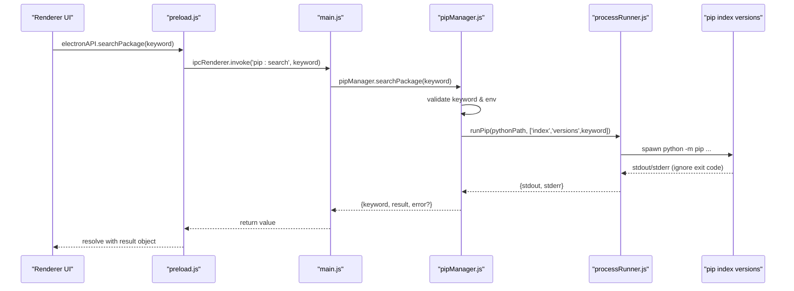
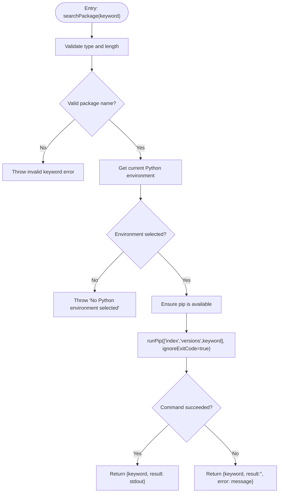
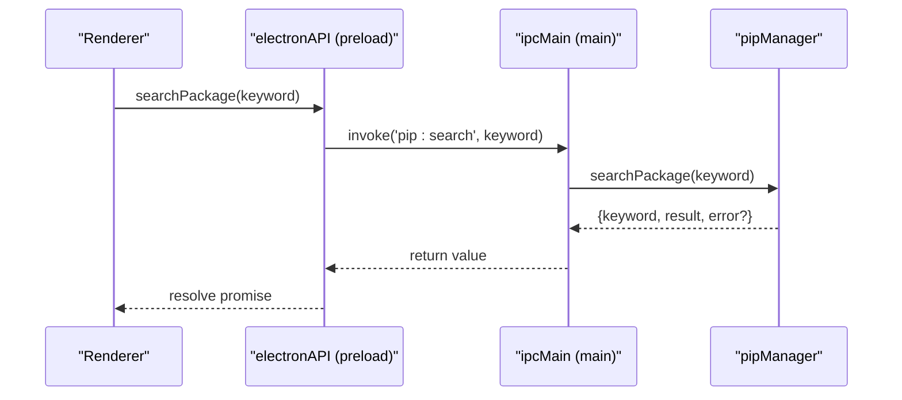
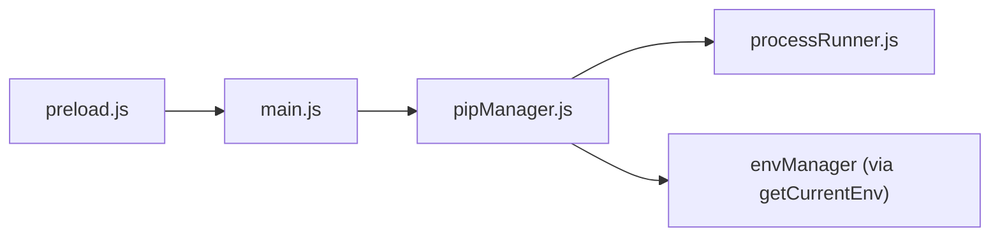

# Package Search

<cite>
**Referenced Files in This Document**
- [pipManager.js](file://core/operations/pipManager.js)
- [processRunner.js](file://utils/processRunner.js)
- [main.js](file://main.js)
- [preload.js](file://preload.js)
- [index.html](file://renderer/index.html)
</cite>

## Table of Contents
1. [Introduction](#introduction)
2. [Project Structure](#project-structure)
3. [Core Components](#core-components)
4. [Architecture Overview](#architecture-overview)
5. [Detailed Component Analysis](#detailed-component-analysis)
6. [Dependency Analysis](#dependency-analysis)
7. [Performance Considerations](#performance-considerations)
8. [Troubleshooting Guide](#troubleshooting-guide)
9. [Conclusion](#conclusion)
10. [Appendices](#appendices)

## Introduction
This document explains PyLibMaster’s package search functionality, centered on the searchPackage function that replaces the deprecated pip search command with pip index versions. It covers input validation and sanitization, error handling when pip search is unavailable, result formatting, and how results are returned to the frontend. Practical examples and best practices for package discovery are included, along with guidance on migrating from pip search to pip index versions.

## Project Structure
The search feature spans multiple layers:
- Frontend UI provides a search input (PyPI Browse page).
- Preload script exposes an API method to call the main process.
- Main process registers an IPC handler that delegates to the core module.
- Core module performs validation, ensures pip availability, runs pip index versions, and returns structured results.
- Process runner executes pip commands safely with timeouts, cancellation support, and output streaming.

**Diagram sources**
- [index.html](file://renderer/index.html)
- [preload.js](file://preload.js)
- [main.js](file://main.js)
- [pipManager.js](file://core/operations/pipManager.js)
- [processRunner.js](file://utils/processRunner.js)

**Section sources**
- [index.html](file://renderer/index.html)
- [preload.js](file://preload.js)
- [main.js](file://main.js)
- [pipManager.js](file://core/operations/pipManager.js)
- [processRunner.js](file://utils/processRunner.js)

## Core Components
- searchPackage (core): Validates keyword, ensures pip, runs pip index versions, and returns a structured object with keyword, result text, and optional error message.
- runPip (runner): Executes python -m pip with arguments, supports timeout, ignoreExitCode, and real-time output callbacks.
- IPC bridge (preload/main): Exposes searchPackage to the renderer via electronAPI.searchPackage and routes it through ipcMain.handle('pip:search').

Key behaviors:
- Input validation enforces non-empty string, length limit, and allowed characters.
- Environment selection is required; pip must be available or auto-installed.
- Errors from pip index versions are captured and returned without throwing, enabling graceful UI handling.

**Section sources**
- [pipManager.js](file://core/operations/pipManager.js)
- [processRunner.js](file://utils/processRunner.js)
- [main.js](file://main.js)
- [preload.js](file://preload.js)

## Architecture Overview
The search flow is a straightforward pipeline from UI to pip and back:

**Diagram sources**
- [preload.js](file://preload.js)
- [main.js](file://main.js)
- [pipManager.js](file://core/operations/pipManager.js)
- [processRunner.js](file://utils/processRunner.js)

## Detailed Component Analysis

### searchPackage Implementation
- Validation:
  - Rejects empty or non-string inputs.
  - Enforces maximum length.
  - Validates against a strict package name regex.
- Environment and pip readiness:
  - Requires a selected Python environment.
  - Ensures pip is available (auto-install if needed).
- Execution:
  - Runs pip index versions with ignoreExitCode to tolerate non-zero exits gracefully.
  - Captures stdout as the result text.
- Error handling:
  - On failure, returns an object with keyword, empty result, and error message instead of throwing.

**Diagram sources**
- [pipManager.js](file://core/operations/pipManager.js)
- [processRunner.js](file://utils/processRunner.js)

**Section sources**
- [pipManager.js](file://core/operations/pipManager.js)

### IPC Exposure and Frontend Integration
- preload.js exposes electronAPI.searchPackage which invokes 'pip:search'.
- main.js handles 'pip:search' by calling pipManager.searchPackage.
- The renderer can call electronAPI.searchPackage and handle the returned object.

**Diagram sources**
- [preload.js](file://preload.js)
- [main.js](file://main.js)

**Section sources**
- [preload.js](file://preload.js)
- [main.js](file://main.js)

### Result Formatting and Processing
- The function returns a plain object:
  - keyword: the original search term
  - result: raw stdout from pip index versions
  - error: optional error message when pip fails
- The renderer should parse or display this raw text appropriately. Since pip index versions outputs human-readable lines, the UI may split by newline and render each line as a suggestion or version entry.

Best practices for processing:
- Trim whitespace and filter empty lines.
- Normalize package names (lowercase, replace underscores/hyphens consistently).
- Deduplicate entries if necessary.
- Handle cases where result is empty due to network issues or unsupported pip versions.

**Section sources**
- [pipManager.js](file://core/operations/pipManager.js)

### Input Sanitization and Security
- Keyword validation uses a strict regex allowing only safe characters for package names.
- Length limits prevent excessively long inputs.
- No shell injection risk because the keyword is passed as a pip argument, not concatenated into a shell command.

Security considerations:
- Avoid concatenating user input into shell commands.
- Rely on pip’s argument parsing rather than custom parsers.
- Keep validation consistent across all pip-invoking functions.

**Section sources**
- [pipManager.js](file://core/operations/pipManager.js)

### Error Handling When pip search Is Unavailable
- pip search is disabled on PyPI; the implementation uses pip index versions instead.
- If pip index versions is unavailable or fails, the function returns an error field rather than throwing, enabling graceful UI fallbacks.
- processRunner supports ignoreExitCode to avoid rejecting non-zero exit codes for informational commands.

Fallback strategies:
- Display a friendly message indicating search is unavailable.
- Suggest using the PyPI web interface or installing/upgrading pip.
- Optionally log diagnostic details for troubleshooting.

**Section sources**
- [pipManager.js](file://core/operations/pipManager.js)
- [processRunner.js](file://utils/processRunner.js)

## Dependency Analysis
- searchPackage depends on:
  - Environment manager to get the current Python path.
  - processRunner to ensure pip and execute commands.
  - IPC layer for exposing the function to the renderer.

**Diagram sources**
- [preload.js](file://preload.js)
- [main.js](file://main.js)
- [pipManager.js](file://core/operations/pipManager.js)
- [processRunner.js](file://utils/processRunner.js)

**Section sources**
- [pipManager.js](file://core/operations/pipManager.js)
- [processRunner.js](file://utils/processRunner.js)
- [main.js](file://main.js)
- [preload.js](file://preload.js)

## Performance Considerations
- pip index versions is a lightweight query compared to full package metadata retrieval.
- Timeout is set to avoid hanging operations.
- No caching is implemented for search results; consider adding short-lived caching if frequent searches are expected.
- Minimize redundant calls by debouncing UI input if integrating live search.

[No sources needed since this section provides general guidance]

## Troubleshooting Guide
Common issues and resolutions:
- “No Python environment selected”: Choose or detect a valid Python environment before searching.
- “pip is not available”: Use the repair pip feature or install pip manually.
- Empty results: Network issues, firewall restrictions, or unsupported pip versions. Verify connectivity and upgrade pip.
- Non-zero exit code: Handled gracefully; inspect error field for details.

Diagnostics:
- Check logs for subprocess errors and stdout/stderr content.
- Test pip index versions directly in the terminal to confirm availability.

**Section sources**
- [pipManager.js](file://core/operations/pipManager.js)
- [processRunner.js](file://utils/processRunner.js)

## Conclusion
PyLibMaster’s package search leverages pip index versions to provide a secure, robust alternative to the deprecated pip search. With strong input validation, graceful error handling, and clear IPC integration, it enables reliable package discovery. For best results, ensure a valid Python environment and up-to-date pip, and handle empty or error responses in the UI to maintain a smooth user experience.

[No sources needed since this section summarizes without analyzing specific files]

## Appendices

### Practical Examples
- Searching by name:
  - Call electronAPI.searchPackage("requests") and display the returned result lines.
- Handling errors gracefully:
  - If result.error exists, show a message like “Search unavailable. Please check your network or pip version.”
- Limitations:
  - Results are raw text from pip index versions; parsing may vary across pip versions.
  - No fuzzy matching or ranking; rely on exact package names.

[No sources needed since this section provides general guidance]