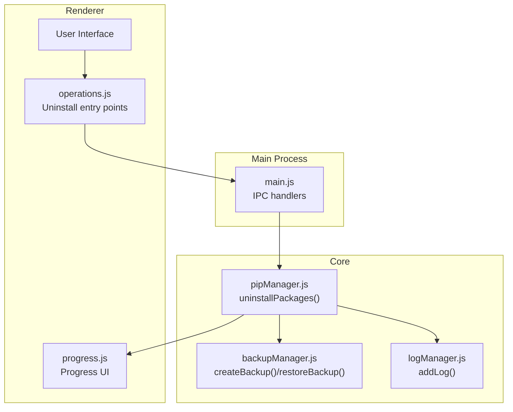
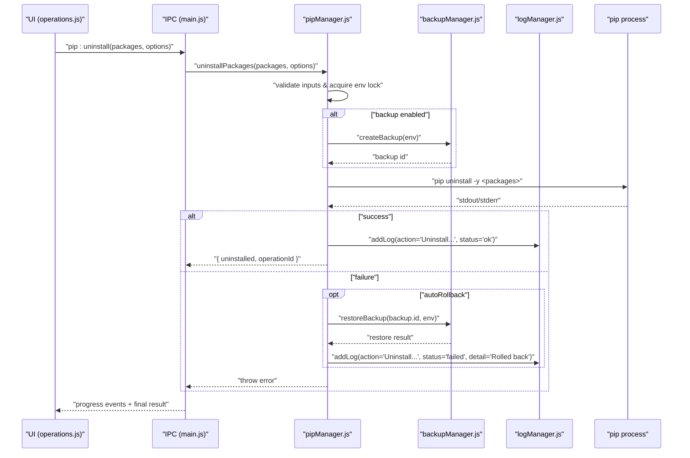
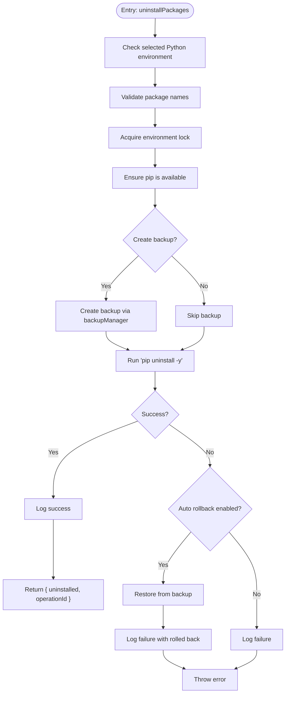
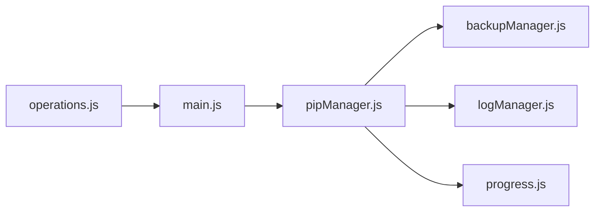

# Package Uninstallation

<cite>
**Referenced Files in This Document**
- [pipManager.js](file://core/operations/pipManager.js)
- [backupManager.js](file://core/operations/backupManager.js)
- [logManager.js](file://core/system/logManager.js)
- [operations.js](file://renderer/js/operations.js)
- [progress.js](file://renderer/js/progress.js)
- [main.js](file://main.js)
</cite>

## Table of Contents
1. [Introduction](#introduction)
2. [Project Structure](#project-structure)
3. [Core Components](#core-components)
4. [Architecture Overview](#architecture-overview)
5. [Detailed Component Analysis](#detailed-component-analysis)
6. [Dependency Analysis](#dependency-analysis)
7. [Performance Considerations](#performance-considerations)
8. [Troubleshooting Guide](#troubleshooting-guide)
9. [Conclusion](#conclusion)

## Introduction
This document explains PyLibMaster’s package uninstallation system with a focus on the uninstallPackages function. It covers safe mode operations, batch uninstallation, automatic backup creation before removal, and rollback capabilities on failure. It also details input validation for package names, error handling patterns, integration with the backup system for automatic recovery, logging of uninstallation activities, and progress feedback. Practical examples are provided for safe uninstall workflows, handling dependency conflicts during removal, and recovering from failed uninstallations using backup restoration.

## Project Structure
The uninstallation feature spans core business logic (pipManager), backup management (backupManager), logging (logManager), UI orchestration (operations.js), progress rendering (progress.js), and IPC wiring (main.js). The flow starts in the renderer when users trigger single or batch uninstall, proceeds through IPC to the main process, and executes in pipManager with safeguards and optional backups.

**Diagram sources**
- [operations.js:33-113](file://renderer/js/operations.js#L33-L113)
- [main.js:324-329](file://main.js#L324-L329)
- [pipManager.js:745-789](file://core/operations/pipManager.js#L745-L789)
- [backupManager.js:89-113](file://core/operations/backupManager.js#L89-L113)
- [logManager.js:115-134](file://core/system/logManager.js#L115-L134)
- [progress.js:101-141](file://renderer/js/progress.js#L101-L141)

**Section sources**
- [operations.js:33-113](file://renderer/js/operations.js#L33-L113)
- [main.js:324-329](file://main.js#L324-L329)
- [pipManager.js:745-789](file://core/operations/pipManager.js#L745-L789)
- [backupManager.js:89-113](file://core/operations/backupManager.js#L89-L113)
- [logManager.js:115-134](file://core/system/logManager.js#L115-L134)
- [progress.js:101-141](file://renderer/js/progress.js#L101-L141)

## Core Components
- pipManager.uninstallPackages: Orchestrates batch uninstall with environment locking, input validation, optional backup creation, pip execution, logging, and rollback on failure.
- backupManager.createBackup/restoreBackup: Captures current environment state via pip freeze and restores it using force-reinstall with no-deps.
- logManager.addLog: Persists operation logs with truncation and debounced writes.
- Renderer operations.js: Provides single and batch uninstall flows, backup confirmation dialog, and progress tracking.
- progress.js: Parses structured and text-based progress events to update UI counters and status.

Key behaviors:
- Safe mode: Input validation ensures only valid package names are processed; environment lock prevents concurrent operations.
- Batch uninstallation: Multiple packages are passed to a single pip uninstall call.
- Automatic backup: Optional backup is created before uninstall if enabled by options or user selection.
- Rollback on failure: On error, the system restores the environment from the created backup and logs the event.

**Section sources**
- [pipManager.js:745-789](file://core/operations/pipManager.js#L745-L789)
- [backupManager.js:89-113](file://core/operations/backupManager.js#L89-L113)
- [logManager.js:115-134](file://core/system/logManager.js#L115-L134)
- [operations.js:33-113](file://renderer/js/operations.js#L33-L113)
- [progress.js:101-141](file://renderer/js/progress.js#L101-L141)

## Architecture Overview
The uninstall workflow integrates UI, IPC, core logic, backup, and logging. Users initiate uninstall via the UI; the renderer sets up progress and calls the IPC handler; the main process invokes pipManager.uninstallPackages; backupManager may create a snapshot; pip executes the uninstall; logs are recorded; and failures trigger rollback via backup restore.

**Diagram sources**
- [operations.js:80-113](file://renderer/js/operations.js#L80-L113)
- [main.js:324-329](file://main.js#L324-L329)
- [pipManager.js:745-789](file://core/operations/pipManager.js#L745-L789)
- [backupManager.js:89-113](file://core/operations/backupManager.js#L89-L113)
- [logManager.js:115-134](file://core/system/logManager.js#L115-L134)

## Detailed Component Analysis

### uninstallPackages Function
- Validates environment and package names against strict regex rules.
- Acquires an environment-level lock to prevent concurrent operations.
- Ensures pip is available.
- Optionally creates a backup based on options.backup or autoRollback default behavior.
- Executes pip uninstall with appropriate flags.
- Logs success or failure; on failure with autoRollback enabled, restores from backup and throws a descriptive error.

**Diagram sources**
- [pipManager.js:745-789](file://core/operations/pipManager.js#L745-L789)
- [backupManager.js:89-113](file://core/operations/backupManager.js#L89-L113)
- [logManager.js:115-134](file://core/system/logManager.js#L115-L134)

**Section sources**
- [pipManager.js:745-789](file://core/operations/pipManager.js#L745-L789)

### Safe Mode Operations
- Input validation uses a strict regex for package names to prevent command injection and malformed specs.
- Environment lock ensures serial execution per Python environment, avoiding race conditions.
- Wheel path and spec building functions enforce safety constraints elsewhere in the module; uninstall validates names similarly.

Safety mechanisms:
- VALID_PACKAGE_NAME regex enforces allowed characters and length limits.
- Environment lock via acquireEnvLock prevents overlapping uninstall/install/update operations.
- Error paths ensure consistent logging and optional rollback.

**Section sources**
- [pipManager.js:29-35](file://core/operations/pipManager.js#L29-L35)
- [pipManager.js:72-85](file://core/operations/pipManager.js#L72-L85)
- [pipManager.js:745-789](file://core/operations/pipManager.js#L745-L789)

### Batch Uninstallation
- Packages are collected into an array and passed directly to pip uninstall in one invocation.
- Progress events are emitted per package where applicable; for uninstall, progress is inferred from pip output.

Batch characteristics:
- Single pip call reduces overhead and improves throughput.
- UI tracks total count and updates progress based on structured or textual cues.

**Section sources**
- [pipManager.js:745-789](file://core/operations/pipManager.js#L745-L789)
- [progress.js:121-128](file://renderer/js/progress.js#L121-L128)

### Automatic Backup Creation Before Removal
- When options.backup is true or autoRollback is enabled, a backup is created prior to uninstall.
- Backup captures pip freeze output and stores it under a validated filename.

Backup details:
- Filename format includes environment name and timestamp.
- Validation prevents path traversal and enforces naming conventions.

**Section sources**
- [pipManager.js:762-767](file://core/operations/pipManager.js#L762-L767)
- [backupManager.js:46-51](file://core/operations/backupManager.js#L46-L51)
- [backupManager.js:62-78](file://core/operations/backupManager.js#L62-L78)
- [backupManager.js:89-113](file://core/operations/backupManager.js#L89-L113)

### Rollback Capabilities on Failure
- If uninstall fails and autoRollback is enabled, the system restores the environment using the previously created backup.
- Restoration uses pip install -r with --force-reinstall and --no-deps to reapply exact versions captured in the backup.

Rollback flow:
- Triggered in catch block after pip uninstall error.
- Logs rollback action and throws a descriptive error to the caller.

**Section sources**
- [pipManager.js:776-785](file://core/operations/pipManager.js#L776-L785)
- [backupManager.js:156-170](file://core/operations/backupManager.js#L156-L170)

### Input Validation for Package Names
- Each package name is validated against VALID_PACKAGE_NAME.
- Invalid names cause immediate errors, preventing unsafe commands from being executed.

Validation specifics:
- Regex allows alphanumeric, dot, hyphen, underscore; rejects special characters that could lead to injection.
- Length checks prevent excessively long inputs.

**Section sources**
- [pipManager.js:29-35](file://core/operations/pipManager.js#L29-L35)
- [pipManager.js:750-754](file://core/operations/pipManager.js#L750-L754)

### Error Handling Patterns
- Errors are caught around pip execution; if autoRollback is enabled, backup restore is attempted.
- Logging records both successful and failed operations with contextual details.
- Exceptions bubble up to the renderer, which displays user-friendly messages.

Error handling highlights:
- Consistent try/catch blocks around critical operations.
- Structured logging with action, status, type, and detail fields.
- Clear error messages indicating rollback status.

**Section sources**
- [pipManager.js:772-785](file://core/operations/pipManager.js#L772-L785)
- [logManager.js:115-134](file://core/system/logManager.js#L115-L134)

### Integration with Backup System for Automatic Recovery
- Backup creation occurs before uninstall when enabled.
- Restore uses validated backup IDs and runs pip install -r with force-reinstall and no-deps.

Integration points:
- backupManager.createBackup returns metadata including id and path.
- backupManager.restoreBackup performs the actual restoration with progress callbacks.

**Section sources**
- [backupManager.js:89-113](file://core/operations/backupManager.js#L89-L113)
- [backupManager.js:156-170](file://core/operations/backupManager.js#L156-L170)

### Logging of Uninstallation Activities
- Successful uninstallations log action “Uninstall: ...” with status ok.
- Failures log status failed and include detail such as “Rolled back”.

Logging benefits:
- Auditable history for troubleshooting.
- Supports filtering by type and keyword search.

**Section sources**
- [pipManager.js:774-784](file://core/operations/pipManager.js#L774-L784)
- [logManager.js:115-134](file://core/system/logManager.js#L115-L134)

### Progress Feedback
- For uninstall, progress is inferred from pip output lines containing success markers.
- UI updates counters and percentage accordingly.

Progress mechanics:
- Structured [PROGRESS] events used for install/update; uninstall relies on textual parsing.
- finishProgress sets final status and hides the progress card after a delay.

**Section sources**
- [progress.js:121-128](file://renderer/js/progress.js#L121-L128)
- [progress.js:45-74](file://renderer/js/progress.js#L45-L74)

### Practical Examples of Safe Uninstallation Workflows
- Single uninstall with backup:
  - User selects a package and triggers singleUninstall.
  - If backup option is checked, a modal prompts confirmation; upon confirm, doUninstall is called with withBackup=true.
  - Backend creates a backup, executes uninstall, logs outcome, and updates UI.

- Batch uninstall without backup:
  - User selects multiple packages and triggers batchUninstall.
  - doUninstall is called with withBackup=false; uninstall proceeds directly.

- Force uninstall (skip backup):
  - User chooses forceUninstall to bypass backup confirmation and proceed immediately.

These flows are implemented in the renderer and wired through IPC to pipManager.

**Section sources**
- [operations.js:39-73](file://renderer/js/operations.js#L39-L73)
- [operations.js:80-113](file://renderer/js/operations.js#L80-L113)
- [main.js:324-329](file://main.js#L324-L329)

### Handling Dependency Conflicts During Removal
- While uninstallPackages does not perform explicit dependency conflict checks, users can run dependency conflict detection prior to uninstall to understand risks.
- checkConflicts uses pip check to identify broken requirements and version mismatches.

Recommended workflow:
- Run checkConflicts to list issues.
- Decide whether to remove conflicting packages or adjust versions.
- Proceed with uninstallPackages, optionally enabling backup and rollback.

**Section sources**
- [pipManager.js:1460-1503](file://core/operations/pipManager.js#L1460-L1503)

### Recovering from Failed Uninstallations Using Backup Restoration
- If uninstall fails and autoRollback is enabled, the system automatically restores the environment from the pre-uninstall backup.
- Manual restoration is also possible via backup:restore using any saved backup ID.

Recovery steps:
- Automatic: Enabled by default unless explicitly disabled; triggered in error path.
- Manual: Use backup:restore with a specific backup ID to revert to a known-good state.

**Section sources**
- [pipManager.js:776-785](file://core/operations/pipManager.js#L776-L785)
- [backupManager.js:156-170](file://core/operations/backupManager.js#L156-L170)
- [main.js:362-366](file://main.js#L362-L366)

## Dependency Analysis
The uninstallation system depends on several modules:
- pipManager orchestrates the operation and interacts with backupManager and logManager.
- backupManager provides createBackup and restoreBackup functionalities.
- logManager persists operation logs.
- Renderer components manage user interactions and progress display.
- main.js wires IPC handlers to connect frontend requests to backend functions.

**Diagram sources**
- [operations.js:80-113](file://renderer/js/operations.js#L80-L113)
- [main.js:324-329](file://main.js#L324-L329)
- [pipManager.js:745-789](file://core/operations/pipManager.js#L745-L789)
- [backupManager.js:89-113](file://core/operations/backupManager.js#L89-L113)
- [logManager.js:115-134](file://core/system/logManager.js#L115-L134)
- [progress.js:101-141](file://renderer/js/progress.js#L101-L141)

**Section sources**
- [operations.js:80-113](file://renderer/js/operations.js#L80-L113)
- [main.js:324-329](file://main.js#L324-L329)
- [pipManager.js:745-789](file://core/operations/pipManager.js#L745-L789)
- [backupManager.js:89-113](file://core/operations/backupManager.js#L89-L113)
- [logManager.js:115-134](file://core/system/logManager.js#L115-L134)
- [progress.js:101-141](file://renderer/js/progress.js#L101-L141)

## Performance Considerations
- Batch uninstallation reduces overhead by invoking pip once for multiple packages.
- Environment locking prevents concurrency issues but serializes operations per environment; consider scheduling large batches during off-peak times.
- Backup creation adds I/O overhead; enable only when needed or rely on autoRollback defaults.
- Progress inference for uninstall relies on parsing pip output; ensure sufficient timeout settings to avoid premature termination.

[No sources needed since this section provides general guidance]

## Troubleshooting Guide
Common issues and resolutions:
- Invalid package name:
  - Cause: Name contains disallowed characters or exceeds length limits.
  - Resolution: Correct the package name to match VALID_PACKAGE_NAME rules.

- No Python environment selected:
  - Cause: Missing or invalid environment configuration.
  - Resolution: Select a valid Python environment before running uninstall.

- Backup not found during restore:
  - Cause: Backup file missing or corrupted.
  - Resolution: Recreate a backup or use a different valid backup ID.

- Dependency conflicts:
  - Cause: Removing a package breaks dependencies required by others.
  - Resolution: Use checkConflicts to identify issues; adjust packages or versions accordingly.

- Rollback failure:
  - Cause: Restore process encounters errors (e.g., network issues, permission problems).
  - Resolution: Retry the restore manually via backup:restore; check logs for detailed error messages.

Operational tips:
- Enable backup and rollback for critical environments.
- Review logs via log:get to diagnose failures.
- Use progress events to monitor ongoing operations.

**Section sources**
- [pipManager.js:745-789](file://core/operations/pipManager.js#L745-L789)
- [backupManager.js:156-170](file://core/operations/backupManager.js#L156-L170)
- [logManager.js:115-134](file://core/system/logManager.js#L115-L134)
- [pipManager.js:1460-1503](file://core/operations/pipManager.js#L1460-L1503)

## Conclusion
PyLibMaster’s uninstallation system provides robust safeguards through input validation, environment locking, optional backup creation, and automatic rollback on failure. It supports batch operations, integrates seamlessly with backup and logging subsystems, and offers clear progress feedback. By following recommended workflows—validating inputs, enabling backups, checking dependencies, and leveraging rollback—you can safely manage package removals while minimizing risk and ensuring recoverability.

[No sources needed since this section summarizes without analyzing specific files]