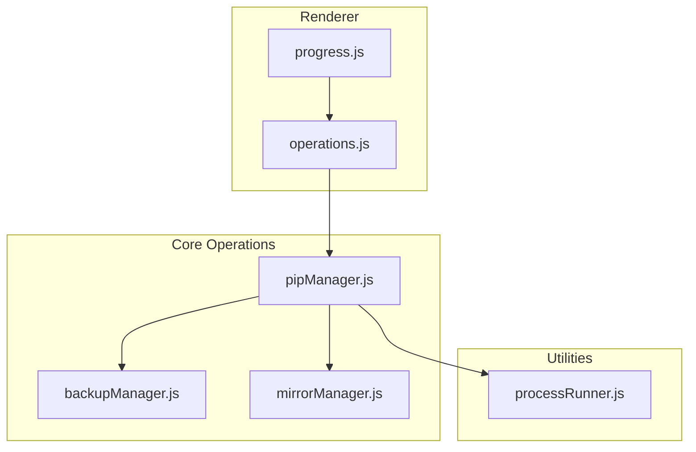
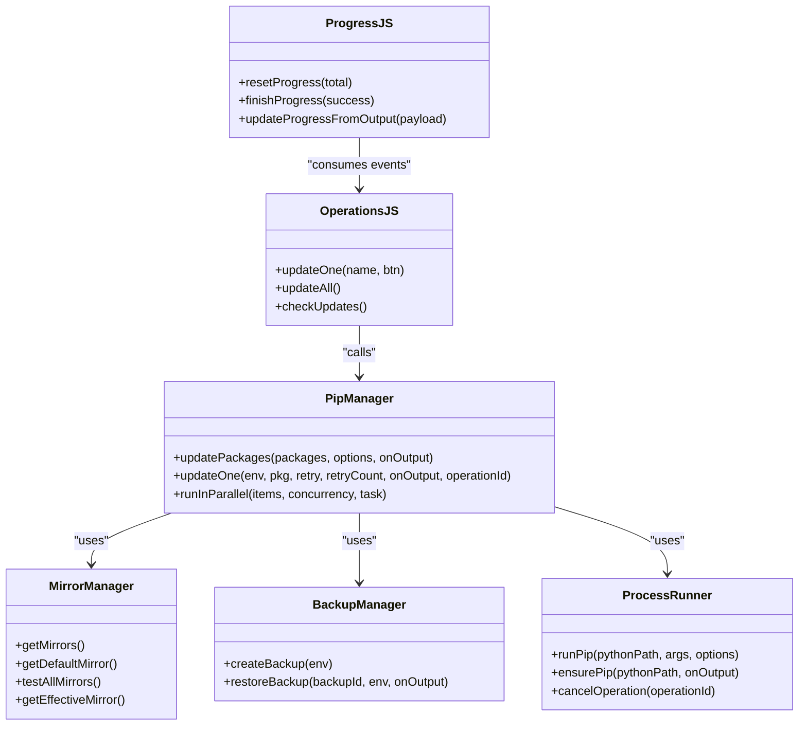

# Package Updates

<cite>
**Referenced Files in This Document**
- [pipManager.js](file://core/operations/pipManager.js)
- [backupManager.js](file://core/operations/backupManager.js)
- [mirrorManager.js](file://core/config/mirrorManager.js)
- [processRunner.js](file://utils/processRunner.js)
- [operations.js](file://renderer/js/operations.js)
- [progress.js](file://renderer/js/progress.js)
</cite>

## Table of Contents
1. [Introduction](#introduction)
2. [Project Structure](#project-structure)
3. [Core Components](#core-components)
4. [Architecture Overview](#architecture-overview)
5. [Detailed Component Analysis](#detailed-component-analysis)
6. [Dependency Analysis](#dependency-analysis)
7. [Performance Considerations](#performance-considerations)
8. [Troubleshooting Guide](#troubleshooting-guide)
9. [Conclusion](#conclusion)
10. [Appendices](#appendices)

## Introduction
This document explains PyLibMaster’s package update functionality with a focus on the updatePackages function and its supporting systems. It covers:
- Individual and bulk updates
- Parallel update processing
- Intelligent retry across multiple mirror sources
- Automatic rollback on update failures
- Outdated package detection, update availability checking, and version comparison logic
- Progress tracking for long-running operations
- Error handling strategies
- Integration with the backup system for safe updates
- Practical examples for single updates, bulk updates, conflict handling, and real-time progress monitoring

## Project Structure
The update feature spans core business logic (pipManager), configuration (mirrorManager), process execution (processRunner), backup management (backupManager), and UI orchestration (operations.js, progress.js).



**Diagram sources**
- [operations.js](file://renderer/js/operations.js)
- [progress.js](file://renderer/js/progress.js)
- [pipManager.js](file://core/operations/pipManager.js)
- [backupManager.js](file://core/operations/backupManager.js)
- [mirrorManager.js](file://core/config/mirrorManager.js)
- [processRunner.js](file://utils/processRunner.js)

**Section sources**
- [pipManager.js](file://core/operations/pipManager.js)
- [backupManager.js](file://core/operations/backupManager.js)
- [mirrorManager.js](file://core/config/mirrorManager.js)
- [processRunner.js](file://utils/processRunner.js)
- [operations.js](file://renderer/js/operations.js)
- [progress.js](file://renderer/js/progress.js)

## Core Components
- pipManager.updatePackages: Orchestrates individual/bulk updates, parallelism, retries, and rollback.
- pipManager.updateOne: Performs per-package update with multi-mirror fallback and “already satisfied” detection.
- pipManager.runInParallel: Concurrency limiter for batch updates.
- mirrorManager: Provides default and ordered mirrors; supports smart routing and speed testing.
- backupManager: Creates and restores backups using pip freeze and force-reinstall.
- processRunner: Executes pip commands with timeouts, cancellation, and output streaming.
- operations.js: UI flow for single/bulk updates, progress display, and refresh after completion.
- progress.js: Parses structured progress events and updates UI counters and status.

**Section sources**
- [pipManager.js](file://core/operations/pipManager.js)
- [mirrorManager.js](file://core/config/mirrorManager.js)
- [backupManager.js](file://core/operations/backupManager.js)
- [processRunner.js](file://utils/processRunner.js)
- [operations.js](file://renderer/js/operations.js)
- [progress.js](file://renderer/js/progress.js)

## Architecture Overview
The update workflow integrates UI actions, backend orchestration, mirror selection, subprocess execution, and safety via backups.

```mermaid
sequenceDiagram
participant UI as "operations.js"
participant PM as "pipManager.js"
participant MM as "mirrorManager.js"
participant BR as "backupManager.js"
participant PR as "processRunner.js"
UI->>PM : updatePackages(packages, options, onOutput)
PM->>PR : ensurePip(env.path)
alt autoRollback enabled
PM->>BR : createBackup(env)
BR-->>PM : {id, path}
end
opt parallel mode
PM->>PM : runInParallel(packages, threads, task)
else sequential
loop per package
PM->>MM : getMirrors(), getDefaultMirror()
PM->>PR : runPip(["install", "--upgrade", pkg, ...])
PR-->>PM : stdout/stderr or error
alt no newer version on mirror
PM->>PM : throw error to try next mirror
end
end
end
alt failure and rollback enabled
PM->>BR : restoreBackup(id, env, onOutput)
end
PM-->>UI : {updated, failed, operationId}
```

**Diagram sources**
- [pipManager.js](file://core/operations/pipManager.js)
- [mirrorManager.js](file://core/config/mirrorManager.js)
- [backupManager.js](file://core/operations/backupManager.js)
- [processRunner.js](file://utils/processRunner.js)
- [operations.js](file://renderer/js/operations.js)

## Detailed Component Analysis

### updatePackages Function
Responsibilities:
- Validates environment and package names.
- Ensures pip is available.
- Optionally creates a backup for automatic rollback.
- Executes updates sequentially or in parallel based on options.
- Tracks updated and failed packages, emits structured progress events.
- On failure with rollback enabled, restores from backup and logs the event.

Key behaviors:
- Parallel mode uses a concurrency-limited worker pool.
- Each package update invokes updateOne which tries multiple mirrors.
- Structured progress events are emitted per package success/failure.
- Logs action outcomes and returns results to the caller.

**Section sources**
- [pipManager.js](file://core/operations/pipManager.js)

#### updateOne Function
Responsibilities:
- Builds mirror order starting with the default mirror.
- Attempts update via pip install --upgrade with index-url when needed.
- Detects “Requirement already satisfied” to avoid false positives.
- Retries across mirrors up to a configured limit.

Error handling:
- Throws an error if no mirror succeeds, propagating to updatePackages for potential rollback.

**Section sources**
- [pipManager.js](file://core/operations/pipManager.js)

#### runInParallel Function
Responsibilities:
- Implements a bounded concurrency queue.
- Distributes tasks among workers until all items are processed.

Complexity:
- Time complexity depends on I/O-bound pip operations; concurrency improves throughput while respecting limits.

**Section sources**
- [pipManager.js](file://core/operations/pipManager.js)

### Mirror Management and Intelligent Retry
- Default mirror is selected first; additional mirrors are tried in order.
- Smart route can pick the fastest mirror based on HEAD requests to a known package page.
- Speed tests are cached per mirror entry; best mirror selection sorts by measured latency.

Integration points:
- updateOne constructs args with --index-url for non-default mirrors.
- writePipConfig writes global pip config for consistent behavior.

**Section sources**
- [mirrorManager.js](file://core/config/mirrorManager.js)
- [pipManager.js](file://core/operations/pipManager.js)

### Backup System Integration
- Before updates, a backup file is created via pip freeze.
- On failure with rollback enabled, restoreBackup reinstalls exact versions using --force-reinstall --no-deps.
- Backup IDs are validated to prevent path traversal attacks.

Safety guarantees:
- Rollback restores the environment to the pre-update state.
- Logs include details about rollback triggers.

**Section sources**
- [backupManager.js](file://core/operations/backupManager.js)
- [pipManager.js](file://core/operations/pipManager.js)

### Process Execution and Cancellation
- All pip commands are executed via processRunner.runPip, which wraps child processes with UTF-8 encoding, ANSI stripping, timeouts, and cancellation support.
- Operation-level cancellation cancels all child processes associated with an operationId.

Timeout strategy:
- SIGTERM followed by SIGKILL after a delay ensures robust termination.

**Section sources**
- [processRunner.js](file://utils/processRunner.js)
- [pipManager.js](file://core/operations/pipManager.js)

### Outdated Package Detection and Version Comparison
- listOutdated retrieves outdated packages via pip list --outdated --format=json.
- The renderer displays these in the update table and allows selection for bulk updates.
- Version comparison is handled by pip; PyLibMaster relies on pip’s outdated detection rather than implementing custom semantic versioning.

Notes:
- diffRequirements compares two sources but does not perform semantic version comparisons; it flags differences where versions differ.

**Section sources**
- [pipManager.js](file://core/operations/pipManager.js)
- [operations.js](file://renderer/js/operations.js)

### Progress Tracking System
- Structured progress events are emitted as “[PROGRESS] {done:1, pkg, status}”.
- The renderer parses these to increment counters and update percentages.
- For operations without structured events, fallback parsing infers completion from pip output.
- Real-time feedback includes current package name and percentage.

**Section sources**
- [pipManager.js](file://core/operations/pipManager.js)
- [progress.js](file://renderer/js/progress.js)

### UI Orchestration for Updates
- updateOne(name, btn): Single package update flow with progress card and toast notifications.
- updateAll(): Bulk update flow that selects checked packages or defaults to all outdated packages.
- checkUpdates(): Refreshes outdated list and re-renders tables.

Error handling:
- Shows toast messages for success/failure.
- Clears selections and resets progress state after completion.

**Section sources**
- [operations.js](file://renderer/js/operations.js)

## Dependency Analysis


**Diagram sources**
- [pipManager.js](file://core/operations/pipManager.js)
- [mirrorManager.js](file://core/config/mirrorManager.js)
- [backupManager.js](file://core/operations/backupManager.js)
- [processRunner.js](file://utils/processRunner.js)
- [operations.js](file://renderer/js/operations.js)
- [progress.js](file://renderer/js/progress.js)

**Section sources**
- [pipManager.js](file://core/operations/pipManager.js)
- [mirrorManager.js](file://core/config/mirrorManager.js)
- [backupManager.js](file://core/operations/backupManager.js)
- [processRunner.js](file://utils/processRunner.js)
- [operations.js](file://renderer/js/operations.js)
- [progress.js](file://renderer/js/progress.js)

## Performance Considerations
- Parallel updates: Use runInParallel with a reasonable concurrency limit to maximize throughput without overwhelming I/O.
- Mirror selection: Prefer default mirror first; enable smart route for environments with unstable connectivity.
- Timeout settings: Long-running pip operations have generous timeouts; adjust only if necessary.
- Caching: EnsurePip caches readiness to reduce repeated checks.
- Disk scanning: Size estimation functions cache directory sizes to avoid repeated scans.

[No sources needed since this section provides general guidance]

## Troubleshooting Guide
Common issues and resolutions:
- No Python environment selected: Ensure a valid environment is active before running updates.
- pip not available: ensurePip attempts ensurepip then get-pip.py; verify network access and permissions.
- Update fails due to “Requirement already satisfied”: updateOne treats this as no-op on that mirror and tries the next mirror.
- Network errors or timeouts: Mirrors are retried automatically; consider enabling smart route or adding faster mirrors.
- Dependency conflicts: Use checkConflicts to identify broken requirements; resolve conflicts before updating.
- Rollback triggered: If rollback occurs, inspect logs to understand which package caused failure and why.

Operational tips:
- Monitor structured progress events for accurate counts.
- Use cancelCurrentOperation to stop long-running updates.
- After updates, refresh both installed and outdated lists to maintain consistency.

**Section sources**
- [pipManager.js](file://core/operations/pipManager.js)
- [processRunner.js](file://utils/processRunner.js)
- [operations.js](file://renderer/js/operations.js)
- [progress.js](file://renderer/js/progress.js)

## Conclusion
PyLibMaster’s update system provides robust, safe, and user-friendly package updates through:
- Flexible single and bulk update workflows
- Parallel processing with controlled concurrency
- Intelligent mirror-based retries
- Automatic rollback via backups
- Reliable progress tracking and clear error handling

These features collectively ensure efficient and dependable updates even in challenging network conditions.

[No sources needed since this section summarizes without analyzing specific files]

## Appendices

### Practical Examples

- Updating a single package:
  - Call updateOne(name, btn) from the UI; it sets progress, calls api.updatePackages([name], options), and refreshes data upon success.

- Performing bulk updates:
  - Call updateAll(); if no packages are selected, it defaults to all outdated packages. Options include parallel, retry, and rollback toggles.

- Handling update conflicts:
  - Run checkConflicts to detect dependency issues; resolve conflicts before attempting updates to minimize failures.

- Monitoring update progress with real-time feedback:
  - The renderer listens for structured [PROGRESS] events and updates the progress card, including percentage, count, and current package name.

**Section sources**
- [operations.js](file://renderer/js/operations.js)
- [progress.js](file://renderer/js/progress.js)
- [pipManager.js](file://core/operations/pipManager.js)