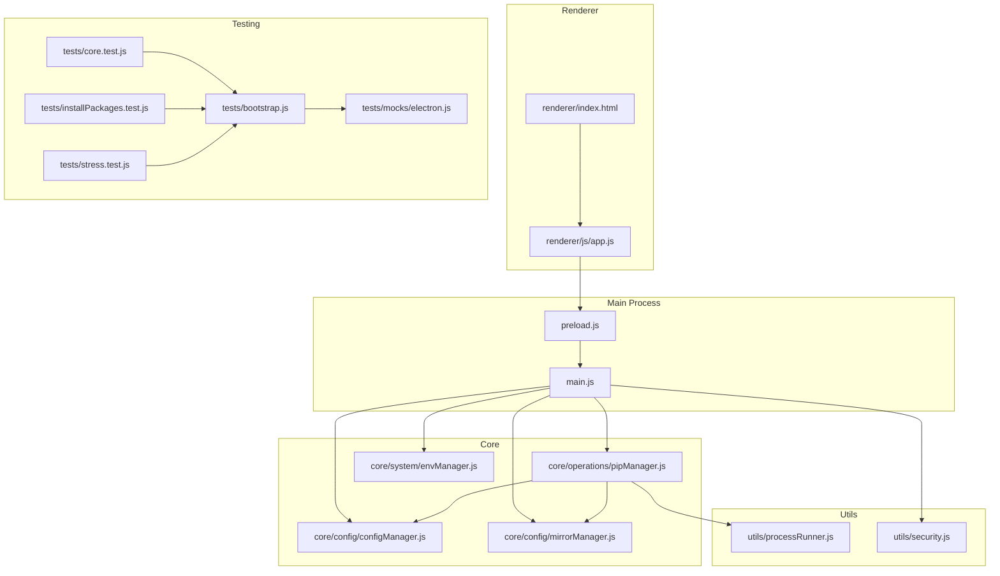
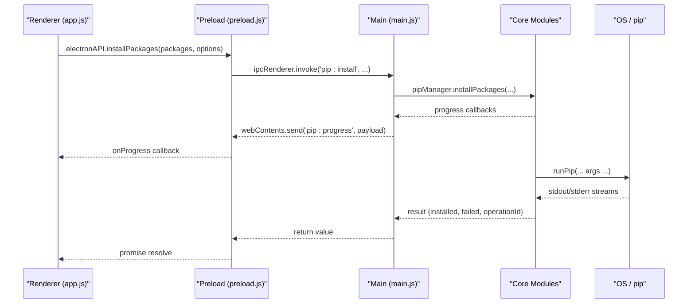
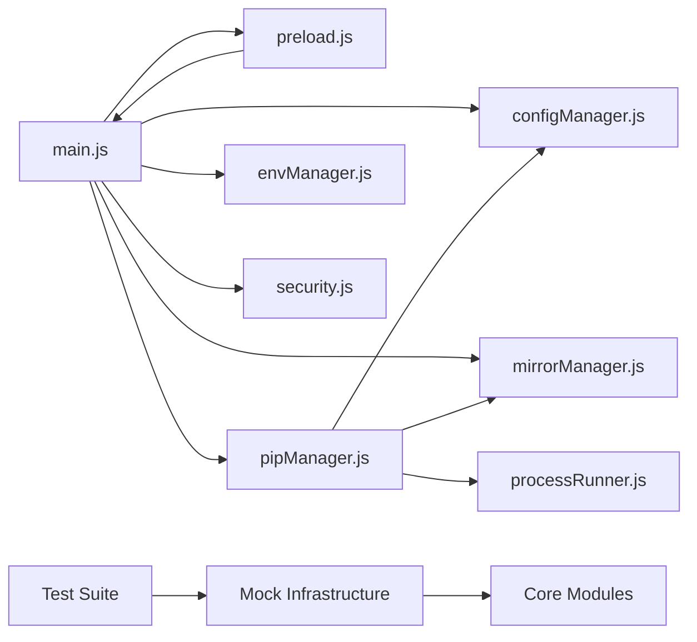
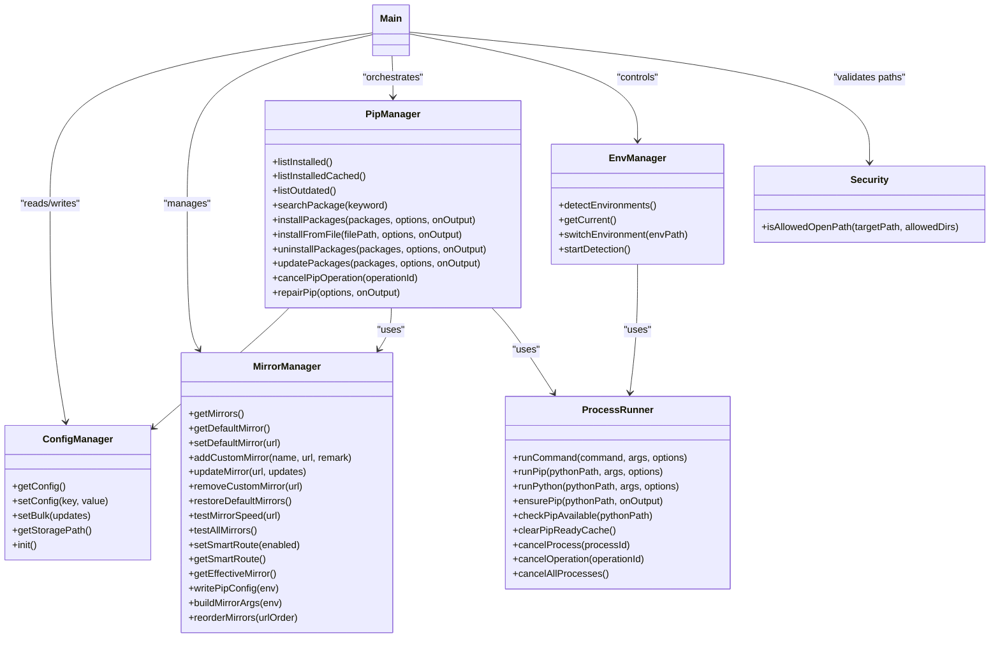

# Development Guide

<cite>
**Referenced Files in This Document**
- [package.json](file://package.json)
- [main.js](file://main.js)
- [preload.js](file://preload.js)
- [renderer/index.html](file://renderer/index.html)
- [renderer/js/app.js](file://renderer/js/app.js)
- [.github/workflows/ci.yml](file://.github/workflows/ci.yml)
- [core/config/configManager.js](file://core/config/configManager.js)
- [core/config/mirrorManager.js](file://core/config/mirrorManager.js)
- [core/operations/pipManager.js](file://core/operations/pipManager.js)
- [utils/processRunner.js](file://utils/processRunner.js)
- [utils/security.js](file://utils/security.js)
- [core/system/envManager.js](file://core/system/envManager.js)
- [tests/bootstrap.js](file://tests/bootstrap.js)
- [tests/core.test.js](file://tests/core.test.js)
- [tests/installPackages.test.js](file://tests/installPackages.test.js)
- [tests/stress.test.js](file://tests/stress.test.js)
- [tests/mocks/electron.js](file://tests/mocks/electron.js)
</cite>

## Update Summary
**Changes Made**
- Added comprehensive testing infrastructure section with Node.js built-in test runner details
- Updated Testing Strategy section with detailed mock framework and Electron mocking capabilities
- Added Stress Testing Suite documentation with 948+ lines of comprehensive coverage
- Enhanced Testing Environment Setup with bootstrap configuration and mock management
- Updated CI/CD Pipeline to reflect Node.js 24 requirement and comprehensive test execution

## Table of Contents
1. Introduction
2. Project Structure
3. Core Components
4. Architecture Overview
5. Detailed Component Analysis
6. Dependency Analysis
7. Performance Considerations
8. Troubleshooting Guide
9. Conclusion
10. Appendices

## Introduction
This guide documents how to set up the development environment, build and distribute PyLibMaster, understand its architecture, and extend it with custom plugins, templates, and mirror sources. It also covers coding conventions, comprehensive testing strategies with Node.js built-in test runner, CI/CD configuration, deployment procedures, and debugging techniques.

## Project Structure
PyLibMaster is an Electron application with a clear separation between:
- Main process (Node.js): window management, IPC handlers, lifecycle, and orchestration of core modules
- Preload bridge: secure exposure of main process APIs to the renderer via contextBridge
- Renderer (HTML/CSS/JS): UI pages, state, and user interactions
- Core modules: business logic for pip operations, environment detection, mirrors, config, logging, backup, audit, scheduler, templates, undo, and explorer integration
- Utilities: process runner, security helpers
- **Testing infrastructure**: comprehensive test suite with Node.js built-in test runner, mock frameworks, and stress testing capabilities



**Diagram sources**
- [main.js](file://main.js)
- [preload.js](file://preload.js)
- [renderer/index.html](file://renderer/index.html)
- [renderer/js/app.js](file://renderer/js/app.js)
- [core/config/configManager.js](file://core/config/configManager.js)
- [core/config/mirrorManager.js](file://core/config/mirrorManager.js)
- [core/operations/pipManager.js](file://core/operations/pipManager.js)
- [core/system/envManager.js](file://core/system/envManager.js)
- [utils/processRunner.js](file://utils/processRunner.js)
- [utils/security.js](file://utils/security.js)
- [tests/bootstrap.js](file://tests/bootstrap.js)
- [tests/core.test.js](file://tests/core.test.js)
- [tests/installPackages.test.js](file://tests/installPackages.test.js)
- [tests/stress.test.js](file://tests/stress.test.js)
- [tests/mocks/electron.js](file://tests/mocks/electron.js)

**Section sources**
- [package.json](file://package.json)
- [main.js](file://main.js)
- [renderer/index.html](file://renderer/index.html)

## Core Components
- Main process entrypoint manages windows, tray, theme sync, auto-update checks, and registers all IPC handlers that route requests to core modules.
- Preload script exposes a typed API surface to the renderer using contextBridge, ensuring no direct Node access from the renderer.
- Config manager persists app settings with validation and atomic writes.
- Mirror manager maintains built-in and custom PyPI mirrors, supports speed tests, smart routing, and writing pip configs.
- Pip manager implements safe package operations (install/uninstall/update), caching, rollback, parallelism, and progress reporting.
- Environment manager detects Python installations, resolves versions, and switches active environments.
- Process runner executes commands safely with timeouts, cancellation, ANSI stripping, and pip auto-installation.
- Security utilities enforce path allowlists to prevent traversal attacks.
- **Testing infrastructure**: comprehensive test suite with Node.js built-in test runner, sophisticated mocking framework, and stress testing capabilities.

**Section sources**
- [main.js](file://main.js)
- [preload.js](file://preload.js)
- [core/config/configManager.js](file://core/config/configManager.js)
- [core/config/mirrorManager.js](file://core/config/mirrorManager.js)
- [core/operations/pipManager.js](file://core/operations/pipManager.js)
- [core/system/envManager.js](file://core/system/envManager.js)
- [utils/processRunner.js](file://utils/processRunner.js)
- [utils/security.js](file://utils/security.js)

## Architecture Overview
The application follows a standard Electron pattern:
- Renderer calls window.electronAPI methods exposed by preload
- Preload forwards calls via ipcRenderer.invoke to main process handlers
- Main delegates to core modules; long-running tasks emit progress events back to renderer via webContents.send



**Diagram sources**
- [renderer/js/app.js](file://renderer/js/app.js)
- [preload.js](file://preload.js)
- [main.js](file://main.js)
- [core/operations/pipManager.js](file://core/operations/pipManager.js)
- [utils/processRunner.js](file://utils/processRunner.js)

## Detailed Component Analysis

### Development Environment Setup
- Node.js: Use Node.js 24.x as configured in CI.
- Dependencies: Install via npm ci or npm install.
- Scripts:
  - Start: npm start
  - Test: npm test (runs comprehensive test suite with Node.js built-in test runner)
  - Build: npm run build (electron-builder)
  - Dist Windows: npm run dist

**Section sources**
- [package.json](file://package.json)
- [.github/workflows/ci.yml](file://.github/workflows/ci.yml)

### Coding Conventions
- IPC naming: channel names use domain:action format (e.g., pip:install, mirror:testAll).
- Error handling: throw descriptive errors; log failures through logManager where available.
- Safety: validate inputs with regexes and allowlists; sanitize paths and URLs.
- Progress: emit structured progress events for long-running operations.
- Configuration: use configManager for persistence; batch updates when possible.

**Section sources**
- [main.js](file://main.js)
- [core/operations/pipManager.js](file://core/operations/pipManager.js)
- [core/config/configManager.js](file://core/config/configManager.js)

### Testing Strategy

**Updated** Comprehensive testing infrastructure implemented with Node.js built-in test runner, including sophisticated mocking capabilities and stress testing suite.

#### Testing Framework and Setup
- **Framework**: Node.js built-in test runner (`node:test`) invoked via `npm test`
- **Bootstrap**: Tests bootstrap via `./tests/bootstrap.js` which pre-loads Electron mocks
- **Scope**: Unit tests under `tests/**/*.test.js`, stress tests in `tests/stress/` directory
- **CI**: Runs on Windows latest with Node 24, installs dependencies, then runs comprehensive test suite

#### Mock Infrastructure
- **Electron Mocking**: Complete Electron API mocking via `tests/mocks/electron.js`
- **Module Interception**: Sophisticated `require.cache` manipulation for dependency injection
- **State Management**: Centralized mock state management with reset and cleanup functions
- **Dependency Mocking**: Mocks for processRunner, envManager, configManager, mirrorManager, backupManager, and logManager

#### Test Categories
- **Core Functionality Tests**: Package specification building, backup ID validation, security path validation
- **Package Installation Tests**: Comprehensive install/uninstall/update scenarios with retry logic
- **Stress Testing Suite**: 948+ lines covering edge cases, concurrent operations, memory management, and security boundaries
- **Security Validation**: Extensive input validation testing for package names, versions, paths, and URLs

#### Test Execution
```bash
# Run all tests
npm test

# Run specific test file
node --require ./tests/bootstrap.js --test tests/core.test.js

# Run stress tests only
node --require ./tests/bootstrap.js --test tests/stress.test.js
```

**Section sources**
- [package.json](file://package.json)
- [.github/workflows/ci.yml](file://.github/workflows/ci.yml)
- [tests/bootstrap.js](file://tests/bootstrap.js)
- [tests/core.test.js](file://tests/core.test.js)
- [tests/installPackages.test.js](file://tests/installPackages.test.js)
- [tests/stress.test.js](file://tests/stress.test.js)
- [tests/mocks/electron.js](file://tests/mocks/electron.js)

### Build and Distribution (electron-builder)
- App ID and product name defined in package.json build section.
- Output directory: dist.
- Windows target: NSIS installer x64 with signing flags and desktop/start menu shortcuts.
- Publish: GitHub provider configured for releases.
- Electron download mirror configured for faster downloads in constrained networks.

**Section sources**
- [package.json](file://package.json)

### CI/CD Pipeline

**Updated** Enhanced CI pipeline with comprehensive testing and Node.js 24 support.

- Triggers: push to main/master and pull requests.
- Jobs:
  - Test: checkout, setup Node 24, npm ci, npm test (runs full test suite)
  - Build: depends on test, builds installer, uploads .exe artifact.

**Section sources**
- [.github/workflows/ci.yml](file://.github/workflows/ci.yml)

### Deployment Procedures
- Build locally: npm run build produces installer artifacts in dist.
- Release: publish artifacts to GitHub Releases using configured provider.
- Auto-updates: handled by electron-updater; check and install flows exposed via IPC.

**Section sources**
- [package.json](file://package.json)
- [main.js](file://main.js)

### Extension Points
- Custom Plugins: Extend functionality by adding new IPC handlers in main.js and corresponding wrappers in preload.js. Keep business logic in core/modules following existing patterns.
- Templates: Manage project templates via templateManager; add custom templates through template:add and create environments via template:create.
- Mirror Sources: Add or update mirrors via mirror:addCustom, mirror:update, mirror:reorder; enable smart routing with mirror:smartRoute.

**Section sources**
- [main.js](file://main.js)
- [preload.js](file://preload.js)
- [core/config/mirrorManager.js](file://core/config/mirrorManager.js)

### Debugging the Application
- Renderer console: open DevTools in the browser-like renderer to inspect logs and network.
- Main process logs: review logs exported via log:export (CSV/Markdown) and stored in storagePath.
- IPC tracing: add console logs in main.js handlers to trace request/response payloads.
- Process debugging: use processRunner's onOutput to capture stdout/stderr during pip operations.
- Cancellation: cancel ongoing operations via pip:cancel with operationId.

**Section sources**
- [main.js](file://main.js)
- [utils/processRunner.js](file://utils/processRunner.js)
- [core/operations/pipManager.js](file://core/operations/pipManager.js)

## Dependency Analysis
High-level dependency relationships:
- main.js orchestrates core modules and exposes IPC handlers.
- preload.js bridges renderer to main via ipcRenderer.invoke.
- pipManager depends on processRunner, mirrorManager, configManager, envManager, and backupManager.
- mirrorManager reads/writes config and uses processRunner for pip config generation.
- envManager uses processRunner to detect Python and pip versions.
- security.js provides path validation used by main for safe file operations.
- **Testing infrastructure**: comprehensive mock system for isolating dependencies during testing.



**Diagram sources**
- [main.js](file://main.js)
- [preload.js](file://preload.js)
- [core/config/configManager.js](file://core/config/configManager.js)
- [core/config/mirrorManager.js](file://core/config/mirrorManager.js)
- [core/operations/pipManager.js](file://core/operations/pipManager.js)
- [core/system/envManager.js](file://core/system/envManager.js)
- [utils/processRunner.js](file://utils/processRunner.js)
- [utils/security.js](file://utils/security.js)
- [tests/bootstrap.js](file://tests/bootstrap.js)
- [tests/mocks/electron.js](file://tests/mocks/electron.js)

**Section sources**
- [main.js](file://main.js)
- [core/operations/pipManager.js](file://core/operations/pipManager.js)
- [core/config/mirrorManager.js](file://core/config/mirrorManager.js)
- [core/system/envManager.js](file://core/system/envManager.js)
- [utils/processRunner.js](file://utils/processRunner.js)
- [utils/security.js](file://utils/security.js)

## Performance Considerations
- Caching:
  - Installed packages list cached for 5 minutes to reduce repeated scans.
  - site-packages path cached per Python executable with TTL.
- Parallelism:
  - Install/update support configurable thread counts; respects environment locks to avoid conflicts.
- I/O:
  - Atomic config writes via temp file rename to prevent corruption.
  - Log flushing on shutdown to avoid data loss.
- Network:
  - Mirror speed tests and smart routing minimize latency.
  - Electron download mirror configured for faster dependency fetch.
- **Testing Performance**: Stress tests validate concurrent operations, memory usage, and resource cleanup.

[No sources needed since this section provides general guidance]

## Troubleshooting Guide
Common issues and resolutions:
- pip not found: ensurePip attempts ensurepip and get-pip.py fallback; verify Python installation and PATH.
- Permission errors on config/log paths: ensure write access to userData and storagePath directories.
- Slow downloads: configure alternative mirrors or enable smart routing; test speeds via mirror:testAll.
- Operation hangs: cancel via pip:cancel with operationId; check processRunner timeout behavior.
- Path traversal blocked: only allowed directories are permitted for opening files; adjust allowedDirs if necessary.
- **Test failures**: Check mock state initialization, ensure proper module isolation, verify Electron mock configuration.

**Section sources**
- [utils/processRunner.js](file://utils/processRunner.js)
- [core/config/configManager.js](file://core/config/configManager.js)
- [core/config/mirrorManager.js](file://core/config/mirrorManager.js)
- [core/operations/pipManager.js](file://core/operations/pipManager.js)
- [utils/security.js](file://utils/security.js)

## Conclusion
PyLibMaster provides a robust, secure, and extensible Electron-based Python library management tool with comprehensive testing infrastructure. By following the development setup, adhering to coding conventions, leveraging the provided extension points, utilizing the extensive test suite with Node.js built-in test runner, and employing CI/CD and distribution tools, contributors can efficiently develop, test, and release features while maintaining reliability and performance.

[No sources needed since this section summarizes without analyzing specific files]

## Appendices

### API Surface Summary (Renderer → Main IPC)
Key channels exposed via preload:
- Window control: window:minimize, window:maximize, window:close
- Environment: env:detect, env:getCurrent, env:switch
- Virtual environments: venv:create, venv:list, venv:delete, venv:info
- Package operations: pip:list, pip:listCached, pip:outdated, pip:search, pip:showInfo, pip:depTree, pip:export, pip:import, pip:compareEnvs
- Install/uninstall/update: pip:install, pip:installFromFile, pip:uninstall, pip:update, pip:cancel, pip:repair
- Backup: backup:create, backup:list, backup:restore, backup:delete
- Mirrors: mirror:list, mirror:test, mirror:testAll, mirror:setDefault, mirror:addCustom, mirror:update, mirror:removeCustom, mirror:restoreDefaults, mirror:smartRoute, mirror:getSmartRoute, mirror:writePipConfig, mirror:reorder
- Logs: log:get, log:clear, log:add, log:export
- Config: config:get, config:set, config:setBulk
- Updater: updater:check, updater:install
- System: system:version, system:browseDirectory, system:browseFile, system:openPath
- Notifications: notify:send
- Scheduler: scheduler:getStatus, scheduler:save, scheduler:runNow
- Templates/snapshots: template:list, template:add, template:remove, template:create, snapshot:create, snapshot:list, snapshot:detail, snapshot:restore, snapshot:delete
- Audit: audit:run, audit:cached
- Tools: pip:diskUsage, pip:download, pip:diffRequirements, pip:releases, pip:depGraph
- Undo: undo:canUndo, undo:perform, undo:clear
- Explorer: explorer:getStatus, explorer:enable, explorer:disable

**Section sources**
- [preload.js](file://preload.js)
- [main.js](file://main.js)

### Class Relationships (Core Modules)


**Diagram sources**
- [core/config/configManager.js](file://core/config/configManager.js)
- [core/config/mirrorManager.js](file://core/config/mirrorManager.js)
- [core/operations/pipManager.js](file://core/operations/pipManager.js)
- [core/system/envManager.js](file://core/system/envManager.js)
- [utils/processRunner.js](file://utils/processRunner.js)
- [utils/security.js](file://utils/security.js)
- [main.js](file://main.js)

### Testing Infrastructure Details

**Updated** Comprehensive testing framework with Node.js built-in test runner and sophisticated mocking capabilities.

#### Test File Structure
- `tests/bootstrap.js`: Bootstrap configuration for Electron mocking
- `tests/core.test.js`: Core functionality tests (145 lines)
- `tests/installPackages.test.js`: Package installation scenarios (270 lines)
- `tests/stress.test.js`: Comprehensive stress testing (948 lines)
- `tests/mocks/electron.js`: Complete Electron API mocking

#### Mock Infrastructure Features
- **Module Interception**: Uses `require.cache` manipulation for dependency injection
- **State Management**: Centralized mock state with reset and cleanup functions
- **Dependency Isolation**: Complete isolation of external dependencies during testing
- **Real-time Monitoring**: Captures function calls, parameters, and return values

#### Stress Testing Coverage
- **Security Validation**: 30+ attack vectors for package names, versions, paths, and URLs
- **Concurrent Operations**: Tests for parallel package installation and environment locking
- **Memory Management**: Validates resource cleanup and memory leak prevention
- **Edge Cases**: Handles null inputs, empty arrays, invalid formats, and boundary conditions

**Section sources**
- [tests/bootstrap.js](file://tests/bootstrap.js)
- [tests/core.test.js](file://tests/core.test.js)
- [tests/installPackages.test.js](file://tests/installPackages.test.js)
- [tests/stress.test.js](file://tests/stress.test.js)
- [tests/mocks/electron.js](file://tests/mocks/electron.js)