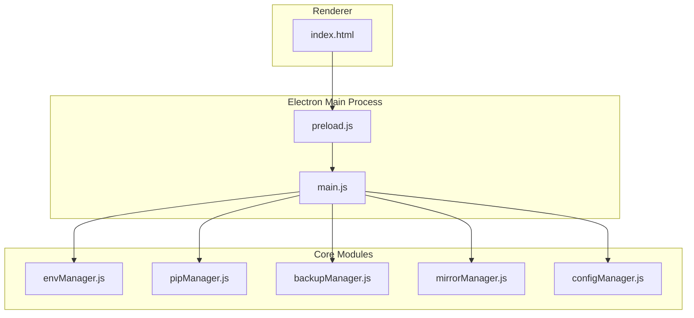
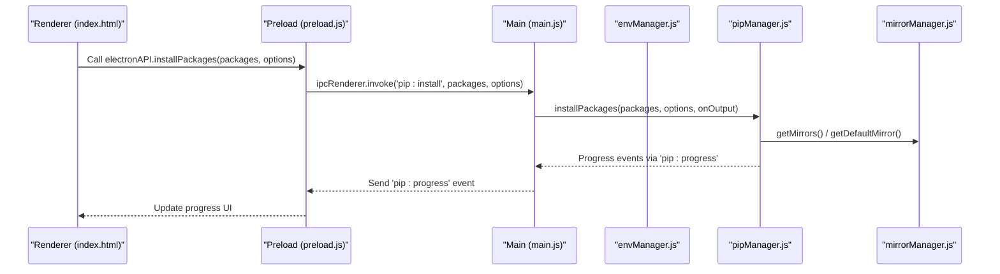
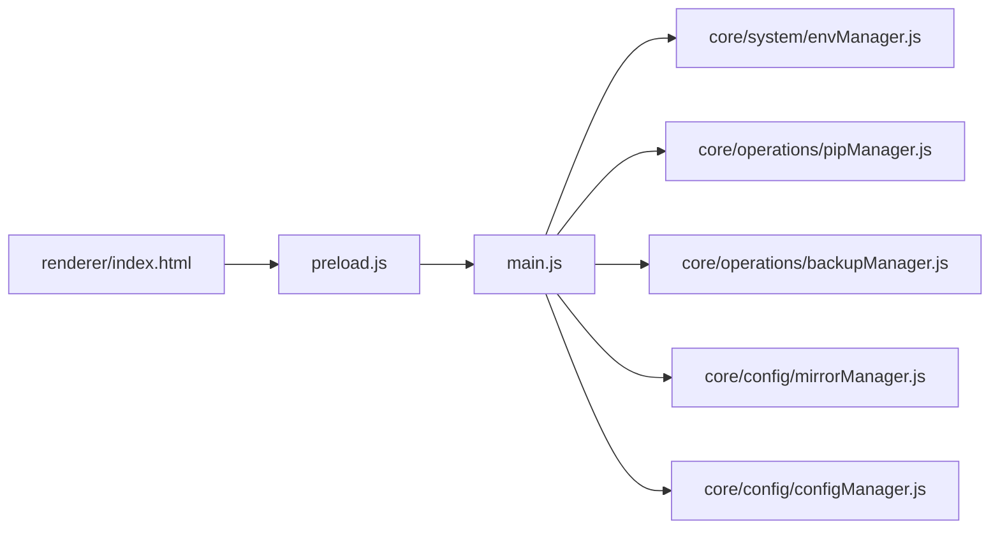

# Getting Started

<cite>
**Referenced Files in This Document**
- [package.json](file://package.json)
- [main.js](file://main.js)
- [preload.js](file://preload.js)
- [index.html](file://renderer/index.html)
- [envManager.js](file://core/system/envManager.js)
- [pipManager.js](file://core/operations/pipManager.js)
- [configManager.js](file://core/config/configManager.js)
- [backupManager.js](file://core/operations/backupManager.js)
- [mirrorManager.js](file://core/config/mirrorManager.js)
- [README.md](file://README.md)
- [ci.yml](file://github/workflows/ci.yml)
</cite>

## Update Summary
**Changes Made**
- Updated Node.js version requirement from >=18 to >=24 in system prerequisites section
- Added reference to CI configuration showing Node.js 24 usage
- Updated installation instructions to reflect new Node.js requirements

## Table of Contents
1. [Introduction](#introduction)
2. [Project Structure](#project-structure)
3. [Core Components](#core-components)
4. [Architecture Overview](#architecture-overview)
5. [Detailed Component Analysis](#detailed-component-analysis)
6. [Dependency Analysis](#dependency-analysis)
7. [Performance Considerations](#performance-considerations)
8. [Troubleshooting Guide](#troubleshooting-guide)
9. [Conclusion](#conclusion)
10. [Appendices](#appendices)

## Introduction
PyLibMaster is a desktop application that provides a graphical interface for Python package management with advanced features such as environment management, backup and rollback, mirror optimization, and more. It wraps pip operations into an intuitive GUI, making it easier to install, uninstall, update, and manage Python packages across multiple environments.

Key capabilities include:
- Installing, uninstalling, and updating packages with progress tracking and cancellation
- Managing multiple Python environments (system, Conda, virtual environments)
- Creating backups and rolling back to previous states
- Optimizing download performance via mirror source selection and smart routing
- Exporting/importing requirements and comparing environments
- Viewing logs, diagnostics, and security audit results

This guide helps you get started quickly on Windows, macOS, and Linux, covering installation, prerequisites, first-time setup, and basic usage.

## Project Structure
PyLibMaster is built with Electron, separating the main process (Node.js), a preload bridge, and the renderer (HTML/CSS/JS). Core business logic resides under core/, utilities under utils/, and the UI under renderer/.



**Diagram sources**
- [main.js](file://main.js)
- [preload.js](file://preload.js)
- [envManager.js](file://core/system/envManager.js)
- [pipManager.js](file://core/operations/pipManager.js)
- [backupManager.js](file://core/operations/backupManager.js)
- [mirrorManager.js](file://core/config/mirrorManager.js)
- [configManager.js](file://core/config/configManager.js)
- [index.html](file://renderer/index.html)

**Section sources**
- [package.json](file://package.json)
- [main.js](file://main.js)
- [preload.js](file://preload.js)
- [index.html](file://renderer/index.html)

## Core Components
- Environment Manager: Detects and switches between Python environments, including system installs and Conda/Miniconda.
- Pip Manager: Executes pip commands for install/uninstall/update, supports parallel execution, retries, and automatic rollback.
- Backup Manager: Creates snapshots using pip freeze and restores environments from backups.
- Mirror Manager: Manages PyPI mirrors, tests speed, and enables smart routing to pick the fastest source.
- Config Manager: Persists application settings and storage paths safely.

These components are exposed to the UI through IPC handlers defined in the main process and bridged via the preload script.

**Section sources**
- [envManager.js](file://core/system/envManager.js)
- [pipManager.js](file://core/operations/pipManager.js)
- [backupManager.js](file://core/operations/backupManager.js)
- [mirrorManager.js](file://core/config/mirrorManager.js)
- [configManager.js](file://core/config/configManager.js)
- [main.js](file://main.js)
- [preload.js](file://preload.js)

## Architecture Overview
The application follows a clear separation of concerns:
- Renderer (UI): HTML/CSS/JS pages for user interactions.
- Preload Bridge: Securely exposes selected APIs to the renderer via contextBridge.
- Main Process: Orchestrates IPC handlers and delegates tasks to core modules.
- Core Modules: Implement business logic for environment, pip, backup, mirrors, and configuration.



**Diagram sources**
- [index.html](file://renderer/index.html)
- [preload.js](file://preload.js)
- [main.js](file://main.js)
- [pipManager.js](file://core/operations/pipManager.js)
- [mirrorManager.js](file://core/config/mirrorManager.js)

## Detailed Component Analysis

### Installation and First Launch
- Install Node.js if not present; then run the app using the provided scripts or build a distribution.
- On first launch, the app creates default configuration and attempts to detect Python environments.
- If no Python is found, use the "Environment" page to add or repair pip.

What happens behind the scenes:
- The main process initializes the window and starts background detection for Python environments.
- Configuration is loaded or created with defaults (theme, language, storage path, threads, retry count, smart route).
- The UI shows environment status and guides you to select or switch environments.

**Section sources**
- [package.json](file://package.json)
- [main.js](file://main.js)
- [configManager.js](file://core/config/configManager.js)
- [envManager.js](file://core/system/envManager.js)

### Quick Start Tutorial

#### 1. Install Your First Package
- Open the "Install" page.
- Enter a package name (e.g., requests) and click Install.
- Choose version mode (latest, specific, range) and enable options like parallel install, retry, and auto-rollback.
- Watch real-time progress and cancel if needed.

Behind the scenes:
- The UI calls the install API via preload and main IPC.
- pipManager builds safe package specs, ensures pip exists, and runs install with mirror fallback and optional rollback.

**Section sources**
- [index.html](file://renderer/index.html)
- [preload.js](file://preload.js)
- [main.js](file://main.js)
- [pipManager.js](file://core/operations/pipManager.js)

#### 2. Switch Python Environments
- Go to the "Environment" page.
- Select a detected Python environment or create a new virtual environment.
- Optionally repair pip if it's missing or broken.

Behind the scenes:
- envManager scans common paths and PATH entries, gathers versions, and persists the current environment.
- venv creation and deletion are handled via dedicated IPC handlers.

**Section sources**
- [envManager.js](file://core/system/envManager.js)
- [main.js](file://main.js)
- [index.html](file://renderer/index.html)

#### 3. Basic Operations
- Uninstall: Search installed packages, select one or many, and uninstall with safety options.
- Update: Check for updates and update selected packages; view differences and roll back on failure.
- Query: Filter and sort installed packages by name, time, size, and update status.
- Mirror: Test speeds, set default, enable smart routing, and write global pip config.
- Logs: View and export operation logs in CSV or Markdown.

**Section sources**
- [index.html](file://renderer/index.html)
- [pipManager.js](file://core/operations/pipManager.js)
- [mirrorManager.js](file://core/config/mirrorManager.js)
- [main.js](file://main.js)

### System Requirements and Prerequisites
- Operating Systems: Windows, macOS, Linux (Electron-based desktop app).
- Python: At least one working Python installation with pip available.
- **Node.js: Version 24 or higher required for development and building from source.**
- Disk Space: Sufficient space for Python environments and package caches.

**Updated** The Node.js version requirement has been updated from >=18 to >=24 to support the latest Electron v31 compatibility and improved performance features.

Notes:
- The app detects Python executables and validates pip availability.
- Storage paths for logs and backups are managed automatically under the configured storage directory.
- For development purposes, ensure your Node.js environment meets the minimum version requirement.

**Section sources**
- [envManager.js](file://core/system/envManager.js)
- [configManager.js](file://core/config/configManager.js)
- [README.md](file://README.md)
- [ci.yml](file://github/workflows/ci.yml)

### Initial Configuration Setup
- Theme and Language: Set your preferred theme (light/dark/system) and language.
- Storage Path: Configure where logs and backups are stored.
- Parallel Threads and Retry Count: Tune performance based on your hardware and network conditions.
- Smart Route: Enable automatic selection of the fastest mirror source.

Configuration is persisted safely with atomic writes and validation.

**Section sources**
- [configManager.js](file://core/config/configManager.js)
- [main.js](file://main.js)

## Dependency Analysis
The following diagram shows how the UI interacts with the main process and core modules through IPC:



**Diagram sources**
- [index.html](file://renderer/index.html)
- [preload.js](file://preload.js)
- [main.js](file://main.js)
- [envManager.js](file://core/system/envManager.js)
- [pipManager.js](file://core/operations/pipManager.js)
- [backupManager.js](file://core/operations/backupManager.js)
- [mirrorManager.js](file://core/config/mirrorManager.js)
- [configManager.js](file://core/config/configManager.js)

**Section sources**
- [main.js](file://main.js)
- [preload.js](file://preload.js)

## Performance Considerations
- Parallel Installation: Increase thread count for faster multi-package installs; balance against CPU and I/O limits.
- Caching: Installed package lists are cached briefly to reduce repeated scans.
- Mirror Optimization: Use smart routing to automatically choose the fastest mirror; test all mirrors to see latency.
- Rollback Safety: Automatic rollback minimizes downtime after failures but adds overhead due to backup creation.

[No sources needed since this section provides general guidance]

## Troubleshooting Guide

Common issues and resolutions:
- No Python Detected:
  - Ensure Python is installed and accessible via PATH.
  - Use the "Environment" page to repair pip or add a custom Python executable.
- Pip Not Found or Broken:
  - Use the "Repair pip" feature to reinitialize pip via ensurepip.
- Slow Downloads:
  - Enable smart routing and test mirrors to find the fastest source.
  - Write global pip config to enforce mirror selection.
- Permission Errors:
  - Run the app with appropriate permissions for writing to storage paths.
  - On Windows, avoid installing into protected directories.
- Conflicts or Health Issues:
  - Use the "Diagnostics" tool to check dependency conflicts and health score.
  - Review logs for detailed error messages.
- **Node.js Version Issues:**
  - Ensure Node.js version 24 or higher is installed for development and building.
  - Use nvm or similar tools to manage Node.js versions if needed.
  - Verify Node.js installation with `node --version` command.

Operational tips:
- Always keep backups enabled when performing risky operations.
- Export requirements before major changes to facilitate restoration.
- Monitor logs and notifications for progress and errors.

**Section sources**
- [envManager.js](file://core/system/envManager.js)
- [pipManager.js](file://core/operations/pipManager.js)
- [backupManager.js](file://core/operations/backupManager.js)
- [mirrorManager.js](file://core/config/mirrorManager.js)
- [index.html](file://renderer/index.html)

## Conclusion
PyLibMaster simplifies Python package management with a powerful GUI, robust environment handling, and advanced features like backup/rollback and mirror optimization. Follow the quick start steps to install your first package, switch environments, and explore core operations. Use the troubleshooting guide to resolve common issues and optimize performance according to your needs.

[No sources needed since this section summarizes without analyzing specific files]

## Appendices

### Platform-Specific Notes
- Windows:
  - Installer targets NSIS x64; ensure compatibility with your system architecture.
  - Default storage path is within the application's userData directory.
- macOS:
  - App may require permission to access certain directories; follow prompts.
  - Global pip config is written to ~/.config/pip/pip.conf.
- Linux:
  - Ensure Python and pip are installed and accessible.
  - Permissions may be required for writing to system directories.

### Development Environment Setup
- **Node.js Requirement**: Version 24 or higher is required for development and building from source.
- **Installation Commands**:
  ```bash
  # Clone repository
  git clone https://github.com/Softheartedyyc/PyLibMaster.git
  cd PyLibMaster
  
  # Install dependencies
  npm install
  
  # Start development server
  npm start
  
  # Build installer
  npm run dist
  ```
- **CI/CD Pipeline**: Uses Node.js 24 in GitHub Actions for consistent builds.

**Section sources**
- [README.md](file://README.md)
- [ci.yml](file://github/workflows/ci.yml)