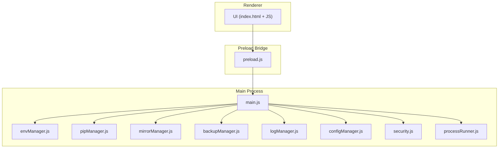
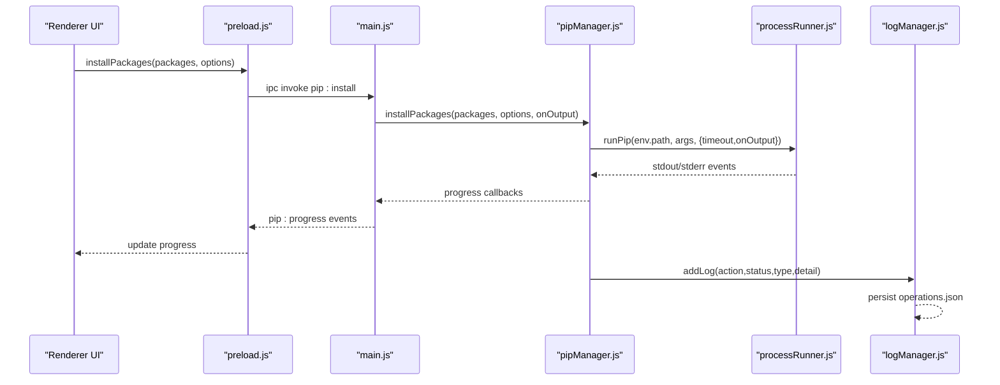
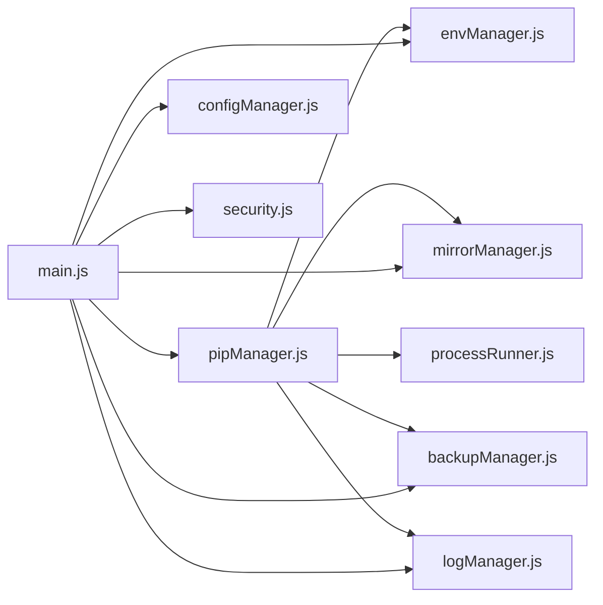

# Troubleshooting & Support

<cite>
**Referenced Files in This Document**
- [main.js](file://main.js)
- [preload.js](file://preload.js)
- [package.json](file://package.json)
- [utils/security.js](file://utils/security.js)
- [core/system/logManager.js](file://core/system/logManager.js)
- [core/system/envManager.js](file://core/system/envManager.js)
- [core/operations/pipManager.js](file://core/operations/pipManager.js)
- [core/config/configManager.js](file://core/config/configManager.js)
- [utils/processRunner.js](file://utils/processRunner.js)
- [core/operations/backupManager.js](file://core/operations/backupManager.js)
- [core/config/mirrorManager.js](file://core/config/mirrorManager.js)
</cite>

## Table of Contents
1. [Introduction](#introduction)
2. [Project Structure](#project-structure)
3. [Core Components](#core-components)
4. [Architecture Overview](#architecture-overview)
5. [Detailed Component Analysis](#detailed-component-analysis)
6. [Dependency Analysis](#dependency-analysis)
7. [Performance Considerations](#performance-considerations)
8. [Troubleshooting Guide](#troubleshooting-guide)
9. [Conclusion](#conclusion)
10. [Appendices](#appendices)

## Introduction
This document provides comprehensive troubleshooting guidance for PyLibMaster, covering Python environment issues, network connectivity problems, permission errors, and package installation failures. It also explains how to analyze logs, use diagnostic tools, perform performance profiling, interpret error messages, and recover from common failures. Security-related topics such as path traversal prevention and command injection protection are included, along with support contacts and community resources.

## Project Structure
PyLibMaster is an Electron application with a clear separation between the main process (Node.js), a preload bridge, and renderer UI. Core modules handle Python environment management, pip operations, configuration, logging, mirrors, backups, and security utilities. The IPC layer exposes safe APIs to the renderer.

**Diagram sources**
- [main.js:1-120](file://main.js#L1-L120)
- [preload.js:1-60](file://preload.js#L1-L60)
- [core/system/envManager.js:1-40](file://core/system/envManager.js#L1-L40)
- [core/operations/pipManager.js:1-60](file://core/operations/pipManager.js#L1-L60)
- [core/config/mirrorManager.js:1-40](file://core/config/mirrorManager.js#L1-L40)
- [core/operations/backupManager.js:1-40](file://core/operations/backupManager.js#L1-L40)
- [core/system/logManager.js:1-40](file://core/system/logManager.js#L1-L40)
- [core/config/configManager.js:1-40](file://core/config/configManager.js#L1-L40)
- [utils/security.js:1-20](file://utils/security.js#L1-L20)
- [utils/processRunner.js:1-40](file://utils/processRunner.js#L1-L40)

**Section sources**
- [main.js:1-120](file://main.js#L1-L120)
- [package.json:1-30](file://package.json#L1-L30)

## Core Components
- Environment Manager: Detects and switches Python environments; validates presence of pip.
- Pip Manager: Executes pip commands with retries, rollback, parallelism, and progress reporting.
- Mirror Manager: Manages PyPI mirror sources, speed testing, and smart routing.
- Backup Manager: Creates and restores environment snapshots using pip freeze.
- Log Manager: Persists structured operation logs with filtering and export.
- Config Manager: Stores application settings with validation and atomic writes.
- Process Runner: Spawns child processes, handles timeouts, cancellation, and ANSI cleanup.
- Security Utilities: Validates paths to prevent traversal and restricts allowed directories.

**Section sources**
- [core/system/envManager.js:1-120](file://core/system/envManager.js#L1-L120)
- [core/operations/pipManager.js:1-120](file://core/operations/pipManager.js#L1-L120)
- [core/config/mirrorManager.js:1-120](file://core/config/mirrorManager.js#L1-L120)
- [core/operations/backupManager.js:1-120](file://core/operations/backupManager.js#L1-L120)
- [core/system/logManager.js:1-120](file://core/system/logManager.js#L1-L120)
- [core/config/configManager.js:1-120](file://core/config/configManager.js#L1-L120)
- [utils/processRunner.js:1-120](file://utils/processRunner.js#L1-L120)
- [utils/security.js:1-43](file://utils/security.js#L1-L43)

## Architecture Overview
The renderer communicates with the main process via IPC through a secure preload bridge. Main process handlers delegate to core modules which orchestrate pip operations, environment checks, and system interactions. Logs and configurations are persisted safely. Network requests go through controlled channels with retry and fallback logic.

**Diagram sources**
- [preload.js:55-70](file://preload.js#L55-L70)
- [main.js:310-340](file://main.js#L310-L340)
- [core/operations/pipManager.js:513-596](file://core/operations/pipManager.js#L513-L596)
- [utils/processRunner.js:340-353](file://utils/processRunner.js#L340-L353)
- [core/system/logManager.js:115-134](file://core/system/logManager.js#L115-L134)

## Detailed Component Analysis

### Python Environment Issues
Symptoms:
- “No Python environment selected”
- pip not found or version detection fails
- Switching environments fails

Root causes:
- No Python executable detected or missing pip
- Incorrect PATH or Windows Store shim conflicts
- Corrupted environment metadata

Diagnostics:
- Use environment detection to list available Python installations and pip versions
- Verify current environment selection and persistence
- Check ensurepip availability and auto-install behavior

Recovery steps:
- Re-run environment detection to refresh cached environments
- Switch to a known-good Python environment
- Ensure pip is present; if missing, allow auto-install via ensurepip or get-pip.py
- Validate that site-packages can be located by pip show

**Section sources**
- [core/system/envManager.js:85-170](file://core/system/envManager.js#L85-L170)
- [core/system/envManager.js:178-209](file://core/system/envManager.js#L178-L209)
- [utils/processRunner.js:233-278](file://utils/processRunner.js#L233-L278)
- [core/operations/pipManager.js:400-427](file://core/operations/pipManager.js#L400-L427)

### Network Connectivity Issues
Symptoms:
- Installation/update/search timeouts
- Mirror connection failures
- Slow downloads

Root causes:
- Proxy/firewall restrictions
- Unreachable or slow mirrors
- DNS resolution failures

Diagnostics:
- Test individual mirror speeds and all mirrors in batch
- Enable smart routing to automatically select fastest mirror
- Write effective mirror config to pip’s global config file

Recovery steps:
- Add or reorder mirrors to prioritize reliable ones
- Disable smart routing if it selects unstable mirrors
- Configure proxy settings at OS level or via pip configuration
- Retry operations with increased timeout and retry count

**Section sources**
- [core/config/mirrorManager.js:219-247](file://core/config/mirrorManager.js#L219-L247)
- [core/config/mirrorManager.js:267-290](file://core/config/mirrorManager.js#L267-L290)
- [core/config/mirrorManager.js:299-322](file://core/config/mirrorManager.js#L299-L322)
- [core/operations/pipManager.js:608-633](file://core/operations/pipManager.js#L608-L633)

### Permission Errors
Symptoms:
- Failed to write logs or config
- Backup creation/restoration fails due to permissions
- Opening files outside allowed directories blocked

Root causes:
- Insufficient privileges for storage path
- Antivirus or enterprise policies blocking writes
- Path traversal protection rejecting unsafe paths

Diagnostics:
- Verify storage directory exists and is writable
- Confirm allowed directories for opening files
- Review log manager flush behavior and error handling

Recovery steps:
- Run the app with elevated privileges if necessary
- Change storagePath to a user-writable location
- Ensure opened paths are within allowed directories (documents/downloads/userData)

**Section sources**
- [core/config/configManager.js:123-138](file://core/config/configManager.js#L123-L138)
- [core/system/logManager.js:72-99](file://core/system/logManager.js#L72-L99)
- [core/operations/backupManager.js:156-170](file://core/operations/backupManager.js#L156-L170)
- [utils/security.js:28-40](file://utils/security.js#L28-L40)
- [main.js:449-466](file://main.js#L449-L466)

### Package Installation Failures
Symptoms:
- Install fails with invalid package name/spec
- Wheel installation rejected due to path issues
- Dependency conflicts or missing build tools

Root causes:
- Malformed package spec or disallowed characters
- Unsafe wheel path (relative, UNC, sensitive directories)
- Missing compilers or incompatible Python/pip versions

Diagnostics:
- Validate package names and version specs
- Inspect wheel filename and absolute path requirements
- Check pip health and dependency conflicts

Recovery steps:
- Correct package spec syntax and length limits
- Provide absolute, safe wheel paths without prohibited components
- Repair pip if corrupted; use ensurepip or get-pip.py
- Resolve conflicts via health check and targeted reinstall

**Section sources**
- [core/operations/pipManager.js:154-235](file://core/operations/pipManager.js#L154-L235)
- [core/operations/pipManager.js:645-730](file://core/operations/pipManager.js#L645-L730)
- [core/operations/pipManager.js:745-789](file://core/operations/pipManager.js#L745-L789)
- [utils/processRunner.js:233-278](file://utils/processRunner.js#L233-L278)

### Log Analysis Techniques
What to look for:
- Operation type and status fields
- Timestamps and action descriptions
- Detail field truncated to max length

How to use:
- Filter logs by type (install/uninstall/update/system)
- Search keywords across action and detail fields
- Export logs to CSV or Markdown for external analysis

Common patterns:
- Repeated failures indicate environment or network issues
- Rollback entries suggest failed operations with automatic recovery
- Flush failures point to storage permission problems

**Section sources**
- [core/system/logManager.js:115-162](file://core/system/logManager.js#L115-L162)
- [core/system/logManager.js:168-176](file://core/system/logManager.js#L168-L176)
- [main.js:485-514](file://main.js#L485-L514)

### Diagnostic Tools Usage
- Health check: Runs diagnostics to detect conflicts and environment state
- Disk usage: Analyzes site-packages size and per-package footprint
- Audit scan: Identifies vulnerable packages and reports findings
- Scheduler: Triggers automated updates and notifications

Usage tips:
- Run health check before major changes
- Use disk usage to identify large or redundant packages
- Schedule audits periodically to maintain security posture

**Section sources**
- [main.js:351-353](file://main.js#L351-L353)
- [main.js:591-592](file://main.js#L591-L592)
- [main.js:580-586](file://main.js#L580-L586)
- [main.js:526-546](file://main.js#L526-L546)

### Performance Profiling Methods
- Parallel threads: Adjust parallelThreads to balance CPU and I/O
- Retry count: Tune retryCount to mitigate transient network issues
- Cache TTLs: Installed cache and site-packages cache reduce repeated scans
- Timeout tuning: Increase timeouts for slow networks or large packages

Profiling approach:
- Monitor progress events to identify bottlenecks
- Compare execution times with different thread counts
- Track mirror latency and adjust smart routing

**Section sources**
- [core/config/configManager.js:22-44](file://core/config/configManager.js#L22-L44)
- [core/operations/pipManager.js:99-127](file://core/operations/pipManager.js#L99-L127)
- [core/operations/pipManager.js:244-266](file://core/operations/pipManager.js#L244-L266)
- [utils/processRunner.js:150-160](file://utils/processRunner.js#L150-L160)

## Dependency Analysis
Key dependencies and relationships:
- main.js orchestrates IPC handlers and delegates to core modules
- pipManager depends on envManager, mirrorManager, backupManager, logManager, and processRunner
- processRunner manages child processes and pip availability
- configManager centralizes settings and storage paths
- security.js enforces path safety for file operations

**Diagram sources**
- [main.js:1-120](file://main.js#L1-L120)
- [core/operations/pipManager.js:1-60](file://core/operations/pipManager.js#L1-L60)
- [core/system/envManager.js:1-40](file://core/system/envManager.js#L1-L40)
- [core/config/mirrorManager.js:1-40](file://core/config/mirrorManager.js#L1-L40)
- [core/operations/backupManager.js:1-40](file://core/operations/backupManager.js#L1-L40)
- [core/system/logManager.js:1-40](file://core/system/logManager.js#L1-L40)
- [core/config/configManager.js:1-40](file://core/config/configManager.js#L1-L40)
- [utils/processRunner.js:1-40](file://utils/processRunner.js#L1-L40)

**Section sources**
- [main.js:1-120](file://main.js#L1-L120)
- [core/operations/pipManager.js:1-120](file://core/operations/pipManager.js#L1-L120)

## Performance Considerations
- Use parallel installation judiciously; too many threads may saturate I/O
- Prefer cached lists for quick UI responses; refresh when needed
- Set appropriate timeouts based on network conditions
- Monitor mirror latency and enable smart routing for optimal throughput
- Limit log field lengths to avoid oversized log files

[No sources needed since this section provides general guidance]

## Troubleshooting Guide

### Common Error Messages and Interpretations
- “No Python environment selected”: Indicates no active Python environment; re-detect and switch.
- “Invalid package name/spec”: Package string violates format rules; correct syntax and length.
- “Invalid wheel path (path traversal detected)”: Wheel path contains unsafe components; provide absolute, safe path.
- “Command timeout”: Operation exceeded timeout; increase timeout or improve network.
- “Failed to save logs/config”: Storage path not writable; fix permissions or change storagePath.

**Section sources**
- [core/operations/pipManager.js:154-235](file://core/operations/pipManager.js#L154-L235)
- [core/operations/pipManager.js:645-730](file://core/operations/pipManager.js#L645-L730)
- [utils/processRunner.js:150-160](file://utils/processRunner.js#L150-L160)
- [core/config/configManager.js:123-138](file://core/config/configManager.js#L123-L138)
- [core/system/logManager.js:72-99](file://core/system/logManager.js#L72-L99)

### Step-by-Step Solutions

#### Python Environment Problems
1. Run environment detection to list available Python installations.
2. Switch to a valid environment with pip installed.
3. If pip is missing, allow auto-install via ensurepip or get-pip.py.
4. Verify site-packages path resolution.

**Section sources**
- [core/system/envManager.js:85-170](file://core/system/envManager.js#L85-L170)
- [utils/processRunner.js:233-278](file://utils/processRunner.js#L233-L278)
- [core/operations/pipManager.js:400-427](file://core/operations/pipManager.js#L400-L427)

#### Network Connectivity Issues
1. Test mirror speeds individually or all at once.
2. Enable smart routing to pick the fastest mirror.
3. Write effective mirror config to pip’s global config.
4. Retry operations with adjusted retry count and timeout.

**Section sources**
- [core/config/mirrorManager.js:219-247](file://core/config/mirrorManager.js#L219-L247)
- [core/config/mirrorManager.js:267-290](file://core/config/mirrorManager.js#L267-L290)
- [core/config/mirrorManager.js:299-322](file://core/config/mirrorManager.js#L299-L322)
- [core/operations/pipManager.js:608-633](file://core/operations/pipManager.js#L608-L633)

#### Permission Errors
1. Ensure storagePath points to a writable directory.
2. Run with elevated privileges if required by your environment.
3. Confirm allowed directories for opening files.
4. Check log flush behavior and error logs.

**Section sources**
- [core/config/configManager.js:123-138](file://core/config/configManager.js#L123-L138)
- [core/system/logManager.js:72-99](file://core/system/logManager.js#L72-L99)
- [utils/security.js:28-40](file://utils/security.js#L28-L40)
- [main.js:449-466](file://main.js#L449-L466)

#### Package Installation Failures
1. Validate package names and version specs.
2. Provide absolute, safe wheel paths without prohibited components.
3. Repair pip if corrupted; use ensurepip or get-pip.py.
4. Resolve conflicts via health check and targeted reinstall.

**Section sources**
- [core/operations/pipManager.js:154-235](file://core/operations/pipManager.js#L154-L235)
- [core/operations/pipManager.js:645-730](file://core/operations/pipManager.js#L645-L730)
- [core/operations/pipManager.js:745-789](file://core/operations/pipManager.js#L745-L789)
- [utils/processRunner.js:233-278](file://utils/processRunner.js#L233-L278)

### Recovery Procedures
- Create a backup before risky operations; restore on failure.
- Use undo functionality where supported to revert recent changes.
- Clear caches if stale data causes inconsistencies.
- Export logs for offline analysis and share with support.

**Section sources**
- [core/operations/backupManager.js:89-113](file://core/operations/backupManager.js#L89-L113)
- [core/operations/backupManager.js:156-170](file://core/operations/backupManager.js#L156-L170)
- [main.js:622-630](file://main.js#L622-L630)
- [core/system/logManager.js:168-176](file://core/system/logManager.js#L168-L176)

### Security-Related Issues
- Path traversal prevention: Only open files within allowed directories.
- Command injection protection: Strict validation of package names and wheel paths.
- Safe mirror URLs: Enforce http/https protocols and length limits.
- Isolation: Renderer cannot access Node APIs directly; all calls go through preload.

**Section sources**
- [utils/security.js:28-40](file://utils/security.js#L28-L40)
- [core/operations/pipManager.js:154-235](file://core/operations/pipManager.js#L154-L235)
- [core/config/mirrorManager.js:43-51](file://core/config/mirrorManager.js#L43-L51)
- [preload.js:1-20](file://preload.js#L1-L20)

### Contact Information and Community Resources
- Author email: softheartedyyc@gmail.com
- GitHub repository owner: SoftheartedYYC
- Application name: PyLibMaster

For support:
- Open an issue on the GitHub repository with logs and environment details.
- Include mirror configuration and network diagnostics results.
- Attach exported logs in CSV or Markdown format.

**Section sources**
- [package.json:1-10](file://package.json#L1-L10)
- [package.json:69-73](file://package.json#L69-L73)

## Conclusion
PyLibMaster provides robust mechanisms for managing Python environments and packages, with strong safeguards against security risks and resilient error handling. When encountering issues, follow the diagnostic steps, analyze logs, and apply the recovery procedures outlined above. For persistent problems, engage the community and support channels with detailed context and logs.

[No sources needed since this section summarizes without analyzing specific files]

## Appendices

### Log Export Formats
- CSV: Time, Type, Status, Action, Detail
- Markdown: Human-readable table with columns for time, type, status, action, detail

Export via the log export handler to facilitate offline analysis and sharing.

**Section sources**
- [main.js:485-514](file://main.js#L485-L514)

### Configuration Keys Relevant to Troubleshooting
- parallelThreads: Controls concurrent installation threads
- retryCount: Number of retries for network operations
- smartRoute: Enables automatic mirror selection
- storagePath: Directory for logs and backups
- currentEnv: Active Python environment selection

Adjust these keys to optimize performance and reliability.

**Section sources**
- [core/config/configManager.js:22-44](file://core/config/configManager.js#L22-L44)
- [core/config/configManager.js:90-99](file://core/config/configManager.js#L90-L99)