# User Interface

<cite>
**Referenced Files in This Document**
- [main.js](file://main.js)
- [preload.js](file://preload.js)
- [index.html](file://renderer/index.html)
- [styles.css](file://renderer/styles.css)
- [app.js](file://renderer/js/app.js)
- [core.js](file://renderer/js/core.js)
- [render.js](file://renderer/js/render.js)
- [progress.js](file://renderer/js/progress.js)
- [operations.js](file://renderer/js/operations.js)
- [pages.js](file://renderer/js/pages.js)
- [i18n.js](file://renderer/js/i18n.js)
</cite>

## Table of Contents
1. [Introduction](#introduction)
2. [Project Structure](#project-structure)
3. [Core Components](#core-components)
4. [Architecture Overview](#architecture-overview)
5. [Detailed Component Analysis](#detailed-component-analysis)
6. [Dependency Analysis](#dependency-analysis)
7. [Performance Considerations](#performance-considerations)
8. [Troubleshooting Guide](#troubleshooting-guide)
9. [Conclusion](#conclusion)
10. [Appendices](#appendices)

## Introduction
This document explains PyLibMaster’s Electron-based user interface: the web UI architecture, page navigation system, and component structure. It covers all available pages (package management, environment selector, template browser, settings panel), user interaction patterns, progress tracking, error handling, responsive design, customization options, theme support, accessibility features, and guidelines for extending the UI with custom pages or components.

## Project Structure
The UI is a single-page application loaded by an Electron BrowserWindow. The renderer process loads index.html and a set of JavaScript modules in a defined order to ensure dependencies are available. The main process manages window lifecycle, IPC handlers, and background tasks.

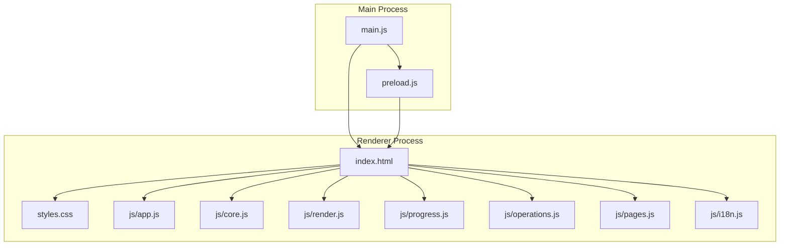

**Diagram sources**
- [main.js:43-123](file://main.js#L43-L123)
- [preload.js:1-221](file://preload.js#L1-L221)
- [index.html:1-1032](file://renderer/index.html#L1-L1032)
- [styles.css:1-550](file://renderer/styles.css#L1-L550)
- [app.js:1-210](file://renderer/js/app.js#L1-L210)
- [core.js:1-93](file://renderer/js/core.js#L1-L93)
- [render.js:1-445](file://renderer/js/render.js#L1-L445)
- [progress.js:1-141](file://renderer/js/progress.js#L1-L141)
- [operations.js:1-536](file://renderer/js/operations.js#L1-L536)
- [pages.js:1-800](file://renderer/js/pages.js#L1-L800)
- [i18n.js:1-373](file://renderer/js/i18n.js#L1-L373)

**Section sources**
- [main.js:43-123](file://main.js#L43-L123)
- [index.html:1-1032](file://renderer/index.html#L1-L1032)
- [app.js:1-210](file://renderer/js/app.js#L1-L210)

## Core Components
- Window and IPC bridge:
  - Main process creates the BrowserWindow and registers IPC handlers for all operations.
  - Preload script exposes a safe API surface via contextBridge to the renderer.
- Renderer modules:
  - core.js: global state, i18n helper, toast utilities, operation ID generation.
  - render.js: table rendering, selection logic, mirror list, env list, logs, stats.
  - progress.js: shared progress card UI and parsing of structured pip output.
  - operations.js: install/uninstall/update flows, drag-and-drop file install, refresh functions.
  - pages.js: mirror/env/logs/settings UI interactions, scheduler, templates, snapshots, audit, diff, offline download.
  - app.js: event binding, navigation, initialization sequence, keyboard shortcuts, updater events.
  - i18n.js: bilingual dictionary and applyLanguage function.

Key responsibilities and entry points:
- Navigation: sidebar items switch active page; app.js binds click handlers.
- Data loading: app.js runs phased initialization (envs, mirrors, cached libs, then full scans).
- Progress: operations.js sets progressOperation and total; progress.js updates UI on pip:progress events.
- Error handling: try/catch around async calls; showToast messages; status bar and log entries updated.

**Section sources**
- [preload.js:1-221](file://preload.js#L1-L221)
- [main.js:233-640](file://main.js#L233-L640)
- [core.js:1-93](file://renderer/js/core.js#L1-L93)
- [render.js:1-445](file://renderer/js/render.js#L1-L445)
- [progress.js:1-141](file://renderer/js/progress.js#L1-L141)
- [operations.js:1-536](file://renderer/js/operations.js#L1-L536)
- [pages.js:1-800](file://renderer/js/pages.js#L1-L800)
- [app.js:1-210](file://renderer/js/app.js#L1-L210)
- [i18n.js:1-373](file://renderer/js/i18n.js#L1-L373)

## Architecture Overview
The UI follows a clear separation between the Electron main process and the renderer process. The preload script acts as a secure bridge exposing only necessary methods. All long-running or privileged operations run in the main process and communicate back via IPC events.

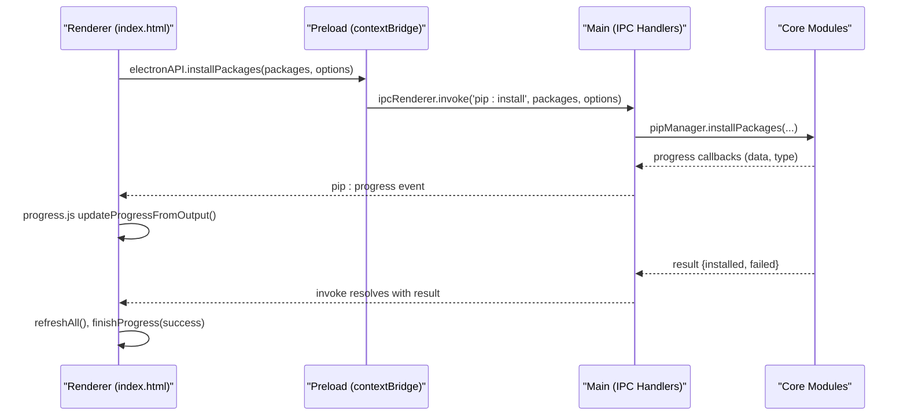

**Diagram sources**
- [preload.js:1-221](file://preload.js#L1-L221)
- [main.js:310-348](file://main.js#L310-L348)
- [operations.js:301-370](file://renderer/js/operations.js#L301-L370)
- [progress.js:90-141](file://renderer/js/progress.js#L90-L141)

## Detailed Component Analysis

### Page Navigation System
- Sidebar groups: Core Operations, Configuration Management, System.
- Each item has data-page attribute; clicking toggles .active class on both nav item and corresponding page div.
- Keyboard shortcuts: Ctrl+F focuses search input; Ctrl+1..9 switches pages; Escape closes modals.

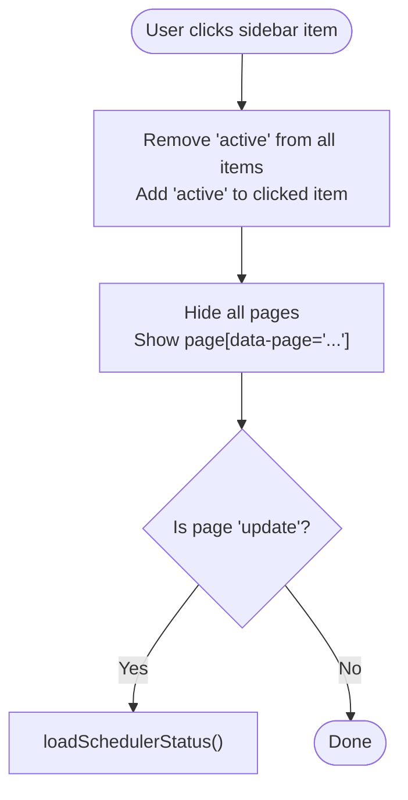

**Diagram sources**
- [index.html:60-127](file://renderer/index.html#L60-L127)
- [app.js:16-27](file://renderer/js/app.js#L16-L27)
- [app.js:104-126](file://renderer/js/app.js#L104-L126)

**Section sources**
- [index.html:60-127](file://renderer/index.html#L60-L127)
- [app.js:16-27](file://renderer/js/app.js#L16-L27)
- [app.js:104-126](file://renderer/js/app.js#L104-L126)

### Package Management Interface (Install, Uninstall, Update, Query)
- Install page:
  - Search box supports multiple names, pip command paste, and file path detection (.txt/.whl).
  - Drag-and-drop zone accepts requirements.txt or .whl files.
  - Options: version mode, parallel threads, retry count, rollback.
  - Progress card shows current package, percentage, counts, and cancel button.
- Uninstall page:
  - Searchable table with checkboxes; batch uninstall with optional backup and rollback.
  - Selection info updates dynamically.
- Update page:
  - Check updates, select packages, bulk update with parallel/retry/rollback options.
  - Scheduler section for automatic updates with whitelist and frequency.
- Query page:
  - Filter by status (all/installed/has-update), sort by time/name/size.

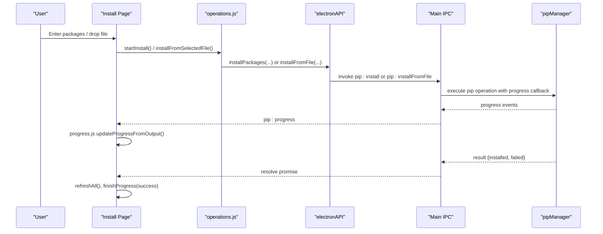

**Diagram sources**
- [index.html:132-215](file://renderer/index.html#L132-L215)
- [operations.js:238-370](file://renderer/js/operations.js#L238-L370)
- [progress.js:90-141](file://renderer/js/progress.js#L90-L141)
- [main.js:310-348](file://main.js#L310-L348)

**Section sources**
- [index.html:132-215](file://renderer/index.html#L132-L215)
- [index.html:217-373](file://renderer/index.html#L217-L373)
- [index.html:375-417](file://renderer/index.html#L375-L417)
- [operations.js:238-370](file://renderer/js/operations.js#L238-L370)
- [operations.js:115-237](file://renderer/js/operations.js#L115-L237)
- [render.js:17-158](file://renderer/js/render.js#L17-L158)

### Environment Selector
- Detects Python environments and displays cards with name, path, and version.
- Switching environment triggers full refresh of installed/outdated lists and re-renders.
- Virtual environment management: create/use/delete venvs; export/import requirements; compare two environments.
- Repair pip utility using ensurepip.

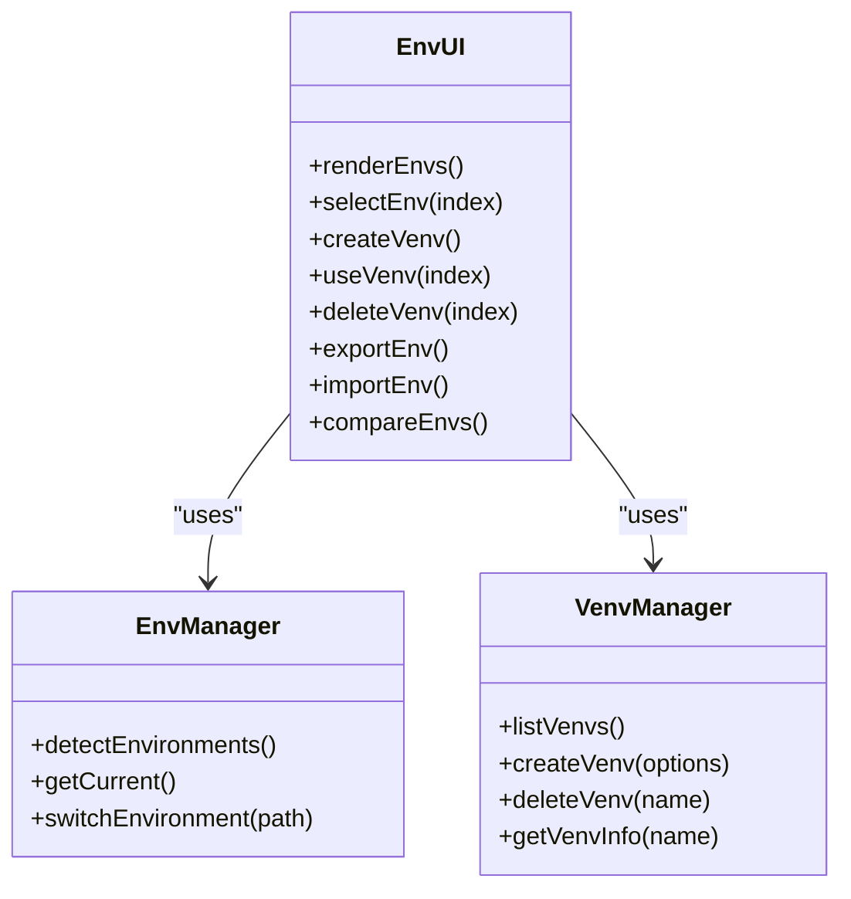

**Diagram sources**
- [index.html:508-582](file://renderer/index.html#L508-L582)
- [pages.js:163-318](file://renderer/js/pages.js#L163-L318)
- [render.js:320-376](file://renderer/js/render.js#L320-L376)
- [main.js:254-281](file://main.js#L254-L281)

**Section sources**
- [index.html:508-582](file://renderer/index.html#L508-L582)
- [pages.js:163-318](file://renderer/js/pages.js#L163-L318)
- [render.js:320-376](file://renderer/js/render.js#L320-L376)

### Template Browser and Snapshots
- Preset templates grid to create environments quickly with dependency installation.
- Snapshot creation and restoration for “time travel” rollback.
- UI includes form inputs for environment name and base Python selection.

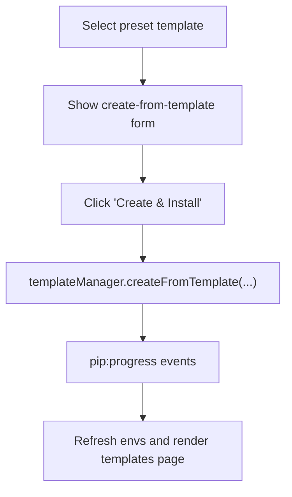

**Diagram sources**
- [index.html:419-460](file://renderer/index.html#L419-L460)
- [main.js:548-576](file://main.js#L548-L576)

**Section sources**
- [index.html:419-460](file://renderer/index.html#L419-L460)
- [pages.js:716-800](file://renderer/js/pages.js#L716-L800)

### Settings Panel
- Appearance: theme (light/dark/system), language (zh/en).
- Storage path browsing and display.
- Notifications toggle, tray minimize toggle.
- Integration: Windows Explorer context menu enable/disable.
- Advanced: parallel threads, retry count.

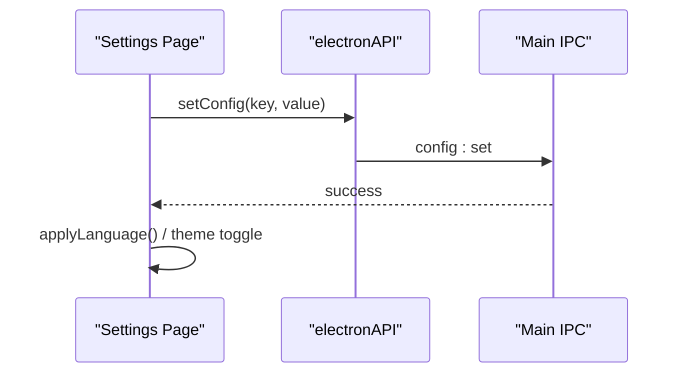

**Diagram sources**
- [index.html:858-939](file://renderer/index.html#L858-L939)
- [pages.js:376-422](file://renderer/js/pages.js#L376-L422)
- [main.js:406-414](file://main.js#L406-L414)

**Section sources**
- [index.html:858-939](file://renderer/index.html#L858-L939)
- [pages.js:376-422](file://renderer/js/pages.js#L376-L422)

### Mirror Source Management
- List built-in and custom mirrors with speed test results.
- Set default mirror, edit/remove mirrors, reorder priority via drag-and-drop.
- Smart routing toggle to auto-select best mirror.

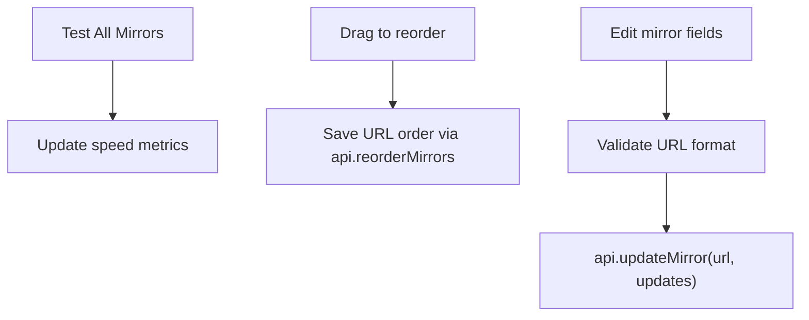

**Diagram sources**
- [index.html:462-506](file://renderer/index.html#L462-L506)
- [pages.js:15-161](file://renderer/js/pages.js#L15-L161)
- [render.js:207-318](file://renderer/js/render.js#L207-L318)
- [main.js:370-396](file://main.js#L370-L396)

**Section sources**
- [index.html:462-506](file://renderer/index.html#L462-L506)
- [pages.js:15-161](file://renderer/js/pages.js#L15-L161)
- [render.js:207-318](file://renderer/js/render.js#L207-L318)

### Logs and Dashboard
- Logs page: filter by type, search text, export CSV/Markdown, clear logs.
- Dashboard: overview cards, weekly activity, recent activity, disk usage top list.

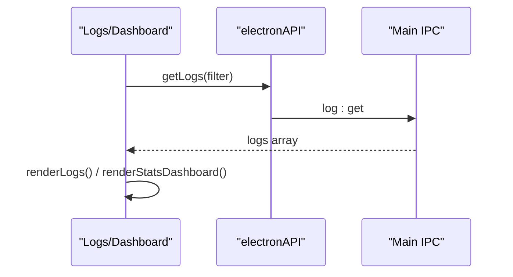

**Diagram sources**
- [index.html:621-684](file://renderer/index.html#L621-L684)
- [pages.js:320-349](file://renderer/js/pages.js#L320-L349)
- [render.js:378-445](file://renderer/js/render.js#L378-L445)
- [main.js:397-414](file://main.js#L397-L414)

**Section sources**
- [index.html:621-684](file://renderer/index.html#L621-L684)
- [pages.js:320-349](file://renderer/js/pages.js#L320-L349)
- [render.js:378-445](file://renderer/js/render.js#L378-L445)

### Toolbox (Advanced Features)
- Dependency graph: single-package tree or global network visualization.
- Diagnostics: conflict check and health scoring.
- Disk usage analysis: top consumers in site-packages.
- Environment diff: compare two sources (env/file).
- Offline download: download packages and deps for target platform.

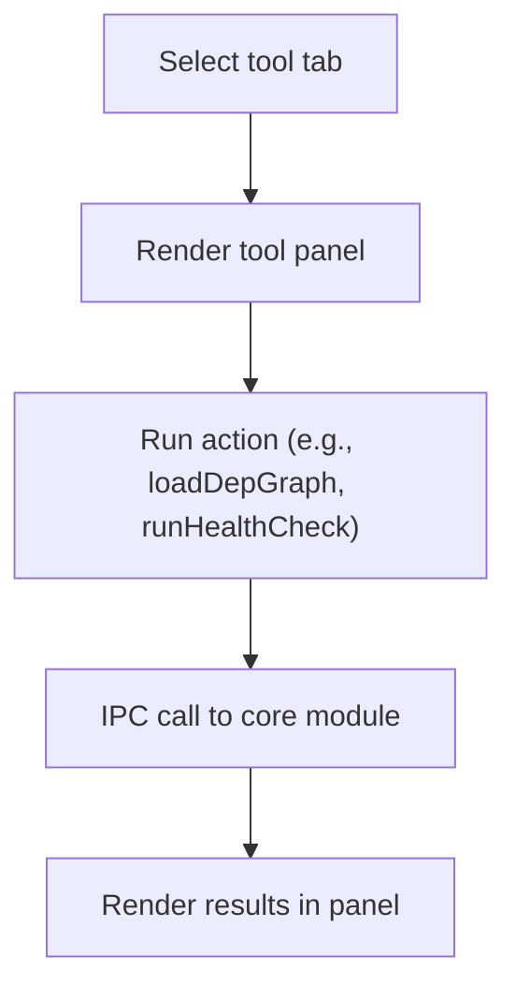

**Diagram sources**
- [index.html:686-856](file://renderer/index.html#L686-L856)

**Section sources**
- [index.html:686-856](file://renderer/index.html#L686-L856)

## Dependency Analysis
- Renderer modules depend on core.js for global state and utilities.
- operations.js depends on progress.js for UI updates and on render.js for data refresh.
- pages.js orchestrates UI-specific interactions and calls electronAPI methods.
- app.js wires DOM events and initializes data flow.
- preload.js maps electronAPI methods to IPC channels handled in main.js.

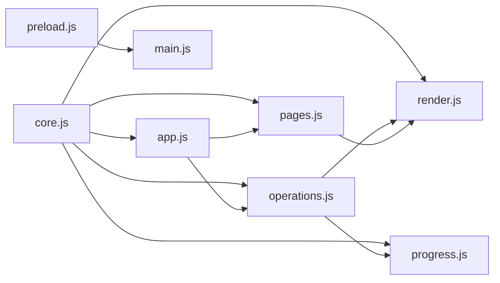

**Diagram sources**
- [core.js:1-93](file://renderer/js/core.js#L1-L93)
- [app.js:1-210](file://renderer/js/app.js#L1-L210)
- [operations.js:1-536](file://renderer/js/operations.js#L1-L536)
- [render.js:1-445](file://renderer/js/render.js#L1-L445)
- [progress.js:1-141](file://renderer/js/progress.js#L1-L141)
- [pages.js:1-800](file://renderer/js/pages.js#L1-L800)
- [preload.js:1-221](file://preload.js#L1-L221)
- [main.js:233-640](file://main.js#L233-L640)

**Section sources**
- [core.js:1-93](file://renderer/js/core.js#L1-L93)
- [app.js:1-210](file://renderer/js/app.js#L1-L210)
- [operations.js:1-536](file://renderer/js/operations.js#L1-L536)
- [render.js:1-445](file://renderer/js/render.js#L1-L445)
- [progress.js:1-141](file://renderer/js/progress.js#L1-L141)
- [pages.js:1-800](file://renderer/js/pages.js#L1-L800)
- [preload.js:1-221](file://preload.js#L1-L221)
- [main.js:233-640](file://main.js#L233-L640)

## Performance Considerations
- Phased initialization:
  - Phase 1: quick load of envs, mirrors, and cached installed list for immediate responsiveness.
  - Phase 2: background refresh of full installed list.
  - Phase 3: lazy load of outdated packages.
- Parallel operations:
  - Install/update support parallel threads; configurable thread count.
  - Promise.allSettled used to avoid blocking UI on slow tasks.
- Efficient rendering:
  - Tables rendered with minimal DOM churn; empty states shown when no data matches filters.
- Progress feedback:
  - Structured [PROGRESS] events parsed to update counts and percentages without heavy parsing.

[No sources needed since this section provides general guidance]

## Troubleshooting Guide
Common issues and resolutions:
- No Python environment detected:
  - Ensure Python is installed and discoverable; use repair pip if pip is missing.
- Install/Uninstall/Update failures:
  - Check smart mirror routing and retry settings; review logs for detailed errors.
- Slow mirror performance:
  - Run “Test All Mirrors” and reorder priorities; enable smart routing.
- Undo not available:
  - Verify undo manager state; perform undo only after supported operations.
- Application update checks fail:
  - Check network connectivity and update server availability; inspect updater events.

Error handling patterns:
- Try/catch around async API calls; showToast with appropriate types (ok/err/info/warn).
- Progress card finalizes with success/failure status; logs refreshed immediately.
- Modal dialogs confirm destructive actions (backup before uninstall).

**Section sources**
- [pages.js:163-318](file://renderer/js/pages.js#L163-L318)
- [operations.js:80-113](file://renderer/js/operations.js#L80-L113)
- [progress.js:45-74](file://renderer/js/progress.js#L45-L74)
- [index.html:993-1004](file://renderer/index.html#L993-L1004)

## Conclusion
PyLibMaster’s UI combines a clean, modular Electron architecture with robust user interactions. Pages are organized logically, data flows through well-defined IPC channels, and progress/error handling ensures a smooth experience. Theme support, localization, and responsive design enhance usability. Extending the UI involves adding new pages/components following established patterns and wiring them into the navigation and data refresh pipeline.

[No sources needed since this section summarizes without analyzing specific files]

## Appendices

### Customization and Theme Support
- Themes: light, dark, system-follow; applied via CSS variables and body class toggling.
- Language: zh/en; applyLanguage updates all data-i18n elements and placeholders.
- Settings: storage path, notifications, tray behavior, integration toggles.

**Section sources**
- [index.html:858-939](file://renderer/index.html#L858-L939)
- [pages.js:376-422](file://renderer/js/pages.js#L376-L422)
- [i18n.js:1-373](file://renderer/js/i18n.js#L1-L373)
- [styles.css:28-116](file://renderer/styles.css#L28-L116)

### Accessibility Features
- Keyboard shortcuts: Ctrl+F focus search, Ctrl+1..9 switch pages, Escape close modals.
- Semantic HTML with labels and placeholders; aria-friendly controls where applicable.
- High contrast colors and consistent focus styles for inputs and buttons.

**Section sources**
- [app.js:104-126](file://renderer/js/app.js#L104-L126)
- [styles.css:171-189](file://renderer/styles.css#L171-L189)

### Guidelines for Extending the UI
To add a new page or component:
- Add HTML markup under content area with unique page id and data-i18n keys.
- Register navigation item in sidebar with data-page attribute.
- Implement rendering and interaction logic in render.js or pages.js as appropriate.
- Wire up events in app.js if needed; ensure refreshCurrentPage handles the new page.
- Use electronAPI for IPC calls; handle progress events via progress.js.
- Provide i18n strings in i18n.js for both languages.
- Style with existing CSS variables and classes for consistency.

**Section sources**
- [index.html:129-170](file://renderer/index.html#L129-L170)
- [app.js:16-27](file://renderer/js/app.js#L16-L27)
- [operations.js:468-536](file://renderer/js/operations.js#L468-L536)
- [i18n.js:1-373](file://renderer/js/i18n.js#L1-L373)