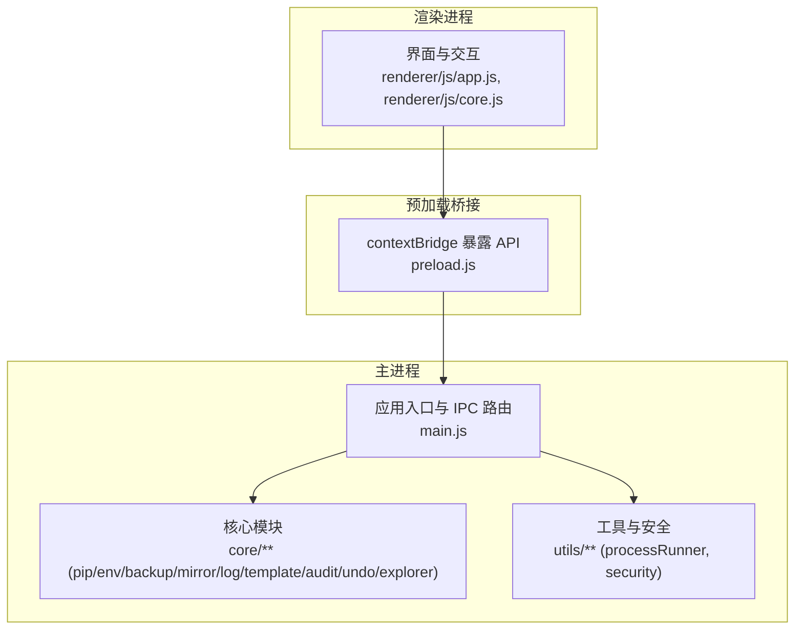
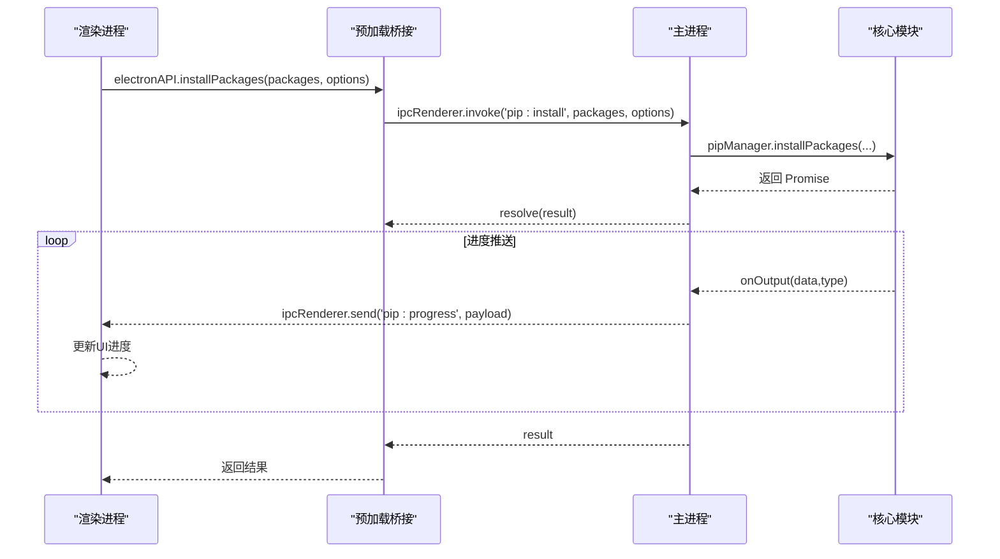
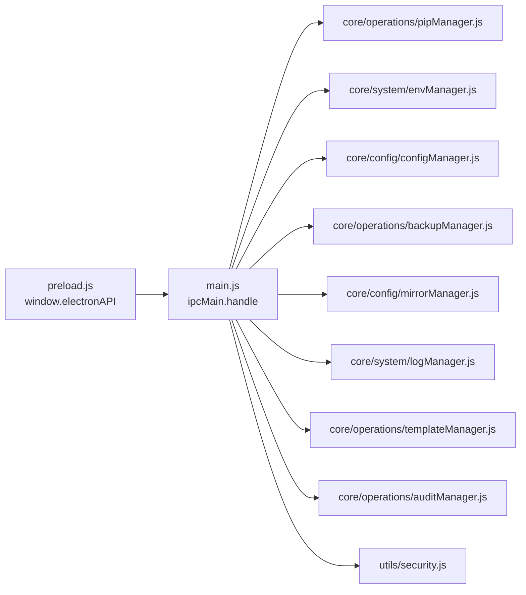

# API 参考

<cite>
**本文引用的文件**   
- [preload.js](file://preload.js)
- [main.js](file://main.js)
- [package.json](file://package.json)
- [renderer/js/app.js](file://renderer/js/app.js)
- [renderer/js/core.js](file://renderer/js/core.js)
- [core/operations/pipManager.js](file://core/operations/pipManager.js)
- [core/system/envManager.js](file://core/system/envManager.js)
- [core/config/configManager.js](file://core/config/configManager.js)
- [core/operations/backupManager.js](file://core/operations/backupManager.js)
- [core/config/mirrorManager.js](file://core/config/mirrorManager.js)
- [core/system/logManager.js](file://core/system/logManager.js)
- [core/operations/templateManager.js](file://core/operations/templateManager.js)
- [core/operations/auditManager.js](file://core/operations/auditManager.js)
- [utils/security.js](file://utils/security.js)
</cite>

## 目录
1. [简介](#简介)
2. [项目结构](#项目结构)
3. [核心组件](#核心组件)
4. [架构总览](#架构总览)
5. [详细组件分析](#详细组件分析)
6. [依赖关系分析](#依赖关系分析)
7. [性能考量](#性能考量)
8. [故障排查指南](#故障排查指南)
9. [结论](#结论)
10. [附录](#附录)

## 简介
本文件为 PyLibMaster 的完整 API 参考，聚焦通过 preload.js 暴露给渲染进程的 IPC 接口。内容覆盖窗口控制、包管理、环境管理、配置管理、系统功能、备份与快照、镜像源、日志、自动更新、调度器、安全审计、撤销操作、Windows 资源管理器集成等类别。每个接口提供方法签名、参数说明、返回值格式、错误处理模式、请求/响应示例以及事件监听方式。同时包含版本兼容性、迁移建议、安全注意事项与最佳实践，帮助开发者快速集成并正确使用这些接口。

## 项目结构
PyLibMaster 采用 Electron 架构：
- 主进程（main.js）负责创建窗口、注册所有 IPC 处理器、协调核心模块。
- 预加载脚本（preload.js）通过 contextBridge 将受控 API 暴露到 window.electronAPI。
- 渲染进程（renderer/**）通过 window.electronAPI 调用主进程能力。
- 核心模块位于 core/**，封装业务逻辑；工具模块位于 utils/**。

图表来源
- [preload.js:1-221](file://preload.js#L1-L221)
- [main.js:1-640](file://main.js#L1-L640)
- [renderer/js/app.js:1-210](file://renderer/js/app.js#L1-L210)
- [renderer/js/core.js:1-93](file://renderer/js/core.js#L1-L93)

章节来源
- [preload.js:1-221](file://preload.js#L1-L221)
- [main.js:1-640](file://main.js#L1-L640)
- [renderer/js/app.js:1-210](file://renderer/js/app.js#L1-L210)
- [renderer/js/core.js:1-93](file://renderer/js/core.js#L1-L93)

## 核心组件
- 窗口控制：最小化、最大化/还原、关闭。
- 环境管理：检测 Python 环境、获取当前环境、切换环境。
- 虚拟环境管理：创建、列出、删除、详情。
- 包查询：已安装列表（实时/缓存）、可更新列表、搜索、包详情、依赖树、导出/导入 requirements、对比环境。
- 包操作：安装、卸载、更新、修复 pip、取消操作。
- 备份管理：创建、列出、恢复、删除。
- 镜像源管理：获取、测速、设置默认、添加/更新/删除自定义、智能路由、写入 pip 配置、重排序。
- 日志管理：获取、清空、新增、导出 CSV/Markdown。
- 配置管理：获取、单键设置、批量设置。
- 系统功能：获取应用版本、浏览目录/文件、打开路径（白名单校验）。
- 桌面通知：发送系统通知。
- 主题：获取系统主题、监听主题变化。
- 定时更新调度器：状态、保存配置、立即执行、监听执行结果。
- 模板与快照：模板列表、添加/删除自定义模板、从模板创建、快照创建/列表/详情/恢复/删除。
- 安全漏洞扫描：运行扫描、获取缓存结果。
- 磁盘空间分析：当前环境占用分析。
- 离线包下载：下载包到指定目录。
- requirements 对比：对比两个来源差异。
- 包版本发布历史：获取包的版本历史。
- 全局依赖图谱：获取依赖图数据。
- 环境诊断：冲突检查、健康检查。
- 操作撤销：是否可撤销、执行撤销、清空历史。
- Windows 资源管理器集成：右键菜单状态、启用/禁用。
- 进度事件：统一 pip 操作进度推送。
- 自动更新：检查更新、安装更新、各阶段事件监听。

章节来源
- [preload.js:1-221](file://preload.js#L1-L221)
- [main.js:1-640](file://main.js#L1-L640)

## 架构总览
渲染进程通过 window.electronAPI 调用 IPC 方法，主进程根据 channel 路由到对应处理器，再委托核心模块完成实际工作。长耗时或流式输出操作通过 ipcRenderer.on 事件推送进度与状态。

图表来源
- [preload.js:1-221](file://preload.js#L1-L221)
- [main.js:1-640](file://main.js#L1-L640)
- [core/operations/pipManager.js:1-200](file://core/operations/pipManager.js#L1-L200)

## 详细组件分析

### 窗口控制
- windowMinimize()
  - 参数：无
  - 返回：Promise<void>
  - 行为：最小化主窗口
- windowMaximize()
  - 参数：无
  - 返回：Promise<void>
  - 行为：最大化/还原切换
- windowClose()
  - 参数：无
  - 返回：Promise<void>
  - 行为：关闭窗口

章节来源
- [preload.js:21-26](file://preload.js#L21-L26)
- [main.js:237-252](file://main.js#L237-L252)

### 环境管理
- detectEnvironments()
  - 参数：无
  - 返回：Promise<Array<{name,path,version,pipVersion}>>
  - 行为：扫描常见路径与 PATH，并行获取版本信息，过滤无 pip 的环境，恢复当前环境
- getCurrentEnv()
  - 参数：无
  - 返回：Object|null
  - 行为：返回内存缓存或配置文件中的当前环境
- switchEnvironment(envPath)
  - 参数：envPath(string)
  - 返回：Promise<Object>
  - 行为：切换到指定 Python 环境并持久化

章节来源
- [preload.js:27-32](file://preload.js#L27-L32)
- [main.js:257-261](file://main.js#L257-L261)
- [core/system/envManager.js:1-200](file://core/system/envManager.js#L1-L200)

### 虚拟环境管理
- createVenv(options)
  - 参数：options(Object)
  - 返回：Promise<Object>
  - 行为：创建 venv，支持进度回调
- listVenvs()
  - 参数：无
  - 返回：Promise<Array>
- deleteVenv(name)
  - 参数：name(string)
  - 返回：Promise<boolean|Object>
- getVenvInfo(name)
  - 参数：name(string)
  - 返回：Promise<Object>

章节来源
- [preload.js:34-38](file://preload.js#L34-L38)
- [main.js:266-280](file://main.js#L266-L280)

### 包查询
- listInstalled()
  - 参数：无
  - 返回：Promise<Array>
- listInstalledCached()
  - 参数：无
  - 返回：Promise<Array>（5分钟缓存）
- listOutdated()
  - 参数：无
  - 返回：Promise<Array>
- searchPackage(keyword)
  - 参数：keyword(string)
  - 返回：Promise<Array>
- showPackageInfo(pkgName)
  - 参数：pkgName(string)
  - 返回：Promise<Object>
- getDependencyTree(pkgName)
  - 参数：pkgName(string)
  - 返回：Promise<Object>
- exportRequirements(options)
  - 参数：options(Object)
  - 返回：Promise<string>（requirements.txt 内容或路径）
- importRequirements(filePath, options)
  - 参数：filePath(string), options(Object)
  - 返回：Promise<Object>（带进度回调）
- compareEnvironments(envA, envB)
  - 参数：envA(string), envB(string)
  - 返回：Promise<Object>

章节来源
- [preload.js:41-55](file://preload.js#L41-L55)
- [main.js:285-305](file://main.js#L285-L305)
- [core/operations/pipManager.js:1-200](file://core/operations/pipManager.js#L1-L200)

### 包操作
- installPackages(packages, options)
  - 参数：packages(Array|string), options(Object)
  - 返回：Promise<Object>（支持并行、重试、回滚、operationId）
- installFromFile(filePath, options)
  - 参数：filePath(string), options(Object)
  - 返回：Promise<Object>
- uninstallPackages(packages, options)
  - 参数：packages(Array|string), options(Object)
  - 返回：Promise<Object>
- updatePackages(packages, options)
  - 参数：packages(Array|string), options(Object)
  - 返回：Promise<Object>
- cancelPipOperation(operationId)
  - 参数：operationId(string)
  - 返回：Promise<boolean>
- repairPip(options)
  - 参数：options(Object)
  - 返回：Promise<Object>

章节来源
- [preload.js:57-64](file://preload.js#L57-L64)
- [main.js:311-348](file://main.js#L311-L348)
- [core/operations/pipManager.js:1-200](file://core/operations/pipManager.js#L1-L200)

### 备份管理
- createBackup()
  - 参数：无
  - 返回：Promise<Object>（id、path、createdAt、envName、envPath）
- listBackups()
  - 参数：无
  - 返回：Promise<Array>
- restoreBackup(backupId)
  - 参数：backupId(string)
  - 返回：Promise<Object>（带进度回调）
- deleteBackup(backupId)
  - 参数：backupId(string)
  - 返回：Promise<boolean>

章节来源
- [preload.js:66-71](file://preload.js#L66-L71)
- [main.js:358-368](file://main.js#L358-L368)
- [core/operations/backupManager.js:1-196](file://core/operations/backupManager.js#L1-L196)

### 镜像源管理
- getMirrors()
  - 参数：无
  - 返回：Array
- testMirrorSpeed(url)
  - 参数：url(string)
  - 返回：Promise<number>（毫秒）
- testAllMirrors()
  - 参数：无
  - 返回：Promise<Array>
- setDefaultMirror(url)
  - 参数：url(string)
  - 返回：Array
- addCustomMirror(name, url, remark)
  - 参数：name(string), url(string), remark(string)
  - 返回：Object|null
- updateMirror(url, updates)
  - 参数：url(string), updates(Object)
  - 返回：Array|null
- removeCustomMirror(url)
  - 参数：url(string)
  - 返回：boolean
- restoreDefaultMirrors()
  - 参数：无
  - 返回：Array
- setSmartRoute(enabled)
  - 参数：enabled(boolean)
  - 返回：void
- getSmartRoute()
  - 参数：无
  - 返回：boolean
- writePipMirrorConfig()
  - 参数：无
  - 返回：Promise<void>
- reorderMirrors(urlOrder)
  - 参数：urlOrder(Array<string>)
  - 返回：Array

章节来源
- [preload.js:73-86](file://preload.js#L73-L86)
- [main.js:373-395](file://main.js#L373-L395)
- [core/config/mirrorManager.js:1-200](file://core/config/mirrorManager.js#L1-L200)

### 日志管理
- getLogs(filter)
  - 参数：filter(Object){type?,search?}
  - 返回：Promise<Array>
- clearLogs()
  - 参数：无
  - 返回：Promise<boolean>
- addLog(entry)
  - 参数：entry(Object){action,status,type,detail}
  - 返回：Promise<Object>
- exportLogs(format)
  - 参数：format('csv'|'md')
  - 返回：Promise<string|null>（保存路径或 null）

章节来源
- [preload.js:88-92](file://preload.js#L88-L92)
- [main.js:400-414](file://main.js#L400-L414)
- [core/system/logManager.js:1-173](file://core/system/logManager.js#L1-L173)

### 配置管理
- getConfig()
  - 参数：无
  - 返回：Object（深拷贝）
- setConfig(key, value)
  - 参数：key(string), value(*)
  - 返回：Object（更新后的配置副本）
- setConfigBulk(updates)
  - 参数：updates(Object)
  - 返回：Object（更新后的配置副本）

章节来源
- [preload.js:94-98](file://preload.js#L94-L98)
- [main.js:409-413](file://main.js#L409-L413)
- [core/config/configManager.js:1-194](file://core/config/configManager.js#L1-L194)

### 系统功能
- getAppVersion()
  - 参数：无
  - 返回：Promise<{version,name}>
- browseDirectory()
  - 参数：无
  - 返回：Promise<string|null>
- browseFile(filters)
  - 参数：filters(Array<{name,extensions}>)
  - 返回：Promise<string|null>
- openPath(filePath)
  - 参数：filePath(string)
  - 返回：Promise<boolean>（仅允许文档/下载/userData 目录）

章节来源
- [preload.js:100-105](file://preload.js#L100-L105)
- [main.js:425-466](file://main.js#L425-L466)
- [utils/security.js:1-43](file://utils/security.js#L1-L43)

### 桌面通知
- sendNotification(title, body)
  - 参数：title(string), body(string)
  - 返回：Promise<boolean>

章节来源
- [preload.js:107-108](file://preload.js#L107-L108)
- [main.js:471-480](file://main.js#L471-L480)

### 主题
- getSystemTheme()
  - 参数：无
  - 返回：Promise<'light'|'dark'>
- onThemeChanged(callback)
  - 参数：callback(theme)
  - 返回：void（移除旧监听后绑定新监听）

章节来源
- [preload.js:114-118](file://preload.js#L114-L118)
- [main.js:519-521](file://main.js#L519-L521)

### 定时更新调度器
- getSchedulerStatus()
  - 参数：无
  - 返回：Object
- saveSchedulerConfig(config)
  - 参数：config(Object)
  - 返回：Object
- runSchedulerNow()
  - 参数：无
  - 返回：Promise<void>
- onSchedulerExecuted(callback)
  - 参数：callback(msg)
  - 返回：void

章节来源
- [preload.js:124-131](file://preload.js#L124-L131)
- [main.js:526-546](file://main.js#L526-L546)

### 项目模板与环境快照
- getTemplates()
  - 参数：无
  - 返回：Array
- addCustomTemplate(tpl)
  - 参数：tpl(Object{name,icon,description,packages})
  - 返回：boolean
- removeCustomTemplate(id)
  - 参数：id(string)
  - 返回：boolean
- createFromTemplate(options)
  - 参数：options({templateId,venvName,pythonPath})
  - 返回：Promise<Object>（带进度回调）
- createSnapshot(envPath, label)
  - 参数：envPath(string), label(string)
  - 返回：Promise<Object>
- listSnapshots()
  - 参数：无
  - 返回：Promise<Array>
- getSnapshotDetail(id)
  - 参数：id(string)
  - 返回：Promise<Object>
- restoreSnapshot(snapshotId, envPath)
  - 参数：snapshotId(string), envPath(string)
  - 返回：Promise<Object>（带进度回调）
- deleteSnapshot(id)
  - 参数：id(string)
  - 返回：Promise<boolean>

章节来源
- [preload.js:133-142](file://preload.js#L133-L142)
- [main.js:551-575](file://main.js#L551-L575)
- [core/operations/templateManager.js:1-200](file://core/operations/templateManager.js#L1-L200)

### 安全漏洞扫描
- runAudit()
  - 参数：无
  - 返回：Promise<Object>{vulnerabilities[],summary{}}（带进度回调）
- getCachedAudit()
  - 参数：无
  - 返回：Promise<Object>

章节来源
- [preload.js:144-146](file://preload.js#L144-L146)
- [main.js:580-586](file://main.js#L580-L586)
- [core/operations/auditManager.js:1-200](file://core/operations/auditManager.js#L1-L200)

### 磁盘空间分析
- getDiskUsage()
  - 参数：无
  - 返回：Promise<Object>

章节来源
- [preload.js:148-149](file://preload.js#L148-L149)
- [main.js:591-591](file://main.js#L591-L591)

### 离线包下载
- downloadPackages(packages, destDir, options)
  - 参数：packages(Array|string), destDir(string), options(Object)
  - 返回：Promise<Object>（带进度回调）

章节来源
- [preload.js:151-152](file://preload.js#L151-L152)
- [main.js:596-600](file://main.js#L596-L600)

### requirements 对比
- diffRequirements(sourceA, sourceB)
  - 参数：sourceA(string), sourceB(string)
  - 返回：Promise<Object>

章节来源
- [preload.js:154-155](file://preload.js#L154-L155)
- [main.js:605-607](file://main.js#L605-L607)

### 包版本发布历史
- getPackageReleases(pkgName)
  - 参数：pkgName(string)
  - 返回：Promise<Array>

章节来源
- [preload.js:157-158](file://preload.js#L157-L158)
- [main.js:612-612](file://main.js#L612-L612)

### 全局依赖图谱
- getDependencyGraph()
  - 参数：无
  - 返回：Promise<Object>

章节来源
- [preload.js:160-161](file://preload.js#L160-L161)
- [main.js:617-617](file://main.js#L617-L617)

### 环境诊断
- checkConflicts()
  - 参数：无
  - 返回：Promise<Object>
- healthCheck()
  - 参数：无
  - 返回：Promise<Object>

章节来源
- [preload.js:163-165](file://preload.js#L163-L165)
- [main.js:351-353](file://main.js#L351-L353)

### 操作撤销
- canUndo()
  - 参数：无
  - 返回：boolean
- performUndo()
  - 参数：无
  - 返回：Promise<Object>（带进度回调）
- clearUndo()
  - 参数：无
  - 返回：void

章节来源
- [preload.js:167-170](file://preload.js#L167-L170)
- [main.js:622-630](file://main.js#L622-L630)

### Windows 资源管理器集成
- getExplorerStatus()
  - 参数：无
  - 返回：Object
- enableExplorerMenu()
  - 参数：无
  - 返回：Promise<void>
- disableExplorerMenu()
  - 参数：无
  - 返回：Promise<void>

章节来源
- [preload.js:172-175](file://preload.js#L172-L175)
- [main.js:635-639](file://main.js#L635-L639)

### 进度事件监听
- onProgress(callback)
  - 参数：callback(payload)
  - 行为：移除旧监听后绑定 'pip:progress' 事件
- removeProgressListener(callback)
  - 参数：callback(Function)
  - 行为：移除指定监听

章节来源
- [preload.js:177-184](file://preload.js#L177-L184)
- [renderer/js/app.js:82-84](file://renderer/js/app.js#L82-L84)

### 自动更新事件监听
- checkForUpdates()
  - 参数：无
  - 返回：Promise<void>
- installUpdate()
  - 参数：无
  - 返回：Promise<void>
- onUpdaterChecking(callback)
- onUpdaterAvailable(callback)
- onUpdaterNotAvailable(callback)
- onUpdaterProgress(callback)
- onUpdaterDownloaded(callback)
- onUpdaterError(callback)

章节来源
- [preload.js:186-219](file://preload.js#L186-L219)
- [main.js:418-420](file://main.js#L418-L420)

## 依赖关系分析
IPC 通道与处理器映射如下：

图表来源
- [preload.js:1-221](file://preload.js#L1-L221)
- [main.js:1-640](file://main.js#L1-L640)

章节来源
- [preload.js:1-221](file://preload.js#L1-L221)
- [main.js:1-640](file://main.js#L1-L640)

## 性能考量
- 已安装包列表优先使用缓存（5分钟），减少频繁 IO。
- 环境检测并行获取版本信息，提升多环境场景速度。
- 日志写入防抖（300ms），避免高频写盘。
- 配置保存原子写入（先写临时文件再重命名），降低损坏风险。
- 大任务（如备份恢复、模板创建）通过进度事件异步反馈，不阻塞 UI。
- 自动更新与调度器后台运行，启动时延迟检查，避免影响首屏体验。

章节来源
- [core/operations/pipManager.js:1-200](file://core/operations/pipManager.js#L1-L200)
- [core/system/envManager.js:1-200](file://core/system/envManager.js#L1-L200)
- [core/system/logManager.js:1-173](file://core/system/logManager.js#L1-L173)
- [core/config/configManager.js:1-194](file://core/config/configManager.js#L1-L194)

## 故障排查指南
- 常见问题定位
  - 包安装失败：查看日志（log:get），确认镜像源可用性与网络连通性。
  - 环境切换无效：确认目标环境存在且含 pip，重新 detectEnvironments。
  - 备份恢复失败：校验 backupId 格式与文件存在性，检查权限。
  - 打开路径被拒绝：确保路径在允许目录内（文档/下载/userData）。
- 调试建议
  - 使用 log:export 导出 CSV/Markdown 便于分析。
  - 对长耗时操作使用 operationId 跟踪与取消。
  - 通过 pip:healthCheck 与 pip:checkConflicts 进行环境诊断。
- 错误码与异常
  - 多数操作抛出 Error 对象，包含 message 描述原因。
  - 部分布尔返回（如 openPath、deleteBackup）表示成功与否。
  - 进度事件 payload 包含 done/pkg/status 字段用于计数与状态更新。

章节来源
- [core/system/logManager.js:1-173](file://core/system/logManager.js#L1-L173)
- [core/operations/backupManager.js:1-196](file://core/operations/backupManager.js#L1-L196)
- [utils/security.js:1-43](file://utils/security.js#L1-L43)
- [core/operations/pipManager.js:1-200](file://core/operations/pipManager.js#L1-L200)

## 结论
本文档系统化梳理了 PyLibMaster 通过 preload.js 暴露的全部 IPC API，涵盖窗口、环境、包、配置、系统、备份、镜像、日志、更新、调度器、模板与快照、审计、撤销、资源管理器等功能。结合架构图、时序图与流程图，读者可快速理解调用流程、数据流向与错误处理模式。遵循安全与性能最佳实践，可有效提升集成质量与应用稳定性。

## 附录

### 版本兼容性与迁移指南
- 应用版本：参见 package.json 的 version 字段（例如 1.5.23）。
- Electron 版本：见 dependencies 中 electron 版本（例如 31.7.7）。
- 升级建议
  - 关注 Electron 与 electron-updater 的版本变更，必要时调整打包与更新策略。
  - 若上游依赖（如 strip-ansi）出现 ESM 兼容问题，按依赖注释锁定版本。
- 迁移注意
  - 保持 IPC channel 名称不变（如 pip:*、env:*、mirror:* 等），避免破坏现有渲染进程调用。
  - 新增字段应向后兼容，避免直接删除已有返回字段。

章节来源
- [package.json:1-79](file://package.json#L1-L79)

### 安全注意事项与权限要求
- 路径安全：openPath 仅允许访问文档、下载、userData 目录；wheel 路径禁止 UNC 与敏感目录。
- 输入校验：包名、版本号、镜像 URL、备份 ID 均进行严格正则与长度限制。
- 上下文隔离：启用 contextIsolation，禁用 nodeIntegration，仅通过 preload 暴露必要 API。
- 权限最小化：仅暴露渲染进程所需方法，避免直接 Node 访问。

章节来源
- [main.js:449-466](file://main.js#L449-L466)
- [core/operations/pipManager.js:1-200](file://core/operations/pipManager.js#L1-L200)
- [core/operations/backupManager.js:1-196](file://core/operations/backupManager.js#L1-L196)
- [core/config/mirrorManager.js:1-200](file://core/config/mirrorManager.js#L1-L200)
- [utils/security.js:1-43](file://utils/security.js#L1-L43)

### 请求/响应示例与错误处理模式
- 安装包
  - 请求：electronAPI.installPackages(['requests','flask'], {parallel:true,retry:true,operationId:'op-xxx'})
  - 响应：Promise<Object>（包含操作结果摘要）
  - 进度：onProgress(payload) 中 done/pkg/status 逐步更新
  - 错误：捕获 Promise reject 的 Error.message
- 切换环境
  - 请求：electronAPI.switchEnvironment('C:/Python311/python.exe')
  - 响应：Promise<Object>（环境信息）
  - 错误：未找到或无 pip 时抛出错误
- 打开路径
  - 请求：electronAPI.openPath('/absolute/path/to/file.txt')
  - 响应：Promise<boolean>（在白名单内返回 true）
  - 错误：非白名单路径返回 false

章节来源
- [preload.js:57-64](file://preload.js#L57-L64)
- [preload.js:27-32](file://preload.js#L27-L32)
- [preload.js:100-105](file://preload.js#L100-L105)
- [renderer/js/app.js:82-84](file://renderer/js/app.js#L82-L84)