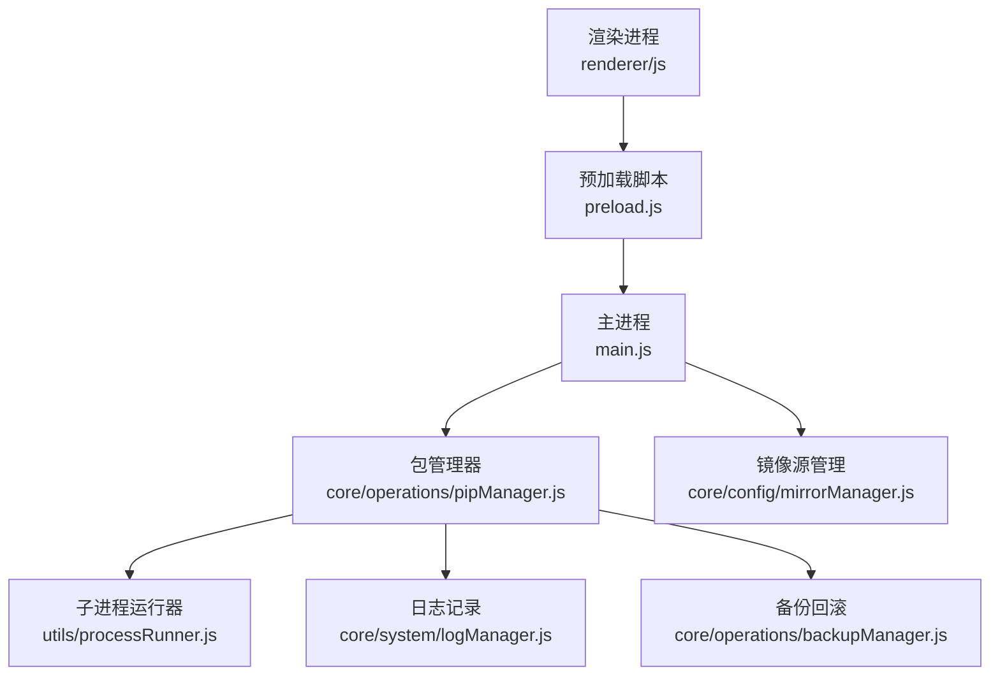
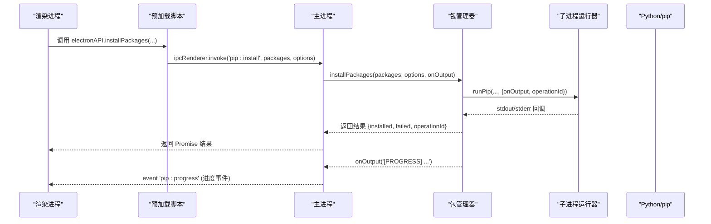
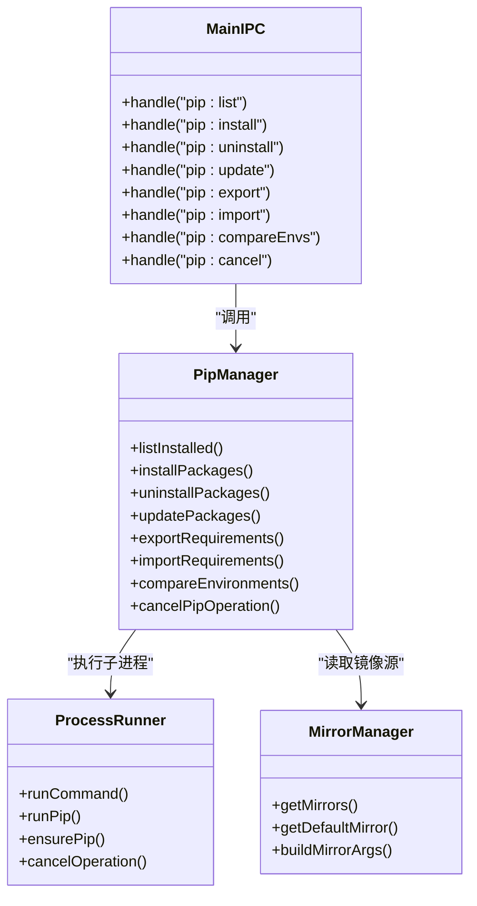

# 包管理接口

<cite>
**本文引用的文件**   
- [main.js](file://main.js)
- [preload.js](file://preload.js)
- [pipManager.js](file://core/operations/pipManager.js)
- [processRunner.js](file://utils/processRunner.js)
- [mirrorManager.js](file://core/config/mirrorManager.js)
- [operations.js](file://renderer/js/operations.js)
</cite>

## 目录
1. [简介](#简介)
2. [项目结构](#项目结构)
3. [核心组件](#核心组件)
4. [架构总览](#架构总览)
5. [详细组件分析](#详细组件分析)
6. [依赖关系分析](#依赖关系分析)
7. [性能考量](#性能考量)
8. [故障排查指南](#故障排查指南)
9. [结论](#结论)
10. [附录：API 参考与错误码](#附录api-参考与错误码)

## 简介
本文件为 PyLibMaster 的包管理 IPC API 文档，覆盖 pip 包管理的查询、安装/卸载/更新、文件导入导出与环境对比等全部接口。文档包含每个方法的参数格式、返回值结构、错误码定义，以及批量操作、进度监听、取消操作等高级功能的实现方式，并提供完整的异步处理模式与错误恢复策略说明。

## 项目结构
本项目采用 Electron 架构，主进程通过 IPC 暴露能力，预加载脚本安全桥接渲染进程，核心业务逻辑位于 core/operations 下，子进程执行由 utils/processRunner 统一封装。

图表来源
- [main.js:282-353](file://main.js#L282-L353)
- [preload.js:40-65](file://preload.js#L40-L65)
- [pipManager.js:1-50](file://core/operations/pipManager.js#L1-L50)
- [processRunner.js:1-30](file://utils/processRunner.js#L1-L30)

章节来源
- [main.js:1-150](file://main.js#L1-L150)
- [preload.js:1-60](file://preload.js#L1-L60)

## 核心组件
- 包管理器（pipManager）：提供包查询、安装/卸载/更新、依赖树、requirements 导入导出、环境对比、磁盘占用、离线下载、版本历史、依赖图谱、冲突检测与健康检查等能力。
- 子进程运行器（processRunner）：封装命令执行、超时控制、ANSI 清理、活跃进程跟踪与按 operationId 取消、ensurePip 自动安装。
- 镜像源管理（mirrorManager）：内置与自定义镜像源、测速与智能路由、写入 pip 配置。
- 主进程 IPC（main.js）：将渲染进程请求映射到具体模块方法，并转发实时进度事件。
- 预加载脚本（preload.js）：在渲染进程暴露 window.electronAPI，屏蔽 Node 直接访问，保证安全隔离。
- 前端操作层（operations.js）：调用 electronAPI，组织用户交互、进度展示与刷新。

章节来源
- [pipManager.js:1-50](file://core/operations/pipManager.js#L1-L50)
- [processRunner.js:1-60](file://utils/processRunner.js#L1-L60)
- [mirrorManager.js:1-60](file://core/config/mirrorManager.js#L1-L60)
- [main.js:282-353](file://main.js#L282-L353)
- [preload.js:40-65](file://preload.js#L40-L65)
- [operations.js:1-60](file://renderer/js/operations.js#L1-L60)

## 架构总览
下图展示了从渲染进程到主进程再到核心模块的完整调用链，以及进度事件的推送路径。

图表来源
- [preload.js:59-63](file://preload.js#L59-L63)
- [main.js:311-316](file://main.js#L311-L316)
- [pipManager.js:495-578](file://core/operations/pipManager.js#L495-L578)
- [processRunner.js:85-161](file://utils/processRunner.js#L85-L161)

## 详细组件分析

### 包查询接口
- listInstalled
  - 功能：获取已安装包列表，估算大小与安装时间，写入缓存。
  - 参数：无
  - 返回：Array<{name, version, installed, size, sizeText, source}>
  - 错误：未选择环境时抛出错误；JSON 解析失败时抛出错误。
- listInstalledCached
  - 功能：优先返回缓存（5分钟有效），否则回退到实时扫描。
  - 参数：无
  - 返回：同 listInstalled
- listOutdated
  - 功能：获取可更新的包列表。
  - 参数：无
  - 返回：Array<{name, current, latest, date}>
- searchPackage
  - 功能：搜索 PyPI 上的包（使用 pip index versions）。
  - 参数：keyword（字符串，长度≤200，合法包名正则）
  - 返回：{keyword, result, error?}
  - 错误：非法关键词或过长时抛出错误。

章节来源
- [pipManager.js:382-441](file://core/operations/pipManager.js#L382-L441)
- [pipManager.js:450-472](file://core/operations/pipManager.js#L450-L472)

### 包详情与依赖
- showPackageInfo
  - 功能：获取包的详细信息（名称、版本、摘要、主页、作者、许可证、位置、依赖与被依赖）。
  - 参数：pkgName（字符串，合法包名）
  - 返回：Object（字段见实现）
  - 错误：非法包名或未选择环境时抛出错误。
- getDependencyTree
  - 功能：递归构建依赖树（最大深度 3，限制每层依赖数量）。
  - 参数：pkgName（字符串，合法包名）
  - 返回：{name, version, children:[...]}
  - 错误：非法包名或未选择环境时抛出错误。

章节来源
- [pipManager.js:1006-1077](file://core/operations/pipManager.js#L1006-L1077)

### 文件导入导出
- exportRequirements
  - 功能：导出当前环境的 requirements.txt（freeze 输出）。
  - 参数：options.savePath（可选，保存路径）、options.freeze（默认 true）
  - 返回：{content, count}
  - 错误：未选择环境时抛出错误。
- importRequirements
  - 功能：从 requirements.txt 导入包到当前环境。
  - 参数：filePath（存在性校验）、options.retry（是否禁用重试）、onOutput（进度回调）
  - 返回：{success, output}
  - 错误：文件不存在或未选择环境时抛出错误。

章节来源
- [pipManager.js:1086-1135](file://core/operations/pipManager.js#L1086-L1135)

### 环境对比
- compareEnvironments
  - 功能：对比两个环境的包差异（仅A、仅B、版本不同、相同数量）。
  - 参数：envPathA, envPathB（字符串）
  - 返回：{onlyA, onlyB, different, same}
  - 错误：缺少任一路径时抛出错误。

章节来源
- [pipManager.js:1143-1182](file://core/operations/pipManager.js#L1143-L1182)

### 包操作接口（安装/卸载/更新）
- installPackages
  - 功能：批量安装包，支持并行、多镜像源重试、自动回滚、进度回调。
  - 参数：packages（字符串数组）、options.versionMode/latest|specific/range、options.parallel、options.retry、options.rollback、options.operationId、onOutput
  - 返回：{installed, failed, operationId}
  - 错误：未选择环境、空包列表、非法包名或版本规格时抛出错误。
- uninstallPackages
  - 功能：批量卸载包，支持安全模式、自动回滚、备份。
  - 参数：packages（字符串数组）、options.backup、options.force、options.rollback、options.operationId、onOutput
  - 返回：{uninstalled, operationId}
  - 错误：非法包名或未选择环境时抛出错误。
- updatePackages
  - 功能：批量更新包，支持并行、多镜像源重试、自动回滚、进度回调。
  - 参数：packages（字符串数组）、options.parallel、options.retry、options.rollback、options.operationId、onOutput
  - 返回：{updated, failed, operationId}
  - 错误：非法包名或未选择环境时抛出错误。
- installFromFile
  - 功能：从 .whl 或 requirements.txt 安装。
  - 参数：filePath（存在性校验）、options.retry、options.rollback、options.operationId、onOutput
  - 返回：{installed, failed, operationId}
  - 错误：不支持的文件类型、未选择环境或文件不存在时抛出错误。

章节来源
- [pipManager.js:495-578](file://core/operations/pipManager.js#L495-L578)
- [pipManager.js:627-712](file://core/operations/pipManager.js#L627-L712)
- [pipManager.js:727-771](file://core/operations/pipManager.js#L727-L771)
- [pipManager.js:787-867](file://core/operations/pipManager.js#L787-L867)

### 高级功能：批量、进度、取消
- 批量操作
  - 安装/更新支持并行（runInParallel），根据配置线程数限制并发。
  - 卸载串行执行，确保一致性。
- 进度监听
  - 通过 onOutput 回调向主进程推送结构化进度事件，主进程以 'pip:progress' 事件转发给渲染进程。
  - emitProgress 发送标准化进度消息，便于前端统计“已完成/总数”。
- 取消操作
  - 所有长耗时操作均支持 operationId，主进程可通过 cancelPipOperation 取消关联的子进程。
  - processRunner 维护 activeProcesses，按 operationId 匹配并发送 SIGTERM，必要时 SIGKILL。

章节来源
- [pipManager.js:912-924](file://core/operations/pipManager.js#L912-L924)
- [pipManager.js:931-933](file://core/operations/pipManager.js#L931-L933)
- [processRunner.js:181-206](file://utils/processRunner.js#L181-L206)
- [main.js:339-341](file://main.js#L339-L341)

### 其他工具接口
- repairPip：修复 pip（ensurepip 或 get-pip.py 在线安装）。
- checkConflicts：依赖冲突检测（基于 pip check）。
- healthCheck：环境健康检查（综合诊断评分）。
- getDiskUsage：磁盘占用分析（按包维度排序）。
- downloadPackages：离线下载包到指定目录。
- diffRequirements：对比两个来源（环境或文件）的包列表差异。
- getPackageReleases：获取包的版本发布历史（PyPI JSON API）。
- getFullDependencyGraph：全局依赖关系图数据（节点与边）。

章节来源
- [pipManager.js:950-996](file://core/operations/pipManager.js#L950-L996)
- [pipManager.js:1442-1485](file://core/operations/pipManager.js#L1442-L1485)
- [pipManager.js:1492-1566](file://core/operations/pipManager.js#L1492-L1566)
- [pipManager.js:1190-1212](file://core/operations/pipManager.js#L1190-L1212)
- [pipManager.js:1224-1263](file://core/operations/pipManager.js#L1224-L1263)
- [pipManager.js:1273-1320](file://core/operations/pipManager.js#L1273-L1320)
- [pipManager.js:1329-1378](file://core/operations/pipManager.js#L1329-L1378)
- [pipManager.js:1391-1435](file://core/operations/pipManager.js#L1391-L1435)

## 依赖关系分析
- 主进程 IPC 处理器将渲染进程请求映射到 pipManager 方法，并通过 mirrorManager 注入镜像源参数。
- pipManager 依赖 processRunner 执行子进程，依赖 backupManager 进行备份与回滚，依赖 logManager 记录日志。
- 预加载脚本通过 contextBridge 暴露 electronAPI，屏蔽 Node 直接访问，确保渲染进程安全。

图表来源
- [main.js:282-353](file://main.js#L282-L353)
- [pipManager.js:1568-1596](file://core/operations/pipManager.js#L1568-L1596)
- [processRunner.js:340-353](file://utils/processRunner.js#L340-L353)
- [mirrorManager.js:109-130](file://core/config/mirrorManager.js#L109-L130)

章节来源
- [main.js:282-353](file://main.js#L282-L353)
- [pipManager.js:1568-1596](file://core/operations/pipManager.js#L1568-L1596)
- [processRunner.js:340-353](file://utils/processRunner.js#L340-L353)
- [mirrorManager.js:109-130](file://core/config/mirrorManager.js#L109-L130)

## 性能考量
- 缓存机制
  - 已安装包缓存（5分钟 TTL）减少重复扫描。
  - site-packages 路径缓存（30秒 TTL）避免频繁探测。
  - 依赖图缓存（5分钟 TTL）降低全量扫描开销。
- 并行与并发
  - 安装/更新支持并行任务队列，限制并发线程数。
  - 卸载串行执行，保证一致性。
- I/O 优化
  - 目录大小计算带缓存，避免重复遍历。
  - 依赖树构建限制深度与每层依赖数量，防止超时。
- 网络与重试
  - 多镜像源重试，提升成功率。
  - ensurePip 自动安装，减少人工干预。

章节来源
- [pipManager.js:89-127](file://core/operations/pipManager.js#L89-L127)
- [pipManager.js:226-248](file://core/operations/pipManager.js#L226-L248)
- [pipManager.js:296-314](file://core/operations/pipManager.js#L296-L314)
- [pipManager.js:1382-1435](file://core/operations/pipManager.js#L1382-L1435)
- [pipManager.js:912-924](file://core/operations/pipManager.js#L912-L924)
- [processRunner.js:233-278](file://utils/processRunner.js#L233-L278)

## 故障排查指南
- 常见错误
  - 未选择 Python 环境：检查 envManager.getCurrent() 是否返回有效环境。
  - 包名/版本不合法：验证输入是否符合正则与长度限制。
  - 文件不存在：确认 filePath 存在且权限可读。
  - pip 不可用：触发 ensurePip 流程，若失败需手动安装 pip。
- 取消与超时
  - 使用 operationId 取消操作；processRunner 会先 SIGTERM 后 SIGKILL。
  - 长耗时操作设置合理 timeout，避免阻塞。
- 进度与日志
  - 监听 'pip:progress' 事件，结合 onOutput 调试问题。
  - 查看系统日志（logManager）定位失败原因。

章节来源
- [pipManager.js:495-578](file://core/operations/pipManager.js#L495-L578)
- [processRunner.js:150-161](file://utils/processRunner.js#L150-L161)
- [processRunner.js:181-206](file://utils/processRunner.js#L181-L206)
- [main.js:339-341](file://main.js#L339-L341)

## 结论
本 API 文档全面覆盖了 PyLibMaster 的包管理能力，包括查询、安装/卸载/更新、导入导出、环境对比与高级特性（并行、进度、取消、回滚）。通过清晰的 IPC 分层与安全桥接，保证了渲染进程的安全性与用户体验。建议在实际使用中遵循参数校验、错误处理与进度监听的最佳实践，以获得稳定可靠的包管理体验。

## 附录：API 参考与错误码

### IPC 通道与前端 API
- 包查询
  - pip:list → listInstalled()
  - pip:listCached → listInstalledCached()
  - pip:outdated → listOutdated()
  - pip:search → searchPackage(keyword)
  - pip:showInfo → showPackageInfo(pkgName)
  - pip:depTree → getDependencyTree(pkgName)
- 文件导入导出
  - pip:export → exportRequirements(options)
  - pip:import → importRequirements(filePath, options)
- 环境对比
  - pip:compareEnvs → compareEnvironments(envPathA, envPathB)
- 包操作
  - pip:install → installPackages(packages, options)
  - pip:installFromFile → installFromFile(filePath, options)
  - pip:uninstall → uninstallPackages(packages, options)
  - pip:update → updatePackages(packages, options)
  - pip:cancel → cancelPipOperation(operationId)
  - pip:repair → repairPip(options)
- 其他
  - pip:checkConflicts → checkConflicts()
  - pip:healthCheck → healthCheck()
  - pip:diskUsage → getDiskUsage()
  - pip:download → downloadPackages(packages, destDir, options)
  - pip:diffRequirements → diffRequirements(sourceA, sourceB)
  - pip:releases → getPackageReleases(pkgName)
  - pip:depGraph → getFullDependencyGraph()

章节来源
- [main.js:282-353](file://main.js#L282-L353)
- [preload.js:40-65](file://preload.js#L40-L65)

### 参数与返回值规范
- 通用参数
  - packages: string[]（包名列表）
  - options: object（各方法特定选项，如 versionMode、parallel、retry、rollback、operationId）
  - onOutput: function(text, type)（进度回调）
- 通用返回
  - 成功：Promise.resolve({ ... })
  - 失败：Promise.reject(Error)

章节来源
- [pipManager.js:495-578](file://core/operations/pipManager.js#L495-L578)
- [pipManager.js:727-771](file://core/operations/pipManager.js#L727-L771)
- [pipManager.js:787-867](file://core/operations/pipManager.js#L787-L867)
- [pipManager.js:1086-1135](file://core/operations/pipManager.js#L1086-L1135)

### 错误码与异常
- 未选择环境：Error("No Python environment selected")
- 非法包名/版本：Error("Invalid package name/version specifier")
- 文件不存在：Error("File not found")
- 不支持的文件类型：Error("Unsupported file type. Use .txt or .whl")
- 子进程超时：Error("Command timeout")
- pip 不可用：Error("pip is not available and could not be auto-installed...")
- 网络错误：HTTP 状态非 200 或请求超时
- 依赖冲突：checkConflicts 返回 ok=false 与 conflicts 列表

章节来源
- [pipManager.js:450-472](file://core/operations/pipManager.js#L450-L472)
- [pipManager.js:627-712](file://core/operations/pipManager.js#L627-L712)
- [processRunner.js:150-161](file://utils/processRunner.js#L150-L161)
- [processRunner.js:233-278](file://utils/processRunner.js#L233-L278)
- [pipManager.js:1442-1485](file://core/operations/pipManager.js#L1442-L1485)

### 异步操作与错误恢复策略
- 异步模式
  - 所有 IPC 调用均为 Promise，前端使用 async/await 处理。
  - 进度通过事件 'pip:progress' 推送，前端监听并更新 UI。
- 错误恢复
  - 自动回滚：安装/卸载/更新失败时，若启用 rollback，则恢复备份。
  - 多镜像源重试：失败后切换镜像源继续尝试。
  - ensurePip：pip 不可用时自动安装，保障后续操作可用。

章节来源
- [pipManager.js:495-578](file://core/operations/pipManager.js#L495-L578)
- [pipManager.js:727-771](file://core/operations/pipManager.js#L727-L771)
- [pipManager.js:787-867](file://core/operations/pipManager.js#L787-L867)
- [processRunner.js:233-278](file://utils/processRunner.js#L233-L278)