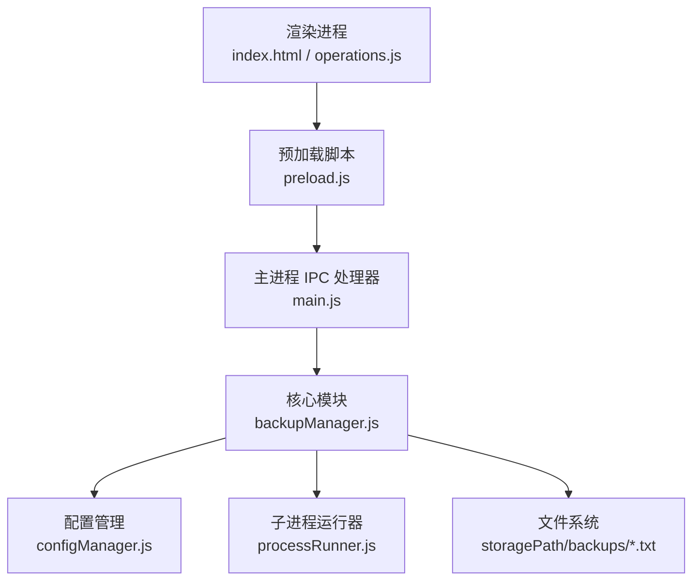
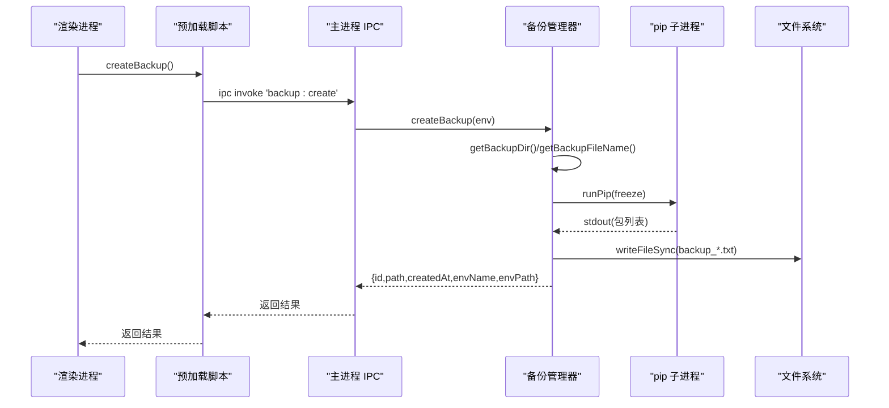
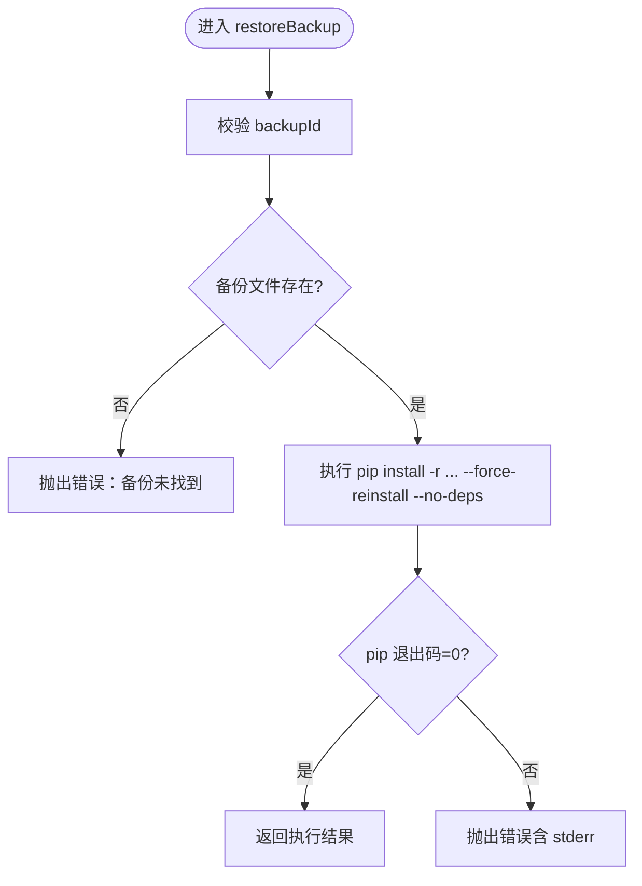
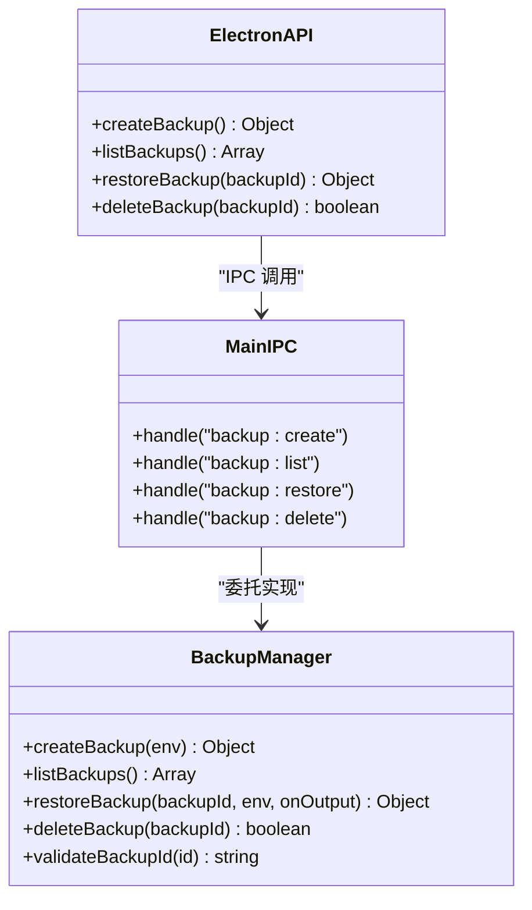
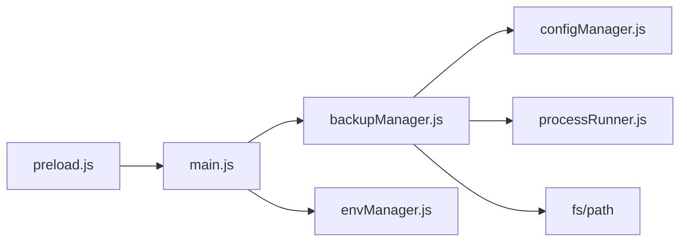

# 备份管理接口

<cite>
**本文引用的文件**   
- [backupManager.js](file://core/operations/backupManager.js)
- [main.js](file://main.js)
- [preload.js](file://preload.js)
- [configManager.js](file://core/config/configManager.js)
- [processRunner.js](file://utils/processRunner.js)
- [index.html](file://renderer/index.html)
</cite>

## 目录
1. [简介](#简介)
2. [项目结构](#项目结构)
3. [核心组件](#核心组件)
4. [架构总览](#架构总览)
5. [详细组件分析](#详细组件分析)
6. [依赖关系分析](#依赖关系分析)
7. [性能考虑](#性能考虑)
8. [故障排除指南](#故障排除指南)
9. [结论](#结论)
10. [附录](#附录)

## 简介
本文件为 PyLibMaster 的“备份管理接口”完整 API 文档，聚焦环境备份与恢复相关的 IPC 接口。内容涵盖：
- createBackup（创建备份）
- listBackups（列出备份）
- restoreBackup（恢复备份）
- deleteBackup（删除备份）
并详细说明备份数据结构、存储位置与文件格式；解释完整性校验机制与恢复过程中的错误处理；提供备份策略建议与最佳实践；包含实际的操作流程与故障排除指南。

## 项目结构
备份功能贯穿渲染进程、预加载桥接、主进程 IPC 处理器与核心业务模块，关键路径如下：
- 渲染进程通过 window.electronAPI 暴露的备份方法调用 IPC
- 主进程注册 backup:* IPC 处理器，转发到 core/operations/backupManager.js
- backupManager 使用配置管理器获取存储路径，使用 processRunner 执行 pip freeze/install
- 备份文件以 txt 格式保存在配置的 storagePath/backups 目录下

图表来源
- [preload.js:66-72](file://preload.js#L66-L72)
- [main.js:355-368](file://main.js#L355-L368)
- [backupManager.js:1-196](file://core/operations/backupManager.js#L1-L196)
- [configManager.js:180-194](file://core/config/configManager.js#L180-L194)
- [processRunner.js:340-342](file://utils/processRunner.js#L340-L342)

章节来源
- [preload.js:66-72](file://preload.js#L66-L72)
- [main.js:355-368](file://main.js#L355-L368)
- [backupManager.js:1-196](file://core/operations/backupManager.js#L1-L196)
- [configManager.js:180-194](file://core/config/configManager.js#L180-L194)
- [processRunner.js:340-342](file://utils/processRunner.js#L340-L342)

## 核心组件
- 备份管理器（backupManager.js）
  - 职责：创建/列出/恢复/删除备份；备份 ID 安全校验；生成文件名；调用 pip freeze/install
  - 关键函数：createBackup、listBackups、restoreBackup、deleteBackup、validateBackupId、getBackupDir、getBackupFileName
- 主进程 IPC 处理器（main.js）
  - 职责：注册 backup:create/list/restore/delete 处理器，桥接渲染进程与核心模块
- 预加载桥接（preload.js）
  - 职责：将 electronAPI.createBackup/listBackups/restoreBackup/deleteBackup 暴露给渲染进程
- 配置管理（configManager.js）
  - 职责：提供 getStoragePath，决定备份目录所在根路径
- 子进程运行器（processRunner.js）
  - 职责：runPip 封装 python -m pip，支持超时、取消、输出回调

章节来源
- [backupManager.js:1-196](file://core/operations/backupManager.js#L1-L196)
- [main.js:355-368](file://main.js#L355-L368)
- [preload.js:66-72](file://preload.js#L66-L72)
- [configManager.js:180-194](file://core/config/configManager.js#L180-L194)
- [processRunner.js:340-342](file://utils/processRunner.js#L340-L342)

## 架构总览
备份管理的端到端调用链如下：

图表来源
- [preload.js:66-72](file://preload.js#L66-L72)
- [main.js:355-368](file://main.js#L355-L368)
- [backupManager.js:89-113](file://core/operations/backupManager.js#L89-L113)
- [processRunner.js:340-342](file://utils/processRunner.js#L340-L342)

## 详细组件分析

### 备份管理器（backupManager.js）
- 备份目录与文件名
  - 目录：{storagePath}/backups/（不存在则自动创建）
  - 文件名：backup_{环境名}_{ISO时间戳}.txt
- 备份 ID 校验
  - 仅允许 backup_ 前缀且 .txt 后缀
  - 禁止路径穿越字符（/、\、..）
  - 最大长度限制
- 创建备份（createBackup）
  - 输入：当前 Python 环境对象
  - 行为：执行 pip freeze，写入 txt 文件
  - 返回：备份元信息（id、path、createdAt、envName、envPath）
- 列出备份（listBackups）
  - 行为：读取 backups 目录，过滤 backup_*.txt，按修改时间倒序
  - 返回：[{id, path, createdAt, size}]
- 恢复备份（restoreBackup）
  - 输入：backupId、env、可选 onOutput 回调
  - 行为：校验 backupId 与文件存在性，执行 pip install -r --force-reinstall --no-deps
  - 返回：pip 执行结果（stdout/stderr/code）
- 删除备份（deleteBackup）
  - 输入：backupId
  - 行为：校验并删除对应文件
  - 返回：布尔值（是否成功删除）

图表来源
- [backupManager.js:156-170](file://core/operations/backupManager.js#L156-L170)

章节来源
- [backupManager.js:29-78](file://core/operations/backupManager.js#L29-L78)
- [backupManager.js:89-113](file://core/operations/backupManager.js#L89-L113)
- [backupManager.js:122-142](file://core/operations/backupManager.js#L122-L142)
- [backupManager.js:156-170](file://core/operations/backupManager.js#L156-L170)
- [backupManager.js:179-193](file://core/operations/backupManager.js#L179-L193)

### IPC 接口定义（main.js + preload.js）
- 渲染进程 API（window.electronAPI）
  - createBackup(): Promise<Object>
  - listBackups(): Promise<Array<Object>>
  - restoreBackup(backupId): Promise<Object>
  - deleteBackup(backupId): Promise<boolean>
- 主进程 IPC 处理器
  - backup:create → 调用 backupManager.createBackup(envManager.getCurrent())
  - backup:list → 调用 backupManager.listBackups()
  - backup:restore → 调用 backupManager.restoreBackup(backupId, env, onOutput)
  - backup:delete → 调用 backupManager.deleteBackup(backupId)

图表来源
- [preload.js:66-72](file://preload.js#L66-L72)
- [main.js:355-368](file://main.js#L355-L368)
- [backupManager.js:1-196](file://core/operations/backupManager.js#L1-L196)

章节来源
- [preload.js:66-72](file://preload.js#L66-L72)
- [main.js:355-368](file://main.js#L355-L368)

### 数据模型与文件格式
- 备份文件命名规则
  - 格式：backup_{环境名}_{ISO时间戳}.txt
  - 示例：backup_myenv_2024-10-01T12-34-56.txt（时间戳中的冒号与点被替换）
- 存储位置
  - 根路径：configManager.getStoragePath()
  - 备份目录：{storagePath}/backups/
- 文件内容
  - pip freeze 的输出，每行一个包及版本（如 package==version）
- 备份元信息（createBackup 返回值）
  - id：文件名
  - path：绝对路径
  - createdAt：本地化时间字符串
  - envName：环境名称
  - envPath：Python 可执行路径

章节来源
- [backupManager.js:46-51](file://core/operations/backupManager.js#L46-L51)
- [backupManager.js:29-34](file://core/operations/backupManager.js#L29-L34)
- [backupManager.js:89-113](file://core/operations/backupManager.js#L89-L113)
- [configManager.js:180-194](file://core/config/configManager.js#L180-L194)

### 完整性验证与安全校验
- 备份 ID 校验
  - 类型检查、长度限制、禁止路径穿越、正则匹配 backup_*.txt
- 文件存在性检查
  - 恢复与删除前均检查目标文件是否存在
- 管道输出清理
  - 子进程输出经过 ANSI 清理，避免终端控制序列污染日志或状态

章节来源
- [backupManager.js:62-78](file://core/operations/backupManager.js#L62-L78)
- [backupManager.js:156-170](file://core/operations/backupManager.js#L156-L170)
- [processRunner.js:116-127](file://utils/processRunner.js#L116-L127)

### 错误处理与回滚策略
- 创建失败
  - 捕获异常并记录日志，抛出带上下文的错误信息
- 恢复失败
  - 若 pip 非零退出码，抛出错误并附带 stderr/stdout
  - 使用 --force-reinstall 与 --no-deps 确保版本一致性
- 删除失败
  - 捕获异常并记录日志，抛出错误
- 操作取消
  - 通过 operationId 取消关联的子进程（适用于安装/卸载等长耗时操作）

章节来源
- [backupManager.js:109-113](file://core/operations/backupManager.js#L109-L113)
- [backupManager.js:156-170](file://core/operations/backupManager.js#L156-L170)
- [backupManager.js:189-193](file://core/operations/backupManager.js#L189-L193)
- [processRunner.js:181-191](file://utils/processRunner.js#L181-L191)

### 前端交互与操作流程
- 卸载前备份确认弹窗
  - 用户可选择“确认备份并卸载”或“跳过备份”
- 进度反馈
  - 通过 pip:progress 事件推送实时输出（包括 rollback 阶段）
- 刷新与提示
  - 操作完成后刷新已安装列表与统计，显示 Toast 通知

章节来源
- [index.html:994-1004](file://renderer/index.html#L994-L1004)
- [preload.js:177-184](file://preload.js#L177-L184)

## 依赖关系分析
- 模块耦合
  - main.js 依赖 backupManager、envManager、logManager
  - backupManager 依赖 configManager、logManager、processRunner
  - preload.js 仅作为桥接，不直接访问 Node API
- 外部依赖
  - pip 命令（python -m pip）
  - 文件系统（fs、path）
  - Electron（app.getPath、userData）

图表来源
- [main.js:355-368](file://main.js#L355-L368)
- [backupManager.js:1-24](file://core/operations/backupManager.js#L1-L24)
- [configManager.js:1-20](file://core/config/configManager.js#L1-L20)
- [processRunner.js:1-20](file://utils/processRunner.js#L1-L20)

章节来源
- [main.js:355-368](file://main.js#L355-L368)
- [backupManager.js:1-24](file://core/operations/backupManager.js#L1-L24)
- [configManager.js:1-20](file://core/config/configManager.js#L1-L20)
- [processRunner.js:1-20](file://utils/processRunner.js#L1-L20)

## 性能考虑
- 并行与重试
  - 安装/更新等操作支持并行线程与智能重试，减少网络抖动影响
- 超时控制
  - pip 子进程具备超时保护，避免长时间阻塞
- 缓存
  - pip 就绪状态有短期缓存，降低重复检测开销
- I/O 优化
  - 备份文件写入采用同步写（小文件），列表读取使用同步遍历（目录较小）

章节来源
- [processRunner.js:150-160](file://utils/processRunner.js#L150-L160)
- [processRunner.js:213-278](file://utils/processRunner.js#L213-L278)
- [backupManager.js:122-142](file://core/operations/backupManager.js#L122-L142)

## 故障排除指南
- 常见问题
  - “未选择 Python 环境”：请确保已切换有效环境
  - “备份未找到”：检查 backupId 是否正确、文件是否存在于 backups 目录
  - “Command timeout”：网络或 pip 响应过慢，可增加超时或重试次数
  - “pip not found”：自动尝试 ensurepip 或下载 get-pip.py 安装
- 诊断步骤
  - 查看操作日志（log:get）
  - 检查 backups 目录内容与权限
  - 手动执行 pip freeze/install 验证环境可用性
- 恢复失败处理
  - 查看 stderr 输出定位具体包或依赖问题
  - 必要时先修复 pip 或网络代理设置

章节来源
- [backupManager.js:89-113](file://core/operations/backupManager.js#L89-L113)
- [backupManager.js:156-170](file://core/operations/backupManager.js#L156-L170)
- [processRunner.js:213-278](file://utils/processRunner.js#L213-L278)

## 结论
备份管理接口提供了稳定、安全的 Python 环境备份与恢复能力。通过严格的 ID 校验、明确的存储规范与完善的错误处理，能够在卸载、更新等高风险操作前后保障环境一致性。结合并行、重试与超时控制，整体具备良好的鲁棒性与性能表现。

## 附录

### API 参考（IPC）
- createBackup
  - 触发：ipcRenderer.invoke('backup:create')
  - 参数：无（内部使用当前环境）
  - 返回：{ id, path, createdAt, envName, envPath }
- listBackups
  - 触发：ipcRenderer.invoke('backup:list')
  - 返回：Array<{ id, path, createdAt, size }>
- restoreBackup
  - 触发：ipcRenderer.invoke('backup:restore', backupId)
  - 参数：backupId（字符串）
  - 返回：pip 执行结果（stdout/stderr/code）
- deleteBackup
  - 触发：ipcRenderer.invoke('backup:delete', backupId)
  - 参数：backupId（字符串）
  - 返回：boolean

章节来源
- [preload.js:66-72](file://preload.js#L66-L72)
- [main.js:355-368](file://main.js#L355-L368)

### 备份策略与最佳实践
- 在卸载/批量更新前创建备份，确保可回滚
- 定期归档重要环境的备份文件至外部存储
- 使用唯一且可读的命名（环境名+时间戳）便于检索
- 对敏感项目，可在恢复后执行依赖冲突检测与环境健康检查

[本节为通用指导，不直接分析具体文件]

### 实际操作流程
- 卸载前备份
  - 勾选“卸载前创建备份”，点击卸载
  - 弹出确认框，选择“确认备份并卸载”
  - 观察进度与日志，完成后刷新列表
- 从备份恢复
  - 选择目标 backupId
  - 调用 restoreBackup，监听 pip:progress 事件
  - 成功后验证包列表与依赖状态

章节来源
- [index.html:994-1004](file://renderer/index.html#L994-L1004)
- [preload.js:177-184](file://preload.js#L177-L184)
- [main.js:362-366](file://main.js#L362-L366)