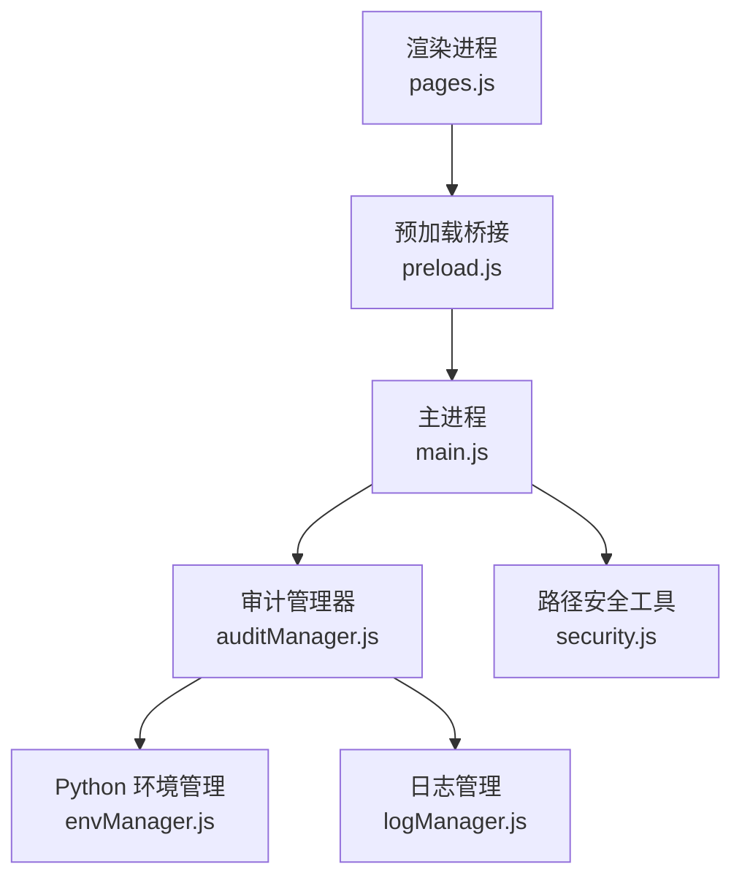
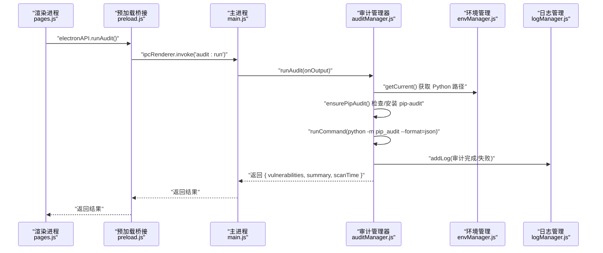
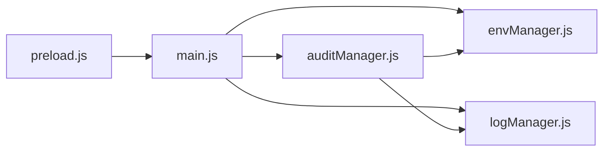

# 审计与安全接口

<cite>
**本文引用的文件**   
- [main.js](file://main.js)
- [preload.js](file://preload.js)
- [auditManager.js](file://core/operations/auditManager.js)
- [envManager.js](file://core/system/envManager.js)
- [logManager.js](file://core/system/logManager.js)
- [security.js](file://utils/security.js)
- [pages.js](file://renderer/js/pages.js)
- [package.json](file://package.json)
</cite>

## 目录
1. [简介](#简介)
2. [项目结构](#项目结构)
3. [核心组件](#核心组件)
4. [架构总览](#架构总览)
5. [详细组件分析](#详细组件分析)
6. [依赖关系分析](#依赖关系分析)
7. [性能与缓存机制](#性能与缓存机制)
8. [配置选项与使用指南](#配置选项与使用指南)
9. [结果解读与修复建议](#结果解读与修复建议)
10. [故障排查](#故障排查)
11. [结论](#结论)

## 简介
本文件为 PyLibMaster 的“安全漏洞扫描”相关 IPC 接口的权威文档，覆盖以下能力：
- runAudit（运行安全审计）
- getCachedAudit（获取缓存的审计结果）
- 审计结果的格式、漏洞分类与安全级别定义
- 缓存机制与性能优化策略
- 安全审计的配置项与结果解读指南
- 常见安全问题修复建议与最佳实践

该功能基于 pip-audit 对当前 Python 环境中已安装包的已知 CVE 进行扫描，自动安装缺失工具、解析 JSON 输出、推断严重等级并给出修复版本建议。

## 项目结构
与审计和安全相关的代码主要分布在如下位置：
- 主进程入口与 IPC 处理器：main.js
- 预加载桥接层（渲染进程 API 暴露）：preload.js
- 审计管理器（核心逻辑）：core/operations/auditManager.js
- Python 环境管理：core/system/envManager.js
- 日志记录：core/system/logManager.js
- 路径安全校验：utils/security.js
- 前端页面调用与渲染：renderer/js/pages.js
- 应用元信息与构建配置：package.json

图表来源
- [main.js:577-586](file://main.js#L577-L586)
- [preload.js:144-147](file://preload.js#L144-L147)
- [auditManager.js:1-230](file://core/operations/auditManager.js#L1-L230)
- [envManager.js:1-220](file://core/system/envManager.js#L1-L220)
- [logManager.js:1-173](file://core/system/logManager.js#L1-L173)
- [security.js:1-43](file://utils/security.js#L1-L43)

章节来源
- [main.js:577-586](file://main.js#L577-L586)
- [preload.js:144-147](file://preload.js#L144-L147)
- [auditManager.js:1-230](file://core/operations/auditManager.js#L1-L230)
- [envManager.js:1-220](file://core/system/envManager.js#L1-L220)
- [logManager.js:1-173](file://core/system/logManager.js#L1-L173)
- [security.js:1-43](file://utils/security.js#L1-L43)

## 核心组件
- auditManager.js：实现 pip-audit 的自动安装、执行、JSON 解析、严重等级推断、结果缓存与日志记录。
- main.js：注册 IPC 处理器 audit:run 和 audit:cached，转发到 auditManager。
- preload.js：向渲染进程暴露 electronAPI.runAudit 与 electronAPI.getCachedAudit。
- envManager.js：提供当前 Python 环境信息，供审计时选择正确的解释器。
- logManager.js：记录审计开始、完成、失败等事件。
- security.js：提供路径白名单校验，用于系统级安全操作（如打开路径）。

章节来源
- [auditManager.js:1-230](file://core/operations/auditManager.js#L1-L230)
- [main.js:577-586](file://main.js#L577-L586)
- [preload.js:144-147](file://preload.js#L144-L147)
- [envManager.js:1-220](file://core/system/envManager.js#L1-L220)
- [logManager.js:1-173](file://core/system/logManager.js#L1-L173)
- [security.js:1-43](file://utils/security.js#L1-L43)

## 架构总览
审计流程通过 Electron 的 IPC 通道在渲染进程与主进程之间通信，主进程调用审计管理器执行 pip-audit 并返回结构化结果。

图表来源
- [preload.js:144-147](file://preload.js#L144-L147)
- [main.js:577-586](file://main.js#L577-L586)
- [auditManager.js:54-119](file://core/operations/auditManager.js#L54-L119)
- [envManager.js:178-184](file://core/system/envManager.js#L178-L184)
- [logManager.js:112-131](file://core/system/logManager.js#L112-L131)

## 详细组件分析

### IPC 接口：runAudit
- 触发方式：渲染进程调用 electronAPI.runAudit()
- IPC 通道：'audit:run'
- 行为：
  - 获取当前 Python 环境
  - 若未安装 pip-audit，则自动安装
  - 执行 python -m pip_audit --format=json
  - 解析 JSON 输出，推断严重等级，生成摘要统计
  - 写入审计日志
  - 返回结构化结果对象
- 错误处理：
  - 未选择 Python 环境抛出错误
  - pip-audit 安装失败抛出错误
  - 命令执行异常时尝试解析 stdout 中的 JSON 以返回部分结果或抛出原始错误

章节来源
- [preload.js:144-147](file://preload.js#L144-L147)
- [main.js:577-586](file://main.js#L577-L586)
- [auditManager.js:54-119](file://core/operations/auditManager.js#L54-L119)

### IPC 接口：getCachedAudit
- 触发方式：渲染进程调用 electronAPI.getCachedAudit()
- IPC 通道：'audit:cached'
- 行为：
  - 返回内存中最近一次扫描的结果（若未过期）
  - 过期则返回 null
- 适用场景：进入仪表盘时快速展示上次扫描结果，避免重复扫描

章节来源
- [preload.js:144-147](file://preload.js#L144-L147)
- [main.js:586](file://main.js#L586)
- [auditManager.js:209-214](file://core/operations/auditManager.js#L209-L214)

### 审计结果数据结构
- 顶层字段：
  - vulnerabilities：漏洞列表数组
  - summary：摘要统计对象
  - scanTime：扫描时间（ISO 字符串）
- vulnerabilities 元素字段：
  - id：CVE 或别名
  - package：包名
  - version：受影响版本
  - severity：严重等级（critical/high/medium/low/unknown）
  - summary：描述或摘要
  - fixVersion：建议修复版本
  - url：详情链接（可能为空）
  - aliases：别名列表
- summary 字段：
  - totalVulns：漏洞总数
  - affectedPackages：受影响包数量
  - critical/high/medium/low：按等级计数
  - fixable：可修复数量（存在 fixVersion）

章节来源
- [auditManager.js:126-187](file://core/operations/auditManager.js#L126-L187)

### 漏洞分类与安全级别定义
- 严重等级取值：critical、high、medium、low、unknown
- 推断规则：
  - 优先使用数据源提供的 severity
  - 若无，根据描述关键词推断：
    - critical：包含远程代码执行、RCE、critical 等
    - high：SQL 注入、任意代码执行、high 等
    - medium：XSS、拒绝服务、DOS 等
    - low：信息泄露、low 等
    - 其他：unknown
- 排序：按严重等级从高到低排序

章节来源
- [auditManager.js:194-203](file://core/operations/auditManager.js#L194-L203)
- [auditManager.js:170-173](file://core/operations/auditManager.js#L170-L173)

### 缓存机制与性能优化
- 内存缓存：
  - lastScanResult：最近一次扫描结果
  - lastScanTime：扫描时间戳
  - SCAN_CACHE_TTL：缓存有效期（默认 10 分钟）
- 读取策略：
  - runAudit 先检查缓存是否有效，若有效直接返回
  - getCachedResult 仅返回有效缓存，否则返回 null
- 清理策略：
  - clearCache 清空内存缓存
- 日志持久化：
  - 每次扫描完成后记录审计日志，便于回溯与导出

章节来源
- [auditManager.js:20-24](file://core/operations/auditManager.js#L20-L24)
- [auditManager.js:58-61](file://core/operations/auditManager.js#L58-L61)
- [auditManager.js:209-222](file://core/operations/auditManager.js#L209-L222)
- [auditManager.js:86-91](file://core/operations/auditManager.js#L86-L91)

### 前端调用与渲染
- 调用入口：pages.js 中的审计按钮点击后调用 api.runAudit()
- 渲染逻辑：renderAuditResult 将结果转换为徽章与漏洞列表
- 缓存加载：loadCachedAudit 在进入仪表盘时尝试加载缓存结果

章节来源
- [pages.js:1050-1116](file://renderer/js/pages.js#L1050-L1116)

## 依赖关系分析
- 模块耦合：
  - main.js 依赖 auditManager、envManager、logManager
  - auditManager 依赖 envManager、processRunner（外部）、logManager
  - preload.js 仅作为桥接，不引入业务逻辑
- 外部依赖：
  - pip-audit：通过 Python 子进程执行
  - Node.js 标准库：fs、path、os、child_process（通过 processRunner）
- 潜在循环依赖：无（auditManager 不反向依赖 main/preload）

图表来源
- [main.js:577-586](file://main.js#L577-L586)
- [auditManager.js:16-18](file://core/operations/auditManager.js#L16-L18)
- [preload.js:144-147](file://preload.js#L144-L147)

章节来源
- [main.js:577-586](file://main.js#L577-L586)
- [auditManager.js:16-18](file://core/operations/auditManager.js#L16-L18)
- [preload.js:144-147](file://preload.js#L144-L147)

## 性能与缓存机制
- 缓存有效期：10 分钟，减少重复扫描开销
- 并行与超时：
  - pip-audit 执行设置超时（默认 300 秒），防止长时间阻塞
  - pip-audit 安装超时（默认 120 秒）
- 进度反馈：
  - 通过 onOutput 回调推送实时输出（stdout/stderr）
- 日志防抖：
  - 日志写入采用防抖策略，降低频繁 I/O 影响

章节来源
- [auditManager.js:31-47](file://core/operations/auditManager.js#L31-L47)
- [auditManager.js:71-76](file://core/operations/auditManager.js#L71-L76)
- [logManager.js:72-83](file://core/system/logManager.js#L72-L83)

## 配置选项与使用指南
- 运行前准备：
  - 确保已选择有效的 Python 环境（envManager.getCurrent）
  - 首次运行会自动安装 pip-audit（需网络可用）
- 调用方式：
  - 渲染进程：await electronAPI.runAudit()
  - 获取缓存：await electronAPI.getCachedAudit()
- 进度监听：
  - 通过 ipcRenderer.on('pip:progress', ...) 接收实时输出
- 结果解读：
  - 查看 summary.totalVulns 与 summary.critical/high/medium/low
  - 关注 fixable 数量与每个漏洞的 fixVersion
- 日志导出：
  - 使用 log:export 导出 CSV 或 Markdown 格式

章节来源
- [preload.js:144-147](file://preload.js#L144-L147)
- [main.js:577-586](file://main.js#L577-L586)
- [auditManager.js:54-119](file://core/operations/auditManager.js#L54-L119)
- [logManager.js:112-131](file://core/system/logManager.js#L112-L131)

## 结果解读与修复建议
- 结果字段说明：
  - id：漏洞标识（如 CVE-XXXX-XXXX）
  - package/version：受影响的包与版本
  - severity：严重等级
  - summary：漏洞描述
  - fixVersion：建议升级到的最低版本
  - url：详细信息链接（可能为空）
- 修复建议：
  - 优先处理 critical/high 等级漏洞
  - 根据 fixVersion 升级对应包至安全版本
  - 若无法升级，考虑替代方案或临时缓解措施
- 最佳实践：
  - 定期运行审计（CI/CD 集成）
  - 锁定依赖版本（requirements.txt / lock 文件）
  - 监控新发布的 CVE 公告并及时响应

章节来源
- [auditManager.js:126-187](file://core/operations/auditManager.js#L126-L187)
- [auditManager.js:194-203](file://core/operations/auditManager.js#L194-L203)

## 故障排查
- 常见问题：
  - 未选择 Python 环境：请切换或检测环境
  - pip-audit 安装失败：检查网络与权限，手动安装 pip install pip-audit
  - 扫描超时：增加超时时间或检查网络状况
  - 缓存无效：等待过期或调用 clearCache 后重试
- 调试方法：
  - 查看日志（log:get）定位错误详情
  - 启用进度监听观察 pip-audit 输出
  - 确认当前环境的 pip 与 Python 版本兼容

章节来源
- [auditManager.js:54-119](file://core/operations/auditManager.js#L54-L119)
- [logManager.js:112-131](file://core/system/logManager.js#L112-L131)

## 结论
PyLibMaster 的安全审计功能通过标准化的 IPC 接口提供了易用且高效的漏洞扫描能力。其内存缓存、自动安装、严重等级推断与日志记录机制共同保障了良好的用户体验与可维护性。建议在生产环境中结合 CI/CD 定期执行审计，及时修复高危漏洞，保障软件供应链安全。