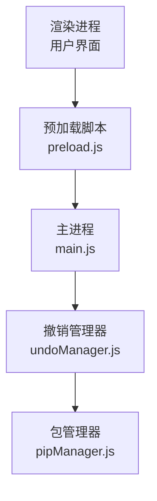
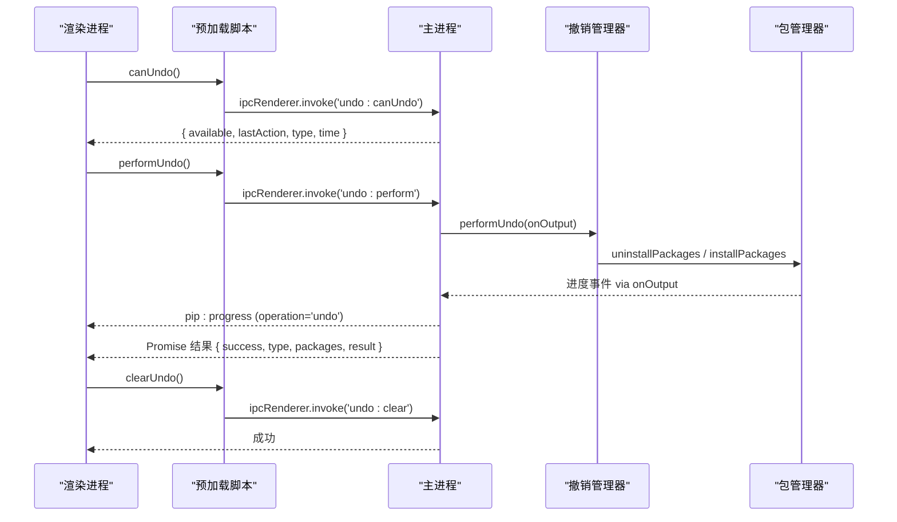
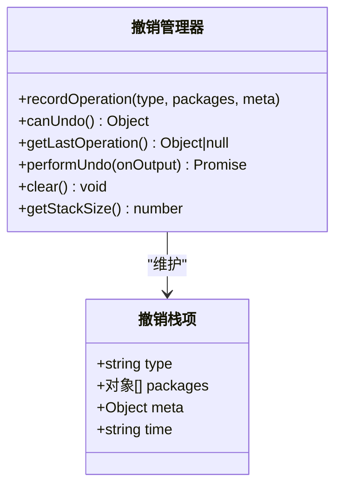
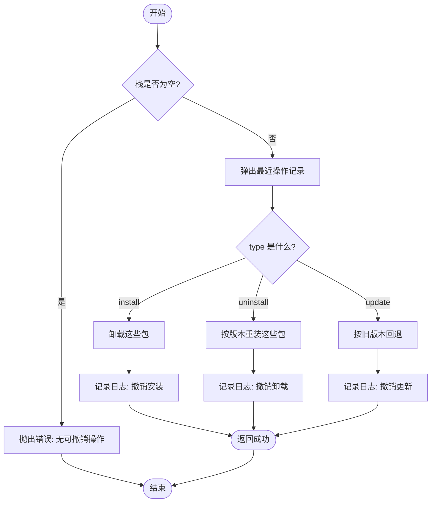

# 操作撤销接口

<cite>
**本文引用的文件**   
- [main.js](file://main.js)
- [preload.js](file://preload.js)
- [undoManager.js](file://core/operations/undoManager.js)
- [pipManager.js](file://core/operations/pipManager.js)
</cite>

## 目录
1. [简介](#简介)
2. [项目结构](#项目结构)
3. [核心组件](#核心组件)
4. [架构总览](#架构总览)
5. [详细组件分析](#详细组件分析)
6. [依赖关系分析](#依赖关系分析)
7. [性能考量](#性能考量)
8. [故障排查指南](#故障排查指南)
9. [结论](#结论)
10. [附录](#附录)

## 简介
本文件为“操作撤销”相关 IPC 接口的完整 API 文档，覆盖以下能力：
- canUndo：检查当前是否可撤销，并返回最近一次操作的摘要信息
- performUndo：执行撤销（安装→卸载、卸载→重装、更新→回退旧版本）
- clearUndo：清空撤销历史栈

同时说明撤销栈的数据结构、操作记录与恢复机制，解释触发条件与限制，并提供 UI 集成建议与用户体验优化方案。

## 项目结构
撤销功能由三层协作完成：
- 渲染进程通过 preload.js 暴露的 electronAPI 调用 IPC 方法
- 主进程 main.js 注册 IPC 处理器，转发到 core/operations/undoManager.js
- undoManager.js 维护内存中的撤销栈，并在撤销时调用 pipManager.js 执行逆向操作

图表来源
- [preload.js:167-170](file://preload.js#L167-L170)
- [main.js:619-631](file://main.js#L619-L631)
- [undoManager.js:1-131](file://core/operations/undoManager.js#L1-L131)
- [pipManager.js:714-771](file://core/operations/pipManager.js#L714-L771)

章节来源
- [main.js:619-631](file://main.js#L619-L631)
- [preload.js:167-170](file://preload.js#L167-L170)
- [undoManager.js:1-131](file://core/operations/undoManager.js#L1-L131)

## 核心组件
- 撤销管理器（undoManager.js）
  - 维护固定长度的撤销栈（最多 20 条），记录 type、packages、meta、time
  - 提供 recordOperation、canUndo、getLastOperation、performUndo、clear、getStackSize
- 主进程 IPC（main.js）
  - 暴露三个 IPC 通道：undo:canUndo、undo:perform、undo:clear
  - 将进度事件通过 pip:progress 推送给渲染进程
- 预加载桥接（preload.js）
  - 暴露 electronAPI.canUndo / performUndo / clearUndo 给渲染进程
  - 统一监听 pip:progress 事件，供 UI 实时展示进度

章节来源
- [undoManager.js:1-131](file://core/operations/undoManager.js#L1-L131)
- [main.js:619-631](file://main.js#L619-L631)
- [preload.js:167-170](file://preload.js#L167-L170)

## 架构总览
撤销流程的关键交互如下：

图表来源
- [preload.js:167-170](file://preload.js#L167-L170)
- [main.js:619-631](file://main.js#L619-L631)
- [undoManager.js:66-106](file://core/operations/undoManager.js#L66-L106)
- [pipManager.js:714-771](file://core/operations/pipManager.js#L714-L771)

## 详细组件分析

### 数据结构与状态
- 撤销栈项字段
  - type：操作类型，枚举值 install | uninstall | update
  - packages：数组，每项包含 name、version
  - meta：附加信息，如 update 时的 oldVersions
  - time：ISO 时间戳
- 栈大小上限：MAX_UNDO_STACK = 20，超出则从头部移除最旧记录

图表来源
- [undoManager.js:13-33](file://core/operations/undoManager.js#L13-L33)
- [undoManager.js:39-51](file://core/operations/undoManager.js#L39-L51)
- [undoManager.js:111-121](file://core/operations/undoManager.js#L111-L121)

章节来源
- [undoManager.js:13-33](file://core/operations/undoManager.js#L13-L33)
- [undoManager.js:39-51](file://core/operations/undoManager.js#L39-L51)
- [undoManager.js:111-121](file://core/operations/undoManager.js#L111-L121)

### IPC 接口定义

- 获取撤销状态
  - 通道名：undo:canUndo
  - 入参：无
  - 出参：{ available: boolean, lastAction: string|null, type?: string, time?: string }
  - 行为：若栈为空，available=false；否则返回最近一条记录的摘要与元信息

- 执行撤销
  - 通道名：undo:perform
  - 入参：无
  - 出参：Promise<{ success: boolean, type: string, packages: string[], result: any }>
  - 行为：弹出最近一条记录并执行逆向操作，期间通过 pip:progress 推送进度

- 清空撤销历史
  - 通道名：undo:clear
  - 入参：无
  - 出参：void
  - 行为：清空内存中的撤销栈

章节来源
- [main.js:619-631](file://main.js#L619-L631)
- [preload.js:167-170](file://preload.js#L167-L170)

### 撤销策略与恢复机制
- 安装撤销 → 卸载对应包
- 卸载撤销 → 按原版本重新安装（使用 version 字段）
- 更新撤销 → 根据 meta.oldVersions 回退到旧版本

图表来源
- [undoManager.js:66-106](file://core/operations/undoManager.js#L66-L106)

章节来源
- [undoManager.js:66-106](file://core/operations/undoManager.js#L66-L106)

### 触发条件与限制
- 触发条件
  - 仅当撤销栈非空时允许执行撤销
  - 支持三种操作类型的逆向逻辑
- 限制条件
  - 最大保留 20 条记录，超出自动丢弃最旧记录
  - 撤销失败会回推该记录（保证可重试）
  - 需要有效的 Python 环境与 pip 可用
  - 网络或权限问题可能导致撤销失败

章节来源
- [undoManager.js:13-33](file://core/operations/undoManager.js#L13-L33)
- [undoManager.js:66-106](file://core/operations/undoManager.js#L66-L106)

### 与包管理器的集成
- 撤销安装：调用卸载接口（安全模式、禁用回滚以避免二次回滚）
- 撤销卸载：调用安装接口（并行、重试）
- 撤销更新：调用安装接口（指定旧版本）

章节来源
- [pipManager.js:714-771](file://core/operations/pipManager.js#L714-L771)
- [pipManager.js:787-867](file://core/operations/pipManager.js#L787-L867)
- [pipManager.js:495-578](file://core/operations/pipManager.js#L495-L578)

## 依赖关系分析
- 模块耦合
  - main.js 依赖 undoManager 暴露 IPC 处理器
  - undoManager 依赖 pipManager 执行具体包操作
  - preload.js 作为桥接层，统一暴露 electronAPI 并处理进度事件
- 外部依赖
  - Electron IPC（ipcMain/ipcRenderer/contextBridge）
  - Node.js 文件系统与进程运行器（通过 pipManager）

图表来源
- [preload.js:167-170](file://preload.js#L167-L170)
- [main.js:619-631](file://main.js#L619-L631)
- [undoManager.js:1-131](file://core/operations/undoManager.js#L1-L131)
- [pipManager.js:714-771](file://core/operations/pipManager.js#L714-L771)

章节来源
- [main.js:619-631](file://main.js#L619-L631)
- [preload.js:167-170](file://preload.js#L167-L170)
- [undoManager.js:1-131](file://core/operations/undoManager.js#L1-L131)
- [pipManager.js:714-771](file://core/operations/pipManager.js#L714-L771)

## 性能考量
- 撤销栈容量限制为 20，避免无限增长
- 撤销过程复用 pipManager 的并行与重试能力，提升成功率
- 进度事件通过 pip:progress 推送，避免阻塞主线程
- 建议在 UI 侧对频繁操作进行节流，减少不必要的 IPC 调用

[本节为通用指导，不直接分析具体文件]

## 故障排查指南
- 常见问题
  - 无法撤销：检查撤销栈是否为空（canUndo.available）
  - 撤销失败：查看 pip:progress 输出与日志，确认网络、权限、环境可用性
  - 多次撤销失败：由于失败会回推记录，可重试直至成功
- 定位步骤
  - 在渲染进程监听 pip:progress，过滤 operation='undo' 的事件
  - 检查主进程日志中 [Undo] 相关条目
  - 验证 Python 环境与 pip 是否正常

章节来源
- [main.js:619-631](file://main.js#L619-L631)
- [preload.js:177-184](file://preload.js#L177-L184)
- [undoManager.js:66-106](file://core/operations/undoManager.js#L66-L106)

## 结论
撤销接口以简洁的 IPC 形式暴露 canUndo、performUndo、clearUndo 三项能力，配合固定长度栈与明确的逆向策略，为包管理操作提供了可靠的回退保障。结合 pip:progress 的实时反馈，可在 UI 上实现流畅的用户体验。

[本节为总结性内容，不直接分析具体文件]

## 附录

### 用户界面集成建议
- 按钮状态
  - 基于 canUndo 的结果启用/禁用“撤销”按钮
  - 显示 lastAction 文本提示最近可撤销的操作
- 进度反馈
  - 监听 pip:progress，过滤 operation='undo'，实时更新进度与状态
- 错误处理
  - 捕获 performUndo 异常，提示用户并重试
  - 提供“清空撤销历史”入口，用于清理无效记录

章节来源
- [preload.js:167-170](file://preload.js#L167-L170)
- [preload.js:177-184](file://preload.js#L177-L184)
- [main.js:619-631](file://main.js#L619-L631)

### 用户体验优化方案
- 渐进式提示
  - 首次可撤销时给予引导提示
  - 撤销进行中禁用其他危险操作，防止状态不一致
- 批量操作友好
  - 对于批量安装/卸载/更新，lastAction 仅展示前 3 个包名并附带总数提示
- 可观测性
  - 在日志面板中展示撤销相关条目，便于审计与回溯

章节来源
- [undoManager.js:39-51](file://core/operations/undoManager.js#L39-L51)
- [main.js:619-631](file://main.js#L619-L631)