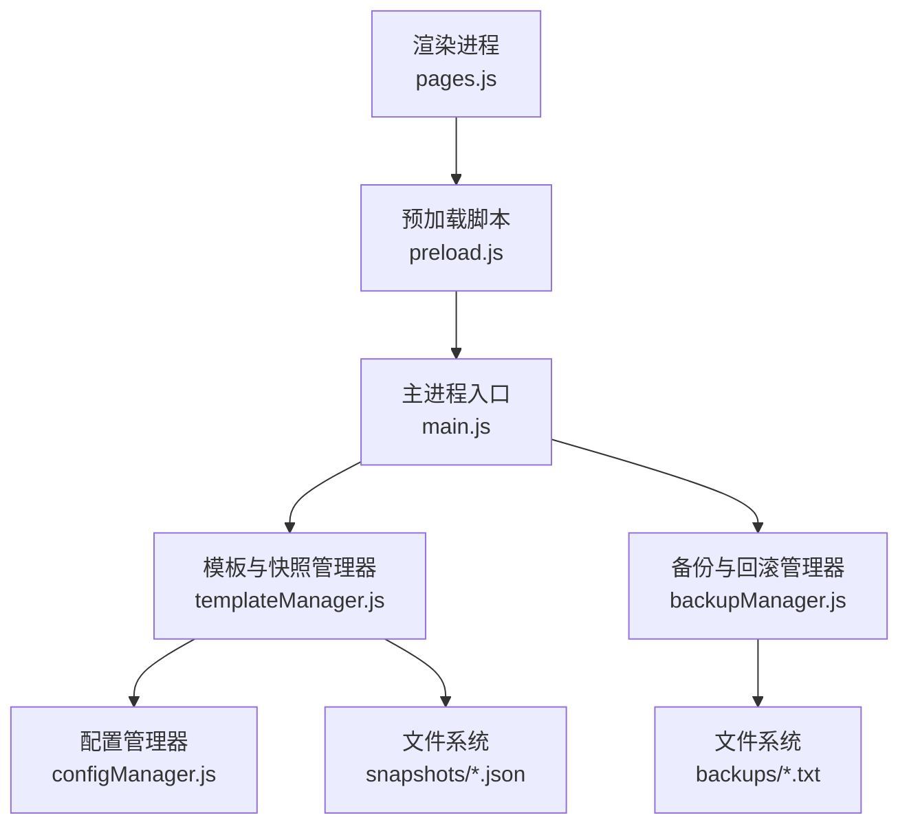
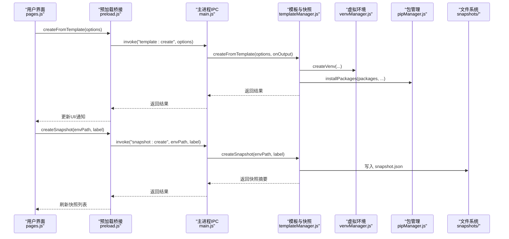
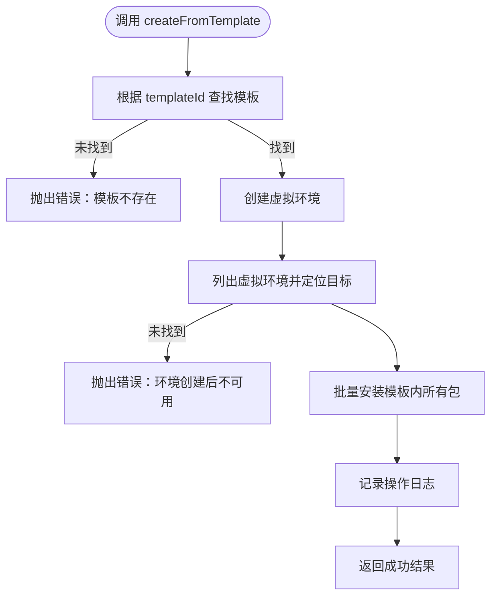
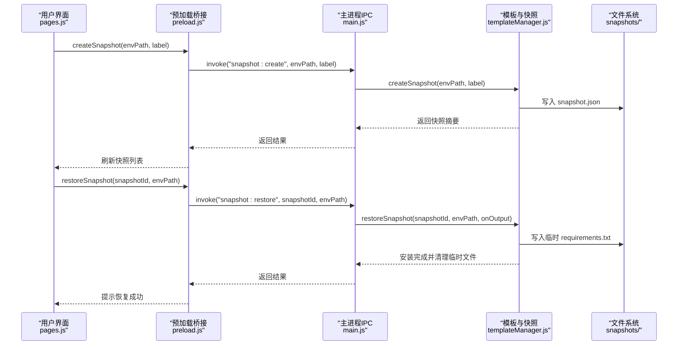
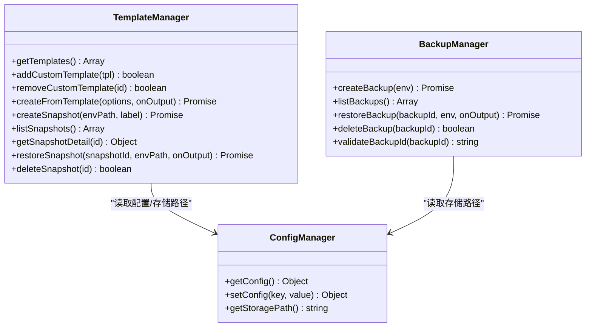

# 模板与快照接口

<cite>
**本文引用的文件**   
- [main.js](file://main.js)
- [preload.js](file://preload.js)
- [templateManager.js](file://core/operations/templateManager.js)
- [backupManager.js](file://core/operations/backupManager.js)
- [configManager.js](file://core/config/configManager.js)
- [pages.js](file://renderer/js/pages.js)
</cite>

## 目录
1. [简介](#简介)
2. [项目结构](#项目结构)
3. [核心组件](#核心组件)
4. [架构总览](#架构总览)
5. [详细组件分析](#详细组件分析)
6. [依赖关系分析](#依赖关系分析)
7. [性能考量](#性能考量)
8. [故障排查指南](#故障排查指南)
9. [结论](#结论)
10. [附录：模板开发指南与快照策略建议](#附录模板开发指南与快照策略建议)

## 简介
本文件为 PyLibMaster 的“模板与环境快照”相关 IPC 接口的完整 API 文档，覆盖以下能力：
- 模板管理：获取模板列表、添加自定义模板、删除自定义模板、基于模板创建项目环境。
- 快照管理：创建环境快照、列出快照、获取快照详情、恢复快照、删除快照。
同时说明模板与快照的数据结构、存储格式与版本管理机制，并提供模板开发指南与快照策略建议，帮助开发者高效扩展与维护。

## 项目结构
模板与快照功能由主进程（Electron）通过 IPC 暴露给渲染进程，核心逻辑位于 core/operations/templateManager.js；备份与回滚能力由 backupManager.js 提供；配置与存储路径由 configManager.js 管理；前端页面交互在 renderer/js/pages.js 中实现。

图示来源
- [main.js:548-576](file://main.js#L548-L576)
- [preload.js:133-142](file://preload.js#L133-L142)
- [templateManager.js:1-320](file://core/operations/templateManager.js#L1-L320)
- [backupManager.js:1-196](file://core/operations/backupManager.js#L1-L196)
- [configManager.js:180-194](file://core/config/configManager.js#L180-L194)

章节来源
- [main.js:548-576](file://main.js#L548-L576)
- [preload.js:133-142](file://preload.js#L133-L142)
- [templateManager.js:1-320](file://core/operations/templateManager.js#L1-L320)
- [backupManager.js:1-196](file://core/operations/backupManager.js#L1-L196)
- [configManager.js:180-194](file://core/config/configManager.js#L180-L194)

## 核心组件
- 模板与快照管理器（templateManager.js）
  - 内置模板集合与自定义模板持久化
  - 从模板创建虚拟环境并批量安装包
  - 环境快照的创建、列举、详情、恢复与删除
- 备份与回滚管理器（backupManager.js）
  - 基于 pip freeze 的环境备份与恢复
  - 备份 ID 安全校验与路径遍历防护
- 配置管理器（configManager.js）
  - 应用配置持久化与存储路径管理
- 渲染页面前端（pages.js）
  - 模板选择与创建表单、快照创建与恢复、UI 刷新与提示

章节来源
- [templateManager.js:1-320](file://core/operations/templateManager.js#L1-L320)
- [backupManager.js:1-196](file://core/operations/backupManager.js#L1-L196)
- [configManager.js:1-194](file://core/config/configManager.js#L1-L194)
- [pages.js:870-1042](file://renderer/js/pages.js#L870-L1042)

## 架构总览
模板与快照的 IPC 调用链路如下：
- 渲染进程通过 preload.js 暴露的 electronAPI 调用方法
- 主进程 main.js 注册对应 IPC 处理器，转发到 templateManager.js
- templateManager.js 调用 venvManager/pipManager/runPip 等工具完成操作
- 快照数据以 JSON 文件形式存储在 {storagePath}/snapshots/

图示来源
- [main.js:548-576](file://main.js#L548-L576)
- [preload.js:133-142](file://preload.js#L133-L142)
- [templateManager.js:118-154](file://core/operations/templateManager.js#L118-L154)
- [templateManager.js:175-209](file://core/operations/templateManager.js#L175-L209)

## 详细组件分析

### 模板管理 API
- getTemplates（获取模板列表）
  - IPC 通道：template:list
  - 参数：无
  - 返回：模板数组（包含内置与自定义模板）
  - 用途：渲染模板卡片网格，展示名称、图标、描述与包数量
- addCustomTemplate（添加自定义模板）
  - IPC 通道：template:add
  - 参数：{ name, icon?, description?, packages[] }
  - 返回：布尔值（是否成功）
  - 行为：生成唯一 id（custom-时间戳），标记 isCustom=true，持久化到配置
- removeCustomTemplate（删除自定义模板）
  - IPC 通道：template:remove
  - 参数：id（字符串）
  - 返回：布尔值
  - 行为：从配置的 customTemplates 中过滤移除
- createFromTemplate（基于模板创建项目）
  - IPC 通道：template:create
  - 参数：{ templateId, venvName, pythonPath }
  - 返回：Promise<Object>（success, venvName, packageCount, result）
  - 流程：创建虚拟环境 → 查找 venv 信息 → 批量安装包 → 记录日志

图示来源
- [templateManager.js:118-154](file://core/operations/templateManager.js#L118-L154)

章节来源
- [main.js:548-576](file://main.js#L548-L576)
- [preload.js:133-142](file://preload.js#L133-L142)
- [templateManager.js:72-110](file://core/operations/templateManager.js#L72-L110)
- [templateManager.js:118-154](file://core/operations/templateManager.js#L118-L154)
- [pages.js:886-958](file://renderer/js/pages.js#L886-L958)

### 快照管理 API
- createSnapshot（创建环境快照）
  - IPC 通道：snapshot:create
  - 参数：envPath（Python 环境路径）、label（可选备注）
  - 返回：Promise<Object>（id, fileName, envName, label, time, packageCount）
  - 行为：执行 pip freeze 获取包列表，生成 ISO 时间戳文件名，写入 snapshots/{id}.json
- listSnapshots（列出快照）
  - IPC 通道：snapshot:list
  - 参数：无
  - 返回：快照数组（不含 packages 详情，按时间倒序）
- getSnapshotDetail（获取快照详情）
  - IPC 通道：snapshot:detail
  - 参数：id（快照 ID）
  - 返回：完整快照对象（含 packages 列表）
  - 行为：安全清理 id 后缀 .json，读取 JSON 文件
- restoreSnapshot（恢复快照）
  - IPC 通道：snapshot:restore
  - 参数：snapshotId、envPath（目标环境 Python 路径）、onOutput（进度回调）
  - 返回：Promise<Object>（success, packageCount）
  - 行为：生成临时 requirements.txt，使用 pip install -r 安装，完成后清理临时文件
- deleteSnapshot（删除快照）
  - IPC 通道：snapshot:delete
  - 参数：id（快照 ID）
  - 返回：布尔值（是否成功删除）

图示来源
- [main.js:563-575](file://main.js#L563-L575)
- [preload.js:138-142](file://preload.js#L138-L142)
- [templateManager.js:175-209](file://core/operations/templateManager.js#L175-L209)
- [templateManager.js:257-292](file://core/operations/templateManager.js#L257-L292)

章节来源
- [main.js:563-575](file://main.js#L563-L575)
- [preload.js:138-142](file://preload.js#L138-L142)
- [templateManager.js:175-209](file://core/operations/templateManager.js#L175-L209)
- [templateManager.js:215-248](file://core/operations/templateManager.js#L215-L248)
- [templateManager.js:257-292](file://core/operations/templateManager.js#L257-L292)
- [templateManager.js:299-307](file://core/operations/templateManager.js#L299-L307)
- [pages.js:960-1042](file://renderer/js/pages.js#L960-L1042)

### 数据结构与存储格式
- 模板数据结构
  - 内置模板字段：id、name、icon、description、packages[]
  - 自定义模板字段：id（custom-时间戳）、name、icon、description、packages[]、isCustom=true
  - 存储位置：应用配置中的 customTemplates 数组
- 快照数据结构
  - 字段：id、fileName、envName、envPath、label、time、packageCount、packages[]
  - 存储位置：{storagePath}/snapshots/{id}.json
  - 命名规则：snapshot_{环境名}_{ISO时间戳}.json（时间戳去除冒号与点，取前19位）
- 备份数据结构（对比参考）
  - 备份文件：backup_{环境名}_{时间戳}.txt（纯文本，pip freeze 输出）
  - 存储位置：{storagePath}/backups/

章节来源
- [templateManager.js:23-66](file://core/operations/templateManager.js#L23-L66)
- [templateManager.js:175-209](file://core/operations/templateManager.js#L175-L209)
- [backupManager.js:46-51](file://core/operations/backupManager.js#L46-L51)
- [configManager.js:180-194](file://core/config/configManager.js#L180-L194)

### 版本管理机制
- 模板版本
  - 当前实现不维护模板版本字段；如需版本控制可在模板对象中添加 version 字段并在 UI 中显示
- 快照版本
  - 快照以时间戳区分不同时间点的环境状态，具备“时间旅行”回滚能力
  - 恢复时使用 pip install -r 精确安装记录的包及版本
- 备份版本
  - 备份文件以时间戳命名，便于回溯与比较

章节来源
- [templateManager.js:175-209](file://core/operations/templateManager.js#L175-L209)
- [backupManager.js:89-113](file://core/operations/backupManager.js#L89-L113)

## 依赖关系分析
- 模块耦合
  - templateManager.js 依赖 configManager.js（存储路径与配置读写）、logManager.js（操作日志）、processRunner.js（pip 命令执行）
  - backupManager.js 同样依赖 processRunner.js 与 logManager.js，且具备严格的备份 ID 校验
- 外部集成点
  - pipManager.js：包安装、卸载、更新等操作
  - venvManager.js：虚拟环境创建与管理
  - 文件系统：snapshots/ 与 backups/ 目录

图示来源
- [templateManager.js:309-319](file://core/operations/templateManager.js#L309-L319)
- [backupManager.js:195-196](file://core/operations/backupManager.js#L195-L196)
- [configManager.js:144-194](file://core/config/configManager.js#L144-L194)

章节来源
- [templateManager.js:309-319](file://core/operations/templateManager.js#L309-L319)
- [backupManager.js:195-196](file://core/operations/backupManager.js#L195-L196)
- [configManager.js:144-194](file://core/config/configManager.js#L144-L194)

## 性能考量
- 批量安装优化
  - createFromTemplate 支持并行安装与重试，减少网络波动影响
- 快照 I/O
  - 快照创建与恢复涉及大量 pip 子进程与磁盘写入，建议合理设置超时与并发
- 列表查询
  - listSnapshots 仅返回摘要信息，避免加载完整包列表导致 UI 卡顿

[本节为通用指导，无需特定文件引用]

## 故障排查指南
- 常见错误与处理
  - 模板不存在：检查 templateId 是否正确，确认模板已存在或已添加自定义模板
  - 虚拟环境创建失败：检查 pythonPath 是否有效，确保系统已安装 Python
  - 包安装失败：查看 pip 输出日志，确认网络与镜像源配置
  - 快照恢复失败：检查目标环境路径与权限，确认 pip 可执行
- 日志与诊断
  - 操作日志：通过 logManager.addLog 记录关键步骤与错误信息
  - 备份 ID 校验：backupManager.validateBackupId 防止路径遍历攻击

章节来源
- [templateManager.js:118-154](file://core/operations/templateManager.js#L118-L154)
- [templateManager.js:257-292](file://core/operations/templateManager.js#L257-L292)
- [backupManager.js:62-78](file://core/operations/backupManager.js#L62-L78)

## 结论
模板与快照接口提供了强大的环境初始化与回滚能力，结合内置模板与自定义模板机制，显著降低环境搭建成本。快照以时间戳命名与 pip freeze 记录，确保可重现性与一致性。建议在大规模团队中配合 CI/CD 与自动化策略，提升交付质量与效率。

[本节为总结性内容，无需特定文件引用]

## 附录：模板开发指南与快照策略建议

### 模板开发指南
- 模板设计原则
  - 明确领域：Web、数据分析、机器学习、爬虫、自动化等
  - 精简依赖：仅包含必要包，减少安装时间与体积
  - 版本稳定：固定主要包版本，避免上游变更导致不稳定
- 自定义模板步骤
  - 通过 addCustomTemplate 添加模板，指定 name、packages 等字段
  - 在 UI 中展示模板信息与包数量，便于选择与理解
- 最佳实践
  - 使用分组与注释组织依赖，便于维护
  - 定期审查与更新模板依赖，修复已知漏洞

章节来源
- [templateManager.js:83-98](file://core/operations/templateManager.js#L83-L98)
- [pages.js:886-958](file://renderer/js/pages.js#L886-L958)

### 快照策略建议
- 创建时机
  - 重要变更前创建快照，如升级核心库、修改配置文件
  - 周期性创建快照，保留关键历史状态
- 恢复策略
  - 恢复前备份当前环境，避免误操作丢失数据
  - 逐步恢复，先测试再全面切换
- 存储与清理
  - 定期清理过期快照，释放存储空间
  - 将快照纳入版本管理或归档策略，便于审计与回溯

章节来源
- [templateManager.js:175-209](file://core/operations/templateManager.js#L175-L209)
- [backupManager.js:89-113](file://core/operations/backupManager.js#L89-L113)