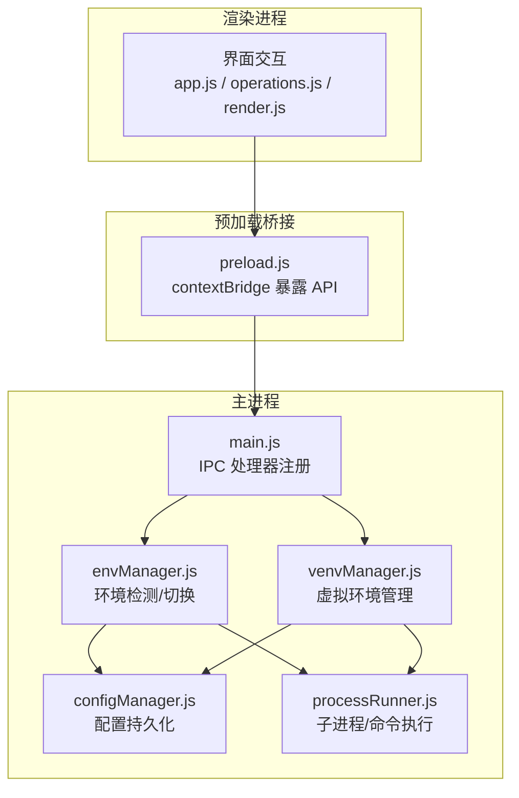
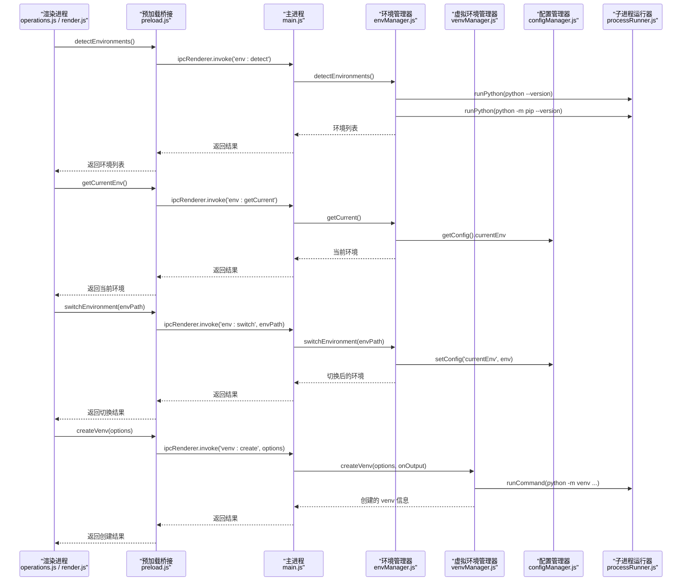
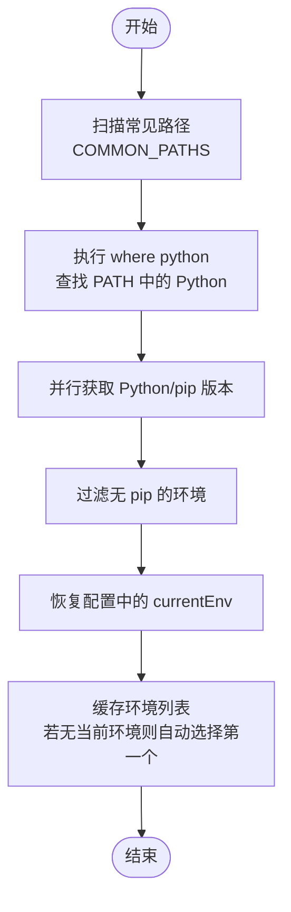
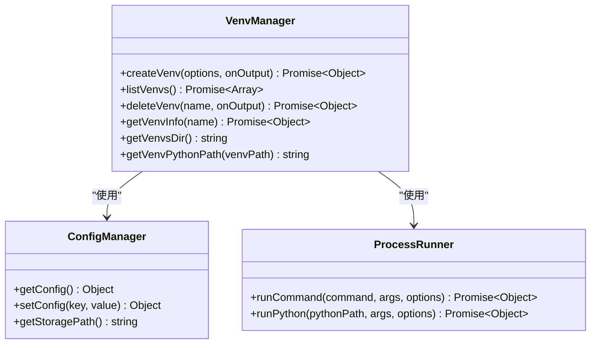
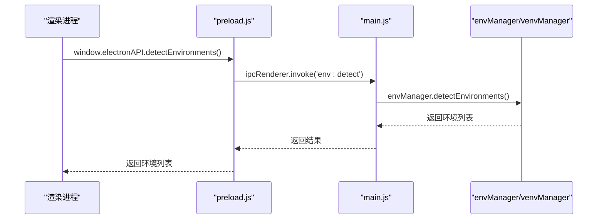
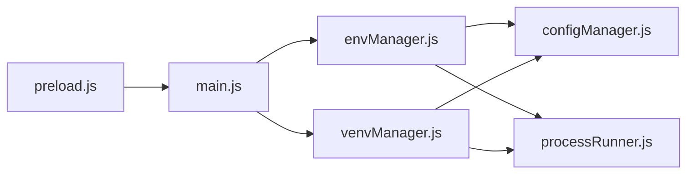

# 环境管理接口

<cite>
**本文引用的文件**   
- [main.js](file://main.js)
- [preload.js](file://preload.js)
- [envManager.js](file://core/system/envManager.js)
- [venvManager.js](file://core/operations/venvManager.js)
- [configManager.js](file://core/config/configManager.js)
- [processRunner.js](file://utils/processRunner.js)
- [app.js](file://renderer/js/app.js)
- [operations.js](file://renderer/js/operations.js)
- [render.js](file://renderer/js/render.js)
</cite>

## 目录
1. [简介](#简介)
2. [项目结构](#项目结构)
3. [核心组件](#核心组件)
4. [架构总览](#架构总览)
5. [详细组件分析](#详细组件分析)
6. [依赖关系分析](#依赖关系分析)
7. [性能考量](#性能考量)
8. [故障排查指南](#故障排查指南)
9. [结论](#结论)
10. [附录：API 参考与使用示例](#附录api-参考与使用示例)

## 简介
本文件为 PyLibMaster 的“环境管理接口”完整 API 文档，聚焦于 Python 环境检测与管理、虚拟环境管理的 IPC 接口。内容涵盖：
- 环境检测与切换：detectEnvironments（检测环境）、getCurrentEnv（获取当前环境）、switchEnvironment（切换环境）
- 虚拟环境管理：createVenv（创建虚拟环境）、listVenvs（列出虚拟环境）、deleteVenv（删除虚拟环境）、getVenvInfo（获取虚拟环境信息）
- 环境对象数据结构、版本兼容性检查、错误处理机制
- 前端调用方式与最佳实践

该文档面向开发者与使用者，既提供代码级实现细节，也提供易于理解的使用说明。

## 项目结构
与环境管理相关的核心模块分布如下：
- 主进程入口与 IPC 处理器：main.js
- 预加载桥接层（渲染进程安全暴露 API）：preload.js
- Python 环境管理器：core/system/envManager.js
- 虚拟环境管理器：core/operations/venvManager.js
- 配置持久化：core/config/configManager.js
- 子进程运行器（Python/pip 命令执行、超时与取消）：utils/processRunner.js
- 渲染进程页面逻辑（环境刷新与渲染）：renderer/js/app.js, renderer/js/operations.js, renderer/js/render.js

图表来源 
- [main.js:254-281](file://main.js#L254-L281)
- [preload.js:27-38](file://preload.js#L27-L38)
- [envManager.js:85-219](file://core/system/envManager.js#L85-L219)
- [venvManager.js:73-277](file://core/operations/venvManager.js#L73-L277)
- [configManager.js:80-193](file://core/config/configManager.js#L80-L193)
- [processRunner.js:85-161](file://utils/processRunner.js#L85-L161)

章节来源
- [main.js:254-281](file://main.js#L254-L281)
- [preload.js:27-38](file://preload.js#L27-L38)

## 核心组件
- 环境管理器 envManager.js
  - detectEnvironments：扫描常见路径与 PATH，并行获取 Python/pip 版本，过滤无 pip 的环境，恢复并缓存当前环境
  - getCurrent：优先内存缓存，回退到配置文件中的 currentEnv
  - switchEnvironment：从缓存或存在性校验后切换，并持久化 currentEnv
  - startDetection：应用启动时异步后台检测，不阻塞 UI
- 虚拟环境管理器 venvManager.js
  - createVenv：名称合法性校验、基础 Python 校验、构建 python -m venv 参数、失败清理、记录日志
  - listVenvs：遍历存储目录，验证有效 venv（python.exe + pyvenv.cfg），收集版本、pip 版本、包数量
  - deleteVenv：名称校验、路径安全检查（防路径穿越）、递归删除、记录日志
  - getVenvInfo：读取 pyvenv.cfg 获取 base Python，查询版本与 pip 版本
- 配置管理器 configManager.js
  - 提供 storagePath、currentEnv 等配置项读写与持久化
- 子进程运行器 processRunner.js
  - runCommand/runPython：统一子进程执行、超时、ANSI 清理、实时输出回调、取消能力
  - ensurePip：自动安装 pip（ensurepip/get-pip.py）

章节来源
- [envManager.js:85-219](file://core/system/envManager.js#L85-L219)
- [venvManager.js:73-277](file://core/operations/venvManager.js#L73-L277)
- [configManager.js:80-193](file://core/config/configManager.js#L80-L193)
- [processRunner.js:85-161](file://utils/processRunner.js#L85-L161)

## 架构总览
环境管理与虚拟环境管理的 IPC 调用链路如下：

图表来源 
- [main.js:254-281](file://main.js#L254-L281)
- [preload.js:27-38](file://preload.js#L27-L38)
- [envManager.js:85-219](file://core/system/envManager.js#L85-L219)
- [venvManager.js:73-130](file://core/operations/venvManager.js#L73-L130)
- [processRunner.js:85-161](file://utils/processRunner.js#L85-L161)

## 详细组件分析

### 环境管理器（envManager.js）
- 检测流程
  - 扫描 COMMON_PATHS（Windows 常见安装路径模式）
  - 执行 where python 查找 PATH 中的 Python
  - 并行获取每个环境的 Python 与 pip 版本
  - 过滤无 pip 的环境，生成友好名称
  - 恢复配置中保存的 currentEnv（若仍存在）
  - 缓存环境列表，若无当前环境则自动选择第一个并持久化
- 当前环境与切换
  - getCurrent：优先内存缓存，否则回退到配置
  - switchEnvironment：从缓存或存在性校验后切换，立即持久化
- 后台检测
  - startDetection：应用启动时异步执行，避免阻塞 UI

图表来源 
- [envManager.js:85-170](file://core/system/envManager.js#L85-L170)

章节来源
- [envManager.js:85-219](file://core/system/envManager.js#L85-L219)

### 虚拟环境管理器（venvManager.js）
- createVenv
  - 名称合法性校验（正则、长度限制）
  - 基础 Python 可执行文件存在性校验
  - 构建 python -m venv 参数（支持 without-pip、system-site-packages）
  - 失败清理残留目录，记录日志，抛出错误
  - 成功后读取 Python 版本，返回 venv 信息
- listVenvs
  - 遍历存储目录，验证有效 venv（python.exe + pyvenv.cfg）
  - 获取 Python 版本、pip 版本、已安装包数量
- deleteVenv
  - 名称校验、路径安全检查（防止路径穿越）
  - 递归删除目录，记录日志，抛出错误
- getVenvInfo
  - 读取 pyvenv.cfg 获取 base Python
  - 查询 Python 与 pip 版本，返回详细信息

图表来源 
- [venvManager.js:73-277](file://core/operations/venvManager.js#L73-L277)
- [configManager.js:80-193](file://core/config/configManager.js#L80-L193)
- [processRunner.js:85-161](file://utils/processRunner.js#L85-L161)

章节来源
- [venvManager.js:73-277](file://core/operations/venvManager.js#L73-L277)

### IPC 桥接与处理器（preload.js 与 main.js）
- preload.js
  - 通过 contextBridge.exposeInMainWorld 暴露 electronAPI
  - 将渲染进程的调用映射到 ipcRenderer.invoke
- main.js
  - 注册 IPC 处理器：env:detect、env:getCurrent、env:switch、venv:create、venv:list、venv:delete、venv:info
  - 将渲染进程请求转发至对应核心模块

图表来源 
- [preload.js:27-38](file://preload.js#L27-L38)
- [main.js:254-281](file://main.js#L254-L281)

章节来源
- [preload.js:27-38](file://preload.js#L27-L38)
- [main.js:254-281](file://main.js#L254-L281)

### 前端使用（operations.js 与 render.js）
- refreshEnvs：调用 api.detectEnvironments 与 api.getCurrentEnv，更新当前环境索引，刷新 venv 列表与基础 Python 下拉选项
- renderEnvs：渲染环境卡片，显示名称、路径、版本
- renderVenvs：渲染虚拟环境列表，显示 Python 版本、pip 版本、包数量，并提供“使用”和“删除”按钮
- renderVenvBaseOptions：根据检测到的环境填充创建表单的基础 Python 下拉选项

章节来源
- [operations.js:420-431](file://renderer/js/operations.js#L420-L431)
- [render.js:323-376](file://renderer/js/render.js#L323-L376)

## 依赖关系分析
- 主进程依赖
  - main.js 依赖 envManager、venvManager、configManager、processRunner
- 环境管理器依赖
  - envManager 依赖 configManager（currentEnv 持久化）、processRunner（Python/pip 命令执行）
- 虚拟环境管理器依赖
  - venvManager 依赖 configManager（storagePath）、processRunner（python -m venv、pip 命令执行）
- 预加载桥接依赖
  - preload.js 依赖 Electron 的 contextBridge 与 ipcRenderer

图表来源 
- [main.js:254-281](file://main.js#L254-L281)
- [envManager.js:85-219](file://core/system/envManager.js#L85-L219)
- [venvManager.js:73-277](file://core/operations/venvManager.js#L73-L277)
- [configManager.js:80-193](file://core/config/configManager.js#L80-L193)
- [processRunner.js:85-161](file://utils/processRunner.js#L85-L161)
- [preload.js:27-38](file://preload.js#L27-L38)

章节来源
- [main.js:254-281](file://main.js#L254-L281)

## 性能考量
- 并行检测：envManager 在检测阶段并行获取多个环境的 Python/pip 版本，提升多环境场景下的检测速度
- 超时与取消：processRunner 对子进程设置超时（SIGTERM + SIGKILL），支持按 operationId 取消操作，避免长时间阻塞
- 配置原子写入：configManager 使用临时文件+重命名策略，降低崩溃导致配置文件损坏的风险
- 前端懒加载：渲染进程分阶段加载数据，优先显示缓存数据，后台异步刷新完整列表

[本节为通用指导，无需特定文件引用]

## 故障排查指南
- 未检测到 Python 环境
  - 确认系统 PATH 中包含 Python，或安装路径匹配 COMMON_PATHS
  - 确保环境中包含 pip（envManager 会过滤无 pip 的环境）
- 切换环境失败
  - 检查 envPath 是否存在；不存在将抛出错误
  - 查看配置文件 currentEnv 是否指向无效路径
- 创建虚拟环境失败
  - 名称不符合规则或过长
  - 基础 Python 不存在
  - 创建过程中异常会清理残留目录并记录日志
- 删除虚拟环境失败
  - 名称非法或 venv 不存在
  - 路径安全检查失败（路径穿越）
- 子进程超时或取消
  - 检查 processRunner 的超时配置与取消逻辑
  - 查看日志中 stderr/stdout 输出

章节来源
- [envManager.js:196-209](file://core/system/envManager.js#L196-L209)
- [venvManager.js:73-130](file://core/operations/venvManager.js#L73-L130)
- [venvManager.js:195-224](file://core/operations/venvManager.js#L195-L224)
- [processRunner.js:85-161](file://utils/processRunner.js#L85-L161)

## 结论
环境管理接口通过清晰的 IPC 分层与模块化设计，提供了稳定可靠的 Python 环境检测、切换与虚拟环境管理能力。结合配置持久化与子进程运行器的健壮性保障，用户可以在应用中高效地管理多种 Python 环境，并在需要时快速创建、使用与清理虚拟环境。

[本节为总结，无需特定文件引用]

## 附录：API 参考与使用示例

### IPC 方法定义
- 环境管理
  - detectEnvironments：检测系统中所有可用的 Python 环境
    - 调用：window.electronAPI.detectEnvironments()
    - 返回：Promise<Array> 环境列表 [{ name, path, version, pipVersion }]
  - getCurrentEnv：获取当前选中的 Python 环境
    - 调用：window.electronAPI.getCurrentEnv()
    - 返回：Promise<Object|null> 当前环境信息
  - switchEnvironment：切换到指定的 Python 环境
    - 调用：window.electronAPI.switchEnvironment(envPath)
    - 参数：envPath（string）— Python 可执行文件路径
    - 返回：Promise<Object> 切换后的环境信息
    - 异常：当 envPath 不存在时抛出错误
- 虚拟环境管理
  - createVenv：创建虚拟环境
    - 调用：window.electronAPI.createVenv(options)
    - 参数：options（Object）{ name, pythonPath, withPip?, systemSitePackages? }
    - 返回：Promise<Object> { name, path, pythonPath, version }
    - 异常：名称不合法、基础 Python 不存在、创建失败
  - listVenvs：列出所有已创建的虚拟环境
    - 调用：window.electronAPI.listVenvs()
    - 返回：Promise<Array> [{ name, path, pythonPath, version, pipVersion, packageCount }]
  - deleteVenv：删除虚拟环境
    - 调用：window.electronAPI.deleteVenv(name)
    - 参数：name（string）— venv 名称
    - 返回：Promise<Object> { success, name }
    - 异常：名称非法、venv 不存在、删除失败
  - getVenvInfo：获取虚拟环境详细信息
    - 调用：window.electronAPI.getVenvInfo(name)
    - 参数：name（string）— venv 名称
    - 返回：Promise<Object> { name, path, pythonPath, version, pipVersion, basePython }
    - 异常：名称非法、venv 不存在

章节来源
- [preload.js:27-38](file://preload.js#L27-L38)
- [main.js:254-281](file://main.js#L254-L281)
- [envManager.js:85-219](file://core/system/envManager.js#L85-L219)
- [venvManager.js:73-277](file://core/operations/venvManager.js#L73-L277)

### 环境对象数据结构
- 环境对象（Python 环境）
  - name：string — 友好名称（如 “Python 3.10” 或基于路径推断的名称）
  - path：string — Python 可执行文件路径
  - version：string — Python 版本号（如 “3.10.4”）
  - pipVersion：string — pip 版本号（如 “23.2.1”）
- 虚拟环境对象（venv）
  - name：string — venv 名称
  - path：string — venv 根目录路径
  - pythonPath：string — venv 内 Python 可执行文件路径
  - version：string — Python 版本号
  - pipVersion：string | null — pip 版本号（可能为空）
  - packageCount：number — 已安装包数量
  - basePython：string — 基础 Python 路径（来自 pyvenv.cfg）

章节来源
- [envManager.js:142-148](file://core/system/envManager.js#L142-L148)
- [venvManager.js:175-183](file://core/operations/venvManager.js#L175-L183)
- [venvManager.js:267](file://core/operations/venvManager.js#L267)

### 版本兼容性检查
- 检测范围
  - 系统默认 Python 安装路径
  - Anaconda/Miniconda 环境
  - Windows Store Python
  - 用户目录下的 Python 安装
- 过滤策略
  - 仅保留包含 pip 的环境（确保后续包管理可用）
- 自动选择
  - 若无当前环境且列表非空，自动选择第一个并持久化

章节来源
- [envManager.js:31-41](file://core/system/envManager.js#L31-L41)
- [envManager.js:129-169](file://core/system/envManager.js#L129-L169)

### 错误处理机制
- 环境切换
  - 路径不存在：抛出错误 “Environment not found: <path>”
- 虚拟环境创建
  - 名称不合法或过长：抛出错误 “Invalid venv name: <name>” 或 “Venv name too long...”
  - 基础 Python 不存在：抛出错误 “Base Python not found: <path>”
  - 创建失败：清理残留目录，记录日志，抛出错误 “Failed to create venv: <message>”
- 虚拟环境删除
  - 名称非法或不存在：抛出错误 “Invalid venv name: <name>” 或 “Virtual environment \"<name>\" not found”
  - 路径穿越检测：抛出错误 “Invalid venv path (path traversal detected)”
  - 删除失败：记录日志，抛出错误 “Failed to delete venv: <message>”
- 子进程执行
  - 超时：抛出错误 “Command timeout”，并尝试 SIGTERM + SIGKILL 终止
  - 非零退出码：构造错误对象包含 stdout/stderr 与 code

章节来源
- [envManager.js:196-209](file://core/system/envManager.js#L196-L209)
- [venvManager.js:73-130](file://core/operations/venvManager.js#L73-L130)
- [venvManager.js:195-224](file://core/operations/venvManager.js#L195-L224)
- [processRunner.js:85-161](file://utils/processRunner.js#L85-L161)

### 实际使用场景与最佳实践
- 启动时检测环境并渲染
  - 调用 detectEnvironments 获取环境列表
  - 调用 getCurrentEnv 获取当前环境，更新 UI 状态
  - 若当前环境不在列表中但路径存在，尝试补充版本信息并插入列表
- 创建虚拟环境
  - 校验名称与基础 Python 路径
  - 传递 withPip 与 systemSitePackages 选项
  - 监听 pip:progress 事件以展示进度
- 切换环境
  - 先调用 detectEnvironments 刷新列表
  - 再调用 switchEnvironment 切换，并刷新 UI
- 删除虚拟环境
  - 先调用 listVenvs 确认存在
  - 调用 deleteVenv 删除，并刷新列表

章节来源
- [operations.js:420-431](file://renderer/js/operations.js#L420-L431)
- [render.js:323-376](file://renderer/js/render.js#L323-L376)
- [preload.js:27-38](file://preload.js#L27-L38)
- [main.js:254-281](file://main.js#L254-L281)