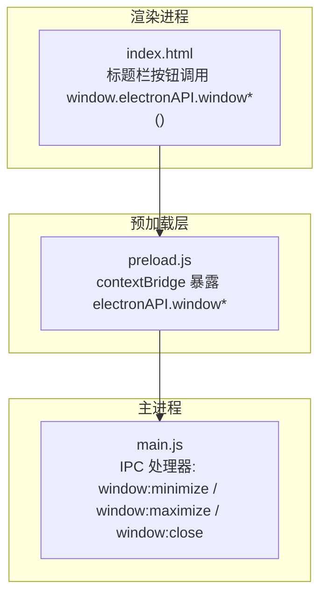
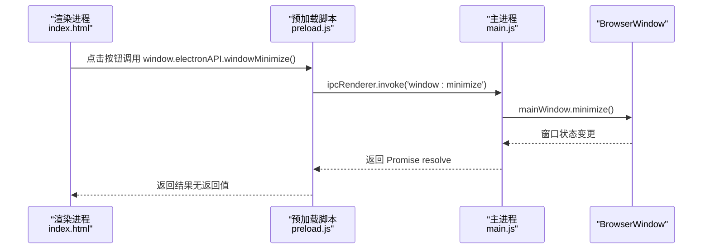
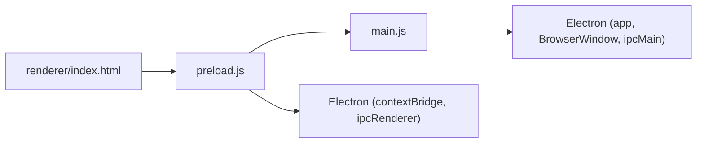

# 窗口控制接口

<cite>
**本文引用的文件**   
- [main.js](file://main.js)
- [preload.js](file://preload.js)
- [renderer/index.html](file://renderer/index.html)
- [package.json](file://package.json)
</cite>

## 目录
1. [简介](#简介)
2. [项目结构](#项目结构)
3. [核心组件](#核心组件)
4. [架构总览](#架构总览)
5. [详细组件分析](#详细组件分析)
6. [依赖关系分析](#依赖关系分析)
7. [性能与行为特性](#性能与行为特性)
8. [故障排查指南](#故障排查指南)
9. [结论](#结论)
10. [附录：渲染进程调用示例](#附录渲染进程调用示例)

## 简介
本文件为 PyLibMaster 的“窗口控制接口”API 文档，聚焦 Electron 主进程与渲染进程之间的 IPC 通信，覆盖以下方法：
- windowMinimize（最小化窗口）
- windowMaximize（最大化/还原窗口）
- windowClose（关闭窗口）

文档同时解释 Electron 窗口生命周期管理、事件处理机制、错误处理策略，并提供在渲染进程中调用这些接口的完整示例路径。

## 项目结构
本项目采用标准的 Electron 三进程模型：
- 主进程（main.js）：创建和管理 BrowserWindow，注册所有 IPC 处理器，实现窗口控制逻辑。
- 预加载脚本（preload.js）：通过 contextBridge 安全暴露 API，将渲染进程的调用转发到主进程。
- 渲染进程（index.html + js/*）：用户界面与交互，通过 window.electronAPI 调用窗口控制方法。

图表来源
- [main.js:237-252](file://main.js#L237-L252)
- [preload.js:20-26](file://preload.js#L20-L26)
- [renderer/index.html:45-53](file://renderer/index.html#L45-L53)

章节来源
- [main.js:1-123](file://main.js#L1-L123)
- [preload.js:1-26](file://preload.js#L1-L26)
- [renderer/index.html:33-55](file://renderer/index.html#L33-L55)

## 核心组件
- 主进程 IPC 处理器（window 控制）
  - window:minimize → 最小化当前窗口
  - window:maximize → 切换最大化/还原
  - window:close → 关闭当前窗口
- 预加载桥接（electronAPI）
  - windowMinimize()
  - windowMaximize()
  - windowClose()
- 渲染进程入口
  - 自定义标题栏按钮直接调用 window.electronAPI.window*()

章节来源
- [main.js:237-252](file://main.js#L237-L252)
- [preload.js:20-26](file://preload.js#L20-L26)
- [renderer/index.html:45-53](file://renderer/index.html#L45-L53)

## 架构总览
下图展示了从渲染进程点击标题栏按钮到主进程执行窗口操作的完整调用链。

图表来源
- [renderer/index.html:45-53](file://renderer/index.html#L45-L53)
- [preload.js:20-26](file://preload.js#L20-L26)
- [main.js:237-239](file://main.js#L237-L239)

## 详细组件分析

### IPC 处理器：窗口控制（主进程）
- 最小化
  - 通道名：window:minimize
  - 参数：无
  - 行为：若存在主窗口则调用 minimize()
  - 返回值：Promise resolve（无实际数据）
- 最大化/还原
  - 通道名：window:maximize
  - 参数：无
  - 行为：若窗口已最大化则 unmaximize()，否则 maximize()
  - 返回值：Promise resolve（无实际数据）
- 关闭窗口
  - 通道名：window:close
  - 参数：无
  - 行为：若存在主窗口则 close()
  - 返回值：Promise resolve（无实际数据）

章节来源
- [main.js:237-252](file://main.js#L237-L252)

### 预加载桥接（渲染进程可用 API）
- windowMinimize()
  - 内部调用：ipcRenderer.invoke('window:minimize')
- windowMaximize()
  - 内部调用：ipcRenderer.invoke('window:maximize')
- windowClose()
  - 内部调用：ipcRenderer.invoke('window:close')

章节来源
- [preload.js:20-26](file://preload.js#L20-L26)

### 渲染进程使用位置（HTML 标题栏）
- 最小化按钮：onclick="window.electronAPI.windowMinimize()"
- 最大化按钮：onclick="window.electronAPI.windowMaximize()"
- 关闭按钮：onclick="window.electronAPI.windowClose()"

章节来源
- [renderer/index.html:45-53](file://renderer/index.html#L45-L53)

### 窗口生命周期与事件处理（主进程）
- 创建窗口
  - 设置无边框、隐藏标题栏、启用上下文隔离、禁用 Node 集成
  - 首次 ready-to-show 显示窗口，避免白屏闪烁
- 保存窗口状态
  - resize/move 事件防抖保存窗口位置和尺寸（不保存最大化状态）
- 关闭拦截
  - close 事件中根据配置决定是否最小化到托盘而非退出
  - closed 事件中清理引用并保存最终状态
- 应用生命周期
  - whenReady 初始化窗口、托盘、主题同步、自动更新检查等
  - window-all-closed 在非 macOS 平台退出应用
  - before-quit 取消子进程并刷新日志

章节来源
- [main.js:43-123](file://main.js#L43-L123)
- [main.js:133-170](file://main.js#L133-L170)

## 依赖关系分析
- 主进程依赖 Electron 模块（app、BrowserWindow、ipcMain、dialog、shell、Tray、Menu、nativeTheme、Notification）
- 预加载脚本依赖 contextBridge 和 ipcRenderer
- 渲染进程通过 window.electronAPI 间接依赖主进程 IPC 处理器

图表来源
- [main.js:13](file://main.js#L13)
- [preload.js:14](file://preload.js#L14)
- [renderer/index.html:45-53](file://renderer/index.html#L45-L53)

章节来源
- [main.js:1-31](file://main.js#L1-L31)
- [preload.js:1-15](file://preload.js#L1-L15)
- [package.json:1-15](file://package.json#L1-L15)

## 性能与行为特性
- 窗口位置与尺寸保存采用防抖（500ms），避免拖动时频繁写入配置
- 窗口最大化状态下不保存位置，防止恢复时覆盖正常尺寸
- 关闭拦截支持“最小化到托盘”，提升用户体验
- 预加载层仅暴露必要 API，保持渲染进程安全隔离

章节来源
- [main.js:90-101](file://main.js#L90-L101)
- [main.js:108-116](file://main.js#L108-L116)

## 故障排查指南
- 调用无效或报错
  - 确认 main.js 中已注册对应 IPC 处理器（window:minimize / window:maximize / window:close）
  - 确认 preload.js 已正确暴露 windowMinimize/windowMaximize/windowClose
  - 确认渲染进程 HTML 中按钮 onclick 绑定正确
- 关闭窗口未退出应用
  - 检查 app.isQuitting 标记与 before-quit 清理逻辑
  - 检查 close 事件中的托盘最小化配置是否开启
- 窗口状态未持久化
  - 检查 resize/move 事件监听是否生效
  - 检查 isDestroyed/isMaximized 条件判断

章节来源
- [main.js:237-252](file://main.js#L237-L252)
- [preload.js:20-26](file://preload.js#L20-L26)
- [renderer/index.html:45-53](file://renderer/index.html#L45-L53)
- [main.js:108-123](file://main.js#L108-L123)
- [main.js:161-170](file://main.js#L161-L170)

## 结论
窗口控制接口通过简洁的 IPC 通道实现了渲染进程对主进程窗口的最小化、最大化/还原、关闭操作。结合 Electron 的生命周期管理与事件处理，保证了良好的用户体验与安全性。建议在扩展新窗口功能时遵循相同的模式：主进程注册 IPC 处理器、预加载层暴露 API、渲染进程通过 window.electronAPI 调用。

## 附录：渲染进程调用示例
以下为在渲染进程中调用窗口控制方法的示例说明（以代码片段路径代替具体代码内容）：
- 最小化窗口
  - 参考：[renderer/index.html:45-47](file://renderer/index.html#L45-L47)
  - 调用方式：window.electronAPI.windowMinimize()
- 最大化/还原窗口
  - 参考：[renderer/index.html:48-50](file://renderer/index.html#L48-L50)
  - 调用方式：window.electronAPI.windowMaximize()
- 关闭窗口
  - 参考：[renderer/index.html:51-53](file://renderer/index.html#L51-L53)
  - 调用方式：window.electronAPI.windowClose()

章节来源
- [renderer/index.html:45-53](file://renderer/index.html#L45-L53)
- [preload.js:20-26](file://preload.js#L20-L26)
- [main.js:237-252](file://main.js#L237-L252)