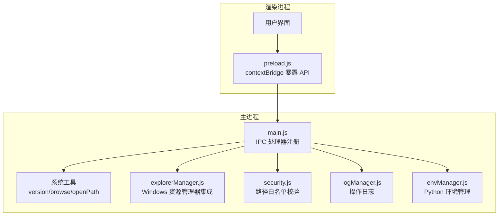
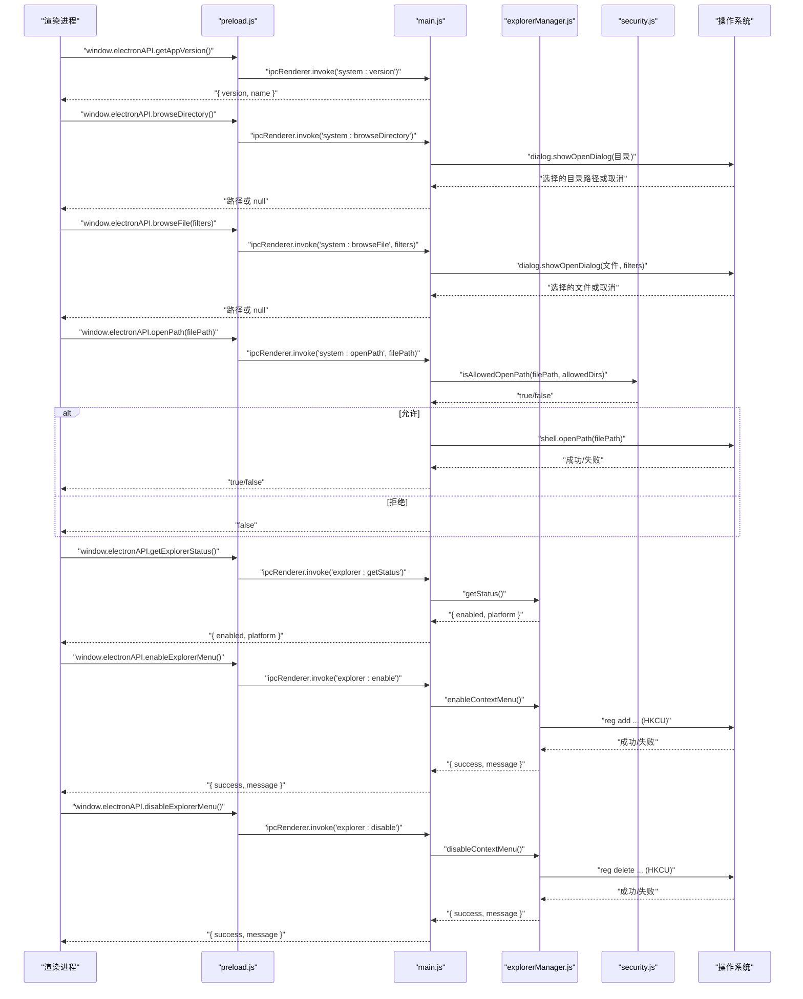
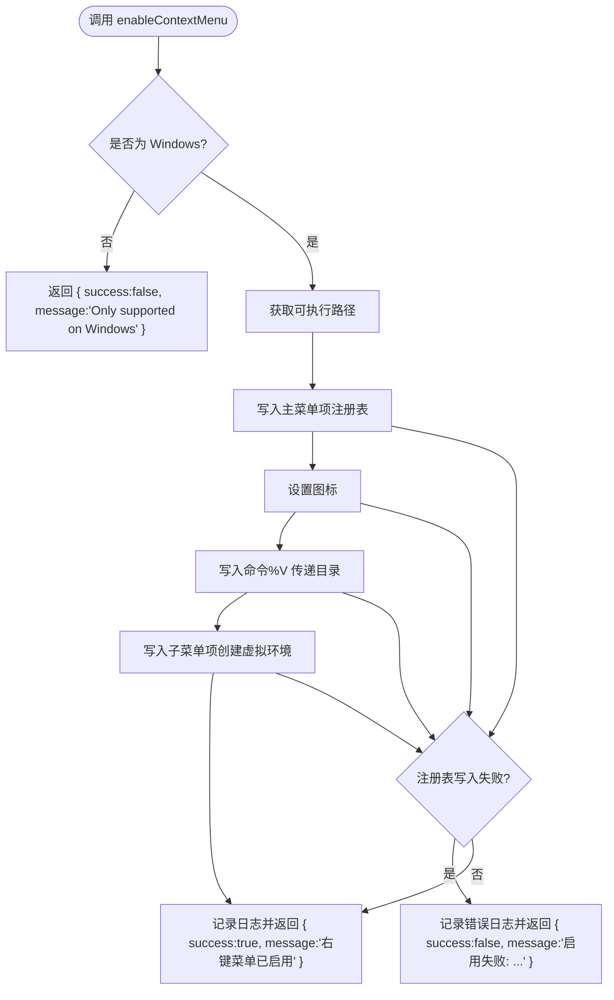
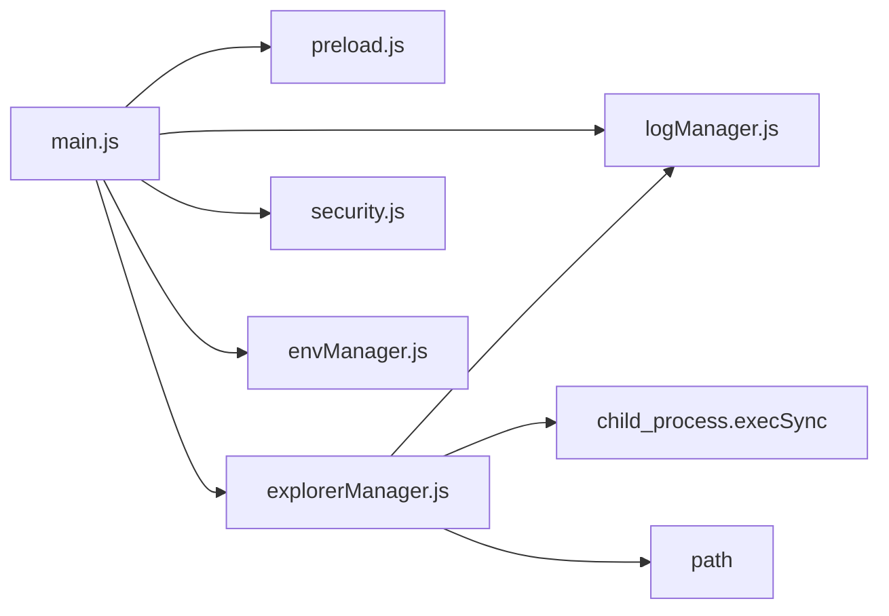

# 系统工具接口

<cite>
**本文引用的文件**   
- [main.js](file://main.js)
- [preload.js](file://preload.js)
- [explorerManager.js](file://core/system/explorerManager.js)
- [security.js](file://utils/security.js)
- [logManager.js](file://core/system/logManager.js)
- [envManager.js](file://core/system/envManager.js)
- [package.json](file://package.json)
</cite>

## 目录
1. [简介](#简介)
2. [项目结构](#项目结构)
3. [核心组件](#核心组件)
4. [架构总览](#架构总览)
5. [详细组件分析](#详细组件分析)
6. [依赖分析](#依赖分析)
7. [性能考虑](#性能考虑)
8. [故障排查指南](#故障排查指南)
9. [结论](#结论)
10. [附录：API 参考](#附录api-参考)

## 简介
本文件为 PyLibMaster 的系统工具接口 API 文档，聚焦于系统级操作与 Windows 资源管理器集成的 IPC 接口。涵盖以下能力：
- 基础系统功能：获取应用版本、浏览目录、浏览文件、打开路径
- Windows 资源管理器集成：获取右键菜单状态、启用/禁用右键菜单
- 跨平台兼容性处理与权限要求说明
- 系统集成安全考量与最佳实践

该文档面向开发者与使用者，既提供高层概览，也给出代码级映射与调用流程，便于理解与集成。

## 项目结构
本项目基于 Electron 架构，主进程负责系统能力与 IPC 处理器，预加载脚本通过 contextBridge 暴露安全的渲染进程 API，核心模块按功能分层组织（system、operations、config）。系统工具相关逻辑主要分布在 main.js（IPC 注册）、preload.js（渲染侧桥接）以及 core/system 下的模块（如 explorerManager、envManager、logManager），安全校验在 utils/security.js 中实现。

图表来源
- [main.js:424-466](file://main.js#L424-L466)
- [preload.js:100-115](file://preload.js#L100-L115)
- [explorerManager.js:1-120](file://core/system/explorerManager.js#L1-L120)
- [security.js:1-43](file://utils/security.js#L1-L43)
- [logManager.js:1-173](file://core/system/logManager.js#L1-L173)
- [envManager.js:1-220](file://core/system/envManager.js#L1-L220)

章节来源
- [main.js:1-120](file://main.js#L1-L120)
- [preload.js:1-60](file://preload.js#L1-L60)

## 核心组件
- 系统工具 IPC（main.js）
  - system:version：返回应用名称与版本号
  - system:browseDirectory：弹出系统目录选择对话框
  - system:browseFile：弹出系统文件选择对话框，支持过滤器
  - system:openPath：使用系统默认应用打开路径，受安全白名单限制
- 预加载桥接（preload.js）
  - 将上述能力以 window.electronAPI 暴露给渲染进程
- Windows 资源管理器集成（explorerManager.js）
  - 通过 HKCU 注册表项添加“用 PyLibMaster 打开”和“在此创建虚拟环境”两个菜单项
  - 提供启用、禁用与状态查询能力
- 安全校验（security.js）
  - isAllowedOpenPath：对目标路径进行绝对化解析与白名单比对，防止路径遍历攻击
- 日志记录（logManager.js）
  - 记录启用/禁用右键菜单等操作，支持筛选与导出
- Python 环境管理（envManager.js）
  - 检测、切换当前 Python 环境（与系统工具无直接耦合，但为其他功能提供支撑）

章节来源
- [main.js:424-466](file://main.js#L424-L466)
- [preload.js:100-115](file://preload.js#L100-L115)
- [explorerManager.js:1-120](file://core/system/explorerManager.js#L1-L120)
- [security.js:1-43](file://utils/security.js#L1-L43)
- [logManager.js:1-173](file://core/system/logManager.js#L1-L173)
- [envManager.js:1-220](file://core/system/envManager.js#L1-L220)

## 架构总览
下图展示从渲染进程到主进程再到系统能力的完整调用链，包括系统工具与 Windows 资源管理器集成。

图表来源
- [main.js:424-466](file://main.js#L424-L466)
- [main.js:632-640](file://main.js#L632-L640)
- [preload.js:100-115](file://preload.js#L100-L115)
- [preload.js:172-176](file://preload.js#L172-L176)
- [explorerManager.js:1-120](file://core/system/explorerManager.js#L1-L120)
- [security.js:1-43](file://utils/security.js#L1-L43)

## 详细组件分析

### 系统工具 IPC（main.js）
- getAppVersion
  - 行为：返回应用名称与版本号
  - 参数：无
  - 返回：{ version, name }
  - 错误：无（直接读取 app.getVersion() 与 app.getName()）
  - 跨平台：Electron 的 app API 跨平台可用
- browseDirectory
  - 行为：弹出系统目录选择对话框
  - 参数：无
  - 返回：选择的目录路径字符串，或 null（取消）
  - 错误：由 Electron dialog 处理
  - 跨平台：Electron dialog 跨平台可用
- browseFile
  - 行为：弹出系统文件选择对话框，支持自定义过滤器
  - 参数：filters（可选），数组格式 [{ name, extensions }]
  - 返回：选择的文件路径字符串，或 null（取消）
  - 错误：由 Electron dialog 处理
  - 跨平台：Electron dialog 跨平台可用
- openPath
  - 行为：使用系统默认应用打开指定路径
  - 参数：filePath（字符串）
  - 返回：布尔值（true=成功打开，false=失败或被拒绝）
  - 安全：仅允许打开白名单目录（documents、downloads、userData）下的文件；非法路径将被拒绝
  - 跨平台：Electron shell.openPath 跨平台可用

章节来源
- [main.js:424-466](file://main.js#L424-L466)

### 预加载桥接（preload.js）
- 暴露方法
  - getAppVersion()
  - browseDirectory()
  - browseFile(filters)
  - openPath(filePath)
  - getExplorerStatus()
  - enableExplorerMenu()
  - disableExplorerMenu()
- 事件监听
  - onProgress、onThemeChanged、onUpdatesAvailable、onSchedulerExecuted 等（与系统工具无关，供其他功能使用）
- 安全隔离
  - 通过 contextBridge.exposeInMainWorld 暴露受限 API，渲染进程无法直接访问 Node.js 能力

章节来源
- [preload.js:100-115](file://preload.js#L100-L115)
- [preload.js:172-176](file://preload.js#L172-L176)

### Windows 资源管理器集成（explorerManager.js）
- getStatus
  - 行为：查询右键菜单是否已启用及当前平台
  - 返回：{ enabled: boolean, platform: string }
  - 非 Windows：enabled 始终为 false
- enableContextMenu
  - 行为：在 HKCU 下写入注册表项，添加“用 PyLibMaster 打开”和“在此创建虚拟环境”两个菜单项
  - 返回：{ success: boolean, message: string }
  - 权限：使用 HKCU（当前用户），无需管理员权限
  - 日志：成功/失败均记录日志
- disableContextMenu
  - 行为：删除对应注册表项
  - 返回：{ success: boolean, message: string }
  - 权限：使用 HKCU（当前用户），无需管理员权限
  - 日志：成功/失败均记录日志

图表来源
- [explorerManager.js:54-79](file://core/system/explorerManager.js#L54-L79)

章节来源
- [explorerManager.js:1-120](file://core/system/explorerManager.js#L1-L120)

### 安全校验（security.js）
- isAllowedOpenPath(targetPath, allowedDirs)
  - 行为：将目标路径解析为绝对路径，检查是否在允许的目录集合内（包含边界检查）
  - 参数：targetPath（字符串）、allowedDirs（字符串数组）
  - 返回：boolean（true=允许，false=拒绝）
  - 防护：防止路径遍历（如 ../）绕过白名单
  - 典型用法：openPath 中传入 [app.getPath('documents'), app.getPath('downloads'), app.getPath('userData')]

章节来源
- [security.js:1-43](file://utils/security.js#L1-L43)
- [main.js:449-466](file://main.js#L449-L466)

### 日志记录（logManager.js）
- 作用：记录系统工具与资源管理器集成的关键操作（启用/禁用右键菜单等）
- 特性：防抖写入、字段截断、容量控制、筛选与导出
- 与系统工具的关联：explorerManager 在启用/禁用时调用 addLog 记录结果

章节来源
- [logManager.js:1-173](file://core/system/logManager.js#L1-L173)
- [explorerManager.js:73-78](file://core/system/explorerManager.js#L73-L78)
- [explorerManager.js:95-100](file://core/system/explorerManager.js#L95-L100)

### Python 环境管理（envManager.js）
- 作用：检测与切换 Python 环境，为其他功能提供运行环境上下文
- 与系统工具的关系：不直接参与系统工具 IPC，但在整体应用中为包管理与环境快照等功能提供支撑

章节来源
- [envManager.js:1-220](file://core/system/envManager.js#L1-L220)

## 依赖分析
- 主进程依赖
  - Electron：app、BrowserWindow、ipcMain、dialog、shell、nativeTheme、Notification
  - 核心模块：pipManager、mirrorManager、envManager、backupManager、logManager、configManager、updater、venvManager、schedulerManager、templateManager、auditManager、undoManager、explorerManager
  - 安全模块：utils/security
- 预加载依赖
  - Electron：contextBridge、ipcRenderer
- Windows 资源管理器集成依赖
  - child_process.execSync：用于 reg 命令操作注册表
  - path：路径拼接
  - logManager：记录操作日志

图表来源
- [main.js:1-31](file://main.js#L1-L31)
- [preload.js:1-20](file://preload.js#L1-L20)
- [explorerManager.js:11-13](file://core/system/explorerManager.js#L11-L13)

章节来源
- [main.js:1-31](file://main.js#L1-L31)
- [preload.js:1-20](file://preload.js#L1-L20)
- [explorerManager.js:11-13](file://core/system/explorerManager.js#L11-L13)

## 性能考虑
- 对话框交互
  - browseDirectory/browseFile 由系统对话框处理，性能开销低，但应避免频繁调用
- 路径打开
  - openPath 仅做白名单校验与系统调用，开销小；建议批量操作前进行一次性校验
- 资源管理器集成
  - 启用/禁用右键菜单涉及注册表写入，属于低频操作；建议在用户明确触发时调用
- 日志写入
  - 采用防抖写入策略，避免高频 I/O 影响性能

[本节为通用指导，不直接分析具体文件]

## 故障排查指南
- openPath 返回 false
  - 可能原因：目标路径不在白名单目录内；系统默认应用无法打开该类型文件
  - 排查步骤：确认路径是否在 documents/downloads/userData 下；检查文件扩展名与默认程序关联
- enable/disable 右键菜单失败
  - 可能原因：非 Windows 平台；注册表写入被权限或杀毒软件拦截
  - 排查步骤：确认 process.platform === 'win32'；查看日志中的错误信息；尝试以当前用户权限重新执行
- 浏览器端调用报错
  - 可能原因：preload 未正确暴露 API；IPC 通道未注册
  - 排查步骤：检查 preload.js 中 electronAPI 暴露的方法名；确认 main.js 中对应的 ipcMain.handle 已注册

章节来源
- [main.js:449-466](file://main.js#L449-L466)
- [explorerManager.js:54-79](file://core/system/explorerManager.js#L54-L79)
- [explorerManager.js:85-101](file://core/system/explorerManager.js#L85-L101)
- [security.js:28-40](file://utils/security.js#L28-L40)

## 结论
本系统工具接口通过 Electron 的主进程与预加载桥接，为渲染进程提供了安全的系统级能力封装。基础系统功能（版本、目录/文件浏览、路径打开）具备跨平台可用性；Windows 资源管理器集成通过 HKCU 注册表实现，无需管理员权限，且具备完善的日志记录与安全校验。建议在生产环境中严格遵循白名单策略，并对用户输入进行最小权限验证，确保系统集成的安全性与稳定性。

[本节为总结性内容，不直接分析具体文件]

## 附录：API 参考

### 系统工具（window.electronAPI）
- getAppVersion()
  - 描述：获取应用名称与版本号
  - 参数：无
  - 返回：{ version: string, name: string }
  - 错误：无
  - 跨平台：是
  - 示例调用路径：preload.js -> main.js system:version
- browseDirectory()
  - 描述：弹出系统目录选择对话框
  - 参数：无
  - 返回：string | null
  - 错误：由 Electron dialog 处理
  - 跨平台：是
  - 示例调用路径：preload.js -> main.js system:browseDirectory
- browseFile(filters?)
  - 描述：弹出系统文件选择对话框，支持过滤器
  - 参数：filters（可选，数组格式 [{ name, extensions }]）
  - 返回：string | null
  - 错误：由 Electron dialog 处理
  - 跨平台：是
  - 示例调用路径：preload.js -> main.js system:browseFile
- openPath(filePath)
  - 描述：使用系统默认应用打开路径（受白名单限制）
  - 参数：filePath（字符串）
  - 返回：boolean（true=成功，false=失败或被拒绝）
  - 错误：路径不在白名单或系统调用失败
  - 跨平台：是
  - 示例调用路径：preload.js -> main.js system:openPath -> security.isAllowedOpenPath

### Windows 资源管理器集成（window.electronAPI）
- getExplorerStatus()
  - 描述：获取右键菜单状态与平台信息
  - 参数：无
  - 返回：{ enabled: boolean, platform: string }
  - 错误：无
  - 跨平台：是（非 Windows 返回 enabled=false）
  - 示例调用路径：preload.js -> main.js explorer:getStatus -> explorerManager.getStatus
- enableExplorerMenu()
  - 描述：启用右键菜单（HKCU 注册表写入）
  - 参数：无
  - 返回：{ success: boolean, message: string }
  - 错误：注册表写入失败或非 Windows
  - 跨平台：仅 Windows 有效
  - 示例调用路径：preload.js -> main.js explorer:enable -> explorerManager.enableContextMenu
- disableExplorerMenu()
  - 描述：禁用右键菜单（HKCU 注册表删除）
  - 参数：无
  - 返回：{ success: boolean, message: string }
  - 错误：注册表删除失败或非 Windows
  - 跨平台：仅 Windows 有效
  - 示例调用路径：preload.js -> main.js explorer:disable -> explorerManager.disableContextMenu

章节来源
- [preload.js:100-115](file://preload.js#L100-L115)
- [preload.js:172-176](file://preload.js#L172-L176)
- [main.js:424-466](file://main.js#L424-L466)
- [main.js:632-640](file://main.js#L632-L640)
- [explorerManager.js:1-120](file://core/system/explorerManager.js#L1-L120)
- [security.js:1-43](file://utils/security.js#L1-L43)

### 权限与跨平台说明
- 权限要求
  - 系统工具（对话框、路径打开）：无需额外权限
  - Windows 资源管理器集成：使用 HKCU（当前用户）注册表，无需管理员权限
- 跨平台兼容
  - 系统工具：Electron 原生能力，跨平台可用
  - Windows 资源管理器集成：仅在 Windows 平台生效；非 Windows 平台返回不支持或无效状态

章节来源
- [explorerManager.js:40-48](file://core/system/explorerManager.js#L40-L48)
- [explorerManager.js:54-57](file://core/system/explorerManager.js#L54-L57)
- [explorerManager.js:85-88](file://core/system/explorerManager.js#L85-L88)

### 安全与最佳实践
- 路径白名单
  - 使用 isAllowedOpenPath 对 openPath 的目标路径进行校验，仅允许 documents/downloads/userData 下的文件
- 最小权限原则
  - 避免在渲染进程中直接访问文件系统；所有系统能力通过 IPC 转发至主进程
- 输入校验
  - 对 filters、filePath 等输入进行类型与长度校验，避免异常注入
- 错误处理
  - 对 IPC 调用与系统调用进行 try/catch 包裹，返回明确的布尔或对象状态
- 日志审计
  - 对关键操作（启用/禁用右键菜单）进行日志记录，便于问题定位与合规审计

章节来源
- [security.js:28-40](file://utils/security.js#L28-L40)
- [main.js:449-466](file://main.js#L449-L466)
- [explorerManager.js:73-78](file://core/system/explorerManager.js#L73-L78)
- [explorerManager.js:95-100](file://core/system/explorerManager.js#L95-L100)