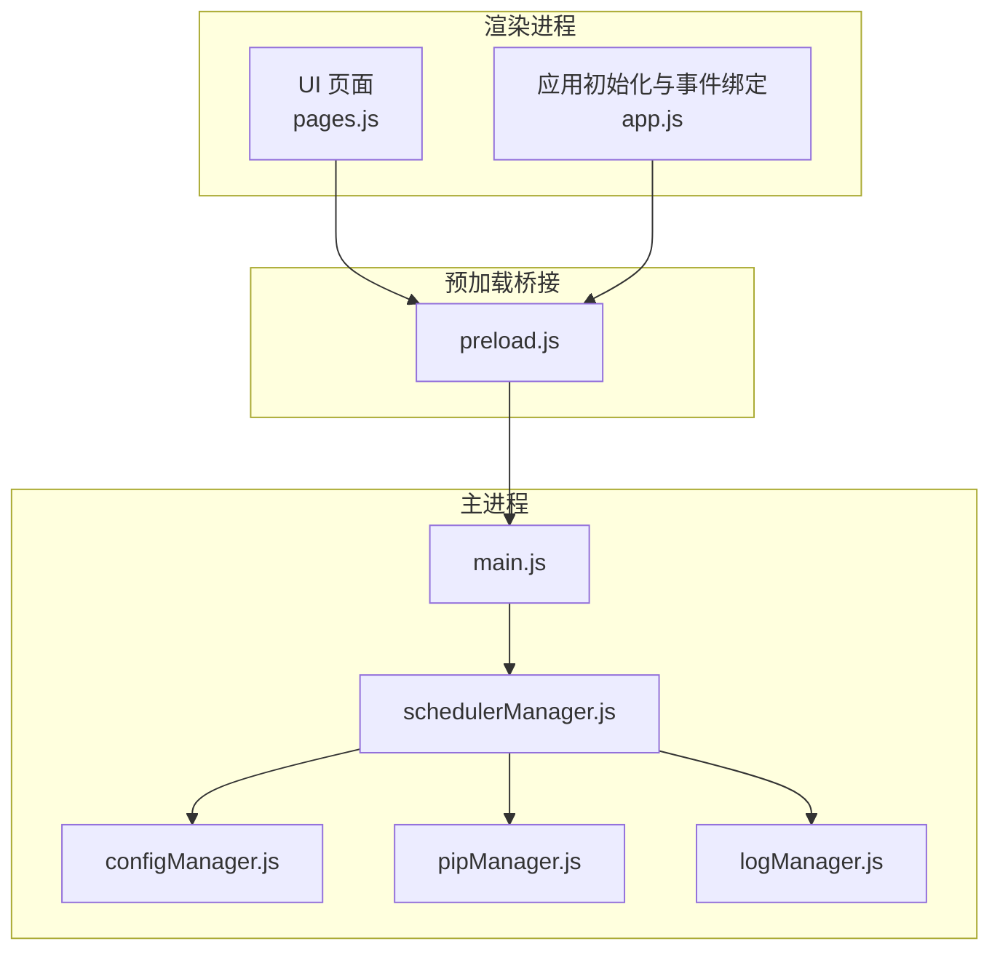
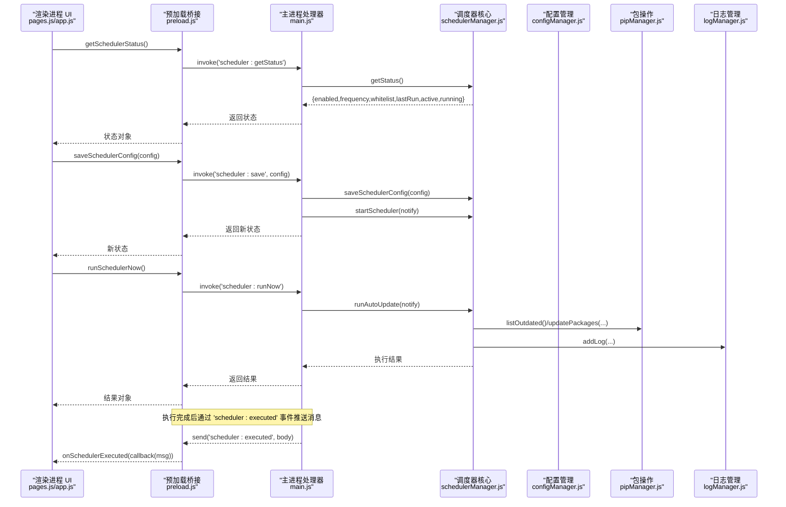
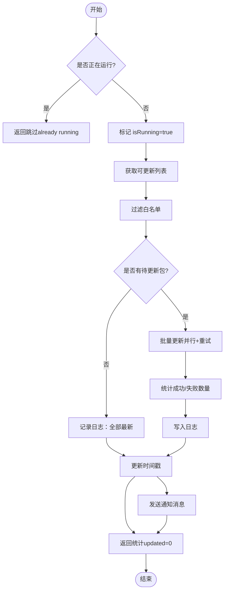
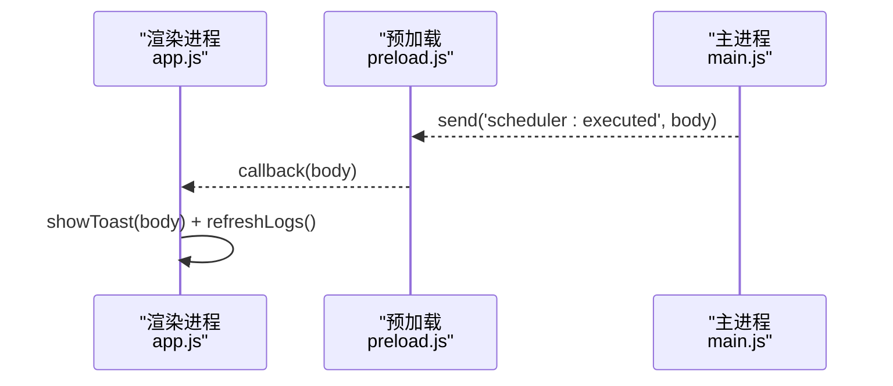
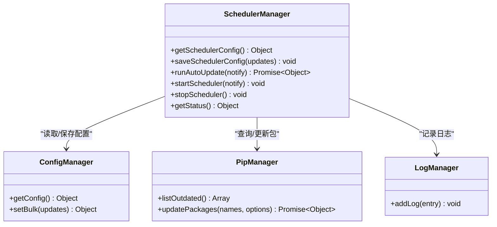

# 调度器接口

<cite>
**本文引用的文件**   
- [schedulerManager.js](file://core/config/schedulerManager.js)
- [main.js](file://main.js)
- [preload.js](file://preload.js)
- [pages.js](file://renderer/js/pages.js)
- [app.js](file://renderer/js/app.js)
- [configManager.js](file://core/config/configManager.js)
</cite>

## 目录
1. [简介](#简介)
2. [项目结构](#项目结构)
3. [核心组件](#核心组件)
4. [架构总览](#架构总览)
5. [详细组件分析](#详细组件分析)
6. [依赖关系分析](#依赖关系分析)
7. [性能考量](#性能考量)
8. [故障排查指南](#故障排查指南)
9. [结论](#结论)
10. [附录：配置示例与监控方案](#附录配置示例与监控方案)

## 简介
本文件为“定时自动更新调度器”的 IPC 接口 API 文档，面向前端渲染进程与主进程之间的通信。内容涵盖：
- 获取调度器状态、保存调度器配置、立即执行调度器的方法
- 事件监听机制 onSchedulerExecuted 的使用方式
- 调度器配置项说明、执行策略与错误处理
- 定时任务的配置示例与监控方案

该调度器用于在应用启动后按配置的频率（每天/每周）自动检查并更新 Python 包，支持白名单过滤、结果写入日志、以及通过 IPC 向渲染进程推送执行结果。

## 项目结构
调度器相关代码分布在以下模块：
- 核心逻辑：core/config/schedulerManager.js
- 主进程 IPC 处理器：main.js
- 预加载桥接层：preload.js
- 渲染进程 UI 交互与事件处理：renderer/js/pages.js、renderer/js/app.js
- 配置持久化：core/config/configManager.js

**图表来源** 
- [schedulerManager.js:1-197](file://core/config/schedulerManager.js#L1-L197)
- [main.js:523-546](file://main.js#L523-L546)
- [preload.js:124-131](file://preload.js#L124-L131)
- [pages.js:716-801](file://renderer/js/pages.js#L716-L801)
- [app.js:98-102](file://renderer/js/app.js#L98-L102)
- [configManager.js:1-194](file://core/config/configManager.js#L1-L194)

**章节来源**
- [schedulerManager.js:1-197](file://core/config/schedulerManager.js#L1-L197)
- [main.js:523-546](file://main.js#L523-L546)
- [preload.js:124-131](file://preload.js#L124-L131)
- [pages.js:716-801](file://renderer/js/pages.js#L716-L801)
- [app.js:98-102](file://renderer/js/app.js#L98-L102)
- [configManager.js:1-194](file://core/config/configManager.js#L1-L194)

## 核心组件
- schedulerManager：实现调度器核心逻辑（读取配置、设置定时器、执行自动更新、记录日志、返回状态）
- main.js：注册 IPC 处理器，将渲染进程的请求转发到 schedulerManager，并通过 webContents.send 推送事件
- preload.js：暴露 electronAPI 给渲染进程，封装 IPC 调用与事件监听
- pages.js：渲染进程中对调度器状态的加载、配置修改、白名单管理、立即执行等 UI 交互
- app.js：应用启动时绑定 onSchedulerExecuted 事件，展示通知并刷新日志
- configManager：提供配置的读取与批量写入，调度器配置项由该模块持久化

**章节来源**
- [schedulerManager.js:25-187](file://core/config/schedulerManager.js#L25-L187)
- [main.js:523-546](file://main.js#L523-L546)
- [preload.js:124-131](file://preload.js#L124-L131)
- [pages.js:716-801](file://renderer/js/pages.js#L716-L801)
- [app.js:98-102](file://renderer/js/app.js#L98-L102)
- [configManager.js:140-178](file://core/config/configManager.js#L140-L178)

## 架构总览
调度器 IPC 调用流程如下：
- 渲染进程通过 electronAPI 调用 getSchedulerStatus/saveSchedulerConfig/runSchedulerNow
- 预加载层使用 ipcRenderer.invoke 转发到主进程对应处理器
- 主进程处理器调用 schedulerManager 的方法，必要时触发事件推送执行结果
- 渲染进程通过 onSchedulerExecuted 监听执行结果，进行 UI 反馈与日志刷新

**图表来源** 
- [main.js:523-546](file://main.js#L523-L546)
- [schedulerManager.js:62-138](file://core/config/schedulerManager.js#L62-L138)
- [preload.js:124-131](file://preload.js#L124-L131)
- [pages.js:781-801](file://renderer/js/pages.js#L781-L801)
- [app.js:98-102](file://renderer/js/app.js#L98-L102)

## 详细组件分析

### IPC 接口定义与行为
- getSchedulerStatus
  - 作用：获取调度器当前状态与配置（是否启用、频率、白名单、上次执行时间、定时器是否活跃、是否正在执行）
  - 入口：electronAPI.getSchedulerStatus()
  - 主处理器：ipcMain.handle('scheduler:getStatus')
  - 返回值：包含 enabled、frequency、whitelist、lastRun、active、running 的对象

- saveSchedulerConfig
  - 作用：保存调度器配置（enabled、frequency、whitelist、lastRun），并重启调度器以生效
  - 入口：electronAPI.saveSchedulerConfig(config)
  - 主处理器：ipcMain.handle('scheduler:save', config)
  - 行为：调用 schedulerManager.saveSchedulerConfig(config)，然后 schedulerManager.startScheduler(notify)
  - 返回值：新的调度器状态

- runSchedulerNow
  - 作用：立即执行一次自动更新（不改变定时器）
  - 入口：electronAPI.runSchedulerNow()
  - 主处理器：ipcMain.handle('scheduler:runNow')
  - 行为：调用 schedulerManager.runAutoUpdate(notify)，内部会查询可更新列表、过滤白名单、批量更新、写日志、更新时间戳
  - 返回值：包含 updated、failed、skipped、total 或 error 的对象

- onSchedulerExecuted
  - 作用：监听调度器执行完成的事件回调
  - 入口：electronAPI.onSchedulerExecuted(callback)
  - 事件通道：'scheduler:executed'
  - 触发时机：每次自动更新执行完成后（包括定时触发和立即执行）
  - 参数：消息体（通常为描述性文本，如“自动更新：X 个包已更新，Y 个失败”）

**章节来源**
- [main.js:523-546](file://main.js#L523-L546)
- [preload.js:124-131](file://preload.js#L124-L131)
- [schedulerManager.js:179-187](file://core/config/schedulerManager.js#L179-L187)
- [schedulerManager.js:62-138](file://core/config/schedulerManager.js#L62-L138)

### 调度器配置选项
- enabled（布尔）：是否启用调度器
- frequency（字符串）：执行频率，可选值 'daily'（每天）或 'weekly'（每周）
- whitelist（数组）：不自动更新的包名列表（大小写不敏感匹配）
- lastRun（ISO 字符串）：上次执行时间

这些字段由 schedulerManager.getSchedulerConfig 从配置管理器读取，并通过 saveSchedulerConfig 批量写入配置。

**章节来源**
- [schedulerManager.js:25-50](file://core/config/schedulerManager.js#L25-L50)
- [configManager.js:140-178](file://core/config/configManager.js#L140-L178)

### 执行策略与流程
- 启动时根据配置恢复定时器（startScheduler）
  - 若 enabled 为 false，则不启动
  - 根据 frequency 计算间隔（每天 24h，每周 7d）
  - 如果距离上次执行已超过一个间隔，则在启动后延迟一段时间立即执行一次
- 执行流程（runAutoUpdate）
  - 防止并发执行（isRunning 标志）
  - 获取可更新列表（listOutdated）
  - 过滤白名单（whitelistSet）
  - 若无待更新包，记录日志并返回统计
  - 批量更新（updatePackages，开启并行与重试）
  - 记录成功/失败数量，写入日志，更新时间戳
  - 通过 notify 回调发送消息，主进程转发到渲染进程

**图表来源** 
- [schedulerManager.js:62-138](file://core/config/schedulerManager.js#L62-L138)

**章节来源**
- [schedulerManager.js:145-163](file://core/config/schedulerManager.js#L145-L163)
- [schedulerManager.js:62-138](file://core/config/schedulerManager.js#L62-L138)

### 错误处理机制
- 执行异常捕获：runAutoUpdate 使用 try/catch 捕获异常，记录失败日志，返回 error 字段
- 并发保护：isRunning 标志避免重复执行
- 日志持久化：所有关键步骤均写入日志，便于追踪问题
- 通知降级：通知发送失败时静默处理，不影响主流程

**章节来源**
- [schedulerManager.js:125-137](file://core/config/schedulerManager.js#L125-L137)
- [main.js:523-546](file://main.js#L523-L546)

### 事件监听机制：onSchedulerExecuted
- 触发源：主进程在每次自动更新执行完成后通过 mainWindow.webContents.send('scheduler:executed', body) 推送消息
- 监听方式：渲染进程通过 electronAPI.onSchedulerExecuted(callback) 订阅事件
- 典型用法：显示 Toast 提示、刷新日志列表、更新状态栏

**图表来源** 
- [main.js:140-144](file://main.js#L140-L144)
- [main.js:531-536](file://main.js#L531-L536)
- [main.js:541-545](file://main.js#L541-L545)
- [preload.js:128-131](file://preload.js#L128-L131)
- [app.js:98-102](file://renderer/js/app.js#L98-L102)

**章节来源**
- [main.js:140-144](file://main.js#L140-L144)
- [main.js:531-536](file://main.js#L531-L536)
- [main.js:541-545](file://main.js#L541-L545)
- [preload.js:128-131](file://preload.js#L128-L131)
- [app.js:98-102](file://renderer/js/app.js#L98-L102)

## 依赖关系分析
- schedulerManager 依赖：
  - configManager：读取/保存调度器配置
  - pipManager：获取可更新列表、批量更新包
  - logManager：记录执行日志
- main.js 作为 IPC 中枢，协调调度器与渲染进程通信
- preload.js 暴露安全桥接 API，确保渲染进程无法直接访问 Node API
- 渲染进程通过 pages.js 与 app.js 完成 UI 交互与事件处理

**图表来源** 
- [schedulerManager.js:1-197](file://core/config/schedulerManager.js#L1-L197)
- [configManager.js:1-194](file://core/config/configManager.js#L1-L194)

**章节来源**
- [schedulerManager.js:1-197](file://core/config/schedulerManager.js#L1-L197)
- [configManager.js:1-194](file://core/config/configManager.js#L1-L194)

## 性能考量
- 并行与重试：批量更新开启并行与重试，提升成功率与吞吐
- 防抖与节流：窗口位置保存有防抖；调度器启动后若超过间隔才立即执行一次，避免频繁触发
- 异步与事件驱动：长耗时操作（包查询/更新）采用异步与事件推送，避免阻塞 UI
- 日志落盘：关键路径写入日志，保证可追溯性

[本节为通用指导，无需引用具体文件]

## 故障排查指南
常见问题与定位建议：
- 调度器未启动
  - 检查 enabled 是否为 true
  - 确认 startScheduler 被调用（应用启动时）
- 无包更新或更新失败
  - 查看日志中 “[Auto] Scheduled update executed” 的 detail 字段
  - 检查白名单是否误包含目标包
- 事件未触发
  - 确认 onSchedulerExecuted 已正确绑定
  - 检查主进程是否发送了 'scheduler:executed' 事件
- 配置未生效
  - 确认 saveSchedulerConfig 调用后调用了 startScheduler
  - 检查配置文件是否被其他进程覆盖

**章节来源**
- [schedulerManager.js:125-137](file://core/config/schedulerManager.js#L125-L137)
- [main.js:523-546](file://main.js#L523-L546)
- [app.js:98-102](file://renderer/js/app.js#L98-L102)

## 结论
调度器接口提供了完整的定时任务管理能力，包括状态查询、配置保存、立即执行与事件监听。其设计遵循模块化与事件驱动原则，具备良好的可维护性与扩展性。通过合理的配置与监控方案，可实现稳定可靠的自动化包更新流程。

[本节为总结，无需引用具体文件]

## 附录：配置示例与监控方案

### 配置示例
- 启用调度器，设置为每天执行，白名单包含若干包：
  - enabled: true
  - frequency: 'daily'
  - whitelist: ['numpy', 'pandas']
- 切换为每周执行：
  - frequency: 'weekly'
- 清空白名单：
  - whitelist: []

上述配置可通过 electronAPI.saveSchedulerConfig({ ... }) 进行更新，并在成功后重新加载状态。

**章节来源**
- [schedulerManager.js:25-50](file://core/config/schedulerManager.js#L25-L50)
- [pages.js:751-769](file://renderer/js/pages.js#L751-L769)

### 监控方案
- 实时状态展示
  - 使用 getSchedulerStatus 获取 active、running、lastRun 等字段，在 UI 中展示
- 执行结果监听
  - 使用 onSchedulerExecuted 接收执行消息，显示 Toast 并刷新日志
- 日志分析
  - 通过 log:get 筛选 type='update' 的记录，统计成功/失败率
- 告警与通知
  - 当 result.failed > 0 时触发告警（例如发送邮件或系统通知）
- 定期健康检查
  - 启动时 autoCheckUpdates 检测可更新包数量，提示用户

**章节来源**
- [pages.js:721-735](file://renderer/js/pages.js#L721-L735)
- [app.js:98-102](file://renderer/js/app.js#L98-L102)
- [main.js:217-231](file://main.js#L217-L231)