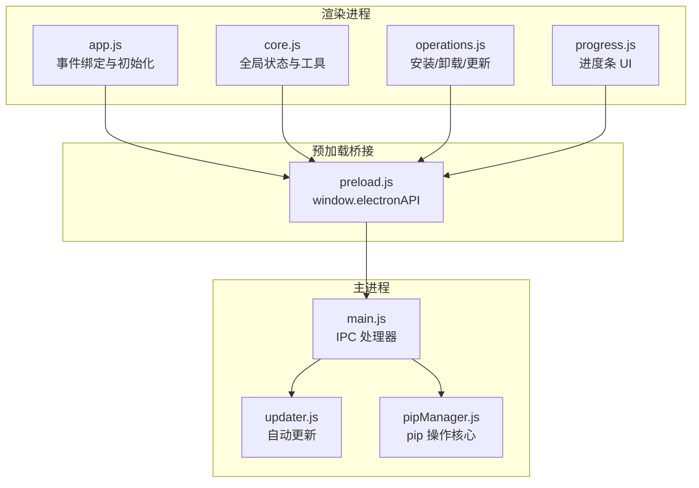
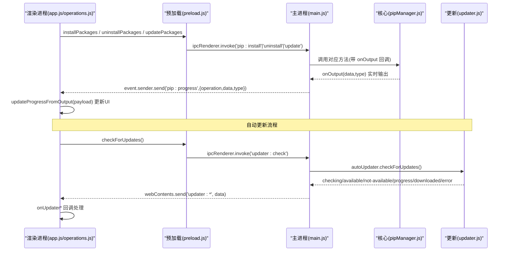
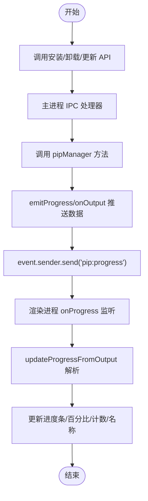
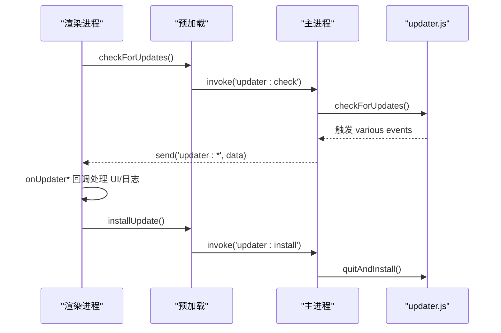
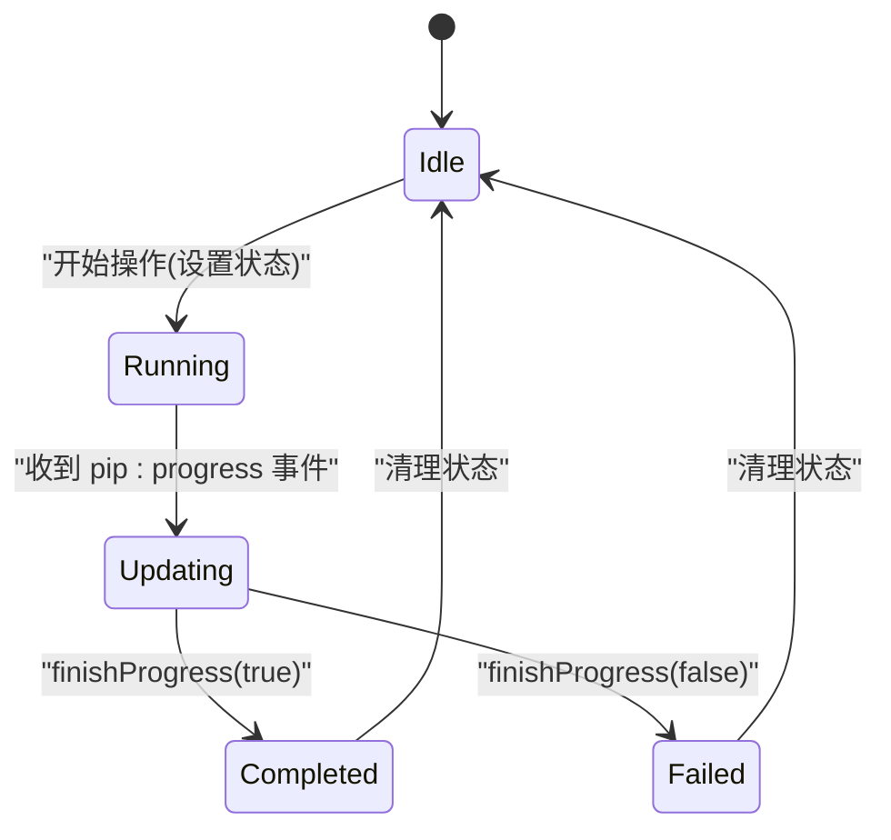
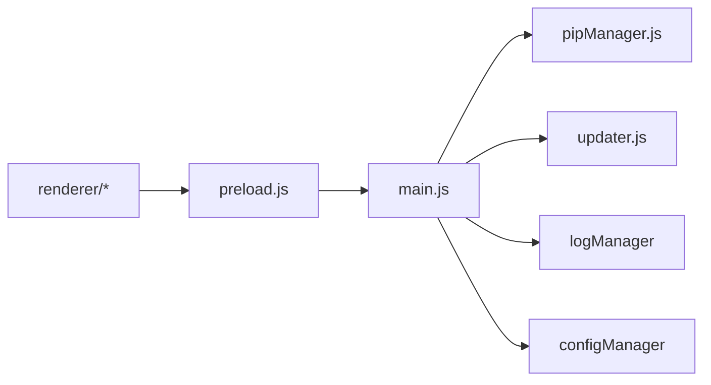

# 进度与事件接口

<cite>
**本文引用的文件**   
- [main.js](file://main.js)
- [preload.js](file://preload.js)
- [core/operations/pipManager.js](file://core/operations/pipManager.js)
- [renderer/js/progress.js](file://renderer/js/progress.js)
- [renderer/js/app.js](file://renderer/js/app.js)
- [renderer/js/core.js](file://renderer/js/core.js)
- [renderer/js/operations.js](file://renderer/js/operations.js)
- [core/system/updater.js](file://core/system/updater.js)
</cite>

## 目录
1. [简介](#简介)
2. [项目结构](#项目结构)
3. [核心组件](#核心组件)
4. [架构总览](#架构总览)
5. [详细组件分析](#详细组件分析)
6. [依赖关系分析](#依赖关系分析)
7. [性能考量](#性能考量)
8. [故障排查指南](#故障排查指南)
9. [结论](#结论)
10. [附录：API 参考与示例](#附录api-参考与示例)

## 简介
本文件为“进度与事件接口”的完整 API 文档，聚焦于异步操作的进度监听与事件处理机制。内容涵盖：
- pip 操作进度监听：onProgress、removeProgressListener
- 自动更新事件：checkForUpdates、installUpdate 及 onUpdaterChecking、onUpdaterAvailable、onUpdaterNotAvailable、onUpdaterProgress、onUpdaterDownloaded、onUpdaterError
- 事件驱动编程模式、事件生命周期管理与内存泄漏防护
- 完整的事件处理示例与错误恢复策略

该文档面向开发者与使用者，既提供代码级实现细节，也给出易于理解的使用说明与最佳实践。

## 项目结构
本项目采用 Electron 架构，主进程负责 IPC 处理器与系统能力，预加载脚本暴露安全桥接 API，渲染进程通过事件总线接收进度与更新事件并更新 UI。关键路径如下：
- 主进程入口与 IPC 处理器：main.js
- 预加载桥接层（暴露 window.electronAPI）：preload.js
- pip 包管理核心（安装/卸载/更新/查询等）：core/operations/pipManager.js
- 应用自动更新管理器：core/system/updater.js
- 渲染进程入口与事件绑定：renderer/js/app.js
- 全局状态与工具：renderer/js/core.js
- 进度条 UI 与解析逻辑：renderer/js/progress.js
- 操作编排（安装/卸载/更新）：renderer/js/operations.js

图表来源
- [main.js:1-120](file://main.js#L1-L120)
- [preload.js:177-220](file://preload.js#L177-L220)
- [core/operations/pipManager.js:495-578](file://core/operations/pipManager.js#L495-L578)
- [core/system/updater.js:38-76](file://core/system/updater.js#L38-L76)
- [renderer/js/app.js:80-102](file://renderer/js/app.js#L80-L102)
- [renderer/js/progress.js:101-141](file://renderer/js/progress.js#L101-L141)

章节来源
- [main.js:1-120](file://main.js#L1-L120)
- [preload.js:1-220](file://preload.js#L1-L220)
- [core/operations/pipManager.js:1-200](file://core/operations/pipManager.js#L1-L200)
- [core/system/updater.js:1-104](file://core/system/updater.js#L1-L104)
- [renderer/js/app.js:1-120](file://renderer/js/app.js#L1-L120)
- [renderer/js/progress.js:1-141](file://renderer/js/progress.js#L1-L141)
- [renderer/js/core.js:1-93](file://renderer/js/core.js#L1-L93)
- [renderer/js/operations.js:1-120](file://renderer/js/operations.js#L1-L120)

## 核心组件
- 进度事件通道（pip:progress）
  - 由主进程在 pip 相关操作（安装/卸载/更新/修复/回滚/审计/下载）中通过 event.sender.send('pip:progress', payload) 推送给渲染进程。
  - 渲染进程通过 api.onProgress(callback) 订阅，使用 updateProgressFromOutput(payload) 解析结构化进度消息并更新 UI。
- 自动更新事件通道（updater:*）
  - 由 updater.js 基于 electron-updater 触发检查、可用、不可用、下载进度、已下载、错误等事件，并通过 mainWindow.webContents.send(channel, data) 转发到渲染进程。
  - 渲染进程通过 preload.js 暴露的 checkForUpdates、installUpdate 与各 onUpdater* 方法订阅。

章节来源
- [main.js:308-348](file://main.js#L308-L348)
- [preload.js:177-220](file://preload.js#L177-L220)
- [core/system/updater.js:38-76](file://core/system/updater.js#L38-L76)
- [renderer/js/app.js:80-102](file://renderer/js/app.js#L80-L102)
- [renderer/js/progress.js:101-141](file://renderer/js/progress.js#L101-L141)

## 架构总览
下图展示了从渲染进程发起操作到主进程执行并推送进度/更新事件的完整流程。

图表来源
- [main.js:311-348](file://main.js#L311-L348)
- [core/operations/pipManager.js:495-578](file://core/operations/pipManager.js#L495-L578)
- [core/system/updater.js:38-76](file://core/system/updater.js#L38-L76)
- [preload.js:177-220](file://preload.js#L177-L220)
- [renderer/js/app.js:80-102](file://renderer/js/app.js#L80-L102)

## 详细组件分析

### 进度事件管道（pip:progress）
- 发送端
  - 主进程在各 pip 操作 IPC 处理器中，将 onOutput 回调包装为 event.sender.send('pip:progress', { operation, data, type })。
  - pipManager.js 内部通过 emitProgress(onOutput, pkg, status) 生成结构化进度消息 [PROGRESS] {"done":1,"pkg":"...","status":"ok|fail"}。
- 接收端
  - 渲染进程通过 api.onProgress(updateProgressFromOutput) 订阅。
  - progress.js 解析结构化消息，更新进度计数、百分比、当前包名；对无结构化进度的操作（如卸载/回滚），通过文本匹配推断完成状态。

图表来源
- [main.js:311-348](file://main.js#L311-L348)
- [core/operations/pipManager.js:61-63](file://core/operations/pipManager.js#L61-L63)
- [renderer/js/progress.js:101-141](file://renderer/js/progress.js#L101-L141)

章节来源
- [main.js:308-348](file://main.js#L308-L348)
- [core/operations/pipManager.js:495-578](file://core/operations/pipManager.js#L495-L578)
- [renderer/js/progress.js:1-141](file://renderer/js/progress.js#L1-L141)

### 自动更新事件（updater:*）
- 检查与安装
  - 渲染进程调用 api.checkForUpdates() 与 api.installUpdate()，分别映射到主进程的 'updater:check' 与 'updater:install'。
- 事件流
  - updater.js 监听 electron-updater 事件，向渲染进程发送：
    - checking-for-update → 'updater:checking'
    - update-available → 'updater:available'
    - update-not-available → 'updater:not-available'
    - download-progress → 'updater:progress'
    - update-downloaded → 'updater:downloaded'
    - error → 'updater:error'
- 渲染进程订阅
  - 通过 api.onUpdaterChecking、onUpdaterAvailable、onUpdaterNotAvailable、onUpdaterProgress、onUpdaterDownloaded、onUpdaterError 注册回调。

图表来源
- [core/system/updater.js:38-76](file://core/system/updater.js#L38-L76)
- [preload.js:186-220](file://preload.js#L186-L220)
- [main.js:418-421](file://main.js#L418-L421)

章节来源
- [core/system/updater.js:1-104](file://core/system/updater.js#L1-L104)
- [preload.js:186-220](file://preload.js#L186-L220)
- [main.js:418-421](file://main.js#L418-L421)

### 事件生命周期与内存泄漏防护
- 订阅与取消
  - onProgress：每次调用会先移除旧监听器，再注册新监听器，避免重复绑定。
  - removeProgressListener：显式移除指定回调，防止内存泄漏。
  - onUpdater*：同样在注册前 removeAllListeners，确保单一订阅者。
- 操作生命周期
  - 操作开始时设置 progressOperation、progressTotal、progressDone、currentOperationId。
  - 操作完成后调用 finishProgress(success)，刷新日志并延迟隐藏进度卡片。
  - finally 块中清理 currentOperationId 与 progressOperation，保证状态一致性。

图表来源
- [renderer/js/progress.js:20-74](file://renderer/js/progress.js#L20-L74)
- [renderer/js/core.js:29-34](file://renderer/js/core.js#L29-L34)
- [renderer/js/operations.js:80-113](file://renderer/js/operations.js#L80-L113)

章节来源
- [preload.js:177-220](file://preload.js#L177-L220)
- [renderer/js/progress.js:1-141](file://renderer/js/progress.js#L1-L141)
- [renderer/js/core.js:1-93](file://renderer/js/core.js#L1-L93)
- [renderer/js/operations.js:1-120](file://renderer/js/operations.js#L1-L120)

### 错误恢复策略
- pip 操作
  - 支持智能重试（多镜像源）、自动回滚（失败时恢复备份）。
  - 结构化进度消息包含 status=ok/fail，便于前端统计成功/失败数量。
- 自动更新
  - 错误事件统一上报，记录日志并重置检查标志，避免重复检查。
  - 下载完成后等待用户确认安装，提升可控性。

章节来源
- [core/operations/pipManager.js:495-578](file://core/operations/pipManager.js#L495-L578)
- [core/system/updater.js:70-76](file://core/system/updater.js#L70-L76)

## 依赖关系分析
- 模块耦合
  - main.js 作为 IPC 中枢，依赖 pipManager、updater、backup、log、config 等模块。
  - preload.js 仅暴露必要 API，降低渲染进程直接访问 Node API 的风险。
  - 渲染进程各模块通过 core.js 共享全局状态，减少跨模块通信复杂度。
- 外部依赖
  - electron-updater 用于自动更新。
  - pip 命令通过 processRunner 执行，支持超时、取消、输出回调。

图表来源
- [main.js:1-120](file://main.js#L1-L120)
- [preload.js:1-120](file://preload.js#L1-L120)

章节来源
- [main.js:1-120](file://main.js#L1-L120)
- [preload.js:1-120](file://preload.js#L1-L120)

## 性能考量
- 并发与锁
  - pipManager 使用环境级互斥锁（envLocks）确保同一环境串行执行，避免冲突。
  - 并行安装/更新通过线程数限制控制并发度，避免资源争用。
- 缓存
  - 已安装包列表缓存（5分钟有效），site-packages 路径缓存（30秒 TTL），减少 I/O 开销。
- 进度解析优化
  - 结构化进度消息优先解析，避免不必要的文本匹配。
  - 卸载/回滚等无结构化进度场景，通过最小化正则匹配推断完成状态。

章节来源
- [core/operations/pipManager.js:72-85](file://core/operations/pipManager.js#L72-L85)
- [core/operations/pipManager.js:89-127](file://core/operations/pipManager.js#L89-L127)
- [core/operations/pipManager.js:226-248](file://core/operations/pipManager.js#L226-L248)
- [renderer/js/progress.js:101-141](file://renderer/js/progress.js#L101-L141)

## 故障排查指南
- 进度不更新
  - 检查是否调用了 api.onProgress(updateProgressFromOutput)。
  - 确认主进程是否正确发送 'pip:progress' 事件。
  - 查看结构化消息格式是否符合 [PROGRESS] {...}。
- 更新事件未触发
  - 确认已调用 api.checkForUpdates() 并订阅了 onUpdater*。
  - 检查网络与更新源配置。
- 内存泄漏风险
  - 确保在组件销毁或页面切换时调用 removeProgressListener。
  - 避免重复注册 onUpdater* 监听器。

章节来源
- [renderer/js/progress.js:101-141](file://renderer/js/progress.js#L101-L141)
- [preload.js:177-220](file://preload.js#L177-L220)
- [core/system/updater.js:70-76](file://core/system/updater.js#L70-L76)

## 结论
本项目的进度与事件接口以事件驱动为核心，通过主进程与渲染进程之间的 IPC 通道实现了可靠的异步操作监控与自动更新反馈。结构化进度消息与完善的生命周期管理确保了 UI 的一致性与用户体验。通过合理的并发控制、缓存策略与错误恢复机制，系统在性能与稳定性方面具备良好表现。

## 附录：API 参考与示例

### 进度事件 API
- onProgress(callback)
  - 作用：订阅 pip 操作进度事件（安装/卸载/更新/修复/回滚/审计/下载）。
  - 参数：callback(payload)
  - payload 结构：{ operation, data, type }
  - 注意：每次调用会移除旧监听器，避免重复绑定。
- removeProgressListener(callback)
  - 作用：移除指定的进度监听器，防止内存泄漏。
  - 参数：callback（需与 onProgress 传入的回调相同引用）

章节来源
- [preload.js:177-184](file://preload.js#L177-L184)
- [renderer/js/app.js:80-84](file://renderer/js/app.js#L80-L84)
- [renderer/js/progress.js:101-141](file://renderer/js/progress.js#L101-L141)

### 自动更新 API
- checkForUpdates()
  - 作用：检查是否有新版本可用。
  - 返回：Promise，可能返回 { checking: true } 表示正在检查。
- installUpdate()
  - 作用：退出应用并安装已下载的更新。
- onUpdaterChecking(callback)
  - 作用：监听“正在检查更新”事件。
- onUpdaterAvailable(callback)
  - 作用：监听“发现新版本可用”事件，回调参数为更新信息。
- onUpdaterNotAvailable(callback)
  - 作用：监听“当前已是最新版本”事件。
- onUpdaterProgress(callback)
  - 作用：监听“下载进度”事件，回调参数包含百分比、速度等信息。
- onUpdaterDownloaded(callback)
  - 作用：监听“更新已下载完成”事件，回调参数为更新信息。
- onUpdaterError(callback)
  - 作用：监听“更新检查或下载出错”事件，回调参数为错误对象。

章节来源
- [preload.js:186-220](file://preload.js#L186-L220)
- [core/system/updater.js:38-76](file://core/system/updater.js#L38-L76)
- [main.js:418-421](file://main.js#L418-L421)

### 事件处理示例（概念性）
- 订阅 pip 进度并更新 UI
  - 在 app.js 启动时调用 api.onProgress(updateProgressFromOutput)。
  - 在 operations.js 中执行安装/卸载/更新操作，设置进度状态并在 finally 中清理。
- 订阅自动更新事件
  - 调用 api.checkForUpdates() 后，依次处理 onUpdaterChecking、onUpdaterAvailable、onUpdaterProgress、onUpdaterDownloaded、onUpdaterError。
  - 用户确认后调用 api.installUpdate() 完成安装。

章节来源
- [renderer/js/app.js:80-102](file://renderer/js/app.js#L80-L102)
- [renderer/js/operations.js:80-113](file://renderer/js/operations.js#L80-L113)
- [core/system/updater.js:38-76](file://core/system/updater.js#L38-L76)