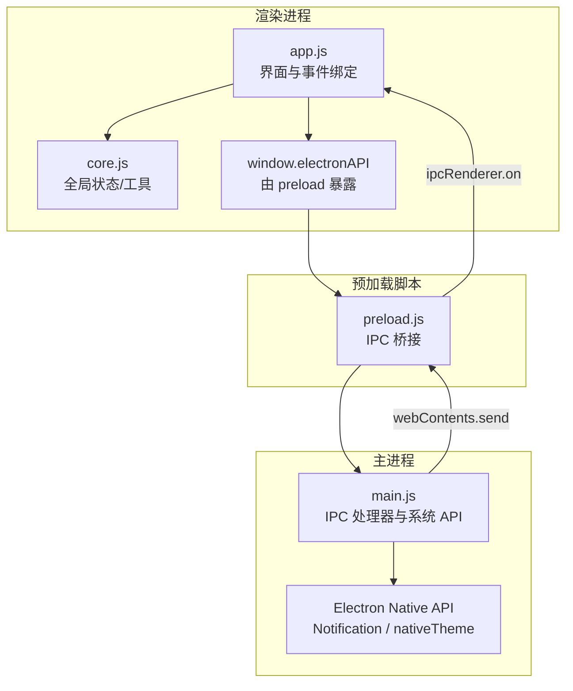
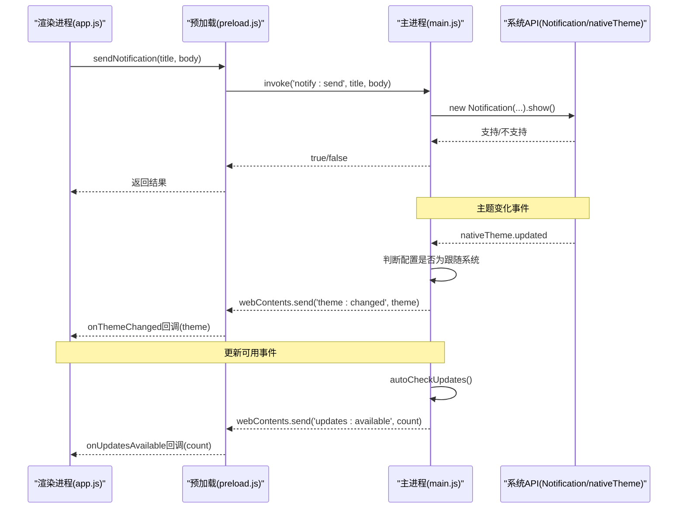
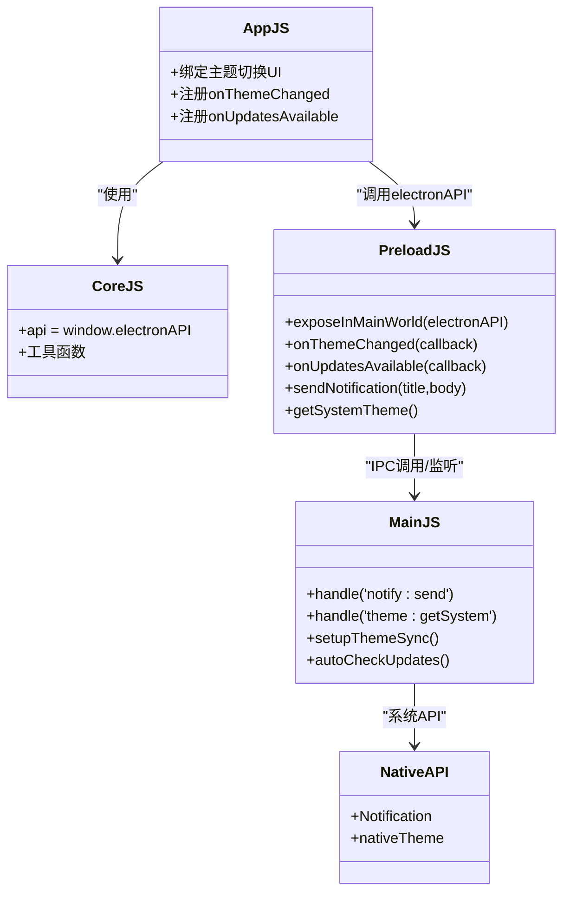

# 通知与主题接口

<cite>
**本文引用的文件**   
- [main.js](file://main.js)
- [preload.js](file://preload.js)
- [app.js](file://renderer/js/app.js)
- [core.js](file://renderer/js/core.js)
</cite>

## 目录
1. [简介](#简介)
2. [项目结构](#项目结构)
3. [核心组件](#核心组件)
4. [架构总览](#架构总览)
5. [详细组件分析](#详细组件分析)
6. [依赖关系分析](#依赖关系分析)
7. [性能考虑](#性能考虑)
8. [故障排查指南](#故障排查指南)
9. [结论](#结论)
10. [附录：API 参考](#附录api-参考)

## 简介
本文件为“通知与主题”相关 IPC 接口的完整 API 文档，覆盖桌面通知发送、系统主题获取与主题变化监听、更新可用事件监听等能力。重点说明事件监听的注册与注销机制，避免内存泄漏；并提供事件驱动编程的最佳实践与错误处理模式。

## 项目结构
本项目基于 Electron，采用主进程（Node.js）—预加载脚本（安全桥接）—渲染进程（浏览器环境）三层架构。通知与主题相关的 IPC 通信路径如下：
- 渲染进程通过 preload 暴露的 window.electronAPI 调用方法
- preload 使用 ipcRenderer.invoke/on 转发到主进程
- 主进程通过 native API（如 Notification、nativeTheme）实现功能，并通过 webContents.send 向渲染进程推送事件

图表来源 
- [main.js:468-521](file://main.js#L468-L521)
- [preload.js:107-122](file://preload.js#L107-L122)
- [app.js:86-96](file://renderer/js/app.js#L86-L96)

章节来源
- [main.js:1-150](file://main.js#L1-L150)
- [preload.js:1-221](file://preload.js#L1-L221)
- [app.js:1-210](file://renderer/js/app.js#L1-L210)
- [core.js:1-93](file://renderer/js/core.js#L1-L93)

## 核心组件
- 桌面通知（sendNotification）
  - 渲染进程调用：window.electronAPI.sendNotification(title, body)
  - 主进程实现：通过 Electron 的 Notification 原生 API 展示系统通知
  - 返回值：布尔值表示是否成功发送

- 主题获取（getSystemTheme）
  - 渲染进程调用：window.electronAPI.getSystemTheme()
  - 主进程实现：读取 nativeTheme.shouldUseDarkColors 返回 'dark' 或 'light'

- 主题变化监听（onThemeChanged）
  - 渲染进程注册：window.electronAPI.onThemeChanged(callback)
  - 主进程触发：当配置为跟随系统时，监听 nativeTheme.updated 并推送 'theme:changed' 事件

- 更新可用监听（onUpdatesAvailable）
  - 渲染进程注册：window.electronAPI.onUpdatesAvailable(callback)
  - 主进程触发：启动后异步检查可更新包数量，推送 'updates:available' 事件

章节来源
- [preload.js:107-122](file://preload.js#L107-L122)
- [main.js:468-521](file://main.js#L468-L521)
- [app.js:86-96](file://renderer/js/app.js#L86-L96)

## 架构总览
下图展示了“通知与主题”在 IPC 层的事件流与数据流。

图表来源 
- [main.js:468-521](file://main.js#L468-L521)
- [main.js:195-231](file://main.js#L195-L231)
- [preload.js:107-122](file://preload.js#L107-L122)
- [app.js:86-96](file://renderer/js/app.js#L86-L96)

## 详细组件分析

### 桌面通知接口：sendNotification
- 调用方式
  - 渲染进程：window.electronAPI.sendNotification(title, body)
- 参数
  - title: 字符串，通知标题（可选）
  - body: 字符串，通知正文（可选）
- 返回值
  - Promise<boolean>：true 表示已尝试发送，false 表示不支持或失败
- 行为说明
  - 主进程检测系统是否支持通知，若支持则创建并显示系统通知
  - 若不支持或抛出异常，静默失败并返回 false
- 错误处理
  - 渲染进程应捕获异常并降级处理（例如回退为 Toast 提示）
- 使用示例（概念性）
  - 在用户操作完成后调用 sendNotification 提示结果
  - 对频繁通知进行节流，避免打扰用户

章节来源
- [preload.js:107-108](file://preload.js#L107-L108)
- [main.js:468-480](file://main.js#L468-L480)

### 主题接口：getSystemTheme
- 调用方式
  - 渲染进程：window.electronAPI.getSystemTheme()
- 返回值
  - Promise<string>：'dark' 或 'light'
- 行为说明
  - 直接读取 nativeTheme.shouldUseDarkColors 映射为 'dark'/'light'
- 使用场景
  - 初始应用主题时，若配置为“跟随系统”，需先获取当前系统主题再切换样式类

章节来源
- [preload.js:113-114](file://preload.js#L113-L114)
- [main.js:516-521](file://main.js#L516-L521)

### 主题变化监听：onThemeChanged
- 注册方式
  - 渲染进程：window.electronAPI.onThemeChanged(callback)
- 回调参数
  - callback(theme: string)：'dark' 或 'light'
- 行为说明
  - 主进程监听 nativeTheme.updated，当配置为“跟随系统”时，将新主题推送到渲染进程
  - 预加载脚本在每次注册前移除旧监听器，避免重复绑定
- 最佳实践
  - 在页面初始化时注册一次即可
  - 在页面卸载或组件销毁时，如需彻底解绑，可在上层封装 removeListener（见下方“事件监听生命周期管理”）

章节来源
- [preload.js:115-118](file://preload.js#L115-L118)
- [main.js:195-208](file://main.js#L195-L208)
- [app.js:86-89](file://renderer/js/app.js#L86-L89)

### 更新可用监听：onUpdatesAvailable
- 注册方式
  - 渲染进程：window.electronAPI.onUpdatesAvailable(callback)
- 回调参数
  - callback(count: number)：可更新的库数量
- 行为说明
  - 应用启动后延迟检查可更新包数量，若大于 0 则推送事件
  - 预加载脚本在每次注册前移除旧监听器，避免重复绑定
- 使用建议
  - 在需要展示“有更新可用”的状态栏或提示时使用
  - 结合本地缓存或节流，避免频繁弹窗

章节来源
- [preload.js:119-122](file://preload.js#L119-L122)
- [main.js:210-231](file://main.js#L210-L231)
- [app.js:92-96](file://renderer/js/app.js#L92-L96)

### 事件监听的生命周期管理与内存泄漏防护
- 注册策略
  - 所有 onXxx 方法在注册前都会调用 removeAllListeners，确保不会重复绑定同一事件
- 注销策略
  - 对于高频事件（如 pip:progress），提供 removeProgressListener 用于精确移除指定回调
  - 对于一次性或页面级事件，建议在组件卸载时统一清理（例如在 React/Vue 的 unmount 钩子中）
- 推荐模式
  - 在模块初始化时注册监听
  - 在模块销毁时移除监听，或使用作用域隔离（如 IIFE）自动释放引用
  - 避免在循环或高频回调中动态注册新监听器

章节来源
- [preload.js:115-122](file://preload.js#L115-L122)
- [preload.js:177-184](file://preload.js#L177-L184)

### 事件驱动编程最佳实践
- 单一职责
  - 每个 onXxx 只负责一个事件类型，避免耦合复杂逻辑
- 幂等性
  - 回调函数应具备幂等性，多次触发不会产生副作用
- 错误边界
  - 在回调内部 try/catch 包裹业务逻辑，防止未捕获异常导致事件链中断
- 防抖与节流
  - 对高频事件（如进度、主题变化）进行节流，减少 UI 重绘
- 可观测性
  - 关键事件增加日志记录，便于问题定位

[本节为通用指导，不直接分析具体文件]

### 错误处理模式
- 通知发送失败
  - 捕获异常并降级为 UI 提示（Toast）
- 主题获取失败
  - 默认使用浅色或深色作为兜底
- 事件回调异常
  - 在回调内 try/catch，并输出错误信息，不影响其他监听器

章节来源
- [main.js:468-480](file://main.js#L468-L480)
- [app.js:86-96](file://renderer/js/app.js#L86-L96)

## 依赖关系分析
- 渲染进程依赖
  - core.js：提供 api 引用（window.electronAPI）和工具函数
  - app.js：绑定 UI 事件与事件监听
- 预加载脚本依赖
  - ipcRenderer：调用主进程方法与监听事件
- 主进程依赖
  - nativeTheme：获取系统主题与监听变化
  - Notification：发送系统通知
  - configManager：读取配置决定是否跟随系统主题

图表来源 
- [app.js:86-96](file://renderer/js/app.js#L86-L96)
- [core.js:12-13](file://renderer/js/core.js#L12-L13)
- [preload.js:107-122](file://preload.js#L107-L122)
- [main.js:468-521](file://main.js#L468-L521)

章节来源
- [app.js:1-210](file://renderer/js/app.js#L1-L210)
- [core.js:1-93](file://renderer/js/core.js#L1-L93)
- [preload.js:1-221](file://preload.js#L1-L221)
- [main.js:1-640](file://main.js#L1-L640)

## 性能考虑
- 通知频率控制
  - 避免在短时间内连续弹出大量通知，建议合并或节流
- 主题同步开销
  - 仅在配置为“跟随系统”时才监听 nativeTheme，减少不必要的监听
- 事件监听数量
  - 及时移除不再使用的监听器，避免内存增长
- 启动时检查更新
  - 延迟执行（如 5 秒），避免阻塞首屏渲染

[本节为通用指导，不直接分析具体文件]

## 故障排查指南
- 通知不显示
  - 检查系统是否支持通知（Notification.isSupported）
  - 确认主进程未捕获异常并静默失败
- 主题不跟随系统
  - 确认配置项 theme 设置为 'system'
  - 确认 main.js 中的 setupThemeSync 已执行
- 更新可用事件未触发
  - 检查 autoCheckUpdates 是否被调用
  - 确认 onUpdatesAvailable 已正确注册且未被重复移除

章节来源
- [main.js:468-480](file://main.js#L468-L480)
- [main.js:195-231](file://main.js#L195-L231)
- [preload.js:115-122](file://preload.js#L115-L122)

## 结论
本接口通过清晰的 IPC 分层实现了通知与主题能力的跨进程通信。遵循事件注册的“先清后绑”策略，可有效避免内存泄漏。在实际使用中，建议结合错误边界与降级策略，保证用户体验稳定可靠。

[本节为总结，不直接分析具体文件]

## 附录：API 参考

### 桌面通知
- 方法
  - sendNotification(title, body) => Promise<boolean>
- 参数
  - title: string（可选）
  - body: string（可选）
- 返回
  - boolean：是否成功发送
- 使用要点
  - 在主进程侧会检查系统支持情况
  - 渲染进程应处理可能的失败并降级

章节来源
- [preload.js:107-108](file://preload.js#L107-L108)
- [main.js:468-480](file://main.js#L468-L480)

### 主题获取
- 方法
  - getSystemTheme() => Promise<'dark'|'light'>
- 用途
  - 获取当前系统主题，用于“跟随系统”模式的初始应用

章节来源
- [preload.js:113-114](file://preload.js#L113-L114)
- [main.js:516-521](file://main.js#L516-L521)

### 主题变化监听
- 方法
  - onThemeChanged(callback)
- 回调
  - callback(theme: 'dark'|'light')
- 行为
  - 主进程在系统主题变化时推送事件（仅当配置为跟随系统）

章节来源
- [preload.js:115-118](file://preload.js#L115-L118)
- [main.js:195-208](file://main.js#L195-L208)
- [app.js:86-89](file://renderer/js/app.js#L86-L89)

### 更新可用监听
- 方法
  - onUpdatesAvailable(callback)
- 回调
  - callback(count: number)
- 行为
  - 启动后异步检查可更新包数量并推送事件

章节来源
- [preload.js:119-122](file://preload.js#L119-L122)
- [main.js:210-231](file://main.js#L210-L231)
- [app.js:92-96](file://renderer/js/app.js#L92-L96)

### 事件监听生命周期管理
- 注册
  - 所有 onXxx 在注册前会移除旧监听器，避免重复绑定
- 注销
  - 对于高频事件（如 pip:progress），提供 removeProgressListener
  - 对于页面级事件，建议在组件销毁时统一清理

章节来源
- [preload.js:115-122](file://preload.js#L115-L122)
- [preload.js:177-184](file://preload.js#L177-L184)