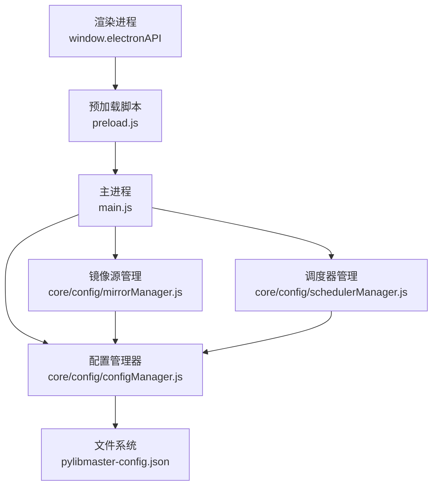
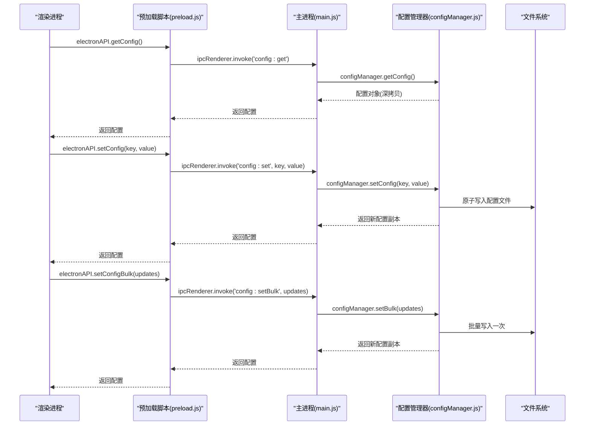
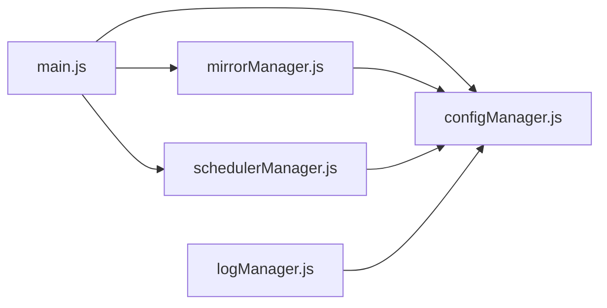

# 配置管理接口

<cite>
**本文引用的文件**   
- [main.js](file://main.js)
- [preload.js](file://preload.js)
- [configManager.js](file://core/config/configManager.js)
- [mirrorManager.js](file://core/config/mirrorManager.js)
- [schedulerManager.js](file://core/config/schedulerManager.js)
- [logManager.js](file://core/system/logManager.js)
- [package.json](file://package.json)
</cite>

## 目录
1. [简介](#简介)
2. [项目结构](#项目结构)
3. [核心组件](#核心组件)
4. [架构总览](#架构总览)
5. [详细组件分析](#详细组件分析)
6. [依赖关系分析](#依赖关系分析)
7. [性能考虑](#性能考虑)
8. [故障排查指南](#故障排查指南)
9. [结论](#结论)
10. [附录](#附录)

## 简介
本文件为 PyLibMaster 应用“配置管理”的完整 API 文档，聚焦于通过 IPC（进程间通信）暴露的配置接口：getConfig、setConfig、setConfigBulk。内容涵盖：
- 接口定义与调用方式（渲染进程 → preload → 主进程 → 配置模块）
- 配置数据的存储位置、文件格式与字段规范
- 值校验规则与范围限制
- 持久化机制（原子写入、损坏恢复）与热更新支持
- 配置项清单与默认值
- 版本兼容性与迁移最佳实践

## 项目结构
配置相关代码主要位于 core/config 目录，并通过 main.js 注册 IPC 处理器，由 preload.js 在渲染进程侧安全暴露。

图表来源
- [main.js:406-413](file://main.js#L406-L413)
- [preload.js:94-98](file://preload.js#L94-L98)
- [configManager.js:1-194](file://core/config/configManager.js#L1-L194)
- [mirrorManager.js:1-376](file://core/config/mirrorManager.js#L1-L376)
- [schedulerManager.js:1-197](file://core/config/schedulerManager.js#L1-L197)

章节来源
- [main.js:1-120](file://main.js#L1-L120)
- [preload.js:1-120](file://preload.js#L1-L120)
- [configManager.js:1-194](file://core/config/configManager.js#L1-L194)

## 核心组件
- 配置管理器（configManager.js）
  - 提供 getConfig、setConfig、setBulk（对应 IPC setConfigBulk）、getStoragePath、init
  - 负责配置文件的读写、默认值合并、数值范围校验与修正
- 镜像源管理（mirrorManager.js）
  - 使用配置中的 mirrors、smartRoute 等字段，并写回配置
- 调度器管理（schedulerManager.js）
  - 读取/保存 schedulerEnabled、schedulerFrequency、schedulerWhitelist、schedulerLastRun 等配置项
- 日志管理（logManager.js）
  - 通过配置中的 storagePath 定位日志目录

章节来源
- [configManager.js:1-194](file://core/config/configManager.js#L1-L194)
- [mirrorManager.js:1-376](file://core/config/mirrorManager.js#L1-L376)
- [schedulerManager.js:1-197](file://core/config/schedulerManager.js#L1-L197)
- [logManager.js:1-173](file://core/system/logManager.js#L1-L173)

## 架构总览
配置管理的 IPC 调用链路如下：

图表来源
- [preload.js:94-98](file://preload.js#L94-L98)
- [main.js:406-413](file://main.js#L406-L413)
- [configManager.js:140-178](file://core/config/configManager.js#L140-L178)

## 详细组件分析

### IPC 接口定义
- 获取配置
  - 名称：config:get
  - 参数：无
  - 返回：完整配置对象的深拷贝
  - 说明：首次访问会初始化配置，若文件不存在则创建默认配置
- 设置单个配置项
  - 名称：config:set
  - 参数：key(string), value(any)
  - 返回：更新后的配置对象副本
  - 说明：对数值型配置进行范围校验与自动修正；立即持久化
- 批量设置配置
  - 名称：config:setBulk
  - 参数：updates(Object<string, any>)
  - 返回：更新后的配置对象副本
  - 说明：逐项校验修正，仅触发一次磁盘写入

IPC 暴露位置
- 主进程处理器：[main.js:406-413](file://main.js#L406-L413)
- 渲染进程桥接：[preload.js:94-98](file://preload.js#L94-L98)

章节来源
- [main.js:406-413](file://main.js#L406-L413)
- [preload.js:94-98](file://preload.js#L94-L98)

### 配置数据模型与默认值
- 存储位置
  - Windows：%APPDATA%/PyLibMaster/pylibmaster-config.json
  - macOS：~/Library/Application Support/PyLibMaster/pylibmaster-config.json
  - Linux：~/.config/PyLibMaster/pylibmaster-config.json
- 文件格式：JSON
- 默认配置项与含义
  - theme: string，主题 light/dark/system
  - language: string，语言 zh/en
  - storagePath: string，日志与备份存储根路径
  - parallelThreads: number，并行安装线程数（范围 1-16，默认 4）
  - retryCount: number，智能重试次数（范围 0-10，默认 3）
  - smartRoute: boolean，智能路由开关
  - currentEnv: string|null，当前选中的 Python 环境
  - windowBounds: object，窗口尺寸与位置 {width,height,x,y}
- 其他由子模块写入的配置键
  - mirrors: array，镜像源列表（由 mirrorManager 维护）
  - schedulerEnabled: boolean，定时更新开关
  - schedulerFrequency: 'daily'|'weekly'，调度频率
  - schedulerWhitelist: array，白名单包名列表
  - schedulerLastRun: string|null，上次执行时间 ISO 字符串

章节来源
- [configManager.js:21-117](file://core/config/configManager.js#L21-L117)
- [mirrorManager.js:60-112](file://core/config/mirrorManager.js#L60-L112)
- [schedulerManager.js:29-50](file://core/config/schedulerManager.js#L29-L50)

### 值校验与范围限制
- 数值型配置
  - parallelThreads：最小 1，最大 16，非数字或非法值回退到默认 4
  - retryCount：最小 0，最大 10，非数字或非法值回退到默认 3
- 校验逻辑
  - 类型检查：必须为有限数字
  - 范围裁剪：超出范围取边界值
  - 舍入处理：取整
- 其他字段
  - 布尔、字符串、对象等按业务语义校验（如 windowBounds 的结构）

章节来源
- [configManager.js:25-44](file://core/config/configManager.js#L25-L44)
- [configManager.js:157-162](file://core/config/configManager.js#L157-L162)
- [configManager.js:171-178](file://core/config/configManager.js#L171-L178)

### 持久化机制
- 原子写入
  - 先写入临时文件，再重命名为目标文件，避免崩溃导致配置损坏
- 损坏恢复
  - 读取失败时重建默认配置并重新保存
- 防抖与落盘
  - setConfig/setBulk 均立即落盘；批量操作只写一次
- 错误降级
  - 保存失败时尝试记录日志，若日志模块未就绪则输出到 stderr

章节来源
- [configManager.js:123-138](file://core/config/configManager.js#L123-L138)
- [configManager.js:101-117](file://core/config/configManager.js#L101-L117)

### 热更新支持
- 内存缓存
  - 配置对象在主进程中以闭包变量缓存，避免频繁 IO
- 实时生效
  - setConfig/setBulk 修改后返回最新配置副本，调用方可即时使用
- 事件通知
  - 主题切换等场景通过 IPC 事件推送至渲染进程（例如 theme:changed），实现界面热更新
- 窗口状态同步
  - 窗口大小/位置变化通过节流写入配置，并在下次启动时恢复

章节来源
- [configManager.js:46-61](file://core/config/configManager.js#L46-L61)
- [main.js:201-208](file://main.js#L201-L208)
- [main.js:90-106](file://main.js#L90-L106)

### 配置项清单与默认值
- theme: 默认 light
- language: 默认 zh
- storagePath: 默认安装目录下的 log 文件夹
- parallelThreads: 默认 4（范围 1-16）
- retryCount: 默认 3（范围 0-10）
- smartRoute: 默认 false
- currentEnv: 默认 null
- windowBounds: 默认 { width: 1200, height: 760 }
- mirrors: 由镜像源管理模块维护（内置 + 自定义）
- schedulerEnabled: 默认 false
- schedulerFrequency: 默认 daily
- schedulerWhitelist: 默认 []
- schedulerLastRun: 默认 null

章节来源
- [configManager.js:89-99](file://core/config/configManager.js#L89-L99)
- [mirrorManager.js:21-29](file://core/config/mirrorManager.js#L21-L29)
- [schedulerManager.js:29-37](file://core/config/schedulerManager.js#L29-L37)

### 配置迁移与版本兼容性最佳实践
- 向后兼容
  - 读取配置时与默认值合并，缺失字段自动补全
  - 未知字段保留不破坏结构
- 向前兼容
  - 新增配置项时保持旧版配置可被读取与合并
- 建议做法
  - 在应用升级时，优先使用默认值合并策略，避免强制覆盖用户设置
  - 对废弃字段做软删除（不再写入，但读取时忽略）
  - 如需破坏性变更，应在迁移逻辑中显式提示用户并生成迁移日志

章节来源
- [configManager.js:101-117](file://core/config/configManager.js#L101-L117)

## 依赖关系分析
- 主进程 main.js 注册 IPC 处理器，转发到各模块
- 配置模块 configManager.js 是配置持久化的核心，被 mirrorManager.js 与 schedulerManager.js 复用
- 日志模块 logManager.js 依赖 storagePath 配置确定日志目录

图表来源
- [main.js:406-413](file://main.js#L406-L413)
- [configManager.js:1-194](file://core/config/configManager.js#L1-L194)
- [mirrorManager.js:1-376](file://core/config/mirrorManager.js#L1-L376)
- [schedulerManager.js:1-197](file://core/config/schedulerManager.js#L1-L197)
- [logManager.js:1-173](file://core/system/logManager.js#L1-L173)

章节来源
- [main.js:1-120](file://main.js#L1-L120)
- [configManager.js:1-194](file://core/config/configManager.js#L1-L194)

## 性能考虑
- 原子写入减少 I/O 风险
- 批量设置仅一次落盘，降低磁盘压力
- 配置对象深拷贝返回，避免外部污染内部状态
- 窗口状态写入采用节流（500ms）避免高频写入
- 日志写入采用防抖（300ms）提升吞吐

章节来源
- [configManager.js:123-138](file://core/config/configManager.js#L123-L138)
- [configManager.js:171-178](file://core/config/configManager.js#L171-L178)
- [main.js:90-106](file://main.js#L90-L106)
- [logManager.js:69-83](file://core/system/logManager.js#L69-L83)

## 故障排查指南
- 配置文件损坏
  - 现象：读取失败
  - 处理：自动重建默认配置并保存
- 保存失败
  - 现象：无法写入配置文件
  - 处理：尝试记录日志，否则输出到 stderr
- 存储路径不存在
  - 现象：storagePath 指向的目录不存在
  - 处理：getStoragePath 会自动创建目录
- 数值越界
  - 现象：parallelThreads/retryCount 超出范围或非数字
  - 处理：自动修正为最近合法值或默认值

章节来源
- [configManager.js:101-117](file://core/config/configManager.js#L101-L117)
- [configManager.js:123-138](file://core/config/configManager.js#L123-L138)
- [configManager.js:185-191](file://core/config/configManager.js#L185-L191)
- [configManager.js:39-44](file://core/config/configManager.js#L39-L44)

## 结论
配置管理接口通过简洁的 IPC 暴露了获取、单条设置与批量设置能力，具备完善的值校验、原子持久化与损坏恢复机制，并支持热更新与跨平台存储路径。配合镜像源与调度器等子模块，形成稳定可靠的配置体系。建议在后续迭代中继续遵循默认值合并与向后兼容原则，确保平滑升级。

## 附录

### IPC 方法速查表
- 获取配置
  - 渲染端：electronAPI.getConfig()
  - 主进程：ipcMain.handle('config:get', ...)
  - 返回：完整配置对象（深拷贝）
- 设置单个配置
  - 渲染端：electronAPI.setConfig(key, value)
  - 主进程：ipcMain.handle('config:set', ...)
  - 行为：校验修正 + 立即落盘
- 批量设置配置
  - 渲染端：electronAPI.setConfigBulk(updates)
  - 主进程：ipcMain.handle('config:setBulk', ...)
  - 行为：逐项校验修正 + 单次落盘

章节来源
- [preload.js:94-98](file://preload.js#L94-L98)
- [main.js:406-413](file://main.js#L406-L413)

### 配置项参考
- 基础项
  - theme: string（light/dark/system）
  - language: string（zh/en）
  - storagePath: string（日志与备份根路径）
  - parallelThreads: number（1-16，默认 4）
  - retryCount: number（0-10，默认 3）
  - smartRoute: boolean（默认 false）
  - currentEnv: string|null
  - windowBounds: object（{width,height,x,y}）
- 镜像源
  - mirrors: array（由 mirrorManager 维护）
- 调度器
  - schedulerEnabled: boolean（默认 false）
  - schedulerFrequency: 'daily'|'weekly'（默认 daily）
  - schedulerWhitelist: array（默认 []）
  - schedulerLastRun: string|null（默认 null）

章节来源
- [configManager.js:89-99](file://core/config/configManager.js#L89-L99)
- [mirrorManager.js:60-112](file://core/config/mirrorManager.js#L60-L112)
- [schedulerManager.js:29-50](file://core/config/schedulerManager.js#L29-L50)

### 版本信息
- 应用版本：见 package.json 的 version 字段

章节来源
- [package.json:1-10](file://package.json#L1-L10)