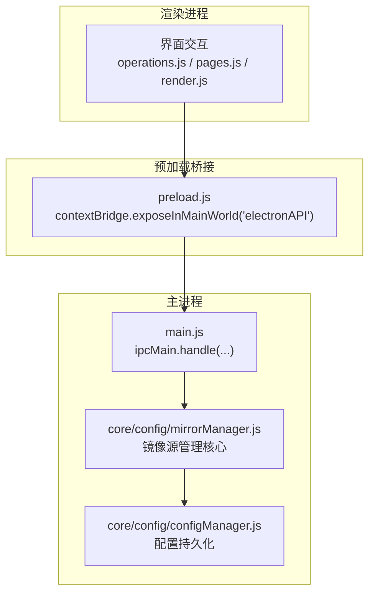
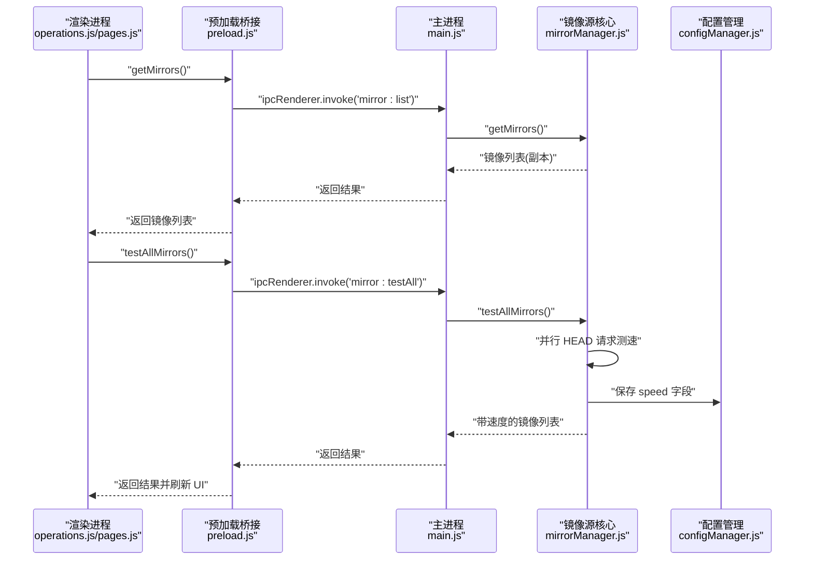
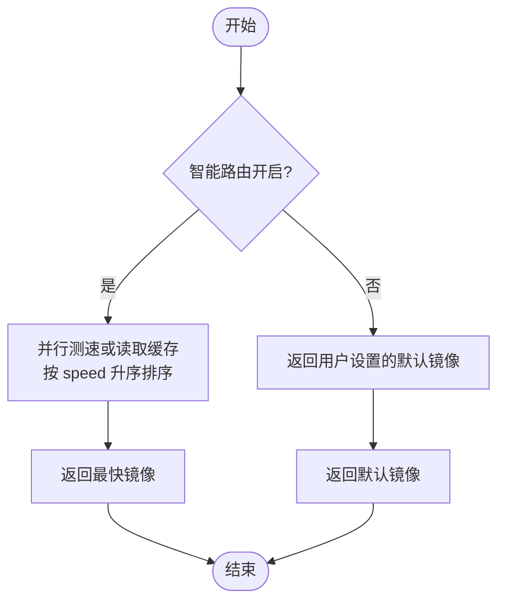
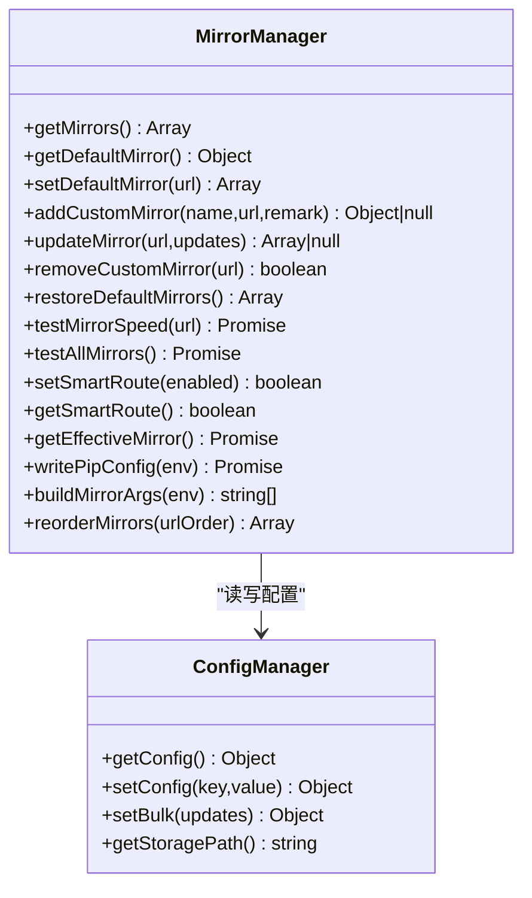
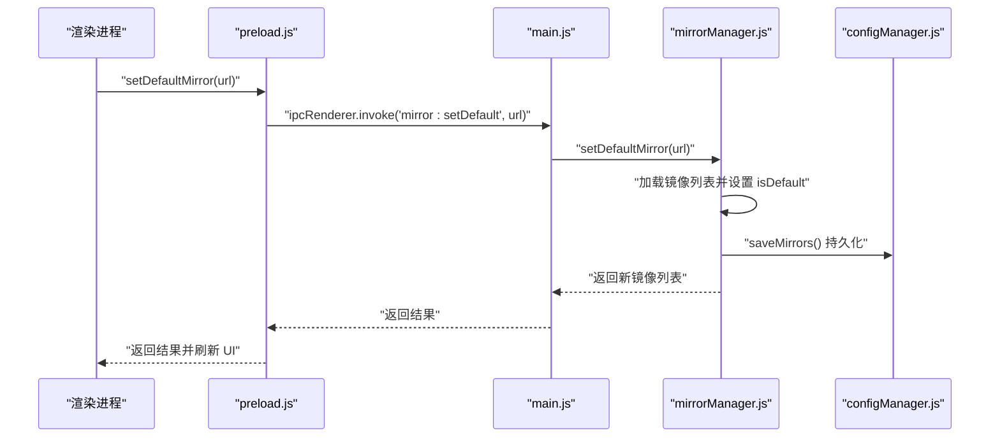
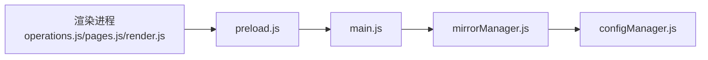

# 镜像源管理接口

<cite>
**本文引用的文件**   
- [mirrorManager.js](file://core/config/mirrorManager.js)
- [main.js](file://main.js)
- [preload.js](file://preload.js)
- [configManager.js](file://core/config/configManager.js)
- [operations.js](file://renderer/js/operations.js)
- [pages.js](file://renderer/js/pages.js)
- [render.js](file://renderer/js/render.js)
</cite>

## 目录
1. [简介](#简介)
2. [项目结构](#项目结构)
3. [核心组件](#核心组件)
4. [架构总览](#架构总览)
5. [详细组件分析](#详细组件分析)
6. [依赖关系分析](#依赖关系分析)
7. [性能考量](#性能考量)
8. [故障排查指南](#故障排查指南)
9. [结论](#结论)
10. [附录](#附录)

## 简介
本文件为 PyLibMaster 的镜像源管理接口文档，覆盖通过 IPC 暴露的镜像源配置与管理能力，包括：
- 获取镜像源列表
- 测试镜像速度（单测与批量）
- 设置默认镜像
- 添加自定义镜像
- 更新镜像配置
- 删除自定义镜像
- 智能路由开关与状态查询
- 将当前镜像写入 pip 配置文件
- 镜像源排序（优先级）

同时说明镜像源数据模型、速度测试算法与自动选择策略，并提供配置示例与性能优化建议。

## 项目结构
镜像源功能贯穿主进程、预加载桥接层与渲染进程三层：
- 主进程 main.js：注册所有 IPC 处理器，转发到 core/config/mirrorManager.js
- 预加载 preload.js：安全桥接，向渲染进程暴露 window.electronAPI.* 方法
- 核心模块 core/config/mirrorManager.js：实现镜像源 CRUD、测速、智能路由、写 pip 配置等
- 渲染进程 renderer/js/*：页面交互与 UI 渲染，调用 electronAPI 完成操作

图表来源
- [main.js:370-395](file://main.js#L370-L395)
- [preload.js:73-86](file://preload.js#L73-L86)
- [mirrorManager.js:1-30](file://core/config/mirrorManager.js#L1-L30)
- [configManager.js:1-30](file://core/config/configManager.js#L1-L30)

章节来源
- [main.js:370-395](file://main.js#L370-L395)
- [preload.js:73-86](file://preload.js#L73-L86)
- [mirrorManager.js:1-30](file://core/config/mirrorManager.js#L1-L30)
- [configManager.js:1-30](file://core/config/configManager.js#L1-L30)

## 核心组件
- 镜像源管理器 mirrorManager.js
  - 内置镜像源列表与合并用户自定义镜像
  - 镜像源校验、CRUD、排序、测速、智能路由、写 pip 配置
- 配置管理器 configManager.js
  - 应用配置读写、范围校验、原子保存
- 主进程 IPC 映射 main.js
  - 将渲染进程的请求映射到镜像源管理器方法
- 预加载桥接 preload.js
  - 暴露 electronAPI.getMirrors/testMirrorSpeed/setDefaultMirror/addCustomMirror/updateMirror/removeCustomMirror/setSmartRoute/getSmartRoute 等方法
- 渲染进程 operations.js / pages.js / render.js
  - 页面逻辑与 UI 渲染，触发上述 API

章节来源
- [mirrorManager.js:109-131](file://core/config/mirrorManager.js#L109-L131)
- [mirrorManager.js:139-179](file://core/config/mirrorManager.js#L139-L179)
- [mirrorManager.js:187-210](file://core/config/mirrorManager.js#L187-L210)
- [mirrorManager.js:219-247](file://core/config/mirrorManager.js#L219-L247)
- [mirrorManager.js:249-290](file://core/config/mirrorManager.js#L249-L290)
- [mirrorManager.js:299-333](file://core/config/mirrorManager.js#L299-L333)
- [mirrorManager.js:340-357](file://core/config/mirrorManager.js#L340-L357)
- [main.js:370-395](file://main.js#L370-L395)
- [preload.js:73-86](file://preload.js#L73-L86)
- [operations.js:434-438](file://renderer/js/operations.js#L434-L438)
- [pages.js:21-161](file://renderer/js/pages.js#L21-L161)
- [render.js:215-318](file://renderer/js/render.js#L215-L318)

## 架构总览
镜像源管理的端到端调用链如下：

图表来源
- [preload.js:73-86](file://preload.js#L73-L86)
- [main.js:370-395](file://main.js#L370-L395)
- [mirrorManager.js:240-247](file://core/config/mirrorManager.js#L240-L247)
- [configManager.js:157-178](file://core/config/configManager.js#L157-L178)

## 详细组件分析

### 镜像源数据模型
- 字段说明
  - name: 镜像名称（字符串）
  - url: 镜像地址（字符串，必须以 http/https 开头，末尾建议以 / 结尾）
  - remark: 备注（可选字符串）
  - isDefault: 是否默认镜像（布尔）
  - builtin: 是否为内置镜像（布尔）
  - speed: 最近一次测速结果（毫秒；失败标记为 9999；未测速为 null）
- 约束与一致性
  - 始终保证有且仅有一个默认镜像
  - URL 必须有效（协议与长度限制）
  - 新增或更新时避免重复 URL
- 存储
  - 持久化至应用配置中的 mirrors 数组（仅保存必要字段）

章节来源
- [mirrorManager.js:22-29](file://core/config/mirrorManager.js#L22-L29)
- [mirrorManager.js:60-91](file://core/config/mirrorManager.js#L60-L91)
- [mirrorManager.js:97-107](file://core/config/mirrorManager.js#L97-L107)

### IPC 接口清单与行为说明
- getMirrors（获取镜像源列表）
  - 入口：preload.js 暴露 api.getMirrors()
  - IPC：'mirror:list'
  - 行为：返回包含内置与自定义镜像的完整列表（副本），确保默认唯一性
- testMirrorSpeed（测试单个镜像速度）
  - 入口：api.testMirrorSpeed(url)
  - IPC：'mirror:test'
  - 行为：HEAD 请求目标 + 'numpy/'，超时 5s，成功返回耗时毫秒，失败返回 9999
- testAllMirrors（批量测速）
  - 入口：api.testAllMirrors()
  - IPC：'mirror:testAll'
  - 行为：并行测速，写入每个镜像的 speed 字段并持久化
- setDefaultMirror（设置默认镜像）
  - 入口：api.setDefaultMirror(url)
  - IPC：'mirror:setDefault'
  - 行为：将指定 URL 设为唯一默认项，并保存
- addCustomMirror（添加自定义镜像）
  - 入口：api.addCustomMirror(name, url, remark)
  - IPC：'mirror:addCustom'
  - 行为：校验 URL，去重后追加，保存
- updateMirror（更新镜像配置）
  - 入口：api.updateMirror(url, updates)
  - IPC：'mirror:update'
  - 行为：支持更新 name/url/remark，URL 变更需校验且不与其他镜像冲突
- removeCustomMirror（删除自定义镜像）
  - 入口：api.removeCustomMirror(url)
  - IPC：'mirror:removeCustom'
  - 行为：删除后若原为默认则自动将首个镜像设为默认
- setSmartRoute（启用/禁用智能路由）
  - 入口：api.setSmartRoute(enabled)
  - IPC：'mirror:smartRoute'
  - 行为：切换智能路由开关并持久化
- getSmartRoute（获取智能路由状态）
  - 入口：api.getSmartRoute()
  - IPC：'mirror:getSmartRoute'
  - 行为：返回当前开关状态
- writePipConfig（写入 pip 配置文件）
  - 入口：api.writePipMirrorConfig()
  - IPC：'mirror:writePipConfig'
  - 行为：根据平台写入全局 index-url 与 timeout，使用当前生效镜像（智能路由优先）
- reorderMirrors（重新排序镜像源）
  - 入口：api.reorderMirrors(urlOrder)
  - IPC：'mirror:reorder'
  - 行为：按传入 URL 顺序重排，未指定的追加到末尾

章节来源
- [preload.js:73-86](file://preload.js#L73-L86)
- [main.js:370-395](file://main.js#L370-L395)
- [mirrorManager.js:109-131](file://core/config/mirrorManager.js#L109-L131)
- [mirrorManager.js:139-179](file://core/config/mirrorManager.js#L139-L179)
- [mirrorManager.js:187-210](file://core/config/mirrorManager.js#L187-L210)
- [mirrorManager.js:219-247](file://core/config/mirrorManager.js#L219-L247)
- [mirrorManager.js:249-290](file://core/config/mirrorManager.js#L249-L290)
- [mirrorManager.js:299-333](file://core/config/mirrorManager.js#L299-L333)
- [mirrorManager.js:340-357](file://core/config/mirrorManager.js#L340-L357)

### 速度测试算法与自动选择策略
- 速度测试算法
  - 对目标镜像发起 HEAD 请求访问 {url}numpy/
  - 超时阈值：5 秒
  - 成功返回响应时间（毫秒），失败返回 9999
  - 批量测速采用 Promise.all 并行执行，提升整体效率
- 自动选择策略（智能路由）
  - 开启智能路由时，选择最近一次测速最快的镜像作为“生效镜像”
  - 关闭智能路由时，使用用户设置的默认镜像
  - 选择过程会复用已缓存的 speed 值，若无则实时测速

图表来源
- [mirrorManager.js:267-290](file://core/config/mirrorManager.js#L267-L290)
- [mirrorManager.js:219-247](file://core/config/mirrorManager.js#L219-L247)

### 类与方法关系图（代码级）

图表来源
- [mirrorManager.js:359-375](file://core/config/mirrorManager.js#L359-L375)
- [configManager.js:144-178](file://core/config/configManager.js#L144-L178)

### 关键流程时序图（以“设置默认镜像”为例）

图表来源
- [preload.js:73-86](file://preload.js#L73-L86)
- [main.js:370-395](file://main.js#L370-L395)
- [mirrorManager.js:125-131](file://core/config/mirrorManager.js#L125-L131)
- [mirrorManager.js:97-107](file://core/config/mirrorManager.js#L97-L107)

## 依赖关系分析
- 主进程 main.js 依赖 mirrorManager.js 提供镜像管理能力
- mirrorManager.js 依赖 configManager.js 进行配置持久化
- 预加载层 preload.js 暴露 electronAPI 给渲染进程
- 渲染进程 operations.js / pages.js / render.js 负责 UI 与交互，调用 electronAPI

图表来源
- [main.js:370-395](file://main.js#L370-L395)
- [preload.js:73-86](file://preload.js#L73-L86)
- [mirrorManager.js:1-30](file://core/config/mirrorManager.js#L1-L30)
- [configManager.js:1-30](file://core/config/configManager.js#L1-L30)

章节来源
- [main.js:370-395](file://main.js#L370-L395)
- [preload.js:73-86](file://preload.js#L73-L86)
- [mirrorManager.js:1-30](file://core/config/mirrorManager.js#L1-L30)
- [configManager.js:1-30](file://core/config/configManager.js#L1-L30)

## 性能考量
- 并行测速：testAllMirrors 使用 Promise.all 并发请求，显著降低总耗时
- 超时控制：单次测速 5 秒超时，避免阻塞
- 缓存复用：pickBestMirror 优先使用已缓存的 speed 值，减少网络开销
- 配置原子写入：configManager 使用临时文件+重命名，防止崩溃导致配置损坏
- 前端防抖与状态管理：UI 在拖拽排序等操作中避免频繁写入，必要时统一提交

[本节为通用性能指导，不直接分析具体文件]

## 故障排查指南
- 镜像 URL 无效
  - 现象：添加或更新时报错
  - 原因：URL 非 http/https 或格式不正确
  - 处理：检查协议与路径，确保以 / 结尾
- 测速失败（返回 9999）
  - 现象：速度显示“超时”
  - 原因：网络不可达、服务器拒绝、超时
  - 处理：检查网络连通性与镜像可用性
- 默认镜像唯一性异常
  - 现象：多个默认镜像或无默认镜像
  - 原因：数据不一致
  - 处理：调用 restoreDefaultMirrors 恢复默认，或重新设置默认
- 写入 pip 配置失败
  - 现象：writePipConfig 返回 false
  - 原因：权限不足、路径不存在
  - 处理：确认运行权限与目录存在，查看日志记录

章节来源
- [mirrorManager.js:43-51](file://core/config/mirrorManager.js#L43-L51)
- [mirrorManager.js:219-233](file://core/config/mirrorManager.js#L219-L233)
- [mirrorManager.js:299-322](file://core/config/mirrorManager.js#L299-L322)
- [mirrorManager.js:204-210](file://core/config/mirrorManager.js#L204-L210)

## 结论
镜像源管理接口提供了完整的镜像源配置、测速、智能路由与 pip 配置写入能力。通过清晰的 IPC 分层与安全的预加载桥接，渲染进程可便捷地调用核心功能。建议在大规模环境中结合并行测速与缓存策略，以获得更优的用户体验与系统稳定性。

[本节为总结性内容，不直接分析具体文件]

## 附录

### IPC 接口参考表
- 获取镜像源列表
  - 渲染调用：api.getMirrors()
  - IPC 通道：'mirror:list'
  - 返回：镜像源数组（含内置与自定义）
- 测试单个镜像速度
  - 渲染调用：api.testMirrorSpeed(url)
  - IPC 通道：'mirror:test'
  - 返回：毫秒数（失败为 9999）
- 批量测试镜像速度
  - 渲染调用：api.testAllMirrors()
  - IPC 通道：'mirror:testAll'
  - 返回：带 speed 字段的镜像数组
- 设置默认镜像
  - 渲染调用：api.setDefaultMirror(url)
  - IPC 通道：'mirror:setDefault'
  - 返回：更新后的镜像数组
- 添加自定义镜像
  - 渲染调用：api.addCustomMirror(name, url, remark)
  - IPC 通道：'mirror:addCustom'
  - 返回：新镜像对象或 null（已存在）
- 更新镜像配置
  - 渲染调用：api.updateMirror(url, updates)
  - IPC 通道：'mirror:update'
  - 返回：更新后的镜像数组或 null（失败）
- 删除自定义镜像
  - 渲染调用：api.removeCustomMirror(url)
  - IPC 通道：'mirror:removeCustom'
  - 返回：是否成功
- 智能路由开关
  - 渲染调用：api.setSmartRoute(enabled)
  - IPC 通道：'mirror:smartRoute'
  - 返回：开关状态
- 获取智能路由状态
  - 渲染调用：api.getSmartRoute()
  - IPC 通道：'mirror:getSmartRoute'
  - 返回：布尔值
- 写入 pip 配置文件
  - 渲染调用：api.writePipMirrorConfig()
  - IPC 通道：'mirror:writePipConfig'
  - 返回：是否成功
- 重新排序镜像源
  - 渲染调用：api.reorderMirrors(urlOrder)
  - IPC 通道：'mirror:reorder'
  - 返回：更新后的镜像数组

章节来源
- [preload.js:73-86](file://preload.js#L73-L86)
- [main.js:370-395](file://main.js#L370-L395)

### 镜像源配置示例
- 内置镜像源（示例）
  - 名称：PyPI 官方
  - URL：https://pypi.org/simple/
  - 默认：是
- 自定义镜像源（示例）
  - 名称：企业内网镜像
  - URL：https://internal-mirror.example.com/pypi/simple/
  - 备注：仅供内部使用
- 智能路由
  - 开启：自动选择最快镜像
  - 关闭：使用用户设置的默认镜像

章节来源
- [mirrorManager.js:22-29](file://core/config/mirrorManager.js#L22-L29)
- [mirrorManager.js:249-290](file://core/config/mirrorManager.js#L249-L290)

### 性能优化建议
- 批量测速优先使用 testAllMirrors，利用并行请求缩短总耗时
- 合理设置测速频率，避免频繁网络请求影响用户体验
- 在智能路由开启时，尽量保持缓存命中，减少重复测速
- 对于高延迟网络环境，适当增加超时阈值或重试策略（由上层业务决定）

[本节为通用优化建议，不直接分析具体文件]