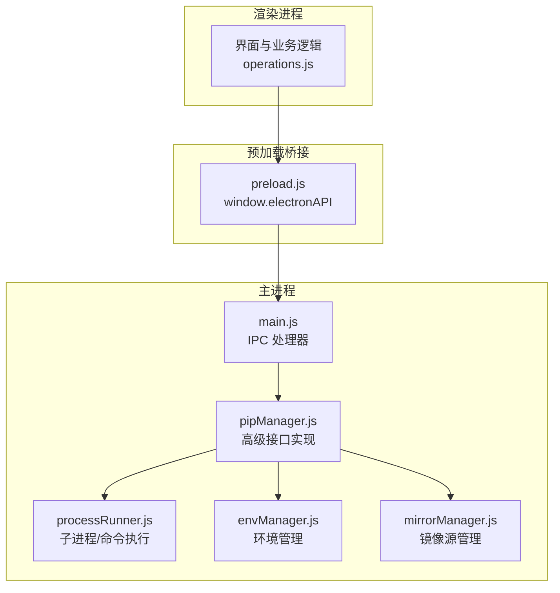
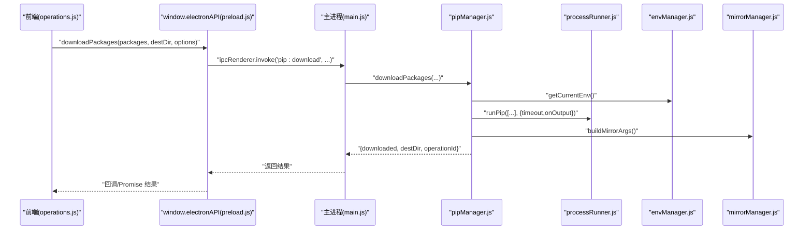
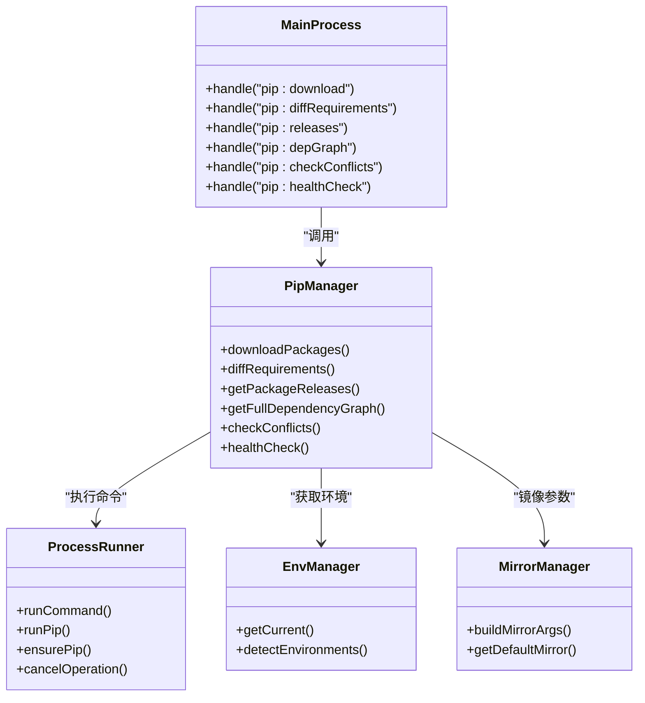

# 高级包管理接口

<cite>
**本文引用的文件**   
- [main.js](file://main.js)
- [preload.js](file://preload.js)
- [package.json](file://package.json)
- [pipManager.js](file://core/operations/pipManager.js)
- [processRunner.js](file://utils/processRunner.js)
- [envManager.js](file://core/system/envManager.js)
- [mirrorManager.js](file://core/config/mirrorManager.js)
- [operations.js](file://renderer/js/operations.js)
</cite>

## 目录
1. [简介](#简介)
2. [项目结构](#项目结构)
3. [核心组件](#核心组件)
4. [架构总览](#架构总览)
5. [详细组件分析](#详细组件分析)
6. [依赖关系分析](#依赖关系分析)
7. [性能考量](#性能考量)
8. [故障排除指南](#故障排除指南)
9. [结论](#结论)
10. [附录：自动化脚本示例与最佳实践](#附录自动化脚本示例与最佳实践)

## 简介
本文件为 PyLibMaster 的“高级包管理接口”完整 API 文档，聚焦以下扩展能力：
- 离线下载：downloadPackages（批量下载离线包）
- requirements 对比：diffRequirements（多来源差异对比）
- 包发布历史：getPackageReleases（PyPI JSON 获取版本历史）
- 全局依赖图谱：getDependencyGraph（环境内依赖图）
- 依赖冲突检查：checkConflicts（基于 pip check）
- 环境健康检查：healthCheck（综合诊断报告）

这些接口通过 Electron IPC 暴露给渲染进程，由主进程路由到 core/operations/pipManager.js 的具体实现。文档涵盖使用场景、参数说明、返回值结构、错误处理与性能建议，并提供复杂任务的自动化脚本思路与故障排除指引。

## 项目结构
- main.js：Electron 主进程入口，注册所有 IPC 处理器，将渲染进程请求转发至核心模块。
- preload.js：安全桥接层，向渲染进程暴露 window.electronAPI 方法集合。
- package.json：应用元数据与构建配置。
- core/operations/pipManager.js：包管理的核心实现，包含高级接口。
- utils/processRunner.js：子进程运行器，封装 pip/Python 命令执行、超时、取消、自动安装 pip。
- core/system/envManager.js：Python 环境检测与切换。
- core/config/mirrorManager.js：镜像源管理与智能路由。
- renderer/js/operations.js：前端操作逻辑（安装/卸载/更新等），可作为调用参考。

图表来源
- [main.js:233-640](file://main.js#L233-L640)
- [preload.js:20-221](file://preload.js#L20-L221)
- [pipManager.js:1214-1596](file://core/operations/pipManager.js#L1214-L1596)
- [processRunner.js:85-366](file://utils/processRunner.js#L85-L366)
- [envManager.js:85-220](file://core/system/envManager.js#L85-L220)
- [mirrorManager.js:1-200](file://core/config/mirrorManager.js#L1-L200)

章节来源
- [main.js:1-640](file://main.js#L1-L640)
- [preload.js:1-221](file://preload.js#L1-L221)
- [package.json:1-79](file://package.json#L1-L79)

## 核心组件
- 高级包管理接口集中在 pipManager.js，提供 downloadPackages、diffRequirements、getPackageReleases、getFullDependencyGraph、checkConflicts、healthCheck 等方法。
- 主进程在 main.js 中通过 ipcMain.handle 暴露对应 IPC 通道，如 pip:download、pip:diffRequirements、pip:releases、pip:depGraph、pip:checkConflicts、pip:healthCheck。
- 预加载脚本在 preload.js 中将上述能力暴露为 window.electronAPI.downloadPackages、diffRequirements、getPackageReleases、getDependencyGraph、checkConflicts、healthCheck。

章节来源
- [main.js:593-618](file://main.js#L593-L618)
- [preload.js:151-166](file://preload.js#L151-L166)
- [pipManager.js:1214-1596](file://core/operations/pipManager.js#L1214-L1596)

## 架构总览
下图展示高级接口的调用链路：渲染进程通过 window.electronAPI 调用，经 IPC 进入主进程处理器，再委派到 pipManager 具体实现，必要时调用 processRunner 执行系统命令或访问 envManager/mirrorManager。

图表来源
- [preload.js:151-153](file://preload.js#L151-L153)
- [main.js:596-600](file://main.js#L596-L600)
- [pipManager.js:1224-1263](file://core/operations/pipManager.js#L1224-L1263)
- [processRunner.js:340-342](file://utils/processRunner.js#L340-L342)
- [envManager.js:178-184](file://core/system/envManager.js#L178-L184)
- [mirrorManager.js:1-200](file://core/config/mirrorManager.js#L1-L200)

## 详细组件分析

### 接口一：downloadPackages（批量下载离线包）
- 功能：将指定包及其依赖下载到本地目录，用于离线安装。
- 触发方式：
  - 前端：window.electronAPI.downloadPackages(packages, destDir, options)
  - IPC：'pip:download'
- 关键参数
  - packages: string[] 包名列表（支持版本规格，内部会进行安全校验）
  - destDir: string 目标目录（不存在会自动创建）
  - options: object
    - includeDeps: boolean 是否包含依赖（默认包含；设为 false 则 --no-deps）
    - platform: string 平台限定（如 manylinux_x86_64）
    - pythonVersion: string Python 版本限定
    - operationId: string 操作 ID（用于取消）
- 返回值
  - downloaded: number 成功下载的包数量
  - destDir: string 实际保存目录
  - operationId: string 操作 ID
- 行为细节
  - 使用 pip download，并追加镜像源参数（来自 mirrorManager.buildMirrorArgs）
  - 输出通过 onOutput 回调推送进度
  - 失败时记录日志并抛出异常
- 使用场景
  - 离线部署、CI/CD 缓存、跨网络受限环境分发
- 性能考虑
  - 大列表下载耗时较长，建议分批或限制并发
  - 合理设置 timeout（默认 600s）
  - 避免重复下载，可复用已存在 .whl/.tar.gz

章节来源
- [main.js:596-600](file://main.js#L596-L600)
- [preload.js:151-153](file://preload.js#L151-L153)
- [pipManager.js:1224-1263](file://core/operations/pipManager.js#L1224-L1263)

### 接口二：diffRequirements（requirements 对比）
- 功能：对比两个来源（文件或环境）的包列表差异，识别仅存在于 A/B 的包以及版本升级/降级情况。
- 触发方式：
  - 前端：window.electronAPI.diffRequirements(sourceA, sourceB)
  - IPC：'pip:diffRequirements'
- 关键参数
  - sourceA: { type: 'env'|'file', path: string }
  - sourceB: { type: 'env'|'file', path: string }
- 返回值
  - onlyA: Array 仅存在于 A 的包
  - onlyB: Array 仅存在于 B 的包
  - upgraded: Array 从 B 视角看是升级的项（含 name, versionA, versionB）
  - downgraded: Array 当前实现预留字段（空数组）
  - same: Array 相同版本的包
- 行为细节
  - 文件模式：解析 requirements.txt（支持 == 精确匹配与无版本行）
  - 环境模式：通过 pip list --format=json 获取
  - 并行获取两个来源的数据，提升性能
- 使用场景
  - 环境一致性校验、迁移前后对比、审计变更
- 性能考虑
  - 对大型环境，list 查询可能较慢，注意超时设置

章节来源
- [main.js:605-607](file://main.js#L605-L607)
- [preload.js:155-155](file://preload.js#L155-L155)
- [pipManager.js:1273-1320](file://core/operations/pipManager.js#L1273-L1320)

### 接口三：getPackageReleases（包发布历史）
- 功能：从 PyPI JSON API 获取包的版本发布历史（按上传时间排序，最多返回最近 10 个版本）。
- 触发方式：
  - 前端：window.electronAPI.getPackageReleases(pkgName)
  - IPC：'pip:releases'
- 关键参数
  - pkgName: string 包名（需符合命名规范）
- 返回值
  - releases: Array[{version, uploadTime, url}]
  - homePage: string 主页
  - projectUrl: string 项目地址
  - projectUrls: Object 项目链接映射
- 行为细节
  - 直接通过 https 请求 pypi.org 的 JSON API
  - 超时 15s，错误包括网络错误、超时、JSON 解析失败
- 使用场景
  - 包信息展示、版本选择、发布审计
- 性能考虑
  - 网络请求，建议在前端做缓存与重试

章节来源
- [main.js:612-612](file://main.js#L612-L612)
- [preload.js:158-158](file://preload.js#L158-L158)
- [pipManager.js:1329-1378](file://core/operations/pipManager.js#L1329-L1378)

### 接口四：getDependencyGraph（全局依赖图谱）
- 功能：生成当前环境的依赖关系图（节点为包，边为依赖关系）。
- 触发方式：
  - 前端：window.electronAPI.getDependencyGraph()
  - IPC：'pip:depGraph'
- 关键参数
  - 无
- 返回值
  - nodes: Array[{name, version}]
  - edges: Array[{from, to}]
- 行为细节
  - 读取 pip list 前 80 个包进行 show 扫描，避免超时
  - 结果有 5 分钟缓存，减少重复计算
- 使用场景
  - 可视化依赖拓扑、定位循环依赖、影响面分析
- 性能考虑
  - 包数量较多时，show 调用开销较大；建议控制扫描范围或使用缓存

章节来源
- [main.js:617-617](file://main.js#L617-L617)
- [preload.js:161-161](file://preload.js#L161-L161)
- [pipManager.js:1391-1435](file://core/operations/pipManager.js#L1391-L1435)

### 接口五：checkConflicts（依赖冲突检查）
- 功能：基于 pip check 检测依赖冲突，解析冲突信息并结构化返回。
- 触发方式：
  - 前端：window.electronAPI.checkConflicts()
  - IPC：'pip:checkConflicts'
- 关键参数
  - 无
- 返回值
  - ok: boolean 是否无冲突
  - conflicts: Array[{package, version, requires, installed, message}]
  - message: string 原始输出摘要
- 行为细节
  - 解析两种常见冲突格式（缺失依赖、版本不满足）
  - 捕获非零退出码时的 stdout 并尝试解析
- 使用场景
  - 环境稳定性检查、上线前校验
- 性能考虑
  - 单次检查较快，但大量包环境下仍可能有延迟

章节来源
- [main.js:351-351](file://main.js#L351-L351)
- [preload.js:164-164](file://preload.js#L164-L164)
- [pipManager.js:1442-1485](file://core/operations/pipManager.js#L1442-L1485)

### 接口六：healthCheck（环境健康检查）
- 功能：综合诊断环境健康度，包括包列表、依赖冲突、损坏包、site-packages 可访问性等，给出评分与问题清单。
- 触发方式：
  - 前端：window.electronAPI.healthCheck()
  - IPC：'pip:healthCheck'
- 关键参数
  - 无
- 返回值
  - envName: string 环境名称
  - pythonVersion: string Python 版本
  - totalPackages: number 包总数
  - issues: Array[{level, message}] 问题列表
  - brokenPackages: Array<string> 疑似损坏的包
  - missingMetadata: Array 预留字段（当前为空）
  - conflicts: Array 冲突详情（来自 checkConflicts）
  - score: number 健康评分（0-100）
- 行为细节
  - 依次执行：list、check、抽样 show、site-packages 路径检查
  - 根据问题数量扣减分数，最终裁剪到 0-100
- 使用场景
  - 定期巡检、自动化流水线质量门禁
- 性能考虑
  - 多次 pip 调用，建议按需启用或在后台异步执行

章节来源
- [main.js:353-353](file://main.js#L353-L353)
- [preload.js:165-165](file://preload.js#L165-L165)
- [pipManager.js:1492-1566](file://core/operations/pipManager.js#L1492-L1566)

## 依赖关系分析
- 主进程 IPC 处理器集中定义于 main.js，负责参数透传与事件回发（如 pip:progress）。
- pipManager.js 为核心实现，依赖：
  - processRunner.js：统一子进程执行、超时、取消、自动安装 pip
  - envManager.js：获取当前 Python 环境
  - mirrorManager.js：镜像源参数拼装与智能路由
- 前端 operations.js 展示了典型调用流程（安装/卸载/更新），可作为高级接口的调用范式参考。

图表来源
- [main.js:593-618](file://main.js#L593-L618)
- [pipManager.js:1214-1596](file://core/operations/pipManager.js#L1214-L1596)
- [processRunner.js:85-366](file://utils/processRunner.js#L85-L366)
- [envManager.js:85-220](file://core/system/envManager.js#L85-L220)
- [mirrorManager.js:1-200](file://core/config/mirrorManager.js#L1-L200)

章节来源
- [main.js:233-640](file://main.js#L233-L640)
- [pipManager.js:1214-1596](file://core/operations/pipManager.js#L1214-L1596)
- [processRunner.js:85-366](file://utils/processRunner.js#L85-L366)
- [envManager.js:85-220](file://core/system/envManager.js#L85-L220)
- [mirrorManager.js:1-200](file://core/config/mirrorManager.js#L1-L200)

## 性能考量
- 下载与导入
  - downloadPackages 适合批量离线准备，建议在 CI 中预热缓存，避免重复下载
  - diffRequirements 并行获取两个来源，注意大环境的 list 耗时
- 网络与 I/O
  - getPackageReleases 依赖外部网络，应设置超时与重试策略
  - getDependencyGraph 对 show 调用较多，采用 80 包上限与 5 分钟缓存
- 资源占用
  - healthCheck 多次 pip 调用，建议异步执行并在 UI 中显示进度
- 取消与超时
  - 所有长耗时操作均支持 operationId 取消与超时终止（processRunner）

[本节为通用指导，无需特定文件引用]

## 故障排除指南
- 常见问题
  - 未选择 Python 环境：确保 envManager.getCurrent() 返回有效环境
  - pip 不可用：processRunner.ensurePip 会自动尝试 ensurepip 或 get-pip.py
  - 网络超时：getPackageReleases 与镜像源相关操作需关注网络状况
  - 权限不足：写入目标目录或修改系统配置需要管理员权限
- 排查步骤
  - 查看日志：通过 log 导出或控制台输出定位错误
  - 检查环境：运行 healthCheck 获取评分与问题清单
  - 验证镜像：测试镜像速度并切换默认源
  - 取消卡住操作：通过 cancelPipOperation 取消当前 operationId
- 恢复策略
  - 使用备份与回滚机制（install/uninstall/update 支持 rollback）
  - 修复 pip：repairPip 通过 ensurepip 或 get-pip.py 恢复

章节来源
- [main.js:161-170](file://main.js#L161-L170)
- [pipManager.js:950-996](file://core/operations/pipManager.js#L950-L996)
- [processRunner.js:233-278](file://utils/processRunner.js#L233-L278)

## 结论
PyLibMaster 的高级包管理接口以清晰的分层架构和稳健的错误处理为基础，提供了离线下载、需求对比、版本历史、依赖图谱、冲突检查与健康诊断等关键能力。结合镜像源管理与进程级取消/超时机制，能够满足复杂包管理任务与自动化场景的需求。

[本节为总结性内容，无需特定文件引用]

## 附录：自动化脚本示例与最佳实践

### 离线包批量下载与校验
- 步骤
  - 调用 downloadPackages(packages, destDir, { includeDeps: true })
  - 校验返回的 downloaded 数量与目录内容
  - 在离线环境中使用 pip install --no-index --find-links=destDir 安装
- 注意事项
  - 指定 platform 与 pythonVersion 保证兼容性
  - 对大列表分批次下载，降低内存与网络压力

### 环境一致性比对
- 步骤
  - 使用 diffRequirements({type:'env',path:A}, {type:'file',path:'requirements.txt'})
  - 比较 onlyA/onlyB/upgraded/same，生成差异报告
- 注意事项
  - 对大型环境，建议先导出 requirements 再进行对比

### 依赖图谱与冲突诊断
- 步骤
  - 调用 getDependencyGraph() 生成节点与边
  - 调用 checkConflicts() 获取冲突详情
  - 若发现问题，优先解决高优先级冲突（如缺失依赖）
- 注意事项
  - 图谱缓存有效期 5 分钟，频繁刷新时可利用缓存

### 健康巡检与告警
- 步骤
  - 定时执行 healthCheck()，记录 score 与 issues
  - 当 score < 阈值（如 80）时触发告警
- 注意事项
  - 将巡检放入 CI/CD 或定时任务，避免阻塞用户交互

### 取消与超时
- 使用 operationId 跟踪操作，必要时调用 cancelPipOperation(operationId)
- 合理设置 timeout，避免长时间挂起

章节来源
- [main.js:596-618](file://main.js#L596-L618)
- [preload.js:151-166](file://preload.js#L151-L166)
- [pipManager.js:1224-1596](file://core/operations/pipManager.js#L1224-L1596)
- [processRunner.js:181-206](file://utils/processRunner.js#L181-L206)