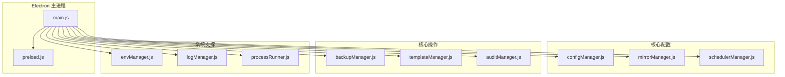
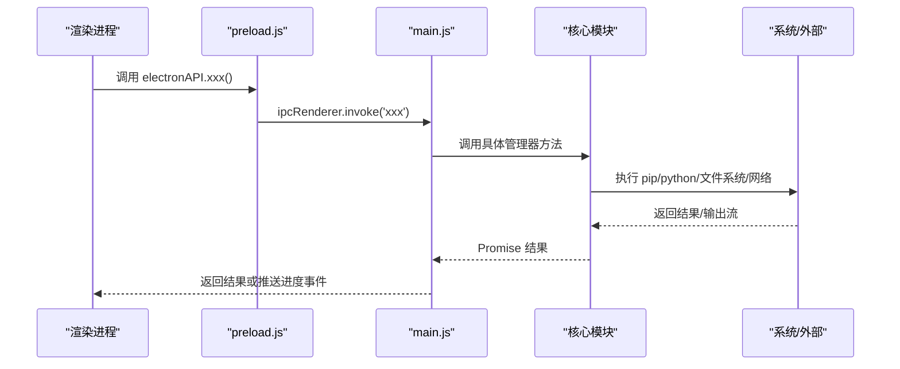
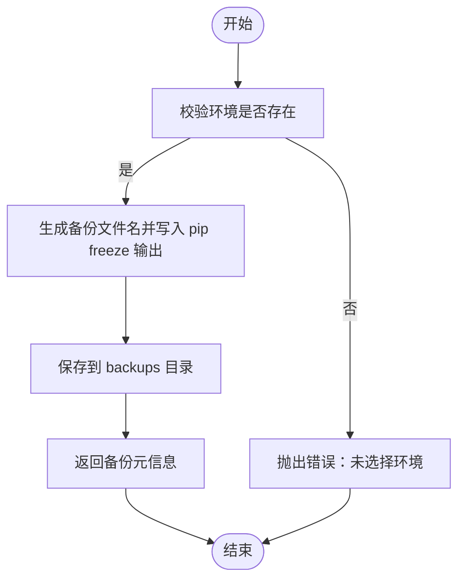
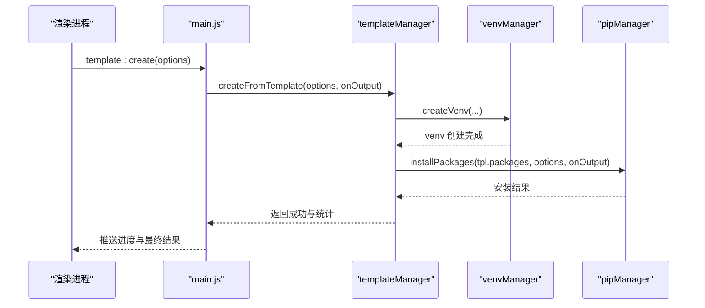
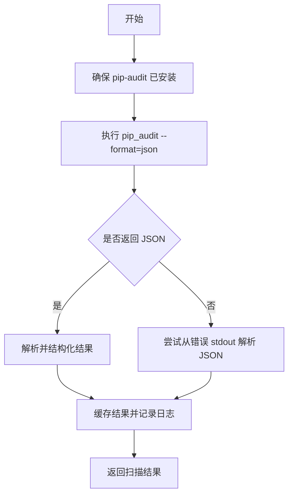
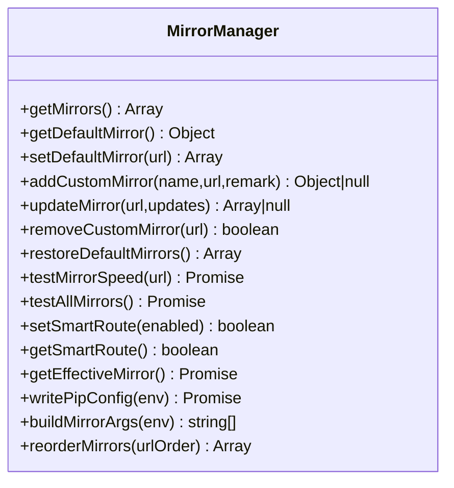
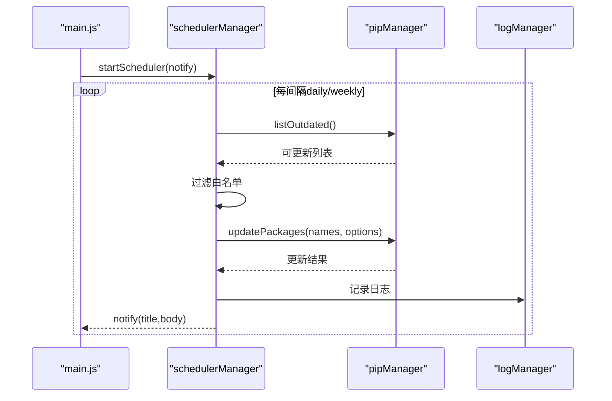
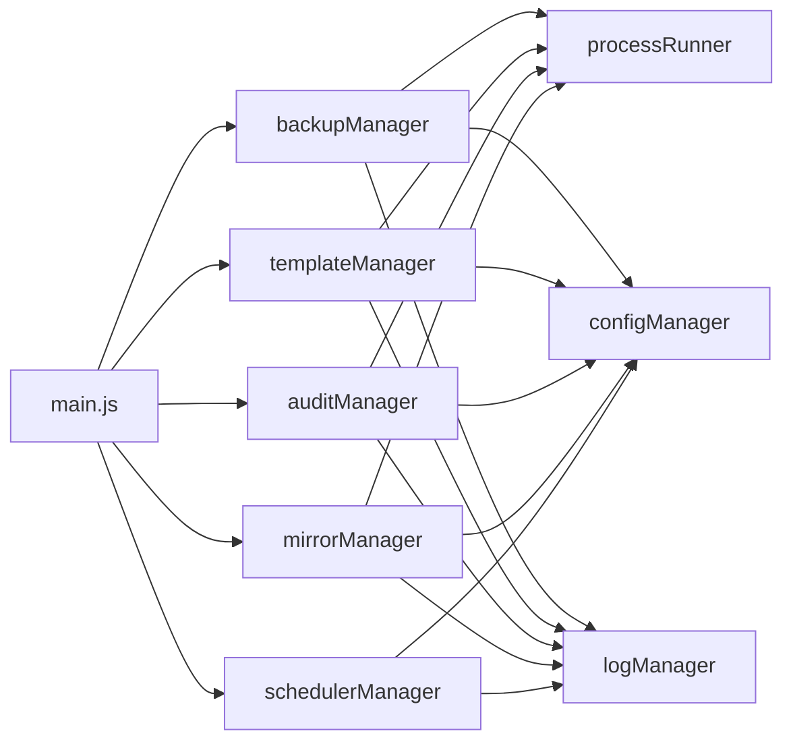

# 业务功能

<cite>
**本文引用的文件**   
- [main.js](file://main.js)
- [preload.js](file://preload.js)
- [package.json](file://package.json)
- [core/config/configManager.js](file://core/config/configManager.js)
- [core/config/mirrorManager.js](file://core/config/mirrorManager.js)
- [core/config/schedulerManager.js](file://core/config/schedulerManager.js)
- [core/operations/backupManager.js](file://core/operations/backupManager.js)
- [core/operations/templateManager.js](file://core/operations/templateManager.js)
- [core/operations/auditManager.js](file://core/operations/auditManager.js)
- [core/system/envManager.js](file://core/system/envManager.js)
- [core/system/logManager.js](file://core/system/logManager.js)
- [utils/processRunner.js](file://utils/processRunner.js)
</cite>

## 目录
1. [简介](#简介)
2. [项目结构](#项目结构)
3. [核心组件](#核心组件)
4. [架构总览](#架构总览)
5. [详细组件分析](#详细组件分析)
6. [依赖关系分析](#依赖关系分析)
7. [性能考量](#性能考量)
8. [故障排除指南](#故障排除指南)
9. [结论](#结论)
10. [附录：配置与参数参考](#附录配置与参数参考)

## 简介
本文件为 PyLibMaster 的业务功能综合文档，围绕以下五大模块展开：备份恢复（backupManager）、模板管理（templateManager）、安全审计（auditManager）、镜像源管理（mirrorManager）和调度器管理（schedulerManager）。文档覆盖使用场景、操作流程、技术实现、配置选项、参数说明、返回值格式、实际示例与最佳实践，并解释模块间的协作关系与数据流转。同时提供性能考虑、错误处理与故障排除建议，帮助读者从基础使用到高级配置全面掌握。

## 项目结构
PyLibMaster 基于 Electron 构建，主进程负责 IPC 路由与系统能力调用，渲染进程通过预加载脚本暴露的安全 API 与主进程通信。核心业务逻辑集中在 core 目录下，工具层在 utils 中。

图表来源
- [main.js:1-120](file://main.js#L1-L120)
- [preload.js:1-120](file://preload.js#L1-L120)
- [core/config/configManager.js:1-120](file://core/config/configManager.js#L1-L120)
- [core/config/mirrorManager.js:1-120](file://core/config/mirrorManager.js#L1-L120)
- [core/config/schedulerManager.js:1-80](file://core/config/schedulerManager.js#L1-L80)
- [core/operations/backupManager.js:1-80](file://core/operations/backupManager.js#L1-L80)
- [core/operations/templateManager.js:1-80](file://core/operations/templateManager.js#L1-L80)
- [core/operations/auditManager.js:1-80](file://core/operations/auditManager.js#L1-L80)
- [core/system/envManager.js:1-80](file://core/system/envManager.js#L1-L80)
- [core/system/logManager.js:1-80](file://core/system/logManager.js#L1-L80)
- [utils/processRunner.js:1-120](file://utils/processRunner.js#L1-L120)

章节来源
- [main.js:1-120](file://main.js#L1-L120)
- [package.json:1-40](file://package.json#L1-L40)

## 核心组件
- 备份恢复（backupManager）：创建 pip freeze 备份、列出/删除备份、按备份强制重装回滚，具备路径遍历防护与日志记录。
- 模板管理（templateManager）：内置多领域模板一键创建虚拟环境并批量安装包；支持自定义模板与环境快照的创建、列表、详情、恢复与删除。
- 安全审计（auditManager）：自动确保 pip-audit 可用，执行 JSON 格式扫描，解析漏洞与建议修复版本，结果缓存避免重复扫描。
- 镜像源管理（mirrorManager）：内置与自定义镜像源管理、测速、智能路由、写入 pip 配置文件、构建命令行参数、排序等。
- 调度器管理（schedulerManager）：定时检查可更新包并批量更新，支持白名单、频率（每日/每周）、状态持久化与通知回调。

章节来源
- [core/operations/backupManager.js:1-196](file://core/operations/backupManager.js#L1-L196)
- [core/operations/templateManager.js:1-320](file://core/operations/templateManager.js#L1-L320)
- [core/operations/auditManager.js:1-230](file://core/operations/auditManager.js#L1-L230)
- [core/config/mirrorManager.js:1-376](file://core/config/mirrorManager.js#L1-L376)
- [core/config/schedulerManager.js:1-197](file://core/config/schedulerManager.js#L1-L197)

## 架构总览
应用启动时，主进程初始化窗口、托盘、主题同步、自动更新检查，并启动 Python 环境检测与定时调度器。所有用户操作通过 preload.js 暴露的 window.electronAPI 调用主进程的 IPC 处理器，再由 main.js 转发至对应核心模块。

图表来源
- [preload.js:1-120](file://preload.js#L1-L120)
- [main.js:250-420](file://main.js#L250-L420)
- [utils/processRunner.js:80-160](file://utils/processRunner.js#L80-L160)

章节来源
- [main.js:120-220](file://main.js#L120-L220)
- [preload.js:120-200](file://preload.js#L120-L200)

## 详细组件分析

### 备份恢复（backupManager）
- 使用场景
  - 在升级或变更前对当前环境的包列表进行备份，便于快速回滚。
  - 在多台机器间迁移环境时，通过备份文件快速重建一致环境。
- 操作流程
  - 创建备份：调用 createBackup(env)，内部执行 pip freeze 生成文本文件，保存至 storage/backups。
  - 列出备份：listBackups 返回按时间倒序的备份元信息。
  - 恢复环境：restoreBackup(backupId, env, onOutput) 使用 --force-reinstall --no-deps 重装指定版本。
  - 删除备份：deleteBackup(backupId) 校验 ID 后删除文件。
- 关键参数与返回值
  - createBackup(env): 返回 { id, path, createdAt, envName, envPath }。
  - listBackups(): 返回数组 [{ id, path, createdAt, size }]。
  - restoreBackup(backupId, env, onOutput): 返回 pip install -r 的结果对象。
  - deleteBackup(backupId): 返回布尔值。
- 安全与健壮性
  - validateBackupId 正则限制 backup_*.txt，防止路径穿越。
  - 异常统一记录到 logManager。
- 最佳实践
  - 在执行破坏性操作前先创建备份。
  - 恢复失败时查看日志定位问题包或网络问题。

图表来源
- [core/operations/backupManager.js:80-113](file://core/operations/backupManager.js#L80-L113)

章节来源
- [core/operations/backupManager.js:1-196](file://core/operations/backupManager.js#L1-L196)

### 模板管理（templateManager）
- 使用场景
  - 快速搭建 Web、数据分析、机器学习、爬虫、自动化办公等常用环境。
  - 对环境进行“时间旅行”式快照，随时回滚到历史状态。
- 操作流程
  - 获取模板：getTemplates 合并内置与自定义模板。
  - 添加/删除自定义模板：addCustomTemplate / removeCustomTemplate。
  - 从模板创建环境：createFromTemplate(options, onOutput) 先创建 venv，再批量安装模板包。
  - 快照管理：createSnapshot(envPath, label)、listSnapshots、getSnapshotDetail、restoreSnapshot(snapshotId, envPath, onOutput)、deleteSnapshot。
- 关键参数与返回值
  - createFromTemplate({ templateId, venvName, pythonPath }, onOutput): 返回 { success, venvName, packageCount, result }。
  - createSnapshot(envPath, label): 返回 { id, fileName, envName, label, time, packageCount }。
  - restoreSnapshot(snapshotId, envPath, onOutput): 返回 { success, packageCount }。
- 最佳实践
  - 使用模板创建新环境，避免手动安装遗漏。
  - 每次重大变更前创建快照，便于回滚。
  - 自定义模板应精简包集合，减少安装耗时。

图表来源
- [core/operations/templateManager.js:118-154](file://core/operations/templateManager.js#L118-L154)
- [main.js:557-561](file://main.js#L557-L561)

章节来源
- [core/operations/templateManager.js:1-320](file://core/operations/templateManager.js#L1-L320)

### 安全审计（auditManager）
- 使用场景
  - 定期扫描已安装包是否存在已知 CVE 漏洞，给出修复建议。
- 操作流程
  - ensurePipAudit(pythonPath, onOutput) 自动安装 pip-audit 若缺失。
  - runAudit(onOutput) 执行 python -m pip_audit --format=json，解析结果并缓存。
  - parseAuditResult(data) 兼容新旧 JSON 格式，推断严重程度，汇总统计。
- 关键参数与返回值
  - runAudit(onOutput): 返回 { vulnerabilities[], summary{}, scanTime }。
  - getCachedResult(): 返回最近一次扫描结果（TTL 内有效）。
- 最佳实践
  - 将审计纳入发布前流程，优先修复 critical/high 级别漏洞。
  - 利用缓存减少频繁扫描开销。

图表来源
- [core/operations/auditManager.js:54-119](file://core/operations/auditManager.js#L54-L119)

章节来源
- [core/operations/auditManager.js:1-230](file://core/operations/auditManager.js#L1-L230)

### 镜像源管理（mirrorManager）
- 使用场景
  - 切换国内镜像提升下载速度，或启用智能路由自动选择最快镜像。
  - 将镜像配置写入 pip 全局配置文件，使 pip 命令生效。
- 操作流程
  - getMirrors/setDefaultMirror/addCustomMirror/updateMirror/removeCustomMirror/restoreDefaultMirrors。
  - testMirrorSpeed/testAllMirrors/pickBestMirror/getEffectiveMirror。
  - writePipConfig(env) 写入 pip.ini/pip.conf；buildMirrorArgs(env) 构建命令行参数。
- 关键参数与返回值
  - addCustomMirror(name, url, remark): 返回新增镜像对象或 null。
  - setDefaultMirror(url): 返回更新后的镜像列表。
  - testAllMirrors(): 返回带 speed 字段的镜像列表。
  - getEffectiveMirror(): 返回当前生效镜像（智能路由或默认）。
  - writePipConfig(env): 返回布尔值表示是否成功写入。
- 最佳实践
  - 在企业网络环境下优先使用企业镜像或代理。
  - 开启智能路由以动态适应网络波动。

图表来源
- [core/config/mirrorManager.js:109-376](file://core/config/mirrorManager.js#L109-L376)

章节来源
- [core/config/mirrorManager.js:1-376](file://core/config/mirrorManager.js#L1-L376)

### 调度器管理（schedulerManager）
- 使用场景
  - 后台定时检查可更新包并批量更新，减少人工维护成本。
  - 通过白名单控制不自动更新的包，保证稳定性。
- 操作流程
  - getSchedulerConfig/saveSchedulerConfig 读取与保存配置（enabled/frequency/whitelist/lastRun）。
  - startScheduler(notify) 根据频率设置定时器，必要时立即执行一次。
  - runAutoUpdate(notify) 获取 outdated，过滤白名单，批量 updatePackages，写日志与通知。
- 关键参数与返回值
  - getStatus(): 返回 { enabled,frequency,whitelist,lastRun,active,running }。
  - runAutoUpdate(notify): 返回 { updated,failed,skipped,total } 或 { error }。
- 最佳实践
  - 生产环境建议使用 weekly 模式，降低频繁更新风险。
  - 将关键包加入白名单，避免自动更新导致不稳定。

图表来源
- [core/config/schedulerManager.js:145-163](file://core/config/schedulerManager.js#L145-L163)
- [core/config/schedulerManager.js:70-138](file://core/config/schedulerManager.js#L70-L138)

章节来源
- [core/config/schedulerManager.js:1-197](file://core/config/schedulerManager.js#L1-L197)

## 依赖关系分析
- 主进程（main.js）集中注册 IPC 处理器，将前端请求路由到各管理器。
- 各管理器依赖 configManager 读写配置，依赖 logManager 记录操作日志，依赖 processRunner 执行子进程（pip/python）。
- 模板管理与备份恢复均依赖 pipManager 执行包操作；安全审计依赖 auditManager 与 processRunner。
- 镜像源管理独立于包操作，但会写入 pip 配置文件影响后续 pip 行为。

图表来源
- [main.js:350-580](file://main.js#L350-L580)
- [core/config/configManager.js:1-120](file://core/config/configManager.js#L1-L120)
- [core/system/logManager.js:1-120](file://core/system/logManager.js#L1-L120)
- [utils/processRunner.js:1-120](file://utils/processRunner.js#L1-L120)

章节来源
- [main.js:350-580](file://main.js#L350-L580)

## 性能考量
- 进程与超时
  - processRunner 对子进程设置超时与两级终止（SIGTERM/SIGKILL），避免长时间阻塞。
  - pip 就绪状态缓存（PIP_READY_TTL=5分钟）减少重复检测。
- 缓存策略
  - 已安装包列表缓存（5分钟有效期）与 site-packages 路径缓存（30秒）加速查询。
  - 安全审计结果缓存（10分钟 TTL）避免频繁扫描。
- 并发与互斥
  - pipManager 对同一环境加锁，避免并发冲突。
  - 模板安装支持并行安装与重试，提高吞吐。
- I/O 优化
  - 日志写入采用防抖（300ms）减少频繁磁盘写入。
  - 配置保存采用原子写入（临时文件+重命名）避免损坏。

[本节为通用指导，不直接分析具体文件]

## 故障排除指南
- 备份/恢复失败
  - 检查备份 ID 是否符合 backup_*.txt 格式，确认文件存在且未被篡改。
  - 查看 logManager 中的系统日志，定位 pip 错误或权限问题。
- 模板创建失败
  - 确认 venv 创建成功，检查 pip 是否可用（ensurePip 流程）。
  - 观察 onOutput 输出，定位网络或包依赖问题。
- 安全审计无结果
  - 确认 pip-audit 已安装，如未安装则自动安装失败需手动安装。
  - 检查缓存是否过期，必要时清除缓存重新扫描。
- 镜像源不可用
  - 使用 testAllMirrors 测速，选择响应时间最短的镜像。
  - 检查 writePipConfig 是否成功写入 pip 配置文件。
- 调度器未执行
  - 检查 schedulerEnabled 配置与 lastRun 时间戳。
  - 确认频率设置与系统时间正确，查看日志是否有错误。

章节来源
- [core/operations/backupManager.js:120-196](file://core/operations/backupManager.js#L120-L196)
- [core/operations/templateManager.js:250-320](file://core/operations/templateManager.js#L250-L320)
- [core/operations/auditManager.js:120-230](file://core/operations/auditManager.js#L120-L230)
- [core/config/mirrorManager.js:219-322](file://core/config/mirrorManager.js#L219-L322)
- [core/config/schedulerManager.js:145-197](file://core/config/schedulerManager.js#L145-L197)
- [core/system/logManager.js:100-173](file://core/system/logManager.js#L100-L173)

## 结论
PyLibMaster 通过清晰的模块化设计与稳健的底层支撑（进程管理、配置持久化、日志记录），实现了备份恢复、模板管理、安全审计、镜像源管理与调度器管理等核心业务功能。各模块职责明确、耦合度低，配合 IPC 桥接与事件驱动，提供了从基础使用到高级配置的完整能力体系。遵循本文的最佳实践与故障排除建议，可有效提升开发效率与系统稳定性。

[本节为总结，不直接分析具体文件]

## 附录：配置与参数参考
- 配置项（configManager）
  - theme/language/storagePath/parallelThreads/retryCount/smartRoute/currentEnv/windowBounds。
  - 数值项范围校验与默认值修正。
- 镜像源（mirrorManager）
  - 内置源：PyPI 官方、清华大学、阿里云、腾讯云、华为云、豆瓣。
  - 智能路由开关与生效镜像选择。
  - 写入 pip 配置文件路径（Windows: %APPDATA%/pip/pip.ini；macOS/Linux: ~/.config/pip/pip.conf）。
- 调度器（schedulerManager）
  - enabled/frequency（daily/weekly）/whitelist/lastRun。
  - 状态 active/running 与上次执行时间。
- 备份（backupManager）
  - 存储位置：storage/backups。
  - 文件格式：backup_{环境名}_{ISO时间戳}.txt。
- 模板（templateManager）
  - 内置模板：Web(Flask/Django)、数据分析、机器学习、爬虫、自动化办公。
  - 快照存储位置：storage/snapshots。
- 审计（auditManager）
  - 依赖 pip-audit，JSON 输出格式兼容新旧版本。
  - 严重级别推断规则与修复版本提取。

章节来源
- [core/config/configManager.js:80-194](file://core/config/configManager.js#L80-L194)
- [core/config/mirrorManager.js:21-108](file://core/config/mirrorManager.js#L21-L108)
- [core/config/schedulerManager.js:29-59](file://core/config/schedulerManager.js#L29-L59)
- [core/operations/backupManager.js:25-51](file://core/operations/backupManager.js#L25-L51)
- [core/operations/templateManager.js:23-66](file://core/operations/templateManager.js#L23-L66)
- [core/operations/auditManager.js:126-187](file://core/operations/auditManager.js#L126-L187)