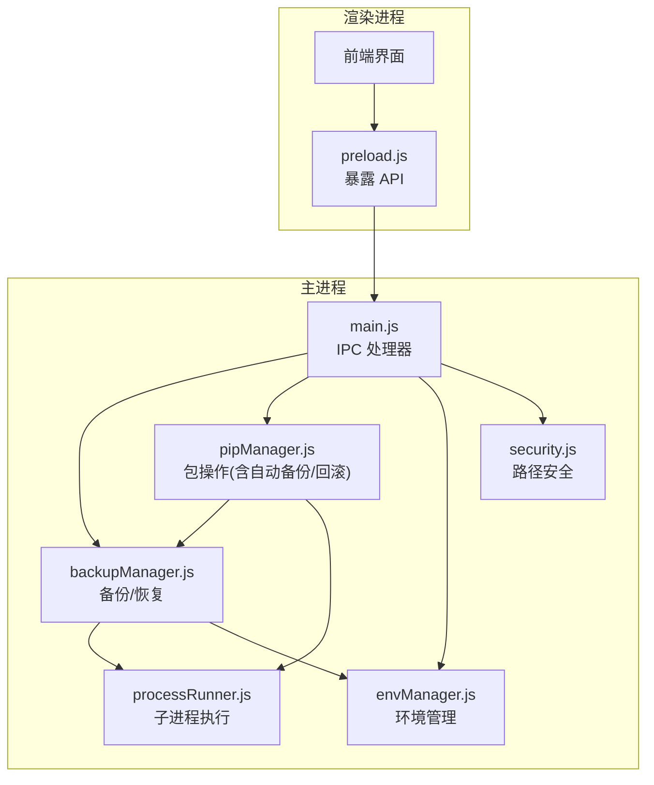
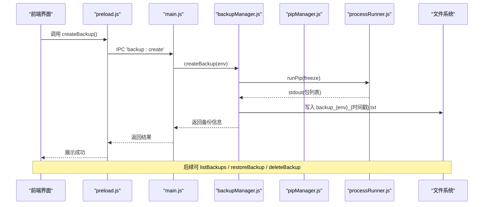
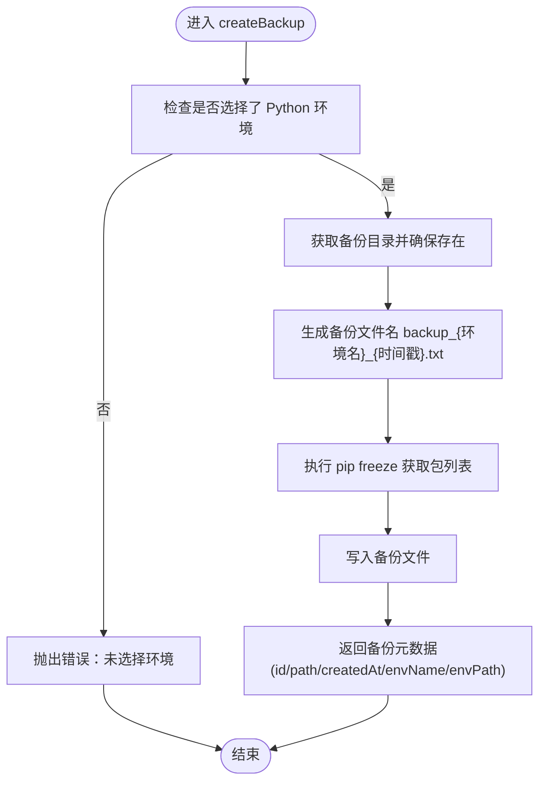
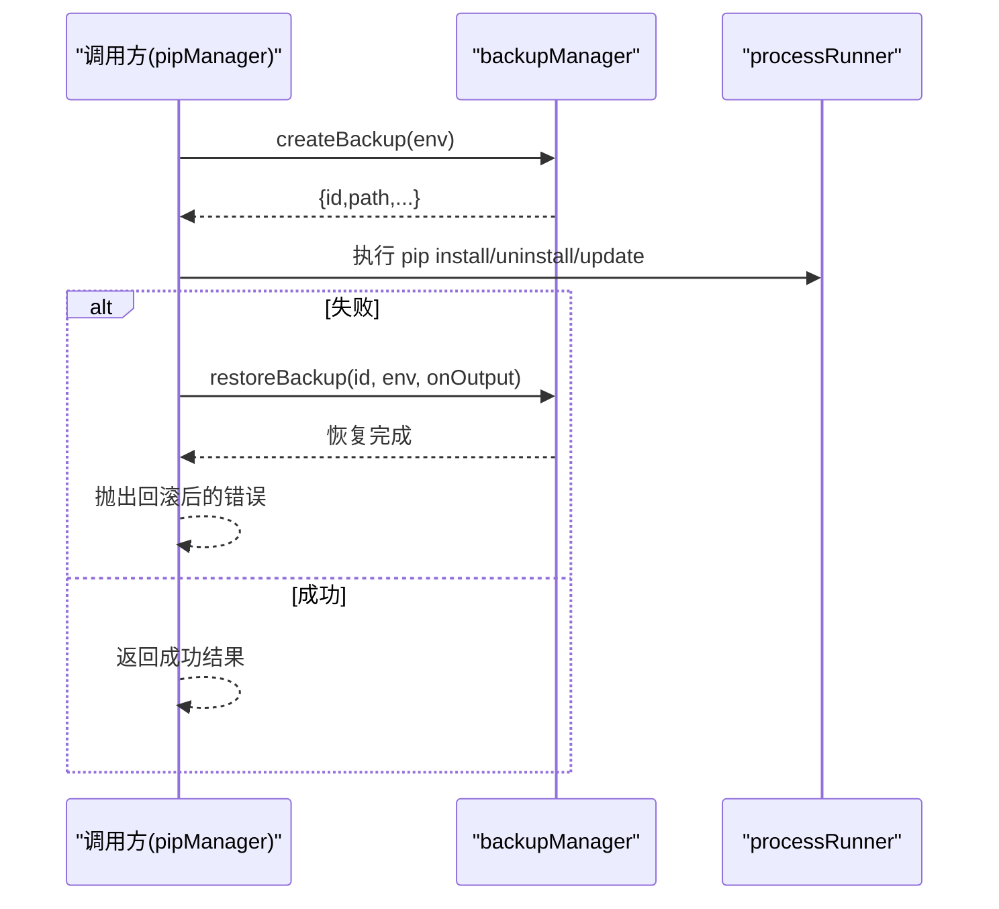
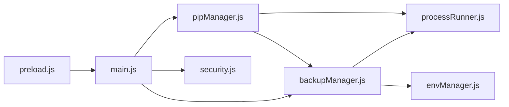

# 备份恢复管理

<cite>
**本文引用的文件**   
- [backupManager.js](file://core/operations/backupManager.js)
- [pipManager.js](file://core/operations/pipManager.js)
- [processRunner.js](file://utils/processRunner.js)
- [envManager.js](file://core/system/envManager.js)
- [security.js](file://utils/security.js)
- [main.js](file://main.js)
- [preload.js](file://preload.js)
</cite>

## 目录
1. [简介](#简介)
2. [项目结构](#项目结构)
3. [核心组件](#核心组件)
4. [架构总览](#架构总览)
5. [详细组件分析](#详细组件分析)
6. [依赖关系分析](#依赖关系分析)
7. [性能考量](#性能考量)
8. [故障排除指南](#故障排除指南)
9. [结论](#结论)
10. [附录：API 参考与使用示例](#附录api-参考与使用示例)

## 简介
本文件系统性阐述 PyLibMaster 的“备份与恢复”能力，重点围绕 core/operations/backupManager.js 的实现原理与使用方式。内容涵盖：
- 基于 pip freeze 的 Python 环境包列表备份
- 备份文件的命名规范、存储位置与生命周期管理
- 从备份恢复环境的机制（强制重装指定版本）
- 备份 ID 安全校验（防路径遍历攻击）
- 错误处理与日志记录
- 完整 API 接口说明（createBackup、listBackups、restoreBackup、deleteBackup）
- 从创建到恢复的端到端工作流程
- 性能优化建议、故障排除与最佳实践

## 项目结构
与备份恢复功能直接相关的代码分布在以下模块：
- 业务逻辑层：core/operations/backupManager.js（备份/恢复核心）
- 调用方集成：core/operations/pipManager.js（在包安装/卸载/更新时自动备份与回滚）
- 进程执行：utils/processRunner.js（封装 pip/Python 子进程运行、超时、取消）
- 环境管理：core/system/envManager.js（当前 Python 环境选择）
- 安全工具：utils/security.js（路径白名单校验，用于系统级打开路径等）
- IPC 桥接：main.js（主进程 IPC 处理器）、preload.js（渲染进程暴露 API）

**图表来源**
- [main.js:350-369](file://main.js#L350-L369)
- [preload.js:66-72](file://preload.js#L66-L72)
- [backupManager.js:1-196](file://core/operations/backupManager.js#L1-L196)
- [pipManager.js:495-578](file://core/operations/pipManager.js#L495-L578)
- [processRunner.js:340-342](file://utils/processRunner.js#L340-L342)
- [envManager.js:178-209](file://core/system/envManager.js#L178-L209)
- [security.js:28-40](file://utils/security.js#L28-L40)

**章节来源**
- [backupManager.js:1-196](file://core/operations/backupManager.js#L1-L196)
- [pipManager.js:495-578](file://core/operations/pipManager.js#L495-L578)
- [processRunner.js:340-342](file://utils/processRunner.js#L340-L342)
- [envManager.js:178-209](file://core/system/envManager.js#L178-L209)
- [security.js:28-40](file://utils/security.js#L28-L40)
- [main.js:350-369](file://main.js#L350-L369)
- [preload.js:66-72](file://preload.js#L66-L72)

## 核心组件
- backupManager.js：提供 createBackup、listBackups、restoreBackup、deleteBackup、validateBackupId 五大能力；负责备份文件生成、存储、恢复与删除；内置备份 ID 安全校验。
- pipManager.js：在批量安装、卸载、更新等操作中，根据配置启用“自动备份+失败回滚”，调用 backupManager 完成备份与恢复。
- processRunner.js：统一封装 pip/Python 命令执行，支持超时、取消、实时输出回调、ANSI 清理、UTF-8 编码保障。
- envManager.js：检测并维护当前 Python 环境，为备份/恢复提供目标环境路径。
- security.js：提供 isAllowedOpenPath，用于系统级打开路径时的白名单校验（与备份 ID 校验互补）。

**章节来源**
- [backupManager.js:1-196](file://core/operations/backupManager.js#L1-L196)
- [pipManager.js:495-578](file://core/operations/pipManager.js#L495-L578)
- [processRunner.js:85-161](file://utils/processRunner.js#L85-L161)
- [envManager.js:85-170](file://core/system/envManager.js#L85-L170)
- [security.js:28-40](file://utils/security.js#L28-L40)

## 架构总览
备份恢复的整体交互流程如下：
- 渲染进程通过 preload.js 暴露的 API 调用主进程的 IPC 处理器（main.js）。
- main.js 将请求转发至 backupManager.js 或 pipManager.js。
- backupManager.js 通过 processRunner.js 执行 pip freeze/install -r 等命令，读写备份文件。
- pipManager.js 在关键操作前调用 backupManager.createBackup，失败时调用 restoreBackup 进行回滚。

**图表来源**
- [preload.js:68-71](file://preload.js#L68-L71)
- [main.js:358-368](file://main.js#L358-L368)
- [backupManager.js:89-113](file://core/operations/backupManager.js#L89-L113)
- [processRunner.js:340-342](file://utils/processRunner.js#L340-L342)

## 详细组件分析

### 备份管理器（backupManager.js）
- 备份目录与文件命名
  - 目录：{storagePath}/backups/，不存在则自动创建
  - 文件名：backup_{环境名}_{ISO时间戳}.txt，时间戳去除冒号与点，保留秒精度
- 备份 ID 安全校验
  - 仅允许以 backup_ 开头、.txt 结尾的文件名
  - 禁止包含 /、\、.. 等路径穿越字符
  - 限制最大长度（255），并通过 path.basename 二次净化
- 创建备份（createBackup）
  - 校验当前环境是否存在
  - 执行 pip freeze 获取已安装包及版本
  - 写入备份文件，返回 id、path、createdAt、envName、envPath
- 列出备份（listBackups）
  - 读取 backups 目录，过滤符合命名规则的 .txt 文件
  - 按修改时间倒序返回 id、path、createdAt、size
- 恢复备份（restoreBackup）
  - 校验备份 ID，定位备份文件
  - 使用 pip install -r <备份文件> --force-reinstall --no-deps --no-warn-script-location 强制重装指定版本
  - 支持 onOutput 实时输出回调
- 删除备份（deleteBackup）
  - 校验备份 ID，存在则删除并返回 true，否则 false
  - 异常时记录日志并抛出错误

**图表来源**
- [backupManager.js:89-113](file://core/operations/backupManager.js#L89-L113)

**章节来源**
- [backupManager.js:29-34](file://core/operations/backupManager.js#L29-L34)
- [backupManager.js:46-51](file://core/operations/backupManager.js#L46-L51)
- [backupManager.js:62-78](file://core/operations/backupManager.js#L62-L78)
- [backupManager.js:89-113](file://core/operations/backupManager.js#L89-L113)
- [backupManager.js:122-142](file://core/operations/backupManager.js#L122-L142)
- [backupManager.js:156-170](file://core/operations/backupManager.js#L156-L170)
- [backupManager.js:179-193](file://core/operations/backupManager.js#L179-L193)

### pip 管理器中的自动备份与回滚（pipManager.js）
- 在批量安装、卸载、更新操作中，若开启 rollback（默认开启），则在操作前调用 backupManager.createBackup 创建快照
- 若操作失败，则调用 backupManager.restoreBackup 恢复到备份状态，确保环境一致性
- 支持并行安装、多镜像源重试、进度事件推送、操作互斥锁（同一环境串行）

**图表来源**
- [pipManager.js:495-578](file://core/operations/pipManager.js#L495-L578)
- [pipManager.js:627-712](file://core/operations/pipManager.js#L627-L712)
- [pipManager.js:727-771](file://core/operations/pipManager.js#L727-L771)

**章节来源**
- [pipManager.js:495-578](file://core/operations/pipManager.js#L495-L578)
- [pipManager.js:627-712](file://core/operations/pipManager.js#L627-L712)
- [pipManager.js:727-771](file://core/operations/pipManager.js#L727-L771)

### 进程执行器（processRunner.js）
- 统一封装子进程执行，支持：
  - UTF-8 编码设置（PYTHONIOENCODING/PYTHONUTF8）
  - 实时输出回调（stdout/stderr，ANSI 清理）
  - 超时控制（SIGTERM + SIGKILL 两级终止）
  - 活跃进程跟踪与按 operationId 取消
  - ensurePip 自动安装 pip（ensurepip 或 get-pip.py 下载）
- 提供 runPip/runPython 快捷方法

**章节来源**
- [processRunner.js:85-161](file://utils/processRunner.js#L85-L161)
- [processRunner.js:233-278](file://utils/processRunner.js#L233-L278)
- [processRunner.js:340-342](file://utils/processRunner.js#L340-L342)

### 环境管理（envManager.js）
- 检测系统中可用的 Python 环境（常见路径、PATH、Conda/Anaconda）
- 维护当前选中环境，支持切换与持久化
- 为备份/恢复提供目标环境路径

**章节来源**
- [envManager.js:85-170](file://core/system/envManager.js#L85-L170)
- [envManager.js:178-209](file://core/system/envManager.js#L178-L209)

### 安全工具（security.js）
- isAllowedOpenPath：对目标路径进行白名单校验，防止路径穿越
- 与备份 ID 校验共同构成“输入安全”防线

**章节来源**
- [security.js:28-40](file://utils/security.js#L28-L40)

## 依赖关系分析
- backupManager.js 依赖：
  - configManager（获取 storagePath）
  - logManager（记录错误日志）
  - processRunner.runPip（执行 pip freeze/install）
  - fs/path（文件与路径操作）
- pipManager.js 依赖：
  - backupManager（自动备份与回滚）
  - processRunner（执行 pip 命令）
  - envManager（获取当前环境）
  - mirrorManager（镜像源重试）
- main.js 作为 IPC 中枢，将渲染进程请求路由到对应模块
- preload.js 暴露 API 给渲染进程

**图表来源**
- [preload.js:66-72](file://preload.js#L66-L72)
- [main.js:350-369](file://main.js#L350-L369)
- [backupManager.js:19-24](file://core/operations/backupManager.js#L19-L24)
- [pipManager.js:20-28](file://core/operations/pipManager.js#L20-L28)

**章节来源**
- [backupManager.js:19-24](file://core/operations/backupManager.js#L19-L24)
- [pipManager.js:20-28](file://core/operations/pipManager.js#L20-L28)
- [main.js:350-369](file://main.js#L350-L369)
- [preload.js:66-72](file://preload.js#L66-L72)

## 性能考量
- 备份文件 I/O
  - 备份文件较小（文本格式），写入开销低；建议在批量操作前集中创建一次备份，避免重复 I/O
- 子进程执行
  - pip freeze/install 耗时受网络与包数量影响；processRunner 已实现超时与取消，合理设置 timeout 避免阻塞
- 缓存策略
  - pipManager 对 site-packages 扫描与 pip 就绪状态有缓存，减少重复计算
- 并发与互斥
  - 同一环境内操作加互斥锁，避免并发冲突；必要时降低并行度以减少资源竞争

[本节为通用指导，不直接分析具体文件]

## 故障排除指南
- 未选择 Python 环境
  - 现象：createBackup/restoreBackup 抛出“未选择环境”错误
  - 解决：先通过 envManager 切换或检测环境
- 备份 ID 非法
  - 现象：validateBackupId 抛出“路径遍历检测/格式不匹配/长度超限”错误
  - 解决：确保传入的是纯文件名（不含路径分隔符与 ..），且符合 backup_*.txt 规则
- 备份文件不存在
  - 现象：restoreBackup 抛出“备份不存在”错误
  - 解决：通过 listBackups 确认备份存在，再传入正确的 id
- pip 不可用或未安装
  - 现象：runPip/ensurePip 失败
  - 解决：等待 ensurePip 自动安装；如失败，手动安装 pip 后重试
- 网络问题导致安装失败
  - 现象：pip install 超时或连接失败
  - 解决：启用多镜像源重试；调整 timeout；检查网络与代理设置
- 权限不足
  - 现象：写入备份文件或执行 pip 失败
  - 解决：以管理员权限运行应用；检查 storagePath 目录权限

**章节来源**
- [backupManager.js:62-78](file://core/operations/backupManager.js#L62-L78)
- [backupManager.js:156-170](file://core/operations/backupManager.js#L156-L170)
- [processRunner.js:233-278](file://utils/processRunner.js#L233-L278)

## 结论
PyLibMaster 的备份恢复体系以 backupManager.js 为核心，结合 pipManager.js 的自动备份与回滚机制，提供了稳定可靠的 Python 环境管理能力。通过严格的备份 ID 校验与安全的子进程执行框架，系统在易用性与安全性之间取得良好平衡。配合合理的超时、重试与缓存策略，可在复杂环境下保持高可用与高性能。

[本节为总结性内容，不直接分析具体文件]

## 附录：API 参考与使用示例

### IPC 接口（渲染进程 → 主进程）
- createBackup
  - 参数：无（内部使用当前环境）
  - 返回：{ id, path, createdAt, envName, envPath }
  - 用途：创建当前环境的包列表备份
- listBackups
  - 参数：无
  - 返回：Array<{ id, path, createdAt, size }>，按创建时间倒序
  - 用途：列出所有备份文件
- restoreBackup
  - 参数：backupId（string）
  - 返回：Promise（pip install -r 的结果）
  - 用途：从备份恢复环境（强制重装指定版本）
- deleteBackup
  - 参数：backupId（string）
  - 返回：boolean（是否成功删除）
  - 用途：删除指定备份文件

**章节来源**
- [preload.js:68-71](file://preload.js#L68-L71)
- [main.js:358-368](file://main.js#L358-L368)

### 模块内部 API（Node.js 调用）
- createBackup(env)
  - 参数：env（Python 环境对象，含 path/name）
  - 返回：Promise<{ id, path, createdAt, envName, envPath }>
  - 行为：执行 pip freeze，写入备份文件
- listBackups()
  - 返回：Array<{ id, path, createdAt, size }>
  - 行为：读取 backups 目录，过滤并排序
- restoreBackup(backupId, env, onOutput?)
  - 参数：backupId（string）、env（Python 环境对象）、onOutput（可选回调）
  - 返回：Promise（pip install -r 的结果）
  - 行为：校验备份 ID，执行强制重装
- deleteBackup(backupId)
  - 参数：backupId（string）
  - 返回：boolean
  - 行为：校验备份 ID，删除文件
- validateBackupId(backupId)
  - 参数：backupId（string）
  - 返回：string（安全文件名）
  - 行为：正则与安全检查，防止路径穿越

**章节来源**
- [backupManager.js:89-113](file://core/operations/backupManager.js#L89-L113)
- [backupManager.js:122-142](file://core/operations/backupManager.js#L122-L142)
- [backupManager.js:156-170](file://core/operations/backupManager.js#L156-L170)
- [backupManager.js:179-193](file://core/operations/backupManager.js#L179-L193)
- [backupManager.js:62-78](file://core/operations/backupManager.js#L62-L78)

### 使用示例（概念性步骤）
- 创建备份
  - 调用 createBackup()，成功后保存返回的 id 与 path
- 列出备份
  - 调用 listBackups()，展示 id 与 createdAt，供用户选择
- 恢复环境
  - 调用 restoreBackup(selectedId)，监听 onOutput 显示进度
- 删除备份
  - 调用 deleteBackup(id)，释放磁盘空间

[本节为概念性示例，不直接分析具体文件]