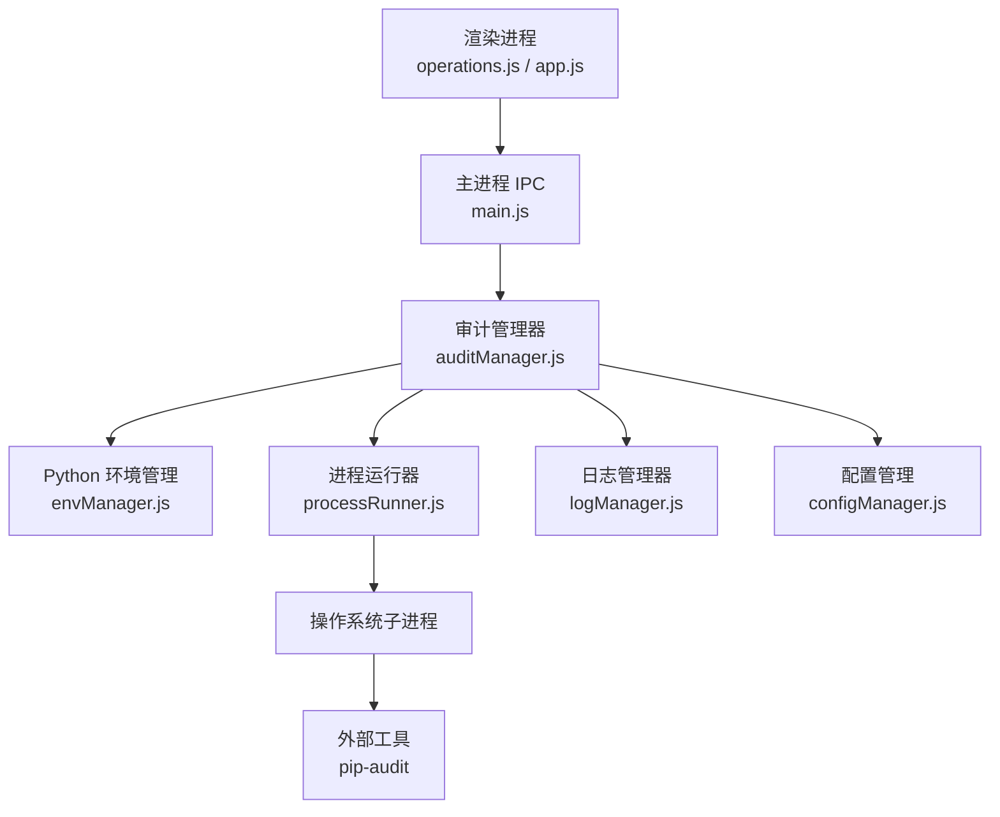
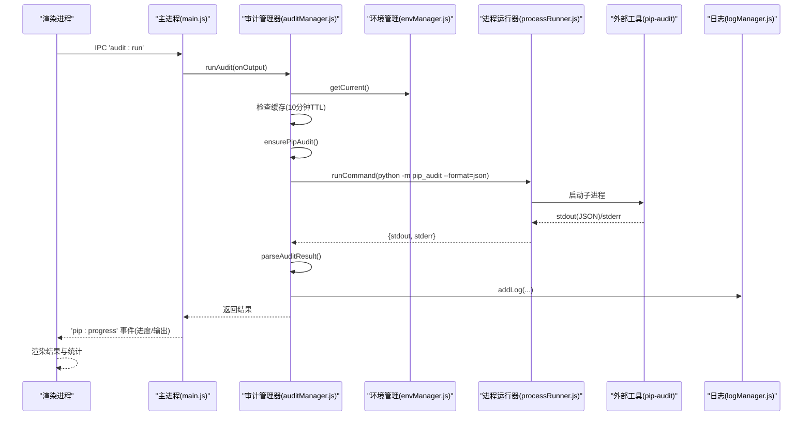
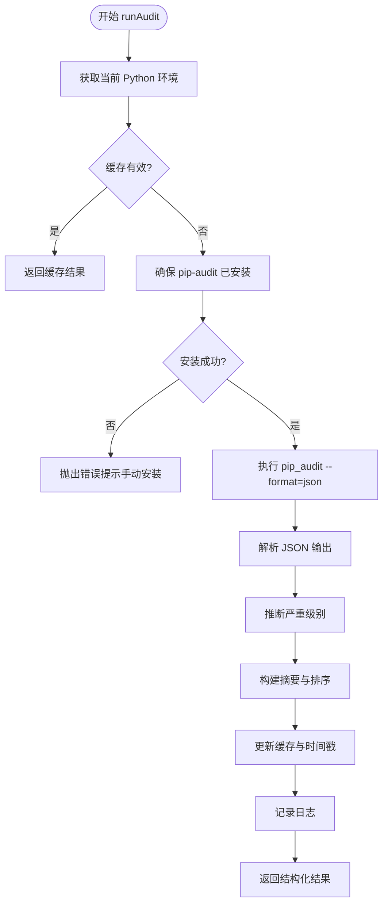
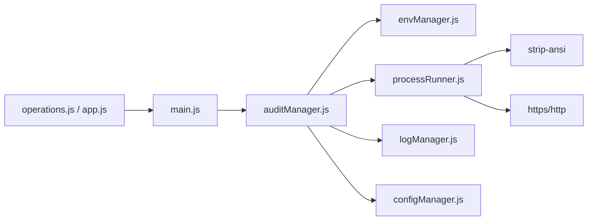

# 安全审计

<cite>
**本文引用的文件**   
- [auditManager.js](file://core/operations/auditManager.js)
- [processRunner.js](file://utils/processRunner.js)
- [envManager.js](file://core/system/envManager.js)
- [logManager.js](file://core/system/logManager.js)
- [configManager.js](file://core/config/configManager.js)
- [security.js](file://utils/security.js)
- [main.js](file://main.js)
- [operations.js](file://renderer/js/operations.js)
- [app.js](file://renderer/js/app.js)
- [package.json](file://package.json)
</cite>

## 目录
1. [简介](#简介)
2. [项目结构](#项目结构)
3. [核心组件](#核心组件)
4. [架构总览](#架构总览)
5. [详细组件分析](#详细组件分析)
6. [依赖关系分析](#依赖关系分析)
7. [性能考量](#性能考量)
8. [故障排除指南](#故障排除指南)
9. [结论](#结论)
10. [附录](#附录)

## 简介
本文件系统化阐述 PyLibMaster 的安全审计能力，聚焦 auditManager.js 模块的漏洞扫描机制、结果解析与缓存策略、以及与外部工具（pip-audit）的集成方式。文档覆盖从触发扫描到结果展示的完整流程，包含审计结果格式定义、严重级别分类、修复建议生成、配置选项与报告导出思路，并提供使用示例、性能调优与排障建议，帮助读者从基础扫描到高级配置管理全面掌握该功能。

## 项目结构
围绕安全审计的关键代码分布在以下位置：
- 核心逻辑：core/operations/auditManager.js
- 进程与 pip 执行：utils/processRunner.js
- Python 环境选择：core/system/envManager.js
- 日志记录：core/system/logManager.js
- 应用配置：core/config/configManager.js
- 路径安全校验：utils/security.js
- IPC 桥接（主进程）：main.js
- 前端交互与刷新：renderer/js/operations.js、renderer/js/app.js
- 依赖声明：package.json

图表来源 
- [main.js:578-586](file://main.js#L578-L586)
- [auditManager.js:54-119](file://core/operations/auditManager.js#L54-L119)
- [processRunner.js:85-161](file://utils/processRunner.js#L85-L161)
- [envManager.js:178-184](file://core/system/envManager.js#L178-L184)
- [logManager.js:112-131](file://core/system/logManager.js#L112-L131)
- [configManager.js:144-162](file://core/config/configManager.js#L144-L162)

章节来源
- [auditManager.js:1-230](file://core/operations/auditManager.js#L1-L230)
- [processRunner.js:1-366](file://utils/processRunner.js#L1-L366)
- [envManager.js:1-220](file://core/system/envManager.js#L1-L220)
- [logManager.js:1-173](file://core/system/logManager.js#L1-L173)
- [configManager.js:1-194](file://core/config/configManager.js#L1-L194)
- [security.js:1-43](file://utils/security.js#L1-L43)
- [main.js:578-586](file://main.js#L578-L586)
- [operations.js:416-438](file://renderer/js/operations.js#L416-L438)
- [app.js:128-200](file://renderer/js/app.js#L128-L200)
- [package.json:20-24](file://package.json#L20-L24)

## 核心组件
- 审计管理器（auditManager.js）
  - 职责：确保 pip-audit 可用、执行扫描、解析 JSON 输出、推断严重级别、生成修复建议、维护内存缓存、写入日志。
  - 关键函数：ensurePipAudit、runAudit、parseAuditResult、guessSeverity、getCachedResult、clearCache。
- 进程运行器（processRunner.js）
  - 职责：统一封装子进程创建、超时控制、实时输出回调、ANSI 清理、按 operationId 取消、pip 自动安装等。
  - 关键函数：runCommand、runPip、ensurePip、cancelOperation、cancelAllProcesses。
- Python 环境管理（envManager.js）
  - 职责：检测系统 Python 环境、获取版本信息、切换并持久化当前环境。
  - 关键函数：detectEnvironments、getCurrent、switchEnvironment。
- 日志管理器（logManager.js）
  - 职责：操作日志持久化、防抖写入、字段截断保护、查询与清空。
  - 关键函数：addLog、getLogs、clearLogs、flushLogs。
- 配置管理（configManager.js）
  - 职责：应用配置读写、范围校验与修正、存储路径管理。
  - 关键函数：getConfig、setConfig、setBulk、getStoragePath。
- 路径安全（security.js）
  - 职责：防止路径遍历攻击，限制可访问目录。
  - 关键函数：isAllowedOpenPath。

章节来源
- [auditManager.js:25-119](file://core/operations/auditManager.js#L25-L119)
- [processRunner.js:85-161](file://utils/processRunner.js#L85-L161)
- [envManager.js:178-184](file://core/system/envManager.js#L178-L184)
- [logManager.js:112-131](file://core/system/logManager.js#L112-L131)
- [configManager.js:144-162](file://core/config/configManager.js#L144-L162)
- [security.js:28-40](file://utils/security.js#L28-L40)

## 架构总览
安全审计的整体调用链如下：
- 渲染进程通过 IPC 调用 main.js 的 'audit:run' 处理器。
- main.js 转发至 auditManager.runAudit，传入 onOutput 回调以推送进度。
- runAudit 先检查缓存，再确保 pip-audit 已安装，随后通过 processRunner 执行 python -m pip_audit --format=json。
- 解析 JSON 输出为结构化结果，更新缓存并记录日志。
- 渲染进程监听 'pip:progress' 事件，将进度与结果展示在界面。

图表来源 
- [main.js:578-586](file://main.js#L578-L586)
- [auditManager.js:54-119](file://core/operations/auditManager.js#L54-L119)
- [processRunner.js:85-161](file://utils/processRunner.js#L85-L161)
- [envManager.js:178-184](file://core/system/envManager.js#L178-L184)
- [logManager.js:112-131](file://core/system/logManager.js#L112-L131)

## 详细组件分析

### 审计管理器（auditManager.js）
- 扫描触发与缓存
  - runAudit 优先读取内存缓存（SCAN_CACHE_TTL=10 分钟），命中则直接返回。
  - 未命中则继续后续步骤。
- 依赖准备
  - ensurePipAudit 通过 runPip('show', 'pip-audit') 检测是否已安装；若缺失则自动安装（带 onOutput 反馈）。
- 执行扫描
  - 使用 runCommand 执行 python -m pip_audit --format=json，禁用进度条以提升解析稳定性。
  - 捕获非零退出码但含 JSON 的情况，仍尝试解析。
- 结果解析
  - parseAuditResult 兼容新旧两种 JSON 格式，提取漏洞列表、受影响包集合、修复版本、链接与别名。
  - guessSeverity 基于 severity 字段或描述关键词推断严重级别（critical/high/medium/low/unknown）。
  - 结果按严重程度排序，生成 summary（总数、影响包数、各等级计数、可修复数量）与 scanTime。
- 日志与缓存
  - 成功时写入日志（状态 ok/failed 取决于是否存在漏洞），并更新 lastScanResult 与 lastScanTime。
  - 提供 getCachedResult/clearCache 供上层使用。

图表来源 
- [auditManager.js:54-119](file://core/operations/auditManager.js#L54-L119)
- [auditManager.js:126-187](file://core/operations/auditManager.js#L126-L187)
- [auditManager.js:194-203](file://core/operations/auditManager.js#L194-L203)

章节来源
- [auditManager.js:25-119](file://core/operations/auditManager.js#L25-L119)
- [auditManager.js:126-187](file://core/operations/auditManager.js#L126-L187)
- [auditManager.js:194-203](file://core/operations/auditManager.js#L194-L203)

### 进程运行器（processRunner.js）
- 子进程执行
  - runCommand 统一处理 spawn、UTF-8 编码、ANSI 清理、实时 onOutput 回调、超时与两级终止（SIGTERM + SIGKILL）、错误对象携带 stdout/stderr。
- pip 就绪与自动安装
  - checkPipAvailable/ensurePip 支持缓存、ensurepip、下载 get-pip.py 多源回退。
- 取消机制
  - cancelProcess/cancelOperation/cancelAllProcesses 支持按 processId 或 operationId 批量取消。
- 便捷方法
  - runPip/runPython 封装常用命令。

章节来源
- [processRunner.js:85-161](file://utils/processRunner.js#L85-L161)
- [processRunner.js:213-278](file://utils/processRunner.js#L213-L278)
- [processRunner.js:340-353](file://utils/processRunner.js#L340-L353)

### Python 环境管理（envManager.js）
- detectEnvironments 扫描常见路径与 PATH，并行获取 Python/pip 版本，过滤无 pip 的环境，恢复上次选择的 currentEnv。
- getCurrent/switchEnvironment 提供内存缓存与持久化切换。

章节来源
- [envManager.js:85-170](file://core/system/envManager.js#L85-L170)
- [envManager.js:178-184](file://core/system/envManager.js#L178-L184)

### 日志管理器（logManager.js）
- addLog 自动添加时间戳、截断过长字段、插入头部、裁剪旧日志、防抖写入。
- getLogs 支持类型筛选与关键词搜索。
- flushLogs 用于应用退出前同步保存。

章节来源
- [logManager.js:112-131](file://core/system/logManager.js#L112-L131)
- [logManager.js:143-159](file://core/system/logManager.js#L143-L159)

### 配置管理（configManager.js）
- getConfig/setConfig/setBulk 提供读、写与批量更新，内置数值范围校验与自动修正。
- getStoragePath 确保存储目录存在。

章节来源
- [configManager.js:144-162](file://core/config/configManager.js#L144-L162)
- [configManager.js:185-191](file://core/config/configManager.js#L185-L191)

### 路径安全（security.js）
- isAllowedOpenPath 通过绝对路径解析与边界检查，防止路径遍历攻击。

章节来源
- [security.js:28-40](file://utils/security.js#L28-L40)

### IPC 桥接（main.js）
- 'audit:run' 处理器接收渲染进程请求，调用 auditManager.runAudit，并通过 event.sender.send('pip:progress', ...) 推送进度。
- 'audit:cached' 处理器返回缓存结果。

章节来源
- [main.js:578-586](file://main.js#L578-L586)

### 前端集成（operations.js / app.js）
- operations.js 中 refreshCurrentPage 在 dashboard 页面刷新时调用 loadCachedAudit，加载缓存审计结果。
- app.js 绑定全局进度事件 api.onProgress(updateProgressFromOutput)，用于显示 pip 相关操作的实时输出。

章节来源
- [operations.js:416-438](file://renderer/js/operations.js#L416-L438)
- [app.js:80-84](file://renderer/js/app.js#L80-L84)

## 依赖关系分析
- auditManager.js 依赖 envManager（获取当前环境）、processRunner（执行 pip-audit）、logManager（记录日志）、configManager（可选扩展配置）。
- processRunner.js 依赖 strip-ansi（ANSI 清理）、glob（环境扫描由 envManager 使用）、https/http（下载 get-pip.py）。
- main.js 作为 IPC 中枢，连接渲染进程与 core 模块。

图表来源 
- [auditManager.js:16-18](file://core/operations/auditManager.js#L16-L18)
- [processRunner.js:13-18](file://utils/processRunner.js#L13-L18)
- [main.js:578-586](file://main.js#L578-L586)

章节来源
- [auditManager.js:16-18](file://core/operations/auditManager.js#L16-L18)
- [processRunner.js:13-18](file://utils/processRunner.js#L13-L18)
- [package.json:20-24](file://package.json#L20-L24)

## 性能考量
- 扫描结果缓存
  - 内存缓存 TTL=10 分钟，避免频繁重复扫描，显著降低 I/O 与外部工具开销。
- 进程超时与优雅终止
  - runCommand 支持超时与 SIGTERM/SIGKILL 两级终止，防止长时间阻塞。
- 实时输出与 ANSI 清理
  - onOutput 回调配合 strip-ansi，保证 UI 流畅且可读。
- pip 就绪缓存
  - PIP_READY_TTL=5 分钟减少重复检测。
- 并发与并行
  - envManager.detectEnvironments 并行获取版本信息，提升多环境场景下的检测速度。
- 日志写入防抖
  - logManager 使用 300ms 防抖，减少磁盘写入频率。

[本节为通用性能指导，不直接分析具体文件]

## 故障排除指南
- pip-audit 未安装或安装失败
  - 现象：runAudit 抛出“请手动安装 pip-audit”的错误。
  - 排查：确认 Python 环境正确、网络可达、pip 可用；必要时手动执行 pip install pip-audit。
  - 参考：[auditManager.js:31-47](file://core/operations/auditManager.js#L31-L47)、[auditManager.js:63-67](file://core/operations/auditManager.js#L63-L67)
- 扫描超时或卡住
  - 现象：runCommand 超时被终止。
  - 排查：检查 pip-audit 数据源连通性、网络延迟；适当增大超时或关闭进度条（已默认关闭）。
  - 参考：[processRunner.js:150-159](file://utils/processRunner.js#L150-L159)
- JSON 解析失败
  - 现象：parseAuditResult 无法解析 stdout。
  - 排查：确认 pip-audit 版本与输出格式；查看 stderr 中的错误信息。
  - 参考：[auditManager.js:95-110](file://core/operations/auditManager.js#L95-L110)、[auditManager.js:126-144](file://core/operations/auditManager.js#L126-L144)
- 结果未更新或缓存过期
  - 现象：getCachedResult 返回空或旧数据。
  - 排查：检查 SCAN_CACHE_TTL 是否合理；必要时调用 clearCache 后重试。
  - 参考：[auditManager.js:209-222](file://core/operations/auditManager.js#L209-L222)
- 日志未持久化
  - 现象：operations.json 未更新。
  - 排查：检查存储路径权限、磁盘空间；应用退出前调用 flushLogs。
  - 参考：[logManager.js:72-96](file://core/system/logManager.js#L72-L96)

章节来源
- [auditManager.js:31-47](file://core/operations/auditManager.js#L31-L47)
- [auditManager.js:95-110](file://core/operations/auditManager.js#L95-L110)
- [auditManager.js:209-222](file://core/operations/auditManager.js#L209-L222)
- [processRunner.js:150-159](file://utils/processRunner.js#L150-L159)
- [logManager.js:72-96](file://core/system/logManager.js#L72-L96)

## 结论
PyLibMaster 的安全审计以 auditManager.js 为核心，结合 processRunner.js 的稳健进程管理与 envManager.js 的环境感知，实现了对 pip-audit 的无缝集成与自动化依赖准备。其结果解析与严重级别推断提供了清晰的修复建议，内存缓存与日志防抖提升了性能与可靠性。通过 main.js 的 IPC 桥接与渲染进程的进度事件，用户可获得端到端的可视化体验。建议在大规模环境中结合定时任务与报告导出策略，持续监控依赖安全态势。

[本节为总结性内容，不直接分析具体文件]

## 附录

### 审计结果格式定义
- vulnerabilities：数组，每项包含 id、package、version、severity、summary、fixVersion、url、aliases。
- summary：对象，包含 totalVulns、affectedPackages、critical、high、medium、low、fixable。
- scanTime：ISO 时间字符串。

章节来源
- [auditManager.js:126-187](file://core/operations/auditManager.js#L126-L187)

### 严重级别分类与推断规则
- critical：远程代码执行、RCE、critical 关键词。
- high：SQL 注入、任意代码执行、high 关键词。
- medium：XSS、拒绝服务、dos 关键词。
- low：信息泄露、low 关键词。
- unknown：无法推断。

章节来源
- [auditManager.js:194-203](file://core/operations/auditManager.js#L194-L203)

### 修复建议生成机制
- 优先取 fixed_in 或 fix_versions 的最新版本作为 fixVersion。
- 若无修复版本，summary.fixable 计数为 0，提示需人工评估升级策略。

章节来源
- [auditManager.js:150-156](file://core/operations/auditManager.js#L150-L156)

### 与外部工具的集成（pip-audit）
- 自动检测与安装 pip-audit，失败时提示手动安装。
- 执行 python -m pip_audit --format=json，禁用进度条以提高解析稳定性。
- 兼容新旧 JSON 输出格式。

章节来源
- [auditManager.js:31-47](file://core/operations/auditManager.js#L31-L47)
- [auditManager.js:72-76](file://core/operations/auditManager.js#L72-L76)
- [auditManager.js:130-144](file://core/operations/auditManager.js#L130-L144)

### 审计配置选项
- 当前 Python 环境：由 envManager.getCurrent 决定。
- 缓存 TTL：SCAN_CACHE_TTL=10 分钟（内存级，可在模块内调整）。
- 进程超时：runCommand 的 timeout 参数（pip-audit 默认 300 秒）。
- 日志存储路径：configManager.getStoragePath 指定。

章节来源
- [auditManager.js:23](file://core/operations/auditManager.js#L23)
- [auditManager.js:73-76](file://core/operations/auditManager.js#L73-L76)
- [configManager.js:185-191](file://core/config/configManager.js#L185-L191)

### 报告导出思路
- 利用 logManager 的 getLogs 与 flushLogs 导出审计相关日志。
- 可将 parseAuditResult 的结果序列化为 JSON 文件进行归档。
- 结合 configManager 的 storagePath 统一管理导出目录。

[本节为概念性说明，不直接分析具体文件]

### 使用示例
- 触发扫描
  - 渲染进程通过 IPC 调用 'audit:run'，主进程转发至 auditManager.runAudit。
  - 前端监听 'pip:progress' 事件，展示进度与输出。
- 刷新审计结果
  - 在 dashboard 页面刷新时调用 loadCachedAudit，加载缓存结果。

章节来源
- [main.js:578-586](file://main.js#L578-L586)
- [operations.js:416-438](file://renderer/js/operations.js#L416-L438)

### 性能调优建议
- 合理设置 SCAN_CACHE_TTL，平衡时效性与性能。
- 在网络不稳定环境下，适当增加 runCommand 的 timeout。
- 启用 pip 就绪缓存（PIP_READY_TTL）以减少重复检测。
- 对大量环境的场景，保持 envManager 的并行检测策略。

[本节为通用指导，不直接分析具体文件]