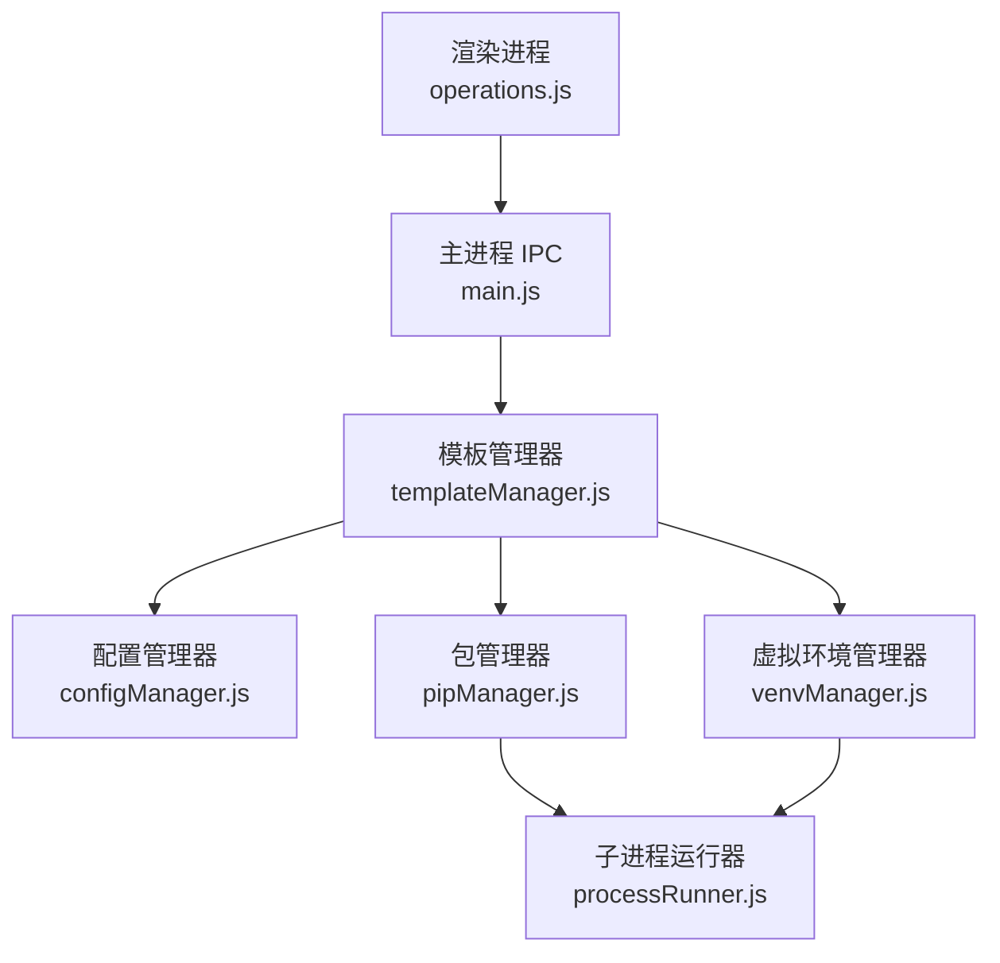
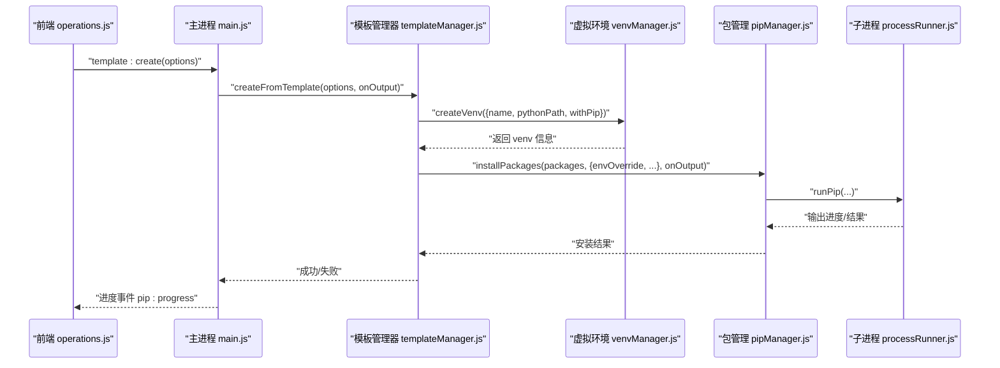
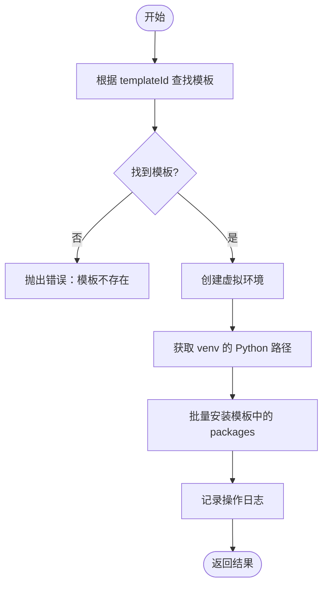
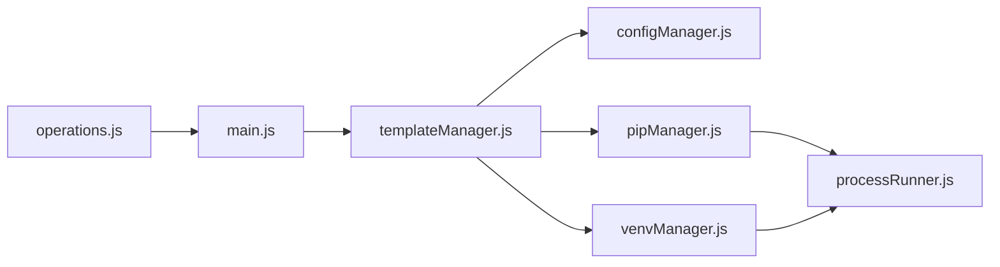
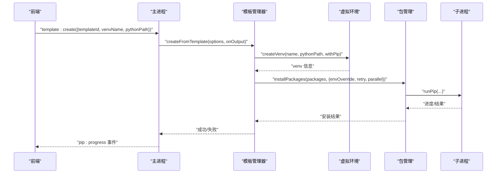
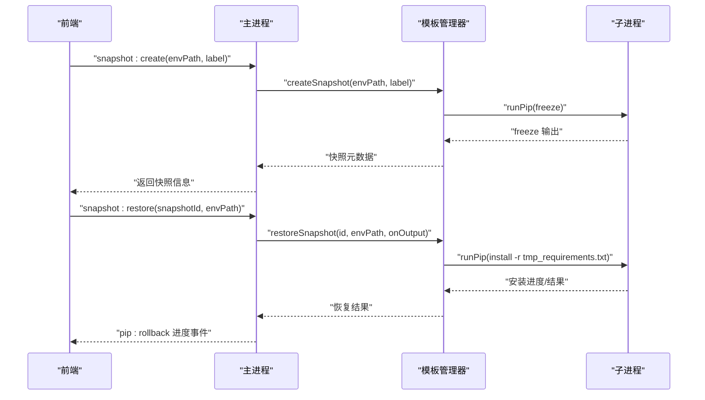

# 模板管理

<cite>
**本文引用的文件**   
- [templateManager.js](file://core/operations/templateManager.js)
- [configManager.js](file://core/config/configManager.js)
- [venvManager.js](file://core/operations/venvManager.js)
- [pipManager.js](file://core/operations/pipManager.js)
- [processRunner.js](file://utils/processRunner.js)
- [main.js](file://main.js)
- [operations.js](file://renderer/js/operations.js)
</cite>

## 目录
1. [简介](#简介)
2. [项目结构](#项目结构)
3. [核心组件](#核心组件)
4. [架构总览](#架构总览)
5. [详细组件分析](#详细组件分析)
6. [依赖关系分析](#依赖关系分析)
7. [性能考虑](#性能考虑)
8. [故障排除指南](#故障排除指南)
9. [结论](#结论)
10. [附录：API 与使用示例](#附录api-与使用示例)

## 简介
本文件系统化阐述 PyLibMaster 的“模板管理”功能，围绕 core/operations/templateManager.js 模块展开，覆盖以下要点：
- 预设模板管理与自定义模板创建、删除
- 从模板一键创建虚拟环境并安装依赖
- 环境快照：记录某时刻完整环境状态（基于 pip freeze），支持恢复与删除
- 模板文件组织结构、变量替换机制、依赖管理与环境配置
- 模板 API 接口说明（获取列表、创建、应用等）
- 模板与 Python 环境的集成方式、版本管理与更新机制
- 实际使用流程、最佳实践、错误处理、性能优化与故障排除

## 项目结构
模板管理位于后端 Node/Electron 主进程侧，通过 IPC 暴露给渲染进程。关键路径如下：
- 业务逻辑：core/operations/templateManager.js
- 配置持久化：core/config/configManager.js
- 虚拟环境：core/operations/venvManager.js
- 包管理：core/operations/pipManager.js
- 子进程执行：utils/processRunner.js
- IPC 桥接：main.js
- 前端操作入口：renderer/js/operations.js（页面刷新时触发模板页加载）

图表来源
- [main.js:540-640](file://main.js#L540-L640)
- [templateManager.js:1-320](file://core/operations/templateManager.js#L1-L320)
- [configManager.js:1-194](file://core/config/configManager.js#L1-L194)
- [venvManager.js:1-278](file://core/operations/venvManager.js#L1-L278)
- [pipManager.js:1-800](file://core/operations/pipManager.js#L1-L800)
- [processRunner.js:1-366](file://utils/processRunner.js#L1-L366)

章节来源
- [main.js:540-640](file://main.js#L540-L640)
- [operations.js:518-520](file://renderer/js/operations.js#L518-L520)

## 核心组件
- 模板管理器（templateManager.js）
  - 内置模板集合（Web/数据分析/机器学习/爬虫/自动化办公）
  - 自定义模板增删改查（持久化到配置）
  - 从模板创建虚拟环境并批量安装依赖
  - 环境快照：创建、列出、详情、恢复、删除
- 配置管理器（configManager.js）
  - 提供存储路径、并行线程数、重试次数等配置项
  - 原子写入与损坏恢复
- 虚拟环境管理器（venvManager.js）
  - 创建/删除/列举 venv，解析 Python 与 pip 版本
- 包管理器（pipManager.js）
  - 批量安装、更新、卸载；镜像重试、自动回滚、进度回调
- 子进程运行器（processRunner.js）
  - 统一封装命令执行、超时、取消、ANSI 清理、pip 自动安装

章节来源
- [templateManager.js:1-320](file://core/operations/templateManager.js#L1-L320)
- [configManager.js:1-194](file://core/config/configManager.js#L1-L194)
- [venvManager.js:1-278](file://core/operations/venvManager.js#L1-L278)
- [pipManager.js:1-800](file://core/operations/pipManager.js#L1-L800)
- [processRunner.js:1-366](file://utils/processRunner.js#L1-L366)

## 架构总览
模板管理通过 IPC 将前端请求路由至模板管理器，再协同 venv 与 pip 完成环境搭建与依赖安装。快照功能以 JSON 文件形式持久化在 storagePath/snapshots 下。

图表来源
- [main.js:557-561](file://main.js#L557-L561)
- [templateManager.js:118-154](file://core/operations/templateManager.js#L118-L154)
- [venvManager.js:73-130](file://core/operations/venvManager.js#L73-L130)
- [pipManager.js:495-578](file://core/operations/pipManager.js#L495-L578)
- [processRunner.js:340-342](file://utils/processRunner.js#L340-L342)

## 详细组件分析

### 模板管理器（templateManager.js）
- 内置模板
  - 定义多个领域模板（Flask/Django/数据分析/机器学习/爬虫/自动化办公），包含包清单与描述
- 自定义模板
  - 添加：校验 name/packages，生成唯一 id，标记 isCustom，持久化到配置
  - 删除：按 id 过滤后保存
- 从模板创建环境
  - 步骤：查找模板 -> 创建 venv -> 获取 venv 的 Python 路径 -> 调用 pipManager.installPackages 安装所有包 -> 记录日志 -> 返回结果
- 环境快照
  - 创建：执行 pip freeze，生成时间戳 ID，写入 snapshots/*.json
  - 列出：读取 .json 并按时间倒序
  - 详情：安全文件名处理后读取
  - 恢复：生成临时 requirements.txt，调用 runPip install -r 安装，异常时记录日志并清理临时文件
  - 删除：安全文件名处理后删除

图表来源
- [templateManager.js:118-154](file://core/operations/templateManager.js#L118-L154)

章节来源
- [templateManager.js:23-66](file://core/operations/templateManager.js#L23-L66)
- [templateManager.js:72-98](file://core/operations/templateManager.js#L72-L98)
- [templateManager.js:105-110](file://core/operations/templateManager.js#L105-L110)
- [templateManager.js:118-154](file://core/operations/templateManager.js#L118-L154)
- [templateManager.js:175-209](file://core/operations/templateManager.js#L175-L209)
- [templateManager.js:215-236](file://core/operations/templateManager.js#L215-L236)
- [templateManager.js:243-248](file://core/operations/templateManager.js#L243-L248)
- [templateManager.js:257-292](file://core/operations/templateManager.js#L257-L292)
- [templateManager.js:299-307](file://core/operations/templateManager.js#L299-L307)

### 配置管理器（configManager.js）
- 作用：集中管理应用配置（主题、语言、存储路径、并行线程数、重试次数、当前环境等）
- 特性：数值范围校验与自动修正、原子写入、损坏重建默认配置、存储路径自动创建
- 模板相关：customTemplates 数组用于持久化自定义模板

章节来源
- [configManager.js:80-117](file://core/config/configManager.js#L80-L117)
- [configManager.js:123-138](file://core/config/configManager.js#L123-L138)
- [configManager.js:144-178](file://core/config/configManager.js#L144-L178)
- [configManager.js:185-191](file://core/config/configManager.js#L185-L191)

### 虚拟环境管理器（venvManager.js）
- 能力：创建/删除/列举 venv，解析 Python/pip 版本，计算包数量
- 与模板集成：模板创建流程中负责创建 venv 并返回可执行的 Python 路径

章节来源
- [venvManager.js:73-130](file://core/operations/venvManager.js#L73-L130)
- [venvManager.js:136-186](file://core/operations/venvManager.js#L136-L186)
- [venvManager.js:195-224](file://core/operations/venvManager.js#L195-L224)
- [venvManager.js:231-268](file://core/operations/venvManager.js#L231-L268)

### 包管理器（pipManager.js）
- 能力：批量安装/更新/卸载、镜像重试、自动回滚、进度回调、缓存已安装包列表
- 与模板集成：模板安装阶段通过 installPackages 批量安装依赖，支持并行与重试

章节来源
- [pipManager.js:495-578](file://core/operations/pipManager.js#L495-L578)
- [pipManager.js:590-615](file://core/operations/pipManager.js#L590-L615)
- [pipManager.js:627-712](file://core/operations/pipManager.js#L627-L712)

### 子进程运行器（processRunner.js）
- 能力：统一封装命令执行、超时、取消、ANSI 清理、pip 自动安装（ensurepip/get-pip.py）
- 与模板集成：模板恢复快照时使用 runPip 执行 pip install -r

章节来源
- [processRunner.js:85-161](file://utils/processRunner.js#L85-L161)
- [processRunner.js:233-278](file://utils/processRunner.js#L233-L278)
- [processRunner.js:340-342](file://utils/processRunner.js#L340-L342)

## 依赖关系分析
- 模板管理器依赖配置管理器（读取/写入 customTemplates）、虚拟环境管理器（创建 venv）、包管理器（安装依赖）、子进程运行器（执行 pip）
- 主进程通过 IPC 暴露模板与快照相关方法，供前端调用
- 前端 operations.js 在切换模板页时触发加载模板数据

图表来源
- [templateManager.js:1-320](file://core/operations/templateManager.js#L1-L320)
- [main.js:551-575](file://main.js#L551-L575)
- [operations.js:518-520](file://renderer/js/operations.js#L518-L520)

章节来源
- [main.js:551-575](file://main.js#L551-L575)
- [operations.js:518-520](file://renderer/js/operations.js#L518-L520)

## 性能考虑
- 并行安装：pipManager 支持并行安装，受配置 parallelThreads 限制
- 智能重试：多镜像源重试，提升网络不稳定场景成功率
- 缓存策略：已安装包列表缓存 5 分钟，site-packages 路径缓存 30 秒，pip 就绪状态缓存 5 分钟
- I/O 优化：快照恢复使用临时 requirements 文件一次性安装，减少多次 pip 调用
- 资源清理：创建 venv 失败时清理残留目录；恢复快照完成后删除临时文件

[本节为通用性能建议，不直接分析具体文件]

## 故障排除指南
- 模板未找到
  - 现象：创建环境时报错模板不存在
  - 排查：确认 templateId 是否正确，检查 getTemplates() 是否返回该模板
- 虚拟环境创建失败
  - 现象：创建 venv 抛错或残留目录
  - 排查：基础 Python 路径是否存在；名称合法性；权限问题；查看日志
- 包安装失败
  - 现象：部分包安装失败或全部失败
  - 排查：镜像源连通性；网络超时；依赖冲突；启用自动回滚验证
- 快照恢复失败
  - 现象：restoreSnapshot 抛错
  - 排查：目标环境路径是否正确；requirements 是否有效；磁盘空间；查看日志
- 配置保存失败
  - 现象：设置项未生效
  - 排查：存储路径是否存在；配置文件是否损坏；查看 saveConfig 异常降级

章节来源
- [templateManager.js:118-154](file://core/operations/templateManager.js#L118-L154)
- [venvManager.js:73-130](file://core/operations/venvManager.js#L73-L130)
- [pipManager.js:495-578](file://core/operations/pipManager.js#L495-L578)
- [templateManager.js:257-292](file://core/operations/templateManager.js#L257-L292)
- [configManager.js:123-138](file://core/config/configManager.js#L123-L138)

## 结论
模板管理模块以简洁清晰的职责划分实现了“模板驱动的环境初始化”和“环境快照的时间旅行”。通过配置持久化、虚拟环境与包管理的协作，以及稳健的子进程执行与错误处理，用户可以在不同领域快速搭建一致的 Python 开发环境，并通过快照进行可靠回滚与迁移。

[本节为总结性内容，不直接分析具体文件]

## 附录：API 与使用示例

### IPC 接口一览（主进程暴露）
- 模板
  - template:list -> 获取所有模板（内置+自定义）
  - template:add -> 添加自定义模板
  - template:remove -> 删除自定义模板
  - template:create -> 从模板创建环境（返回进度事件）
- 快照
  - snapshot:create -> 创建环境快照
  - snapshot:list -> 列出快照
  - snapshot:detail -> 获取快照详情
  - snapshot:restore -> 从快照恢复环境（返回进度事件）
  - snapshot:delete -> 删除快照

章节来源
- [main.js:551-575](file://main.js#L551-L575)

### 模板数据结构
- 内置模板字段：id、name、icon、description、packages
- 自定义模板字段：id（自动生成）、name、icon、description、packages、isCustom

章节来源
- [templateManager.js:23-66](file://core/operations/templateManager.js#L23-L66)
- [templateManager.js:83-98](file://core/operations/templateManager.js#L83-L98)

### 模板创建流程（端到端）

图表来源
- [main.js:557-561](file://main.js#L557-L561)
- [templateManager.js:118-154](file://core/operations/templateManager.js#L118-L154)
- [venvManager.js:73-130](file://core/operations/venvManager.js#L73-L130)
- [pipManager.js:495-578](file://core/operations/pipManager.js#L495-L578)
- [processRunner.js:340-342](file://utils/processRunner.js#L340-L342)

### 快照操作流程（端到端）

图表来源
- [main.js:563-575](file://main.js#L563-L575)
- [templateManager.js:175-209](file://core/operations/templateManager.js#L175-L209)
- [templateManager.js:257-292](file://core/operations/templateManager.js#L257-L292)
- [processRunner.js:340-342](file://utils/processRunner.js#L340-L342)

### 模板与环境集成要点
- 模板仅声明依赖包清单，不绑定具体代码；环境由 venvManager 创建
- 模板创建时通过 pipManager 在当前或指定环境中安装依赖
- 快照以 pip freeze 为准，确保可复现的环境状态

章节来源
- [templateManager.js:118-154](file://core/operations/templateManager.js#L118-L154)
- [templateManager.js:175-209](file://core/operations/templateManager.js#L175-L209)

### 模板开发最佳实践
- 合理拆分模板：按领域或项目类型组织，避免包过多导致安装缓慢
- 版本约束：对关键依赖使用稳定版本范围，避免上游破坏性更新
- 命名规范：自定义模板 name 简洁明确，packages 去重排序便于对比
- 测试验证：在新环境中先试用模板创建，确认依赖无冲突
- 快照策略：重要里程碑创建快照，便于回滚与团队协作

[本节为通用指导，不直接分析具体文件]

### 常见使用示例（概念性）
- 获取模板列表：调用 template:list，选择内置或自定义模板
- 创建自定义模板：调用 template:add，传入 name/icon/description/packages
- 从模板创建环境：调用 template:create，传入 templateId、venvName、pythonPath
- 创建快照：调用 snapshot:create，传入 envPath 与可选 label
- 恢复快照：调用 snapshot:restore，传入 snapshotId 与目标 envPath

[本节为概念性示例，不直接分析具体文件]