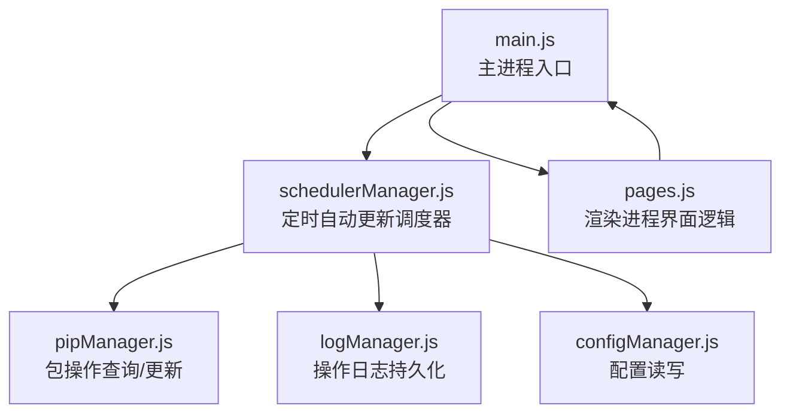
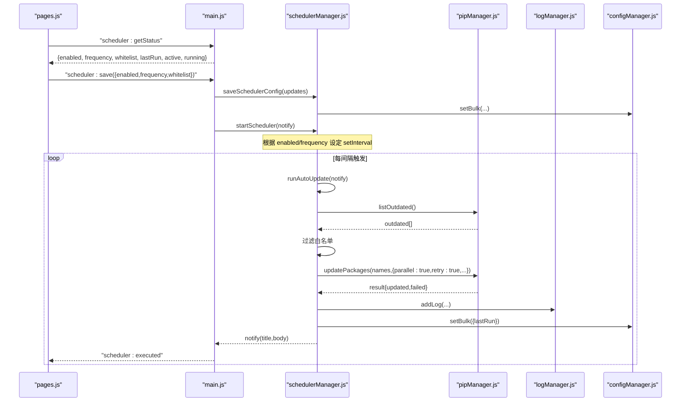
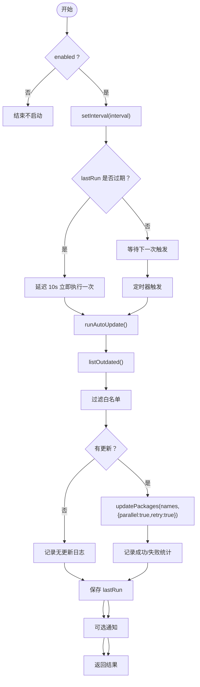
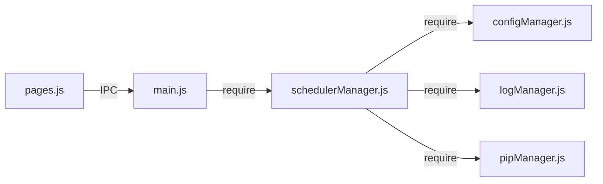

# 调度器管理

<cite>
**本文引用的文件**   
- [schedulerManager.js](file://core/config/schedulerManager.js)
- [main.js](file://main.js)
- [configManager.js](file://core/config/configManager.js)
- [logManager.js](file://core/system/logManager.js)
- [pipManager.js](file://core/operations/pipManager.js)
- [pages.js](file://renderer/js/pages.js)
- [package.json](file://package.json)
</cite>

## 目录
1. [简介](#简介)
2. [项目结构](#项目结构)
3. [核心组件](#核心组件)
4. [架构总览](#架构总览)
5. [详细组件分析](#详细组件分析)
6. [依赖关系分析](#依赖关系分析)
7. [性能与并发控制](#性能与并发控制)
8. [故障排除指南](#故障排除指南)
9. [结论](#结论)
10. [附录：API 与配置参考](#附录api-与配置参考)

## 简介
本文件为 PyLibMaster 的“定时自动更新调度器”模块提供完整、深入的技术文档。内容覆盖 schedulerManager.js 的任务调度机制、自动更新流程、任务状态监控与执行日志记录；说明调度器的配置项、任务类型定义与执行策略；给出从创建到执行的完整生命周期；详述 IPC API（添加任务、修改计划、暂停/停止、删除/禁用等）；解释底层实现（定时器间隔、并发控制、资源管理）；并提供常见场景的配置示例与监控排障建议。

## 项目结构
调度器位于 core/config 目录下，通过 main.js 在应用启动时初始化并暴露 IPC 接口，前端 pages.js 负责 UI 交互与状态展示。

图表来源
- [main.js:140-144](file://main.js#L140-L144)
- [schedulerManager.js:1-197](file://core/config/schedulerManager.js#L1-L197)
- [pipManager.js:1400-1597](file://core/operations/pipManager.js#L1400-L1597)
- [logManager.js:1-173](file://core/system/logManager.js#L1-L173)
- [configManager.js:1-194](file://core/config/configManager.js#L1-L194)
- [pages.js:718-801](file://renderer/js/pages.js#L718-L801)

章节来源
- [main.js:140-144](file://main.js#L140-L144)
- [schedulerManager.js:1-197](file://core/config/schedulerManager.js#L1-L197)
- [pages.js:718-801](file://renderer/js/pages.js#L718-L801)

## 核心组件
- 调度器管理器（schedulerManager.js）
  - 职责：读取配置、维护定时器、触发自动更新、记录日志、保存上次执行时间、对外暴露状态与操作方法。
  - 关键能力：按频率（每日/每周）设置间隔；支持白名单过滤；并发保护（isRunning）；失败回退与通知回调。
- 配置管理器（configManager.js）
  - 职责：统一读写 JSON 配置文件，提供默认值与校验修正，原子写入避免损坏。
- 日志管理器（logManager.js）
  - 职责：结构化日志写入、防抖落盘、容量限制、筛选查询。
- pip 包管理器（pipManager.js）
  - 职责：列出可更新包、批量更新、并行/重试、健康检查等。
- 主进程桥接（main.js）
  - 职责：应用启动时初始化调度器、注册 IPC 处理器、转发执行结果到渲染进程。
- 前端交互（pages.js）
  - 职责：加载调度器状态、切换开关、修改频率、维护白名单、立即执行一次、显示通知。

章节来源
- [schedulerManager.js:1-197](file://core/config/schedulerManager.js#L1-L197)
- [configManager.js:1-194](file://core/config/configManager.js#L1-L194)
- [logManager.js:1-173](file://core/system/logManager.js#L1-L173)
- [pipManager.js:1400-1597](file://core/operations/pipManager.js#L1400-L1597)
- [main.js:140-144](file://main.js#L140-L144)
- [pages.js:718-801](file://renderer/js/pages.js#L718-L801)

## 架构总览
调度器采用“配置驱动 + 定时器 + 异步任务”的模式：
- 启动阶段：main.js 调用 startScheduler(notify)，根据配置启用定时器。
- 执行阶段：定时器触发 runAutoUpdate(notify)，内部调用 pipManager.listOutdated 获取待更新列表，过滤白名单后批量 updatePackages，记录日志并持久化 lastRun。
- 通信阶段：通过 IPC 暴露 getStatus/save/runNow，前端 pages.js 进行 UI 绑定与用户操作。

图表来源
- [main.js:526-546](file://main.js#L526-L546)
- [schedulerManager.js:145-163](file://core/config/schedulerManager.js#L145-L163)
- [schedulerManager.js:70-138](file://core/config/schedulerManager.js#L70-L138)
- [pipManager.js:1400-1597](file://core/operations/pipManager.js#L1400-L1597)
- [logManager.js:112-131](file://core/system/logManager.js#L112-L131)
- [configManager.js:171-178](file://core/config/configManager.js#L171-L178)

## 详细组件分析

### 调度器管理器（schedulerManager.js）
- 配置读取与保存
  - getSchedulerConfig：返回 enabled、frequency、whitelist、lastRun。
  - saveSchedulerConfig：将 updates 映射到 schedulerEnabled/schedulerFrequency/schedulerWhitelist/schedulerLastRun 并批量写入配置。
- 调度与执行
  - getInterval：根据 frequency 计算毫秒间隔（daily=24h，weekly=7d）。
  - startScheduler：清除旧定时器，按 enabled/frequency 设置 setInterval；若 lastRun 超过一个间隔，延迟 10s 立即执行一次。
  - stopScheduler：清理定时器引用。
  - runAutoUpdate：并发保护（isRunning），获取 outdated，过滤白名单，批量更新，写日志，保存 lastRun，可选通知回调。
  - getStatus：返回当前配置与 active/running 状态。
- 错误处理
  - try/catch 包裹执行体，异常写入日志并返回 error.message。
  - finally 确保 isRunning 复位。

图表来源
- [schedulerManager.js:145-163](file://core/config/schedulerManager.js#L145-L163)
- [schedulerManager.js:70-138](file://core/config/schedulerManager.js#L70-L138)

章节来源
- [schedulerManager.js:29-50](file://core/config/schedulerManager.js#L29-L50)
- [schedulerManager.js:57-59](file://core/config/schedulerManager.js#L57-L59)
- [schedulerManager.js:70-138](file://core/config/schedulerManager.js#L70-L138)
- [schedulerManager.js:145-173](file://core/config/schedulerManager.js#L145-L173)
- [schedulerManager.js:179-187](file://core/config/schedulerManager.js#L179-L187)

### 主进程桥接（main.js）
- 启动时初始化：app.whenReady 中调用 schedulerManager.startScheduler(notify)，并将执行结果通过 mainWindow.webContents.send('scheduler:executed', body) 推送给渲染进程。
- IPC 处理器：
  - scheduler:getStatus：返回调度器状态。
  - scheduler:save：保存配置并重启调度器。
  - scheduler:runNow：立即执行一次自动更新。

章节来源
- [main.js:140-144](file://main.js#L140-L144)
- [main.js:526-546](file://main.js#L526-L546)

### 前端交互（pages.js）
- 加载状态：loadSchedulerStatus 读取 status 并填充开关、频率、最近执行时间、白名单标签。
- 用户操作：
  - toggleScheduler：切换 enabled。
  - changeSchedulerFrequency：修改 frequency。
  - addWhitelistPkg/removeWhitelistPkg：维护白名单数组并保存。
  - runSchedulerNow：调用 scheduler:runNow，展示执行结果与刷新日志。

章节来源
- [pages.js:718-801](file://renderer/js/pages.js#L718-L801)

### 日志与配置
- 日志（logManager.js）
  - addLog：结构化记录 action/status/type/detail，自动截断字段、插入头部、容量裁剪、防抖落盘。
  - flushLogs：退出前同步落盘。
- 配置（configManager.js）
  - setBulk：批量写入，原子保存（临时文件+重命名），内置默认值与范围校验。

章节来源
- [logManager.js:112-131](file://core/system/logManager.js#L112-L131)
- [logManager.js:88-96](file://core/system/logManager.js#L88-L96)
- [configManager.js:171-178](file://core/config/configManager.js#L171-L178)
- [configManager.js:123-138](file://core/config/configManager.js#L123-L138)

### pip 包管理器（pipManager.js）
- 相关能力：
  - listOutdated：获取可更新包列表。
  - updatePackages：批量更新，支持 parallel/retry/rollback 等选项。
  - healthCheck/checkConflicts：环境健康与冲突检测（可用于监控）。
- 安全与并发：
  - 包名/版本正则校验、wheel 路径安全检查。
  - 环境级互斥锁（同一环境串行），避免并发冲突。

章节来源
- [pipManager.js:1400-1597](file://core/operations/pipManager.js#L1400-L1597)

## 依赖关系分析
- schedulerManager.js 依赖：
  - configManager.js：读取/保存调度器配置。
  - logManager.js：记录执行日志。
  - pipManager.js：获取可更新包与批量更新。
- main.js 作为 IPC 中枢，连接前端与调度器。
- pages.js 仅通过 IPC 与后端交互，不直接依赖核心模块。

图表来源
- [main.js:140-144](file://main.js#L140-L144)
- [schedulerManager.js:18-19](file://core/config/schedulerManager.js#L18-L19)
- [pages.js:718-801](file://renderer/js/pages.js#L718-L801)

章节来源
- [schedulerManager.js:18-19](file://core/config/schedulerManager.js#L18-L19)
- [main.js:140-144](file://main.js#L140-L144)

## 性能与并发控制
- 定时器与执行
  - 使用 setInterval 按固定间隔触发，非 cron 表达式；间隔由 frequency 决定（daily/weekly）。
  - 启动时若 lastRun 已过期，延迟 10s 立即执行一次，避免错过周期。
- 并发控制
  - 内存级 isRunning 标志防止重复执行。
  - pipManager 内部对同一 Python 环境加互斥锁，保证同一环境串行操作。
- I/O 优化
  - 日志写入采用防抖（300ms）减少频繁磁盘 IO。
  - 配置保存采用原子写入（临时文件+重命名）降低损坏风险。
- 资源管理
  - 应用退出前 flushLogs 确保日志落盘。
  - before-quit 取消所有子进程，避免残留。

章节来源
- [schedulerManager.js:145-163](file://core/config/schedulerManager.js#L145-L163)
- [schedulerManager.js:70-138](file://core/config/schedulerManager.js#L70-L138)
- [logManager.js:72-83](file://core/system/logManager.js#L72-L83)
- [configManager.js:123-138](file://core/config/configManager.js#L123-L138)
- [main.js:161-170](file://main.js#L161-L170)

## 故障排除指南
- 调度器未启动
  - 检查配置 schedulerEnabled 是否为 true。
  - 确认 startScheduler 已被调用（应用启动时会自动调用）。
- 任务未执行或重复执行
  - 查看 isRunning 状态与日志；确认没有外部重复调用 startScheduler。
  - 检查 lastRun 是否被正确保存。
- 更新失败
  - 查看日志中的 failed 统计与 detail 信息。
  - 检查网络镜像源与 pip 环境健康（healthCheck/checkConflicts）。
- 白名单无效
  - 确认白名单大小写一致性（代码中对 name.toLowerCase() 比较）。
  - 重新保存配置并重启调度器。
- 日志丢失
  - 检查 before-quit 是否调用 flushLogs。
  - 确认存储路径存在且可写。

章节来源
- [schedulerManager.js:70-138](file://core/config/schedulerManager.js#L70-L138)
- [logManager.js:112-131](file://core/system/logManager.js#L112-L131)
- [pipManager.js:1492-1566](file://core/operations/pipManager.js#L1492-L1566)
- [main.js:161-170](file://main.js#L161-L170)

## 结论
PyLibMaster 的调度器以简洁可靠的定时器模式实现“每日/每周”自动更新，结合白名单过滤、并发保护、结构化日志与原子配置保存，形成稳定易用的后台任务体系。通过 IPC 暴露的状态与操作方法，前端可灵活控制调度行为，满足常规自动化运维需求。

## 附录：API 与配置参考

### IPC 接口（主进程）
- scheduler:getStatus
  - 作用：获取调度器状态与配置（enabled、frequency、whitelist、lastRun、active、running）。
  - 调用方：pages.js 加载 UI。
- scheduler:save(config)
  - 作用：保存调度器配置（enabled/frequency/whitelist/lastRun），并重启调度器。
  - 参数：config 对象，包含上述字段。
- scheduler:runNow()
  - 作用：立即执行一次自动更新，返回执行结果（updated/failed/skipped/total/error）。

章节来源
- [main.js:526-546](file://main.js#L526-L546)

### 配置项（JSON）
- schedulerEnabled：布尔，是否启用调度器。
- schedulerFrequency：字符串，'daily' | 'weekly'。
- schedulerWhitelist：字符串数组，不自动更新的包名列表（大小写不敏感）。
- schedulerLastRun：ISO 字符串，上次执行时间。

章节来源
- [schedulerManager.js:29-50](file://core/config/schedulerManager.js#L29-L50)

### 任务生命周期
- 创建：通过 scheduler:save 保存 enabled/frequency/whitelist。
- 启动：startScheduler 根据配置设置定时器。
- 执行：定时器触发 runAutoUpdate，获取 outdated -> 过滤白名单 -> 批量更新 -> 记录日志 -> 保存 lastRun。
- 监控：通过 scheduler:getStatus 获取 active/running/lastRun；通过日志查看执行详情。
- 停止：stopScheduler 清理定时器（可通过关闭 enabled 或应用退出触发）。

章节来源
- [schedulerManager.js:145-173](file://core/config/schedulerManager.js#L145-L173)
- [schedulerManager.js:70-138](file://core/config/schedulerManager.js#L70-L138)

### 常见调度场景示例
- 定期备份
  - 使用 schedulerEnabled=true，frequency='daily'，whitelist=[需要保留的包]。
  - 配合 pip:export 导出 requirements.txt 到指定目录（需在前端或扩展中集成）。
- 自动更新检查
  - 开启 autoCheckUpdates（独立于调度器），启动时静默检查可更新数量并通过事件通知。
- 系统健康监控
  - 周期性调用 pip:healthCheck 与 pip:checkConflicts，汇总结果到仪表盘或告警。

章节来源
- [main.js:217-231](file://main.js#L217-L231)
- [pipManager.js:1492-1566](file://core/operations/pipManager.js#L1492-L1566)

### 底层实现要点
- 定时器 vs Cron
  - 当前实现基于 setInterval，不支持 cron 表达式；如需复杂调度，可在上层封装 cron 解析器并转换为 setInterval。
- 并发控制
  - 调度层 isRunning 防重入；pip 层环境级互斥锁串行化同一环境的包操作。
- 资源管理
  - 日志防抖落盘；配置原子写入；退出前 flushLogs 与 cancelAllProcesses。

章节来源
- [schedulerManager.js:145-163](file://core/config/schedulerManager.js#L145-L163)
- [pipManager.js:72-85](file://core/operations/pipManager.js#L72-L85)
- [logManager.js:72-83](file://core/system/logManager.js#L72-L83)
- [configManager.js:123-138](file://core/config/configManager.js#L123-L138)
- [main.js:161-170](file://main.js#L161-L170)