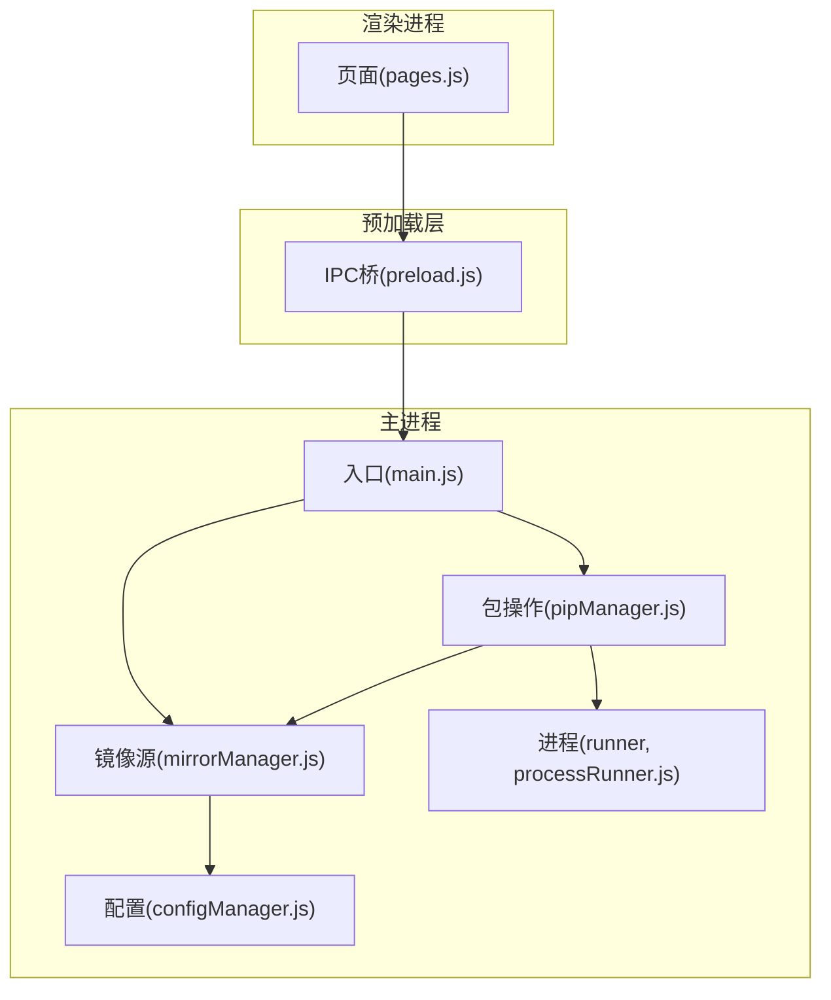
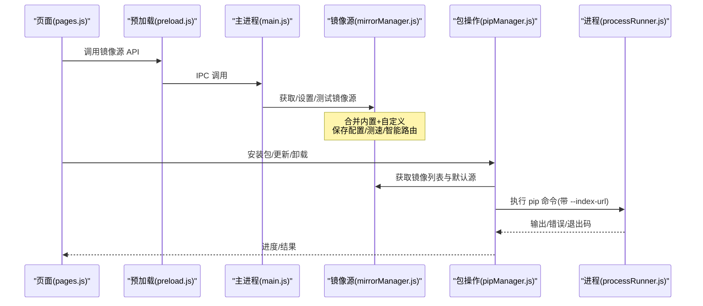
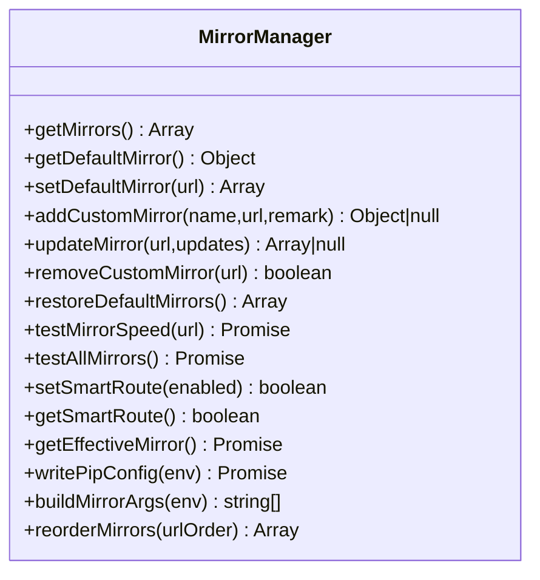
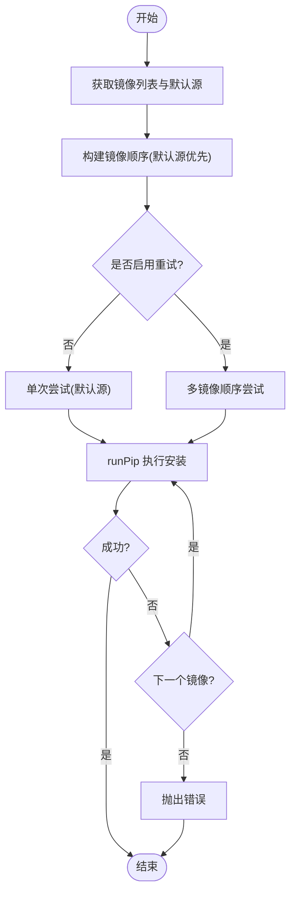
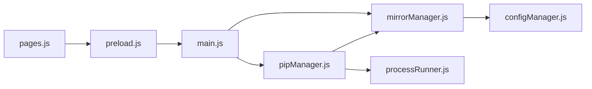

# 镜像源管理

<cite>
**本文引用的文件**   
- [mirrorManager.js](file://core/config/mirrorManager.js)
- [configManager.js](file://core/config/configManager.js)
- [pipManager.js](file://core/operations/pipManager.js)
- [processRunner.js](file://utils/processRunner.js)
- [main.js](file://main.js)
- [preload.js](file://preload.js)
- [pages.js](file://renderer/js/pages.js)
</cite>

## 目录
1. [简介](#简介)
2. [项目结构](#项目结构)
3. [核心组件](#核心组件)
4. [架构总览](#架构总览)
5. [详细组件分析](#详细组件分析)
6. [依赖关系分析](#依赖关系分析)
7. [性能考量](#性能考量)
8. [故障排除指南](#故障排除指南)
9. [结论](#结论)
10. [附录：API 与配置流程](#附录api-与配置流程)

## 简介
本文件系统性阐述 PyLibMaster 的镜像源管理能力，围绕 core/config/mirrorManager.js 模块展开，覆盖内置镜像源、自定义镜像源、智能路由算法、下载加速、优先级与健康检查、故障转移策略、与 pip 下载的集成方式、代理与超时处理，以及从默认配置到自定义优化的完整流程。同时提供镜像源相关 API 的详细说明与常见问题排查方法。

## 项目结构
镜像源管理涉及以下关键位置：
- 核心逻辑：core/config/mirrorManager.js（镜像源列表、测速、智能路由、写入 pip 配置）
- 配置持久化：core/config/configManager.js（应用配置读写、范围校验）
- 包操作集成：core/operations/pipManager.js（安装/更新/卸载时按镜像顺序重试）
- 进程与网络：utils/processRunner.js（子进程执行、超时、取消、ensurepip）
- IPC 桥接：main.js（主进程处理器）、preload.js（渲染进程安全桥）
- 前端交互：renderer/js/pages.js（设置页 UI 调用镜像源 API）

图表来源
- [main.js:370-395](file://main.js#L370-L395)
- [preload.js:75-86](file://preload.js#L75-L86)
- [mirrorManager.js:1-30](file://core/config/mirrorManager.js#L1-L30)
- [pipManager.js:590-615](file://core/operations/pipManager.js#L590-L615)
- [processRunner.js:233-278](file://utils/processRunner.js#L233-L278)

章节来源
- [main.js:370-395](file://main.js#L370-L395)
- [preload.js:75-86](file://preload.js#L75-L86)
- [mirrorManager.js:1-30](file://core/config/mirrorManager.js#L1-L30)
- [pipManager.js:590-615](file://core/operations/pipManager.js#L590-L615)
- [processRunner.js:233-278](file://utils/processRunner.js#L233-L278)

## 核心组件
- 镜像源管理器（mirrorManager.js）
  - 内置镜像源：PyPI 官方、清华大学、阿里云、腾讯云、华为云、豆瓣
  - 自定义镜像源：支持添加、编辑、删除、排序
  - 智能路由：根据测速结果自动选择最快镜像
  - 健康检查：HEAD 请求测速，失败标记为高延迟
  - 写入 pip 配置：生成全局 index-url 与 timeout
  - 构建 pip 参数：非官方源追加 --index-url
- 配置管理器（configManager.js）
  - 持久化存储 JSON，原子写入避免损坏
  - 数值项范围校验与回退默认值
- 包操作（pipManager.js）
  - 安装/更新/卸载时按“默认源 + 其他源”的顺序进行多镜像重试
  - 结合 ensurePip 与 runPip 完成命令执行
- 进程运行器（processRunner.js）
  - 子进程生命周期管理、超时、取消、ensurepip 自动安装
  - get-pip.py 多源下载与重定向处理

章节来源
- [mirrorManager.js:21-29](file://core/config/mirrorManager.js#L21-L29)
- [mirrorManager.js:97-107](file://core/config/mirrorManager.js#L97-L107)
- [mirrorManager.js:219-247](file://core/config/mirrorManager.js#L219-L247)
- [mirrorManager.js:299-322](file://core/config/mirrorManager.js#L299-L322)
- [configManager.js:120-138](file://core/config/configManager.js#L120-L138)
- [pipManager.js:590-615](file://core/operations/pipManager.js#L590-L615)
- [processRunner.js:233-278](file://utils/processRunner.js#L233-L278)

## 架构总览
镜像源管理的端到端流程如下：
- 前端通过 preload.js 暴露的 API 调用 main.js 的 IPC 处理器
- main.js 转发到 mirrorManager.js 或 pipManager.js
- mirrorManager.js 负责读取/保存配置、测速、智能路由、写入 pip 配置
- pipManager.js 在执行安装/更新/卸载时，按镜像顺序重试，必要时写入 pip 配置并调用 processRunner.js 执行 pip 命令

图表来源
- [main.js:370-395](file://main.js#L370-L395)
- [preload.js:75-86](file://preload.js#L75-L86)
- [mirrorManager.js:219-247](file://core/config/mirrorManager.js#L219-L247)
- [pipManager.js:590-615](file://core/operations/pipManager.js#L590-L615)
- [processRunner.js:340-342](file://utils/processRunner.js#L340-L342)

## 详细组件分析

### 镜像源管理器（mirrorManager.js）
- 内置镜像源定义与合并策略
  - DEFAULT_MIRRORS 包含多个国内常用镜像
  - loadMirrors() 合并用户保存的配置与内置源，确保唯一默认源
- 自定义镜像源 CRUD
  - addCustomMirror() 校验 URL（仅 http/https），去重，持久化
  - updateMirror() 支持名称/URL/备注更新，冲突检测
  - removeCustomMirror() 删除后自动将首个源设为默认
  - reorderMirrors() 支持拖拽排序后的优先级保存
- 测速与健康检查
  - testMirrorSpeed(url) 使用 HEAD 请求 numpy/ 路径，超时 5s，失败返回 9999ms
  - testAllMirrors() 并行测速并保存 speed 字段
- 智能路由
  - setSmartRoute()/getSmartRoute() 开关控制
  - pickBestMirror() 并行测速并按响应时间排序选择最快
  - getEffectiveMirror() 智能路由开启则选最快，否则返回默认源
- 写入 pip 配置与构建参数
  - writePipConfig(env) 跨平台写入 pip.ini/pip.conf，设置 index-url 与 timeout=60
  - buildMirrorArgs(env) 非官方源追加 --index-url

图表来源
- [mirrorManager.js:109-118](file://core/config/mirrorManager.js#L109-L118)
- [mirrorManager.js:139-150](file://core/config/mirrorManager.js#L139-L150)
- [mirrorManager.js:158-179](file://core/config/mirrorManager.js#L158-L179)
- [mirrorManager.js:187-197](file://core/config/mirrorManager.js#L187-L197)
- [mirrorManager.js:219-247](file://core/config/mirrorManager.js#L219-L247)
- [mirrorManager.js:267-290](file://core/config/mirrorManager.js#L267-L290)
- [mirrorManager.js:299-333](file://core/config/mirrorManager.js#L299-L333)
- [mirrorManager.js:340-357](file://core/config/mirrorManager.js#L340-L357)

章节来源
- [mirrorManager.js:21-29](file://core/config/mirrorManager.js#L21-L29)
- [mirrorManager.js:60-91](file://core/config/mirrorManager.js#L60-L91)
- [mirrorManager.js:97-107](file://core/config/mirrorManager.js#L97-L107)
- [mirrorManager.js:139-150](file://core/config/mirrorManager.js#L139-L150)
- [mirrorManager.js:158-179](file://core/config/mirrorManager.js#L158-L179)
- [mirrorManager.js:187-197](file://core/config/mirrorManager.js#L187-L197)
- [mirrorManager.js:219-247](file://core/config/mirrorManager.js#L219-L247)
- [mirrorManager.js:267-290](file://core/config/mirrorManager.js#L267-L290)
- [mirrorManager.js:299-333](file://core/config/mirrorManager.js#L299-L333)
- [mirrorManager.js:340-357](file://core/config/mirrorManager.js#L340-L357)

### 配置管理器（configManager.js）
- 配置文件位置与初始化
  - Electron userData 目录下的 pylibmaster-config.json
  - 首次启动创建默认配置，损坏时重建
- 原子写入与校验
  - 先写临时文件再 rename，避免崩溃导致损坏
  - 数值项范围限制与回退默认值
- 镜像源相关配置
  - smartRoute 开关持久化
  - mirrors 数组持久化（名称、URL、备注、默认状态、速度）

章节来源
- [configManager.js:80-117](file://core/config/configManager.js#L80-L117)
- [configManager.js:120-138](file://core/config/configManager.js#L120-L138)
- [configManager.js:157-178](file://core/config/configManager.js#L157-L178)

### 包操作与镜像源集成（pipManager.js）
- 安装/更新/卸载的多镜像重试
  - installOne() 构造镜像顺序：默认源优先，其余依次尝试
  - 每次尝试追加 --index-url（非官方源），最大尝试次数受 retryCount 与镜像数量限制
- 文件安装（.whl/.txt）
  - .whl 直接安装；.txt 批量安装，同样支持多镜像重试
- 环境锁与并发控制
  - 同一 Python 环境的操作串行执行，避免并发冲突

图表来源
- [pipManager.js:590-615](file://core/operations/pipManager.js#L590-L615)
- [pipManager.js:627-712](file://core/operations/pipManager.js#L627-L712)

章节来源
- [pipManager.js:590-615](file://core/operations/pipManager.js#L590-L615)
- [pipManager.js:627-712](file://core/operations/pipManager.js#L627-L712)

### 进程与网络（processRunner.js）
- 子进程执行与超时
  - runCommand() 支持超时、SIGTERM/SIGKILL 两级终止、实时输出回调
- ensurePip 自动安装
  - 优先缓存与检测，其次 ensurepip，最后下载 get-pip.py（多源与重定向）
- 取消操作
  - cancelOperation(operationId) 按操作 ID 批量取消关联进程

章节来源
- [processRunner.js:85-161](file://utils/processRunner.js#L85-L161)
- [processRunner.js:233-278](file://utils/processRunner.js#L233-L278)
- [processRunner.js:340-342](file://utils/processRunner.js#L340-L342)

### 前端交互（pages.js）
- 设置页功能
  - 设置默认镜像源、删除自定义镜像、编辑镜像信息
  - 批量测速、恢复默认镜像源、切换智能路由开关
- 调用链路
  - pages.js -> preload.js -> main.js -> mirrorManager.js

章节来源
- [pages.js:20-161](file://renderer/js/pages.js#L20-L161)

## 依赖关系分析
- 模块耦合
  - mirrorManager.js 依赖 configManager.js（持久化）与 processRunner.js（可选，用于日志记录）
  - pipManager.js 依赖 mirrorManager.js（镜像顺序）、configManager.js（并行线程数等）、processRunner.js（pip 执行）
  - main.js 作为 IPC 中枢，桥接前端与核心模块
- 外部依赖
  - Electron（窗口、托盘、通知等）
  - Node.js 标准库（fs、path、os、child_process、http/https）
  - strip-ansi（清理终端 ANSI 色彩）

图表来源
- [main.js:370-395](file://main.js#L370-L395)
- [preload.js:75-86](file://preload.js#L75-L86)
- [mirrorManager.js:18-19](file://core/config/mirrorManager.js#L18-L19)
- [pipManager.js:22-27](file://core/operations/pipManager.js#L22-L27)

章节来源
- [main.js:370-395](file://main.js#L370-L395)
- [preload.js:75-86](file://preload.js#L75-L86)
- [mirrorManager.js:18-19](file://core/config/mirrorManager.js#L18-L19)
- [pipManager.js:22-27](file://core/operations/pipManager.js#L22-L27)

## 性能考量
- 测速并行化
  - testAllMirrors() 与 pickBestMirror() 使用 Promise.all 并行测速，降低整体耗时
- 缓存机制
  - site-packages 路径缓存（TTL 30s）减少重复探测
  - 已安装包缓存（5分钟）提升列表查询性能
- 超时与重试
  - 测速超时 5s，失败标记为 9999ms
  - pip 命令默认 600s 超时，支持 SIGTERM/SIGKILL 强制终止
- 写入优化
  - 配置原子写入避免损坏
  - 镜像列表只保存必要字段，减小体积

[本节为通用指导，不直接分析具体文件]

## 故障排除指南
- 无法连接镜像源
  - 检查 URL 是否为 http/https，长度不超过 2048
  - 使用 testMirrorSpeed(url) 验证连通性，失败会返回 9999ms
- 智能路由未生效
  - 确认 smartRoute 开关已开启
  - 查看各镜像 speed 值，确保至少有一个可用
- pip 不可用
  - 使用 repairPip 或 ensurePip 自动安装
  - 若网络受限，检查 get-pip.py 下载源是否可达
- 写入 pip 配置失败
  - 检查目标目录是否存在与权限
  - 查看日志记录中的错误详情
- 操作被卡住
  - 使用 cancelOperation(operationId) 取消当前操作
  - 检查是否有长时间运行的子进程

章节来源
- [mirrorManager.js:219-247](file://core/config/mirrorManager.js#L219-L247)
- [mirrorManager.js:299-322](file://core/config/mirrorManager.js#L299-L322)
- [processRunner.js:85-161](file://utils/processRunner.js#L85-L161)
- [processRunner.js:233-278](file://utils/processRunner.js#L233-L278)

## 结论
PyLibMaster 的镜像源管理模块提供了完善的内置与自定义镜像源能力，结合智能路由与多镜像重试，显著提升了下载成功率与速度。通过原子写入、并行测速、超时与取消机制，保证了系统的稳定性与可维护性。配合前端界面与 IPC 桥接，用户可以便捷地完成从默认配置到高级优化的全流程。

[本节为总结，不直接分析具体文件]

## 附录：API 与配置流程

### 镜像源 API 一览（IPC）
- 获取镜像列表：mirror:list -> mirrorManager.getMirrors()
- 测试单个镜像速度：mirror:test -> mirrorManager.testMirrorSpeed(url)
- 批量测试所有镜像速度：mirror:testAll -> mirrorManager.testAllMirrors()
- 设置默认镜像：mirror:setDefault -> mirrorManager.setDefaultMirror(url)
- 添加自定义镜像：mirror:addCustom -> mirrorManager.addCustomMirror(name,url,remark)
- 更新镜像信息：mirror:update -> mirrorManager.updateMirror(url,updates)
- 删除自定义镜像：mirror:removeCustom -> mirrorManager.removeCustomMirror(url)
- 恢复默认镜像：mirror:restoreDefaults -> mirrorManager.restoreDefaultMirrors()
- 智能路由开关：mirror:smartRoute -> mirrorManager.setSmartRoute(enabled)
- 获取智能路由状态：mirror:getSmartRoute -> mirrorManager.getSmartRoute()
- 写入 pip 配置：mirror:writePipConfig -> mirrorManager.writePipConfig(env)
- 重新排序镜像：mirror:reorder -> mirrorManager.reorderMirrors(urlOrder)

章节来源
- [main.js:370-395](file://main.js#L370-L395)
- [preload.js:75-86](file://preload.js#L75-L86)

### 镜像源配置流程（从默认到自定义优化）
- 初始状态
  - 内置镜像源可用，默认源为 PyPI 官方
- 添加自定义镜像
  - 在设置页输入名称与 URL，点击添加；后端校验与去重后保存
- 设置默认镜像
  - 选择某个镜像设置为默认；pip 安装时将优先使用该镜像
- 测速与智能路由
  - 批量测速后，开启智能路由以自动选择最快镜像
- 写入 pip 配置
  - 将 index-url 与 timeout 写入全局 pip 配置文件，使系统级 pip 也生效
- 排序与优先级
  - 拖拽调整镜像顺序，影响多镜像重试时的尝试顺序

章节来源
- [mirrorManager.js:21-29](file://core/config/mirrorManager.js#L21-L29)
- [mirrorManager.js:139-150](file://core/config/mirrorManager.js#L139-L150)
- [mirrorManager.js:219-247](file://core/config/mirrorManager.js#L219-L247)
- [mirrorManager.js:299-333](file://core/config/mirrorManager.js#L299-L333)
- [mirrorManager.js:340-357](file://core/config/mirrorManager.js#L340-L357)

### 与 pip 下载的集成方式
- 安装/更新/卸载时，按“默认源 + 其他源”的顺序追加 --index-url 参数进行重试
- 非官方源才会追加 --index-url，官方源无需额外参数
- 写入全局 pip 配置后，系统级 pip 也会使用该镜像与超时设置

章节来源
- [pipManager.js:590-615](file://core/operations/pipManager.js#L590-L615)
- [mirrorManager.js:299-333](file://core/config/mirrorManager.js#L299-L333)

### 代理支持与网络超时处理
- 代理支持
  - 镜像测速使用 fetch（浏览器环境），遵循系统代理设置
  - pip 命令可通过环境变量或 pip.conf 配置代理（由用户自行配置）
- 超时处理
  - 测速超时 5s，失败返回 9999ms
  - pip 命令默认 600s 超时，支持 SIGTERM/SIGKILL 强制终止
  - get-pip.py 下载超时 30s，多源重试

章节来源
- [mirrorManager.js:219-247](file://core/config/mirrorManager.js#L219-L247)
- [processRunner.js:85-161](file://utils/processRunner.js#L85-L161)
- [processRunner.js:286-331](file://utils/processRunner.js#L286-L331)

### 国内常用镜像源示例与性能对比建议
- 内置镜像源包括：PyPI 官方、清华大学、阿里云、腾讯云、华为云、豆瓣
- 性能对比建议
  - 使用批量测速功能比较各镜像响应时间
  - 在不同网络环境下（公司内网、家庭宽带、移动热点）分别测试
  - 结合智能路由，自动选择最优镜像

章节来源
- [mirrorManager.js:21-29](file://core/config/mirrorManager.js#L21-L29)
- [pages.js:88-106](file://renderer/js/pages.js#L88-L106)